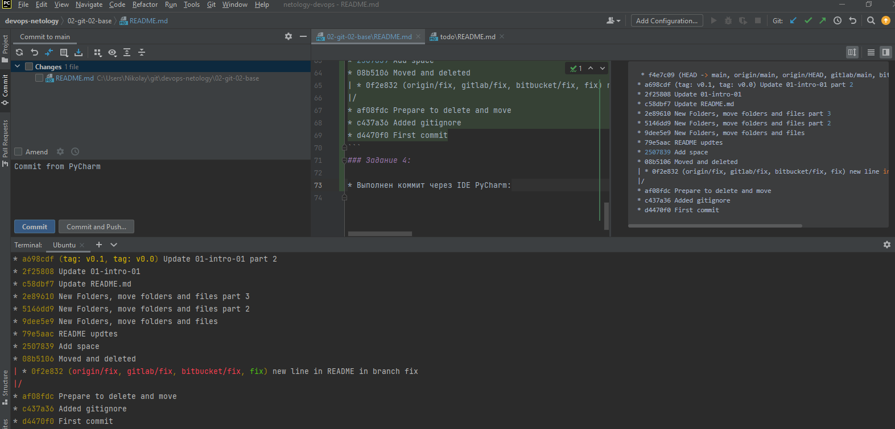

# Заголовок через PyCharm

## Для выполнения заданий было использовано:

### Задание 1:

* Созданы аккаунты на [gitlab](https://gitlab.com') и [bitbucket](https://bitbucket.org)
* Созданы репозитории devops-netology
* Командой `git remote -v` контролировался каждый шаг добавления удаленных репозиториев
* Добавлены репозитории `git remote add gitlab https://gitlab.com/kofe88/devops-netology.git` и `git remote add bitbucket git@bitbucket.org:kofe88/devops-netology.git`.
* Так же добавлены эти репозитории по ssh.
* Результат вывода команды `git remote -v`:
```bash
bitbucket       https://kofe88@bitbucket.org/kofe88/devops-netology.git (fetch)
bitbucket       https://kofe88@bitbucket.org/kofe88/devops-netology.git (push)
bitbucket-ssh   git@bitbucket.org:kofe88/devops-netology.git (fetch)
bitbucket-ssh   git@bitbucket.org:kofe88/devops-netology.git (push)
gitlab  https://gitlab.com/kofe88/devops-netology.git (fetch)
gitlab  https://gitlab.com/kofe88/devops-netology.git (push)
gitlab-ssh      git@gitlab.com:kofe88/devops-netology.git (fetch)
gitlab-ssh      git@gitlab.com:kofe88/devops-netology.git (push)
origin  https://github.com/kofe88/devops-netology.git (fetch)
origin  https://github.com/kofe88/devops-netology.git (push)
origin-ssh      git@github.com:kofe88/devops-netology.git (fetch)
origin-ssh      git@github.com:kofe88/devops-netology.git (push)
```
* Выполнен push в ветки main новых репозиториев: `git push gitlab main` и `git push bitbucket main`
* История коммитов совпадает.

### Задание 2:
* Создан легковестный тег `v0.0` на HEAD коммите и запушен во все три добавленных на предыдущем этапе репозитория (`upstream`).
* Создан аннотированный тег `v0.1` с описанием `annotated tag`.
```bash
tag v0.1
Tagger: Nikolay Fedorov <kofe88@mail.ru>
Date:   Fri Dec 3 00:36:45 2021 +0300

annotated tag

commit a698cdf1652b4bae96ef84208dc4eb910345cdd5 (tag: v0.1, tag: v0.0) 
```
* Теги в трех репозиториях проверены

### Задание 3:

* Переключились на ветку `main` - 'git checkout main'
* По логу коммитов `git log --oneline` нашли нужный, с комментарием `Prepare to delete and move`, его сокращенный хеш `af08fdc`
* Переключились на него `git checkout af08fdc`
* Создали новую ветку(branch) fix `git switch -c fix`
* Отправили ветку в основной репозиторий `git push origin fix`
* https://github.com/kofe88/devops-netology/network
* Изменили файл `README.md`, добавив новую строчку `Теперь в ветке fix`, коммит `new line in README in branch fix` и запушили во все 3 репозитория `git push origin fix`, `git push gitlab fix` и `git push bitbucket fix`
* Вывод `git log --oneline --graph --all`:
```bash
 * f4e7c09 (HEAD -> main, origin/main, origin/HEAD, gitlab/main, bitbucket/main) Commit from PyCharm
* a698cdf (tag: v0.1, tag: v0.0) Update 01-intro-01 part 2
* 2f25808 Update 01-intro-01
* c58dbf7 Update README.md
* 2e89610 New Folders, move folders and files part 3
* 5146dd9 New Folders, move folders and files part 2
* 9dee5e9 New Folders, move folders and files
* 79e5aac README updtes
* 2507839 Add space
* 08b5106 Moved and deleted
| * 0f2e832 (origin/fix, gitlab/fix, bitbucket/fix, fix) new line in README in branch fix
|/
* af08fdc Prepare to delete and move
* c437a36 Added gitignore
* d4470f0 First commit
```
### Задание 4:

* Выполнен коммит через IDE PyCharm:
