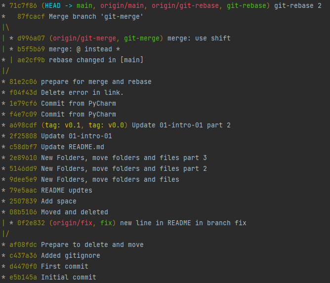

## Задание №1 – Ветвление, merge и rebase. 

1. Создали каталог `branching` и в нем два файла `merge.sh` и `rebase.sh` с 
содержимым:
```bash
#!/bin/bash
# display command line options

count=1
for param in "$*"; do
    echo "\$* Parameter #$count = $param"
    count=$(( $count + 1 ))
done
```

2. Создали коммит с описанием `prepare for merge and rebase` и отправим его в ветку `main`.
3. Создали ветку `git-merge` - `git checkout -b git-merge` и заменили в ней содержимое файла `merge.sh` на
```bash
#!/bin/bash
# display command line options

count=1
for param in "$@"; do
    echo "\$@ Parameter #$count = $param"
    count=$(( $count + 1 ))
done
``` 
4. Создали коммит `merge: @ instead *` отправьте изменения в репозиторий:
```bash
 git commit -m "merge: @ instead *"
[git-merge aea1902] merge: @ instead *
 1 file changed, 2 insertions(+), 2 deletions(-)
```

```bash
git push origin git-merge
Username for 'https://github.com': 
Password for 'https://kofe88@github.com':
Enumerating objects: 9, done.
Counting objects: 100% (9/9), done.
Delta compression using up to 4 threads
Compressing objects: 100% (5/5), done.
Writing objects: 100% (5/5), 467 bytes | 9.00 KiB/s, done.
Total 5 (delta 2), reused 0 (delta 0)
remote: Resolving deltas: 100% (2/2), completed with 2 local objects.
remote:
remote: Create a pull request for 'git-merge' on GitHub by visiting:
remote:      https://github.com/kofe88/devops-netology/pull/new/git-merge
remote:
To https://github.com/kofe88/devops-netology.git
 * [new branch]      git-merge -> git-merge
```
5. Внесли еще одно изменение в `merge.sh` 
```bash
#!/bin/bash
# display command line options

count=1
while [[ -n "$1" ]]; do
    echo "Parameter #$count = $1"
    count=$(( $count + 1 ))
    shift
done
```
и создали коммит `merge: use shift` и отправили изменения в репозиторий.

6. Вернулись в ветку `main` - `git switch main`
```bash
Switched to branch 'main'
Your branch is up to date with 'origin/main'.
```
7. Изменили содержимое файла `rebase.sh` на следующее
```bash
#!/bin/bash
# display command line options

count=1
for param in "$@"; do
    echo "\$@ Parameter #$count = $param"
    count=$(( $count + 1 ))
done

echo "====="
```
Выполнили коммит `git commit -m "Change rebase.sh in main"`
```bash
[main a090974] Change rebase.sh in main
 1 file changed, 4 insertions(+), 2 deletions(-)
```

и отправляем измененную ветку `main` в репозиторий:
```bash
git push origin main
Username for 'https://github.com': 
Password for 'https://kofe88@github.com':
Enumerating objects: 9, done.
Counting objects: 100% (9/9), done.
Delta compression using up to 4 threads
Compressing objects: 100% (5/5), done.
Writing objects: 100% (5/5), 482 bytes | 6.00 KiB/s, done.
Total 5 (delta 2), reused 0 (delta 0)
remote: Resolving deltas: 100% (2/2), completed with 2 local objects.
To https://github.com/kofe88/devops-netology.git
   8d89f9f..a090974  main -> main

```

8. При помощи команды `git log` нашли хэш коммита `prepare for merge and rebase` 
```bash
commit 81e2c06
Author: Nikolay Fedorov <kofe88@mail.ru>
Date:   Tue Dec 7 01:40:04 2021 +0300

    prepare for merge and rebase
```

и выполнили `git checkout 81e2c06`
```bash
Note: switching to '81e2c06'.

You are in 'detached HEAD' state. You can look around, make experimental
changes and commit them, and you can discard any commits you make in this
state without impacting any branches by switching back to a branch.

If you want to create a new branch to retain commits you create, you may
do so (now or later) by using -c with the switch command. Example:

  git switch -c <new-branch-name>

Or undo this operation with:

  git switch -

Turn off this advice by setting config variable advice.detachedHead to false

HEAD is now at 81e2c06 prepare for merge and rebase
```
9. Создали ветку `git-rebase` - `git checkout -b git-rebase`:
```bash
Switched to a new branch 'git-rebase'
```
И изменили содержимое файла `rebase.sh` на следующее:
```bash
#!/bin/bash
# display command line options

count=1
for param in "$@"; do
    echo "Parameter: $param"
    count=$(( $count + 1 ))
done

echo "====="
```
Создали коммит `git commit -m "git-rebase 1"` и отправили изменения в репозиторий `git push origin git-rebase`

10. Сделали еще один коммит `git-rebase 2`, заменив `echo "Parameter: $param"` 
на `echo "Next parameter: $param"` 

```bash
#!/bin/bash
# display command line options

count=1
for param in "$@"; do
    echo "Next parameter: $param"
    count=$(( $count + 1 ))
done

echo "====="
```

И выполнили пуш `git push origin git-rebase`:
```bash
Username for 'https://github.com': 
Password for 'https://kofe88@github.com':
Enumerating objects: 14, done.
Counting objects: 100% (14/14), done.
Delta compression using up to 4 threads
Compressing objects: 100% (10/10), done.
Writing objects: 100% (10/10), 924 bytes | 14.00 KiB/s, done.
Total 10 (delta 3), reused 0 (delta 0)
remote: Resolving deltas: 100% (3/3), completed with 1 local object.
remote:
remote: Create a pull request for 'git-rebase' on GitHub by visiting:
remote:      https://github.com/kofe88/devops-netology/pull/new/git-rebase
remote:
To https://github.com/kofe88/devops-netology.git
 * [new branch]      git-rebase -> git-rebase
```

#### Промежуточный итог.

На странице `network` такая схема:


#### Merge
Переключились на ветку `main` - `git switch main`.
Слиливетку `git-merge` в main и отправли изменения в репозиторий, получилось без конфликтов:
```bash
git merge git-merge
Merge made by the 'recursive' strategy.
 02-git-03-branching/branching/merge.sh | 5 +++--
 1 file changed, 3 insertions(+), 2 deletions(-)
```
```bash
git push
Username for 'https://github.com': 
Password for 'https://kofe88@github.com':
Enumerating objects: 10, done.
Counting objects: 100% (10/10), done.
Delta compression using up to 4 threads
Compressing objects: 100% (4/4), done.
Writing objects: 100% (4/4), 449 bytes | 8.00 KiB/s, done.
Total 4 (delta 1), reused 0 (delta 0)
remote: Resolving deltas: 100% (1/1), completed with 1 local object.
To https://github.com/kofe88/devops-netology.git
   a090974..c214ff7  main -> main

```  
В результате получили такую схему:


#### Rebase
1. Переключились на ветку `git-rebase` и выполняем `git rebase -i main`. 
В открывшемся диалоге два выполненных нами коммита, заодно объединили их в один, 
указав слева от нижнего `fixup`. 


В результате получили:
```bash
git rebase -i main
Auto-merging 02-git-03-branching/branching/rebase.sh
CONFLICT (content): Merge conflict in 02-git-03-branching/branching/rebase.sh
error: could not apply 03b3c72... git-rebase 1
Resolve all conflicts manually, mark them as resolved with
"git add/rm <conflicted_files>", then run "git rebase --continue".
You can instead skip this commit: run "git rebase --skip".
To abort and get back to the state before "git rebase", run "git rebase --abort".
Could not apply 03b3c72... git-rebase 1

``` 
Если посмотреть содержимое файла `rebase.sh`, то увидим метки, оставленные гитом для решения конфликта:
```bash
cat rebase.sh
#!/bin/bash
# display command line options
count=1
for param in "$@"; do
<<<<<<< HEAD
    echo "\$@ Parameter #$count = $param"
=======
    echo "Parameter: $param"
>>>>>>> dc4688f... git 2.3 rebase @ instead *
    count=$(( $count + 1 ))
done
```
Удалим метки, отдав предпочтение варианту
```bash
cat rebase.sh
#!/bin/bash
# display command line options
count=1
for param in "$@"; do
    echo "\$@ Parameter #$count = $param"
    count=$(( $count + 1 ))
done

```
сообщили гиту, что конфликт решен `git add rebase.sh` и продолжим ребейз `git rebase --continue`.

И опять в получим конфликт в файле `rebase.sh` при попытке применения нашего второго коммита. 
```bash
 git rebase --continue
Auto-merging 02-git-03-branching/branching/rebase.sh
CONFLICT (content): Merge conflict in 02-git-03-branching/branching/rebase.sh
error: could not apply 75e8a73... git-rebase 2
Resolve all conflicts manually, mark them as resolved with
"git add/rm <conflicted_files>", then run "git rebase --continue".
You can instead skip this commit: run "git rebase --skip".
To abort and get back to the state before "git rebase", run "git rebase --abort".
Could not apply 75e8a73... git-rebase 2
```
Давайте разрешим конфликт, оставив строчку `echo "Next parameter: $param"`.

Далее опять сообщаем гиту о том, что конфликт разрешен `git add rebase.sh` и продолжим ребейз `git rebase --continue`.
В результате будет открыт текстовый редактор предлагающий написать комментарий к новому объединенному коммиту:
```bash
# This is a combination of 2 commits.
# This is the 1st commit message:

Merge branch 'git-merge' into main

# The commit message #2 will be skipped:

# git-rebase 2

# Please enter the commit message for your changes. Lines starting
# with '#' will be ignored, and an empty message aborts the commit.
#

```
Все строчки начинающиеся на `#` будут проигнорированны. 

После сохранения изменения, гит сообщит
```bash
 git rebase --continue
[detached HEAD 93c9cba] Merge branch 'git-merge' into main
 Date: Tue Dec 7 02:24:38 2021 +0300
Successfully rebased and updated refs/heads/git-rebase.
```
И попробуем выполнить `git push`, либо `git push -u origin git-rebase` чтобы точно указать что и куда мы хотим запушить. 
Эта команда завершится с ошибкой:
```bash
git push -u origin git-rebase
Username for 'https://github.com': 
Password for 'https://kofe88@github.com':
To https://github.com/kofe88/devops-netology.git
 ! [rejected]        git-rebase -> git-rebase (non-fast-forward)
error: failed to push some refs to 'https://github.com/kofe88/devops-netology.git'
hint: Updates were rejected because the tip of your current branch is behind
hint: its remote counterpart. Integrate the remote changes (e.g.
hint: 'git pull ...') before pushing again.
hint: See the 'Note about fast-forwards' in 'git push --help' for details.

```
Это произошло, потому что мы пытаемся перезаписать историю. 
Чтобы гит позволил нам это сделать, давайте добавим флаг `force`:
```bash
git push -u origin git-rebase -f
Username for 'https://github.com': kofe88
Password for 'https://kofe88@github.com':
Enumerating objects: 13, done.
Counting objects: 100% (13/13), done.
Delta compression using up to 4 threads
Compressing objects: 100% (5/5), done.
Writing objects: 100% (5/5), 507 bytes | 10.00 KiB/s, done.
Total 5 (delta 2), reused 0 (delta 0)
remote: Resolving deltas: 100% (2/2), completed with 2 local objects.
To https://github.com/kofe88/devops-netology.git
 + 75e8a73...93c9cba git-rebase -> git-rebase (forced update)
Branch 'git-rebase' set up to track remote branch 'git-rebase' from 'origin'.

```

Теперь можно смержить ветку `git-rebase` в main без конфликтов и без дополнительного мерж-комита простой перемоткой. 
```bash
 git checkout main
 
Switched to branch 'main'
Your branch is up to date with 'origin/main'.
```
```bash
git merge git-rebase
git push
```

Если все верно, то получаем:

PyCharm:


```bash
git log --graph --oneline --all
```



Github -> Network:

