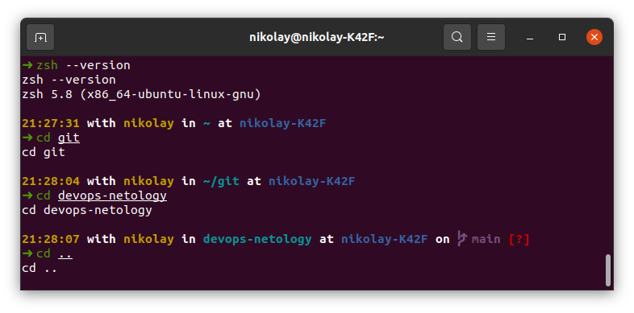
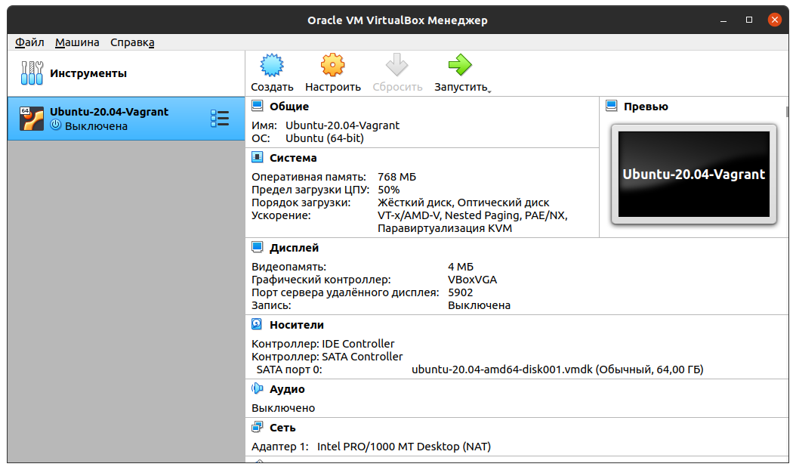

# Домашнее задание к занятию "3.1. Работа в терминале, лекция 1"

1. Установите средство виртуализации [Oracle VirtualBox](https://www.virtualbox.org/).

```bash
21:15:46 with nikolay in ~ at nikolay-K42F 
➜ vboxmanage --version
6.1.30r148432
```

2. Установите средство автоматизации [Hashicorp Vagrant](https://www.vagrantup.com/).

```bash
21:15:40 with nikolay in ~/Vagrant at nikolay-K42F 
➜ vagrant -v     
Vagrant 2.2.19
```

3. В вашем основном окружении подготовьте удобный для дальнейшей работы терминал. Можно предложить:

В Ubuntu установлено `zsh` и `ohmyzsh`. 

```bash
21:27:30 with nikolay in ~ at nikolay-K42F 
➜ zsh --version
zsh --version
zsh 5.8 (x86_64-ubuntu-linux-gnu)
```


В windows установлено `Windows Terminal` и `ohmyposh`.

4. С помощью базового файла конфигурации запустите Ubuntu 20.04 в VirtualBox посредством Vagrant:
 - Создайте директорию, в которой будут храниться конфигурационные файлы Vagrant. В ней выполните vagrant init. Замените содержимое Vagrantfile по умолчанию следующим:

 ```bash
 Vagrant.configure("2") do |config|
 	config.vm.box = "bento/ubuntu-20.04"
 end
 ```
#### Инициализация Vagrant

```bash
22:23:50 with nikolay in ~/vagrant at nikolay-K42F 
➜ vagrant init        
vagrant init
A `Vagrantfile` has been placed in this directory. You are now
ready to `vagrant up` your first virtual environment! Please read
the comments in the Vagrantfile as well as documentation on
`vagrantup.com` for more information on using Vagrant.
```

#### Редактирование `Vagrant` файла и запуск виртуальной машины

```bash
22:28:04 with nikolay in ~/vagrant at nikolay-K42F took 22s 
➜ cat Vagrantfile 
cat Vagrantfile
Vagrant.configure("2") do |config|
 	config.vm.box = "bento/ubuntu-20.04"
 end
```

 - Выполнение в этой директории vagrant up установит провайдер VirtualBox для Vagrant, скачает необходимый образ и запустит виртуальную машину. 

```bash
22:31:13 with nikolay in ~/vagrant at nikolay-K42F 
➜ vagrant up        
vagrant up
Bringing machine 'default' up with 'virtualbox' provider...
==> default: Importing base box 'bento/ubuntu-20.04'...
==> default: Matching MAC address for NAT networking...
==> default: Checking if box 'bento/ubuntu-20.04' version '202112.19.0' is up to date...
==> default: Setting the name of the VM: vagrant_default_1640201502095_59271
==> default: Clearing any previously set network interfaces...
==> default: Preparing network interfaces based on configuration...
    default: Adapter 1: nat
==> default: Forwarding ports...
    default: 22 (guest) => 2222 (host) (adapter 1)
==> default: Booting VM...
==> default: Waiting for machine to boot. This may take a few minutes...
    default: SSH address: 127.0.0.1:2222
    default: SSH username: vagrant
    default: SSH auth method: private key
    default: Warning: Connection reset. Retrying...
    default: Warning: Remote connection disconnect. Retrying...
    default: 
    default: Vagrant insecure key detected. Vagrant will automatically replace
    default: this with a newly generated keypair for better security.
    default: 
    default: Inserting generated public key within guest...
    default: Removing insecure key from the guest if it's present...
    default: Key inserted! Disconnecting and reconnecting using new SSH key...
==> default: Machine booted and ready!
==> default: Checking for guest additions in VM...
==> default: Mounting shared folders...
    default: /vagrant => /home/nikolay/vagrant
22:32:20 with nikolay in ~/vagrant at nikolay-K42F took 1m 2s 
```

- vagrant suspend выключит виртуальную машину с сохранением ее состояния (т.е., при следующем vagrant up будут запущены все процессы внутри, которые работали на момент вызова suspend), vagrant halt выключит виртуальную машину штатным образом.

#### Остановка виртуальной машины

```bash
23:02:53 with nikolay in ~/vagrant at nikolay-K42F took 34s 
➜ vagrant suspend
==> default: Saving VM state and suspending execution...
```

```bash
23:03:34 with nikolay in ~/vagrant at nikolay-K42F took 8s 
➜ vagrant up     
Bringing machine 'default' up with 'virtualbox' provider...
==> default: Checking if box 'bento/ubuntu-20.04' version '202112.19.0' is up to date...
==> default: Resuming suspended VM...
==> default: Booting VM...
==> default: Waiting for machine to boot. This may take a few minutes...
    default: SSH address: 127.0.0.1:2222
    default: SSH username: vagrant
    default: SSH auth method: private key
==> default: Machine booted and ready!
==> default: Machine already provisioned. Run `vagrant provision` or use the `--provision`
==> default: flag to force provisioning. Provisioners marked to run always will still run.
```

#### Выключение виртуальной машины

```bash
23:09:02 with nikolay in ~/vagrant at nikolay-K42F took 22s 
➜ vagrant halt
==> default: Attempting graceful shutdown of VM...
```
 
5. Ознакомьтесь с графическим интерфейсом VirtualBox, посмотрите как выглядит виртуальная машина, которую создал для вас Vagrant, какие аппаратные ресурсы ей выделены. Какие ресурсы выделены по-умолчанию?

#### Интерфейс


По умолчанию выделено:
- Оперативная память: 1 Гб
- Процессоры: 2 ядра
- Жесткий диск: 64 Гб

6. Ознакомьтесь с возможностями конфигурации VirtualBox через Vagrantfile: документация. Как добавить оперативной памяти или ресурсов процессора виртуальной машине?

#### Редактирование `Vagrantfile`

```bash
23:34:09 with nikolay in ~/vagrant at nikolay-K42F took 12s 
➜ cat Vagrantfile 
Vagrant.configure("2") do |config|
 	config.vm.box = "bento/ubuntu-20.04"
        config.vm.provider "virtualbox" do |v|
	      v.memory = 768
  	      v.cpus = 1
              v.name = "Ubuntu-20.04-Vagrant"
              v.customize ["modifyvm", :id, "--cpuexecutioncap", "50"]
        end      
 end
```

`v.name` - Имя ВМ

`v.memory` - Оперативная память

`v.cpus` - Ядра процессора

`config.customize ["modifyvm", :id, "--cpuexecutioncap", "50"]` - Предел загрузки CPU хоста. 



7. Команда vagrant ssh из директории, в которой содержится Vagrantfile, позволит вам оказаться внутри виртуальной машины без каких-либо дополнительных настроек. Попрактикуйтесь в выполнении обсуждаемых команд в терминале Ubuntu.

#### SSH в ВМ

```bash
23:37:06 with nikolay in ~/vagrant at nikolay-K42F took 53s 
➜ vagrant ssh
Welcome to Ubuntu 20.04.3 LTS (GNU/Linux 5.4.0-91-generic x86_64)
Documentation:  https://help.ubuntu.com
Management:     https://landscape.canonical.com
Support:        https://ubuntu.com/advantage
System information disabled due to load higher than 1.0

This system is built by the Bento project by Chef Software
More information can be found at https://github.com/chef/bento
vagrant@vagrant:~$
```

8. Ознакомиться с разделами man bash, почитать о настройках самого bash:

- какой переменной можно задать длину журнала history, и на какой строчке manual это описывается?

##### Длина журнала 

```bash
00:23:05 with nikolay in ~/vagrant at nikolay-K42F took 33s 
➜ man bash
```

Затем нажимаем `/` и вводим слово для поиска, например `history` и жмем `n` пока не найдем нужный раздел:

```bash
       HISTFILESIZE
              The  maximum  number of lines contained in the history file.  When this variable is assigned a value, the history file is truncated,
              if necessary, to contain no more than that number of lines by removing the oldest entries.  The history file is  also  truncated  to
              this  size  after writing it when a shell exits.  If the value is 0, the history file is truncated to zero size.  Non-numeric values
              and numeric values less than zero inhibit truncation.  The shell sets the default value to the value of HISTSIZE after  reading  any
              startup files.
       HISTIGNORE
              A colon-separated list of patterns used to decide which command lines should be saved on the history list.  Each pattern is anchored
              at the beginning of the line and must match the complete line (no implicit `*' is appended).  Each pattern  is  tested  against  the
              line  after  the  checks  specified  by  HISTCONTROL  are applied.  In addition to the normal shell pattern matching characters, `&'
              matches the previous history line.  `&' may be escaped using a backslash; the backslash is removed before attempting a  match.   The
              second and subsequent lines of a multi-line compound command are not tested, and are added to the history regardless of the value of
              HISTIGNORE.  The pattern matching honors the setting of the extglob shell option.
       HISTSIZE
              The number of commands to remember in the command history (see HISTORY below).  If the value is 0, commands are  not  saved  in  the
              history list.  Numeric values less than zero result in every command being saved on the history list (there is no limit).  The shell
              sets the default value to 500 after reading any startup files.
       HISTTIMEFORMAT
              If this variable is set and not null, its value is used as a format string for strftime(3) to print the time stamp  associated  with
              each  history  entry displayed by the history builtin.  If this variable is set, time stamps are written to the history file so they
              may be preserved across shell sessions.  This uses the history comment character to distinguish timestamps from other history lines.
       HOME   The home directory of the current user; the default argument for the cd builtin command.  The value of this variable  is  also  used
              when performing tilde expansion.
       HOSTFILE
              Contains  the  name of a file in the same format as /etc/hosts that should be read when the shell needs to complete a hostname.  The
              list of possible hostname completions may be changed while the shell is running; the next time hostname completion is attempted  af‐
              ter  the  value  is  changed, bash adds the contents of the new file to the existing list.  If HOSTFILE is set, but has no value, or
              does not name a readable file, bash attempts to read /etc/hosts to obtain the list of possible hostname completions.  When  HOSTFILE
              is unset, the hostname list is cleared.
       IFS    The  Internal  Field  Separator  that is used for word splitting after expansion and to split lines into words with the read builtin
              command.  The default value is ``<space><tab><newline>''.
       IGNOREEOF
              Controls the action of an interactive shell on receipt of an EOF character as the sole input.  If set, the value is  the  number  of
              consecutive  EOF  characters which must be typed as the first characters on an input line before bash exits.  If the variable exists
 Manual page bash(1) line 731 (press h for help or q to quit)
```

`HISTSIZE` - кол-во строк в истории, 744 строчка `man bash` 

`HISTFILESIZE` - размер файла истории, 731 строчка 'man bash'

Чтобы увеличить размер хранимой истории необходимо в файл ~/.bashrc добавить строки:

```bash
export HISTSIZE=10000 #для примера
export HISTFILESIZE=10000 #для примера

```
- что делает директива ignoreboth в bash?

##### Директива ignoreboth

В файл ~/.bashrc добавить строку:

```bash
export HISTCONTROL=ignoreboth

```
Опция `HISTCONTROL` контролирует каким образом список команд сохраняется в истории.

`ignorespace` — не сохранять строки начинающиеся с символа <пробел>

`ignoredups` — не сохранять строки, совпадающие с последней выполненной командой

`ignoreboth` — использовать обе опции ‘ignorespace’ и ‘ignoredups’

9. В каких сценариях использования применимы скобки `{}` и на какой строчке man bash это описано?

Вызываем справку:

`man bash`

Далее в поиске вводим

`/\{ `

И находим на 232 строчке:

```bash
       { list; }
              list  is simply executed in the current shell environment.  list must be terminated with a newline or semicolon.  This is known as a
              group command.  The return status is the exit status of list.  Note that unlike the metacharacters ( and ), {  and  }  are  reserved
              words  and must occur where a reserved word is permitted to be recognized.  Since they do not cause a word break, they must be sepa‐
              rated from list by whitespace or another shell metacharacter.
Manual page bash(1) line 232 (press h for help or q to quit)
```

Фигурные скобки используются для задания списка в командах, например:

```bash
00:42:04 with nikolay in ~/vagrant at nikolay-K42F took 8m 14s 
➜ sudo apt-get install php8.0 php8.0-{gd,xml,intl}
```

Что позволит сократить запись и сразу установить пакеты `php8.0-gd php8.0-xml php8.0-intl` .

10. С учётом ответа на предыдущий вопрос, как создать однократным вызовом touch 100000 файлов? Получится ли аналогичным образом создать 300000? Если нет, то почему?

```bash
vagrant@vagrant:~/test$ touch {1..100000}
```

300000 файлов создать не получится, есть ограничение на длину командной строки:

```bash
vagrant@vagrant:~/test$ touch {1..300000}
-bash: /usr/bin/touch: Argument list too long
```

Ограничение можно посмотреть следующей командой:

```bash
vagrant@vagrant:~/test$ getconf ARG_MAX
2097152
```

т.е. максимальная длина командной строки в байтах - 2097152

11. В man bash поищите по /\[\[. Что делает конструкция [[ -d /tmp ]]

```bash
[[ expression ]]
              Return a status of 0 or 1 depending on  the  evaluation  of  the
              conditional  expression expression.  Expressions are composed of
              the primaries described  below  under  CONDITIONAL  EXPRESSIONS.
              Word  splitting  and pathname expansion are not performed on the
              words between the [[ and  ]];  tilde  expansion,  parameter  and
              variable  expansion, arithmetic expansion, command substitution,
              process substitution, and quote removal are  performed.   Condi‐
              tional operators such as -f must be unquoted to be recognized as
              primaries.
```

Возвращает 0 или 1 в зависимости от выражения в скобках.

[[ -d /tmp ]] возвращает 1 если директория /tmp существует и 0 если нет, например:

```bash
  GNU nano 4.8                       test.sh                                  
#!/bin/bash
if [[ -d /tmp ]]
then
  echo Директория /tmp существует
  ls -ld /tmp
  exit 1
fi
```

```bash
vagrant@vagrant:~/test$ nano test.sh
vagrant@vagrant:~/test$ sudo chmod +x test.sh
vagrant@vagrant:~/test$ sudo ./test.sh 
Директория /tmp существует
drwxrwxrwt 10 root root 4096 Dec 22 21:57 /tmp
```

12. Основываясь на знаниях о просмотре текущих (например, PATH) и установке новых переменных; командах, которые мы рассматривали, добейтесь в выводе type -a bash в виртуальной машине наличия первым пунктом в списке:
```bash
bash is /tmp/new_path_directory/bash
bash is /usr/local/bin/bash
bash is /bin/bash
```
(прочие строки могут отличаться содержимым и порядком) В качестве ответа приведите команды, которые позволили вам добиться указанного вывода или соответствующие скриншоты.

```bash
vagrant@vagrant:~/test$ mkdir /tmp/new_path_directory && cp /usr/bin/bash /tmp/new_path_directory/ && export PATH="/tmp/new_path_directory:$PATH"
vagrant@vagrant:~/test$ type -a bash
bash is /tmp/new_path_directory/bash
bash is /usr/bin/bash
bash is /bin/bash
vagrant@vagrant:~/test$ 
```

13. Чем отличается планирование команд с помощью batch и at?

```bash
man at
```

```bash
DESCRIPTION
       at and batch read commands from standard input or  a  specified  file
       which are to be executed at a later time, using /bin/sh.
   <b>at</b>      executes commands at a specified time.

   <b>atq</b>     lists  the  user&apos;s pending jobs, unless the user is the supe‐
           ruser; in that case, everybody&apos;s jobs are listed.  The format
           of  the output lines (one for each job) is: Job number, date,
           hour, queue, and username.

   <b>atrm</b>    deletes jobs, identified by their job number.

   <b>batch</b>   executes commands when system load levels  permit;  in  other
           words,  when  the  load average drops below 1.5, or the value
           specified in the invocation of <b>atd</b>.

   <b>At</b> allows fairly complex time specifications, extending  the  POSIX.2
   standard.   It accepts times of the form <b>HH:MM</b> to run a job at a spe‐
   cific time of day.  (If that time is already past, the  next  day  is
   assumed.)   You may also specify <b>midnight,</b> <b>noon,</b> or <b>teatime</b> (4pm) and
   you can have a time-of-day suffixed with <b>AM</b> or <b>PM</b> for running in  the
   morning  or  the  evening.  You can also say what day the job will be
   ```

`at` - выполнение команд в определенное время.

`batch` - выполнение команд при достижении определенной нагрузки на систему.

14. Завершите работу виртуальной машины чтобы не расходовать ресурсы компьютера и/или батарею ноутбука.

```bash
vagrant@vagrant:~/test$ exit
logout
Connection to 127.0.0.1 closed.
01:43:59 with nikolay in ~/vagrant at nikolay-K42F took 51m 42s 
➜ vagrant halt

==> default: Attempting graceful shutdown of VM...

01:44:29 with nikolay in ~/vagrant at nikolay-K42F took 15s 
➜ 
```
