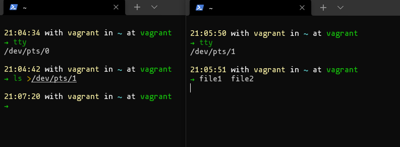
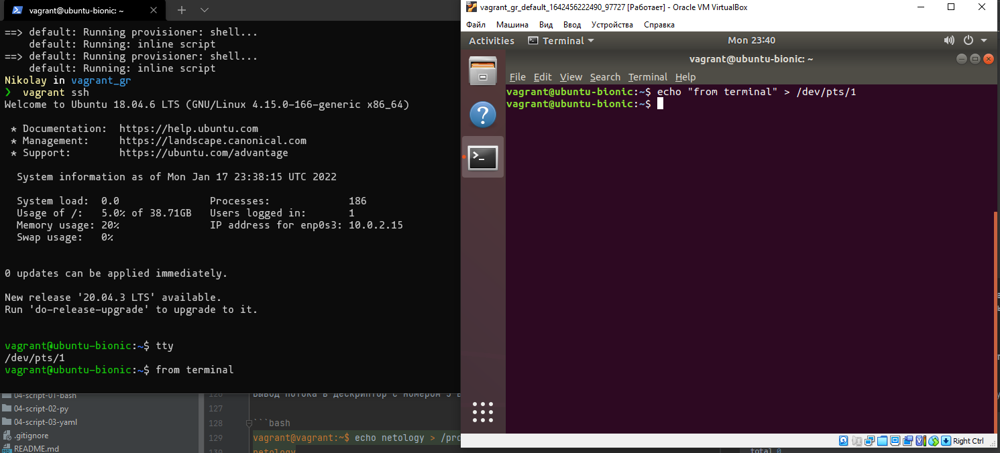

# Домашнее задание к занятию "3.2. Работа в терминале, лекция 2"

#### 1. Какого типа команда `cd`? Попробуйте объяснить, почему она именно такого типа; опишите ход своих мыслей, если считаете что она могла бы быть другого типа.

Воспользуемся командой `type`:

```bash
20:12:58 with vagrant in ~ at vagrant
➜ type cd
cd is a shell builtin
```

это внутренняя команда, которая встроена непосредственно в командный интерпретатор. Команды делаются встроенными либо из соображений производительности — встроенные команды исполняются быстрее, чем внешние, которые, как правило, запускаются в дочернем процессе, либо из-за необходимости прямого доступа к внутренним структурам командного интерпретатора.

#### 2. Какая альтернатива без pipe команде `grep <some_string> <some_file> | wc -l`? `man grep` поможет в ответе на этот вопрос. Ознакомьтесь с [документом](http://www.smallo.ruhr.de/award.html) о других подобных некорректных вариантах использования pipe.

Можно использовать параметр `-c` у `grep`:

```bash
General Output Control
       -c, --count
              Suppress normal output; instead print a count of matching lines for each  input  file.   With  the  -v,
              --invert-match option (see below), count non-matching lines.
```

Тогда строка `grep <some_string> <some_file> | wc -l` будет выглядеть так:

```bash
grep <some_string> <some_file> -c
```

#### 3. Какой процесс с PID `1` является родителем для всех процессов в вашей виртуальной машине Ubuntu 20.04?

Процесс `systemd`:

```bash

20:39:57 with vagrant in ~ at vagrant
➜ pstree -p -H 1
systemd(1)─┬─VBoxService(922)─┬─{VBoxService}(923)
           │                  ├─{VBoxService}(924)
```

#### 4. Как будет выглядеть команда, которая перенаправит вывод stderr `ls` на другую сессию терминала?

Например, если перенаправить из /dev/pts/0 в /dev/pts/1будет выглядеть следующим образом

Первый терминал:

```bash
21:04:34 with vagrant in ~ at vagrant
➜ tty
/dev/pts/0
```

Второй терминал:

```bash
21:05:50 with vagrant in ~ at vagrant
➜ tty
/dev/pts/1
```

Для проверки выведим `stdout` из Терминала 1 в Терминал 2:

```bash
21:04:42 with vagrant in ~ at vagrant
➜ ls >/dev/pts/1
```

Результат:



Аналогично с выводом потока `stderr`:

```bash
20:51:09 with vagrant in ~ at vagrant
➜ ls 2>/dev/pts/1
```

#### 5. Получится ли одновременно передать команде файл на stdin и вывести ее stdout в другой файл? Приведите работающий пример.

```bash
21:00:45 with vagrant in ~ at vagrant
➜ ls
file1  file2

21:00:48 with vagrant in ~ at vagrant
➜ cat file1
123
456
789
123

21:00:53 with vagrant in ~ at vagrant
➜ cat file2

21:00:58 with vagrant in ~ at vagrant
➜ wc -l 0<file1 > file2

21:01:11 with vagrant in ~ at vagrant
➜ cat file2
4
```

#### 6. Получится ли находясь в графическом режиме, вывести данные из PTY в какой-либо из эмуляторов TTY? Сможете ли вы наблюдать выводимые данные?

Да, выйдет.

Для проверки запустим в `vagrant` `ubuntu` с графическим интерфейсом:

Vagrantfile:

```bash
Vagrant.configure("2") do |config|
  config.vm.box = "ubuntu/bionic64"

  config.vm.provider :virtualbox do |v|
    v.gui = true
    v.memory = 4096
  end

  config.vm.provision :shell, inline: "sudo apt update -y"

  config.vm.provision :shell, inline: "sudo apt upgrade -y"

  config.vm.provision :shell, inline: "sudo apt install -y --no-install-recommends ubuntu-desktop"
  config.vm.provision :shell, inline: "sudo apt install -y --no-install-recommends virtualbox-guest-dkms virtualbox-guest-utils virtualbox-guest-x11"

  config.vm.provision :shell, inline: "sudo usermod -a -G sudo vagrant"

  config.vm.provision :shell, inline: "sudo shutdown -r now"
end
```

После зайдем в систему и в эмуляторе терминала выполним команду и перенаправим вывод в `tty` созданный в powershell командой `vagrant ssh`:



#### 7. Выполните команду `bash 5>&1`. К чему она приведет? Что будет, если вы выполните `echo netology > /proc/$$/fd/5`? Почему так происходит?

Создастся дескриптор с номером 5 и свяжется с stdout текущего процесса.

```bash
vagrant@vagrant:~$ bash 5>&1
vagrant@vagrant:~$ ls -l /proc/$$/fd/
total 0
lrwx------ 1 vagrant vagrant 64 Jan 17 21:28 0 -> /dev/pts/0
lrwx------ 1 vagrant vagrant 64 Jan 17 21:28 1 -> /dev/pts/0
lrwx------ 1 vagrant vagrant 64 Jan 17 21:28 2 -> /dev/pts/0
lrwx------ 1 vagrant vagrant 64 Jan 17 21:28 255 -> /dev/pts/0
lrwx------ 1 vagrant vagrant 64 Jan 17 21:26 5 -> /dev/pts/0
```

Вывод потока в дескриптор с номером 5 вызовет отображение в текущем терминале:

```bash
vagrant@vagrant:~$ echo netology > /proc/$$/fd/5
netology
```

#### 8. Получится ли в качестве входного потока для pipe использовать только stderr команды, не потеряв при этом отображение stdout на pty? Напоминаем: по умолчанию через pipe передается только stdout команды слева от `|` на stdin команды справа.
#### Это можно сделать, поменяв стандартные потоки местами через промежуточный новый дескриптор, который вы научились создавать в предыдущем вопросе.

Используя дескриптор из пункта 7, направим его на `stderr`, а затем `stderr` на `stdout`:

```bash
21:39:19 with vagrant in ~ at vagrant
➜ cat file3 5>&2 2>&1 | grep file
cat: file3: No such file or directory

21:39:22 with vagrant in ~ at vagrant
➜
```

#### 9. Что выведет команда `cat /proc/$$/environ`? Как еще можно получить аналогичный по содержанию вывод?

Выводит переменные среды окружения. Так же можно использовать `printenv`, `env`.

#### 10. Используя `man`, опишите что доступно по адресам `/proc/<PID>/cmdline`, `/proc/<PID>/exe`.

Используем `man`, `pipe` и `grep`:

`/proc/<PID>/cmdline`:

Это файл, доступный только для чтения, который содержит полную командную строку процесса, кроме зомби-процесса.

```bash
22:01:33 with vagrant in ~ at vagrant
➜ man proc | grep -n -B 3 -A 5 pid\]/cmdline

223:       /proc/[pid]/cmdline
224-              This  read-only  file  holds the complete command line for the process, unless the process is a zombie.  In
225-              the latter case, there is nothing in this file: that is, a read on this file will return 0 characters.  The
226-              command-line  arguments appear in this file as a set of strings separated by null bytes ('\0'), with a fur‐
227-              ther null byte after the last string.
228-
```

`/proc/<PID>/exe`:

Начиная с ядра Линукса 2.2 и выше этот файл - символическая ссылка содержащая актуальный путь запущенной программы.

```bash
22:04:44 with vagrant in ~ at vagrant
➜ man proc | grep -n -B 1 -A 5 pid\]/exe
275-
276:       /proc/[pid]/exe
277-              Under Linux 2.2 and later, this file is a symbolic link containing the actual pathname of the executed com‐
278-              mand.   This  symbolic  link  can be dereferenced normally; attempting to open it will open the executable.
279:              You can even type /proc/[pid]/exe to run another copy of the same executable that is being run  by  process
280-              [pid].   If  the pathname has been unlinked, the symbolic link will contain the string '(deleted)' appended
281-              to the original pathname.  In a multithreaded process, the contents of this symbolic link are not available
282-              if the main thread has already terminated (typically by calling pthread_exit(3)).
283-
```
#### 11. Узнайте, какую наиболее старшую версию набора инструкций SSE поддерживает ваш процессор с помощью `/proc/cpuinfo`.

Для этого используем команду `cat /proc/cpuinfo | grep sse`:

```bash
22:09:57 with vagrant in ~ at vagrant
➜ cat /proc/cpuinfo | grep sse
flags           : fpu vme de pse tsc msr pae mce cx8 apic sep mtrr pge mca cmov pat pse36 clflush mmx fxsr sse sse2 ht syscall nx rdtscp lm constant_tsc rep_good nopl xtopology nonstop_tsc cpuid tsc_known_freq pni pclmulqdq ssse3 cx16 pcid
sse4_1 sse4_2 x2apic movbe popcnt aes xsave avx rdrand hypervisor lahf_lm abm 3dnowprefetch invpcid_single pti fsgsbase avx2 invpcid rdseed clflushopt md_clear flush_l1d
flags           : fpu vme de pse tsc msr pae mce cx8 apic sep mtrr pge mca cmov pat pse36 clflush mmx fxsr sse sse2 ht syscall nx rdtscp lm constant_tsc rep_good nopl xtopology nonstop_tsc cpuid tsc_known_freq pni pclmulqdq ssse3 cx16 pcid
sse4_1 sse4_2 x2apic movbe popcnt aes xsave avx rdrand hypervisor lahf_lm abm 3dnowprefetch invpcid_single pti fsgsbase avx2 invpcid rdseed clflushopt md_clear flush_l1d
```

Старшая версия SSE - SSE4_2

#### 12. При открытии нового окна терминала и `vagrant ssh` создается новая сессия и выделяется pty. Это можно подтвердить командой `tty`, которая упоминалась в лекции 3.2. Однако:

```bash
     vagrant@netology1:~$ ssh localhost 'tty'
     not a tty
```

#### Почитайте, почему так происходит, и как изменить поведение.

Получаем такой же результат:

```bash
22:14:27 with vagrant in ~ at vagrant
➜ ssh localhost 'tty'
vagrant@localhost's password:
not a tty
```

По умолчанию, когда мы запускаем команду на удаленном компьютере с помощью ssh, для удаленного сеанса не выделяется TTY.
Однако, когда мы запускаем ssh без удаленной команды, он выделяет TTY, потому что мы, вероятно, будем запускать сеанс оболочки. Это ожидается от команды ssh localhost 'tty', но из-за предыдущего объяснения для этой команды недоступен TTY.
Если нам нужна оболочка, используем вместо это, что вызовет выделение TTY во время удаленного выполнения:

```bash
22:14:34 with vagrant in ~ at vagrant took 5s
➜ ssh -t localhost 'tty'
vagrant@localhost's password:
/dev/pts/2
Connection to localhost closed.
```

#### 13. Бывает, что есть необходимость переместить запущенный процесс из одной сессии в другую. Попробуйте сделать это, воспользовавшись `reptyr`. Например, так можно перенести в `screen` процесс, который вы запустили по ошибке в обычной SSH-сессии.

Запускаем например `tail -f /var/log/syslog` и жмем `ctrl+z`:

```bash
23:04:28 with vagrant in ~ at vagrant
➜ tail -f /var/log/syslog
Jan 17 23:03:30 vagrant systemd[1]: session-6.scope: Succeeded.
Jan 17 23:04:15 vagrant systemd[1]: Starting Refresh fwupd metadata and update motd...
Jan 17 23:04:15 vagrant dbus-daemon[653]: [system] Activating via systemd: service name='org.freedesktop.fwupd' unit='fwupd.service' requested by ':1.298' (uid=62803 pid=13796 comm="/usr/bin/fwupdmgr refresh " label="unconfined")
Jan 17 23:04:15 vagrant systemd[1]: Starting Firmware update daemon...
Jan 17 23:04:16 vagrant dbus-daemon[653]: [system] Successfully activated service 'org.freedesktop.fwupd'
Jan 17 23:04:16 vagrant systemd[1]: Started Firmware update daemon.
Jan 17 23:04:16 vagrant fwupdmgr[13796]: Updating lvfs
Jan 17 23:04:17 vagrant fwupdmgr[13796]: Successfully downloaded new metadata: 0 local devices supported
Jan 17 23:04:17 vagrant systemd[1]: fwupd-refresh.service: Succeeded.
Jan 17 23:04:17 vagrant systemd[1]: Finished Refresh fwupd metadata and update motd.
^Z
[1]  + 13896 suspended  tail -f /var/log/syslog
```

Затем `bg` чтобы отправить процесс в фон.

Используем `jobs -l` чтобы посмотреть процессы запущенные в фоне.

Выполняем `disown <id>` чтобы отвязать процесс от текущего родителя.

```bash
23:05:21 with vagrant in ~ at vagrant took 3s
✦ ➜ ps -a
    PID TTY          TIME CMD
   5868 pts/0    00:00:00 bash
   5874 pts/0    00:00:04 zsh
  13896 pts/1    00:00:00 tail
  13930 pts/1    00:00:00 ps
```

Запускаем `screen`:

```bash
23:06:18 with vagrant in ~ at vagrant
✦ ➜ screen -S tail
```

Выполняем `reptyr`:

```bash
23:07:35 with vagrant in ~ at vagrant
➜ reptyr 13896
```
и получаем ошибку:

```bash
23:07:35 with vagrant in ~ at vagrant
➜ reptyr 13896
Unable to attach to pid 13896: Operation not permitted
The kernel denied permission while attaching. If your uid matches
the target's, check the value of /proc/sys/kernel/yama/ptrace_scope.
For more information, see /etc/sysctl.d/10-ptrace.conf
```
Нужно поправить права в файле `/proc/sys/kernel/yama/ptrace_scope`, сменить 0 на 1 чтобы не было ошибки при вызове `reptyr` в `screen`:

`sudo nano /proc/sys/kernel/yama/ptrace_scope`

Возвращаемся в `screen` :

```bash
23:08:48 with vagrant in ~ at vagrant
✦ ➜ screen -S tail
```

Запускаем `reptyr`:

```bash
23:08:53 with vagrant in ~ at vagrant
➜ reptyr 13896
```

Замтем нажимаем `ctrl+a` и `d`

Получаем результат:

```bash
[detached from 14097.tail]
23:09:14 with vagrant in ~ at vagrant took 42s
✦ ➜ ps -a
    PID TTY          TIME CMD
   5868 pts/0    00:00:00 bash
   5874 pts/0    00:00:04 zsh
  14028 pts/2    00:00:00 reptyr
  14029 pts/1    00:00:00 tail <defunct>
  14063 pts/1    00:00:00 ps
```

#### 14. `sudo echo string > /root/new_file` не даст выполнить перенаправление под обычным пользователем, так как перенаправлением занимается процесс shell'а, который запущен без `sudo` под вашим пользователем. Для решения данной проблемы можно использовать конструкцию `echo string | sudo tee /root/new_file`. Узнайте что делает команда `tee` и почему в отличие от `sudo echo` команда с `sudo tee` будет работать.

`tee` используется для разделения выводимых программой данных, таким образом данные могут быть использованы для вывода на дисплей и сохранены в файл. Также команда может быть использована для получения промежуточных данных до того, как они будут изменены другой программой или командой. Команда `tee` считывает стандартный ввод (`stdin`), после чего записывает его в стандартный вывод (`stdout`) и одновременно копирует его в подготовленный файл или переменную. 

Синтаксис:
`tee [ -a ] [ -i ] [ File ... ]`
Переменные:

`File` Один, или более, файл, который примет данные от `tee`.
Флаги:

`-a` Дописать выходящие данные в конец файла, не перезаписывая его содержимого.

`-i` Игнорировать ошибки.
 
В данном примере `echo string | sudo tee /root/new_file` на экран будет выведена строка `string`, а так же она будет записана в файл `/root/new_file`. Если файла нет, он создастся. 

 ---

## Как сдавать задания

Обязательными к выполнению являются задачи без указания звездочки. Их выполнение необходимо для получения зачета и диплома о профессиональной переподготовке.

Задачи со звездочкой (*) являются дополнительными задачами и/или задачами повышенной сложности. Они не являются обязательными к выполнению, но помогут вам глубже понять тему.

Домашнее задание выполните в файле readme.md в github репозитории. В личном кабинете отправьте на проверку ссылку на .md-файл в вашем репозитории.

Также вы можете выполнить задание в [Google Docs](https://docs.google.com/document/u/0/?tgif=d) и отправить в личном кабинете на проверку ссылку на ваш документ.
Название файла Google Docs должно содержать номер лекции и фамилию студента. Пример названия: "1.1. Введение в DevOps — Сусанна Алиева".

Если необходимо прикрепить дополнительные ссылки, просто добавьте их в свой Google Docs.

Перед тем как выслать ссылку, убедитесь, что ее содержимое не является приватным (открыто на комментирование всем, у кого есть ссылка), иначе преподаватель не сможет проверить работу. Чтобы это проверить, откройте ссылку в браузере в режиме инкогнито.

[Как предоставить доступ к файлам и папкам на Google Диске](https://support.google.com/docs/answer/2494822?hl=ru&co=GENIE.Platform%3DDesktop)

[Как запустить chrome в режиме инкогнито ](https://support.google.com/chrome/answer/95464?co=GENIE.Platform%3DDesktop&hl=ru)

[Как запустить  Safari в режиме инкогнито ](https://support.apple.com/ru-ru/guide/safari/ibrw1069/mac)

Любые вопросы по решению задач задавайте в чате учебной группы.

---
