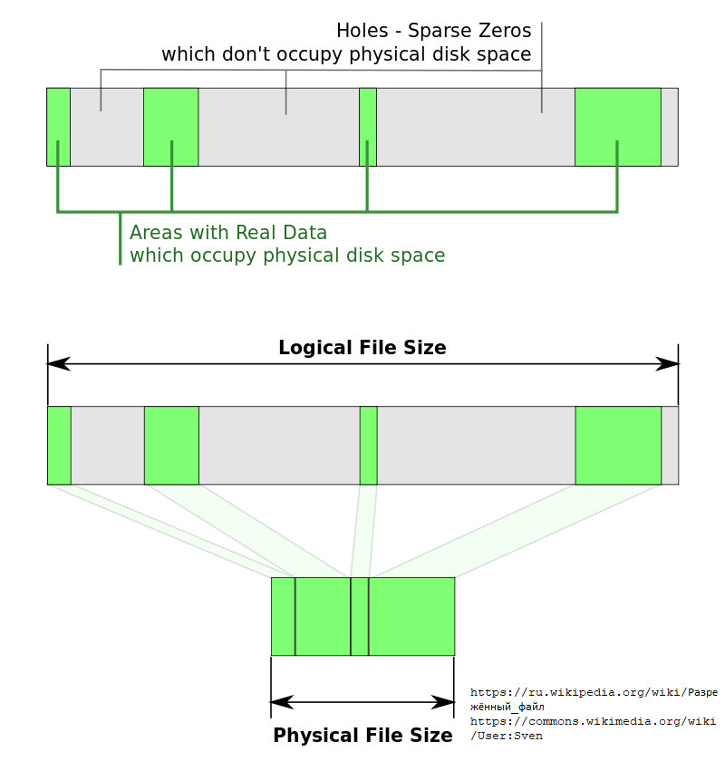
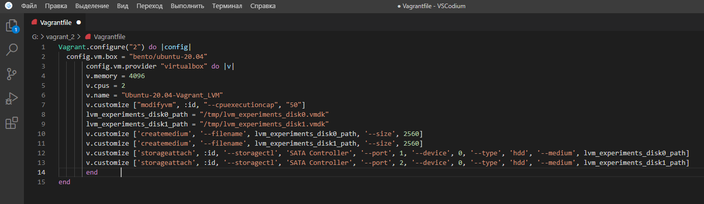
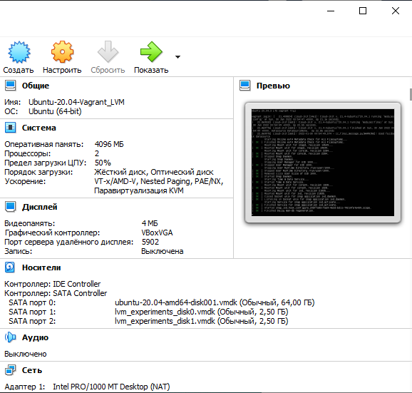

# Домашнее задание к занятию "3.5. Файловые системы"

#### 1. Узнайте о [sparse](https://ru.wikipedia.org/wiki/%D0%A0%D0%B0%D0%B7%D1%80%D0%B5%D0%B6%D1%91%D0%BD%D0%BD%D1%8B%D0%B9_%D1%84%D0%B0%D0%B9%D0%BB) (разряженных) файлах.

Разрежённый файл (англ. sparse file) — файл, в котором последовательности нулевых байтов[1] заменены на информацию об этих последовательностях (список дыр).

Дыра (англ. hole) — последовательность нулевых байт внутри файла, не записанная на диск. Информация о дырах (смещение от начала файла в байтах и количество байт) хранится в метаданных ФС.

##### Преимущества и недостатки

Преимущества:

- экономия дискового пространства. Использование разрежённых файлов считается одним из способов сжатия данных на уровне файловой системы;

- отсутствие временных затрат на запись нулевых байт;

- увеличение срока службы запоминающих устройств.

Недостатки:

- накладные расходы на работу со списком дыр;

- фрагментация файла при частой записи данных в дыры;

- невозможность записи данных в дыры при отсутствии свободного места на диске;

- невозможность использования других индикаторов дыр, кроме нулевых байт.

Поддержка

Для реализации поддержки разрежённых файлов требуются:

- возможность записи метаданных в ФС;

- поддержка со стороны системного и прикладного ПО.

Следующие ФС поддерживают разрежённые файлы: `BTRFS, NILFS, ZFS, NTFS[2], ext2, ext3, ext4, XFS, JFS, ReiserFS, Reiser4, UFS, Rock Ridge, UDF, ReFS, APFS, F2FS.`

Следующее ПО поддерживает работу с разрежёнными файлами:

- `uTorrent` — клиент файлообменной сети, работающей по протоколу BitTorrent;
- `eMule` — клиент файлообменной сети eDonkey2000;
- `Far manager` — файловый менеджер;
- `VirtualBox` — виртуальная машина;
- и другое.
- 
Применение

Разрежённые файлы используются для хранения контейнеров, например:

- образов дисков виртуальных машин;
- резервных копий дисков и/или разделов, созданных спец. ПО.



Cоздание разрежённого файла размером 200 Гб:

```bash
dd if=/dev/zero of=./sparse-file bs=1 count=0 seek=200G
```

или

```bash
truncate -s200G ./sparse-file
```


преобразование обычного файла в разрежённый (выполнение поиска дыр и записи их расположения (смещений и длин) в метаданные файла):

```bash
cp --sparse=always ./simple-file ./sparse-file
```

сохранение копии диска в разрежённый файл утилитой ddrescue:

```bash
ddrescue --sparse /dev/sdb ./sparse-file ./history.log
```

Создадим такой файл:

```bash
00:45:07 with vagrant in ~/05 at vagrant
➜ dd if=/dev/zero of=./sparse-file bs=1 count=0 seek=1GB
0+0 records in
0+0 records out
0 bytes copied, 8.4728e-05 s, 0.0 kB/s
```

```bash
00:45:09 with vagrant in ~/05 at vagrant
➜ ls -alh
total 64K
drwxrwxr-x  2 vagrant vagrant 4.0K Jan 30 00:45 .
drwxr-xr-x 10 vagrant vagrant  60K Jan 30 00:45 ..
-rw-rw-r--  1 vagrant vagrant 954M Jan 30 00:45 sparse-file
```

```bash
00:45:45 with vagrant in ~/05 at vagrant
➜ file sparse-file
sparse-file: data
```

```bash
00:46:14 with vagrant in ~/05 at vagrant
➜ stat sparse-file
  File: sparse-file
  Size: 1000000000      Blocks: 0          IO Block: 4096   regular file
Device: fd00h/64768d    Inode: 1052774     Links: 1
Access: (0664/-rw-rw-r--)  Uid: ( 1000/ vagrant)   Gid: ( 1000/ vagrant)
Access: 2022-01-30 00:46:14.645253201 +0000
Modify: 2022-01-30 00:45:09.696795455 +0000
Change: 2022-01-30 00:45:09.696795455 +0000
 Birth: -
```


#### 2. Могут ли файлы, являющиеся жесткой ссылкой на один объект, иметь разные права доступа и владельца? Почему?

Жесткая ссылка и файл, для которой она создавалась имеют одинаковые inode. Поэтому жесткая ссылка имеет те же права доступа, владельца и время последней модификации, что и целевой файл. Различаются только имена файлов. Фактически жесткая ссылка это еще одно имя для файла.

Жесткая ссылка (hard link) является своего рода синонимом для существующего файла. Когда вы создаете жесткую ссылку, создается дополнительный указатель на существующий файл, но не копия файла.

Жесткие ссылки выглядят в файловой структуре как еще один файл. Если вы создаете жесткую ссылку в том же каталоге, где находится целевой файл, то они должны иметь разные имена. Жесткая ссылка на файл должна находится в той же файловой системе, где и другие жесткие ссылки на этот файл.

На примере:

Создадим файл `file_1`:

```bash
23:10:23 with vagrant in ~/05 at vagrant
➜ touch file_1
```

Посмотрим информацию о нем:

```bash
23:10:43 with vagrant in ~/05 at vagrant
➜ stat file_1
  File: file_1
  Size: 0               Blocks: 0          IO Block: 4096   regular empty file
Device: fd00h/64768d    Inode: 1052779     Links: 1
Access: (0664/-rw-rw-r--)  Uid: ( 1000/ vagrant)   Gid: ( 1000/ vagrant)
Access: 2022-01-30 23:10:43.400355196 +0000
Modify: 2022-01-30 23:10:43.400355196 +0000
Change: 2022-01-30 23:10:43.400355196 +0000
 Birth: -
```

Создадим жесткую ссылку на файл:

```bash
23:11:00 with vagrant in ~/05 at vagrant
➜ ln file_1 file_2
```
Посмотрим информацию о файле `file2`, всё идентично, т.к. это по сути один файл:

```bash
23:11:22 with vagrant in ~/05 at vagrant
➜ stat file_2
  File: file_2
  Size: 0               Blocks: 0          IO Block: 4096   regular empty file
Device: fd00h/64768d    Inode: 1052779     Links: 2
Access: (0664/-rw-rw-r--)  Uid: ( 1000/ vagrant)   Gid: ( 1000/ vagrant)
Access: 2022-01-30 23:10:43.400355196 +0000
Modify: 2022-01-30 23:10:43.400355196 +0000
Change: 2022-01-30 23:11:22.344355047 +0000
 Birth: -
```

Изменим права у созданного файла `file_2`, т.е. у жесткой ссылки:

```bash
23:11:26 with vagrant in ~/05 at vagrant
➜ chmod 655 file_2
```

Посмотрим информацию о `file_2`:

```bash
23:13:38 with vagrant in ~/05 at vagrant
➜ stat file_2
  File: file_2
  Size: 0               Blocks: 0          IO Block: 4096   regular empty file
Device: fd00h/64768d    Inode: 1052779     Links: 2
Access: (0655/-rw-r-xr-x)  Uid: ( 1000/ vagrant)   Gid: ( 1000/ vagrant)
Access: 2022-01-30 23:10:43.400355196 +0000
Modify: 2022-01-30 23:10:43.400355196 +0000
Change: 2022-01-30 23:13:38.268354529 +0000
 Birth: -
```

Посмотрим информацию о `file_1`, права тоже изменились, т.к. это по сути один и тот же файл:

```bash
23:13:42 with vagrant in ~/05 at vagrant
➜ stat file_1
  File: file_1
  Size: 0               Blocks: 0          IO Block: 4096   regular empty file
Device: fd00h/64768d    Inode: 1052779     Links: 2
Access: (0655/-rw-r-xr-x)  Uid: ( 1000/ vagrant)   Gid: ( 1000/ vagrant)
Access: 2022-01-30 23:10:43.400355196 +0000
Modify: 2022-01-30 23:10:43.400355196 +0000
Change: 2022-01-30 23:13:38.268354529 +0000
 Birth: -
 ```


#### 3. Сделайте `vagrant destroy` на имеющийся инстанс Ubuntu. Замените содержимое Vagrantfile следующим:

    ```bash
    Vagrant.configure("2") do |config|
      config.vm.box = "bento/ubuntu-20.04"
      config.vm.provider :virtualbox do |vb|
        lvm_experiments_disk0_path = "/tmp/lvm_experiments_disk0.vmdk"
        lvm_experiments_disk1_path = "/tmp/lvm_experiments_disk1.vmdk"
        vb.customize ['createmedium', '--filename', lvm_experiments_disk0_path, '--size', 2560]
        vb.customize ['createmedium', '--filename', lvm_experiments_disk1_path, '--size', 2560]
        vb.customize ['storageattach', :id, '--storagectl', 'SATA Controller', '--port', 1, '--device', 0, '--type', 'hdd', '--medium', lvm_experiments_disk0_path]
        vb.customize ['storageattach', :id, '--storagectl', 'SATA Controller', '--port', 2, '--device', 0, '--type', 'hdd', '--medium', lvm_experiments_disk1_path]
      end
    end
    ```

#### Данная конфигурация создаст новую виртуальную машину с двумя дополнительными неразмеченными дисками по 2.5 Гб.

Заменяем `Vagrantfile` следующим содержимым:



Выполняем `vagrant up`:

```bash
Nikolay in vagrant_2
❯  codium .\Vagrantfile
Nikolay in vagrant_2
❯  vagrant up
Bringing machine 'default' up with 'virtualbox' provider...
==> default: Importing base box 'bento/ubuntu-20.04'...
==> default: Matching MAC address for NAT networking...
==> default: Checking if box 'bento/ubuntu-20.04' version '202112.19.0' is up to date...
==> default: Setting the name of the VM: Ubuntu-20.04-Vagrant_LVM
==> default: Fixed port collision for 22 => 2222. Now on port 2200.
==> default: Clearing any previously set network interfaces...
==> default: Preparing network interfaces based on configuration...
    default: Adapter 1: nat
==> default: Forwarding ports...
    default: 22 (guest) => 2200 (host) (adapter 1)
==> default: Running 'pre-boot' VM customizations...
==> default: Booting VM...
==> default: Waiting for machine to boot. This may take a few minutes...
    default: SSH address: 127.0.0.1:2200
    default: SSH username: vagrant
    default: SSH auth method: private key
    default: Warning: Connection reset. Retrying...
    default: Warning: Connection aborted. Retrying...
    default:
    default: Vagrant insecure key detected. Vagrant will automatically replace
    default: this with a newly generated keypair for better security.
    default:
    default: Inserting generated public key within guest...
    default: Removing insecure key from the guest if it's present...
    default: Key inserted! Disconnecting and reconnecting using new SSH key...
==> default: Machine booted and ready!
==> default: Checking for guest additions in VM...
==> default: Mounting shared folders...
    default: /vagrant => G:/vagrant_2
```



#### 4. Используя `fdisk`, разбейте первый диск на 2 раздела: 2 Гб, оставшееся пространство.

Выполняем `sudo fdisk -l`:

```bash
vagrant@vagrant:~$ sudo fdisk -l

Disk /dev/sda: 64 GiB, 68719476736 bytes, 134217728 sectors
Disk model: VBOX HARDDISK
Units: sectors of 1 * 512 = 512 bytes
Sector size (logical/physical): 512 bytes / 512 bytes
I/O size (minimum/optimal): 512 bytes / 512 bytes
Disklabel type: gpt
Disk identifier: B4F1CD46-1589-455C-BA21-5171874A019C

Device       Start       End   Sectors Size Type
/dev/sda1     2048      4095      2048   1M BIOS boot
/dev/sda2     4096   2101247   2097152   1G Linux filesystem
/dev/sda3  2101248 134215679 132114432  63G Linux filesystem


Disk /dev/sdb: 2.51 GiB, 2684354560 bytes, 5242880 sectors
Disk model: VBOX HARDDISK
Units: sectors of 1 * 512 = 512 bytes
Sector size (logical/physical): 512 bytes / 512 bytes
I/O size (minimum/optimal): 512 bytes / 512 bytes


Disk /dev/sdc: 2.51 GiB, 2684354560 bytes, 5242880 sectors
Disk model: VBOX HARDDISK
Units: sectors of 1 * 512 = 512 bytes
Sector size (logical/physical): 512 bytes / 512 bytes
I/O size (minimum/optimal): 512 bytes / 512 bytes


Disk /dev/mapper/ubuntu--vg-ubuntu--lv: 31.51 GiB, 33822867456 bytes, 66060288 sectors
Units: sectors of 1 * 512 = 512 bytes
Sector size (logical/physical): 512 bytes / 512 bytes
I/O size (minimum/optimal): 512 bytes / 512 bytes
```

Выбираем нужный диск `sudo fdisk /dev/sdb` и размечаем его:

```bash
vagrant@vagrant:~$ sudo fdisk /dev/sdb

Welcome to fdisk (util-linux 2.34).
Changes will remain in memory only, until you decide to write them.
Be careful before using the write command.

Device does not contain a recognized partition table.
Created a new DOS disklabel with disk identifier 0x7b3a8d07.

Command (m for help): n
Partition type
   p   primary (0 primary, 0 extended, 4 free)
   e   extended (container for logical partitions)
Select (default p): p
Partition number (1-4, default 1): 1
First sector (2048-5242879, default 2048):
Last sector, +/-sectors or +/-size{K,M,G,T,P} (2048-5242879, default 5242879): +2GB

Created a new partition 1 of type 'Linux' and of size 1.9 GiB.

Command (m for help): n
Partition type
   p   primary (1 primary, 0 extended, 3 free)
   e   extended (container for logical partitions)
Select (default p): p
Partition number (2-4, default 2): 2
First sector (3907584-5242879, default 3907584):
Last sector, +/-sectors or +/-size{K,M,G,T,P} (3907584-5242879, default 5242879):

Created a new partition 2 of type 'Linux' and of size 652 MiB.

Command (m for help): w
The partition table has been altered.
Calling ioctl() to re-read partition table.
Syncing disks.
```

Посмотрим вновь информацию о дисках:

```bash
vagrant@vagrant:~$ sudo fdisk -l

Disk /dev/sda: 64 GiB, 68719476736 bytes, 134217728 sectors
Disk model: VBOX HARDDISK
Units: sectors of 1 * 512 = 512 bytes
Sector size (logical/physical): 512 bytes / 512 bytes
I/O size (minimum/optimal): 512 bytes / 512 bytes
Disklabel type: gpt
Disk identifier: B4F1CD46-1589-455C-BA21-5171874A019C

Device       Start       End   Sectors Size Type
/dev/sda1     2048      4095      2048   1M BIOS boot
/dev/sda2     4096   2101247   2097152   1G Linux filesystem
/dev/sda3  2101248 134215679 132114432  63G Linux filesystem


Disk /dev/sdb: 2.51 GiB, 2684354560 bytes, 5242880 sectors
Disk model: VBOX HARDDISK
Units: sectors of 1 * 512 = 512 bytes
Sector size (logical/physical): 512 bytes / 512 bytes
I/O size (minimum/optimal): 512 bytes / 512 bytes
Disklabel type: dos
Disk identifier: 0x7b3a8d07

Device     Boot   Start     End Sectors  Size Id Type
/dev/sdb1          2048 3907583 3905536  1.9G 83 Linux
/dev/sdb2       3907584 5242879 1335296  652M 83 Linux


Disk /dev/sdc: 2.51 GiB, 2684354560 bytes, 5242880 sectors
Disk model: VBOX HARDDISK
Units: sectors of 1 * 512 = 512 bytes
Sector size (logical/physical): 512 bytes / 512 bytes
I/O size (minimum/optimal): 512 bytes / 512 bytes


Disk /dev/mapper/ubuntu--vg-ubuntu--lv: 31.51 GiB, 33822867456 bytes, 66060288 sectors
Units: sectors of 1 * 512 = 512 bytes
Sector size (logical/physical): 512 bytes / 512 bytes
I/O size (minimum/optimal): 512 bytes / 512 bytes
```

#### 5. Используя `sfdisk`, перенесите данную таблицу разделов на второй диск.

Первый способ:

```bash
sfdisk -d /dev/sdb > partitions.txt
sfdisk /dev/sdc < partitions.txt
```

Второй способ:

```bash
sfdisk -d /dev/sdb | sfdisk /dev/sdc
```

Воспользуемся вторым способом:

```bash
vagrant@vagrant:~$ sudo sfdisk -d /dev/sdb | sudo sfdisk /dev/sdc
Checking that no-one is using this disk right now ... OK

Disk /dev/sdc: 2.51 GiB, 2684354560 bytes, 5242880 sectors
Disk model: VBOX HARDDISK
Units: sectors of 1 * 512 = 512 bytes
Sector size (logical/physical): 512 bytes / 512 bytes
I/O size (minimum/optimal): 512 bytes / 512 bytes

>>> Script header accepted.
>>> Script header accepted.
>>> Script header accepted.
>>> Script header accepted.
>>> Created a new DOS disklabel with disk identifier 0x7b3a8d07.
/dev/sdc1: Created a new partition 1 of type 'Linux' and of size 1.9 GiB.
/dev/sdc2: Created a new partition 2 of type 'Linux' and of size 652 MiB.
/dev/sdc3: Done.

New situation:
Disklabel type: dos
Disk identifier: 0x7b3a8d07

Device     Boot   Start     End Sectors  Size Id Type
/dev/sdc1          2048 3907583 3905536  1.9G 83 Linux
/dev/sdc2       3907584 5242879 1335296  652M 83 Linux

The partition table has been altered.
Calling ioctl() to re-read partition table.
Syncing disks.
```

#### 6. Соберите `mdadm` RAID1 на паре разделов 2 Гб.

Собираем `RAID1` на разделах `/dev/sdb1` и `/dev/sdc1` :

```bash
vagrant@vagrant:~$ sudo mdadm --create --verbose /dev/md0 -l 1 -n 2 /dev/sd{b1,c1}
mdadm: Note: this array has metadata at the start and
    may not be suitable as a boot device.  If you plan to
    store '/boot' on this device please ensure that
    your boot-loader understands md/v1.x metadata, or use
    --metadata=0.90
mdadm: size set to 1950720K
Continue creating array?
Continue creating array? (y/n) y
mdadm: Defaulting to version 1.2 metadata
mdadm: array /dev/md0 started.
```

Проверим например так:

```bash
vagrant@vagrant:~$ sudo fdisk -l
...
Disk /dev/md0: 1.88 GiB, 1997537280 bytes, 3901440 sectors
Units: sectors of 1 * 512 = 512 bytes
Sector size (logical/physical): 512 bytes / 512 bytes
I/O size (minimum/optimal): 512 bytes / 512 bytes
```
#### 7. Соберите `mdadm` RAID0 на второй паре маленьких разделов.

Собираем `RAID0` на разделах `/dev/sdb2` и `/dev/sdc2` :

```bash
vagrant@vagrant:~$ sudo mdadm --create --verbose /dev/md1 -l 0 -n 2 /dev/sd{b2,c2}
mdadm: chunk size defaults to 512K
mdadm: Defaulting to version 1.2 metadata
mdadm: array /dev/md1 started.
```

Проверим результат:

```bash
vagrant@vagrant:~$ sudo fdisk -l
...
Disk /dev/md0: 1.88 GiB, 1997537280 bytes, 3901440 sectors
Units: sectors of 1 * 512 = 512 bytes
Sector size (logical/physical): 512 bytes / 512 bytes
I/O size (minimum/optimal): 512 bytes / 512 bytes


Disk /dev/md1: 1.28 GiB, 1363148800 bytes, 2662400 sectors
Units: sectors of 1 * 512 = 512 bytes
Sector size (logical/physical): 512 bytes / 512 bytes
I/O size (minimum/optimal): 524288 bytes / 1048576 bytes
```

Или через `lsblk`:

```bash
vagrant@vagrant:~$ lsblk
NAME                      MAJ:MIN RM  SIZE RO TYPE  MOUNTPOINT
loop0                       7:0    0 32.3M  1 loop  /snap/snapd/12704
loop1                       7:1    0 55.4M  1 loop  /snap/core18/2128
loop2                       7:2    0 70.3M  1 loop  /snap/lxd/21029
loop3                       7:3    0 43.4M  1 loop  /snap/snapd/14549
loop4                       7:4    0 55.5M  1 loop  /snap/core18/2284
loop5                       7:5    0 61.9M  1 loop  /snap/core20/1328
loop6                       7:6    0 67.2M  1 loop  /snap/lxd/21835
sda                         8:0    0   64G  0 disk
├─sda1                      8:1    0    1M  0 part
├─sda2                      8:2    0    1G  0 part  /boot
└─sda3                      8:3    0   63G  0 part
  └─ubuntu--vg-ubuntu--lv 253:0    0 31.5G  0 lvm   /
sdb                         8:16   0  2.5G  0 disk
├─sdb1                      8:17   0  1.9G  0 part
│ └─md0                     9:0    0  1.9G  0 raid1
└─sdb2                      8:18   0  652M  0 part
  └─md1                     9:1    0  1.3G  0 raid0
sdc                         8:32   0  2.5G  0 disk
├─sdc1                      8:33   0  1.9G  0 part
│ └─md0                     9:0    0  1.9G  0 raid1
└─sdc2                      8:34   0  652M  0 part
  └─md1                     9:1    0  1.3G  0 raid0
```

Сохраним конфигурацию `mdadm`:

```bash
vagrant@vagrant:~$ sudo egrep '(DEVICE|initram)' /etc/mdadm/mdadm.conf
# !NB! Run update-initramfs -u after updating this file.
# !NB! This will ensure that initramfs has an uptodate copy.
#DEVICE partitions containers
```

```bash
vagrant@vagrant:~$ sudo su
root@vagrant:/home/vagrant# echo 'DEVICE partitions containers' > /etc/mdadm/mdadm.conf
root@vagrant:/home/vagrant# mdadm --detail --scan >> /etc/mdadm/mdadm.conf
root@vagrant:/home/vagrant# cat /etc/mdadm/mdadm.conf
DEVICE partitions containers
ARRAY /dev/md0 metadata=1.2 name=vagrant:0 UUID=80d7197e:fdb0e984:00f24ab4:8be3757c
ARRAY /dev/md1 metadata=1.2 name=vagrant:1 UUID=62978720:f9ea606d:d280b4ea:02b0ec0a
root@vagrant:/home/vagrant# update-initramfs -u
update-initramfs: Generating /boot/initrd.img-5.4.0-91-generic
```
#### 8. Создайте 2 независимых PV на получившихся md-устройствах.

С помощью `pvcreate` создадим два физичиских тома `/dev/md0` и `/dev/md1`:

```bash
vagrant@vagrant:~$ sudo pvcreate /dev/md0
  Physical volume "/dev/md0" successfully created.
vagrant@vagrant:~$ sudo pvcreate /dev/md1
  Physical volume "/dev/md1" successfully created.
vagrant@vagrant:~$ sudo pvdisplay
  --- Physical volume ---
  PV Name               /dev/sda3
  VG Name               ubuntu-vg
  PV Size               <63.00 GiB / not usable 0
  Allocatable           yes
  PE Size               4.00 MiB
  Total PE              16127
  Free PE               8063
  Allocated PE          8064
  PV UUID               sDUvKe-EtCc-gKuY-ZXTD-1B1d-eh9Q-XldxLf

  "/dev/md0" is a new physical volume of "1.86 GiB"
  --- NEW Physical volume ---
  PV Name               /dev/md0
  VG Name
  PV Size               1.86 GiB
  Allocatable           NO
  PE Size               0
  Total PE              0
  Free PE               0
  Allocated PE          0
  PV UUID               k891Jr-VPEf-iRG5-rL6H-BrFm-zxWn-139Obq

  "/dev/md1" is a new physical volume of "<1.27 GiB"
  --- NEW Physical volume ---
  PV Name               /dev/md1
  VG Name
  PV Size               <1.27 GiB
  Allocatable           NO
  PE Size               0
  Total PE              0
  Free PE               0
  Allocated PE          0
  PV UUID               DY57k6-CDZN-iFC0-JUbF-lJrf-AL2l-z0h5gh
  ```

#### 9. Создайте общую volume-group на этих двух PV.

С помощью `vgcreate` создадим volume-group `VG` с именем `LVM_VG1`:

```bash
vagrant@vagrant:~$ sudo vgcreate LVM_VG1 --addtag FS1_LVM /dev/md0 /dev/md1
Volume group "LVM_VG1" successfully created
```

#### 10. Создайте LV размером 100 Мб, указав его расположение на PV с RAID0.

Создадим логический том `HFS1_LVM` размером 100МБ на `/dev/md1`:

```bash
vagrant@vagrant:~$ sudo lvcreate -L100 -n HFS1_LVM LVM_VG1 /dev/md1
Logical volume "HFS1_LVM" created.
```

Проверим:

```bash
vagrant@vagrant:~$ sudo lvdisplay
  --- Logical volume ---
  LV Path                /dev/ubuntu-vg/ubuntu-lv
  LV Name                ubuntu-lv
  VG Name                ubuntu-vg
  LV UUID                ftN15m-3lML-YH5x-R5P2-kLCd-kzW3-32dlqO
  LV Write Access        read/write
  LV Creation host, time ubuntu-server, 2021-12-19 19:37:44 +0000
  LV Status              available
  # open                 1
  LV Size                31.50 GiB
  Current LE             8064
  Segments               1
  Allocation             inherit
  Read ahead sectors     auto
  - currently set to     256
  Block device           253:0

  --- Logical volume ---
  LV Path                /dev/LVM_VG1/HFS1_LVM
  LV Name                HFS1_LVM
  VG Name                LVM_VG1
  LV UUID                mPAPF5-cTdB-VUjl-k1cD-U5sc-k0Wl-DPExW2
  LV Write Access        read/write
  LV Creation host, time vagrant, 2022-01-31 00:12:53 +0000
  LV Status              available
  # open                 0
  LV Size                100.00 MiB
  Current LE             25
  Segments               1
  Allocation             inherit
  Read ahead sectors     auto
  - currently set to     4096
  Block device           253:1
  ```

#### 11. Создайте `mkfs.ext4` ФС на получившемся LV.

Создадим ФС `ext4` на LV `HFS1_LVM`:

```bash
vagrant@vagrant:~$ sudo mkfs.ext4 /dev/LVM_VG1/HFS1_LVM
mke2fs 1.45.5 (07-Jan-2020)
Creating filesystem with 25600 4k blocks and 25600 inodes

Allocating group tables: done
Writing inode tables: done
Creating journal (1024 blocks): done
Writing superblocks and filesystem accounting information: done
```

#### 12. Смонтируйте этот раздел в любую директорию, например, `/tmp/new`.

Смонтируем раздел `/dev/LVM_VG1/HFS1_LVM` в директорию `/tmp/new`:

```bash
vagrant@vagrant:~$ sudo mkdir /tmp/new
vagrant@vagrant:~$ sudo mount /dev/LVM_VG1/HFS1_LVM /tmp/new
```

#### 13. Поместите туда тестовый файл, например `wget https://mirror.yandex.ru/ubuntu/ls-lR.gz -O /tmp/new/test.gz`.

Скачаем файл `https://mirror.yandex.ru/ubuntu/ls-lR.gz` и поместим в директорию `/tmp/new/`:

```bash
vagrant@vagrant:~$ sudo wget https://mirror.yandex.ru/ubuntu/ls-lR.gz -O /tmp/new/test.gz
--2022-01-31 00:22:37--  https://mirror.yandex.ru/ubuntu/ls-lR.gz
Resolving mirror.yandex.ru (mirror.yandex.ru)... 213.180.204.183, 2a02:6b8::183
Connecting to mirror.yandex.ru (mirror.yandex.ru)|213.180.204.183|:443... connected.
HTTP request sent, awaiting response... 200 OK
Length: 22005304 (21M) [application/octet-stream]
Saving to: ‘/tmp/new/test.gz’

/tmp/new/test.gz                    100%[===================================================================>]  20.99M  10.4MB/s    in 2.0s

2022-01-31 00:22:39 (10.4 MB/s) - ‘/tmp/new/test.gz’ saved [22005304/22005304]
```

#### 14. Прикрепите вывод `lsblk`.

Вывод `lsblk`:

```bash
vagrant@vagrant:~$ lsblk
NAME                      MAJ:MIN RM  SIZE RO TYPE  MOUNTPOINT
loop0                       7:0    0 32.3M  1 loop  /snap/snapd/12704
loop1                       7:1    0 55.4M  1 loop  /snap/core18/2128
loop2                       7:2    0 70.3M  1 loop  /snap/lxd/21029
loop3                       7:3    0 43.4M  1 loop  /snap/snapd/14549
loop4                       7:4    0 55.5M  1 loop  /snap/core18/2284
loop5                       7:5    0 61.9M  1 loop  /snap/core20/1328
loop6                       7:6    0 67.2M  1 loop  /snap/lxd/21835
sda                         8:0    0   64G  0 disk
├─sda1                      8:1    0    1M  0 part
├─sda2                      8:2    0    1G  0 part  /boot
└─sda3                      8:3    0   63G  0 part
  └─ubuntu--vg-ubuntu--lv 253:0    0 31.5G  0 lvm   /
sdb                         8:16   0  2.5G  0 disk
├─sdb1                      8:17   0  1.9G  0 part
│ └─md0                     9:0    0  1.9G  0 raid1
└─sdb2                      8:18   0  652M  0 part
  └─md1                     9:1    0  1.3G  0 raid0
    └─LVM_VG1-HFS1_LVM    253:1    0  100M  0 lvm   /tmp/new
sdc                         8:32   0  2.5G  0 disk
├─sdc1                      8:33   0  1.9G  0 part
│ └─md0                     9:0    0  1.9G  0 raid1
└─sdc2                      8:34   0  652M  0 part
  └─md1                     9:1    0  1.3G  0 raid0
    └─LVM_VG1-HFS1_LVM    253:1    0  100M  0 lvm   /tmp/new
```

#### 15. Протестируйте целостность файла:

```bash
root@vagrant:~# gzip -t /tmp/new/test.gz
root@vagrant:~# echo $?
0
```

Протестировал:

```bash
vagrant@vagrant:~$ gzip -t /tmp/new/test.gz
vagrant@vagrant:~$ echo $?
0
```

#### 16. Используя pvmove, переместите содержимое PV с RAID0 на RAID1.

Сначала вывод `lsblk` до `pvmove`:

```bash
vagrant@vagrant:~$ lsblk
NAME                      MAJ:MIN RM  SIZE RO TYPE  MOUNTPOINT
loop0                       7:0    0 32.3M  1 loop  /snap/snapd/12704
loop1                       7:1    0 55.4M  1 loop  /snap/core18/2128
loop2                       7:2    0 70.3M  1 loop  /snap/lxd/21029
loop3                       7:3    0 43.4M  1 loop  /snap/snapd/14549
loop4                       7:4    0 55.5M  1 loop  /snap/core18/2284
loop5                       7:5    0 61.9M  1 loop  /snap/core20/1328
loop6                       7:6    0 67.2M  1 loop  /snap/lxd/21835
sda                         8:0    0   64G  0 disk
├─sda1                      8:1    0    1M  0 part
├─sda2                      8:2    0    1G  0 part  /boot
└─sda3                      8:3    0   63G  0 part
  └─ubuntu--vg-ubuntu--lv 253:0    0 31.5G  0 lvm   /
sdb                         8:16   0  2.5G  0 disk
├─sdb1                      8:17   0  1.9G  0 part
│ └─md0                     9:0    0  1.9G  0 raid1
└─sdb2                      8:18   0  652M  0 part
  └─md1                     9:1    0  1.3G  0 raid0
    └─LVM_VG1-HFS1_LVM    253:1    0  100M  0 lvm   /tmp/new
sdc                         8:32   0  2.5G  0 disk
├─sdc1                      8:33   0  1.9G  0 part
│ └─md0                     9:0    0  1.9G  0 raid1
└─sdc2                      8:34   0  652M  0 part
  └─md1                     9:1    0  1.3G  0 raid0
    └─LVM_VG1-HFS1_LVM    253:1    0  100M  0 lvm   /tmp/new
```   
 
Перемещаем том `/dev/LVM_VG1/HFS1_LVM` из `/dev/md1` в `/dev/md0`:

```bash
vagrant@vagrant:~$ sudo pvmove -n /dev/LVM_VG1/HFS1_LVM /dev/md1 /dev/md0
  /dev/md1: Moved: 12.00%
  /dev/md1: Moved: 100.00%
```

Вывод `lsblk` после `pvmove`, том перемещен:

```bash
vagrant@vagrant:~$ lsblk
NAME                      MAJ:MIN RM  SIZE RO TYPE  MOUNTPOINT
loop0                       7:0    0 32.3M  1 loop  /snap/snapd/12704
loop1                       7:1    0 55.4M  1 loop  /snap/core18/2128
loop2                       7:2    0 70.3M  1 loop  /snap/lxd/21029
loop3                       7:3    0 43.4M  1 loop  /snap/snapd/14549
loop4                       7:4    0 55.5M  1 loop  /snap/core18/2284
loop5                       7:5    0 61.9M  1 loop  /snap/core20/1328
loop6                       7:6    0 67.2M  1 loop  /snap/lxd/21835
sda                         8:0    0   64G  0 disk
├─sda1                      8:1    0    1M  0 part
├─sda2                      8:2    0    1G  0 part  /boot
└─sda3                      8:3    0   63G  0 part
  └─ubuntu--vg-ubuntu--lv 253:0    0 31.5G  0 lvm   /
sdb                         8:16   0  2.5G  0 disk
├─sdb1                      8:17   0  1.9G  0 part
│ └─md0                     9:0    0  1.9G  0 raid1
│   └─LVM_VG1-HFS1_LVM    253:1    0  100M  0 lvm   /tmp/new
└─sdb2                      8:18   0  652M  0 part
  └─md1                     9:1    0  1.3G  0 raid0
sdc                         8:32   0  2.5G  0 disk
├─sdc1                      8:33   0  1.9G  0 part
│ └─md0                     9:0    0  1.9G  0 raid1
│   └─LVM_VG1-HFS1_LVM    253:1    0  100M  0 lvm   /tmp/new
└─sdc2                      8:34   0  652M  0 part
  └─md1                     9:1    0  1.3G  0 raid0
```

#### 17. Сделайте `--fail` на устройство в вашем RAID1 md.

Помечаем устройство `/dev/sdc1` сбойным в `RAID1` - `/dev/md0`:  

```bash
vagrant@vagrant:~$ sudo mdadm --fail /dev/md0 /dev/sdc1
mdadm: set /dev/sdc1 faulty in /dev/md0
vagrant@vagrant:~$ cat /proc/mdstat
Personalities : [linear] [multipath] [raid0] [raid1] [raid6] [raid5] [raid4] [raid10]
md1 : active raid0 sdc2[1] sdb2[0]
      1331200 blocks super 1.2 512k chunks

md0 : active raid1 sdc1[1](F) sdb1[0]
      1950720 blocks super 1.2 [2/1] [U_]

unused devices: <none>
```

#### 18. Подтвердите выводом `dmesg`, что RAID1 работает в деградированном состоянии.

В `dmesg` есть следующие сообщения - `[85393.579863] md/raid1:md0: Disk failure on sdc1, disabling device.` и `md/raid1:md0: Operation continuing on 1 devices.`: 

```bash
vagrant@vagrant:~$ dmesg |grep md0
[82759.825176] md/raid1:md0: not clean -- starting background reconstruction
[82759.825178] md/raid1:md0: active with 2 out of 2 mirrors
[82759.825191] md0: detected capacity change from 0 to 1997537280
[82759.825743] md: resync of RAID array md0
[82769.873191] md: md0: resync done.
[85393.579863] md/raid1:md0: Disk failure on sdc1, disabling device.
               md/raid1:md0: Operation continuing on 1 devices.
```

#### 19. Протестируйте целостность файла, несмотря на "сбойный" диск он должен продолжать быть доступен:

```bash
root@vagrant:~# gzip -t /tmp/new/test.gz
root@vagrant:~# echo $?
0
```

Тестируем файл, всё ОК:

```bash
vagrant@vagrant:~$ gzip -t /tmp/new/test.gz
vagrant@vagrant:~$ echo $?
0
```
#### 20. Погасите тестовый хост, `vagrant destroy`.

Выходим из ssh и выполняем `vagrant destroy`:

```bash
vagrant@vagrant:~$ exit
logout
Connection to 127.0.0.1 closed.
Nikolay in vagrant_2
❯  vagrant destroy
    default: Are you sure you want to destroy the 'default' VM? [y/N] y
==> default: Forcing shutdown of VM...
==> default: Destroying VM and associated drives...
```

 
 ---

## Как сдавать задания

Обязательными к выполнению являются задачи без указания звездочки. Их выполнение необходимо для получения зачета и диплома о профессиональной переподготовке.

Задачи со звездочкой (*) являются дополнительными задачами и/или задачами повышенной сложности. Они не являются обязательными к выполнению, но помогут вам глубже понять тему.

Домашнее задание выполните в файле readme.md в github репозитории. В личном кабинете отправьте на проверку ссылку на .md-файл в вашем репозитории.

Также вы можете выполнить задание в [Google Docs](https://docs.google.com/document/u/0/?tgif=d) и отправить в личном кабинете на проверку ссылку на ваш документ.
Название файла Google Docs должно содержать номер лекции и фамилию студента. Пример названия: "1.1. Введение в DevOps — Сусанна Алиева".

Если необходимо прикрепить дополнительные ссылки, просто добавьте их в свой Google Docs.

Перед тем как выслать ссылку, убедитесь, что ее содержимое не является приватным (открыто на комментирование всем, у кого есть ссылка), иначе преподаватель не сможет проверить работу. Чтобы это проверить, откройте ссылку в браузере в режиме инкогнито.

[Как предоставить доступ к файлам и папкам на Google Диске](https://support.google.com/docs/answer/2494822?hl=ru&co=GENIE.Platform%3DDesktop)

[Как запустить chrome в режиме инкогнито ](https://support.google.com/chrome/answer/95464?co=GENIE.Platform%3DDesktop&hl=ru)

[Как запустить  Safari в режиме инкогнито ](https://support.apple.com/ru-ru/guide/safari/ibrw1069/mac)

Любые вопросы по решению задач задавайте в чате учебной группы.

---


