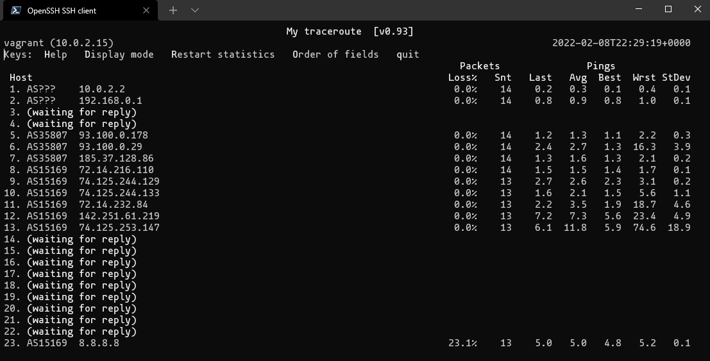

# Домашнее задание к занятию "3.6. Компьютерные сети, лекция 1"

#### 1. Работа c HTTP через телнет.
#### - Подключитесь утилитой телнет к сайту stackoverflow.com

`telnet stackoverflow.com 80`

#### - отправьте HTTP запрос

```bash
GET /questions HTTP/1.0
HOST: stackoverflow.com
[press enter]
[press enter]
```

#### - В ответе укажите полученный HTTP код, что он означает?

---

Выполним команду `telnet stackoverflow.com 80` в оболочке `zsh` и отправим HTTP запос:

```bash
21:11:50 with vagrant in ~ at vagrant
➜ telnet stackoverflow.com 80
Trying 151.101.193.69...
Connected to stackoverflow.com.
Escape character is '^]'.
GET /questions HTTP/1.0
HOST: stackoverflow.com

HTTP/1.1 301 Moved Permanently
cache-control: no-cache, no-store, must-revalidate
location: https://stackoverflow.com/questions
x-request-guid: 8f16462f-12d5-4749-820c-ad72d2de5ecc
feature-policy: microphone 'none'; speaker 'none'
content-security-policy: upgrade-insecure-requests; frame-ancestors 'self' https://stackexchange.com
Accept-Ranges: bytes
Date: Tue, 08 Feb 2022 21:12:58 GMT
Via: 1.1 varnish
Connection: close
X-Served-By: cache-hhn4080-HHN
X-Cache: MISS
X-Cache-Hits: 0
X-Timer: S1644354778.058271,VS0,VE156
Vary: Fastly-SSL
X-DNS-Prefetch-Control: off
Set-Cookie: prov=3fba8111-f654-2d80-e7f5-1753a93937f3; domain=.stackoverflow.com; expires=Fri, 01-Jan-2055 00:00:00 GMT; path=/; HttpOnly

Connection closed by foreign host.

21:13:51 with vagrant in ~ at vagrant took 55s
➜
```


В ответ получаем код `HTTP/1.1 301 Moved Permanently`, означает что запрошенный ресурс был окончательно перемещён в URL, указанны в `location:`

А именно `location: https://stackoverflow.com/questions`;

---

#### 2. Повторите задание 1 в браузере, используя консоль разработчика F12.
#### - откройте вкладку `Network`
#### - отправьте запрос http://stackoverflow.com
#### - найдите первый ответ HTTP сервера, откройте вкладку `Headers`
#### - укажите в ответе полученный HTTP код.
#### - проверьте время загрузки страницы, какой запрос обрабатывался дольше всего?
#### - приложите скриншот консоли браузера в ответ.

---

Выполняем указанную последовательность действий, получаем следующий код ответа от сервера:

```properties
Request URL: http://stackoverflow.com/
Request Method: GET
Status Code: 307 Internal Redirect
Referrer Policy: strict-origin-when-cross-origin
Location: https://stackoverflow.com/
Non-Authoritative-Reason: HSTS
Accept: text/html,application/xhtml+xml,application/xml;q=0.9,image/avif,image/webp,image/apng,*/*;q=0.8,application/signed-exchange;v=b3;q=0.9
Upgrade-Insecure-Requests: 1
User-Agent: Mozilla/5.0 (Windows NT 10.0; Win64; x64) AppleWebKit/537.36 (KHTML, like Gecko) Chrome/97.0.4692.99 Safari/537.36
```


Дольше всех, а именно 292 мс выполняся запрос к `https://stackoverflow.com/`:


---

#### 3. Какой IP адрес у вас в интернете?

---

Вариант 1 - вспомним =)

Вариант 2 - воспользуемся сервисами вроде `myip.ru` и подобными.


Вариант 3 - в терминале воспользуемся утилитой `wget` :

```bash
21:18:51 with vagrant in ~ at vagrant
➜ wget -q -O - ifconfig.me/ip
188.243.243.53%
```

---
#### 4. Какому провайдеру принадлежит ваш IP адрес? Какой автономной системе AS? Воспользуйтесь утилитой `whois`

---

Поставим утилиту `whois`, если она еще не установлена:

```bash
21:49:53 with vagrant in ~ at vagrant
➜ sudo apt install whois
Reading package lists... Done
Building dependency tree
Reading state information... Done
The following NEW packages will be installed:
  whois
0 upgraded, 1 newly installed, 0 to remove and 14 not upgraded.
Need to get 44.7 kB of archives.
After this operation, 279 kB of additional disk space will be used.
Get:1 http://us.archive.ubuntu.com/ubuntu focal/main amd64 whois amd64 5.5.6 [44.7 kB]
Fetched 44.7 kB in 0s (96.0 kB/s)
Selecting previously unselected package whois.
(Reading database ... 75434 files and directories currently installed.)
Preparing to unpack .../archives/whois_5.5.6_amd64.deb ...
Unpacking whois (5.5.6) ...
Setting up whois (5.5.6) ...
Processing triggers for man-db (2.9.1-1) ...
```

Воспользуемся утилитой `whois` и получим следующий ответ:

```bash
whois 188.243.243.53
% This is the RIPE Database query service.
% The objects are in RPSL format.
%
% The RIPE Database is subject to Terms and Conditions.
% See http://www.ripe.net/db/support/db-terms-conditions.pdf

% Note: this output has been filtered.
%       To receive output for a database update, use the "-B" flag.

% Information related to '188.243.128.0 - 188.243.255.255'

% Abuse contact for '188.243.128.0 - 188.243.255.255' is 'abuse@sknt.ru'

inetnum:        188.243.128.0 - 188.243.255.255
netname:        SKYNET
descr:          SkyNet Network
country:        RU
admin-c:        SKNT2-RIPE
tech-c:         SKNT2-RIPE
status:         ASSIGNED PA
mnt-by:         MNT-SKNT
mnt-lower:      MNT-SKNT
mnt-routes:     MNT-SKNT
created:        2014-09-30T14:25:55Z
last-modified:  2014-09-30T14:25:55Z
source:         RIPE

role:           SKYNET NOC
address:        SkyNet LLC
address:        192239 St. Petersburg
address:        Russian Federation
phone:          +7 (812) 386 20 20
remarks:        -----------------------------------------
remarks:        Routing and peering issues: tp2@hub.sknt.ru
remarks:        Abuse and security: tp2@hub.sknt.ru
remarks:        -----------------------------------------
abuse-mailbox:  abuse@sknt.ru
admin-c:        MK5687-RIPE
tech-c:         MK5687-RIPE
nic-hdl:        SKNT2-RIPE
mnt-by:         MNT-SKNT
created:        2008-04-21T16:28:30Z
last-modified:  2020-05-16T12:43:27Z
source:         RIPE # Filtered

% Information related to '188.243.192.0/18AS35807'

route:          188.243.192.0/18
descr:          SkyNet Networks
origin:         AS35807
mnt-by:         MNT-SKNT
created:        2009-07-27T10:03:01Z
last-modified:  2011-07-12T14:59:19Z
source:         RIPE

% This query was served by the RIPE Database Query Service version 1.102.2 (ANGUS)
```

Соответственно:

```bash
descr:          SkyNet Networks
origin:         AS35807
```

Повайдер `SkyNet` и адрес принадлежит автономной системе AS `AS35807`.

---

#### 5. Через какие сети проходит пакет, отправленный с вашего компьютера на адрес 8.8.8.8? Через какие AS? Воспользуйтесь утилитой `traceroute`

---

Поставим утилиту `traceroute`, если ее еще нет:

```bash
21:57:39 with vagrant in ~ at vagrant
➜ sudo apt install traceroute
Reading package lists... Done
Building dependency tree
Reading state information... Done
The following NEW packages will be installed:
  traceroute
0 upgraded, 1 newly installed, 0 to remove and 14 not upgraded.
Need to get 45.4 kB of archives.
After this operation, 152 kB of additional disk space will be used.
Get:1 http://us.archive.ubuntu.com/ubuntu focal/universe amd64 traceroute amd64 1:2.1.0-2 [45.4 kB]
Fetched 45.4 kB in 0s (93.2 kB/s)
Selecting previously unselected package traceroute.
(Reading database ... 75443 files and directories currently installed.)
Preparing to unpack .../traceroute_1%3a2.1.0-2_amd64.deb ...
Unpacking traceroute (1:2.1.0-2) ...
Setting up traceroute (1:2.1.0-2) ...
update-alternatives: using /usr/bin/traceroute.db to provide /usr/bin/traceroute (traceroute) in auto mode
update-alternatives: using /usr/bin/lft.db to provide /usr/bin/lft (lft) in auto mode
update-alternatives: using /usr/bin/traceproto.db to provide /usr/bin/traceproto (traceproto) in auto mode
update-alternatives: using /usr/sbin/tcptraceroute.db to provide /usr/sbin/tcptraceroute (tcptraceroute) in auto mode
Processing triggers for man-db (2.9.1-1) ...
```

Сделал `traceroute` 3 раза:

- `traceroute -A 8.8.8.8` в виртуалке Vagrant-Virtualbox
- `traceroute -IA 8.8.8.8` в виртуалке Vagrant-Virtualbox, для ICMP
- `traceroute -A 8.8.8.8` в виртуалке Ovirt


Соответственно:

```bash
 1  _gateway (10.0.2.2) [*]  VB
 2  router.lan (192.168.0.1) [*]  Домашняя
 3  * * * Шлюз провайдера
 4  * * * Шлюз провайдера
 5  agg-r.gw2.sknt.ru (93.100.0.178) [AS35807]  
 6  agg-m.gw1.sknt.ru (93.100.0.29) [AS35807]  
 7  sel-core (185.37.128.86) [AS35807]  
 8  72.14.216.110 (72.14.216.110) [AS15169]  
 9  74.125.244.129 (74.125.244.129) [AS15169]  
10  74.125.244.133 (74.125.244.133) [AS15169]  
11  72.14.232.84 (72.14.232.84) [AS15169]  
12  142.251.61.219 (142.251.61.219) [AS15169]  
13  74.125.253.147 (74.125.253.147) [AS15169]  
...
23  dns.google (8.8.8.8) [AS15169]  5.074 ms  5.173 ms  5.350 ms
```

---

#### 6. Повторите задание 5 в утилите `mtr`. На каком участке наибольшая задержка - delay?

---

Установим утилиту `mtr`, если ее еще нет:

```bash
22:25:05 with vagrant in ~ at vagrant
➜ sudo apt install mtr
Reading package lists... Done
Building dependency tree
Reading state information... Done
...
```

Наибольшая задержка на 13 хопе `13. AS15169  74.125.253.147`:



---

#### 7. Какие DNS сервера отвечают за доменное имя dns.google? Какие A записи? воспользуйтесь утилитой `dig`

---

Установим `dnsutils`, если его еще нет:

```bash
22:31:11 with vagrant in ~ at vagrant took 2m 9s
➜ sudo apt install dnsutils
Reading package lists... Done
Building dependency tree
Reading state information... Done
The following NEW packages will be installed:
  dnsutils
0 upgraded, 1 newly installed, 0 to remove and 14 not upgraded.
Need to get 2,756 B of archives.
After this operation, 47.1 kB of additional disk space will be used.
Get:1 http://us.archive.ubuntu.com/ubuntu focal-updates/universe amd64 dnsutils all 1:9.16.1-0ubuntu2.9 [2,756 B]
Fetched 2,756 B in 0s (11.8 kB/s)
Selecting previously unselected package dnsutils.
(Reading database ... 89883 files and directories currently installed.)
Preparing to unpack .../dnsutils_1%3a9.16.1-0ubuntu2.9_all.deb ...
Unpacking dnsutils (1:9.16.1-0ubuntu2.9) ...
Setting up dnsutils (1:9.16.1-0ubuntu2.9) ...
```

Выполним `dig dns.google NS +noall +answer`  и `dig dns.google +noall +answer`:

```bash
22:44:57 with vagrant in ~ at vagrant
➜ dig dns.google NS +noall +answer
dns.google.             7191    IN      NS      ns1.zdns.google.
dns.google.             7191    IN      NS      ns3.zdns.google.
dns.google.             7191    IN      NS      ns2.zdns.google.
dns.google.             7191    IN      NS      ns4.zdns.google.

22:45:01 with vagrant in ~ at vagrant
➜ dig dns.google +noall +answer
dns.google.             900     IN      A       8.8.8.8
dns.google.             900     IN      A       8.8.4.4
```
- `+noall` отключает вывод всех секций
- `+answer` dинформация, которая есть в секции ANSWER
- `NS` -соответственно получить информацию только об авторизированных DNS серверах


---

#### 8. Проверьте PTR записи для IP адресов из задания 7. Какое доменное имя привязано к IP? воспользуйтесь утилитой `dig`

---

Выполним команды `dig -x 8.8.8.8` и `dig -x 8.8.4.4`:

```bash
22:50:18 with vagrant in ~ at vagrant
➜ dig -x 8.8.8.8

; <<>> DiG 9.16.1-Ubuntu <<>> -x 8.8.8.8
;; global options: +cmd
;; Got answer:
;; ->>HEADER<<- opcode: QUERY, status: NOERROR, id: 26115
;; flags: qr rd ra; QUERY: 1, ANSWER: 1, AUTHORITY: 0, ADDITIONAL: 1

;; OPT PSEUDOSECTION:
; EDNS: version: 0, flags:; udp: 65494
;; QUESTION SECTION:
;8.8.8.8.in-addr.arpa.          IN      PTR

;; ANSWER SECTION:
8.8.8.8.in-addr.arpa.   807     IN      PTR     dns.google.

;; Query time: 4 msec
;; SERVER: 127.0.0.53#53(127.0.0.53)
;; WHEN: Tue Feb 08 22:52:45 UTC 2022
;; MSG SIZE  rcvd: 73
```

```bash
22:52:45 with vagrant in ~ at vagrant
➜ dig -x 8.8.4.4

; <<>> DiG 9.16.1-Ubuntu <<>> -x 8.8.4.4
;; global options: +cmd
;; Got answer:
;; ->>HEADER<<- opcode: QUERY, status: NOERROR, id: 59878
;; flags: qr rd ra; QUERY: 1, ANSWER: 1, AUTHORITY: 0, ADDITIONAL: 1

;; OPT PSEUDOSECTION:
; EDNS: version: 0, flags:; udp: 65494
;; QUESTION SECTION:
;4.4.8.8.in-addr.arpa.          IN      PTR

;; ANSWER SECTION:
4.4.8.8.in-addr.arpa.   6934    IN      PTR     dns.google.

;; Query time: 0 msec
;; SERVER: 127.0.0.53#53(127.0.0.53)
;; WHEN: Tue Feb 08 22:54:44 UTC 2022
;; MSG SIZE  rcvd: 73
```

Или покороче `dig -x 8.8.8.8 +short` и `dig -x 8.8.4.4 +short`:

```bash
22:49:01 with vagrant in ~ at vagrant
➜ dig -x 8.8.8.8 +short
dns.google.

22:50:09 with vagrant in ~ at vagrant
➜ dig -x 8.8.4.4 +short
dns.google.
```

---

В качестве ответов на вопросы можно приложите лог выполнения команд в консоли или скриншот полученных результатов.

---

## Как сдавать задания

Обязательными к выполнению являются задачи без указания звездочки. Их выполнение необходимо для получения зачета и диплома о профессиональной переподготовке.

Задачи со звездочкой (*) являются дополнительными задачами и/или задачами повышенной сложности. Они не являются обязательными к выполнению, но помогут вам глубже понять тему.

Домашнее задание выполните в файле readme.md в github репозитории. В личном кабинете отправьте на проверку ссылку на .md-файл в вашем репозитории.

Также вы можете выполнить задание в [Google Docs](https://docs.google.com/document/u/0/?tgif=d) и отправить в личном кабинете на проверку ссылку на ваш документ.
Название файла Google Docs должно содержать номер лекции и фамилию студента. Пример названия: "1.1. Введение в DevOps — Сусанна Алиева".

Если необходимо прикрепить дополнительные ссылки, просто добавьте их в свой Google Docs.

Перед тем как выслать ссылку, убедитесь, что ее содержимое не является приватным (открыто на комментирование всем, у кого есть ссылка), иначе преподаватель не сможет проверить работу. Чтобы это проверить, откройте ссылку в браузере в режиме инкогнито.

[Как предоставить доступ к файлам и папкам на Google Диске](https://support.google.com/docs/answer/2494822?hl=ru&co=GENIE.Platform%3DDesktop)

[Как запустить chrome в режиме инкогнито ](https://support.google.com/chrome/answer/95464?co=GENIE.Platform%3DDesktop&hl=ru)

[Как запустить  Safari в режиме инкогнито ](https://support.apple.com/ru-ru/guide/safari/ibrw1069/mac)

Любые вопросы по решению задач задавайте в чате учебной группы.

---

