# Домашнее задание к занятию "3.7. Компьютерные сети, лекция 2"

---

#### 1. Проверьте список доступных сетевых интерфейсов на вашем компьютере. Какие команды есть для этого в Linux и в Windows?

---

##### Linux:

- `ifconfig -a` - но оно устарело.

- `ip link show`

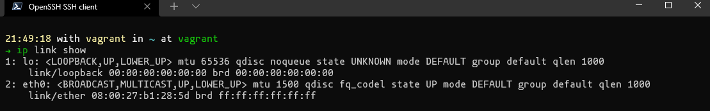

- `ip addr`

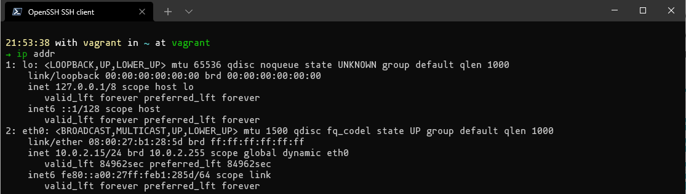

- `ip -s link`

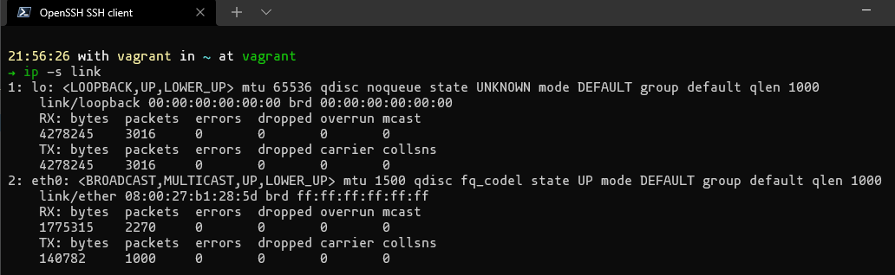

- `ls /sys/class/net` - Ядро Linux сохраняет данные о сетевом интерфейсе в каталоге /sys/class/net.

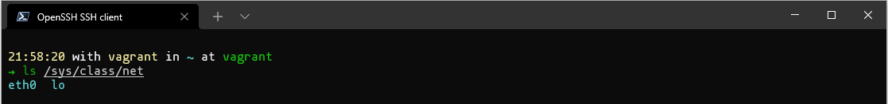

- `cat /proc/net/dev` - В операционных системах Linux файл /proc/net/dev содержит статистику о сетевых интерфейсах.

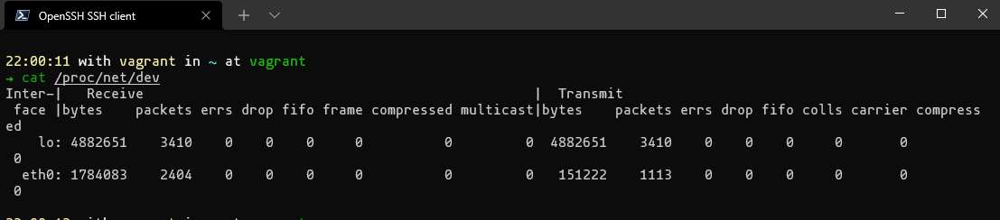

Я думаю можно найти еще много вариантов =)

##### Windows

- `ipconfig /all`

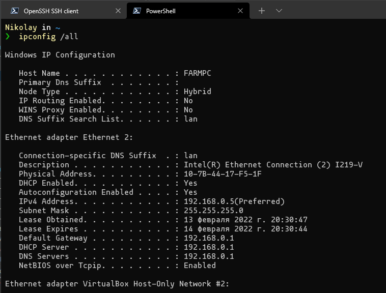

- `netsh interface show interface`

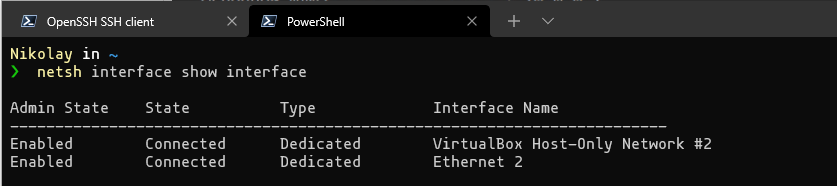

- `wmic nic get NetConnectionID` - но говорят в ветке `dev` в `Windows 11` удален `wmic.exe`, делается упор на `PS`

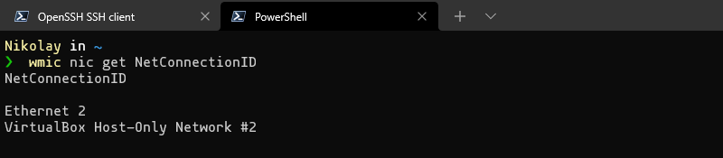

- `netsh interface ip show interfaces`

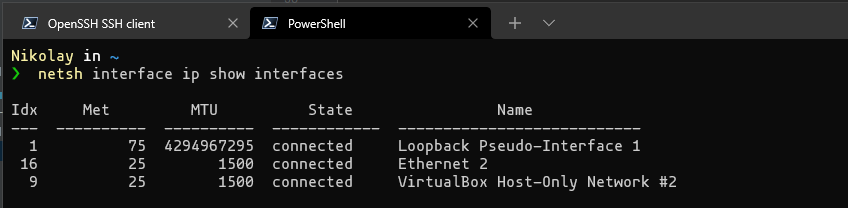

---

#### 2. Какой протокол используется для распознавания соседа по сетевому интерфейсу? Какой пакет и команды есть в Linux для этого?

---

Протокол [LLDP](https://ru.wikipedia.org/wiki/LLDP).

В Linux для него есть одноименный пакет `lldpd`.

Установим его и `snmpd`:

`sudo apt install lldpd snmpd`

Включим и запустим:

```bash
22:19:58 with vagrant in ~ at vagrant
➜ sudo systemctl enable lldpd && systemctl start lldpd
Synchronizing state of lldpd.service with SysV service script with /lib/systemd/systemd-sysv-install.
Executing: /lib/systemd/systemd-sysv-install enable lldpd
==== AUTHENTICATING FOR org.freedesktop.systemd1.manage-units ===
Authentication is required to start 'lldpd.service'.
Authenticating as: vagrant
Password:
==== AUTHENTICATION COMPLETE ===
```

Добавим строчку `master agentx` в конец файла `/etc/snmp/snmpd.conf`.

Раскомментируем строчку `DAEMON_ARGS="-x -c -s -e"` в файле `/etc/default/lldpd`.

Перезапустим `lldpd` и `snmpd`:

`sudo service lldpd restart`

`sudo service snmpd restart`

Что получаем:

- Vagrant (VB): не заработало, выдает пустой результат.

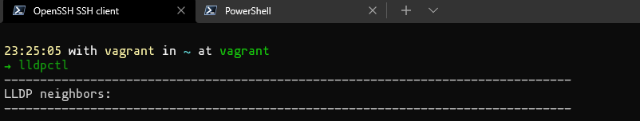

- EVE-ng(VMWare Player 16): не заработало, всё настроено по вики из Задания 8, добавлено 3 сервера, на всех проведены действия выше, выдает пустой результат.

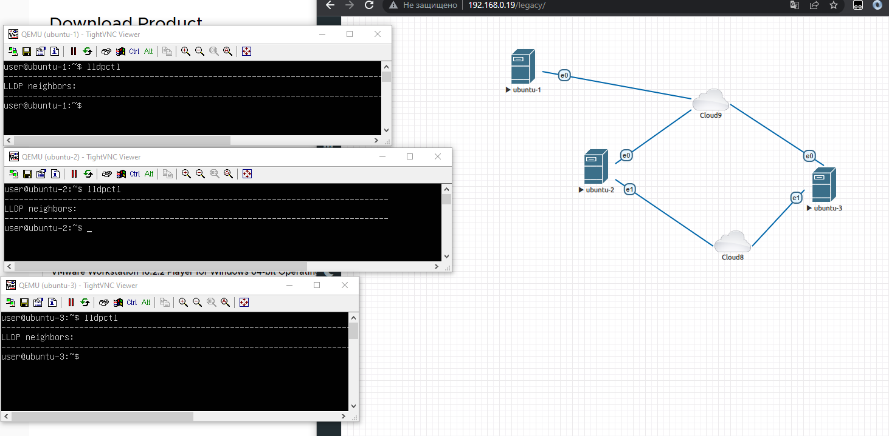

- Ovirt (Ubuntu 20.04): Всё заработало без проблем.

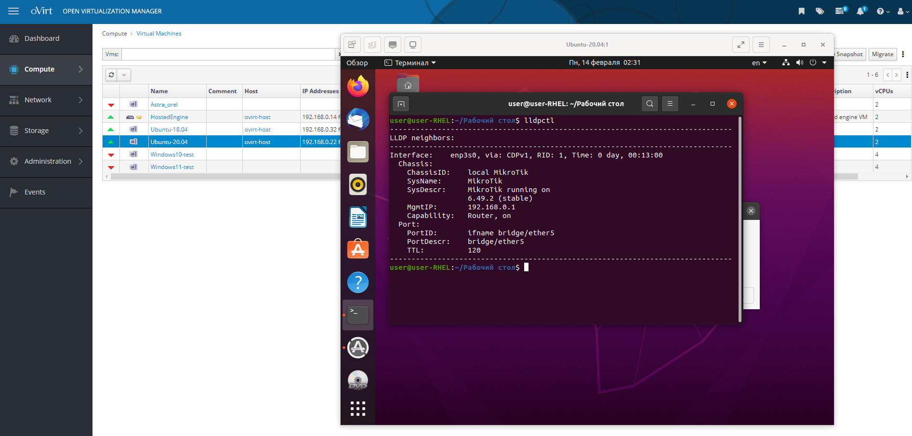
---

#### 3. Какая технология используется для разделения L2 коммутатора на несколько виртуальных сетей? Какой пакет и команды есть в Linux для этого? Приведите пример конфига.

---

Используется технология [VLAN](https://ru.wikipedia.org/wiki/VLAN).

В Linux есть одноименный пакет `vlan`:

`sudo apt install vlan`

Для настройки используем `netplan`, конфиги в директории `/etc/netplan/`, после изменения `sudo netplan apply`:

Пример конфига первой машины `ubuntu-1`:

```yaml
network:
  ethernets:
    ens3:
      dhcp4: true
  vlans:
    ens3.1000:
      id: 1000
      link: ens3
      addresses: [192.168.100.2/24]
```

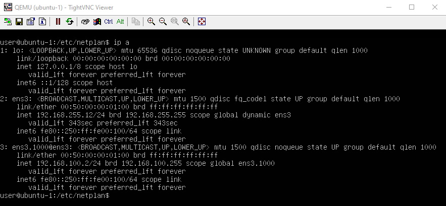

Пример конфига второй машины `ubuntu-2`:

```yaml
network:
  ethernets:
    ens3:
      dhcp4: true
  vlans:
    ens3.1000:
      id: 1000
      link: ens3
      addresses: [192.168.100.3/24]
```

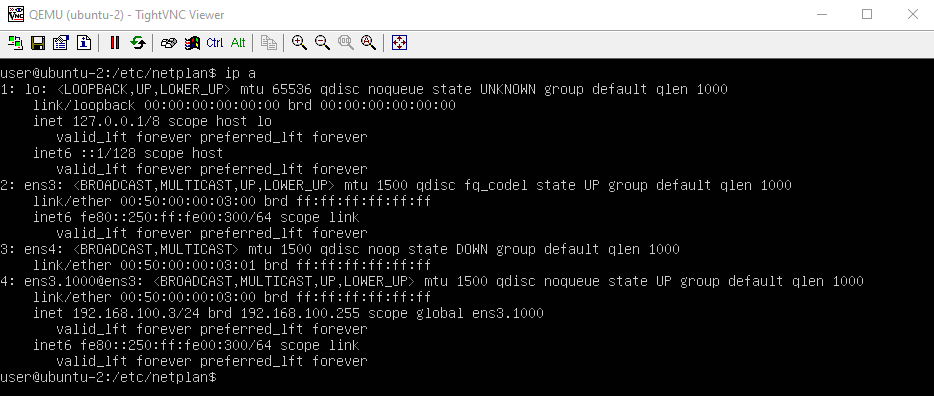

- vlans: — объявляем блок настройки vlan.
- ens3.1000: — произвольное имя vlan интерфейса.
- id: — тег нашего vlan.
- link: — интерфейс через который vlan будет доступен.
- addresses: - адрес интерфейса и маска

Возможные параметры:

- routes: — объявляем блок описания маршрутов.
— to: — задаем адрес/подсеть до которой необходим маршрут.
- via: — указываем шлюз через которой будет доступна наша подсеть.
- on-link: — указываем что прописывать маршруты всегда при под**нятии линка.**

Итого:

- `ubuntu-1` и `ubuntu-2` пингуются между собой по адресам из `vlan 1000`
- `ubuntu-3` не пингует их по адресам из `vlan 1000`, т.к. она не в этом `vlan`
- `ubuntu-3` пингует `ubuntu-1` и `ubuntu-2` по адресам интерфейсов не из `vlan`

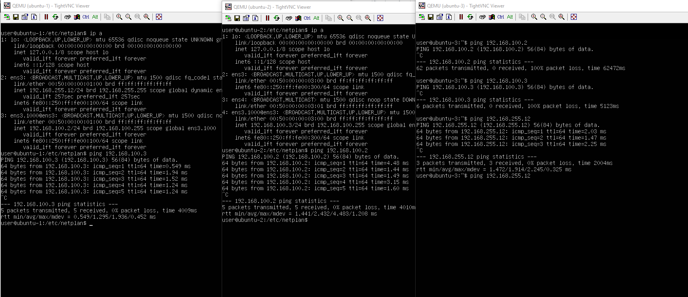

Топология в EVE-ng:

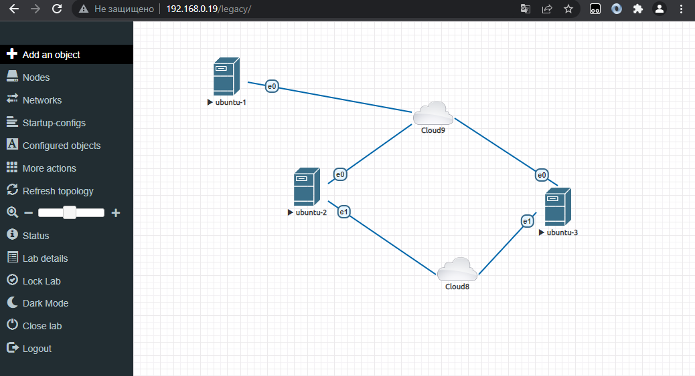

---

#### 4. Какие типы агрегации интерфейсов есть в Linux? Какие опции есть для балансировки нагрузки? Приведите пример конфига.

---

Типы агрегации интерфейсов в Linux:

Mode-0(balance-rr) – Данный режим используется по умолчанию. Balance-rr обеспечивается балансировку нагрузки и отказоустойчивость. В данном режиме сетевые пакеты отправляются “по кругу”, от первого интерфейса к последнему. Если выходят из строя интерфейсы, пакеты отправляются на остальные оставшиеся. Дополнительной настройки коммутатора не требуется при нахождении портов в одном коммутаторе. При разностных коммутаторах требуется дополнительная настройка.

Mode-1(active-backup) – Один из интерфейсов работает в активном режиме, остальные в ожидающем. При обнаружении проблемы на активном интерфейсе производится переключение на ожидающий интерфейс. Не требуется поддержки от коммутатора.

Mode-2(balance-xor) – Передача пакетов распределяется по типу входящего и исходящего трафика по формуле ((MAC src) XOR (MAC dest)) % число интерфейсов. Режим дает балансировку нагрузки и отказоустойчивость. Не требуется дополнительной настройки коммутатора/коммутаторов.

Mode-3(broadcast) – Происходит передача во все объединенные интерфейсы, тем самым обеспечивая отказоустойчивость. Рекомендуется только для использования MULTICAST трафика.

Mode-4(802.3ad) – динамическое объединение одинаковых портов. В данном режиме можно значительно увеличить пропускную способность входящего так и исходящего трафика. Для данного режима необходима поддержка и настройка коммутатора/коммутаторов.

Mode-5(balance-tlb) – Адаптивная балансировки нагрузки трафика. Входящий трафик получается только активным интерфейсом, исходящий распределяется в зависимости от текущей загрузки канала каждого интерфейса. Не требуется специальной поддержки и настройки коммутатора/коммутаторов.

Mode-6(balance-alb) – Адаптивная балансировка нагрузки. Отличается более совершенным алгоритмом балансировки нагрузки чем Mode-5). Обеспечивается балансировку нагрузки как исходящего так и входящего трафика. Не требуется специальной поддержки и настройки коммутатора/коммутаторов.

Установим пакет `ifenslave`:

`sudo apt install ifenslave`

Добавим поддержку в ядро:

`sudomodprobe bonding`

Для настройки используем `netplan`, конфиги в директории `/etc/netplan/`, после изменения `sudo netplan apply`:

Изменим немного топологию в `NG-eve`:

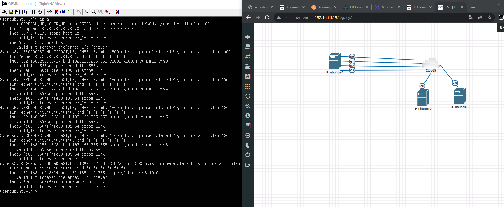

Пример конфига первой машины `ubuntu-1`:

```yaml
network:
  ethernets:
    ens3:
      dhcp4: true
    ens4:
      dhcp4: true
    ens5:
      dhcp4: true
    ens6:
      dhcp4: true
  bonds:
    bond0:
      dhcp4: true
      interfaces: [ens3, ens4, ens5, ens6]
      parameters:
        mode: 802.3ad
        mii-monitor-interval: 1
  vlans:
    bond0.1000:
      id: 1000
      link: bond0
      addresses: [192.168.100.10/24]
```

- bonds: — блок, поясняющий что мы будем настраивать bonding.
- bond0: — произвольное имя интерфейса.
- interfaces: — набор интерфейсов собираемых в bond-динг, ''как оговаривалось ранее если параметров несколько описываем их в квадратных скобках".
- parameters: — описываем блок настройки параметров
- mode: — указываем мод по которому будет работать bonding.
- mii-monitor-interval: — задаем интервал мониторинга 1 сек.

Итоги:

- На `ubuntu-1` добавили 4 интерфейса, объединили в `bond0` и повесли на него `vlan 1000`
- `ubuntu-1` и `ubuntu-2` пингуются между собой по адресам из `vlan 1000` и по адресам не из `vlan`
- `ubuntu-3` не пингует их по адресам из `vlan 1000`, т.к. она не в этом `vlan`
- `ubuntu-3` пингует `ubuntu-1` и `ubuntu-2` по адресам интерфейсов не из `vlan`

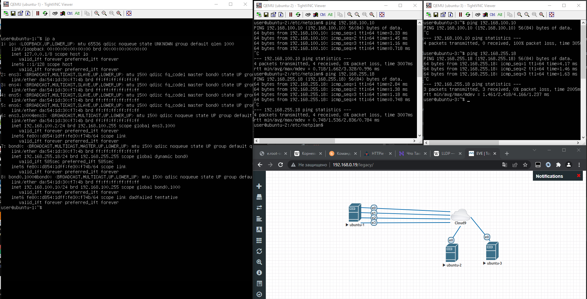

---

#### 5. Сколько IP адресов в сети с маской /29 ? Сколько /29 подсетей можно получить из сети с маской /24. Приведите несколько примеров /29 подсетей внутри сети 10.10.10.0/24.

---

В сети с маской `/29` - 6 адресов.

Например:

```bash
01:23:59 with vagrant in ~ at vagrant
➜ ipcalc 10.10.10.0/29
Address:   10.10.10.0           00001010.00001010.00001010.00000 000
Netmask:   255.255.255.248 = 29 11111111.11111111.11111111.11111 000
Wildcard:  0.0.0.7              00000000.00000000.00000000.00000 111
=>
Network:   10.10.10.0/29        00001010.00001010.00001010.00000 000
HostMin:   10.10.10.1           00001010.00001010.00001010.00000 001
HostMax:   10.10.10.6           00001010.00001010.00001010.00000 110
Broadcast: 10.10.10.7           00001010.00001010.00001010.00000 111
Hosts/Net: 6                     Class A, Private Internet
```

В сети с маской `/24` содержится 254 адреса:

```bash
01:23:03 with vagrant in ~ at vagrant
➜ ipcalc 10.10.10.0/24
Address:   10.10.10.0           00001010.00001010.00001010. 00000000
Netmask:   255.255.255.0 = 24   11111111.11111111.11111111. 00000000
Wildcard:  0.0.0.255            00000000.00000000.00000000. 11111111
=>
Network:   10.10.10.0/24        00001010.00001010.00001010. 00000000
HostMin:   10.10.10.1           00001010.00001010.00001010. 00000001
HostMax:   10.10.10.254         00001010.00001010.00001010. 11111110
Broadcast: 10.10.10.255         00001010.00001010.00001010. 11111111
Hosts/Net: 254                   Class A, Private Internet
```

Сеть `10.10.10.0/24` - первые три октета - номер сети, а оставшийся октет – идентификатор хоста, что позволяет использовать в сети максимум 28 – 2 = 254 хостов.

Для разделения на сети `/29` Нужно взять 5 битов из идентификатора хоста.

Маска подсети состоит из 29 бит (11111111.11111111.11111111.11111000), то есть 255.255.255.248. 

Первые 5 битов последнего октета содержат кол-во подсетей, что в сумме дает 2 в 5 степени - 32 - колво подсетей `/29` в подсети `/24`.

Каждая подсеть содержит 3 битов идентификатора хоста, что в сумме дает 2 в 3 степени – 2 = 6 хостов для каждой подсети (идентификатор хоста из всех нулей – это сама подсеть, а из всех единиц – широковещательный адрес для подсети).

Примеры подсетей используя `ipcalc`:

```bash
01:25:25 with vagrant in ~ at vagrant
➜ ipcalc -b --split 6 6 6 6 6 10.10.10.0/24
Address:   10.10.10.0
Netmask:   255.255.255.0 = 24
Wildcard:  0.0.0.255
=>
Network:   10.10.10.0/24
HostMin:   10.10.10.1
HostMax:   10.10.10.254
Broadcast: 10.10.10.255
Hosts/Net: 254                   Class A, Private Internet

1. Requested size: 6 hosts
Netmask:   255.255.255.248 = 29
Network:   10.10.10.0/29
HostMin:   10.10.10.1
HostMax:   10.10.10.6
Broadcast: 10.10.10.7
Hosts/Net: 6                     Class A, Private Internet

2. Requested size: 6 hosts
Netmask:   255.255.255.248 = 29
Network:   10.10.10.8/29
HostMin:   10.10.10.9
HostMax:   10.10.10.14
Broadcast: 10.10.10.15
Hosts/Net: 6                     Class A, Private Internet

3. Requested size: 6 hosts
Netmask:   255.255.255.248 = 29
Network:   10.10.10.16/29
HostMin:   10.10.10.17
HostMax:   10.10.10.22
Broadcast: 10.10.10.23
Hosts/Net: 6                     Class A, Private Internet

4. Requested size: 6 hosts
Netmask:   255.255.255.248 = 29
Network:   10.10.10.24/29
HostMin:   10.10.10.25
HostMax:   10.10.10.30
Broadcast: 10.10.10.31
Hosts/Net: 6                     Class A, Private Internet

5. Requested size: 6 hosts
Netmask:   255.255.255.248 = 29
Network:   10.10.10.32/29
HostMin:   10.10.10.33
HostMax:   10.10.10.38
Broadcast: 10.10.10.39
Hosts/Net: 6                     Class A, Private Internet

Needed size:  40 addresses.
Used network: 10.10.10.0/26
Unused:
10.10.10.40/29
10.10.10.48/28
10.10.10.64/26
10.10.10.128/25
```

---

#### 6. Задача: вас попросили организовать стык между 2-мя организациями. Диапазоны 10.0.0.0/8, 172.16.0.0/12, 192.168.0.0/16 уже заняты. Из какой подсети допустимо взять частные IP адреса? Маску выберите из расчета максимум 40-50 хостов внутри подсети.

---

Если первые три диапазона из частных сетей заняты:

10.0.0.0 — 10.255.255.255 (маска подсети : 255.0.0.0 или /8)

172.16.0.0 — 172.31.255.255 (маска подсети: 255.240.0.0 или /12)

192.168.0.0 — 192.168.255.255 (маска подсети: 255.255.0.0 или /16)

Тода остается взять из подсети:

100.64.0.0 — 100.127.255.255 (маска подсети 255.192.0.0 или /10) Carrier-Grade NAT.

Например 

```bash
01:56:02 with vagrant in ~ at vagrant
➜ ipcalc 100.100.100.100/26
Address:   100.100.100.100      01100100.01100100.01100100.01 100100
Netmask:   255.255.255.192 = 26 11111111.11111111.11111111.11 000000
Wildcard:  0.0.0.63             00000000.00000000.00000000.00 111111
=>
Network:   100.100.100.64/26    01100100.01100100.01100100.01 000000
HostMin:   100.100.100.65       01100100.01100100.01100100.01 000001
HostMax:   100.100.100.126      01100100.01100100.01100100.01 111110
Broadcast: 100.100.100.127      01100100.01100100.01100100.01 111111
Hosts/Net: 62                    Class A
```
---

#### 7. Как проверить ARP таблицу в Linux, Windows? Как очистить ARP кеш полностью? Как из ARP таблицы удалить только один нужный IP?

---

В WIndows `arp -a`:

```bash
Nikolay in ~
❯  arp -a

Interface: 192.168.56.1 --- 0x9
  Internet Address      Physical Address      Type
  192.168.56.255        ff-ff-ff-ff-ff-ff     static
  224.0.0.22            01-00-5e-00-00-16     static
  224.0.0.251           01-00-5e-00-00-fb     static
  224.0.0.252           01-00-5e-00-00-fc     static
  224.0.0.253           01-00-5e-00-00-fd     static
  224.0.1.1             01-00-5e-00-01-01     static
  239.255.255.250       01-00-5e-7f-ff-fa     static
  255.255.255.255       ff-ff-ff-ff-ff-ff     static
```

В Linux `ip neigh` :

```bash
➜ ip neigh
10.0.2.3 dev eth0 lladdr 52:54:00:12:35:03 REACHABLE
10.0.2.2 dev eth0 lladdr 52:54:00:12:35:02 REACHABLE
```

Или поставить `net-tools` и `arp -n`

```bash
02:04:00 with vagrant in ~ at vagrant
➜ sudo apt-get install net-tools
Reading package lists... Done
Building dependency tree
Reading state information... Done
The following NEW packages will be installed:
  net-tools
0 upgraded, 1 newly installed, 0 to remove and 39 not upgraded.
Need to get 196 kB of archives.
After this operation, 864 kB of additional disk space will be used.
Get:1 http://us.archive.ubuntu.com/ubuntu focal/main amd64 net-tools amd64 1.60+git20180626.aebd88e-1ubuntu1 [196 kB]
Fetched 196 kB in 1s (273 kB/s)
Selecting previously unselected package net-tools.
(Reading database ... 90358 files and directories currently installed.)
Preparing to unpack .../net-tools_1.60+git20180626.aebd88e-1ubuntu1_amd64.deb ...
Unpacking net-tools (1.60+git20180626.aebd88e-1ubuntu1) ...
Setting up net-tools (1.60+git20180626.aebd88e-1ubuntu1) ...
Processing triggers for man-db (2.9.1-1) ...

02:06:19 with vagrant in ~ at vagrant
➜ arp -n
Address                  HWtype  HWaddress           Flags Mask            Iface
10.0.2.3                 ether   52:54:00:12:35:03   C                     eth0
10.0.2.2                 ether   52:54:00:12:35:02   C                     eth0
```

Удалить конкретный в Windows:

```bash
arp -d адрес 
```

Удалить конкретный в Linux:

```bash
sudo arp -d адрес
```

```bash
sudo ip neight delete адрес
```

Удалить все в Windows:

```bash
arp -d -а
```

Удалить все в Linux:

```bash
sudo arp -d адрес
```

```bash
sudo ip neigh flush all
```
---
## Задание для самостоятельной отработки (необязательно к выполнению)

#### 8*. Установите эмулятор EVE-ng.
 
#### Инструкция по установке - https://github.com/svmyasnikov/eve-ng

#### Выполните задания на lldp, vlan, bonding в эмуляторе EVE-ng. 
 

---

Выполнено в соответствующих заданиях.

---

## Как сдавать задания

Обязательными к выполнению являются задачи без указания звездочки. Их выполнение необходимо для получения зачета и диплома о профессиональной переподготовке.

Задачи со звездочкой (*) являются дополнительными задачами и/или задачами повышенной сложности. Они не являются обязательными к выполнению, но помогут вам глубже понять тему.

Домашнее задание выполните в файле readme.md в github репозитории. В личном кабинете отправьте на проверку ссылку на .md-файл в вашем репозитории.

Также вы можете выполнить задание в [Google Docs](https://docs.google.com/document/u/0/?tgif=d) и отправить в личном кабинете на проверку ссылку на ваш документ.
Название файла Google Docs должно содержать номер лекции и фамилию студента. Пример названия: "1.1. Введение в DevOps — Сусанна Алиева".

Если необходимо прикрепить дополнительные ссылки, просто добавьте их в свой Google Docs.

Перед тем как выслать ссылку, убедитесь, что ее содержимое не является приватным (открыто на комментирование всем, у кого есть ссылка), иначе преподаватель не сможет проверить работу. Чтобы это проверить, откройте ссылку в браузере в режиме инкогнито.

[Как предоставить доступ к файлам и папкам на Google Диске](https://support.google.com/docs/answer/2494822?hl=ru&co=GENIE.Platform%3DDesktop)

[Как запустить chrome в режиме инкогнито ](https://support.google.com/chrome/answer/95464?co=GENIE.Platform%3DDesktop&hl=ru)

[Как запустить  Safari в режиме инкогнито ](https://support.apple.com/ru-ru/guide/safari/ibrw1069/mac)

Любые вопросы по решению задач задавайте в чате учебной группы.

---
