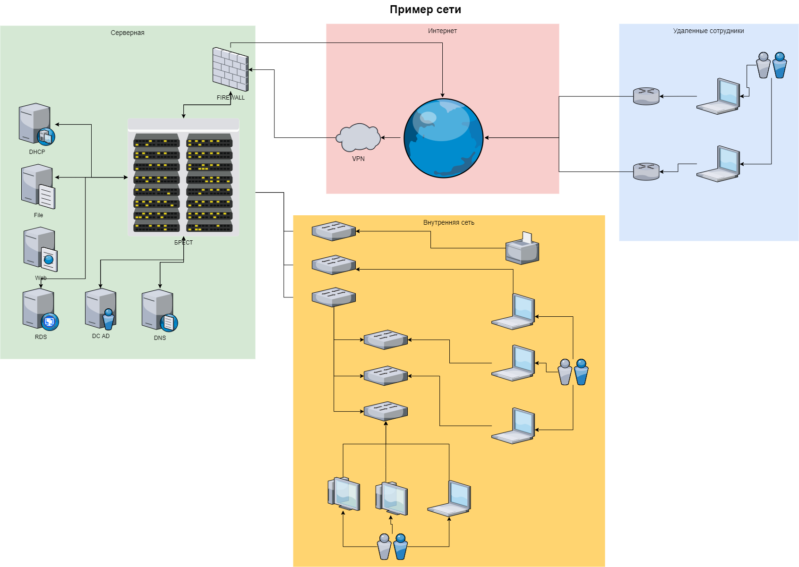

# Домашнее задание к занятию "3.8. Компьютерные сети, лекция 3"

#### 1. Подключитесь к публичному маршрутизатору в интернет. Найдите маршрут к вашему публичному IP
```
telnet route-views.routeviews.org
Username: rviews
show ip route x.x.x.x/32
show bgp x.x.x.x/32
```
---

Подключаемся:

```bash
22:31:27 with vagrant in ~ at vagrant took 33s
➜ telnet route-views.routeviews.org
Trying 128.223.51.103...
Connected to route-views.routeviews.org.
Escape character is '^]'.
C
**********************************************************************

                    RouteViews BGP Route Viewer
                    route-views.routeviews.org

 route views data is archived on http://archive.routeviews.org

 This hardware is part of a grant by the NSF.
 Please contact help@routeviews.org if you have questions, or
 if you wish to contribute your view.

 This router has views of full routing tables from several ASes.
 The list of peers is located at http://www.routeviews.org/peers
 in route-views.oregon-ix.net.txt

 NOTE: The hardware was upgraded in August 2014.  If you are seeing
 the error message, "no default Kerberos realm", you may want to
 in Mac OS X add "default unset autologin" to your ~/.telnetrc

 To login, use the username "rviews".

 **********************************************************************


User Access Verification

Username: rviews
```

Ищем маршруты:

```bash
route-views>show ip route 188.243.243.53
Routing entry for 188.243.0.0/16
  Known via "bgp 6447", distance 20, metric 0
  Tag 3333, type external
  Last update from 193.0.0.56 2d05h ago
  Routing Descriptor Blocks:
  * 193.0.0.56, from 193.0.0.56, 2d05h ago
      Route metric is 0, traffic share count is 1
      AS Hops 4
      Route tag 3333
      MPLS label: none
```

```bash
route-views>show bgp 188.243.243.53
BGP routing table entry for 188.243.0.0/16, version 313229960
Paths: (1 available, best #1, table default)
  Not advertised to any peer
  Refresh Epoch 1
  3333 1103 20562 35807
    193.0.0.56 from 193.0.0.56 (193.0.0.56)
      Origin IGP, localpref 100, valid, external, atomic-aggregate, best
      Community: 20562:45 20562:3120 20562:4001 20562:65000 20562:65020
      path 7FE113CCBC88 RPKI State not found
      rx pathid: 0, tx pathid: 0x0
route-views>
```

---

#### 2. Создайте dummy0 интерфейс в Ubuntu. Добавьте несколько статических маршрутов. Проверьте таблицу маршрутизации.

---

Необходимо загрузить модуль `dummy`:

```bash
22:45:11 with vagrant in ~ at vagrant
➜ sudo modprobe -v dummy
```

Проверим:

```bash
22:49:26 with vagrant in ~ at vagrant
➜ lsmod | grep dummy
dummy                  16384  0
```

Создадим интерфейс `dummy0`:

```bash
22:49:18 with vagrant in ~ at vagrant
➜ sudo ip link add dummy0 type dummy

22:49:23 with vagrant in ~ at vagrant
➜ ip a
1: lo: <LOOPBACK,UP,LOWER_UP> mtu 65536 qdisc noqueue state UNKNOWN group default qlen 1000
    link/loopback 00:00:00:00:00:00 brd 00:00:00:00:00:00
    inet 127.0.0.1/8 scope host lo
       valid_lft forever preferred_lft forever
    inet6 ::1/128 scope host
       valid_lft forever preferred_lft forever
2: eth0: <BROADCAST,MULTICAST,UP,LOWER_UP> mtu 1500 qdisc fq_codel state UP group default qlen 1000
    link/ether 08:00:27:b1:28:5d brd ff:ff:ff:ff:ff:ff
    inet 10.0.2.15/24 brd 10.0.2.255 scope global dynamic eth0
       valid_lft 85250sec preferred_lft 85250sec
    inet6 fe80::a00:27ff:feb1:285d/64 scope link
       valid_lft forever preferred_lft forever
3: dummy0: <BROADCAST,NOARP> mtu 1500 qdisc noop state DOWN group default qlen 1000
    link/ether 92:cc:98:ab:ba:1b brd ff:ff:ff:ff:ff:ff
```

Добавим ему адрес:

```bash
22:50:23 with vagrant in ~ at vagrant
➜ sudo ip addr add 192.168.1.150/24 dev dummy0

22:51:39 with vagrant in ~ at vagrant
➜ sudo ip link set up dummy0

22:52:45 with vagrant in ~ at vagrant
➜ ip a
1: lo: <LOOPBACK,UP,LOWER_UP> mtu 65536 qdisc noqueue state UNKNOWN group default qlen 1000
    link/loopback 00:00:00:00:00:00 brd 00:00:00:00:00:00
    inet 127.0.0.1/8 scope host lo
       valid_lft forever preferred_lft forever
    inet6 ::1/128 scope host
       valid_lft forever preferred_lft forever
2: eth0: <BROADCAST,MULTICAST,UP,LOWER_UP> mtu 1500 qdisc fq_codel state UP group default qlen 1000
    link/ether 08:00:27:b1:28:5d brd ff:ff:ff:ff:ff:ff
    inet 10.0.2.15/24 brd 10.0.2.255 scope global dynamic eth0
       valid_lft 84700sec preferred_lft 84700sec
    inet6 fe80::a00:27ff:feb1:285d/64 scope link
       valid_lft forever preferred_lft forever
3: dummy0: <BROADCAST,NOARP,UP,LOWER_UP> mtu 1500 qdisc noqueue state UNKNOWN group default qlen 1000
    link/ether 92:cc:98:ab:ba:1b brd ff:ff:ff:ff:ff:ff
    inet 192.168.1.150/24 scope global dummy0
       valid_lft forever preferred_lft forever
    inet6 fe80::90cc:98ff:feab:ba1b/64 scope link
       valid_lft forever preferred_lft forever
```

Проверим маршруты:

```bash
22:51:55 with vagrant in ~ at vagrant
➜ ip route show
default via 10.0.2.2 dev eth0 proto dhcp src 10.0.2.15 metric 100
10.0.2.0/24 dev eth0 proto kernel scope link src 10.0.2.15
10.0.2.2 dev eth0 proto dhcp scope link src 10.0.2.15 metric 100
192.168.1.0/24 dev dummy0 proto kernel scope link src 192.168.1.150
```

Добавим несколько статических:

```bash
22:55:45 with vagrant in ~ at vagrant
➜ sudo ip route add 192.168.0.0/24 via 10.0.2.15

22:58:36 with vagrant in ~ at vagrant
➜ sudo ip route add 188.243.0.0/16 via 192.168.1.150
```

Проверим:

```bash
22:58:41 with vagrant in ~ at vagrant
➜ ip route show
default via 10.0.2.2 dev eth0 proto dhcp src 10.0.2.15 metric 100
10.0.2.0/24 dev eth0 proto kernel scope link src 10.0.2.15
10.0.2.2 dev eth0 proto dhcp scope link src 10.0.2.15 metric 100
188.243.0.0/16 via 192.168.1.150 dev dummy0
192.168.0.0/24 via 10.0.2.15 dev eth0
192.168.1.0/24 dev dummy0 proto kernel scope link src 192.168.1.150
```

---

#### 3. Проверьте открытые TCP порты в Ubuntu, какие протоколы и приложения используют эти порты? Приведите несколько примеров.

---

Пример с Vagrant:

```bash
23:05:19 with vagrant in ~ at vagrant took 10s
➜ ss -t -a -l -n
State        Recv-Q        Send-Q               Local Address:Port                Peer Address:Port       Process
LISTEN       0             4096                 127.0.0.53%lo:53                       0.0.0.0:*
LISTEN       0             128                        0.0.0.0:22                       0.0.0.0:*
LISTEN       0             4096                     127.0.0.1:8125                     0.0.0.0:*
LISTEN       0             4096                       0.0.0.0:19999                    0.0.0.0:*
LISTEN       0             128                           [::]:22                          [::]:*
LISTEN       0             4096                             *:9090                           *:*
LISTEN       0             4096                             *:9100                           *:*
```

`22` - ssh

`53` - dns

`19999` - netdata из предыдущих ДЗ

`9090` - Prometheus из предыдущих ДЗ

`9100` - Node Exporter из предыдущих ДЗ

Пример с другого сервера:

```bash
23:11:00 with kofe88 in ~ at server01
➜ ss -t -a -l -n
State            Recv-Q           Send-Q                     Local Address:Port                     Peer Address:Port          Process
LISTEN           0                80                             127.0.0.1:3306                          0.0.0.0:*
LISTEN           0                4096                       127.0.0.53%lo:53                            0.0.0.0:*
LISTEN           0                128                              0.0.0.0:22                            0.0.0.0:*
LISTEN           0                511                                    *:80                                  *:*
LISTEN           0                128                                 [::]:22                               [::]:*
LISTEN           0                511                                    *:443                                 *:*
```

`22` - ssh

`3306` - MariaDB

`53` - dns

`80` - apache2, http

`443` - apache2, https

---

#### 4. Проверьте используемые UDP сокеты в Ubuntu, какие протоколы и приложения используют эти порты?

---

```bash
23:17:09 with vagrant in ~ at vagrant
➜ ss -u -a -l -n
State        Recv-Q        Send-Q                Local Address:Port               Peer Address:Port       Process
UNCONN       0             0                         127.0.0.1:8125                    0.0.0.0:*
UNCONN       0             0                     127.0.0.53%lo:53                      0.0.0.0:*
UNCONN       0             0                    10.0.2.15%eth0:68                      0.0.0.0:*
```

`68` - [bootstrap protocol](https://ru.wikipedia.org/wiki/Bootstrap_Protocol)

BOOTP (от англ. bootstrap protocol) — сетевой протокол прикладного уровня, используемый для автоматического получения клиентом IP-адреса. Это обычно происходит во время загрузки компьютера. BOOTP определён в RFC 951.

[Номера портов](https://ru.wikipedia.org/wiki/%D0%A1%D0%BF%D0%B8%D1%81%D0%BE%D0%BA_%D0%BF%D0%BE%D1%80%D1%82%D0%BE%D0%B2_TCP_%D0%B8_UDP), используемые для конкретных специфических целей, выделяет и регистрирует IANA (Internet Assigned Numbers Authority), однако на практике часто встречаются случаи их неофициального применения.

---

#### 5. Используя diagrams.net, создайте L3 диаграмму вашей домашней сети или любой другой сети, с которой вы работали. 

---



---

 ---
## Задание для самостоятельной отработки (необязательно к выполнению)

#### 6*. Установите Nginx, настройте в режиме балансировщика TCP или UDP.

#### 7*. Установите bird2, настройте динамический протокол маршрутизации RIP.

#### 8*. Установите Netbox, создайте несколько IP префиксов, используя curl проверьте работу API.

 ---

## Как сдавать задания

Обязательными к выполнению являются задачи без указания звездочки. Их выполнение необходимо для получения зачета и диплома о профессиональной переподготовке.

Задачи со звездочкой (*) являются дополнительными задачами и/или задачами повышенной сложности. Они не являются обязательными к выполнению, но помогут вам глубже понять тему.

Домашнее задание выполните в файле readme.md в github репозитории. В личном кабинете отправьте на проверку ссылку на .md-файл в вашем репозитории.

Также вы можете выполнить задание в [Google Docs](https://docs.google.com/document/u/0/?tgif=d) и отправить в личном кабинете на проверку ссылку на ваш документ.
Название файла Google Docs должно содержать номер лекции и фамилию студента. Пример названия: "1.1. Введение в DevOps — Сусанна Алиева".

Если необходимо прикрепить дополнительные ссылки, просто добавьте их в свой Google Docs.

Перед тем как выслать ссылку, убедитесь, что ее содержимое не является приватным (открыто на комментирование всем, у кого есть ссылка), иначе преподаватель не сможет проверить работу. Чтобы это проверить, откройте ссылку в браузере в режиме инкогнито.

[Как предоставить доступ к файлам и папкам на Google Диске](https://support.google.com/docs/answer/2494822?hl=ru&co=GENIE.Platform%3DDesktop)

[Как запустить chrome в режиме инкогнито ](https://support.google.com/chrome/answer/95464?co=GENIE.Platform%3DDesktop&hl=ru)

[Как запустить  Safari в режиме инкогнито ](https://support.apple.com/ru-ru/guide/safari/ibrw1069/mac)

Любые вопросы по решению задач задавайте в чате учебной группы.

---

