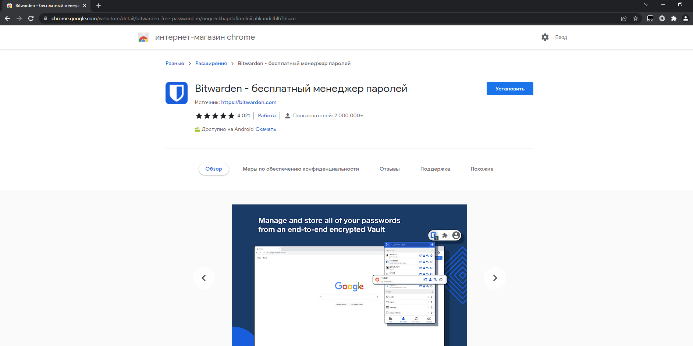
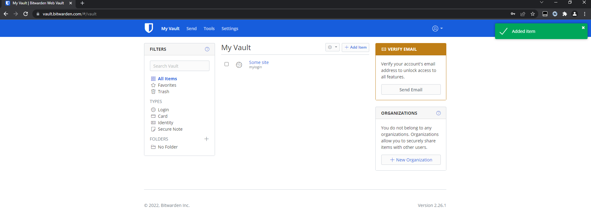
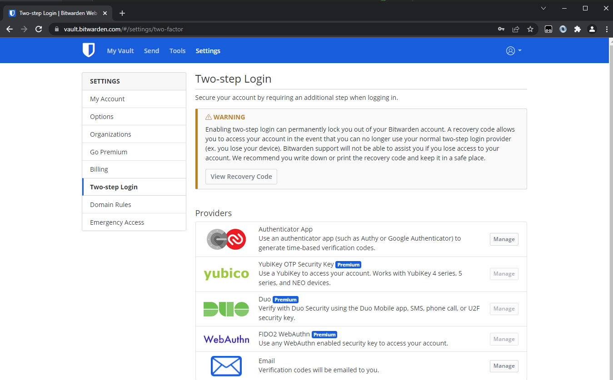
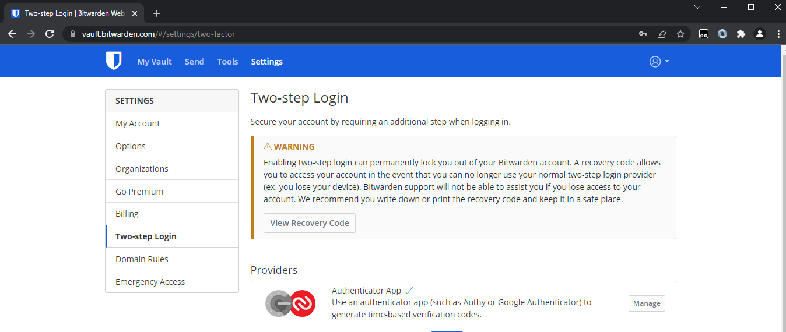
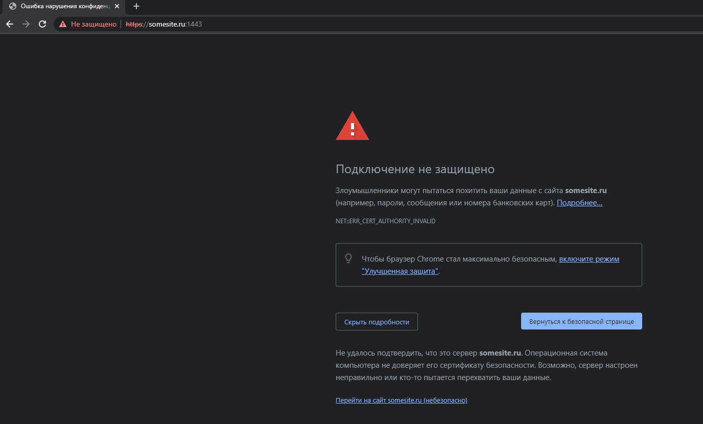
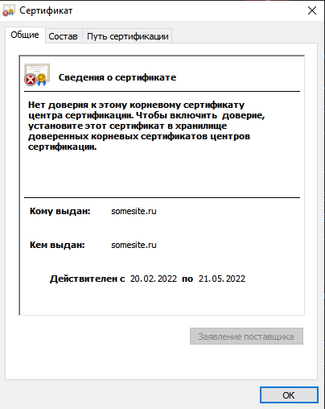
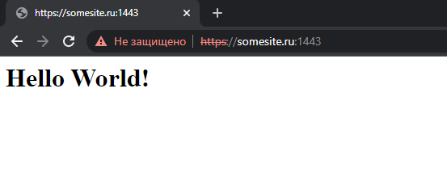
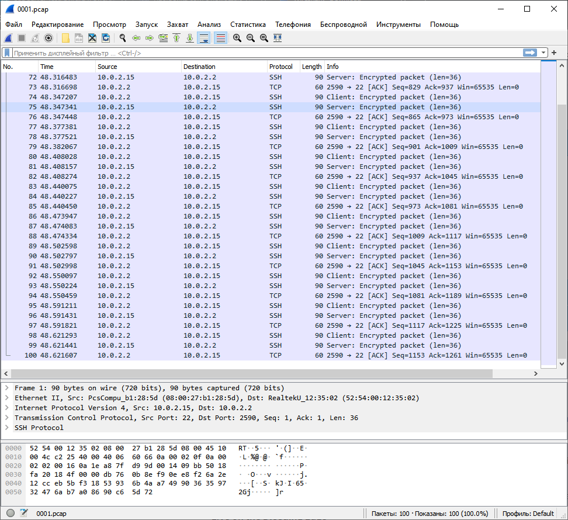

# Домашнее задание к занятию "3.9. Элементы безопасности информационных систем"

---

#### 1. Установите Bitwarden плагин для браузера. Зарегестрируйтесь и сохраните несколько паролей.

---

Устанавливаем плагин:



Регистрируемся и сохраняем пароль:



---

#### 2. Установите Google authenticator на мобильный телефон. Настройте вход в Bitwarden акаунт через Google authenticator OTP.

---

До подключения аутентификатора:



После:



Пользуюсь [andOTP](https://github.com/andOTP/andOTP)

---

#### 3. Установите apache2, сгенерируйте самоподписанный сертификат, настройте тестовый сайт для работы по HTTPS.

---

Ставим `apache2` и включаем модуль `ssl`:

```bash
00:17:57 with vagrant in ~ at vagrant
➜ sudo apt install apache2

00:18:05 with vagrant in ~ at vagrant
➜ sudo a2enmod ssl
```

Генерируем сертификат и закрытый ключ на 90 дней:

```bash
00:20:23 with vagrant in ~ at vagrant took 18s
➜ sudo openssl req -x509 -nodes -days 90 -newkey rsa:2048 -keyout /etc/ssl/private/selfsigned.key -out /etc/ssl/certs/selfsigned.crt
Generating a RSA private key
.............................................................................................+++++
..............................................+++++
writing new private key to '/etc/ssl/private/selfsigned.key'
-----
You are about to be asked to enter information that will be incorporated
into your certificate request.
What you are about to enter is what is called a Distinguished Name or a DN.
There are quite a few fields but you can leave some blank
For some fields there will be a default value,
If you enter '.', the field will be left blank.
-----
Country Name (2 letter code) [AU]:RU
State or Province Name (full name) [Some-State]:Saint-Petersburg
Locality Name (eg, city) []:Saint-Petersburg
Organization Name (eg, company) [Internet Widgits Pty Ltd]:Home
Organizational Unit Name (eg, section) []:Home
Common Name (e.g. server FQDN or YOUR name) []:somesite.ru
Email Address []:admin@somesite.ru
```

При генерации сертификата последовательно отвечаем на вопросы.

Сертификат и ключ сгенерированы:

```
00:26:20 with vagrant in ~ at vagrant
➜ sudo ls /etc/ssl/certs | grep self
selfsigned.crt
```

```
00:26:24 with vagrant in ~ at vagrant
➜ sudo ls /etc/ssl/private/ | grep self
selfsigned.key
```

Отредактируем доступный сайт для апача:

```bash
00:26:35 with vagrant in ~ at vagrant
➜ sudo vim /etc/apache2/sites-available/somesite.ru.conf
```

Добавим простой конфиг:

```
<VirtualHost *:443>
ServerName somesite.ru
DocumentRoot /var/www/somesite
SSLEngine on
SSLCertificateFile /etc/ssl/certs/selfsigned.crt
SSLCertificateKeyFile /etc/ssl/private/selfsigned.key
</VirtualHost>
```

Создадим директорию где будут лежать файлы нашего сайта, добавим документ index.html с простеньким содержимым `<h1>Hello World!</h1>`, поправим владельца файлов:

```bash
00:33:26 with vagrant in ~ at vagrant
➜ sudo mkdir /var/www/somesite

00:33:34 with vagrant in ~ at vagrant
➜ sudo vim /var/www/somesite/index.html

00:36:47 with vagrant in ~ at vagrant
➜ sudo chown -R www-data:www-data /var/www/somesite

```

Включим сайт и перезапустим апач:

```bash
00:42:52 with vagrant in ~ at vagrant
➜ sudo a2ensite somesite.ru.conf
Enabling site somesite.ru.
To activate the new configuration, you need to run:
  systemctl reload apache2

00:42:59 with vagrant in ~ at vagrant
➜ sudo apache2ctl configtest
AH00558: apache2: Could not reliably determine the servers fully qualified domain name, using 127.0.1.1. Set the 'ServerName' directive globally to suppress this message
Syntax OK

00:43:04 with vagrant in ~ at vagrant
➜ sudo systemctl reload apache2
```

Откроем 443 порт:

```bash
00:59:43 with vagrant in ~ at vagrant
➜ sudo iptables -A INPUT -p tcp -m tcp --sport 443 -j ACCEPT

00:59:47 with vagrant in ~ at vagrant
➜ sudo iptables -A OUTPUT -p tcp -m tcp --dport 443 -j ACCEPT
```

Прокинем порт c 443 на 1443 в VB, подправив Vagrantfile:

```
Vagrant.configure("2") do |config|
  config.vm.box = "bento/ubuntu-20.04"
       config.vm.provider "virtualbox" do |v|
       v.memory = 4096
       v.cpus = 2
       v.name = "Ubuntu-20.04-Vagrant"
       v.customize ["modifyvm", :id, "--cpuexecutioncap", "50"]
       end      
       config.vm.network "forwarded_port", guest: 9100, host: 9100
       config.vm.network "forwarded_port", guest: 9090, host: 9090
       config.vm.network "forwarded_port", guest: 19999, host: 19999
       config.vm.network "forwarded_port", guest: 443, host: 1443
end
```

И перезапустим ВМ.

Апач слушает 443 порт:

```bash
01:05:52 with vagrant in ~ at vagrant
➜ ss -nplut
Netid      State       Recv-Q      Send-Q            Local Address:Port             Peer Address:Port      Process
udp        UNCONN      0           0                     127.0.0.1:8125                  0.0.0.0:*
udp        UNCONN      0           0                 127.0.0.53%lo:53                    0.0.0.0:*
udp        UNCONN      0           0                10.0.2.15%eth0:68                    0.0.0.0:*
tcp        LISTEN      0           128                     0.0.0.0:22                    0.0.0.0:*
tcp        LISTEN      0           4096                  127.0.0.1:8125                  0.0.0.0:*
tcp        LISTEN      0           4096                    0.0.0.0:19999                 0.0.0.0:*
tcp        LISTEN      0           4096              127.0.0.53%lo:53                    0.0.0.0:*
tcp        LISTEN      0           128                        [::]:22                       [::]:*
tcp        LISTEN      0           511                           *:443                         *:*
tcp        LISTEN      0           4096                          *:9090                        *:*
tcp        LISTEN      0           4096                          *:9100                        *:*
tcp        LISTEN      0           511                           *:80                          *:*
```

Переходим по адресу `https://somesite.ru:1443/` и видим что соединение не защищено, ругается на сертификат.





Что и логично, т.к. он самоподписанный и наш ПК о нем ничего не знает. Нажмем "Дополнительно" и "перейти на сайт":



---

#### 4. Проверьте на TLS уязвимости произвольный сайт в интернете (кроме сайтов МВД, ФСБ, МинОбр, НацБанк, РосКосмос, РосАтом, РосНАНО и любых госкомпаний, объектов КИИ, ВПК ... и тому подобное).

---

Для начала проверим при помощи `testssl.sh`:

Склонируем репозиторий:

```bash
01:05:54 with vagrant in ~ at vagrant
➜ git clone --depth 1 https://github.com/drwetter/testssl.sh.git
Cloning into 'testssl.sh'...
remote: Enumerating objects: 100, done.
remote: Counting objects: 100% (100/100), done.
remote: Compressing objects: 100% (93/93), done.
remote: Total 100 (delta 14), reused 24 (delta 6), pack-reused 0
Receiving objects: 100% (100/100), 8.55 MiB | 7.01 MiB/s, done.
Resolving deltas: 100% (14/14), done.

01:18:48 with vagrant in ~ at vagrant took 3s
➜ cd testssl.sh
```

И проверю один из своих сайтов, например `ovirt.ru`:

```bash
01:26:25 with vagrant in testssl.sh at vagrant on  3.1dev
➜ ./testssl.sh -U --sneaky https://ovirt.ru/

###########################################################
    testssl.sh       3.1dev from https://testssl.sh/dev/
    (7b38198 2022-02-17 09:04:23 -- )

      This program is free software. Distribution and
             modification under GPLv2 permitted.
      USAGE w/o ANY WARRANTY. USE IT AT YOUR OWN RISK!

       Please file bugs @ https://testssl.sh/bugs/

###########################################################

 Using "OpenSSL 1.0.2-chacha (1.0.2k-dev)" [~183 ciphers]
 on vagrant:./bin/openssl.Linux.x86_64
 (built: "Jan 18 17:12:17 2019", platform: "linux-x86_64")


 Start 2022-02-20 01:27:56        -->> 188.243.243.53:443 (ovirt.ru) <<--

 rDNS (188.243.243.53):  188.243.243.53.pool.sknt.ru.
 Service detected:       HTTP


 Testing vulnerabilities

 Heartbleed (CVE-2014-0160)                not vulnerable (OK), no heartbeat extension
 CCS (CVE-2014-0224)                       not vulnerable (OK)
 Ticketbleed (CVE-2016-9244), experiment.  not vulnerable (OK), no session ticket extension
 ROBOT                                     Server does not support any cipher suites that use RSA key transport
 Secure Renegotiation (RFC 5746)           supported (OK)
 Secure Client-Initiated Renegotiation     not vulnerable (OK)
 CRIME, TLS (CVE-2012-4929)                not vulnerable (OK)
 BREACH (CVE-2013-3587)                    no gzip/deflate/compress/br HTTP compression (OK)  - only supplied "/" tested POODLE, SSL (CVE-2014-3566)               not vulnerable (OK)
 TLS_FALLBACK_SCSV (RFC 7507)              No fallback possible (OK), no protocol below TLS 1.2 offered
 SWEET32 (CVE-2016-2183, CVE-2016-6329)    not vulnerable (OK)
 FREAK (CVE-2015-0204)                     not vulnerable (OK)
 DROWN (CVE-2016-0800, CVE-2016-0703)      not vulnerable on this host and port (OK)
                                           make sure you don't use this certificate elsewhere with SSLv2 enabled services
                                           https://censys.io/ipv4?q=D1E5B43C7B4EE663A660BD4133962D6FAD5D1CD58B7E44D907916F079E63E7F7 could help you to find out
 LOGJAM (CVE-2015-4000), experimental      common prime with 2048 bits detected: RFC3526/Oakley Group 14 (2048 bits),
                                           but no DH EXPORT ciphers
 BEAST (CVE-2011-3389)                     not vulnerable (OK), no SSL3 or TLS1
 LUCKY13 (CVE-2013-0169), experimental     not vulnerable (OK)
 Winshock (CVE-2014-6321), experimental    not vulnerable (OK)
 RC4 (CVE-2013-2566, CVE-2015-2808)        no RC4 ciphers detected (OK)


 Done 2022-02-20 01:28:10 [  17s] -->> 188.243.243.53:443 (ovirt.ru) <<--
```

Как видно, в принципе все ОК.


---

#### 5. Установите на Ubuntu ssh сервер, сгенерируйте новый приватный ключ. Скопируйте свой публичный ключ на другой сервер. Подключитесь к серверу по SSH-ключу.
 
---

Установим `ssh` сервер, если его еще нет:

```bash
01:32:31 with vagrant in ~ at vagrant
➜ sudo apt install openssh-server openssh-client
Reading package lists... Done
Building dependency tree
Reading state information... Done
The following additional packages will be installed:
  openssh-sftp-server
Suggested packages:
  keychain libpam-ssh monkeysphere ssh-askpass molly-guard
Recommended packages:
  xauth
The following packages will be upgraded:
  openssh-client openssh-server openssh-sftp-server
3 upgraded, 0 newly installed, 0 to remove and 36 not upgraded.
Need to get 1,100 kB of archives.
After this operation, 0 B of additional disk space will be used.
Do you want to continue? [Y/n]
```

Сгенерируем новый ключ:

```bash
01:32:52 with vagrant in ~ at vagrant took 16s
➜ ssh-keygen
Generating public/private rsa key pair.
Enter file in which to save the key (/home/vagrant/.ssh/id_rsa):
Enter passphrase (empty for no passphrase):
Enter same passphrase again:
Your identification has been saved in /home/vagrant/.ssh/id_rsa
Your public key has been saved in /home/vagrant/.ssh/id_rsa.pub
The key fingerprint is:
SHA256:BVdmgpztUhJp1JbWwSLO6JZORT1X0f7bzBAdLws0EPA vagrant@vagrant
The key's randomart image is:
+---[RSA 3072]----+
|       o=X=B=ooo |
|        X+@+*  ..|
|       * BE= . oo|
|      . =.. . o +|
|     . oS.   . +.|
|      =       o .|
|     +         +o|
|      .        .+|
|                 |
+----[SHA256]-----+
```

Далее запущу еще одну ВМ с ip `192.168.0.10`:

```bash
vagrant@linux:~$ ip -4 a
1: lo: <LOOPBACK,UP,LOWER_UP> mtu 65536 qdisc noqueue state UNKNOWN group default qlen 1000
    inet 127.0.0.1/8 scope host lo
       valid_lft forever preferred_lft forever
2: eth0: <BROADCAST,MULTICAST,UP,LOWER_UP> mtu 1500 qdisc fq_codel state UP group default qlen 1000
    inet 192.168.0.10/24 brd 192.168.0.255 scope global dynamic noprefixroute eth0
       valid_lft 86312sec preferred_lft 86312sec

```

Копируем ключ при помощи `ssh-copy-id`:

```bash
01:52:40 with vagrant in ~ at vagrant
➜ ssh-copy-id vagrant@192.168.0.10
/usr/bin/ssh-copy-id: INFO: Source of key(s) to be installed: "/home/vagrant/.ssh/id_rsa.pub"
The authenticity of host '192.168.0.10 (192.168.0.10)' can't be established.
ECDSA key fingerprint is SHA256:GgVF1hOxAl4ERiMMDH+dO7KAyGUNmlgkZiIOsqYVSz8.
Are you sure you want to continue connecting (yes/no/[fingerprint])? yes
/usr/bin/ssh-copy-id: INFO: attempting to log in with the new key(s), to filter out any that are already installed
/usr/bin/ssh-copy-id: INFO: 1 key(s) remain to be installed -- if you are prompted now it is to install the new keys
vagrant@192.168.0.10's password:

Number of key(s) added: 1

Now try logging into the machine, with:   "ssh 'vagrant@192.168.0.10'"
and check to make sure that only the key(s) you wanted were added.
```

Пробуем подключиться:

```bash
01:53:51 with vagrant in ~ at vagrant took 1m 6s
➜ ssh 'vagrant@192.168.0.10'
Welcome to Ubuntu 20.04.3 LTS (GNU/Linux 5.4.0-96-generic x86_64)

 * Documentation:  https://help.ubuntu.com
 * Management:     https://landscape.canonical.com
 * Support:        https://ubuntu.com/advantage

0 updates can be applied immediately.


The list of available updates is more than a week old.
To check for new updates run: sudo apt update
Last login: Sun Feb 20 01:51:24 2022 from 192.168.0.5
vagrant@linux:~$
```

Всё ОК.

---

#### 6. Переименуйте файлы ключей из задания 5. Настройте файл конфигурации SSH клиента, так чтобы вход на удаленный сервер осуществлялся по имени сервера.

---

Создадим файл конфигурации `ssh`:

```bash
01:56:21 with vagrant in ~ at vagrant took 48s
➜ mkdir -p ~/.ssh && chmod 700 ~/.ssh

01:57:52 with vagrant in ~ at vagrant
➜ touch ~/.ssh/config && chmod 600 ~/.ssh/config

01:58:16 with vagrant in ~ at vagrant
➜ vim .ssh/config
```

Переименуем файлы ключей:

```bash
02:00:11 with vagrant in ~ at vagrant took 1m 7s
➜ mv ~/.ssh/id_rsa ~/.ssh/renamed

02:03:24 with vagrant in ~ at vagrant
➜ mv ~/.ssh/id_rsa.pub ~/.ssh/renamed.pub
```

Добавим в него:

```bash
Host my_best_server
HostName 192.168.0.10
IdentityFile ~/.ssh/renamed
User vagrant
#Port 2222
##StrictHostKeyChecking no
```

Пробуем подключиться `ssh my_best_server`:

```bash
02:04:13 with vagrant in ~ at vagrant
➜ ssh my_best_server
Welcome to Ubuntu 20.04.3 LTS (GNU/Linux 5.4.0-96-generic x86_64)

 * Documentation:  https://help.ubuntu.com
 * Management:     https://landscape.canonical.com
 * Support:        https://ubuntu.com/advantage

0 updates can be applied immediately.


The list of available updates is more than a week old.
To check for new updates run: sudo apt update
Last login: Sun Feb 20 01:55:33 2022 from 192.168.0.5
vagrant@linux:~$
```

Видим что всё ОК.

---

#### 7. Соберите дамп трафика утилитой tcpdump в формате pcap, 100 пакетов. Откройте файл pcap в Wireshark.

---

Установим `tcpdump` если его еще нет:

```bash
02:07:44 with vagrant in ~ at vagrant took 2m 10s
➜ sudo apt install tcpdump
Reading package lists... Done
Building dependency tree
Reading state information... Done
tcpdump is already the newest version (4.9.3-4).
0 upgraded, 0 newly installed, 0 to remove and 36 not upgraded.
```

Соберем 100 пакетов с порта 22 и запишем в файл:

```bash
02:10:12 with vagrant in ~ at vagrant
➜ sudo tcpdump -w 0001.pcap -c 100 -i eth0 port 22
tcpdump: listening on eth0, link-type EN10MB (Ethernet), capture size 262144 bytes
100 packets captured
157 packets received by filter
0 packets dropped by kernel
```

Перебросил через WInSCP на свой пк файл и открыл его в WireShark:



---

## Задание для самостоятельной отработки (необязательно к выполнению)

#### 8*. Просканируйте хост scanme.nmap.org. Какие сервисы запущены?

---

Установим `nmap`:

```bash
02:17:18 with vagrant in ~ at vagrant
➜ sudo apt install nmap
Reading package lists... Done
Building dependency tree
Reading state information... Done
The following additional packages will be installed:
  libblas3 liblinear4 liblua5.3-0 lua-lpeg nmap-common
Suggested packages:
  liblinear-tools liblinear-dev ncat ndiff zenmap
The following NEW packages will be installed:
  libblas3 liblinear4 liblua5.3-0 lua-lpeg nmap nmap-common
0 upgraded, 6 newly installed, 0 to remove and 36 not upgraded.
Need to get 5,669 kB of archives.
After this operation, 26.8 MB of additional disk space will be used.
Do you want to continue? [Y/n] Y
```

Просканируем сайт:

```bash
02:18:25 with vagrant in ~ at vagrant took 1m 1s
➜ sudo nmap -A scanme.nmap.org
```

```bash
Starting Nmap 7.80 ( https://nmap.org ) at 2022-02-20 02:24 UTC
Nmap scan report for scanme.nmap.org (45.33.32.156)
Host is up (0.18s latency).
Other addresses for scanme.nmap.org (not scanned): 2600:3c01::f03c:91ff:fe18:bb2f
Not shown: 993 closed ports
PORT      STATE    SERVICE      VERSION
22/tcp    open     ssh          OpenSSH 6.6.1p1 Ubuntu 2ubuntu2.13 (Ubuntu Linux; protocol 2.0)
| ssh-hostkey:
|   1024 ac:00:a0:1a:82:ff:cc:55:99:dc:67:2b:34:97:6b:75 (DSA)
|   2048 20:3d:2d:44:62:2a:b0:5a:9d:b5:b3:05:14:c2:a6:b2 (RSA)
|   256 96:02:bb:5e:57:54:1c:4e:45:2f:56:4c:4a:24:b2:57 (ECDSA)
|_  256 33:fa:91:0f:e0:e1:7b:1f:6d:05:a2:b0:f1:54:41:56 (ED25519)
80/tcp    open     http         Apache httpd 2.4.7 ((Ubuntu))
|_http-server-header: Apache/2.4.7 (Ubuntu)
|_http-title: Go ahead and ScanMe!
135/tcp   filtered msrpc
139/tcp   filtered netbios-ssn
445/tcp   filtered microsoft-ds
9929/tcp  open     nping-echo   Nping echo
31337/tcp open     tcpwrapped
Aggressive OS guesses: Linux 2.6.32 - 3.13 (96%), Linux 2.6.22 - 2.6.36 (94%), Linux 3.10 - 4.11 (94%), Linux 3.10 (94%), Linux 2.6.32 (93%), Linux 3.2 - 4.9 (93%), Linux 2.6.32 - 3.10 (93%), HP P2000 G3 NAS device (93%), Linux 2.6.18 (93%), Linux 3.16 - 4.6 (93%)
No exact OS matches for host (test conditions non-ideal).
Network Distance: 28 hops
Service Info: OS: Linux; CPE: cpe:/o:linux:linux_kernel

TRACEROUTE (using port 80/tcp)
HOP RTT       ADDRESS
1   0.58 ms   router.lan (192.168.0.1)
2   ... 3
4   1.02 ms   agg-r.gw2.sknt.ru (93.100.0.178)
5   1.13 ms   agg-m.gw1.sknt.ru (93.100.0.29)
6   1.14 ms   sel-core (185.37.128.86)
7   1.19 ms   sel-mx10k3 (185.37.128.162)
8   2.00 ms   spb-sel-cr2.ae61-2159.rascom.as20764.net (80.64.103.132)
9   ... 11
12  22.09 ms  be2555.rcr21.cph01.atlas.cogentco.com (154.54.61.237)
13  27.24 ms  be2504.ccr42.ham01.atlas.cogentco.com (154.54.61.229)
14  ...
15  130.44 ms be12488.ccr42.lon13.atlas.cogentco.com (130.117.51.41)
16  129.81 ms be2317.ccr41.jfk02.atlas.cogentco.com (154.54.30.185)
17  132.94 ms be2889.ccr21.cle04.atlas.cogentco.com (154.54.47.49)
18  130.44 ms be2717.ccr41.ord01.atlas.cogentco.com (154.54.6.221)
19  142.79 ms be2831.ccr21.mci01.atlas.cogentco.com (154.54.42.165)
20  153.99 ms be3035.ccr21.den01.atlas.cogentco.com (154.54.5.89)
21  165.40 ms be3037.ccr21.slc01.atlas.cogentco.com (154.54.41.145)
22  180.14 ms be3109.ccr21.sfo01.atlas.cogentco.com (154.54.44.137)
23  180.97 ms be3178.ccr21.sjc01.atlas.cogentco.com (154.54.43.70)
24  182.31 ms be2095.rcr21.b001848-1.sjc01.atlas.cogentco.com (154.54.3.138)
25  181.21 ms 38.142.11.154
26  171.93 ms if-1-4.csw6-fnc1.linode.com (173.230.159.83)
27  176.20 ms if-1-4.csw6-fnc1.linode.com (173.230.159.83)
28  181.02 ms scanme.nmap.org (45.33.32.156)

OS and Service detection performed. Please report any incorrect results at https://nmap.org/submit/ .
Nmap done: 1 IP address (1 host up) scanned in 26.90 seconds
```

Запущены:

- 22/tcp    open     ssh

- 80/tcp    open     http

- 135/tcp   filtered msrpc

- 139/tcp   filtered netbios-ssn

- 445/tcp   filtered microsoft-ds

- 9929/tcp  open     nping-echo   Nping echo

- 31337/tcp open     tcpwrapped

---

#### 9*. Установите и настройте фаервол ufw на web-сервер из задания 3. Откройте доступ снаружи только к портам 22,80,443

---

Сбросим правила `ufw`:

```bash
02:25:15 with vagrant in ~ at vagrant took 5m 59s
➜ sudo ufw default deny incoming
Default incoming policy changed to 'deny'
(be sure to update your rules accordingly)

02:29:40 with vagrant in ~ at vagrant
➜ sudo ufw default allow outgoing
Default outgoing policy changed to 'allow'
(be sure to update your rules accordingly)
```

Откроем доступ по ssh (22), http (80), https (443):

```bash
02:29:45 with vagrant in ~ at vagrant
➜ sudo ufw allow ssh
Rules updated
Rules updated (v6)

02:30:29 with vagrant in ~ at vagrant
➜ sudo ufw allow http
Rules updated
Rules updated (v6)
```

Активируем `ufw`:

```bash
02:30:34 with vagrant in ~ at vagrant
➜ sudo ufw allow https
Rules updated
Rules updated (v6)
```

Нас предупреждают что ssh соединение порвется:

```bash
02:30:36 with vagrant in ~ at vagrant
➜ sudo ufw enable
Command may disrupt existing ssh connections. Proceed with operation (y|n)? y
Firewall is active and enabled on system startup
```

Проверим заданные правила:

```bash
02:31:20 with vagrant in ~ at vagrant took 4s
➜ sudo ufw status verbose
Status: active
Logging: on (low)
Default: deny (incoming), allow (outgoing), disabled (routed)
New profiles: skip

To                         Action      From
--                         ------      ----
22/tcp                     ALLOW IN    Anywhere
80/tcp                     ALLOW IN    Anywhere
443/tcp                    ALLOW IN    Anywhere
22/tcp (v6)                ALLOW IN    Anywhere (v6)
80/tcp (v6)                ALLOW IN    Anywhere (v6)
443/tcp (v6)               ALLOW IN    Anywhere (v6)
```

Всё ОК.

---

 ---

## Как сдавать задания

Обязательными к выполнению являются задачи без указания звездочки. Их выполнение необходимо для получения зачета и диплома о профессиональной переподготовке.

Задачи со звездочкой (*) являются дополнительными задачами и/или задачами повышенной сложности. Они не являются обязательными к выполнению, но помогут вам глубже понять тему.

Домашнее задание выполните в файле readme.md в github репозитории. В личном кабинете отправьте на проверку ссылку на .md-файл в вашем репозитории.

Также вы можете выполнить задание в [Google Docs](https://docs.google.com/document/u/0/?tgif=d) и отправить в личном кабинете на проверку ссылку на ваш документ.
Название файла Google Docs должно содержать номер лекции и фамилию студента. Пример названия: "1.1. Введение в DevOps — Сусанна Алиева".

Если необходимо прикрепить дополнительные ссылки, просто добавьте их в свой Google Docs.

Перед тем как выслать ссылку, убедитесь, что ее содержимое не является приватным (открыто на комментирование всем, у кого есть ссылка), иначе преподаватель не сможет проверить работу. Чтобы это проверить, откройте ссылку в браузере в режиме инкогнито.

[Как предоставить доступ к файлам и папкам на Google Диске](https://support.google.com/docs/answer/2494822?hl=ru&co=GENIE.Platform%3DDesktop)

[Как запустить chrome в режиме инкогнито ](https://support.google.com/chrome/answer/95464?co=GENIE.Platform%3DDesktop&hl=ru)

[Как запустить  Safari в режиме инкогнито ](https://support.apple.com/ru-ru/guide/safari/ibrw1069/mac)

Любые вопросы по решению задач задавайте в чате учебной группы.

---

