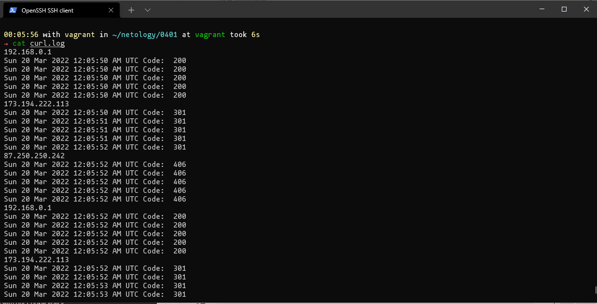
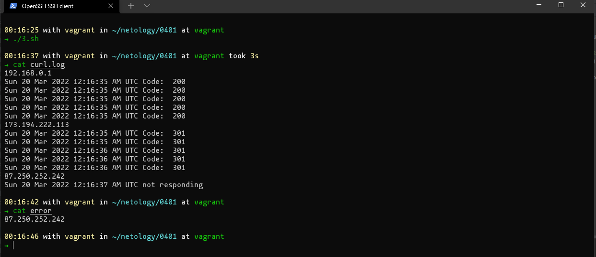

### Как сдавать задания

Вы уже изучили блок «Системы управления версиями», и начиная с этого занятия все ваши работы будут приниматься ссылками на .md-файлы, размещённые в вашем публичном репозитории.

Скопируйте в свой .md-файл содержимое этого файла; исходники можно посмотреть [здесь](https://raw.githubusercontent.com/netology-code/sysadm-homeworks/devsys10/04-script-01-bash/README.md). Заполните недостающие части документа решением задач (заменяйте `???`, ОСТАЛЬНОЕ В ШАБЛОНЕ НЕ ТРОГАЙТЕ чтобы не сломать форматирование текста, подсветку синтаксиса и прочее, иначе можно отправиться на доработку) и отправляйте на проверку. Вместо логов можно вставить скриншоты по желани.

---


# Домашнее задание к занятию "4.1. Командная оболочка Bash: Практические навыки"

## Обязательная задача 1

Есть скрипт:
```bash
a=1
b=2
c=a+b
d=$a+$b
e=$(($a+$b))
```

Какие значения переменным c,d,e будут присвоены? Почему?
(поправил в таблице a,b,c на c,d,e)

| Переменная | Значение | Обоснование                                                                                                                |
|------------|----------|----------------------------------------------------------------------------------------------------------------------------|
| `c`        | `a+b`    | Так как в переменную `c` помещена строка `a+b`, а не сложение переменных                                                   |
| `d`        | `1+2`    | Так как в переменную `d` помещена строка `$a+$b`, где вместо `$a` и `$b` подставляются значения соответствующих переменных |
| `e`        | `3`      | Так как происходит сложение переменных `$a` и `$b`, которые равны `1` и `2` соответственно                                 |


## Обязательная задача 2
На нашем локальном сервере упал сервис и мы написали скрипт, который постоянно проверяет его доступность, записывая дату проверок до тех пор, пока сервис не станет доступным (после чего скрипт должен завершиться). В скрипте допущена ошибка, из-за которой выполнение не может завершиться, при этом место на Жёстком Диске постоянно уменьшается. Что необходимо сделать, чтобы его исправить:
```bash
while ((1==1)
do
	curl https://localhost:4757
	if (($? != 0))
	then
		date >> curl.log
	fi
done
```

Необходимо написать скрипт, который проверяет доступность трёх IP: `192.168.0.1`, `173.194.222.113`, `87.250.250.242` по `80` порту и записывает результат в файл `log`. Проверять доступность необходимо пять раз для каждого узла.

### Ваш скрипт:

Первая часть - потеряна скобка в условии `while` и нету `break`

```bash
#!/usr/bin/env bash
while ((1==1))
do
        curl https://localhost:4757
        if (($?!=0))
        then
                date >> curl.log
        else
                break
        fi
done
```
Вторая часть:

```bash
#!/usr/bin/env bash
timeout=1
port=80
declare -i code
packet=5
array_ip=("192.168.0.1" "173.194.222.113" "87.250.250.242")
while ((1==1))
do
        for ip in ${array_ip[@]}
        do
                echo $ip >> curl.log
                p=0
                while (($p<$packet))
                do
                        code=$(curl --write-out '%{http_code}' --silent --output /dev/null --connect-timeout $timeout http://$ip:$port)
                        if (($code==0))
                        then
                                echo $(date) "not responding" >> curl.log
                        else
                                echo $(date) "Code: " $code >> curl.log
                        fi
                        p=$(($p+1))
                done
        done
done
```

Результат работы:



## Обязательная задача 3
Необходимо дописать скрипт из предыдущего задания так, чтобы он выполнялся до тех пор, пока один из узлов не окажется недоступным. Если любой из узлов недоступен - IP этого узла пишется в файл error, скрипт прерывается.

### Ваш скрипт:
```bash
#!/usr/bin/env bash
timeout=1
port=80
declare -i code
packet=5
array_ip=("192.168.0.1" "173.194.222.113" "87.250.252.242")
while ((1==1))
do
        for ip in ${array_ip[@]}
        do
                echo $ip >> curl.log
                p=0
                while (($p<$packet))
                do
                        code=$(curl --write-out '%{http_code}' --silent --output /dev/null --connect-timeout $timeout http://$ip:$port)
                        if (($code==0))
                        then
                                echo $(date) "not responding" >> curl.log
                                echo $ip > error
                                break 4
                        else
                                echo $(date) "Code: " $code >> curl.log
                        fi
                        p=$(($p+1))
                done
        done
done
```

Результат работы:



## Дополнительное задание (со звездочкой*) - необязательно к выполнению

Мы хотим, чтобы у нас были красивые сообщения для коммитов в репозиторий. Для этого нужно написать локальный хук для git, который будет проверять, что сообщение в коммите содержит код текущего задания в квадратных скобках и количество символов в сообщении не превышает 30. Пример сообщения: \[04-script-01-bash\] сломал хук.

### Ваш скрипт:
```bash
#!/bin/bash
commitRegex='^(\[[[:digit:]]{2}\-[[:alpha:]]+\-[[:digit:]]{2}\-[[:alpha:]]+\]\ [a-zA-Zа-яА-Я0-9\ \.\,\;\:]{1,30}$|merge|hotfix)'
if ! grep -qE "$commitRegex" "$1"; then
    echo "Aborting according commit message policy. Please specify [NN-string-NN-string] string."
    exit 1
fi
```

Соответственно в `.git/hooks/pre-commit`
