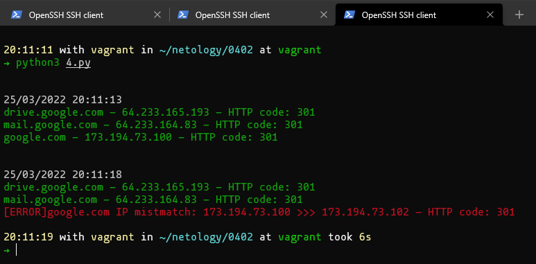

### Как сдавать задания

Вы уже изучили блок «Системы управления версиями», и начиная с этого занятия все ваши работы будут приниматься ссылками на .md-файлы, размещённые в вашем публичном репозитории.

Скопируйте в свой .md-файл содержимое этого файла; исходники можно посмотреть [здесь](https://raw.githubusercontent.com/netology-code/sysadm-homeworks/devsys10/04-script-02-py/README.md). Заполните недостающие части документа решением задач (заменяйте `???`, ОСТАЛЬНОЕ В ШАБЛОНЕ НЕ ТРОГАЙТЕ чтобы не сломать форматирование текста, подсветку синтаксиса и прочее, иначе можно отправиться на доработку) и отправляйте на проверку. Вместо логов можно вставить скриншоты по желани.

# Домашнее задание к занятию "4.2. Использование Python для решения типовых DevOps задач"

## Обязательная задача 1

Есть скрипт:
```python
#!/usr/bin/env python3
a = 1
b = '2'
c = a + b
```

### Вопросы:
| Вопрос  | Ответ                                                                                                     |
| ------------- |-----------------------------------------------------------------------------------------------------------|
| Какое значение будет присвоено переменной `c`?  | Никакое, т.к. `a` и `b` имеют разные типы `TypeError: unsupported operand type(s) for +: 'int' and 'str'` |
| Как получить для переменной `c` значение 12?  | Например так - `c = str(a) + b`                                                                           |
| Как получить для переменной `c` значение 3?  | Например так - `c = a + int(b)`                                                                           |

## Обязательная задача 2
Мы устроились на работу в компанию, где раньше уже был DevOps Engineer. Он написал скрипт, позволяющий узнать, какие файлы модифицированы в репозитории, относительно локальных изменений. Этим скриптом недовольно начальство, потому что в его выводе есть не все изменённые файлы, а также непонятен полный путь к директории, где они находятся. Как можно доработать скрипт ниже, чтобы он исполнял требования вашего руководителя?

```python
#!/usr/bin/env python3

import os

bash_command = ["cd ~/netology/sysadm-homeworks", "git status"]
result_os = os.popen(' && '.join(bash_command)).read()
is_change = False
for result in result_os.split('\n'):
    if result.find('modified') != -1:
        prepare_result = result.replace('\tmodified:   ', '')
        print(prepare_result)
        break
```

### Ваш скрипт:
```python
#!/usr/bin/env python3

import os

bash_command = ["cd ~/netology/sysadm-homeworks", "git status"]
result_os = os.popen(' && '.join(bash_command)).read()
path_to_rep = os.popen('cd ~/netology/sysadm-homeworks && pwd').read().split('\n')[0]+('/')

is_change = False
print('\033[32mmodified:')
for result in result_os.split('\n'):
    if result.find('modified') != -1:
        prepare_result = result.replace('\tmodified:   ', path_to_rep)
        print('\033[32m'+prepare_result)
        is_change = True
if not is_change:
    print('none')

flag = False
is_untracked = False
print('\033[31muntracked:')
str_num = 0
for result in result_os.split('\n'):
    if result.find('Untracked') != -1:
        is_untracked = True
        flag = True
        str_num = str_num + 1
    elif flag:
        str_num = str_num + 1
        if str_num >= 3:
            if len(result) == 0:
                flag = False
            else:
                prepare_result = '\033[31m'+path_to_rep+result.strip()
                print(prepare_result)
if not is_untracked:
    print('none')

is_change = False
print('\033[33mnew file:')
for result in result_os.split('\n'):
    if result.find('new file:') != -1:
        prepare_result = result.replace('\tnew file:   ', path_to_rep)
        print('\033[33m'+prepare_result)
        is_change = True
if not is_change:
    print('none')
```

### Вывод скрипта при запуске при тестировании:
```bash
21:52:54 with vagrant in ~/netology/0402 at vagrant
➜ python3 2.py
modified:
/home/vagrant/netology/sysadm-homeworks/01-intro-01/netology.sh
/home/vagrant/netology/sysadm-homeworks/01-intro-01/netology.tf
/home/vagrant/netology/sysadm-homeworks/01-intro-01/todo/netology.jsonnet
/home/vagrant/netology/sysadm-homeworks/02-git-01-vcs/terraform/README.md
untracked:
/home/vagrant/netology/sysadm-homeworks/01-intro-01/1.py
new file:
/home/vagrant/netology/sysadm-homeworks/02-git-01-vcs/terraform/newfile
```


## Обязательная задача 3
1. Доработать скрипт выше так, чтобы он мог проверять не только локальный репозиторий в текущей директории, а также умел воспринимать путь к репозиторию, который мы передаём как входной параметр. Мы точно знаем, что начальство коварное и будет проверять работу этого скрипта в директориях, которые не являются локальными репозиториями.

### Ваш скрипт:
```python
#!/usr/bin/env python3

import sys
from sys import argv
import os
from subprocess import PIPE, Popen

if len (sys.argv) > 1:
    script,path = argv
else:
    path = os.getcwd()

print(path)
bash_command = ["cd " + path, "git status"]
res_os = Popen(' && '.join(bash_command), shell=True, stdout=PIPE, stderr=PIPE)
stdout, stderr = res_os.communicate()

result_os = stdout
result_err = stderr
bash_path_command = ["cd " + path, "pwd"]
path_to_repo = Popen(' && '.join(bash_path_command), shell=True, stdout=PIPE, stderr=PIPE)
stdout_path, stderr_path = path_to_repo.communicate()
path_to_rep = stdout_path.decode().split('\n')[0]+('/')
path_to_repo_err = stderr_path.decode()
is_change = False

if path_to_repo_err.split('\n')[0].find('can\'t cd to') != -1:
    print('\033[31m'+path_to_repo_err)
    sys.exit(0)

if result_err.decode().split('\n')[0].find('fatal: not a git repository') != -1:
    print('\033[31m'+result_err.decode())
    sys.exit(0)

print('\033[32mmodified:')
for result in result_os.decode().split('\n'):
    if result.find('modified') != -1:
        prepare_result = result.replace('\tmodified:   ', path_to_rep)
        print('\033[32m'+prepare_result)
        is_change = True
if not is_change:
    print('none')

flag = False
is_untracked = False
print('\033[31muntracked:')
str_num = 0
for result in result_os.decode().split('\n'):
    if result.find('Untracked') != -1:
        is_untracked = True
        flag = True
        str_num = str_num + 1
    elif flag:
        str_num = str_num + 1
        if str_num >= 3:
            if len(result) == 0:
                flag = False
            else:
                prepare_result = '\033[31m'+path_to_rep+result.strip()
                print(prepare_result)
if not is_untracked:
    print('none')

is_change = False
print('\033[33mnew file:')
for result in result_os.decode().split('\n'):
    if result.find('new file:') != -1:
        prepare_result = result.replace('\tnew file:   ', path_to_rep)
        print('\033[33m'+prepare_result)
        is_change = True
if not is_change:
    print('none')
```

### Вывод скрипта при запуске при тестировании:
```bash
20:20:33 with vagrant in ~/netology/0402 at vagrant
➜ python3 3.py /home/vagrant/netology/sysadm-homeworks/
/home/vagrant/netology/sysadm-homeworks/
modified:
/home/vagrant/netology/sysadm-homeworks/01-intro-01/netology.sh
/home/vagrant/netology/sysadm-homeworks/01-intro-01/netology.tf
/home/vagrant/netology/sysadm-homeworks/01-intro-01/todo/netology.jsonnet
/home/vagrant/netology/sysadm-homeworks/02-git-01-vcs/terraform/README.md
untracked:
/home/vagrant/netology/sysadm-homeworks/01-intro-01/1.py
new file:
/home/vagrant/netology/sysadm-homeworks/02-git-01-vcs/terraform/newfile

20:20:37 with vagrant in ~/netology/0402 at vagrant
➜ python3 3.py /home/vagrant/netology/
/home/vagrant/netology/
fatal: not a git repository (or any of the parent directories): .git


20:20:43 with vagrant in ~/netology/0402 at vagrant
➜ python3 3.py /home/vagrant/netol
/home/vagrant/netol
/bin/sh: 1: cd: can't cd to /home/vagrant/netol


20:20:48 with vagrant in ~/netology/0402 at vagrant
➜ python3 3.py
/home/vagrant/netology/0402
fatal: not a git repository (or any of the parent directories): .git
```


## Обязательная задача 4
1. Наша команда разрабатывает несколько веб-сервисов, доступных по http. Мы точно знаем, что на их стенде нет никакой балансировки, кластеризации, за DNS прячется конкретный IP сервера, где установлен сервис. Проблема в том, что отдел, занимающийся нашей инфраструктурой очень часто меняет нам сервера, поэтому IP меняются примерно раз в неделю, при этом сервисы сохраняют за собой DNS имена. Это бы совсем никого не беспокоило, если бы несколько раз сервера не уезжали в такой сегмент сети нашей компании, который недоступен для разработчиков. Мы хотим написать скрипт, который опрашивает веб-сервисы, получает их IP, выводит информацию в стандартный вывод в виде: <URL сервиса> - <его IP>. Также, должна быть реализована возможность проверки текущего IP сервиса c его IP из предыдущей проверки. Если проверка будет провалена - оповестить об этом в стандартный вывод сообщением: [ERROR] <URL сервиса> IP mismatch: <старый IP> <Новый IP>. Будем считать, что наша разработка реализовала сервисы: `drive.google.com`, `mail.google.com`, `google.com`.

### Ваш скрипт:

Если можно, то выполню это задание без json/yaml, т.к. их использование будет в этом же скрипте в следующем ДЗ.

```python
#!/usr/bin/env python3

import sys
from subprocess import PIPE, Popen
import socket
import time
from datetime import datetime

port = "80" #порт который слушаем
timeout = "10" #таймаут подключения

hosts = {'drive.google.com':'','mail.google.com':'','google.com':''} #словарь "доменное имя" - "ip"

#функция заполнения словаря
def update_hosts(hosts_l):
    for host in hosts_l:
        ip = socket.gethostbyname(host)
        hosts_l[host] = ip
    return hosts_l

now_hosts = update_hosts(hosts)

error = False

while True:
    now = datetime.now()
    print('\n')
    print('\033[37m' + now.strftime("%d/%m/%Y %H:%M:%S"))
    for index, host in enumerate(now_hosts):
        #подключаемся curl по ip и получаем ответ сервера
        req = Popen('curl --write-out \'%{http_code}\' --silent --output /dev/null --connect-timeout ' + timeout + ' http://' + host + ':' + port, shell=True, stdout=PIPE, stderr=PIPE)
        stdout, stderr = req.communicate()
        code = stdout.decode()

        now_ip = socket.gethostbyname(host) #получаем текущий ip сервера
        if now_ip.find(now_hosts[host]) != -1:
            print('\033[32m' + host + ' - ' + now_ip + ' - HTTP code: ' + code)
        else:
            print('\033[31m[ERROR]' + host + ' IP mistmatch: ' + now_hosts[host] + ' >>> ' + now_ip + ' - HTTP code: ' + code)
            error = True

        now_hosts[host] = now_ip
    if error: #если ip сменился, прерываем выполнение скрипта, то только после опроса всех 3х серверов
        sys.exit(0)
    time.sleep(5)
```

### Вывод скрипта при запуске при тестировании:
```bash

20:11:11 with vagrant in ~/netology/0402 at vagrant
➜ python3 4.py


25/03/2022 20:11:13
drive.google.com - 64.233.165.193 - HTTP code: 301
mail.google.com - 64.233.164.83 - HTTP code: 301
google.com - 173.194.73.100 - HTTP code: 301


25/03/2022 20:11:18
drive.google.com - 64.233.165.193 - HTTP code: 301
mail.google.com - 64.233.164.83 - HTTP code: 301
[ERROR]google.com IP mistmatch: 173.194.73.100 >>> 173.194.73.102 - HTTP code: 301

20:11:19 with vagrant in ~/netology/0402 at vagrant took 6s
➜
```



## Дополнительное задание (со звездочкой*) - необязательно к выполнению

Так получилось, что мы очень часто вносим правки в конфигурацию своей системы прямо на сервере. Но так как вся наша команда разработки держит файлы конфигурации в github и пользуется gitflow, то нам приходится каждый раз переносить архив с нашими изменениями с сервера на наш локальный компьютер, формировать новую ветку, коммитить в неё изменения, создавать pull request (PR) и только после выполнения Merge мы наконец можем официально подтвердить, что новая конфигурация применена. Мы хотим максимально автоматизировать всю цепочку действий. Для этого нам нужно написать скрипт, который будет в директории с локальным репозиторием обращаться по API к github, создавать PR для вливания текущей выбранной ветки в master с сообщением, которое мы вписываем в первый параметр при обращении к py-файлу (сообщение не может быть пустым). При желании, можно добавить к указанному функционалу создание новой ветки, commit и push в неё изменений конфигурации. С директорией локального репозитория можно делать всё, что угодно. Также, принимаем во внимание, что Merge Conflict у нас отсутствуют и их точно не будет при push, как в свою ветку, так и при слиянии в master. Важно получить конечный результат с созданным PR, в котором применяются наши изменения. 

### Ваш скрипт:
```python
???
```

### Вывод скрипта при запуске при тестировании:
```
???
```
