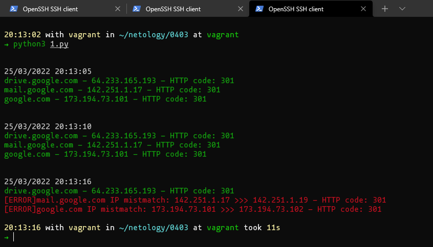

### Как сдавать задания

Вы уже изучили блок «Системы управления версиями», и начиная с этого занятия все ваши работы будут приниматься ссылками на .md-файлы, размещённые в вашем публичном репозитории.

Скопируйте в свой .md-файл содержимое этого файла; исходники можно посмотреть [здесь](https://raw.githubusercontent.com/netology-code/sysadm-homeworks/devsys10/04-script-03-yaml/README.md). Заполните недостающие части документа решением задач (заменяйте `???`, ОСТАЛЬНОЕ В ШАБЛОНЕ НЕ ТРОГАЙТЕ чтобы не сломать форматирование текста, подсветку синтаксиса и прочее, иначе можно отправиться на доработку) и отправляйте на проверку. Вместо логов можно вставить скриншоты по желани.

# Домашнее задание к занятию "4.3. Языки разметки JSON и YAML"


## Обязательная задача 1
Мы выгрузили JSON, который получили через API запрос к нашему сервису:
```
    { "info" : "Sample JSON output from our service\t",
        "elements" :[
            { "name" : "first",
            "type" : "server",
            "ip" : 7175 
            }, 
            { "name" : "second",
            "type" : "proxy",
            "ip" : "71.78.22.43"   
            }
        ]
    }
```
  Нужно найти и исправить все ошибки, которые допускает наш сервис

1. запятая в 6 строке после }
2. ковычка у "ip в 9 строке
3. сам ip адресс в ковычки в 9 строке

## Обязательная задача 2
В прошлый рабочий день мы создавали скрипт, позволяющий опрашивать веб-сервисы и получать их IP. К уже реализованному функционалу нам нужно добавить возможность записи JSON и YAML файлов, описывающих наши сервисы. Формат записи JSON по одному сервису: `{ "имя сервиса" : "его IP"}`. Формат записи YAML по одному сервису: `- имя сервиса: его IP`. Если в момент исполнения скрипта меняется IP у сервиса - он должен так же поменяться в yml и json файле.

### Ваш скрипт:
```python
#!/usr/bin/env python3

import os
import sys
from subprocess import PIPE, Popen
import socket
import time
from datetime import datetime
import json
import yaml

port = "80" #порт который слушаем
timeout = "10" #таймаут подключения

hosts = {'drive.google.com':'','mail.google.com':'','google.com':''} #словарь "доменное имя" - "ip"

#функция заполнения словаря
def update_hosts(hosts_l):
    for host in hosts_l:
        ip = socket.gethostbyname(host)
        hosts_l[host] = ip
    return hosts_l

#функция обновления yaml и json
def update_files(hosts_l):
    with open('hosts.json', 'w') as hosts_json:
        hosts_json.write(str(json.dumps(hosts_l)))
    with open('hosts.yaml', 'w') as hosts_yaml:
        hosts_yaml.write(yaml.dump(hosts_l))
    return

#чтение из json файла
def load_file(hosts_l):
    if os.path.exists("hosts.json"):
        print("Read from file:")
        with open('hosts.json', 'r') as hosts_json:
            try:
                tmp_hosts = json.loads(hosts_json.read())
            except ValueError as err:
                print(err)
                return False
            for tmp_host in tmp_hosts:
                hosts_l[tmp_host] = tmp_hosts[tmp_host]
                print(tmp_host + " >>> " + hosts_l[tmp_host])
        return True
    else:
        return False

if load_file(hosts):
    now_hosts = hosts
    pass
else:
    print("No json file")
    update_files(update_hosts(hosts))
    now_hosts = update_hosts(hosts)
error = False

while True:
    now = datetime.now()
    print('\n')
    print('\033[37m' + now.strftime("%d/%m/%Y %H:%M:%S"))
    for index, host in enumerate(now_hosts):
        #подключаемся curl по ip и получаем ответ сервера
        req = Popen('curl --write-out \'%{http_code}\' --silent --output /dev/null --connect-timeout ' + timeout + ' http://' + host + ':' + port, shell=True, stdout=PIPE, stderr=PIPE)
        stdout, stderr = req.communicate()
        code = stdout.decode()
        now_ip = socket.gethostbyname(host) #получаем текущий ip сервера
        if now_ip.find(now_hosts[host]) != -1:
            print('\033[32m' + host + ' - ' + now_ip + ' - HTTP code: ' + code)
        else:
            print('\033[31m[ERROR]' + host + ' IP mistmatch: ' + now_hosts[host] + ' >>> ' + now_ip + ' - HTTP code: ' + code)
            error = True

        now_hosts[host] = now_ip
    if error: #если ip сменился, записываем текущие ip в yaml и json, прерываем выполнение скрипта, но только после опроса всех 3х серверов
        update_files(now_hosts)
        sys.exit(0)
    time.sleep(5)
```

### Вывод скрипта при запуске при тестировании:
```
20:13:02 with vagrant in ~/netology/0403 at vagrant
➜ python3 1.py


25/03/2022 20:13:05
drive.google.com - 64.233.165.193 - HTTP code: 301
mail.google.com - 142.251.1.17 - HTTP code: 301
google.com - 173.194.73.101 - HTTP code: 301


25/03/2022 20:13:10
drive.google.com - 64.233.165.193 - HTTP code: 301
mail.google.com - 142.251.1.17 - HTTP code: 301
google.com - 173.194.73.101 - HTTP code: 301


25/03/2022 20:13:16
drive.google.com - 64.233.165.193 - HTTP code: 301
[ERROR]mail.google.com IP mistmatch: 142.251.1.17 >>> 142.251.1.19 - HTTP code: 301
[ERROR]google.com IP mistmatch: 173.194.73.101 >>> 173.194.73.102 - HTTP code: 301

20:13:16 with vagrant in ~/netology/0403 at vagrant took 11s
➜
```



### json-файл(ы), который(е) записал ваш скрипт:
```json
{"drive.google.com": "64.233.165.193", "mail.google.com": "142.251.1.17", "google.com": "173.194.221.102"}
```
### yml-файл(ы), который(е) записал ваш скрипт:
```yaml
drive.google.com: 64.233.165.193
google.com: 173.194.221.102
mail.google.com: 142.251.1.17
```

## Дополнительное задание (со звездочкой*) - необязательно к выполнению

Так как команды в нашей компании никак не могут прийти к единому мнению о том, какой формат разметки данных использовать: JSON или YAML, нам нужно реализовать парсер из одного формата в другой. Он должен уметь:
   * Принимать на вход имя файла
   * Проверять формат исходного файла. Если файл не json или yml - скрипт должен остановить свою работу
   * Распознавать какой формат данных в файле. Считается, что файлы *.json и *.yml могут быть перепутаны
   * Перекодировать данные из исходного формата во второй доступный (из JSON в YAML, из YAML в JSON)
   * При обнаружении ошибки в исходном файле - указать в стандартном выводе строку с ошибкой синтаксиса и её номер
   * Полученный файл должен иметь имя исходного файла, разница в наименовании обеспечивается разницей расширения файлов

### Ваш скрипт:
```python
???
```

### Пример работы скрипта:
???
