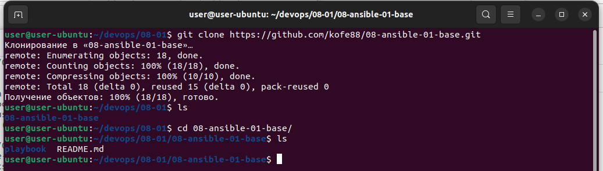
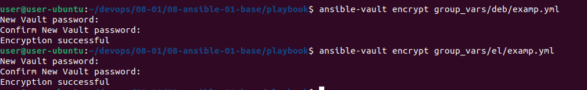

# Домашнее задание к занятию "08.01 Введение в Ansible"

## Подготовка к выполнению
1. Установите ansible версии 2.10 или выше.

---

Установлен с прошлых заданий.

```bash
user@user-ubuntu:~/devops/08-01$ ansible --version
ansible 2.10.8
  config file = None
  configured module search path = ['/home/user/.ansible/plugins/modules', '/usr/share/ansible/plugins/modules']
  ansible python module location = /usr/lib/python3/dist-packages/ansible
  executable location = /usr/bin/ansible
  python version = 3.10.4 (main, Jun 29 2022, 12:14:53) [GCC 11.2.0]
```


---

2. Создайте свой собственный публичный репозиторий на github с произвольным именем.

---

Создан [репозиторий](https://github.com/kofe88/08-ansible-01-base)

---
3. Скачайте [playbook](playbook/) из репозитория с домашним заданием и перенесите его в свой репозиторий.

---

Playbook перенесен [->>>>](https://github.com/kofe88/08-ansible-01-base/tree/main/playbook)

```bash
user@user-ubuntu:~/devops/08-01$ git clone https://github.com/kofe88/08-ansible-01-base.git
Клонирование в «08-ansible-01-base»…
remote: Enumerating objects: 18, done.
remote: Counting objects: 100% (18/18), done.
remote: Compressing objects: 100% (10/10), done.
remote: Total 18 (delta 0), reused 15 (delta 0), pack-reused 0
Получение объектов: 100% (18/18), готово.
```



---

## Основная часть
1. Попробуйте запустить playbook на окружении из `test.yml`, зафиксируйте какое значение имеет факт `some_fact` для указанного хоста при выполнении playbook'a.

---

```bash
user@user-ubuntu:~/devops/08-01/08-ansible-01-base/playbook$ ansible-playbook -i inventory/test.yml site.yml

PLAY [Print os facts] ******************************************************************************************

TASK [Gathering Facts] *****************************************************************************************
ok: [localhost]

TASK [Print OS] ************************************************************************************************
ok: [localhost] => {
    "msg": "Ubuntu"
}

TASK [Print fact] **********************************************************************************************
ok: [localhost] => {
    "msg": 12
}

PLAY RECAP *****************************************************************************************************
localhost                  : ok=3    changed=0    unreachable=0    failed=0    skipped=0    rescued=0    ignored=0   
```


---

2. Найдите файл с переменными (group_vars) в котором задаётся найденное в первом пункте значение и поменяйте его на 'all default fact'.

---

Было 

```bash
user@user-ubuntu:~/devops/08-01/08-ansible-01-base/playbook$ cd  group_vars/
user@user-ubuntu:~/devops/08-01/08-ansible-01-base/playbook/group_vars$ ls
all  deb  el
user@user-ubuntu:~/devops/08-01/08-ansible-01-base/playbook/group_vars$ cat all/examp.yml 
---
  some_fact: 12
```

Стало

```bash
user@user-ubuntu:~/devops/08-01/08-ansible-01-base/playbook/group_vars$ nano all/examp.yml 
user@user-ubuntu:~/devops/08-01/08-ansible-01-base/playbook/group_vars$ cat all/examp.yml 
---
  some_fact: all default fact

```
---


3. Воспользуйтесь подготовленным (используется `docker`) или создайте собственное окружение для проведения дальнейших испытаний.

---

```bash
user@user-ubuntu:~/devops/08-01/08-ansible-01-base/docker$ cat docker-compose.yml 
version: "3.9"
services:
  centos7:
    image: pycontribs/centos:7
    container_name: centos7

  ubuntu:
    image: pycontribs/ubuntu
    container_name: ubuntu
```

```bash
user@user-ubuntu:~/devops/08-01/08-ansible-01-base/docker$ sudo docker-compose up -d
[sudo] \u043f\u0430\u0440\u043e\u043b\u044c \u0434\u043b\u044f user: 
Creating network "docker_default" with the default driver
Pulling centos7 (pycontribs/centos:7)...
7: Pulling from pycontribs/centos
2d473b07cdd5: Pull complete
43e1b1841fcc: Pull complete
85bf99ab446d: Pull complete
Digest: sha256:b3ce994016fd728998f8ebca21eb89bf4e88dbc01ec2603c04cc9c56ca964c69
Status: Downloaded newer image for pycontribs/centos:7
Pulling ubuntu (pycontribs/ubuntu:)...
latest: Pulling from pycontribs/ubuntu
423ae2b273f4: Pull complete
de83a2304fa1: Pull complete
f9a83bce3af0: Pull complete
b6b53be908de: Pull complete
7378af08dad3: Pull complete
Digest: sha256:dcb590e80d10d1b55bd3d00aadf32de8c413531d5cc4d72d0849d43f45cb7ec4
Status: Downloaded newer image for pycontribs/ubuntu:latest
Creating ubuntu  ... done
Creating centos7 ... done
```


---

4. Проведите запуск playbook на окружении из `prod.yml`. Зафиксируйте полученные значения `some_fact` для каждого из `managed host`.

---

```bash
user@user-ubuntu:~/devops/08-01/08-ansible-01-base/playbook$ ansible-playbook -i inventory/prod.yml -v site.yml
No config file found; using defaults

PLAY [Print os facts] ************************************************************************************************************************

TASK [Gathering Facts] ***********************************************************************************************************************
[DEPRECATION WARNING]: Distribution Ubuntu 18.04 on host ubuntu should use /usr/bin/python3, but is using /usr/bin/python for backward 
compatibility with prior Ansible releases. A future Ansible release will default to using the discovered platform python for this host. See 
https://docs.ansible.com/ansible/2.10/reference_appendices/interpreter_discovery.html for more information. This feature will be removed in 
version 2.12. Deprecation warnings can be disabled by setting deprecation_warnings=False in ansible.cfg.
ok: [ubuntu]
ok: [centos7]

TASK [Print OS] ******************************************************************************************************************************
ok: [centos7] => {
    "msg": "CentOS"
}
ok: [ubuntu] => {
    "msg": "Ubuntu"
}

TASK [Print fact] ****************************************************************************************************************************
ok: [centos7] => {
    "msg": "el"
}
ok: [ubuntu] => {
    "msg": "deb"
}

PLAY RECAP ***********************************************************************************************************************************
centos7                    : ok=3    changed=0    unreachable=0    failed=0    skipped=0    rescued=0    ignored=0   
ubuntu                     : ok=3    changed=0    unreachable=0    failed=0    skipped=0    rescued=0    ignored=0   
```


---


5. Добавьте факты в `group_vars` каждой из групп хостов так, чтобы для `some_fact` получились следующие значения: для `deb` - 'deb default fact', для `el` - 'el default fact'.

---

Было

```bash
user@user-ubuntu:~/devops/08-01/08-ansible-01-base/playbook$ cat group_vars/deb/examp.yml 
---
  some_fact: "deb"

user@user-ubuntu:~/devops/08-01/08-ansible-01-base/playbook$ cat group_vars/el/examp.yml 
---
  some_fact: "el"

  ```

Стало

```bash
user@user-ubuntu:~/devops/08-01/08-ansible-01-base/playbook$ nano group_vars/deb/examp.yml 
user@user-ubuntu:~/devops/08-01/08-ansible-01-base/playbook$ nano group_vars/el/examp.yml 
user@user-ubuntu:~/devops/08-01/08-ansible-01-base/playbook$ cat group_vars/el/examp.yml 
---
  some_fact: el default fact
user@user-ubuntu:~/devops/08-01/08-ansible-01-base/playbook$ cat group_vars/deb/examp.yml 
---
  some_fact: deb default fact
```
---

6. Повторите запуск playbook на окружении `prod.yml`. Убедитесь, что выдаются корректные значения для всех хостов.

---

```bash
user@user-ubuntu:~/devops/08-01/08-ansible-01-base/playbook$ ansible-playbook -i inventory/prod.yml -v site.yml
No config file found; using defaults

PLAY [Print os facts] ************************************************************************************************************************

TASK [Gathering Facts] ***********************************************************************************************************************
[DEPRECATION WARNING]: Distribution Ubuntu 18.04 on host ubuntu should use /usr/bin/python3, but is using /usr/bin/python for backward 
compatibility with prior Ansible releases. A future Ansible release will default to using the discovered platform python for this host. See 
https://docs.ansible.com/ansible/2.10/reference_appendices/interpreter_discovery.html for more information. This feature will be removed in 
version 2.12. Deprecation warnings can be disabled by setting deprecation_warnings=False in ansible.cfg.
ok: [ubuntu]
ok: [centos7]

TASK [Print OS] ******************************************************************************************************************************
ok: [centos7] => {
    "msg": "CentOS"
}
ok: [ubuntu] => {
    "msg": "Ubuntu"
}

TASK [Print fact] ****************************************************************************************************************************
ok: [centos7] => {
    "msg": "el default fact"
}
ok: [ubuntu] => {
    "msg": "deb default fact"
}

PLAY RECAP ***********************************************************************************************************************************
centos7                    : ok=3    changed=0    unreachable=0    failed=0    skipped=0    rescued=0    ignored=0   
ubuntu                     : ok=3    changed=0    unreachable=0    failed=0    skipped=0    rescued=0    ignored=0  
```


---

7. При помощи `ansible-vault` зашифруйте факты в `group_vars/deb` и `group_vars/el` с паролем `netology`.

---

```bash
user@user-ubuntu:~/devops/08-01/08-ansible-01-base/playbook$ ansible-vault encrypt group_vars/deb/examp.yml
New Vault password: 
Confirm New Vault password: 
Encryption successful
user@user-ubuntu:~/devops/08-01/08-ansible-01-base/playbook$ ansible-vault encrypt group_vars/el/examp.yml 
New Vault password: 
Confirm New Vault password: 
Encryption successful
```



---


8. Запустите playbook на окружении `prod.yml`. При запуске `ansible` должен запросить у вас пароль. Убедитесь в работоспособности.

---

При запуске без флага вываливается с ошибкой

```bash
user@user-ubuntu:~/devops/08-01/08-ansible-01-base/playbook$ ansible-playbook -i inventory/prod.yml -v site.yml
No config file found; using defaults

PLAY [Print os facts] ************************************************************************************************************************
ERROR! Attempting to decrypt but no vault secrets found
```


Запустим с флагом `--ask-vault-pass`

```bash
user@user-ubuntu:~/devops/08-01/08-ansible-01-base/playbook$ ansible-playbook -i inventory/prod.yml -v site.yml --ask-vault-pass
No config file found; using defaults
Vault password: 

PLAY [Print os facts] ************************************************************************************************************************

TASK [Gathering Facts] ***********************************************************************************************************************
[DEPRECATION WARNING]: Distribution Ubuntu 18.04 on host ubuntu should use /usr/bin/python3, but is using /usr/bin/python for backward 
compatibility with prior Ansible releases. A future Ansible release will default to using the discovered platform python for this host. See 
https://docs.ansible.com/ansible/2.10/reference_appendices/interpreter_discovery.html for more information. This feature will be removed in 
version 2.12. Deprecation warnings can be disabled by setting deprecation_warnings=False in ansible.cfg.
ok: [ubuntu]
ok: [centos7]

TASK [Print OS] ******************************************************************************************************************************
ok: [centos7] => {
    "msg": "CentOS"
}
ok: [ubuntu] => {
    "msg": "Ubuntu"
}

TASK [Print fact] ****************************************************************************************************************************
ok: [centos7] => {
    "msg": "el default fact"
}
ok: [ubuntu] => {
    "msg": "deb default fact"
}

PLAY RECAP ***********************************************************************************************************************************
centos7                    : ok=3    changed=0    unreachable=0    failed=0    skipped=0    rescued=0    ignored=0   
ubuntu                     : ok=3    changed=0    unreachable=0    failed=0    skipped=0    rescued=0    ignored=0   
```


---

9. Посмотрите при помощи `ansible-doc` список плагинов для подключения. Выберите подходящий для работы на `control node`.

---

```bash
user@user-ubuntu:~/devops/08-01/08-ansible-01-base/playbook$ ansible-doc -t connection -l
ansible.netcommon.httpapi      Use httpapi to run command on network appliances                                                                                  
ansible.netcommon.libssh       (Tech preview) Run tasks using libssh for ssh connection                                                                          
ansible.netcommon.napalm       Provides persistent connection using NAPALM                                                                                       
ansible.netcommon.netconf      Provides a persistent connection using the netconf protocol                                                                       
ansible.netcommon.network_cli  Use network_cli to run command on network appliances                                                                              
ansible.netcommon.persistent   Use a persistent unix socket for connection                                                                                       
community.aws.aws_ssm          execute via AWS Systems Manager                                                                                                   
community.docker.docker        Run tasks in docker containers                                                                                                    
community.docker.docker_api    Run tasks in docker containers                                                                                                    
community.general.chroot       Interact with local chroot                                                                                                        
community.general.docker       Run tasks in docker containers                                                                                                    
community.general.funcd        Use funcd to connect to target                                                                                                    
community.general.iocage       Run tasks in iocage jails                                                                                                         
community.general.jail         Run tasks in jails                                                                                                                
community.general.lxc          Run tasks in lxc containers via lxc python library                                                                                
community.general.lxd          Run tasks in lxc containers via lxc CLI                                                                                           
community.general.oc           Execute tasks in pods running on OpenShift                                                                                        
community.general.qubes        Interact with an existing QubesOS AppVM                                                                                           
community.general.saltstack    Allow ansible to piggyback on salt minions                                                                                        
community.general.zone         Run tasks in a zone instance                                                                                                      
community.kubernetes.kubectl   Execute tasks in pods running on Kubernetes                                                                                       
community.libvirt.libvirt_lxc  Run tasks in lxc containers via libvirt                                                                                           
community.libvirt.libvirt_qemu Run tasks on libvirt/qemu virtual machines                                                                                        
community.okd.oc               Execute tasks in pods running on OpenShift                                                                                        
community.vmware.vmware_tools  Execute tasks inside a VM via VMware Tools                                                                                        
containers.podman.buildah      Interact with an existing buildah container                                                                                       
containers.podman.podman       Interact with an existing podman container                                                                                        
local                          execute on controller                                                                                                             
paramiko_ssh                   Run tasks via python ssh (paramiko)                                                                                               
psrp                           Run tasks over Microsoft PowerShell Remoting Protocol                                                                             
ssh                            connect via ssh client binary                                                                                                     
winrm                          Run tasks over Microsoft's WinRM 
```

Нужен `local`


---

10. В `prod.yml` добавьте новую группу хостов с именем  `local`, в ней разместите localhost с необходимым типом подключения.

---

```bash
user@user-ubuntu:~/devops/08-01/08-ansible-01-base/playbook$ cat inventory/prod.yml
---
  el:
    hosts:
      centos7:
        ansible_connection: docker
  deb:
    hosts:
      ubuntu:
        ansible_connection: docker
  local:
    hosts:
      localhost:
        ansible_connection: local
```


---

11. Запустите playbook на окружении `prod.yml`. При запуске `ansible` должен запросить у вас пароль. Убедитесь что факты `some_fact` для каждого из хостов определены из верных `group_vars`.

---

```bash
user@user-ubuntu:~/devops/08-01/08-ansible-01-base/playbook$ ansible-playbook -i inventory/prod.yml -v site.yml --ask-vault-pass
Using /home/user/devops/08-01/08-ansible-01-base/playbook/ansible.cfg as config file
Vault password: 

PLAY [Print os facts] ************************************************************************************************************************************************

TASK [Gathering Facts] ***********************************************************************************************************************************************
ok: [localhost]
[DEPRECATION WARNING]: Distribution Ubuntu 18.04 on host ubuntu should use /usr/bin/python3, but is using /usr/bin/python for backward compatibility with prior 
Ansible releases. A future Ansible release will default to using the discovered platform python for this host. See 
https://docs.ansible.com/ansible/2.10/reference_appendices/interpreter_discovery.html for more information. This feature will be removed in version 2.12. Deprecation
 warnings can be disabled by setting deprecation_warnings=False in ansible.cfg.
ok: [ubuntu]
ok: [centos7]

TASK [Print OS] ******************************************************************************************************************************************************
ok: [localhost] => {
    "msg": "Ubuntu"
}
ok: [centos7] => {
    "msg": "CentOS"
}
ok: [ubuntu] => {
    "msg": "Ubuntu"
}

TASK [Print fact] ****************************************************************************************************************************************************
ok: [localhost] => {
    "msg": "all default fact"
}
ok: [centos7] => {
    "msg": "el default fact"
}
ok: [ubuntu] => {
    "msg": "deb default fact"
}

PLAY RECAP ***********************************************************************************************************************************************************
centos7                    : ok=3    changed=0    unreachable=0    failed=0    skipped=0    rescued=0    ignored=0   
localhost                  : ok=3    changed=0    unreachable=0    failed=0    skipped=0    rescued=0    ignored=0   
ubuntu                     : ok=3    changed=0    unreachable=0    failed=0    skipped=0    rescued=0    ignored=0   
```


---

12. Заполните `README.md` ответами на вопросы. Сделайте `git push` в ветку `master`. В ответе отправьте ссылку на ваш открытый репозиторий с изменённым `playbook` и заполненным `README.md`.

---

[Репозиторий](https://github.com/kofe88/08-ansible-01-base/tree/main/playbook)

---

## Необязательная часть

1. При помощи `ansible-vault` расшифруйте все зашифрованные файлы с переменными.
2. Зашифруйте отдельное значение `PaSSw0rd` для переменной `some_fact` паролем `netology`. Добавьте полученное значение в `group_vars/all/exmp.yml`.
3. Запустите `playbook`, убедитесь, что для нужных хостов применился новый `fact`.
4. Добавьте новую группу хостов `fedora`, самостоятельно придумайте для неё переменную. В качестве образа можно использовать [этот](https://hub.docker.com/r/pycontribs/fedora).
5. Напишите скрипт на bash: автоматизируйте поднятие необходимых контейнеров, запуск ansible-playbook и остановку контейнеров.
6. Все изменения должны быть зафиксированы и отправлены в вашей личный репозиторий.

---

### Как оформить ДЗ?

Выполненное домашнее задание пришлите ссылкой на .md-файл в вашем репозитории.

---
