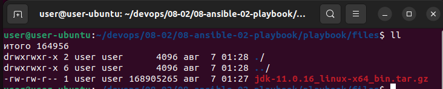
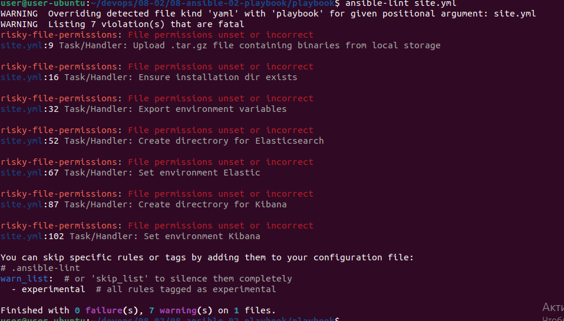
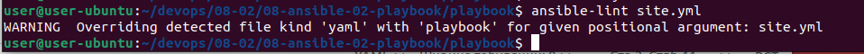
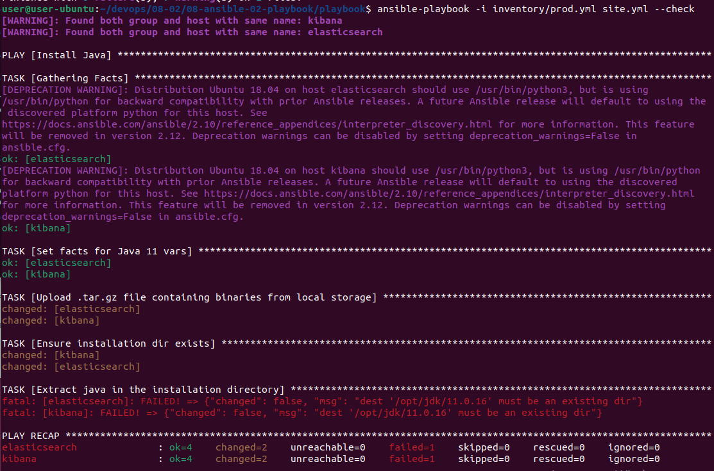
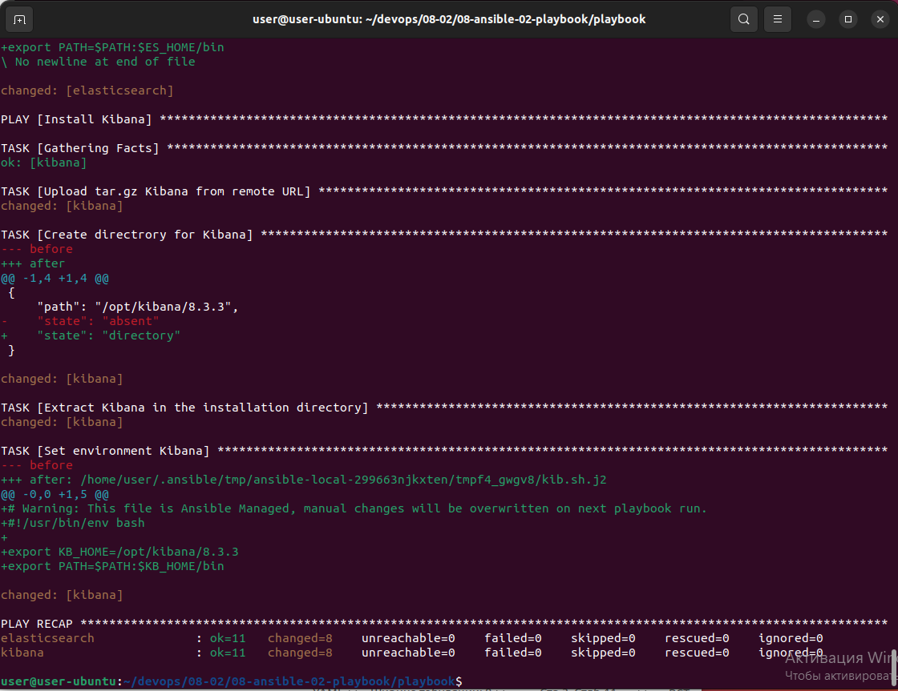
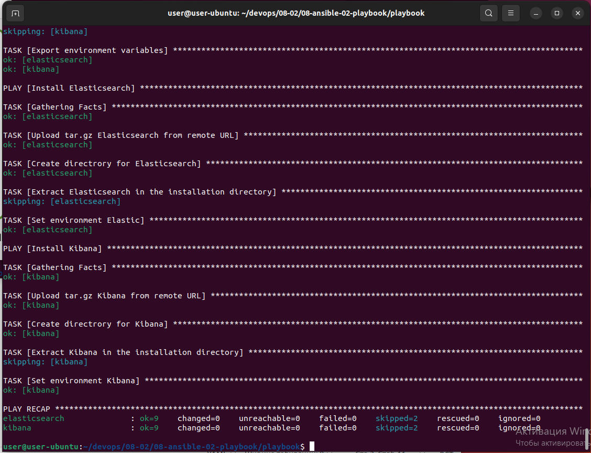

# Домашнее задание к занятию "08.02 Работа с Playbook"

## Подготовка к выполнению
1. Создайте свой собственный (или используйте старый) публичный репозиторий на github с произвольным именем.

---

Репозиторий [->>>](https://github.com/kofe88/08-ansible-02-playbook)

---

2. Скачайте [playbook](./playbook/) из репозитория с домашним заданием и перенесите его в свой репозиторий.

---

```bash
user@user-ubuntu:~/devops/08-02/08-ansible-02-playbook$ git clone https://github.com/kofe88/08-ansible-02-playbook.git
user@user-ubuntu:~/devops/08-02/08-ansible-02-playbook$ ls
docker  playbook  README.md
```

---

3. Подготовьте хосты в соотвтествии с группами из предподготовленного playbook. 

---

docker-compose.yml файл

```bash
version: "3.9"
services:
  elasticsearch:
    image: pycontribs/ubuntu      
    container_name: elasticsearch
    entrypoint: "tail -f /dev/null"
  kibana:
    image: pycontribs/ubuntu
    container_name: kibana
    entrypoint: "tail -f /dev/null"


```

---

4. Скачайте дистрибутив [java](https://www.oracle.com/java/technologies/javase-jdk11-downloads.html) и положите его в директорию `playbook/files/`. 

---

```bash
user@user-ubuntu:~/devops/08-02/08-ansible-02-playbook/playbook/files$ ll
\u0438\u0442\u043e\u0433\u043e 164956
drwxrwxr-x 2 user user      4096 \u0430\u0432\u0433  7 01:28 ./
drwxrwxr-x 6 user user      4096 \u0430\u0432\u0433  7 01:28 ../
-rw-rw-r-- 1 user user 168905265 \u0430\u0432\u0433  7 01:27 jdk-11.0.16_linux-x64_bin.tar.gz
```



---

## Основная часть
1. Приготовьте свой собственный inventory файл `prod.yml`.

---

```bash
---
elasticsearch:
  hosts:
    elasticsearch:
      ansible_connection: docker      
kibana:
  hosts:
    kibana:
      ansible_connection: docker
```

---

2. Допишите playbook: нужно сделать ещё один play, который устанавливает и настраивает kibana.
3. При создании tasks рекомендую использовать модули: `get_url`, `template`, `unarchive`, `file`.
4. Tasks должны: скачать нужной версии дистрибутив, выполнить распаковку в выбранную директорию, сгенерировать конфигурацию с параметрами.

---

По аналогии с `elasticsearch`, так же добавил `group_vars` и `templates`

site.yml

```yaml
- name: Install Kibana
  hosts: kibana
  tasks:
    - name: Upload tar.gz Kibana from remote URL
      get_url:
        url: "https://artifacts.elastic.co/downloads/kibana/kibana-{{ kibana_version }}-linux-x86_64.tar.gz"
        dest: "/tmp/kibana-{{ kibana_version }}-linux-x86_64.tar.gz"
        mode: 0755
        timeout: 60
        force: true
        validate_certs: false
      register: get_kibana
      until: get_kibana is succeeded
      tags: kibana
    - name: Create directrory for Kibana
      file:
        state: directory
        path: "{{ kibana_home }}"
        mode: 0755
      tags: kibana
    - name: Extract Kibana in the installation directory
      become: true
      unarchive:
        copy: false
        src: "/tmp/kibana-{{ kibana_version }}-linux-x86_64.tar.gz"
        dest: "{{ kibana_home }}"
        extra_opts: [--strip-components=1]
        creates: "{{ kibana_home }}/bin/kibana"
        mode: 0755
      tags:
        - kibana
    - name: Set environment Kibana
      become: true
      template:
        src: templates/kib.sh.j2
        dest: /etc/profile.d/kib.sh
        mode: 0755
      tags: kibana
```

kib.sh.j2

```yaml
# Warning: This file is Ansible Managed, manual changes will be overwritten on next playbook run.
#!/usr/bin/env bash

export KB_HOME={{ kibana_home }}
export PATH=$PATH:$KB_HOME/bin
```

vars.yml

```yaml
---
kibana_version: "8.3.3"
kibana_home: "/opt/kibana/{{ kibana_version }}"
```

---

5. Запустите `ansible-lint site.yml` и исправьте ошибки, если они есть.

---

Ошибок нет, только варнинги

```bash
user@user-ubuntu:~/devops/08-02/08-ansible-02-playbook/playbook$ ansible-lint site.yml
WARNING  Overriding detected file kind 'yaml' with 'playbook' for given positional argument: site.yml
WARNING  Listing 7 violation(s) that are fatal
risky-file-permissions: File permissions unset or incorrect
site.yml:9 Task/Handler: Upload .tar.gz file containing binaries from local storage

risky-file-permissions: File permissions unset or incorrect
site.yml:16 Task/Handler: Ensure installation dir exists

risky-file-permissions: File permissions unset or incorrect
site.yml:32 Task/Handler: Export environment variables

risky-file-permissions: File permissions unset or incorrect
site.yml:52 Task/Handler: Create directrory for Elasticsearch

risky-file-permissions: File permissions unset or incorrect
site.yml:67 Task/Handler: Set environment Elastic

risky-file-permissions: File permissions unset or incorrect
site.yml:87 Task/Handler: Create directrory for Kibana

risky-file-permissions: File permissions unset or incorrect
site.yml:102 Task/Handler: Set environment Kibana

You can skip specific rules or tags by adding them to your configuration file:
# .ansible-lint
warn_list:  # or 'skip_list' to silence them completely
  - experimental  # all rules tagged as experimental

Finished with 0 failure(s), 7 warning(s) on 1 files.

```



Убрал варнинги

```bash
user@user-ubuntu:~/devops/08-02/08-ansible-02-playbook/playbook$ ansible-lint site.yml
WARNING  Overriding detected file kind 'yaml' with 'playbook' for given positional argument: site.yml
```



---

6. Попробуйте запустить playbook на этом окружении с флагом `--check`.

---

Ошибка

```bash
user@user-ubuntu:~/devops/08-02/08-ansible-02-playbook/playbook$ ansible-playbook -i inventory/prod.yml site.yml --check
[WARNING]: Found both group and host with same name: kibana
[WARNING]: Found both group and host with same name: elasticsearch

PLAY [Install Java] *******************************************************************************************************

TASK [Gathering Facts] ****************************************************************************************************
[DEPRECATION WARNING]: Distribution Ubuntu 18.04 on host elasticsearch should use /usr/bin/python3, but is using 
/usr/bin/python for backward compatibility with prior Ansible releases. A future Ansible release will default to using the
 discovered platform python for this host. See 
https://docs.ansible.com/ansible/2.10/reference_appendices/interpreter_discovery.html for more information. This feature 
will be removed in version 2.12. Deprecation warnings can be disabled by setting deprecation_warnings=False in 
ansible.cfg.
ok: [elasticsearch]
[DEPRECATION WARNING]: Distribution Ubuntu 18.04 on host kibana should use /usr/bin/python3, but is using /usr/bin/python 
for backward compatibility with prior Ansible releases. A future Ansible release will default to using the discovered 
platform python for this host. See https://docs.ansible.com/ansible/2.10/reference_appendices/interpreter_discovery.html 
for more information. This feature will be removed in version 2.12. Deprecation warnings can be disabled by setting 
deprecation_warnings=False in ansible.cfg.
ok: [kibana]

TASK [Set facts for Java 11 vars] *****************************************************************************************
ok: [elasticsearch]
ok: [kibana]

TASK [Upload .tar.gz file containing binaries from local storage] *********************************************************
changed: [elasticsearch]
changed: [kibana]

TASK [Ensure installation dir exists] *************************************************************************************
changed: [kibana]
changed: [elasticsearch]

TASK [Extract java in the installation directory] *************************************************************************
fatal: [elasticsearch]: FAILED! => {"changed": false, "msg": "dest '/opt/jdk/11.0.16' must be an existing dir"}
fatal: [kibana]: FAILED! => {"changed": false, "msg": "dest '/opt/jdk/11.0.16' must be an existing dir"}

PLAY RECAP ****************************************************************************************************************
elasticsearch              : ok=4    changed=2    unreachable=0    failed=1    skipped=0    rescued=0    ignored=0   
kibana                     : ok=4    changed=2    unreachable=0    failed=1    skipped=0    rescued=0    ignored=0 
```



---

7. Запустите playbook на `prod.yml` окружении с флагом `--diff`. Убедитесь, что изменения на системе произведены.

---

```bash
user@user-ubuntu:~/devops/08-02/08-ansible-02-playbook/playbook$ ansible-playbook -i inventory/prod.yml site.yml --diff
[WARNING]: Found both group and host with same name: kibana
[WARNING]: Found both group and host with same name: elasticsearch

PLAY [Install Java] *******************************************************************************************************

TASK [Gathering Facts] ****************************************************************************************************
[DEPRECATION WARNING]: Distribution Ubuntu 18.04 on host kibana should use /usr/bin/python3, but is using /usr/bin/python 
for backward compatibility with prior Ansible releases. A future Ansible release will default to using the discovered 
platform python for this host. See https://docs.ansible.com/ansible/2.10/reference_appendices/interpreter_discovery.html 
for more information. This feature will be removed in version 2.12. Deprecation warnings can be disabled by setting 
deprecation_warnings=False in ansible.cfg.
ok: [kibana]
[DEPRECATION WARNING]: Distribution Ubuntu 18.04 on host elasticsearch should use /usr/bin/python3, but is using 
/usr/bin/python for backward compatibility with prior Ansible releases. A future Ansible release will default to using the
 discovered platform python for this host. See 
https://docs.ansible.com/ansible/2.10/reference_appendices/interpreter_discovery.html for more information. This feature 
will be removed in version 2.12. Deprecation warnings can be disabled by setting deprecation_warnings=False in 
ansible.cfg.
ok: [elasticsearch]

TASK [Set facts for Java 11 vars] *****************************************************************************************
ok: [elasticsearch]
ok: [kibana]

TASK [Upload .tar.gz file containing binaries from local storage] *********************************************************
diff skipped: source file size is greater than 104448
changed: [kibana]
diff skipped: source file size is greater than 104448
changed: [elasticsearch]

TASK [Ensure installation dir exists] *************************************************************************************
--- before
+++ after
@@ -1,4 +1,4 @@
 {
     "path": "/opt/jdk/11.0.16",
-    "state": "absent"
+    "state": "directory"
 }

changed: [kibana]
--- before
+++ after
@@ -1,4 +1,4 @@
 {
     "path": "/opt/jdk/11.0.16",
-    "state": "absent"
+    "state": "directory"
 }

changed: [elasticsearch]

TASK [Extract java in the installation directory] *************************************************************************
changed: [elasticsearch]
changed: [kibana]

TASK [Export environment variables] ***************************************************************************************
--- before
+++ after: /home/user/.ansible/tmp/ansible-local-299663njkxten/tmphcmnecmd/jdk.sh.j2
@@ -0,0 +1,5 @@
+# Warning: This file is Ansible Managed, manual changes will be overwritten on next playbook run.
+#!/usr/bin/env bash
+
+export JAVA_HOME=/opt/jdk/11.0.16
+export PATH=$PATH:$JAVA_HOME/bin
\ No newline at end of file

changed: [elasticsearch]
--- before
+++ after: /home/user/.ansible/tmp/ansible-local-299663njkxten/tmp86q3ye9j/jdk.sh.j2
@@ -0,0 +1,5 @@
+# Warning: This file is Ansible Managed, manual changes will be overwritten on next playbook run.
+#!/usr/bin/env bash
+
+export JAVA_HOME=/opt/jdk/11.0.16
+export PATH=$PATH:$JAVA_HOME/bin
\ No newline at end of file

changed: [kibana]

PLAY [Install Elasticsearch] **********************************************************************************************

TASK [Gathering Facts] ****************************************************************************************************
ok: [elasticsearch]

TASK [Upload tar.gz Elasticsearch from remote URL] ************************************************************************
changed: [elasticsearch]

TASK [Create directrory for Elasticsearch] ********************************************************************************
--- before
+++ after
@@ -1,4 +1,4 @@
 {
     "path": "/opt/elastic/8.3.3",
-    "state": "absent"
+    "state": "directory"
 }

changed: [elasticsearch]

TASK [Extract Elasticsearch in the installation directory] ****************************************************************
changed: [elasticsearch]

TASK [Set environment Elastic] ********************************************************************************************
--- before
+++ after: /home/user/.ansible/tmp/ansible-local-299663njkxten/tmpg4inkkb3/elk.sh.j2
@@ -0,0 +1,5 @@
+# Warning: This file is Ansible Managed, manual changes will be overwritten on next playbook run.
+#!/usr/bin/env bash
+
+export ES_HOME=/opt/elastic/8.3.3
+export PATH=$PATH:$ES_HOME/bin
\ No newline at end of file

changed: [elasticsearch]

PLAY [Install Kibana] *****************************************************************************************************

TASK [Gathering Facts] ****************************************************************************************************
ok: [kibana]

TASK [Upload tar.gz Kibana from remote URL] *******************************************************************************
changed: [kibana]

TASK [Create directrory for Kibana] ***************************************************************************************
--- before
+++ after
@@ -1,4 +1,4 @@
 {
     "path": "/opt/kibana/8.3.3",
-    "state": "absent"
+    "state": "directory"
 }

changed: [kibana]

TASK [Extract Kibana in the installation directory] ***********************************************************************
changed: [kibana]

TASK [Set environment Kibana] *********************************************************************************************
--- before
+++ after: /home/user/.ansible/tmp/ansible-local-299663njkxten/tmpf4_gwgv8/kib.sh.j2
@@ -0,0 +1,5 @@
+# Warning: This file is Ansible Managed, manual changes will be overwritten on next playbook run.
+#!/usr/bin/env bash
+
+export KB_HOME=/opt/kibana/8.3.3
+export PATH=$PATH:$KB_HOME/bin

changed: [kibana]

PLAY RECAP ****************************************************************************************************************
elasticsearch              : ok=11   changed=8    unreachable=0    failed=0    skipped=0    rescued=0    ignored=0   
kibana                     : ok=11   changed=8    unreachable=0    failed=0    skipped=0    rescued=0    ignored=0   
```



---

8. Повторно запустите playbook с флагом `--diff` и убедитесь, что playbook идемпотентен.

---

```bash
user@user-ubuntu:~/devops/08-02/08-ansible-02-playbook/playbook$ ansible-playbook -i inventory/prod.yml site.yml --diff
[WARNING]: Found both group and host with same name: kibana
[WARNING]: Found both group and host with same name: elasticsearch

PLAY [Install Java] *******************************************************************************************************

TASK [Gathering Facts] ****************************************************************************************************
[DEPRECATION WARNING]: Distribution Ubuntu 18.04 on host kibana should use /usr/bin/python3, but is using /usr/bin/python 
for backward compatibility with prior Ansible releases. A future Ansible release will default to using the discovered 
platform python for this host. See https://docs.ansible.com/ansible/2.10/reference_appendices/interpreter_discovery.html 
for more information. This feature will be removed in version 2.12. Deprecation warnings can be disabled by setting 
deprecation_warnings=False in ansible.cfg.
ok: [kibana]
[DEPRECATION WARNING]: Distribution Ubuntu 18.04 on host elasticsearch should use /usr/bin/python3, but is using 
/usr/bin/python for backward compatibility with prior Ansible releases. A future Ansible release will default to using the
 discovered platform python for this host. See 
https://docs.ansible.com/ansible/2.10/reference_appendices/interpreter_discovery.html for more information. This feature 
will be removed in version 2.12. Deprecation warnings can be disabled by setting deprecation_warnings=False in 
ansible.cfg.
ok: [elasticsearch]

TASK [Set facts for Java 11 vars] *****************************************************************************************
ok: [elasticsearch]
ok: [kibana]

TASK [Upload .tar.gz file containing binaries from local storage] *********************************************************
ok: [kibana]
ok: [elasticsearch]

TASK [Ensure installation dir exists] *************************************************************************************
ok: [elasticsearch]
ok: [kibana]

TASK [Extract java in the installation directory] *************************************************************************
skipping: [elasticsearch]
skipping: [kibana]

TASK [Export environment variables] ***************************************************************************************
ok: [elasticsearch]
ok: [kibana]

PLAY [Install Elasticsearch] **********************************************************************************************

TASK [Gathering Facts] ****************************************************************************************************
ok: [elasticsearch]

TASK [Upload tar.gz Elasticsearch from remote URL] ************************************************************************
ok: [elasticsearch]

TASK [Create directrory for Elasticsearch] ********************************************************************************
ok: [elasticsearch]

TASK [Extract Elasticsearch in the installation directory] ****************************************************************
skipping: [elasticsearch]

TASK [Set environment Elastic] ********************************************************************************************
ok: [elasticsearch]

PLAY [Install Kibana] *****************************************************************************************************

TASK [Gathering Facts] ****************************************************************************************************
ok: [kibana]

TASK [Upload tar.gz Kibana from remote URL] *******************************************************************************
ok: [kibana]

TASK [Create directrory for Kibana] ***************************************************************************************
ok: [kibana]

TASK [Extract Kibana in the installation directory] ***********************************************************************
skipping: [kibana]

TASK [Set environment Kibana] *********************************************************************************************
ok: [kibana]

PLAY RECAP ****************************************************************************************************************
elasticsearch              : ok=9    changed=0    unreachable=0    failed=0    skipped=2    rescued=0    ignored=0   
kibana                     : ok=9    changed=0    unreachable=0    failed=0    skipped=2    rescued=0    ignored=0   

user@user-ubuntu:~/devops/08-02/08-ansible-02-playbook/playbook$ 
```



---

9. Подготовьте README.md файл по своему playbook. В нём должно быть описано: что делает playbook, какие у него есть параметры и теги.

---

[README.md](https://github.com/kofe88/08-ansible-02-playbook/blob/main/README.md)

---

10. Готовый playbook выложите в свой репозиторий, в ответ предоставьте ссылку на него.

---

[Репозиторий](https://github.com/kofe88/08-ansible-02-playbook)

---

## Необязательная часть

1. Приготовьте дополнительный хост для установки logstash.
2. Пропишите данный хост в `prod.yml` в новую группу `logstash`.
3. Дополните playbook ещё одним play, который будет исполнять установку logstash только на выделенный для него хост.
4. Все переменные для нового play определите в отдельный файл `group_vars/logstash/vars.yml`.
5. Logstash конфиг должен конфигурироваться в части ссылки на elasticsearch (можно взять, например его IP из facts или определить через vars).
6. Дополните README.md, протестируйте playbook, выложите новую версию в github. В ответ предоставьте ссылку на репозиторий.

---

### Как оформить ДЗ?

Выполненное домашнее задание пришлите ссылкой на .md-файл в вашем репозитории.

---
