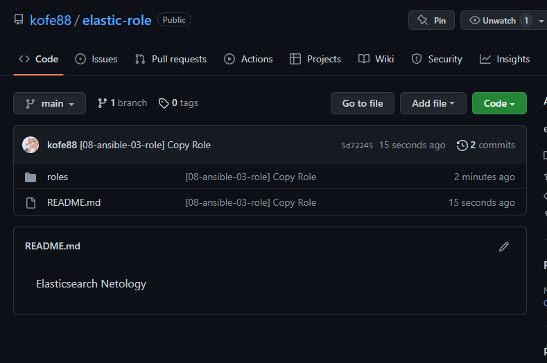

# Домашнее задание к занятию "08.03 Работа с Roles"

## Подготовка к выполнению
1. Создайте два пустых публичных репозитория в любом своём проекте: elastic-role и kibana-role.

---

[elastic-role](https://github.com/kofe88/elastic-role)

[kibana_role](https://github.com/kofe88/kibana_role)

[java](https://github.com/kofe88/java)

---

2. Скачайте [role](./roles/) из репозитория с домашним заданием и перенесите его в свой репозиторий elastic-role.

---

Выполнено.



---

3. Скачайте дистрибутив [java](https://www.oracle.com/java/technologies/javase-jdk11-downloads.html) и положите его в директорию `playbook/files/`.


---

Выполнено.


---

4. Установите molecule: `pip3 install molecule`

---

Нужно `pip3 install molecule[docker]` 

Иначе будет ошибка:

```bash
CRITICAL Failed to pre-validate.

{'driver': [{'name': ['unallowed value docker']}]}
```


Ставим

```bash
user@user-ubuntu:~/devops/08-03/docker$ pip3 install molecule[docker]
Defaulting to user installation because normal site-packages is not writeable
Requirement already satisfied: molecule[docker] in /home/user/.local/lib/python3.10/site-packages (4.0.1)
Requirement already satisfied: pluggy<2.0,>=0.7.1 in /home/user/.local/lib/python3.10/site-packages (from molecule[docker]) (1.0.0)
Requirement already satisfied: cerberus!=1.3.3,!=1.3.4,>=1.3.1 in /home/user/.local/lib/python3.10/site-packages (from molecule[docker]) (1.3.2)
Requirement already satisfied: packaging in /usr/lib/python3/dist-packages (from molecule[docker]) (21.3)
Requirement already satisfied: enrich>=1.2.7 in /home/user/.local/lib/python3.10/site-packages (from molecule[docker]) (1.2.7)
Requirement already satisfied: rich>=9.5.1 in /usr/lib/python3/dist-packages (from molecule[docker]) (11.2.0)
Requirement already satisfied: click-help-colors>=0.9 in /home/user/.local/lib/python3.10/site-packages (from molecule[docker]) (0.9.1)
Requirement already satisfied: PyYAML>=5.1 in /usr/lib/python3/dist-packages (from molecule[docker]) (5.4.1)
Requirement already satisfied: Jinja2>=2.11.3 in /usr/lib/python3/dist-packages (from molecule[docker]) (3.0.3)
Requirement already satisfied: click<9,>=8.0 in /usr/lib/python3/dist-packages (from molecule[docker]) (8.0.3)
Requirement already satisfied: cookiecutter>=1.7.3 in /home/user/.local/lib/python3.10/site-packages (from molecule[docker]) (2.1.1)
Requirement already satisfied: ansible-compat>=2.2.0 in /home/user/.local/lib/python3.10/site-packages (from molecule[docker]) (2.2.0)
Collecting molecule-docker>=1.0.0
  Downloading molecule_docker-2.0.0-py3-none-any.whl (16 kB)
Requirement already satisfied: subprocess-tee>=0.3.5 in /home/user/.local/lib/python3.10/site-packages (from ansible-compat>=2.2.0->molecule[docker]) (0.3.5)
Requirement already satisfied: jsonschema>=4.6.0 in /home/user/.local/lib/python3.10/site-packages (from ansible-compat>=2.2.0->molecule[docker]) (4.9.1)
Requirement already satisfied: setuptools in /usr/lib/python3/dist-packages (from cerberus!=1.3.3,!=1.3.4,>=1.3.1->molecule[docker]) (59.6.0)
Requirement already satisfied: python-slugify>=4.0.0 in /home/user/.local/lib/python3.10/site-packages (from cookiecutter>=1.7.3->molecule[docker]) (6.1.2)
Requirement already satisfied: requests>=2.23.0 in /usr/lib/python3/dist-packages (from cookiecutter>=1.7.3->molecule[docker]) (2.25.1)
Requirement already satisfied: binaryornot>=0.4.4 in /home/user/.local/lib/python3.10/site-packages (from cookiecutter>=1.7.3->molecule[docker]) (0.4.4)
Requirement already satisfied: jinja2-time>=0.2.0 in /home/user/.local/lib/python3.10/site-packages (from cookiecutter>=1.7.3->molecule[docker]) (0.2.0)
Requirement already satisfied: selinux in /usr/lib/python3/dist-packages (from molecule-docker>=1.0.0->molecule[docker]) (3.3)
Requirement already satisfied: docker>=4.3.1 in /usr/lib/python3/dist-packages (from molecule-docker>=1.0.0->molecule[docker]) (5.0.3)
Requirement already satisfied: colorama<0.5.0,>=0.4.0 in /usr/lib/python3/dist-packages (from rich>=9.5.1->molecule[docker]) (0.4.4)
Requirement already satisfied: commonmark<0.10.0,>=0.9.0 in /usr/lib/python3/dist-packages (from rich>=9.5.1->molecule[docker]) (0.9.1)
Requirement already satisfied: pygments<3.0.0,>=2.6.0 in /usr/lib/python3/dist-packages (from rich>=9.5.1->molecule[docker]) (2.11.2)
Requirement already satisfied: chardet>=3.0.2 in /usr/lib/python3/dist-packages (from binaryornot>=0.4.4->cookiecutter>=1.7.3->molecule[docker]) (4.0.0)
Requirement already satisfied: arrow in /home/user/.local/lib/python3.10/site-packages (from jinja2-time>=0.2.0->cookiecutter>=1.7.3->molecule[docker]) (1.2.2)
Requirement already satisfied: pyrsistent!=0.17.0,!=0.17.1,!=0.17.2,>=0.14.0 in /usr/lib/python3/dist-packages (from jsonschema>=4.6.0->ansible-compat>=2.2.0->molecule[docker]) (0.18.1)
Requirement already satisfied: attrs>=17.4.0 in /usr/lib/python3/dist-packages (from jsonschema>=4.6.0->ansible-compat>=2.2.0->molecule[docker]) (21.2.0)
Requirement already satisfied: text-unidecode>=1.3 in /home/user/.local/lib/python3.10/site-packages (from python-slugify>=4.0.0->cookiecutter>=1.7.3->molecule[docker]) (1.3)
Requirement already satisfied: python-dateutil>=2.7.0 in /usr/lib/python3/dist-packages (from arrow->jinja2-time>=0.2.0->cookiecutter>=1.7.3->molecule[docker]) (2.8.1)
Installing collected packages: molecule-docker
Successfully installed molecule-docker-2.0.0
```

---

5. Добавьте публичную часть своего ключа к своему профилю в github.

---

Готово.


---

## Основная часть

Наша основная цель - разбить наш playbook на отдельные roles. Задача: сделать roles для elastic, kibana и написать playbook для использования этих ролей. Ожидаемый результат: существуют два ваших репозитория с roles и один репозиторий с playbook.

1. Создать в старой версии playbook файл `requirements.yml` и заполнить его следующим содержимым:
   ```yaml
   ---
     - src: git@github.com:netology-code/mnt-homeworks-ansible.git
       scm: git
       version: "1.0.1"
       name: java 
   ```
   
---


---

2. При помощи `ansible-galaxy` скачать себе эту роль. Запустите  `molecule test`, посмотрите на вывод команды.

---

```bash
user@user-ubuntu:~/devops/08-03/playbook$ ansible-galaxy install -r requirements.yml 
Starting galaxy role install process
- extracting java to /home/user/.ansible/roles/java
```

Запуск приводит к ошибке:

```bash
user@user-ubuntu:~/.ansible/roles/java$ molecule test
INFO     default scenario test matrix: dependency, lint, cleanup, destroy, syntax, create, prepare, converge, idempotence, side_effect, verify, cleanup, destroy
INFO     Performing prerun with role_name_check=0...
INFO     Set ANSIBLE_LIBRARY=/home/user/.cache/ansible-compat/38a096/modules:/home/user/.ansible/plugins/modules:/usr/share/ansible/plugins/modules
INFO     Set ANSIBLE_COLLECTIONS_PATH=/home/user/.cache/ansible-compat/38a096/collections:/home/user/.ansible/collections:/usr/share/ansible/collections
INFO     Set ANSIBLE_ROLES_PATH=/home/user/.cache/ansible-compat/38a096/roles:/home/user/.ansible/roles:/usr/share/ansible/roles:/etc/ansible/roles
ERROR    Computed fully qualified role name of java does not follow current galaxy requirements.
Please edit meta/main.yml and assure we can correctly determine full role name:

galaxy_info:
role_name: my_name  # if absent directory name hosting role is used instead
namespace: my_galaxy_namespace  # if absent, author is used instead

Namespace: https://galaxy.ansible.com/docs/contributing/namespaces.html#galaxy-namespace-limitations
Role: https://galaxy.ansible.com/docs/contributing/creating_role.html#role-names

As an alternative, you can add 'role-name' to either skip_list or warn_list.

Traceback (most recent call last):
  File "/usr/local/bin/molecule", line 8, in <module>
    sys.exit(main())
  File "/usr/lib/python3/dist-packages/click/core.py", line 1128, in __call__
    return self.main(*args, **kwargs)
  File "/usr/lib/python3/dist-packages/click/core.py", line 1053, in main
    rv = self.invoke(ctx)
  File "/usr/lib/python3/dist-packages/click/core.py", line 1659, in invoke
    return _process_result(sub_ctx.command.invoke(sub_ctx))
  File "/usr/lib/python3/dist-packages/click/core.py", line 1395, in invoke
    return ctx.invoke(self.callback, **ctx.params)
  File "/usr/lib/python3/dist-packages/click/core.py", line 754, in invoke
    return __callback(*args, **kwargs)
  File "/usr/lib/python3/dist-packages/click/decorators.py", line 26, in new_func
    return f(get_current_context(), *args, **kwargs)
  File "/home/user/.local/lib/python3.10/site-packages/molecule/command/test.py", line 176, in test
    base.execute_cmdline_scenarios(scenario_name, args, command_args, ansible_args)
  File "/home/user/.local/lib/python3.10/site-packages/molecule/command/base.py", line 112, in execute_cmdline_scenarios
    scenario.config.runtime.prepare_environment(
  File "/home/user/.local/lib/python3.10/site-packages/ansible_compat/runtime.py", line 362, in prepare_environment
    self._install_galaxy_role(
  File "/home/user/.local/lib/python3.10/site-packages/ansible_compat/runtime.py", line 522, in _install_galaxy_role
    raise InvalidPrerequisiteError(msg)
ansible_compat.errors.InvalidPrerequisiteError: Computed fully qualified role name of java does not follow current galaxy requirements.
Please edit meta/main.yml and assure we can correctly determine full role name:

galaxy_info:
role_name: my_name  # if absent directory name hosting role is used instead
namespace: my_galaxy_namespace  # if absent, author is used instead

Namespace: https://galaxy.ansible.com/docs/contributing/namespaces.html#galaxy-namespace-limitations
Role: https://galaxy.ansible.com/docs/contributing/creating_role.html#role-names

As an alternative, you can add 'role-name' to either skip_list or warn_list.
```

Подправил `meta/main.yml`

```yaml
galaxy_info:
  role_name: java
  namespace: netology
  author: Alexey Metlyakov
  description: simple install openjdk from remote url
  company: Netology
  license: BSD-3-Clause
  min_ansible_version: 2.1
  platforms:
    - name: CentOS
      versions:
        - 7
        - 8
    - name: ubuntu
      versions: all
  galaxy_tags: [java, openjdk]
dependencies: []
```

Запустилось

```bash
user@user-ubuntu:~/devops/08-03/playbook/roles/java$ molecule test
INFO     default scenario test matrix: dependency, lint, cleanup, destroy, syntax, create, prepare, converge, idempotence, side_effect, verify, cleanup, destroy
INFO     Performing prerun with role_name_check=0...
INFO     Set ANSIBLE_LIBRARY=/home/user/.cache/ansible-compat/38a096/modules:/home/user/.ansible/plugins/modules:/usr/share/ansible/plugins/modules
INFO     Set ANSIBLE_COLLECTIONS_PATH=/home/user/.cache/ansible-compat/38a096/collections:/home/user/.ansible/collections:/usr/share/ansible/collections
INFO     Set ANSIBLE_ROLES_PATH=/home/user/.cache/ansible-compat/38a096/roles:/home/user/.ansible/roles:/usr/share/ansible/roles:/etc/ansible/roles
INFO     Using /home/user/.cache/ansible-compat/38a096/roles/netology.java symlink to current repository in order to enable Ansible to find the role using its expected full name.
INFO     Running default > dependency
INFO     Running ansible-galaxy collection install -v --force --pre community.docker:>=3.0.0-a2
WARNING  Skipping, missing the requirements file.
WARNING  Skipping, missing the requirements file.
INFO     Running default > lint
INFO     Lint is disabled.
INFO     Running default > cleanup
WARNING  Skipping, cleanup playbook not configured.
INFO     Running default > destroy
INFO     Sanity checks: 'docker'
[WARNING]: Collection community.docker does not support Ansible version 2.10.8

PLAY [Destroy] *****************************************************************

TASK [Destroy molecule instance(s)] ********************************************
changed: [localhost] => (item=centos8)
changed: [localhost] => (item=centos7)
changed: [localhost] => (item=ubuntu)

TASK [Wait for instance(s) deletion to complete] *******************************
ok: [localhost] => (item=centos8)
changed: [localhost] => (item=centos7)
changed: [localhost] => (item=ubuntu)

TASK [Delete docker networks(s)] ***********************************************

PLAY RECAP *********************************************************************
localhost                  : ok=2    changed=2    unreachable=0    failed=0    skipped=1    rescued=0    ignored=0

INFO     Running default > syntax

playbook: /home/user/devops/08-03/playbook/roles/java/molecule/default/converge.yml
INFO     Running default > create
[WARNING]: Collection community.docker does not support Ansible version 2.10.8

PLAY [Create] ******************************************************************

TASK [Log into a Docker registry] **********************************************
skipping: [localhost] => (item=None) 
skipping: [localhost] => (item=None) 
skipping: [localhost] => (item=None) 
skipping: [localhost]

TASK [Check presence of custom Dockerfiles] ************************************
ok: [localhost] => (item={'image': 'docker.io/pycontribs/centos:8', 'name': 'centos8', 'pre_build_image': True})
ok: [localhost] => (item={'image': 'docker.io/pycontribs/centos:7', 'name': 'centos7', 'pre_build_image': True})
ok: [localhost] => (item={'image': 'docker.io/pycontribs/ubuntu:latest', 'name': 'ubuntu', 'pre_build_image': True})

TASK [Create Dockerfiles from image names] *************************************
skipping: [localhost] => (item={'image': 'docker.io/pycontribs/centos:8', 'name': 'centos8', 'pre_build_image': True}) 
skipping: [localhost] => (item={'image': 'docker.io/pycontribs/centos:7', 'name': 'centos7', 'pre_build_image': True}) 
skipping: [localhost] => (item={'image': 'docker.io/pycontribs/ubuntu:latest', 'name': 'ubuntu', 'pre_build_image': True}) 

TASK [Discover local Docker images] ********************************************
ok: [localhost] => (item={'changed': False, 'skipped': True, 'skip_reason': 'Conditional result was False', 'item': {'image': 'docker.io/pycontribs/centos:8', 'name': 'centos8', 'pre_build_image': True}, 'ansible_loop_var': 'item', 'i': 0, 'ansible_index_var': 'i'})
ok: [localhost] => (item={'changed': False, 'skipped': True, 'skip_reason': 'Conditional result was False', 'item': {'image': 'docker.io/pycontribs/centos:7', 'name': 'centos7', 'pre_build_image': True}, 'ansible_loop_var': 'item', 'i': 1, 'ansible_index_var': 'i'})
ok: [localhost] => (item={'changed': False, 'skipped': True, 'skip_reason': 'Conditional result was False', 'item': {'image': 'docker.io/pycontribs/ubuntu:latest', 'name': 'ubuntu', 'pre_build_image': True}, 'ansible_loop_var': 'item', 'i': 2, 'ansible_index_var': 'i'})

TASK [Build an Ansible compatible image (new)] *********************************
skipping: [localhost] => (item=molecule_local/docker.io/pycontribs/centos:8) 
skipping: [localhost] => (item=molecule_local/docker.io/pycontribs/centos:7) 
skipping: [localhost] => (item=molecule_local/docker.io/pycontribs/ubuntu:latest) 

TASK [Create docker network(s)] ************************************************

TASK [Determine the CMD directives] ********************************************
ok: [localhost] => (item={'image': 'docker.io/pycontribs/centos:8', 'name': 'centos8', 'pre_build_image': True})
ok: [localhost] => (item={'image': 'docker.io/pycontribs/centos:7', 'name': 'centos7', 'pre_build_image': True})
ok: [localhost] => (item={'image': 'docker.io/pycontribs/ubuntu:latest', 'name': 'ubuntu', 'pre_build_image': True})

TASK [Create molecule instance(s)] *********************************************
changed: [localhost] => (item=centos8)
changed: [localhost] => (item=centos7)
changed: [localhost] => (item=ubuntu)

TASK [Wait for instance(s) creation to complete] *******************************
FAILED - RETRYING: Wait for instance(s) creation to complete (300 retries left).
FAILED - RETRYING: Wait for instance(s) creation to complete (299 retries left).
FAILED - RETRYING: Wait for instance(s) creation to complete (298 retries left).
FAILED - RETRYING: Wait for instance(s) creation to complete (297 retries left).
FAILED - RETRYING: Wait for instance(s) creation to complete (296 retries left).
FAILED - RETRYING: Wait for instance(s) creation to complete (295 retries left).
FAILED - RETRYING: Wait for instance(s) creation to complete (294 retries left).
FAILED - RETRYING: Wait for instance(s) creation to complete (293 retries left).
FAILED - RETRYING: Wait for instance(s) creation to complete (292 retries left).
FAILED - RETRYING: Wait for instance(s) creation to complete (291 retries left).
FAILED - RETRYING: Wait for instance(s) creation to complete (290 retries left).
FAILED - RETRYING: Wait for instance(s) creation to complete (289 retries left).
FAILED - RETRYING: Wait for instance(s) creation to complete (288 retries left).
FAILED - RETRYING: Wait for instance(s) creation to complete (287 retries left).
FAILED - RETRYING: Wait for instance(s) creation to complete (286 retries left).
changed: [localhost] => (item={'started': 1, 'finished': 0, 'ansible_job_id': '367084849262.61537', 'results_file': '/home/user/.ansible_async/367084849262.61537', 'changed': True, 'failed': False, 'item': {'image': 'docker.io/pycontribs/centos:8', 'name': 'centos8', 'pre_build_image': True}, 'ansible_loop_var': 'item'})
changed: [localhost] => (item={'started': 1, 'finished': 0, 'ansible_job_id': '563337546877.61563', 'results_file': '/home/user/.ansible_async/563337546877.61563', 'changed': True, 'failed': False, 'item': {'image': 'docker.io/pycontribs/centos:7', 'name': 'centos7', 'pre_build_image': True}, 'ansible_loop_var': 'item'})
changed: [localhost] => (item={'started': 1, 'finished': 0, 'ansible_job_id': '779076359550.61595', 'results_file': '/home/user/.ansible_async/779076359550.61595', 'changed': True, 'failed': False, 'item': {'image': 'docker.io/pycontribs/ubuntu:latest', 'name': 'ubuntu', 'pre_build_image': True}, 'ansible_loop_var': 'item'})

PLAY RECAP *********************************************************************
localhost                  : ok=5    changed=2    unreachable=0    failed=0    skipped=4    rescued=0    ignored=0

INFO     Running default > prepare
WARNING  Skipping, prepare playbook not configured.
INFO     Running default > converge

PLAY [Converge] ****************************************************************

TASK [Gathering Facts] *********************************************************
[WARNING]: Collection community.docker does not support Ansible version 2.10.8
[WARNING]: Collection community.docker does not support Ansible version 2.10.8
[WARNING]: Collection community.docker does not support Ansible version 2.10.8
ok: [centos8]
ok: [ubuntu]
ok: [centos7]

TASK [Include mnt-homeworks-ansible] *******************************************
ERROR! the role 'mnt-homeworks-ansible' was not found in /home/user/devops/08-03/playbook/roles/java/molecule/default/roles:/home/user/.cache/ansible-compat/38a096/roles:/home/user/.cache/molecule/java/default/roles:/home/user/devops/08-03/playbook/roles:/home/user/.ansible/roles:/usr/share/ansible/roles:/etc/ansible/roles:/home/user/devops/08-03/playbook/roles/java/molecule/default

The error appears to be in '/home/user/devops/08-03/playbook/roles/java/molecule/default/converge.yml': line 7, column 15, but may
be elsewhere in the file depending on the exact syntax problem.

The offending line appears to be:

      include_role:
        name: "mnt-homeworks-ansible"
              ^ here

PLAY RECAP *********************************************************************
centos7                    : ok=1    changed=0    unreachable=0    failed=0    skipped=0    rescued=0    ignored=0
centos8                    : ok=1    changed=0    unreachable=0    failed=0    skipped=0    rescued=0    ignored=0
ubuntu                     : ok=1    changed=0    unreachable=0    failed=0    skipped=0    rescued=0    ignored=0

WARNING  Retrying execution failure 2 of: ansible-playbook --inventory /home/user/.cache/molecule/java/default/inventory --skip-tags molecule-notest,notest /home/user/devops/08-03/playbook/roles/java/molecule/default/converge.yml
CRITICAL Ansible return code was 2, command was: ['ansible-playbook', '--inventory', '/home/user/.cache/molecule/java/default/inventory', '--skip-tags', 'molecule-notest,notest', '/home/user/devops/08-03/playbook/roles/java/molecule/default/converge.yml']
WARNING  An error occurred during the test sequence action: 'converge'. Cleaning up.
INFO     Running default > cleanup
WARNING  Skipping, cleanup playbook not configured.
INFO     Running default > destroy
[WARNING]: Collection community.docker does not support Ansible version 2.10.8

PLAY [Destroy] *****************************************************************

TASK [Destroy molecule instance(s)] ********************************************
changed: [localhost] => (item=centos8)
changed: [localhost] => (item=centos7)
changed: [localhost] => (item=ubuntu)

TASK [Wait for instance(s) deletion to complete] *******************************
changed: [localhost] => (item=centos8)
changed: [localhost] => (item=centos7)
changed: [localhost] => (item=ubuntu)

TASK [Delete docker networks(s)] ***********************************************

PLAY RECAP *********************************************************************
localhost                  : ok=2    changed=2    unreachable=0    failed=0    skipped=1    rescued=0    ignored=0

INFO     Pruning extra files from scenario ephemeral directory
```

Ругается на `mnt-homeworks-ansible` видимо должно быть `java`

Подправил, теперь без ошибок

```bash
user@user-ubuntu:~/devops/08-03/playbook/roles/java$ molecule test
INFO     default scenario test matrix: dependency, lint, cleanup, destroy, syntax, create, prepare, converge, idempotence, side_effect, verify, cleanup, destroy
INFO     Performing prerun with role_name_check=0...
INFO     Set ANSIBLE_LIBRARY=/home/user/.cache/ansible-compat/38a096/modules:/home/user/.ansible/plugins/modules:/usr/share/ansible/plugins/modules
INFO     Set ANSIBLE_COLLECTIONS_PATH=/home/user/.cache/ansible-compat/38a096/collections:/home/user/.ansible/collections:/usr/share/ansible/collections
INFO     Set ANSIBLE_ROLES_PATH=/home/user/.cache/ansible-compat/38a096/roles:/home/user/.ansible/roles:/usr/share/ansible/roles:/etc/ansible/roles
INFO     Using /home/user/.cache/ansible-compat/38a096/roles/netology.java symlink to current repository in order to enable Ansible to find the role using its expected full name.
INFO     Running default > dependency
WARNING  Skipping, missing the requirements file.
WARNING  Skipping, missing the requirements file.
INFO     Running default > lint
INFO     Lint is disabled.
INFO     Running default > cleanup
WARNING  Skipping, cleanup playbook not configured.
INFO     Running default > destroy
INFO     Sanity checks: 'docker'
[WARNING]: Collection community.docker does not support Ansible version 2.10.8

PLAY [Destroy] *****************************************************************

TASK [Destroy molecule instance(s)] ********************************************
changed: [localhost] => (item=centos8)
changed: [localhost] => (item=centos7)
changed: [localhost] => (item=ubuntu)

TASK [Wait for instance(s) deletion to complete] *******************************
ok: [localhost] => (item=centos8)
ok: [localhost] => (item=centos7)
ok: [localhost] => (item=ubuntu)

TASK [Delete docker networks(s)] ***********************************************

PLAY RECAP *********************************************************************
localhost                  : ok=2    changed=1    unreachable=0    failed=0    skipped=1    rescued=0    ignored=0

INFO     Running default > syntax

playbook: /home/user/devops/08-03/playbook/roles/java/molecule/default/converge.yml
INFO     Running default > create
[WARNING]: Collection community.docker does not support Ansible version 2.10.8

PLAY [Create] ******************************************************************

TASK [Log into a Docker registry] **********************************************
skipping: [localhost] => (item=None) 
skipping: [localhost] => (item=None) 
skipping: [localhost] => (item=None) 
skipping: [localhost]

TASK [Check presence of custom Dockerfiles] ************************************
ok: [localhost] => (item={'image': 'docker.io/pycontribs/centos:8', 'name': 'centos8', 'pre_build_image': True})
ok: [localhost] => (item={'image': 'docker.io/pycontribs/centos:7', 'name': 'centos7', 'pre_build_image': True})
ok: [localhost] => (item={'image': 'docker.io/pycontribs/ubuntu:latest', 'name': 'ubuntu', 'pre_build_image': True})

TASK [Create Dockerfiles from image names] *************************************
skipping: [localhost] => (item={'image': 'docker.io/pycontribs/centos:8', 'name': 'centos8', 'pre_build_image': True}) 
skipping: [localhost] => (item={'image': 'docker.io/pycontribs/centos:7', 'name': 'centos7', 'pre_build_image': True}) 
skipping: [localhost] => (item={'image': 'docker.io/pycontribs/ubuntu:latest', 'name': 'ubuntu', 'pre_build_image': True}) 

TASK [Discover local Docker images] ********************************************
ok: [localhost] => (item={'changed': False, 'skipped': True, 'skip_reason': 'Conditional result was False', 'item': {'image': 'docker.io/pycontribs/centos:8', 'name': 'centos8', 'pre_build_image': True}, 'ansible_loop_var': 'item', 'i': 0, 'ansible_index_var': 'i'})
ok: [localhost] => (item={'changed': False, 'skipped': True, 'skip_reason': 'Conditional result was False', 'item': {'image': 'docker.io/pycontribs/centos:7', 'name': 'centos7', 'pre_build_image': True}, 'ansible_loop_var': 'item', 'i': 1, 'ansible_index_var': 'i'})
ok: [localhost] => (item={'changed': False, 'skipped': True, 'skip_reason': 'Conditional result was False', 'item': {'image': 'docker.io/pycontribs/ubuntu:latest', 'name': 'ubuntu', 'pre_build_image': True}, 'ansible_loop_var': 'item', 'i': 2, 'ansible_index_var': 'i'})

TASK [Build an Ansible compatible image (new)] *********************************
skipping: [localhost] => (item=molecule_local/docker.io/pycontribs/centos:8) 
skipping: [localhost] => (item=molecule_local/docker.io/pycontribs/centos:7) 
skipping: [localhost] => (item=molecule_local/docker.io/pycontribs/ubuntu:latest) 

TASK [Create docker network(s)] ************************************************

TASK [Determine the CMD directives] ********************************************
ok: [localhost] => (item={'image': 'docker.io/pycontribs/centos:8', 'name': 'centos8', 'pre_build_image': True})
ok: [localhost] => (item={'image': 'docker.io/pycontribs/centos:7', 'name': 'centos7', 'pre_build_image': True})
ok: [localhost] => (item={'image': 'docker.io/pycontribs/ubuntu:latest', 'name': 'ubuntu', 'pre_build_image': True})

TASK [Create molecule instance(s)] *********************************************
changed: [localhost] => (item=centos8)
changed: [localhost] => (item=centos7)
changed: [localhost] => (item=ubuntu)

TASK [Wait for instance(s) creation to complete] *******************************
changed: [localhost] => (item={'started': 1, 'finished': 0, 'ansible_job_id': '837367426495.64205', 'results_file': '/home/user/.ansible_async/837367426495.64205', 'changed': True, 'failed': False, 'item': {'image': 'docker.io/pycontribs/centos:8', 'name': 'centos8', 'pre_build_image': True}, 'ansible_loop_var': 'item'})
changed: [localhost] => (item={'started': 1, 'finished': 0, 'ansible_job_id': '738133209815.64231', 'results_file': '/home/user/.ansible_async/738133209815.64231', 'changed': True, 'failed': False, 'item': {'image': 'docker.io/pycontribs/centos:7', 'name': 'centos7', 'pre_build_image': True}, 'ansible_loop_var': 'item'})
changed: [localhost] => (item={'started': 1, 'finished': 0, 'ansible_job_id': '190764446514.64266', 'results_file': '/home/user/.ansible_async/190764446514.64266', 'changed': True, 'failed': False, 'item': {'image': 'docker.io/pycontribs/ubuntu:latest', 'name': 'ubuntu', 'pre_build_image': True}, 'ansible_loop_var': 'item'})

PLAY RECAP *********************************************************************
localhost                  : ok=5    changed=2    unreachable=0    failed=0    skipped=4    rescued=0    ignored=0

INFO     Running default > prepare
WARNING  Skipping, prepare playbook not configured.
INFO     Running default > converge

PLAY [Converge] ****************************************************************

TASK [Gathering Facts] *********************************************************
[WARNING]: Collection community.docker does not support Ansible version 2.10.8
[WARNING]: Collection community.docker does not support Ansible version 2.10.8
[WARNING]: Collection community.docker does not support Ansible version 2.10.8
ok: [centos8]
ok: [ubuntu]
ok: [centos7]

TASK [Include Java] ************************************************************

TASK [java : Upload .tar.gz file containing binaries from local storage] *******
skipping: [centos7]
skipping: [centos8]
skipping: [ubuntu]

TASK [java : Upload .tar.gz file conaining binaries from remote storage] *******
[WARNING]: Collection community.docker does not support Ansible version 2.10.8
[WARNING]: Collection community.docker does not support Ansible version 2.10.8
[WARNING]: Collection community.docker does not support Ansible version 2.10.8
changed: [centos7]
changed: [ubuntu]
changed: [centos8]

TASK [java : Ensure installation dir exists] ***********************************
[WARNING]: Collection community.docker does not support Ansible version 2.10.8
[WARNING]: Collection community.docker does not support Ansible version 2.10.8
[WARNING]: Collection community.docker does not support Ansible version 2.10.8
changed: [ubuntu]
changed: [centos7]
changed: [centos8]

TASK [java : Extract java in the installation directory] ***********************
[WARNING]: Collection community.docker does not support Ansible version 2.10.8
[WARNING]: Collection community.docker does not support Ansible version 2.10.8
[WARNING]: Collection community.docker does not support Ansible version 2.10.8
changed: [centos8]
changed: [ubuntu]
changed: [centos7]

TASK [java : Export environment variables] *************************************
[WARNING]: Collection community.docker does not support Ansible version 2.10.8
[WARNING]: Collection community.docker does not support Ansible version 2.10.8
[WARNING]: Collection community.docker does not support Ansible version 2.10.8
changed: [centos7]
changed: [ubuntu]
changed: [centos8]

PLAY RECAP *********************************************************************
centos7                    : ok=5    changed=4    unreachable=0    failed=0    skipped=1    rescued=0    ignored=0
centos8                    : ok=5    changed=4    unreachable=0    failed=0    skipped=1    rescued=0    ignored=0
ubuntu                     : ok=5    changed=4    unreachable=0    failed=0    skipped=1    rescued=0    ignored=0

INFO     Running default > idempotence

PLAY [Converge] ****************************************************************

TASK [Gathering Facts] *********************************************************
[WARNING]: Collection community.docker does not support Ansible version 2.10.8
[WARNING]: Collection community.docker does not support Ansible version 2.10.8
[WARNING]: Collection community.docker does not support Ansible version 2.10.8
ok: [ubuntu]
ok: [centos8]
ok: [centos7]

TASK [Include Java] ************************************************************

TASK [java : Upload .tar.gz file containing binaries from local storage] *******
skipping: [centos7]
skipping: [centos8]
skipping: [ubuntu]

TASK [java : Upload .tar.gz file conaining binaries from remote storage] *******
[WARNING]: Collection community.docker does not support Ansible version 2.10.8
[WARNING]: Collection community.docker does not support Ansible version 2.10.8
[WARNING]: Collection community.docker does not support Ansible version 2.10.8
ok: [centos7]
ok: [ubuntu]
ok: [centos8]

TASK [java : Ensure installation dir exists] ***********************************
[WARNING]: Collection community.docker does not support Ansible version 2.10.8
[WARNING]: Collection community.docker does not support Ansible version 2.10.8
[WARNING]: Collection community.docker does not support Ansible version 2.10.8
ok: [centos7]
ok: [ubuntu]
ok: [centos8]

TASK [java : Extract java in the installation directory] ***********************
[WARNING]: Collection community.docker does not support Ansible version 2.10.8
[WARNING]: Collection community.docker does not support Ansible version 2.10.8
[WARNING]: Collection community.docker does not support Ansible version 2.10.8
skipping: [ubuntu]
skipping: [centos7]
skipping: [centos8]

TASK [java : Export environment variables] *************************************
[WARNING]: Collection community.docker does not support Ansible version 2.10.8
[WARNING]: Collection community.docker does not support Ansible version 2.10.8
[WARNING]: Collection community.docker does not support Ansible version 2.10.8
ok: [centos7]
ok: [ubuntu]
ok: [centos8]

PLAY RECAP *********************************************************************
centos7                    : ok=4    changed=0    unreachable=0    failed=0    skipped=2    rescued=0    ignored=0
centos8                    : ok=4    changed=0    unreachable=0    failed=0    skipped=2    rescued=0    ignored=0
ubuntu                     : ok=4    changed=0    unreachable=0    failed=0    skipped=2    rescued=0    ignored=0

INFO     Idempotence completed successfully.
INFO     Running default > side_effect
WARNING  Skipping, side effect playbook not configured.
INFO     Running default > verify
INFO     Running Ansible Verifier

PLAY [Verify] ******************************************************************

TASK [Check Java can running] **************************************************
[WARNING]: Collection community.docker does not support Ansible version 2.10.8
[WARNING]: Collection community.docker does not support Ansible version 2.10.8
[WARNING]: Collection community.docker does not support Ansible version 2.10.8
ok: [centos8]
ok: [ubuntu]
ok: [centos7]

PLAY RECAP *********************************************************************
centos7                    : ok=1    changed=0    unreachable=0    failed=0    skipped=0    rescued=0    ignored=0
centos8                    : ok=1    changed=0    unreachable=0    failed=0    skipped=0    rescued=0    ignored=0
ubuntu                     : ok=1    changed=0    unreachable=0    failed=0    skipped=0    rescued=0    ignored=0

INFO     Verifier completed successfully.
INFO     Running default > cleanup
WARNING  Skipping, cleanup playbook not configured.
INFO     Running default > destroy
[WARNING]: Collection community.docker does not support Ansible version 2.10.8

PLAY [Destroy] *****************************************************************

TASK [Destroy molecule instance(s)] ********************************************
changed: [localhost] => (item=centos8)
changed: [localhost] => (item=centos7)
changed: [localhost] => (item=ubuntu)

TASK [Wait for instance(s) deletion to complete] *******************************
FAILED - RETRYING: Wait for instance(s) deletion to complete (300 retries left).
changed: [localhost] => (item=centos8)
changed: [localhost] => (item=centos7)
changed: [localhost] => (item=ubuntu)

TASK [Delete docker networks(s)] ***********************************************

PLAY RECAP *********************************************************************
localhost                  : ok=2    changed=2    unreachable=0    failed=0    skipped=1    rescued=0    ignored=0

INFO     Pruning extra files from scenario ephemeral directory

```

---

3. Перейдите в каталог с ролью elastic-role и создайте сценарий тестирования по умолчаню при помощи `molecule init scenario --driver-name docker`.

---

Ругнулось

```bash
user@user-ubuntu:~/devops/08-03/playbook/roles/elastic-role$ molecule init scenario --driver-name docker
INFO     Initializing new scenario default...
CRITICAL The directory molecule/default exists. Cannot create new scenario.
```

Удалил директорию

```bash
user@user-ubuntu:~/devops/08-03/playbook/roles/elastic-role$ molecule init scenario --driver-name docker
INFO     Initializing new scenario default...
INFO     Initialized scenario in /home/user/devops/08-03/playbook/roles/elastic-role/molecule/default successfully.
```


---

4. Добавьте несколько разных дистрибутивов (centos:8, ubuntu:latest) для инстансов и протестируйте роль, исправьте найденные ошибки, если они есть.

---

`molecule.yml`

```bash
---
dependency:
  name: galaxy
driver:
  name: docker
platforms:
  - name: centos8
    image: docker.io/pycontribs/centos:8
    pre_build_image: true
  - name: ubuntu
    image: docker.io/pycontribs/ubuntu:latest
    pre_build_image: true
provisioner:
  name: ansible
verifier:
  name: ansible
```

Так же ошибка, не хватает в `meta/main.yml`

```yaml
galaxy_info:
  role_name: elastic_role
  namespace: netology
  ```

Теперь всё успешно

```bash
user@user-ubuntu:~/devops/08-03/playbook/roles/elastic-role$ molecule test
INFO     default scenario test matrix: dependency, lint, cleanup, destroy, syntax, create, prepare, converge, idempotence, side_effect, verify, cleanup, destroy
INFO     Performing prerun with role_name_check=0...
INFO     Set ANSIBLE_LIBRARY=/home/user/.cache/ansible-compat/12e536/modules:/home/user/.ansible/plugins/modules:/usr/share/ansible/plugins/modules
INFO     Set ANSIBLE_COLLECTIONS_PATH=/home/user/.cache/ansible-compat/12e536/collections:/home/user/.ansible/collections:/usr/share/ansible/collections
INFO     Set ANSIBLE_ROLES_PATH=/home/user/.cache/ansible-compat/12e536/roles:/home/user/.ansible/roles:/usr/share/ansible/roles:/etc/ansible/roles
INFO     Using /home/user/.cache/ansible-compat/12e536/roles/netology.elastic_role symlink to current repository in order to enable Ansible to find the role using its expected full name.
INFO     Running default > dependency
INFO     Running ansible-galaxy collection install -v --force --pre community.docker:>=3.0.0-a2
WARNING  Skipping, missing the requirements file.
WARNING  Skipping, missing the requirements file.
INFO     Running default > lint
INFO     Lint is disabled.
INFO     Running default > cleanup
WARNING  Skipping, cleanup playbook not configured.
INFO     Running default > destroy
INFO     Sanity checks: 'docker'
[WARNING]: Collection community.docker does not support Ansible version 2.10.8

PLAY [Destroy] *****************************************************************

TASK [Destroy molecule instance(s)] ********************************************
changed: [localhost] => (item=centos8)
changed: [localhost] => (item=ubuntu)

TASK [Wait for instance(s) deletion to complete] *******************************
ok: [localhost] => (item=centos8)
ok: [localhost] => (item=ubuntu)

TASK [Delete docker networks(s)] ***********************************************

PLAY RECAP *********************************************************************
localhost                  : ok=2    changed=1    unreachable=0    failed=0    skipped=1    rescued=0    ignored=0

INFO     Running default > syntax

playbook: /home/user/devops/08-03/playbook/roles/elastic-role/molecule/default/converge.yml
INFO     Running default > create
[WARNING]: Collection community.docker does not support Ansible version 2.10.8

PLAY [Create] ******************************************************************

TASK [Log into a Docker registry] **********************************************
skipping: [localhost] => (item=None) 
skipping: [localhost] => (item=None) 
skipping: [localhost]

TASK [Check presence of custom Dockerfiles] ************************************
ok: [localhost] => (item={'image': 'docker.io/pycontribs/centos:8', 'name': 'centos8', 'pre_build_image': True})
ok: [localhost] => (item={'image': 'docker.io/pycontribs/ubuntu:latest', 'name': 'ubuntu', 'pre_build_image': True})

TASK [Create Dockerfiles from image names] *************************************
skipping: [localhost] => (item={'image': 'docker.io/pycontribs/centos:8', 'name': 'centos8', 'pre_build_image': True}) 
skipping: [localhost] => (item={'image': 'docker.io/pycontribs/ubuntu:latest', 'name': 'ubuntu', 'pre_build_image': True}) 

TASK [Discover local Docker images] ********************************************
ok: [localhost] => (item={'changed': False, 'skipped': True, 'skip_reason': 'Conditional result was False', 'item': {'image': 'docker.io/pycontribs/centos:8', 'name': 'centos8', 'pre_build_image': True}, 'ansible_loop_var': 'item', 'i': 0, 'ansible_index_var': 'i'})
ok: [localhost] => (item={'changed': False, 'skipped': True, 'skip_reason': 'Conditional result was False', 'item': {'image': 'docker.io/pycontribs/ubuntu:latest', 'name': 'ubuntu', 'pre_build_image': True}, 'ansible_loop_var': 'item', 'i': 1, 'ansible_index_var': 'i'})

TASK [Build an Ansible compatible image (new)] *********************************
skipping: [localhost] => (item=molecule_local/docker.io/pycontribs/centos:8) 
skipping: [localhost] => (item=molecule_local/docker.io/pycontribs/ubuntu:latest) 

TASK [Create docker network(s)] ************************************************

TASK [Determine the CMD directives] ********************************************
ok: [localhost] => (item={'image': 'docker.io/pycontribs/centos:8', 'name': 'centos8', 'pre_build_image': True})
ok: [localhost] => (item={'image': 'docker.io/pycontribs/ubuntu:latest', 'name': 'ubuntu', 'pre_build_image': True})

TASK [Create molecule instance(s)] *********************************************
changed: [localhost] => (item=centos8)
changed: [localhost] => (item=ubuntu)

TASK [Wait for instance(s) creation to complete] *******************************
FAILED - RETRYING: Wait for instance(s) creation to complete (300 retries left).
changed: [localhost] => (item={'started': 1, 'finished': 0, 'ansible_job_id': '888224274741.73754', 'results_file': '/home/user/.ansible_async/888224274741.73754', 'changed': True, 'failed': False, 'item': {'image': 'docker.io/pycontribs/centos:8', 'name': 'centos8', 'pre_build_image': True}, 'ansible_loop_var': 'item'})
changed: [localhost] => (item={'started': 1, 'finished': 0, 'ansible_job_id': '819554631730.73780', 'results_file': '/home/user/.ansible_async/819554631730.73780', 'changed': True, 'failed': False, 'item': {'image': 'docker.io/pycontribs/ubuntu:latest', 'name': 'ubuntu', 'pre_build_image': True}, 'ansible_loop_var': 'item'})

PLAY RECAP *********************************************************************
localhost                  : ok=5    changed=2    unreachable=0    failed=0    skipped=4    rescued=0    ignored=0

INFO     Running default > prepare
WARNING  Skipping, prepare playbook not configured.
INFO     Running default > converge

PLAY [Converge] ****************************************************************

TASK [Gathering Facts] *********************************************************
[WARNING]: Collection community.docker does not support Ansible version 2.10.8
[WARNING]: Collection community.docker does not support Ansible version 2.10.8
ok: [centos8]
ok: [ubuntu]

TASK [Include elastic-role] ****************************************************

TASK [elastic-role : Upload tar.gz Elasticsearch from remote URL] **************
[WARNING]: Collection community.docker does not support Ansible version 2.10.8
[WARNING]: Collection community.docker does not support Ansible version 2.10.8
changed: [centos8]
changed: [ubuntu]

TASK [elastic-role : Create directrory for Elasticsearch] **********************
[WARNING]: Collection community.docker does not support Ansible version 2.10.8
[WARNING]: Collection community.docker does not support Ansible version 2.10.8
changed: [ubuntu]
changed: [centos8]

TASK [elastic-role : Extract Elasticsearch in the installation directory] ******
[WARNING]: Collection community.docker does not support Ansible version 2.10.8
[WARNING]: Collection community.docker does not support Ansible version 2.10.8
changed: [centos8]
changed: [ubuntu]

TASK [elastic-role : Set environment Elastic] **********************************
[WARNING]: Collection community.docker does not support Ansible version 2.10.8
[WARNING]: Collection community.docker does not support Ansible version 2.10.8
changed: [ubuntu]
changed: [centos8]

PLAY RECAP *********************************************************************
centos8                    : ok=5    changed=4    unreachable=0    failed=0    skipped=0    rescued=0    ignored=0
ubuntu                     : ok=5    changed=4    unreachable=0    failed=0    skipped=0    rescued=0    ignored=0

INFO     Running default > idempotence

PLAY [Converge] ****************************************************************

TASK [Gathering Facts] *********************************************************
[WARNING]: Collection community.docker does not support Ansible version 2.10.8
[WARNING]: Collection community.docker does not support Ansible version 2.10.8
ok: [centos8]
ok: [ubuntu]

TASK [Include elastic-role] ****************************************************

TASK [elastic-role : Upload tar.gz Elasticsearch from remote URL] **************
[WARNING]: Collection community.docker does not support Ansible version 2.10.8
[WARNING]: Collection community.docker does not support Ansible version 2.10.8
ok: [centos8]
ok: [ubuntu]

TASK [elastic-role : Create directrory for Elasticsearch] **********************
[WARNING]: Collection community.docker does not support Ansible version 2.10.8
[WARNING]: Collection community.docker does not support Ansible version 2.10.8
ok: [ubuntu]
ok: [centos8]

TASK [elastic-role : Extract Elasticsearch in the installation directory] ******
[WARNING]: Collection community.docker does not support Ansible version 2.10.8
[WARNING]: Collection community.docker does not support Ansible version 2.10.8
skipping: [ubuntu]
skipping: [centos8]

TASK [elastic-role : Set environment Elastic] **********************************
[WARNING]: Collection community.docker does not support Ansible version 2.10.8
[WARNING]: Collection community.docker does not support Ansible version 2.10.8
ok: [ubuntu]
ok: [centos8]

PLAY RECAP *********************************************************************
centos8                    : ok=4    changed=0    unreachable=0    failed=0    skipped=1    rescued=0    ignored=0
ubuntu                     : ok=4    changed=0    unreachable=0    failed=0    skipped=1    rescued=0    ignored=0

INFO     Idempotence completed successfully.
INFO     Running default > side_effect
WARNING  Skipping, side effect playbook not configured.
INFO     Running default > verify
INFO     Running Ansible Verifier

PLAY [Verify] ******************************************************************

TASK [Example assertion] *******************************************************
[WARNING]: Collection community.docker does not support Ansible version 2.10.8
[WARNING]: Collection community.docker does not support Ansible version 2.10.8
ok: [centos8] => {
    "changed": false,
    "msg": "All assertions passed"
}
ok: [ubuntu] => {
    "changed": false,
    "msg": "All assertions passed"
}

PLAY RECAP *********************************************************************
centos8                    : ok=1    changed=0    unreachable=0    failed=0    skipped=0    rescued=0    ignored=0
ubuntu                     : ok=1    changed=0    unreachable=0    failed=0    skipped=0    rescued=0    ignored=0

INFO     Verifier completed successfully.
INFO     Running default > cleanup
WARNING  Skipping, cleanup playbook not configured.
INFO     Running default > destroy
[WARNING]: Collection community.docker does not support Ansible version 2.10.8

PLAY [Destroy] *****************************************************************

TASK [Destroy molecule instance(s)] ********************************************
changed: [localhost] => (item=centos8)
changed: [localhost] => (item=ubuntu)

TASK [Wait for instance(s) deletion to complete] *******************************
FAILED - RETRYING: Wait for instance(s) deletion to complete (300 retries left).
changed: [localhost] => (item=centos8)
changed: [localhost] => (item=ubuntu)

TASK [Delete docker networks(s)] ***********************************************

PLAY RECAP *********************************************************************
localhost                  : ok=2    changed=2    unreachable=0    failed=0    skipped=1    rescued=0    ignored=0

INFO     Pruning extra files from scenario ephemeral directory
```


---

5. Создайте новый каталог с ролью при помощи `molecule init role --driver-name docker kibana-role`. Можете использовать другой драйвер, который более удобен вам.

---

Немного другая команда

`molecule init role 'netology.kibana_role' --driver-name docker`

Т.к. иначе будет ошибка

```bash
user@user-ubuntu:~/devops/08-03/playbook/roles$ molecule init role --driver-name docker kibana-role
CRITICAL Outside collections you must mention role namespace like: molecule init role 'acme.myrole'. Be sure you use only lowercase characters and underlines. See https://galaxy.ansible.com/docs/contributing/creating_role.html
```

С поправкой всё вышло

```bash
user@user-ubuntu:~/devops/08-03/playbook/roles$ molecule init role 'netology.kibana_role' --driver-name docker
INFO     Initializing new role kibana_role...
Invalid -W option ignored: unknown warning category: 'CryptographyDeprecationWarning'
No config file found; using defaults
- Role kibana_role was created successfully
Invalid -W option ignored: unknown warning category: 'CryptographyDeprecationWarning'
[WARNING]: No inventory was parsed, only implicit localhost is available
localhost | CHANGED => {"backup": "","changed": true,"msg": "line added"}
INFO     Initialized role in /home/user/devops/08-03/playbook/roles/kibana_role successfully.
```


---

6. На основе tasks из старого playbook заполните новую role. Разнесите переменные между `vars` и `default`. Проведите тестирование на разных дистрибитивах (centos:7, centos:8, ubuntu).

---

`tasts/main.yml`

```yaml
---
# tasks file for kibana_role
- name: Upload tar.gz Kibana from remote URL
  get_url:
    url: "https://artifacts.elastic.co/downloads/kibana/kibana-{{ kibana_version }}-linux-x86_64.tar.gz"
    dest: "/tmp/kibana-{{ kibana_version }}-linux-x86_64.tar.gz"
    mode: 0755
    timeout: 60
    force: true
    validate_certs: false
  register: get_kibana
  until: get_kibana is succeeded
  tags: kibana
- name: Create directrory for Kibana
  file:
    state: directory
    path: "{{ kibana_home }}"
    mode: 0755
  tags: kibana
- name: Extract Kibana in the installation directory
  become: true
  unarchive:
    copy: false
    src: "/tmp/kibana-{{ kibana_version }}-linux-x86_64.tar.gz"
    dest: "{{ kibana_home }}"
    extra_opts: [--strip-components=1]
    creates: "{{ kibana_home }}/bin/kibana"
    mode: 0755
  tags:
    - kibana
- name: Set environment Kibana
  become: true
  template:
    src: templates/kib.sh.j2
    dest: /etc/profile.d/kib.sh
    mode: 0755
  tags: kibana
  ```

`defaults/main.yml`

```yaml
---
# defaults file for kibana_role
kibana_version: "8.3.3"
```

`vars/main.yaml`

```bash
---
# vars file for kibana_role
kibana_home: "/opt/kibana/{{ kibana_version }}"
```

Тест прошел успешно

```bash
user@user-ubuntu:~/devops/08-03/playbook/roles/kibana_role$ molecule test
INFO     default scenario test matrix: dependency, lint, cleanup, destroy, syntax, create, prepare, converge, idempotence, side_effect, verify, cleanup, destroy
INFO     Performing prerun with role_name_check=0...
INFO     Set ANSIBLE_LIBRARY=/home/user/.cache/ansible-compat/002ddc/modules:/home/user/.ansible/plugins/modules:/usr/share/ansible/plugins/modules
INFO     Set ANSIBLE_COLLECTIONS_PATH=/home/user/.cache/ansible-compat/002ddc/collections:/home/user/.ansible/collections:/usr/share/ansible/collections
INFO     Set ANSIBLE_ROLES_PATH=/home/user/.cache/ansible-compat/002ddc/roles:/home/user/.ansible/roles:/usr/share/ansible/roles:/etc/ansible/roles
INFO     Using /home/user/.cache/ansible-compat/002ddc/roles/netology.kibana_role symlink to current repository in order to enable Ansible to find the role using its expected full name.
INFO     Running default > dependency
WARNING  Skipping, missing the requirements file.
WARNING  Skipping, missing the requirements file.
INFO     Running default > lint
INFO     Lint is disabled.
INFO     Running default > cleanup
WARNING  Skipping, cleanup playbook not configured.
INFO     Running default > destroy
INFO     Sanity checks: 'docker'
[WARNING]: Collection community.docker does not support Ansible version 2.10.8

PLAY [Destroy] *****************************************************************

TASK [Destroy molecule instance(s)] ********************************************
changed: [localhost] => (item=centos8)
changed: [localhost] => (item=centos7)
changed: [localhost] => (item=ubuntu)

TASK [Wait for instance(s) deletion to complete] *******************************
ok: [localhost] => (item=centos8)
ok: [localhost] => (item=centos7)
ok: [localhost] => (item=ubuntu)

TASK [Delete docker networks(s)] ***********************************************

PLAY RECAP *********************************************************************
localhost                  : ok=2    changed=1    unreachable=0    failed=0    skipped=1    rescued=0    ignored=0

INFO     Running default > syntax

playbook: /home/user/devops/08-03/playbook/roles/kibana_role/molecule/default/converge.yml
INFO     Running default > create
[WARNING]: Collection community.docker does not support Ansible version 2.10.8

PLAY [Create] ******************************************************************

TASK [Log into a Docker registry] **********************************************
skipping: [localhost] => (item=None) 
skipping: [localhost] => (item=None) 
skipping: [localhost] => (item=None) 
skipping: [localhost]

TASK [Check presence of custom Dockerfiles] ************************************
ok: [localhost] => (item={'image': 'docker.io/pycontribs/centos:8', 'name': 'centos8', 'pre_build_image': True})
ok: [localhost] => (item={'image': 'docker.io/pycontribs/centos:7', 'name': 'centos7', 'pre_build_image': True})
ok: [localhost] => (item={'image': 'docker.io/pycontribs/ubuntu:latest', 'name': 'ubuntu', 'pre_build_image': True})

TASK [Create Dockerfiles from image names] *************************************
skipping: [localhost] => (item={'image': 'docker.io/pycontribs/centos:8', 'name': 'centos8', 'pre_build_image': True}) 
skipping: [localhost] => (item={'image': 'docker.io/pycontribs/centos:7', 'name': 'centos7', 'pre_build_image': True}) 
skipping: [localhost] => (item={'image': 'docker.io/pycontribs/ubuntu:latest', 'name': 'ubuntu', 'pre_build_image': True}) 

TASK [Discover local Docker images] ********************************************
ok: [localhost] => (item={'changed': False, 'skipped': True, 'skip_reason': 'Conditional result was False', 'item': {'image': 'docker.io/pycontribs/centos:8', 'name': 'centos8', 'pre_build_image': True}, 'ansible_loop_var': 'item', 'i': 0, 'ansible_index_var': 'i'})
ok: [localhost] => (item={'changed': False, 'skipped': True, 'skip_reason': 'Conditional result was False', 'item': {'image': 'docker.io/pycontribs/centos:7', 'name': 'centos7', 'pre_build_image': True}, 'ansible_loop_var': 'item', 'i': 1, 'ansible_index_var': 'i'})
ok: [localhost] => (item={'changed': False, 'skipped': True, 'skip_reason': 'Conditional result was False', 'item': {'image': 'docker.io/pycontribs/ubuntu:latest', 'name': 'ubuntu', 'pre_build_image': True}, 'ansible_loop_var': 'item', 'i': 2, 'ansible_index_var': 'i'})

TASK [Build an Ansible compatible image (new)] *********************************
skipping: [localhost] => (item=molecule_local/docker.io/pycontribs/centos:8) 
skipping: [localhost] => (item=molecule_local/docker.io/pycontribs/centos:7) 
skipping: [localhost] => (item=molecule_local/docker.io/pycontribs/ubuntu:latest) 

TASK [Create docker network(s)] ************************************************

TASK [Determine the CMD directives] ********************************************
ok: [localhost] => (item={'image': 'docker.io/pycontribs/centos:8', 'name': 'centos8', 'pre_build_image': True})
ok: [localhost] => (item={'image': 'docker.io/pycontribs/centos:7', 'name': 'centos7', 'pre_build_image': True})
ok: [localhost] => (item={'image': 'docker.io/pycontribs/ubuntu:latest', 'name': 'ubuntu', 'pre_build_image': True})

TASK [Create molecule instance(s)] *********************************************
changed: [localhost] => (item=centos8)
changed: [localhost] => (item=centos7)
changed: [localhost] => (item=ubuntu)

TASK [Wait for instance(s) creation to complete] *******************************
changed: [localhost] => (item={'started': 1, 'finished': 0, 'ansible_job_id': '977517318449.84239', 'results_file': '/home/user/.ansible_async/977517318449.84239', 'changed': True, 'failed': False, 'item': {'image': 'docker.io/pycontribs/centos:8', 'name': 'centos8', 'pre_build_image': True}, 'ansible_loop_var': 'item'})
changed: [localhost] => (item={'started': 1, 'finished': 0, 'ansible_job_id': '762039583833.84265', 'results_file': '/home/user/.ansible_async/762039583833.84265', 'changed': True, 'failed': False, 'item': {'image': 'docker.io/pycontribs/centos:7', 'name': 'centos7', 'pre_build_image': True}, 'ansible_loop_var': 'item'})
changed: [localhost] => (item={'started': 1, 'finished': 0, 'ansible_job_id': '525362183947.84296', 'results_file': '/home/user/.ansible_async/525362183947.84296', 'changed': True, 'failed': False, 'item': {'image': 'docker.io/pycontribs/ubuntu:latest', 'name': 'ubuntu', 'pre_build_image': True}, 'ansible_loop_var': 'item'})

PLAY RECAP *********************************************************************
localhost                  : ok=5    changed=2    unreachable=0    failed=0    skipped=4    rescued=0    ignored=0

INFO     Running default > prepare
WARNING  Skipping, prepare playbook not configured.
INFO     Running default > converge

PLAY [Converge] ****************************************************************

TASK [Gathering Facts] *********************************************************
[WARNING]: Collection community.docker does not support Ansible version 2.10.8
[WARNING]: Collection community.docker does not support Ansible version 2.10.8
[WARNING]: Collection community.docker does not support Ansible version 2.10.8
ok: [centos8]
ok: [ubuntu]
ok: [centos7]

TASK [Include netology.kibana_role] ********************************************

TASK [netology.kibana_role : Upload tar.gz Kibana from remote URL] *************
[WARNING]: Collection community.docker does not support Ansible version 2.10.8
[WARNING]: Collection community.docker does not support Ansible version 2.10.8
[WARNING]: Collection community.docker does not support Ansible version 2.10.8
changed: [ubuntu]
changed: [centos8]
changed: [centos7]

TASK [netology.kibana_role : Create directrory for Kibana] *********************
[WARNING]: Collection community.docker does not support Ansible version 2.10.8
[WARNING]: Collection community.docker does not support Ansible version 2.10.8
[WARNING]: Collection community.docker does not support Ansible version 2.10.8
changed: [centos7]
changed: [ubuntu]
changed: [centos8]

TASK [netology.kibana_role : Extract Kibana in the installation directory] *****
[WARNING]: Collection community.docker does not support Ansible version 2.10.8
[WARNING]: Collection community.docker does not support Ansible version 2.10.8
[WARNING]: Collection community.docker does not support Ansible version 2.10.8
changed: [centos8]
changed: [ubuntu]
changed: [centos7]

TASK [netology.kibana_role : Set environment Kibana] ***************************
[WARNING]: Collection community.docker does not support Ansible version 2.10.8
[WARNING]: Collection community.docker does not support Ansible version 2.10.8
[WARNING]: Collection community.docker does not support Ansible version 2.10.8
changed: [centos8]
changed: [centos7]
changed: [ubuntu]

PLAY RECAP *********************************************************************
centos7                    : ok=5    changed=4    unreachable=0    failed=0    skipped=0    rescued=0    ignored=0
centos8                    : ok=5    changed=4    unreachable=0    failed=0    skipped=0    rescued=0    ignored=0
ubuntu                     : ok=5    changed=4    unreachable=0    failed=0    skipped=0    rescued=0    ignored=0

INFO     Running default > idempotence

PLAY [Converge] ****************************************************************

TASK [Gathering Facts] *********************************************************
[WARNING]: Collection community.docker does not support Ansible version 2.10.8
[WARNING]: Collection community.docker does not support Ansible version 2.10.8
[WARNING]: Collection community.docker does not support Ansible version 2.10.8
ok: [centos8]
ok: [ubuntu]
ok: [centos7]

TASK [Include netology.kibana_role] ********************************************

TASK [netology.kibana_role : Upload tar.gz Kibana from remote URL] *************
[WARNING]: Collection community.docker does not support Ansible version 2.10.8
[WARNING]: Collection community.docker does not support Ansible version 2.10.8
[WARNING]: Collection community.docker does not support Ansible version 2.10.8
ok: [centos7]
ok: [centos8]
ok: [ubuntu]

TASK [netology.kibana_role : Create directrory for Kibana] *********************
[WARNING]: Collection community.docker does not support Ansible version 2.10.8
[WARNING]: Collection community.docker does not support Ansible version 2.10.8
[WARNING]: Collection community.docker does not support Ansible version 2.10.8
ok: [centos7]
ok: [ubuntu]
ok: [centos8]

TASK [netology.kibana_role : Extract Kibana in the installation directory] *****
[WARNING]: Collection community.docker does not support Ansible version 2.10.8
[WARNING]: Collection community.docker does not support Ansible version 2.10.8
[WARNING]: Collection community.docker does not support Ansible version 2.10.8
skipping: [ubuntu]
skipping: [centos7]
skipping: [centos8]

TASK [netology.kibana_role : Set environment Kibana] ***************************
[WARNING]: Collection community.docker does not support Ansible version 2.10.8
[WARNING]: Collection community.docker does not support Ansible version 2.10.8
[WARNING]: Collection community.docker does not support Ansible version 2.10.8
ok: [centos7]
ok: [ubuntu]
ok: [centos8]

PLAY RECAP *********************************************************************
centos7                    : ok=4    changed=0    unreachable=0    failed=0    skipped=1    rescued=0    ignored=0
centos8                    : ok=4    changed=0    unreachable=0    failed=0    skipped=1    rescued=0    ignored=0
ubuntu                     : ok=4    changed=0    unreachable=0    failed=0    skipped=1    rescued=0    ignored=0

INFO     Idempotence completed successfully.
INFO     Running default > side_effect
WARNING  Skipping, side effect playbook not configured.
INFO     Running default > verify
INFO     Running Ansible Verifier

PLAY [Verify] ******************************************************************

TASK [Example assertion] *******************************************************
[WARNING]: Collection community.docker does not support Ansible version 2.10.8
[WARNING]: Collection community.docker does not support Ansible version 2.10.8
ok: [centos7] => {
    "changed": false,
    "msg": "All assertions passed"
}
[WARNING]: Collection community.docker does not support Ansible version 2.10.8
ok: [centos8] => {
    "changed": false,
    "msg": "All assertions passed"
}
ok: [ubuntu] => {
    "changed": false,
    "msg": "All assertions passed"
}

PLAY RECAP *********************************************************************
centos7                    : ok=1    changed=0    unreachable=0    failed=0    skipped=0    rescued=0    ignored=0
centos8                    : ok=1    changed=0    unreachable=0    failed=0    skipped=0    rescued=0    ignored=0
ubuntu                     : ok=1    changed=0    unreachable=0    failed=0    skipped=0    rescued=0    ignored=0

INFO     Verifier completed successfully.
INFO     Running default > cleanup
WARNING  Skipping, cleanup playbook not configured.
INFO     Running default > destroy
[WARNING]: Collection community.docker does not support Ansible version 2.10.8

PLAY [Destroy] *****************************************************************

TASK [Destroy molecule instance(s)] ********************************************
changed: [localhost] => (item=centos8)
changed: [localhost] => (item=centos7)
changed: [localhost] => (item=ubuntu)

TASK [Wait for instance(s) deletion to complete] *******************************
FAILED - RETRYING: Wait for instance(s) deletion to complete (300 retries left).
changed: [localhost] => (item=centos8)
changed: [localhost] => (item=centos7)
changed: [localhost] => (item=ubuntu)

TASK [Delete docker networks(s)] ***********************************************

PLAY RECAP *********************************************************************
localhost                  : ok=2    changed=2    unreachable=0    failed=0    skipped=1    rescued=0    ignored=0

INFO     Pruning extra files from scenario ephemeral directory
```


---

7. Выложите все roles в репозитории. Проставьте тэги, используя семантическую нумерацию.

---

[elastic-role](https://github.com/kofe88/elastic-role)

[kibana_role](https://github.com/kofe88/kibana_role)

[java](https://github.com/kofe88/java)

---

8. Добавьте roles в `requirements.yml` в playbook.

---

```yaml
---
- src: git@github.com:kofe88/java.git
  scm: git
  version: "1.0.1"
  name: java

- src: git@github.com:kofe88/elastic-role.git
  scm: git
  version: "1.0.1"
  name: elastic-role

- src: git@github.com:kofe88/kibana_role.git
  scm: git
  version: "1.0.1"
  name: kibana_role
  ```

---

9. Переработайте playbook на использование roles.

---

```yaml
---
- name: Install Java
  hosts: all
  roles:
    - java
- name: Install Elasticsearch
  hosts: elasticsearch
  roles:
    - elastic-role
- name: Install Kibana
  hosts: kibana
  roles:
    - kibana_role
```

---

10. Выложите playbook в репозиторий.
11. В ответ приведите ссылки на оба репозитория с roles и одну ссылку на репозиторий с playbook.

---

Выполним `ansible-playbook -i inventory/prod.yml site.yml --diff` проверим что всё работает

```bash
user@user-ubuntu:~/devops/08-03/playbook$ ansible-playbook -i inventory/prod.yml site.yml --diff
[WARNING]: Found both group and host with same name: kibana
[WARNING]: Found both group and host with same name: elasticsearch

PLAY [Install Java] *******************************************************************************************************

TASK [Gathering Facts] ****************************************************************************************************
ok: [kibana]
ok: [elasticsearch]

TASK [java : Upload .tar.gz file containing binaries from local storage] **************************************************
skipping: [elasticsearch]
skipping: [kibana]

TASK [java : Upload .tar.gz file conaining binaries from remote storage] **************************************************
changed: [elasticsearch]
changed: [kibana]

TASK [java : Ensure installation dir exists] ******************************************************************************
--- before
+++ after
@@ -1,4 +1,4 @@
 {
     "path": "/opt/jdk/openjdk-11",
-    "state": "absent"
+    "state": "directory"
 }

changed: [kibana]
--- before
+++ after
@@ -1,4 +1,4 @@
 {
     "path": "/opt/jdk/openjdk-11",
-    "state": "absent"
+    "state": "directory"
 }

changed: [elasticsearch]

TASK [java : Extract java in the installation directory] ******************************************************************
changed: [elasticsearch]
changed: [kibana]

TASK [java : Export environment variables] ********************************************************************************
--- before
+++ after: /home/user/.ansible/tmp/ansible-local-97831_w61i7tv/tmpt4rtl70k/jdk.sh.j2
@@ -0,0 +1,5 @@
+# Warning: This file is Ansible Managed, manual changes will be overwritten on next playbook run.
+#!/usr/bin/env bash
+
+export JAVA_HOME=/opt/jdk/openjdk-11
+export PATH=$PATH:$JAVA_HOME/bin
\ No newline at end of file

changed: [elasticsearch]
--- before
+++ after: /home/user/.ansible/tmp/ansible-local-97831_w61i7tv/tmpd7qwnl_o/jdk.sh.j2
@@ -0,0 +1,5 @@
+# Warning: This file is Ansible Managed, manual changes will be overwritten on next playbook run.
+#!/usr/bin/env bash
+
+export JAVA_HOME=/opt/jdk/openjdk-11
+export PATH=$PATH:$JAVA_HOME/bin
\ No newline at end of file

changed: [kibana]

PLAY [Install Elasticsearch] **********************************************************************************************

TASK [Gathering Facts] ****************************************************************************************************
ok: [elasticsearch]

TASK [elastic-role : Upload tar.gz Elasticsearch from remote URL] *********************************************************
changed: [elasticsearch]

TASK [elastic-role : Create directrory for Elasticsearch] *****************************************************************
--- before
+++ after
@@ -1,4 +1,4 @@
 {
     "path": "/opt/elastic/8.3.3",
-    "state": "absent"
+    "state": "directory"
 }

changed: [elasticsearch]

TASK [elastic-role : Extract Elasticsearch in the installation directory] *************************************************
changed: [elasticsearch]

TASK [elastic-role : Set environment Elastic] *****************************************************************************
--- before
+++ after: /home/user/.ansible/tmp/ansible-local-97831_w61i7tv/tmpgrepyjbb/elk.sh.j2
@@ -0,0 +1,5 @@
+# Warning: This file is Ansible Managed, manual changes will be overwritten on next playbook run.
+#!/usr/bin/env bash
+
+export ES_HOME=/opt/elastic/8.3.3
+export PATH=$PATH:$ES_HOME/bin
\ No newline at end of file

changed: [elasticsearch]

PLAY [Install Kibana] *****************************************************************************************************

TASK [Gathering Facts] ****************************************************************************************************
ok: [kibana]

TASK [kibana_role : Upload tar.gz Kibana from remote URL] *****************************************************************
changed: [kibana]

TASK [kibana_role : Create directrory for Kibana] *************************************************************************
--- before
+++ after
@@ -1,4 +1,4 @@
 {
     "path": "/opt/kibana/8.3.3",
-    "state": "absent"
+    "state": "directory"
 }

changed: [kibana]

TASK [kibana_role : Extract Kibana in the installation directory] *********************************************************
changed: [kibana]

TASK [kibana_role : Set environment Kibana] *******************************************************************************
--- before
+++ after: /home/user/.ansible/tmp/ansible-local-97831_w61i7tv/tmp2vb2bga2/kib.sh.j2
@@ -0,0 +1,5 @@
+# Warning: This file is Ansible Managed, manual changes will be overwritten on next playbook run.
+#!/usr/bin/env bash
+
+export KB_HOME=/opt/kibana/8.3.3
+export PATH=$PATH:$KB_HOME/bin

changed: [kibana]

PLAY RECAP ****************************************************************************************************************
elasticsearch              : ok=10   changed=8    unreachable=0    failed=0    skipped=1    rescued=0    ignored=0   
kibana                     : ok=10   changed=8    unreachable=0    failed=0    skipped=1    rescued=0    ignored=0   

```


Еще раз `ansible-playbook -i inventory/prod.yml site.yml --diff`

```bash
user@user-ubuntu:~/devops/08-03/playbook$ ansible-playbook -i inventory/prod.yml site.yml --diff
[WARNING]: Found both group and host with same name: kibana
[WARNING]: Found both group and host with same name: elasticsearch

PLAY [Install Java] *******************************************************************************************************

TASK [Gathering Facts] ****************************************************************************************************
ok: [elasticsearch]
ok: [kibana]

TASK [java : Upload .tar.gz file containing binaries from local storage] **************************************************
skipping: [elasticsearch]
skipping: [kibana]

TASK [java : Upload .tar.gz file conaining binaries from remote storage] **************************************************
ok: [elasticsearch]
ok: [kibana]

TASK [java : Ensure installation dir exists] ******************************************************************************
ok: [kibana]
ok: [elasticsearch]

TASK [java : Extract java in the installation directory] ******************************************************************
skipping: [elasticsearch]
skipping: [kibana]

TASK [java : Export environment variables] ********************************************************************************
ok: [elasticsearch]
ok: [kibana]

PLAY [Install Elasticsearch] **********************************************************************************************

TASK [Gathering Facts] ****************************************************************************************************
ok: [elasticsearch]

TASK [elastic-role : Upload tar.gz Elasticsearch from remote URL] *********************************************************
ok: [elasticsearch]

TASK [elastic-role : Create directrory for Elasticsearch] *****************************************************************
ok: [elasticsearch]

TASK [elastic-role : Extract Elasticsearch in the installation directory] *************************************************
skipping: [elasticsearch]

TASK [elastic-role : Set environment Elastic] *****************************************************************************
ok: [elasticsearch]

PLAY [Install Kibana] *****************************************************************************************************

TASK [Gathering Facts] ****************************************************************************************************
ok: [kibana]

TASK [kibana_role : Upload tar.gz Kibana from remote URL] *****************************************************************
ok: [kibana]

TASK [kibana_role : Create directrory for Kibana] *************************************************************************
ok: [kibana]

TASK [kibana_role : Extract Kibana in the installation directory] *********************************************************
skipping: [kibana]

TASK [kibana_role : Set environment Kibana] *******************************************************************************
ok: [kibana]

PLAY RECAP ****************************************************************************************************************
elasticsearch              : ok=8    changed=0    unreachable=0    failed=0    skipped=3    rescued=0    ignored=0   
kibana                     : ok=8    changed=0    unreachable=0    failed=0    skipped=3    rescued=0    ignored=0  
```


Ссылки на репозитории 

[elastic-role](https://github.com/kofe88/elastic-role)

[kibana_role](https://github.com/kofe88/kibana_role)

[java](https://github.com/kofe88/java)

Ссылка на плейбук

[playbook](playbook)

---

## Необязательная часть

1. Проделайте схожие манипуляции для создания роли logstash.
2. Создайте дополнительный набор tasks, который позволяет обновлять стек ELK.
3. В ролях добавьте тестирование в раздел `verify.yml`. Данный раздел должен проверять, что elastic запущен и возвращает успешный статус по API, web-интерфейс kibana отвечает без кодов ошибки, logstash через команду `logstash -e 'input { stdin { } } output { stdout {} }'`.
4. Убедитесь в работоспособности своего стека. Возможно, потребуется тестировать все роли одновременно.
5. Выложите свои roles в репозитории. В ответ приведите ссылки.

---

### Как оформить ДЗ?

Выполненное домашнее задание пришлите ссылкой на .md-файл в вашем репозитории.

---
