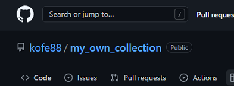
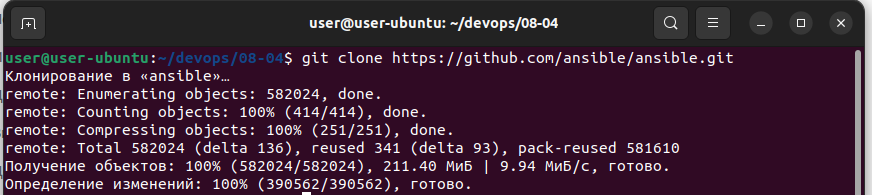
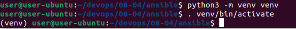
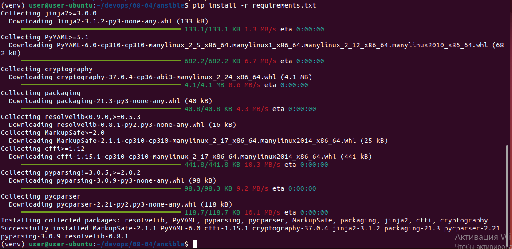
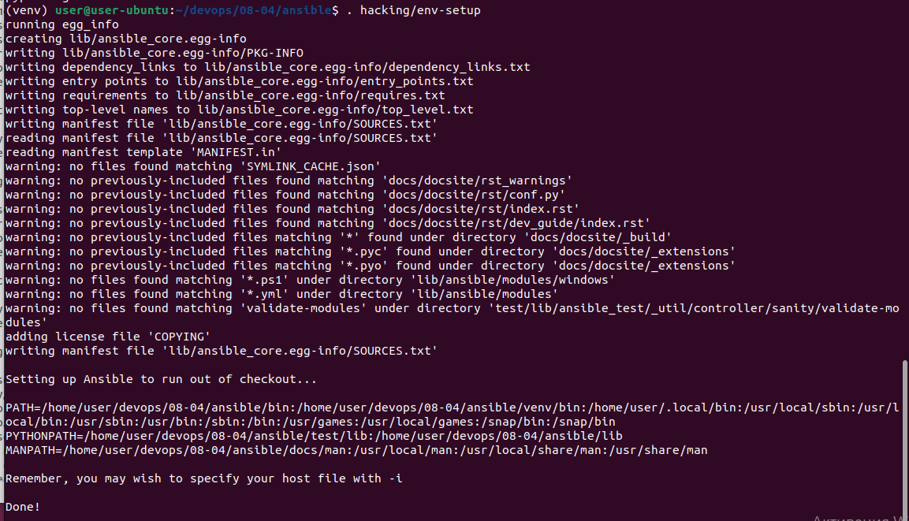
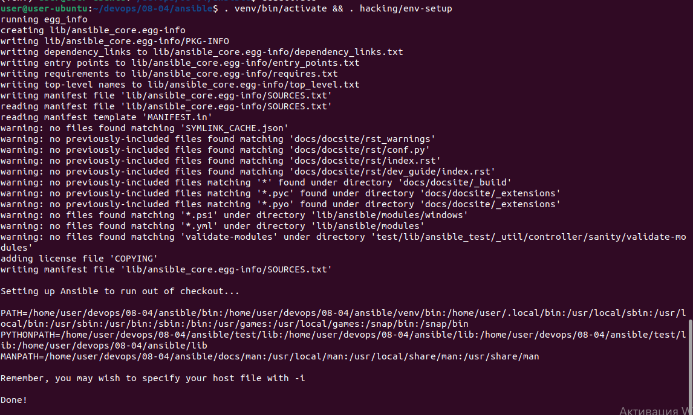
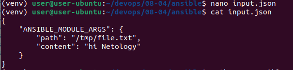
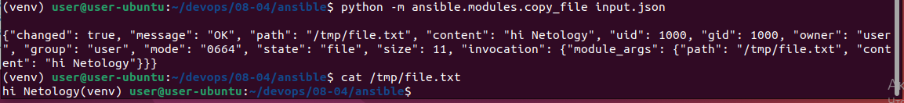
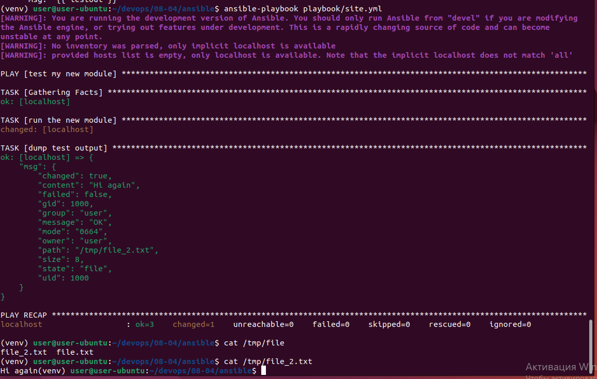
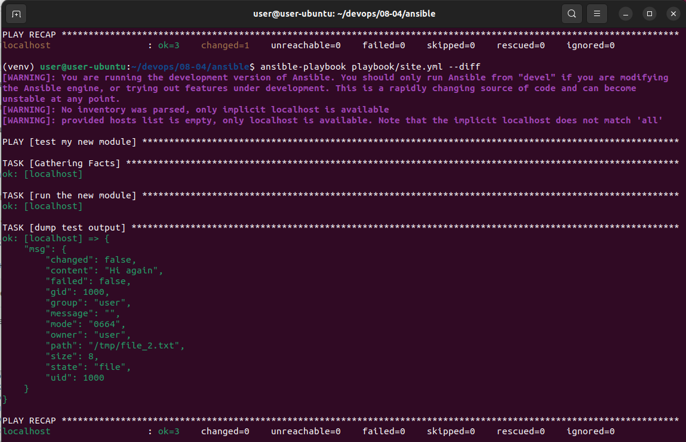

# Домашнее задание к занятию "08.04 Создание собственных modules"

## Подготовка к выполнению
1. Создайте пустой публичных репозиторий в любом своём проекте: `my_own_collection`

---

[https://github.com/kofe88/my_own_collection](https://github.com/kofe88/my_own_collection)



---

2. Скачайте репозиторий ansible: `git clone https://github.com/ansible/ansible.git` по любому удобному вам пути

---

```bash
user@user-ubuntu:~/devops/08-04$ git clone https://github.com/ansible/ansible.git
Клонирование в «ansible»…
remote: Enumerating objects: 582024, done.
remote: Counting objects: 100% (414/414), done.
remote: Compressing objects: 100% (251/251), done.
remote: Total 582024 (delta 136), reused 341 (delta 93), pack-reused 581610
Получение объектов: 100% (582024/582024), 211.40 МиБ | 9.94 МиБ/с, готово.
Определение изменений: 100% (390562/390562), готово.
```



---

3. Зайдите в директорию ansible: `cd ansible`

---

```bash
user@user-ubuntu:~/devops/08-04$ cd ansible/
```

---

4. Создайте виртуальное окружение: `python3 -m venv venv`

---

```bash
user@user-ubuntu:~/devops/08-04/ansible$ sudo apt install python3.10-venv
```

```bash
user@user-ubuntu:~/devops/08-04/ansible$ python3 -m venv venv
```



---

5. Активируйте виртуальное окружение: `. venv/bin/activate`. Дальнейшие действия производятся только в виртуальном окружении

---

```bash
user@user-ubuntu:~/devops/08-04/ansible$ . venv/bin/activate
(venv) user@user-ubuntu:~/devops/08-04/ansible$ 
```

---

6. Установите зависимости `pip install -r requirements.txt`

---

```bash
(venv) user@user-ubuntu:~/devops/08-04/ansible$ pip install -r requirements.txt
Collecting jinja2>=3.0.0
  Downloading Jinja2-3.1.2-py3-none-any.whl (133 kB)
     ━━━━━━━━━━━━━━━━━━━━━━━━━━━━━━━━━━━━━━━━ 133.1/133.1 KB 1.3 MB/s eta 0:00:00
Collecting PyYAML>=5.1
  Downloading PyYAML-6.0-cp310-cp310-manylinux_2_5_x86_64.manylinux1_x86_64.manylinux_2_12_x86_64.manylinux2010_x86_64.whl (682 kB)
     ━━━━━━━━━━━━━━━━━━━━━━━━━━━━━━━━━━━━━━━━ 682.2/682.2 KB 6.7 MB/s eta 0:00:00
Collecting cryptography
  Downloading cryptography-37.0.4-cp36-abi3-manylinux_2_24_x86_64.whl (4.1 MB)
     ━━━━━━━━━━━━━━━━━━━━━━━━━━━━━━━━━━━━━━━━ 4.1/4.1 MB 8.6 MB/s eta 0:00:00
Collecting packaging
  Downloading packaging-21.3-py3-none-any.whl (40 kB)
     ━━━━━━━━━━━━━━━━━━━━━━━━━━━━━━━━━━━━━━━━ 40.8/40.8 KB 4.3 MB/s eta 0:00:00
Collecting resolvelib<0.9.0,>=0.5.3
  Downloading resolvelib-0.8.1-py2.py3-none-any.whl (16 kB)
Collecting MarkupSafe>=2.0
  Downloading MarkupSafe-2.1.1-cp310-cp310-manylinux_2_17_x86_64.manylinux2014_x86_64.whl (25 kB)
Collecting cffi>=1.12
  Downloading cffi-1.15.1-cp310-cp310-manylinux_2_17_x86_64.manylinux2014_x86_64.whl (441 kB)
     ━━━━━━━━━━━━━━━━━━━━━━━━━━━━━━━━━━━━━━━━ 441.8/441.8 KB 10.3 MB/s eta 0:00:00
Collecting pyparsing!=3.0.5,>=2.0.2
  Downloading pyparsing-3.0.9-py3-none-any.whl (98 kB)
     ━━━━━━━━━━━━━━━━━━━━━━━━━━━━━━━━━━━━━━━━ 98.3/98.3 KB 9.2 MB/s eta 0:00:00
Collecting pycparser
  Downloading pycparser-2.21-py2.py3-none-any.whl (118 kB)
     ━━━━━━━━━━━━━━━━━━━━━━━━━━━━━━━━━━━━━━━━ 118.7/118.7 KB 10.1 MB/s eta 0:00:00
Installing collected packages: resolvelib, PyYAML, pyparsing, pycparser, MarkupSafe, packaging, jinja2, cffi, cryptography
Successfully installed MarkupSafe-2.1.1 PyYAML-6.0 cffi-1.15.1 cryptography-37.0.4 jinja2-3.1.2 packaging-21.3 pycparser-2.21 pyparsing-3.0.9 resolvelib-0.8.1
```



---

7. Запустить настройку окружения `. hacking/env-setup`

---

```bash
(venv) user@user-ubuntu:~/devops/08-04/ansible$ . hacking/env-setup
running egg_info
creating lib/ansible_core.egg-info
writing lib/ansible_core.egg-info/PKG-INFO
writing dependency_links to lib/ansible_core.egg-info/dependency_links.txt
writing entry points to lib/ansible_core.egg-info/entry_points.txt
writing requirements to lib/ansible_core.egg-info/requires.txt
writing top-level names to lib/ansible_core.egg-info/top_level.txt
writing manifest file 'lib/ansible_core.egg-info/SOURCES.txt'
reading manifest file 'lib/ansible_core.egg-info/SOURCES.txt'
reading manifest template 'MANIFEST.in'
warning: no files found matching 'SYMLINK_CACHE.json'
warning: no previously-included files found matching 'docs/docsite/rst_warnings'
warning: no previously-included files found matching 'docs/docsite/rst/conf.py'
warning: no previously-included files found matching 'docs/docsite/rst/index.rst'
warning: no previously-included files found matching 'docs/docsite/rst/dev_guide/index.rst'
warning: no previously-included files matching '*' found under directory 'docs/docsite/_build'
warning: no previously-included files matching '*.pyc' found under directory 'docs/docsite/_extensions'
warning: no previously-included files matching '*.pyo' found under directory 'docs/docsite/_extensions'
warning: no files found matching '*.ps1' under directory 'lib/ansible/modules/windows'
warning: no files found matching '*.yml' under directory 'lib/ansible/modules'
warning: no files found matching 'validate-modules' under directory 'test/lib/ansible_test/_util/controller/sanity/validate-modules'
adding license file 'COPYING'
writing manifest file 'lib/ansible_core.egg-info/SOURCES.txt'

Setting up Ansible to run out of checkout...

PATH=/home/user/devops/08-04/ansible/bin:/home/user/devops/08-04/ansible/venv/bin:/home/user/.local/bin:/usr/local/sbin:/usr/local/bin:/usr/sbin:/usr/bin:/sbin:/bin:/usr/games:/usr/local/games:/snap/bin:/snap/bin
PYTHONPATH=/home/user/devops/08-04/ansible/test/lib:/home/user/devops/08-04/ansible/lib
MANPATH=/home/user/devops/08-04/ansible/docs/man:/usr/local/man:/usr/local/share/man:/usr/share/man

Remember, you may wish to specify your host file with -i

Done!

```



---

8. Если все шаги прошли успешно - выйти из виртуального окружения `deactivate`

---

```bash
(venv) user@user-ubuntu:~/devops/08-04/ansible$ deactivate
user@user-ubuntu:~/devops/08-04/ansible$ 
```


---

9. Ваше окружение настроено, для того чтобы запустить его, нужно находиться в директории `ansible` и выполнить конструкцию `. venv/bin/activate && . hacking/env-setup`

---

```bash
user@user-ubuntu:~/devops/08-04/ansible$ . venv/bin/activate && . hacking/env-setup
running egg_info
creating lib/ansible_core.egg-info
writing lib/ansible_core.egg-info/PKG-INFO
writing dependency_links to lib/ansible_core.egg-info/dependency_links.txt
writing entry points to lib/ansible_core.egg-info/entry_points.txt
writing requirements to lib/ansible_core.egg-info/requires.txt
writing top-level names to lib/ansible_core.egg-info/top_level.txt
writing manifest file 'lib/ansible_core.egg-info/SOURCES.txt'
reading manifest file 'lib/ansible_core.egg-info/SOURCES.txt'
reading manifest template 'MANIFEST.in'
warning: no files found matching 'SYMLINK_CACHE.json'
warning: no previously-included files found matching 'docs/docsite/rst_warnings'
warning: no previously-included files found matching 'docs/docsite/rst/conf.py'
warning: no previously-included files found matching 'docs/docsite/rst/index.rst'
warning: no previously-included files found matching 'docs/docsite/rst/dev_guide/index.rst'
warning: no previously-included files matching '*' found under directory 'docs/docsite/_build'
warning: no previously-included files matching '*.pyc' found under directory 'docs/docsite/_extensions'
warning: no previously-included files matching '*.pyo' found under directory 'docs/docsite/_extensions'
warning: no files found matching '*.ps1' under directory 'lib/ansible/modules/windows'
warning: no files found matching '*.yml' under directory 'lib/ansible/modules'
warning: no files found matching 'validate-modules' under directory 'test/lib/ansible_test/_util/controller/sanity/validate-modules'
adding license file 'COPYING'
writing manifest file 'lib/ansible_core.egg-info/SOURCES.txt'

Setting up Ansible to run out of checkout...

PATH=/home/user/devops/08-04/ansible/bin:/home/user/devops/08-04/ansible/venv/bin:/home/user/.local/bin:/usr/local/sbin:/usr/local/bin:/usr/sbin:/usr/bin:/sbin:/bin:/usr/games:/usr/local/games:/snap/bin:/snap/bin
PYTHONPATH=/home/user/devops/08-04/ansible/test/lib:/home/user/devops/08-04/ansible/lib:/home/user/devops/08-04/ansible/test/lib:/home/user/devops/08-04/ansible/lib
MANPATH=/home/user/devops/08-04/ansible/docs/man:/usr/local/man:/usr/local/share/man:/usr/share/man

Remember, you may wish to specify your host file with -i

Done!
```



---

## Основная часть

Наша цель - написать собственный module, который мы можем использовать в своей role, через playbook. Всё это должно быть собрано в виде collection и отправлено в наш репозиторий.

1. В виртуальном окружении создать новый `my_own_module.py` файл

---

```bash
(venv) user@user-ubuntu:~/devops/08-04/ansible$ touch lib/ansible/modules/copy_file.py
```

---

2. Наполнить его содержимым:
```python
#!/usr/bin/python

# Copyright: (c) 2018, Terry Jones <terry.jones@example.org>
# GNU General Public License v3.0+ (see COPYING or https://www.gnu.org/licenses/gpl-3.0.txt)
from __future__ import (absolute_import, division, print_function)
__metaclass__ = type

DOCUMENTATION = r'''
---
module: my_test

short_description: This is my test module

# If this is part of a collection, you need to use semantic versioning,
# i.e. the version is of the form "2.5.0" and not "2.4".
version_added: "1.0.0"

description: This is my longer description explaining my test module.

options:
    name:
        description: This is the message to send to the test module.
        required: true
        type: str
    new:
        description:
            - Control to demo if the result of this module is changed or not.
            - Parameter description can be a list as well.
        required: false
        type: bool
# Specify this value according to your collection
# in format of namespace.collection.doc_fragment_name
extends_documentation_fragment:
    - my_namespace.my_collection.my_doc_fragment_name

author:
    - Your Name (@yourGitHubHandle)
'''

EXAMPLES = r'''
# Pass in a message
- name: Test with a message
  my_namespace.my_collection.my_test:
    name: hello world

# pass in a message and have changed true
- name: Test with a message and changed output
  my_namespace.my_collection.my_test:
    name: hello world
    new: true

# fail the module
- name: Test failure of the module
  my_namespace.my_collection.my_test:
    name: fail me
'''

RETURN = r'''
# These are examples of possible return values, and in general should use other names for return values.
original_message:
    description: The original name param that was passed in.
    type: str
    returned: always
    sample: 'hello world'
message:
    description: The output message that the test module generates.
    type: str
    returned: always
    sample: 'goodbye'
'''

from ansible.module_utils.basic import AnsibleModule


def run_module():
    # define available arguments/parameters a user can pass to the module
    module_args = dict(
        name=dict(type='str', required=True),
        new=dict(type='bool', required=False, default=False)
    )

    # seed the result dict in the object
    # we primarily care about changed and state
    # changed is if this module effectively modified the target
    # state will include any data that you want your module to pass back
    # for consumption, for example, in a subsequent task
    result = dict(
        changed=False,
        original_message='',
        message=''
    )

    # the AnsibleModule object will be our abstraction working with Ansible
    # this includes instantiation, a couple of common attr would be the
    # args/params passed to the execution, as well as if the module
    # supports check mode
    module = AnsibleModule(
        argument_spec=module_args,
        supports_check_mode=True
    )

    # if the user is working with this module in only check mode we do not
    # want to make any changes to the environment, just return the current
    # state with no modifications
    if module.check_mode:
        module.exit_json(**result)

    # manipulate or modify the state as needed (this is going to be the
    # part where your module will do what it needs to do)
    result['original_message'] = module.params['name']
    result['message'] = 'goodbye'

    # use whatever logic you need to determine whether or not this module
    # made any modifications to your target
    if module.params['new']:
        result['changed'] = True

    # during the execution of the module, if there is an exception or a
    # conditional state that effectively causes a failure, run
    # AnsibleModule.fail_json() to pass in the message and the result
    if module.params['name'] == 'fail me':
        module.fail_json(msg='You requested this to fail', **result)

    # in the event of a successful module execution, you will want to
    # simple AnsibleModule.exit_json(), passing the key/value results
    module.exit_json(**result)


def main():
    run_module()


if __name__ == '__main__':
    main()
```
Или возьмите данное наполнение из [статьи](https://docs.ansible.com/ansible/latest/dev_guide/developing_modules_general.html#creating-a-module).

3. Заполните файл в соответствии с требованиями ansible так, чтобы он выполнял основную задачу: module должен создавать текстовый файл на удалённом хосте по пути, определённом в параметре `path`, с содержимым, определённым в параметре `content`.

---

[copy_file.py](scripts/my_own_collection/plugins/modules/copy_file.py)

---

4. Проверьте module на исполняемость локально.

---

`input.json`

```bash
(venv) user@user-ubuntu:~/devops/08-04/ansible$ nano input.json
(venv) user@user-ubuntu:~/devops/08-04/ansible$ cat input.json 
{
    "ANSIBLE_MODULE_ARGS": {
        "path": "/tmp/file.txt",
        "content": "hi Netology"
    }
}

```



```bash
(venv) user@user-ubuntu:~/devops/08-04/ansible$ python -m ansible.modules.copy_file input.json

{"changed": true, "message": "OK", "path": "/tmp/file.txt", "content": "hi Netology", "uid": 1000, "gid": 1000, "owner": "user", "group": "user", "mode": "0664", "state": "file", "size": 11, "invocation": {"module_args": {"path": "/tmp/file.txt", "content": "hi Netology"}}}

(venv) user@user-ubuntu:~/devops/08-04/ansible$ cat /tmp/file.txt 
hi Netology
```



---

5. Напишите single task playbook и используйте module в нём.

---

```bash
(venv) user@user-ubuntu:~/devops/08-04/ansible$ mkdir playbook
(venv) user@user-ubuntu:~/devops/08-04/ansible$ touch playbook/site.yml
(venv) user@user-ubuntu:~/devops/08-04/ansible$ nano playbook/site.yml 
(venv) user@user-ubuntu:~/devops/08-04/ansible$ cat playbook/site.yml 
- name: test my new module
  hosts: localhost
  tasks:
  - name: run the new module
    copy_file:
      path: '/tmp/file_2.txt'
      content: 'Hi again'
    register: testout
  - name: dump test output
    debug:
      msg: '{{ testout }}'

```

```bash
(venv) user@user-ubuntu:~/devops/08-04/ansible$ ansible-playbook playbook/site.yml
[WARNING]: You are running the development version of Ansible. You should only run Ansible from "devel" if you are modifying
the Ansible engine, or trying out features under development. This is a rapidly changing source of code and can become
unstable at any point.
[WARNING]: No inventory was parsed, only implicit localhost is available
[WARNING]: provided hosts list is empty, only localhost is available. Note that the implicit localhost does not match 'all'

PLAY [test my new module] ****************************************************************************************************

TASK [Gathering Facts] *******************************************************************************************************
ok: [localhost]

TASK [run the new module] ****************************************************************************************************
changed: [localhost]

TASK [dump test output] ******************************************************************************************************
ok: [localhost] => {
    "msg": {
        "changed": true,
        "content": "Hi again",
        "failed": false,
        "gid": 1000,
        "group": "user",
        "message": "OK",
        "mode": "0664",
        "owner": "user",
        "path": "/tmp/file_2.txt",
        "size": 8,
        "state": "file",
        "uid": 1000
    }
}

PLAY RECAP *******************************************************************************************************************
localhost                  : ok=3    changed=1    unreachable=0    failed=0    skipped=0    rescued=0    ignored=0   

(venv) user@user-ubuntu:~/devops/08-04/ansible$ cat /tmp/file
file_2.txt  file.txt    
(venv) user@user-ubuntu:~/devops/08-04/ansible$ cat /tmp/file_2.txt 
Hi again
(venv) user@user-ubuntu:~/devops/08-04/ansible$ 
```



---

6. Проверьте через playbook на идемпотентность.

---

```bash
(venv) user@user-ubuntu:~/devops/08-04/ansible$ rm /tmp/file_2.txt
(venv) user@user-ubuntu:~/devops/08-04/ansible$ ansible-playbook playbook/site.yml --diff
[WARNING]: You are running the development version of Ansible. You should only run Ansible from "devel" if you are modifying
the Ansible engine, or trying out features under development. This is a rapidly changing source of code and can become
unstable at any point.
[WARNING]: No inventory was parsed, only implicit localhost is available
[WARNING]: provided hosts list is empty, only localhost is available. Note that the implicit localhost does not match 'all'

PLAY [test my new module] ****************************************************************************************************

TASK [Gathering Facts] *******************************************************************************************************
ok: [localhost]

TASK [run the new module] ****************************************************************************************************
changed: [localhost]

TASK [dump test output] ******************************************************************************************************
ok: [localhost] => {
    "msg": {
        "changed": true,
        "content": "Hi again",
        "failed": false,
        "gid": 1000,
        "group": "user",
        "message": "OK",
        "mode": "0664",
        "owner": "user",
        "path": "/tmp/file_2.txt",
        "size": 8,
        "state": "file",
        "uid": 1000
    }
}

PLAY RECAP *******************************************************************************************************************
localhost                  : ok=3    changed=1    unreachable=0    failed=0    skipped=0    rescued=0    ignored=0   

(venv) user@user-ubuntu:~/devops/08-04/ansible$ ansible-playbook playbook/site.yml --diff
[WARNING]: You are running the development version of Ansible. You should only run Ansible from "devel" if you are modifying
the Ansible engine, or trying out features under development. This is a rapidly changing source of code and can become
unstable at any point.
[WARNING]: No inventory was parsed, only implicit localhost is available
[WARNING]: provided hosts list is empty, only localhost is available. Note that the implicit localhost does not match 'all'

PLAY [test my new module] ****************************************************************************************************

TASK [Gathering Facts] *******************************************************************************************************
ok: [localhost]

TASK [run the new module] ****************************************************************************************************
ok: [localhost]

TASK [dump test output] ******************************************************************************************************
ok: [localhost] => {
    "msg": {
        "changed": false,
        "content": "Hi again",
        "failed": false,
        "gid": 1000,
        "group": "user",
        "message": "",
        "mode": "0664",
        "owner": "user",
        "path": "/tmp/file_2.txt",
        "size": 8,
        "state": "file",
        "uid": 1000
    }
}

PLAY RECAP *******************************************************************************************************************
localhost                  : ok=3    changed=0    unreachable=0    failed=0    skipped=0    rescued=0    ignored=0  
```



---

7. Выйдите из виртуального окружения.

---

```bash
(venv) user@user-ubuntu:~/devops/08-04/ansible$ deactivate
```

---

8. Инициализируйте новую collection: `ansible-galaxy collection init my_own_namespace.my_own_collection`

---

```bash
user@user-ubuntu:~/devops/08-04/ansible$ ansible-galaxy collection init my_own_namespace.my_own_collection
- Collection my_own_namespace.my_own_collection was created successfully

```

---

9. В данную collection перенесите свой module в соответствующую директорию.

---

```bash
user@user-ubuntu:~/devops/08-04/ansible/my_own_namespace$ tree
.
└── my_own_collection
    ├── galaxy.yml
    ├── modules
    │   └── copy_file.py
    ├── plugins
    │   └── README.md
    └── README.md

3 directories, 4 files
```

---

10. Single task playbook преобразуйте в single task role и перенесите в collection. У role должны быть default всех параметров module

11. Создайте playbook для использования этой role.

---


`site.yml`
```yaml
- name: Run copy_file
  hosts: localhost
  roles:
    - copy_file
```


---

12. Заполните всю документацию по collection, выложите в свой репозиторий, поставьте тег `1.0.0` на этот коммит.
13. Создайте .tar.gz этой collection: `ansible-galaxy collection build` в корневой директории collection.

---

```bash
user@user-ubuntu:~/devops/08-04/ansible/my_own_namespace/my_own_collection$ ansible-galaxy collection build
Created collection for my_own_namespace.my_own_collection at /home/user/devops/08-04/ansible/my_own_namespace/my_own_collection/my_own_namespace-my_own_collection-1.0.0.tar.gz
```

---

14. Создайте ещё одну директорию любого наименования, перенесите туда single task playbook и архив c collection.

---

```bash
user@user-ubuntu:~/devops/08-04/test$ ls
my_own_namespace-my_own_collection-1.0.0.tar.gz  site.yml
user@user-ubuntu:~/devops/08-04/test$ cat site.yml 
- name: test my new module
  hosts: localhost
  tasks:
  - name: run the new module
    my_own_namespace.my_own_collection.copy_file:
      path: '/tmp/file_2.txt'
      content: 'Hi again'
    register: testout
  - name: dump test output
    debug:
      msg: '{{ testout }}'


```

---

15. Установите collection из локального архива: `ansible-galaxy collection install <archivename>.tar.gz`

---

```bash
user@user-ubuntu:~/devops/08-04/test$ ansible-galaxy collection install my_own_namespace-my_own_collection-1.0.0.tar.gz 
Starting galaxy collection install process
Process install dependency map
Starting collection install process
Installing 'my_own_namespace.my_own_collection:1.0.0' to '/home/user/.ansible/collections/ansible_collections/my_own_namespace/my_own_collection'
my_own_namespace.my_own_collection (1.0.0) was installed successfully

```
---

16. Запустите playbook, убедитесь, что он работает.

---

```bash
user@user-ubuntu:~/devops/08-04/test$ ansible-playbook site.yml 
[WARNING]: No inventory was parsed, only implicit localhost is available
[WARNING]: provided hosts list is empty, only localhost is available. Note that
the implicit localhost does not match 'all'

PLAY [test my new module] *********************************************************

TASK [Gathering Facts] ************************************************************
ok: [localhost]

TASK [run the new module] *********************************************************
ok: [localhost]

TASK [dump test output] ***********************************************************
ok: [localhost] => {
    "msg": {
        "changed": false,
        "content": "Hi again",
        "failed": false,
        "gid": 1000,
        "group": "user",
        "message": "",
        "mode": "0664",
        "owner": "user",
        "path": "/tmp/file_2.txt",
        "size": 8,
        "state": "file",
        "uid": 1000
    }
}

PLAY RECAP ************************************************************************
localhost                  : ok=3    changed=0    unreachable=0    failed=0    skipped=0    rescued=0    ignored=0 
```

---

17. В ответ необходимо прислать ссылку на репозиторий с collection

---

[https://github.com/kofe88/my_own_collection](https://github.com/kofe88/my_own_collection)


---


## Необязательная часть

1. Используйте свой полёт фантазии: Создайте свой собственный module для тех roles, что мы делали в рамках предыдущих лекций.
2. Соберите из roles и module отдельную collection.
3. Создайте новый репозиторий и выложите новую collection туда.

Если идей нет, но очень хочется попробовать что-то реализовать: реализовать module восстановления из backup elasticsearch.

---

### Как оформить ДЗ?

Выполненное домашнее задание пришлите ссылкой на .md-файл в вашем репозитории.

---
