# Домашнее задание к занятию "09.02 CI\CD"

## Знакомоство с SonarQube

### Подготовка к выполнению

1. Выполняем `docker pull sonarqube:8.7-community`

---

```bash
user@user-ubuntu:~/devops/09-02$ docker pull sonarqube:8.7-community
8.7-community: Pulling from library/sonarqube
22599d3e9e25: Pull complete 
00bb4d95f2aa: Pull complete 
3ef8cf8a60c8: Pull complete 
928990dd1bda: Pull complete 
07cca701c22e: Pull complete 
Digest: sha256:70496f44067bea15514f0a275ee898a7e4a3fedaaa6766e7874d24a39be336dc
Status: Downloaded newer image for sonarqube:8.7-community
docker.io/library/sonarqube:8.7-community
```

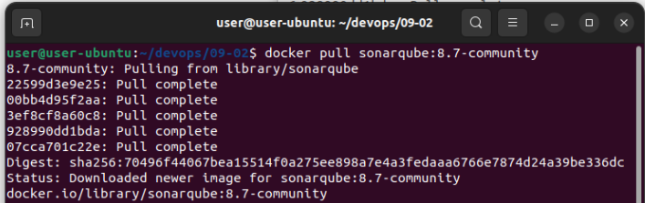

---

2. Выполняем `docker run -d --name sonarqube -e SONAR_ES_BOOTSTRAP_CHECKS_DISABLE=true -p 9000:9000 sonarqube:8.7-community`

---

```bash
user@user-ubuntu:~/devops/09-02$ docker run -d --name sonarqube -e SONAR_ES_BOOTSTRAP_CHECKS_DISABLE=true -p 9000:9000 sonarqube:8.7-community
d2b2672c6389c3eb4f23527ad90dec7c623613b94466228308c69fe6dd3ef4a2
```

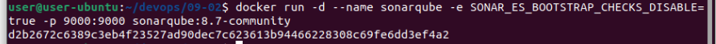

---

3. Ждём запуск, смотрим логи через `docker logs -f sonarqube`

---

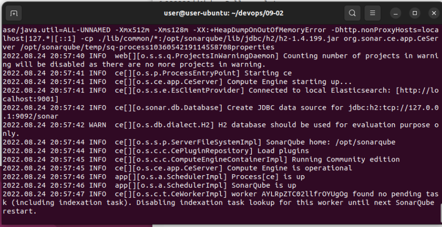

---

4. Проверяем готовность сервиса через [браузер](http://localhost:9000)

---

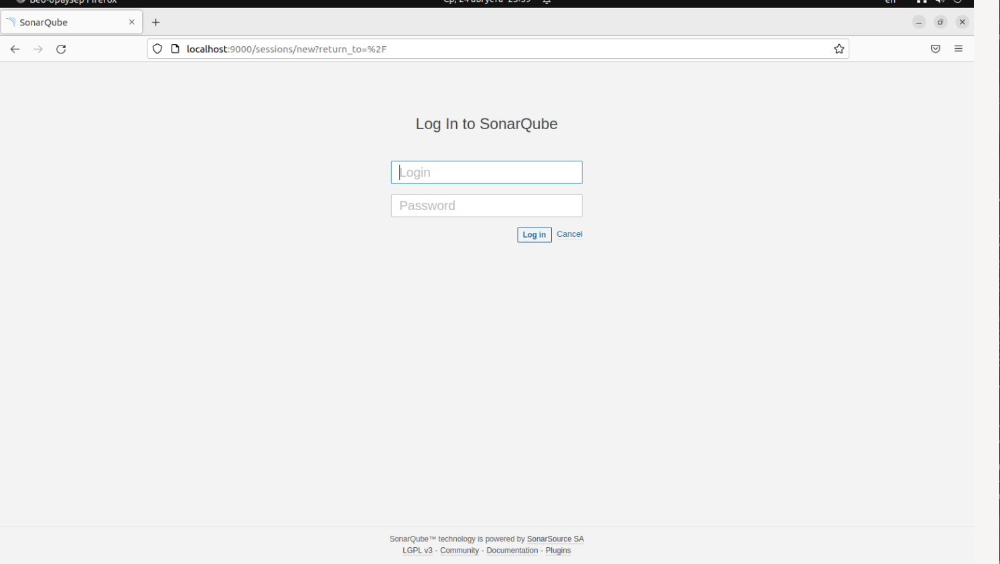

---

5. Заходим под admin\admin, меняем пароль на свой

---

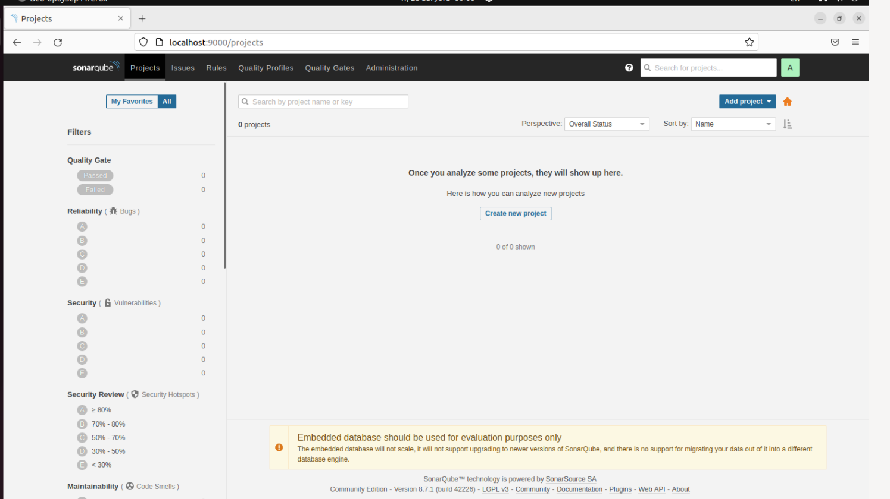

---

В целом, в [этой статье](https://docs.sonarqube.org/latest/setup/install-server/) описаны все варианты установки, включая и docker, но так как нам он нужен разово, то достаточно того набора действий, который я указал выше.

### Основная часть

1. Создаём новый проект, название произвольное

---

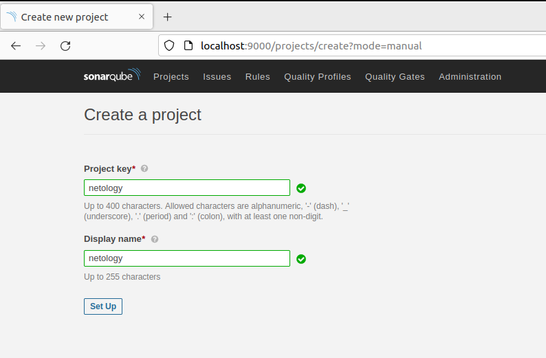

---

2. Скачиваем пакет sonar-scanner, который нам предлагает скачать сам sonarqube

---

[https://docs.sonarqube.org/latest/analysis/scan/sonarscanner/](https://docs.sonarqube.org/latest/analysis/scan/sonarscanner/)

---

3. Делаем так, чтобы binary был доступен через вызов в shell (или меняем переменную PATH или любой другой удобный вам способ)

---

```bash
user@user-ubuntu:~/devops/09-02$ install_directory=~/devops/09-02/SonarQube/sonar-scanner-4.7.0.2747-linux/
user@user-ubuntu:~/devops/09-02$ export PATH="~/devops/09-02/SonarQube/sonar-scanner-4.7.0.2747-linux/bin:$PATH"

```
---

4.Проверяем `sonar-scanner --version`

---

```bash
user@user-ubuntu:~/devops/09-02$ sonar-scanner --version
INFO: Scanner configuration file: /home/user/devops/09-02/SonarQube/sonar-scanner-4.7.0.2747-linux/conf/sonar-scanner.properties
INFO: Project root configuration file: NONE
INFO: SonarScanner 4.7.0.2747
INFO: Java 11.0.14.1 Eclipse Adoptium (64-bit)
INFO: Linux 5.15.0-46-generic amd64
```

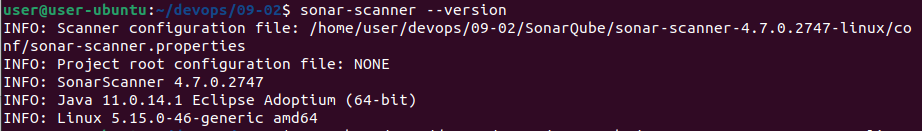

---

7. Запускаем анализатор против кода из директории [example](./example) с дополнительным ключом `-Dsonar.coverage.exclusions=fail.py`

---

```bash
sonar-scanner \
  -Dsonar.projectKey=netology \
  -Dsonar.sources=./examlpe \
  -Dsonar.host.url=http://localhost:9000 \
  -Dsonar.login=cd9df107762871b6f3a773c8501a0cec7c523b86 \
  -Dsonar.coverage.exclusions=fail.py
```

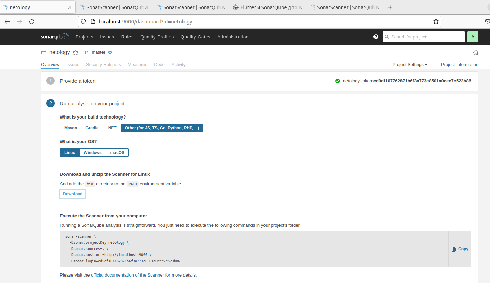

---

8. Смотрим результат в интерфейсе

---

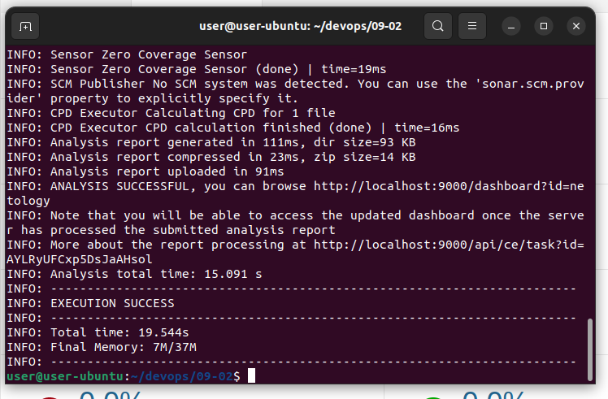

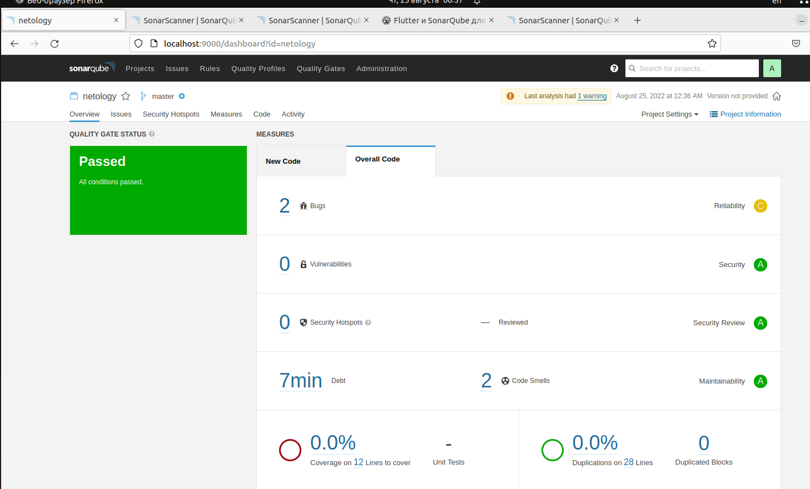

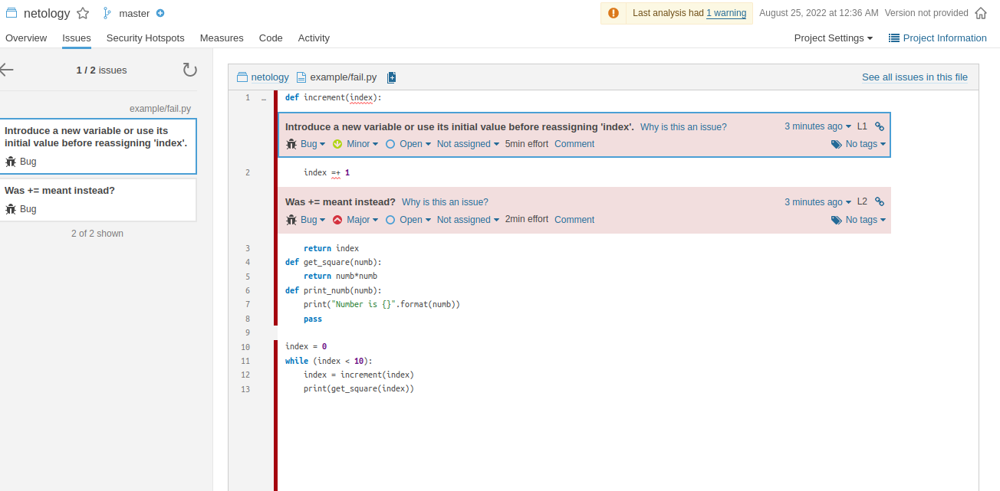
---

9. Исправляем ошибки, которые он выявил(включая warnings)

---

[fail.py](scripts/example/fail.py)

---

10. Запускаем анализатор повторно - проверяем, что QG пройдены успешно
11. Делаем скриншот успешного прохождения анализа, прикладываем к решению ДЗ

---

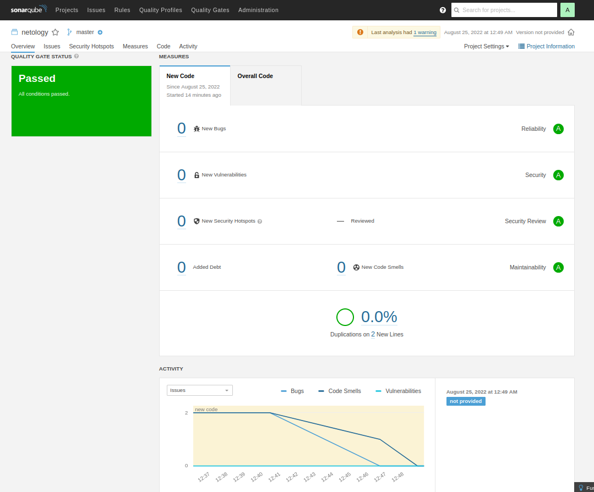

---

## Знакомство с Nexus

### Подготовка к выполнению

1. Выполняем `docker pull sonatype/nexus3`

---

```bash
user@user-ubuntu:~/devops/09-02$ docker pull sonatype/nexus3
Using default tag: latest
latest: Pulling from sonatype/nexus3
a96e4e55e78a: Pull complete 
67d8ef478732: Pull complete 
5dab04a94e74: Pull complete 
f18da266a531: Pull complete 
8eaab91b309d: Pull complete 
9191b3fc4348: Pull complete 
16516688603a: Pull complete 
Digest: sha256:45e9800b14b97bbde60a6aef12842d2ed666f64cead6a6118c151f2fc2973f55
Status: Downloaded newer image for sonatype/nexus3:latest
docker.io/sonatype/nexus3:latest
```

---

2. Выполняем `docker run -d -p 8081:8081 --name nexus sonatype/nexus3`

---

```bash
user@user-ubuntu:~/devops/09-02$ docker run -d -p 8081:8081 --name nexus sonatype/nexus3
b188e96ff28df47c97ec1a12fd770547c347825b42e19c5b69baa7118ccca8b7
```

---

3. Ждём запуск, смотрим логи через `docker logs -f nexus`

---

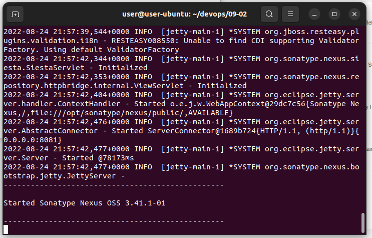

---

4. Проверяем готовность сервиса через [бразуер](http://localhost:8081)

---

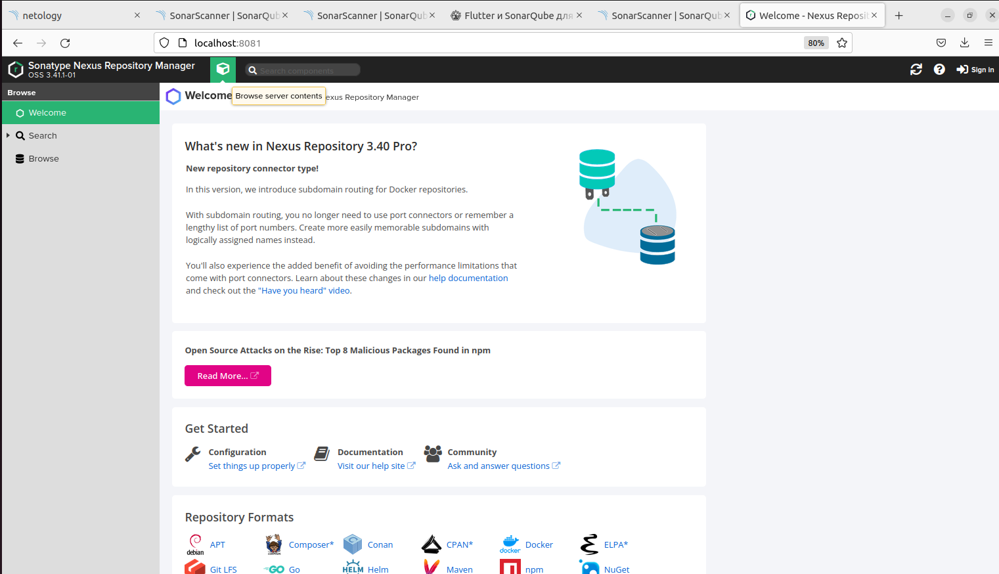

---

5. Узнаём пароль от admin через `docker exec -it nexus /bin/bash`

---

```bash
user@user-ubuntu:~/devops/09-02$ docker exec -it nexus /bin/bash
bash-4.4$ cat /nexus-data/admin.password && echo
6d737748-a430-4c7e-a90f-32deca9637d6
```
---

6. Подключаемся под админом, меняем пароль, сохраняем анонимный доступ

---

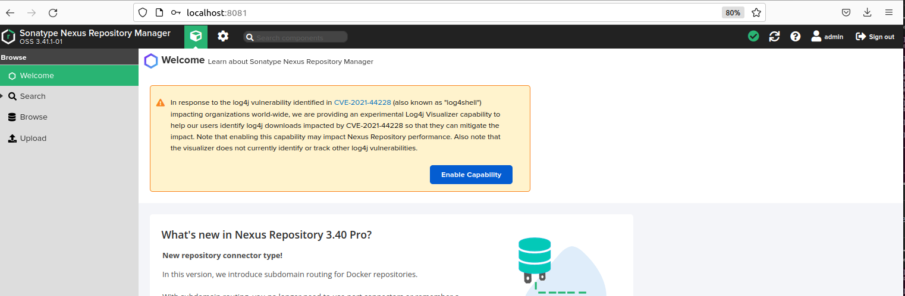

---

### Основная часть

1. В репозиторий `maven-public` загружаем артефакт с GAV параметрами:
   1. groupId: netology
   2. artifactId: java
   3. version: 8_282
   4. classifier: distrib
   5. type: tar.gz

---

Доступен `maven-release`, в него загрузил

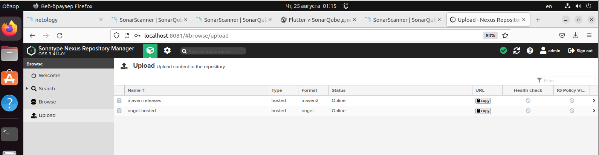

---

2. В него же загружаем такой же артефакт, но с version: 8_102
3. Проверяем, что все файлы загрузились успешно

---

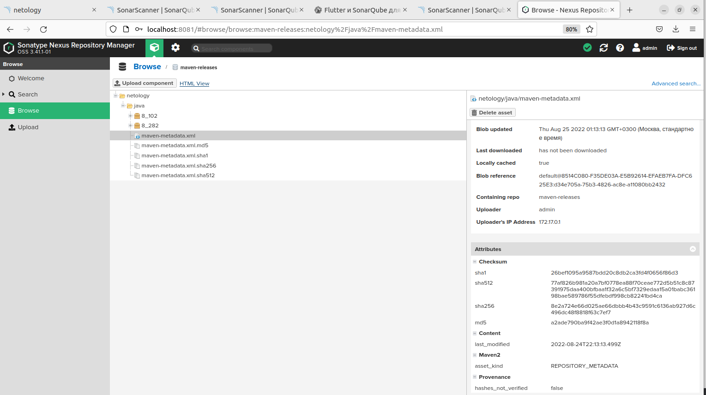

---

4. В ответе присылаем файл `maven-metadata.xml` для этого артефекта

---

[maven-metadata.xml](scripts/maven-metadata.xml)

---

### Знакомство с Maven

### Подготовка к выполнению

1. Скачиваем дистрибутив с [maven](https://maven.apache.org/download.cgi)
2. Разархивируем, делаем так, чтобы binary был доступен через вызов в shell (или меняем переменную PATH или любой другой удобный вам способ)

---

```bash
user@user-ubuntu:~/devops/09-02$ export PATH="~/devops/09-02/Maven/apache-maven-3.8.6/bin:$PATH"
```

---

3. Проверяем `mvn --version`

---

```bash
user@user-ubuntu:~/devops/09-02$ sudo apt install default-jre
user@user-ubuntu:~/devops/09-02$ JAVA_HOME="/usr/lib/jvm/java-11-openjdk-amd64"
user@user-ubuntu:~/devops/09-02$ mvn --version
Apache Maven 3.8.6 (84538c9988a25aec085021c365c560670ad80f63)
Maven home: /home/user/devops/09-02/Maven/apache-maven-3.8.6
Java version: 11.0.16, vendor: Ubuntu, runtime: /usr/lib/jvm/java-11-openjdk-amd64
Default locale: ru_RU, platform encoding: UTF-8
OS name: "linux", version: "5.15.0-46-generic", arch: "amd64", family: "unix"
```

---

4. Забираем директорию [mvn](./mvn) с pom

### Основная часть

1. Меняем в `pom.xml` блок с зависимостями под наш артефакт из первого пункта задания для Nexus (java с версией 8_282)

---

```xml
  <dependencies>
    <dependency>
      <groupId>netology</groupId>
      <artifactId>java</artifactId>
      <version>8_282</version>
      <classifier>distrib</classifier>
      <type>tar.gz</type>
    </dependency>
  </dependencies>
```

---

2. Запускаем команду `mvn package` в директории с `pom.xml`, ожидаем успешного окончания

---

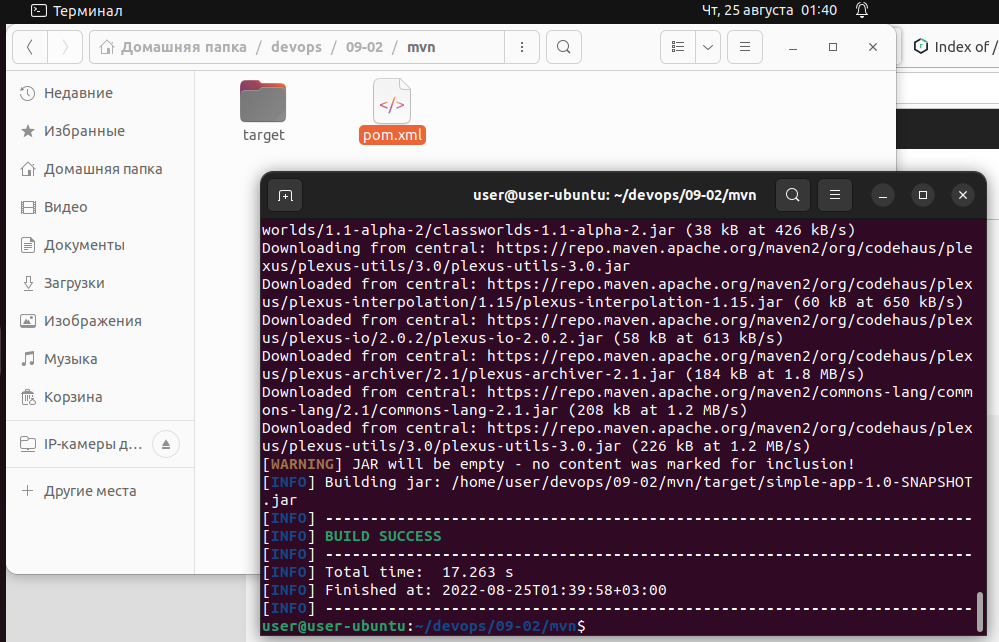

---

3. Проверяем директорию `~/.m2/repository/`, находим наш артефакт

---

```bash
user@user-ubuntu:~/devops/09-02/mvn$ ls ~/.m2/repository/
backport-util-concurrent  com          commons-lang     junit  netology
classworlds               commons-cli  commons-logging  log4j  org
```

---

4. В ответе присылаем исправленный файл `pom.xml`

---

[pom.xml](scripts/mvn/pom.xml)

---

---

### Как оформить ДЗ?

Выполненное домашнее задание пришлите ссылкой на .md-файл в вашем репозитории.

---
