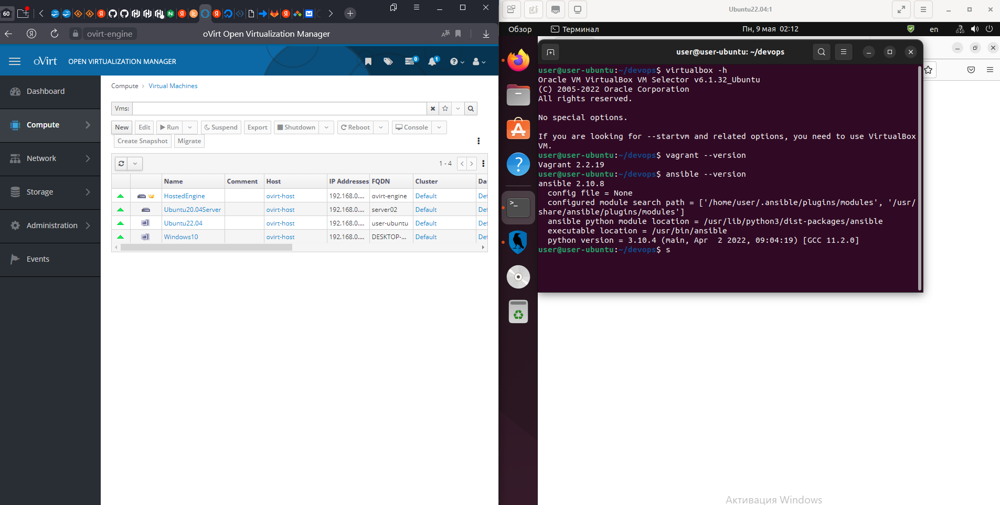
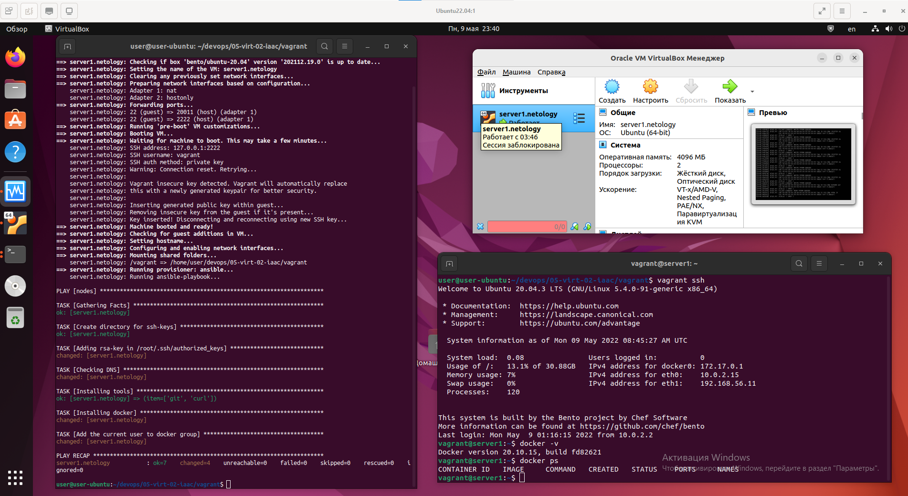

# Домашнее задание к занятию "5.2. Применение принципов IaaC в работе с виртуальными машинами"

## Как сдавать задания

Обязательными к выполнению являются задачи без указания звездочки. Их выполнение необходимо для получения зачета и диплома о профессиональной переподготовке.

Задачи со звездочкой (*) являются дополнительными задачами и/или задачами повышенной сложности. Они не являются обязательными к выполнению, но помогут вам глубже понять тему.

Домашнее задание выполните в файле readme.md в github репозитории. В личном кабинете отправьте на проверку ссылку на .md-файл в вашем репозитории.

Любые вопросы по решению задач задавайте в чате учебной группы.

---

## Задача 1

- Опишите своими словами основные преимущества применения на практике IaaC паттернов.
- Какой из принципов IaaC является основополагающим?

---

1. CI (Continuous Integration) - Непрерывная интеграция (CI). Практика разработки, смысл в которой - постоянно выполнять слияние рабочих веток с основной. Данная практика позволяет на ранних этапах находить баги и исправлять их. Непрерывной интеграция способствует сокращению сроков разработки.
2. CD (continuous Delivery) - Непрерывная доставка (СD) - CI + CD. Практика, которая заключается в сборке и тестирование продукта при при любых изменениях в коде. Применение этой практики позволяет разработчикам осуществлять выпуск обновлений небольшими частями, разноплановую проверку новых версий продукта перед развертыванием. За счет небольших обновлений их легко изменить или откатить.
3. СD (Continuous Deployment) - Непрерывное развёртывание (CD) - CI +CD + CD. После автоматизации доставки остаётся один этап, где требуется ручное вмешательство в процесс - запуск в продакшен - нажатие разработчиком кнопки. Практика непрерывного развёртывания упрощает это, не требуя непосредственного утверждения со стороны разработчика. Частый выпуск новых версий и доставка их до клиентов позволит быстрее добавлять требуемые функции в продукт, а так же находить баги, не найденные на этапе тестирования и быстрее их исправлять.

Основопологающий принцип - Идемпотентность - это означает что при повторном выполнении одной и той же операции, мы получим результат, идентичный всем предыдущим и последующим выполнениям. Это означает что все разработчики и тестировщики при выполнении одних и тех же последовательностей действий будут получать одинаковые резултаты.

---

## Задача 2

- Чем Ansible выгодно отличается от других систем управление конфигурациями?
- Какой, на ваш взгляд, метод работы систем конфигурации более надёжный push или pull?

---

Ansible выгодно отличается тем, что использует уже существующую SSH инфраструктуру и не требует установки сторонних PKI окружений работы.

Push или Pull. Все зависит от конкретных задач. Если инфраструктура не большая, то можно применить и Push, сервер вполне справится. Если инфраструктура большая, то стоит применять Pull, сервер будет отвечать на запросы от клиентов. Но мне кажется более надежный Pull. Не знаю на сколько будет корректно сравнение с MS SCCM, который тоже работает в режиме Push и Pull. По опыту при Pull запросах от более 700 клиентов, идет намного меньшая нагрузка на сервер и сеть, например при развертывании новых приложений, чем при экстренных Push. При Pull ниже вероятность нештатного поведения служб сервера и сети. 

---

## Задача 3

Установить на личный компьютер:

- VirtualBox
- Vagrant
- Ansible

*Приложить вывод команд установленных версий каждой из программ, оформленный в markdown.*

---

1. VirtualBox

```bash
sudo apt install virtualbox virtualbox-ext-pack
```

```bash
user@user-ubuntu:~/devops$ virtualbox -h
Oracle VM VirtualBox VM Selector v6.1.32_Ubuntu
(C) 2005-2022 Oracle Corporation
All rights reserved.

No special options.

If you are looking for --startvm and related options, you need to use VirtualBoxVM.

```

2. Vagrant

```bash
wget https://releases.hashicorp.com/vagrant/2.2.19/vagrant_2.2.19_x86_64.deb
sudo dpkg -i vagrant_2.2.19_x86_64.deb
```

```bash
user@user-ubuntu:~/devops$ vagrant --version
Vagrant 2.2.19

```

3. Ansible

```bash
sudo apt install ansible
```

```bash
user@user-ubuntu:~/devops$ ansible --version
ansible 2.10.8
  config file = None
  configured module search path = ['/home/user/.ansible/plugins/modules', '/usr/share/ansible/plugins/modules']
  ansible python module location = /usr/lib/python3/dist-packages/ansible
  executable location = /usr/bin/ansible
  python version = 3.10.4 (main, Apr  2 2022, 09:04:19) [GCC 11.2.0]

```

Вариант установки вышел такой - ВМ Ubuntu22.04 в Ovirt, а в ней уже VBox 6.1.32, Vagrant 2.2.19, Ansible 2.10.8



---

## Задача 4 (*)

Воспроизвести практическую часть лекции самостоятельно.

- Создать виртуальную машину.
- Зайти внутрь ВМ, убедиться, что Docker установлен с помощью команды
```
docker ps
```

---

Выполнено, Docker установлен через Ansible. Пришлось немного повозиться с nested виртуализацией, вложенной виртуализацией oVirt (KVM) -> VirtualBox.



---

