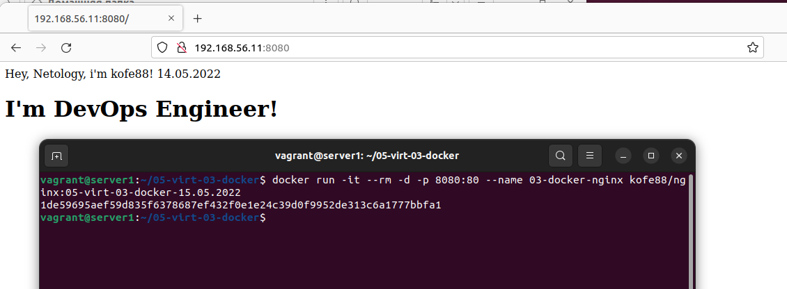
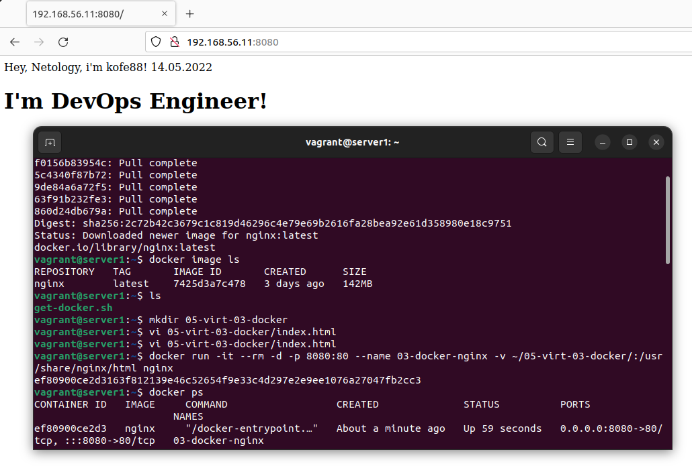
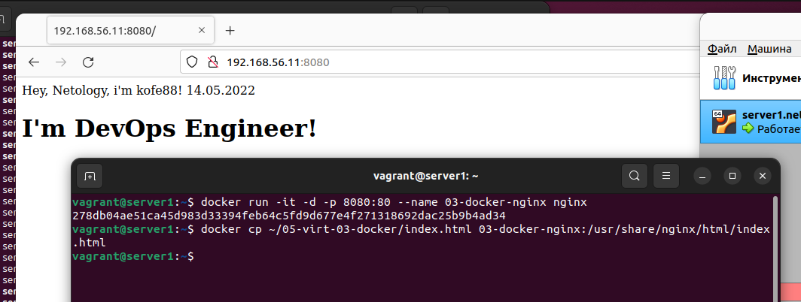
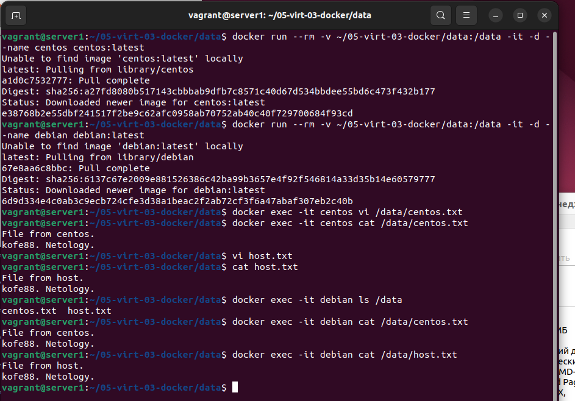

# Домашнее задание к занятию "5.3. Введение. Экосистема. Архитектура. Жизненный цикл Docker контейнера"

## Как сдавать задания

Обязательными к выполнению являются задачи без указания звездочки. Их выполнение необходимо для получения зачета и диплома о профессиональной переподготовке.

Задачи со звездочкой (*) являются дополнительными задачами и/или задачами повышенной сложности. Они не являются обязательными к выполнению, но помогут вам глубже понять тему.

Домашнее задание выполните в файле readme.md в github репозитории. В личном кабинете отправьте на проверку ссылку на .md-файл в вашем репозитории.

Любые вопросы по решению задач задавайте в чате учебной группы.

---

## Задача 1

Сценарий выполения задачи:

- создайте свой репозиторий на https://hub.docker.com;
- выберете любой образ, который содержит веб-сервер Nginx;
- создайте свой fork образа;
- реализуйте функциональность:
запуск веб-сервера в фоне с индекс-страницей, содержащей HTML-код ниже:
```
<html>
<head>
Hey, Netology
</head>
<body>
<h1>I’m DevOps Engineer!</h1>
</body>
</html>
```
Опубликуйте созданный форк в своем репозитории и предоставьте ответ в виде ссылки на https://hub.docker.com/username_repo.

---

Создадим директорию и файл

```bash
vagrant@server1:~$ mkdir 05-virt-03-docker
vagrant@server1:~$ vi 05-virt-03-docker/index.html
```

Содержание `index.html` следующее:

```html
<html>
<head>
Hey, Netology, i'm kofe88!
14.05.2022
</head>
<body>
<h1>I'm DevOps Engineer!</h1>
</body>
</html>
```

Вариант 1:

Создаем `Dockerfile` в директории `05-virt-03-docker` следующего содержания:

```bash
FROM nginx:latest
COPY ./index.html /usr/share/nginx/html/index.html
```
- Берем последний образ nginx
- копируем в него подготовленный файл `index.html`

Собираем образ:

```bash
vagrant@server1:~/05-virt-03-docker$ docker build -t kofe88/nginx:05-virt-03-docker-15.05.2022 .
Sending build context to Docker daemon  3.072kB
Step 1/2 : FROM nginx:latest
 ---> 7425d3a7c478
Step 2/2 : COPY ./index.html /usr/share/nginx/html/index.html
 ---> 158e2acadcab
Successfully built 158e2acadcab
Successfully tagged kofe88/nginx:05-virt-03-docker-15.05.2022
```

Запускаем и проверяем что всё работает:



Останавливаем контейнер и отправляем образ в `hub.docker.com`:

```bash
vagrant@server1:~/05-virt-03-docker$ docker stop 03-docker-nginx
03-docker-nginx
vagrant@server1:~/05-virt-03-docker$ docker image ls
REPOSITORY     TAG                            IMAGE ID       CREATED              SIZE
kofe88/nginx   05-virt-03-docker-15.05.2022   158e2acadcab   About a minute ago   142MB
kofe88/nginx   05-virt-03-docker-14.05.2022   aa39ce574b93   32 minutes ago       142MB
nginx          latest                         7425d3a7c478   3 days ago           142MB
vagrant@server1:~/05-virt-03-docker$ docker push kofe88/nginx:05-virt-03-docker-15.05.2022
The push refers to repository [docker.io/kofe88/nginx]
903d6f42142c: Pushed 
feb57d363211: Layer already exists 
98c84706d0f7: Layer already exists 
4311f0ea1a86: Layer already exists 
6d049f642241: Layer already exists 
3158f7304641: Layer already exists 
fd95118eade9: Layer already exists 
05-virt-03-docker-15.05.2022: digest: sha256:99bd8e48c5311b34cc54ba33f11e5ab01c66fdf510c2636c6f8147ccfec3546c size: 1777
```

Вариант 2:

Скачиваем последний образ nginx:

```bash
vagrant@server1:~$ docker pull nginx
Using default tag: latest
latest: Pulling from library/nginx
214ca5fb9032: Pull complete 
f0156b83954c: Pull complete 
5c4340f87b72: Pull complete 
9de84a6a72f5: Pull complete 
63f91b232fe3: Pull complete 
860d24db679a: Pull complete 
Digest: sha256:2c72b42c3679c1c819d46296c4e79e69b2616fa28bea92e61d358980e18c9751
Status: Downloaded newer image for nginx:latest
docker.io/library/nginx:latest
```

Проверяем что всё скачалось:

```bash
vagrant@server1:~$ docker image ls
REPOSITORY   TAG       IMAGE ID       CREATED      SIZE
nginx        latest    7425d3a7c478   3 days ago   142MB
```

Запускаем контейнер с монтированием папки с хоста с `index.html`:

```bash
vagrant@server1:~$ docker run -it --rm -d -p 8080:80 --name 03-docker-nginx -v ~/05-virt-03-docker/:/usr/share/nginx/html nginx
ef80900ce2d3163f812139e46c52654f9e33c4d297e2e9ee1076a27047fb2cc3
```
Проверяем что всё работает:



Для тестирования удобно запускать с параметром `--rm`, контейнер будет удаляться после остановки.
Останавливаем контейнер.

```bash
vagrant@server1:~$ docker ps
CONTAINER ID   IMAGE     COMMAND                  CREATED              STATUS          PORTS                                   NAMES
ef80900ce2d3   nginx     "/docker-entrypoint.\u2026"   About a minute ago   Up 59 seconds   0.0.0.0:8080->80/tcp, :::8080->80/tcp   03-docker-nginx
vagrant@server1:~$ docker stop 03-docker-nginx
03-docker-nginx
```

Теперь запускаем без параметра `--rm`

```bash
vagrant@server1:~$ docker run -it -d -p 8080:80 --name 03-docker-nginx nginx
278db04ae51ca45d983d33394feb64c5fd9d677e4f271318692dac25b9b4ad34
```

Копируем в контейнер файл `index.html` с хоста и проверяем что всё работает

```bash
vagrant@server1:~$ docker cp ~/05-virt-03-docker/index.html 03-docker-nginx:/usr/share/nginx/html/index.html
```



Сохраняем изменения в контейнере

```bash
vagrant@server1:~$ docker commit 03-docker-nginx
sha256:aa39ce574b93bbd1aeda5aee2393f8d0f87e5feb81764f542d28f81e5449f63f
```

Останавливаем контейнер и видим что у нас появился новый образ, но без имени репозитория и без тега.

```bash
vagrant@server1:~$ docker stop 03-docker-nginx
03-docker-nginx
vagrant@server1:~$ docker image ls
REPOSITORY   TAG       IMAGE ID       CREATED              SIZE
<none>       <none>    aa39ce574b93   About a minute ago   142MB
nginx        latest    7425d3a7c478   3 days ago           142MB
```

Назначим их:

```bash
vagrant@server1:~$ docker image tag aa39ce574b93 kofe88/nginx:05-virt-03-docker-14.05.2022
vagrant@server1:~$ docker image ls
REPOSITORY     TAG                            IMAGE ID       CREATED          SIZE
kofe88/nginx   05-virt-03-docker-14.05.2022   aa39ce574b93   11 minutes ago   142MB
nginx          latest  
```

Запушим образ в `hub.docker.com`:

```bash
vagrant@server1:~$ docker push kofe88/nginx:05-virt-03-docker-14.05.2022
The push refers to repository [docker.io/kofe88/nginx]
f9e7f3b39fc0: Pushed 
feb57d363211: Mounted from library/nginx 
98c84706d0f7: Mounted from library/nginx 
4311f0ea1a86: Mounted from library/nginx 
6d049f642241: Mounted from library/nginx 
3158f7304641: Mounted from library/nginx 
fd95118eade9: Mounted from library/nginx 
05-virt-03-docker-14.05.2022: digest: sha256:fc869ee29289270376ffa0a20e97574aed73076684d4c9c7857119135687e408 size: 1778
```

Ссылка на репозиторий с образами:

[https://hub.docker.com/r/kofe88/nginx/tags](https://hub.docker.com/r/kofe88/nginx/tags)


---

## Задача 2

Посмотрите на сценарий ниже и ответьте на вопрос:
"Подходит ли в этом сценарии использование Docker контейнеров или лучше подойдет виртуальная машина, физическая машина? Может быть возможны разные варианты?"

Детально опишите и обоснуйте свой выбор.

--

Сценарий:

- Высоконагруженное монолитное java веб-приложение;
- Nodejs веб-приложение;
- Мобильное приложение c версиями для Android и iOS;
- Шина данных на базе Apache Kafka;
- Elasticsearch кластер для реализации логирования продуктивного веб-приложения - три ноды elasticsearch, два logstash и две ноды kibana;
- Мониторинг-стек на базе Prometheus и Grafana;
- MongoDB, как основное хранилище данных для java-приложения;
- Gitlab сервер для реализации CI/CD процессов и приватный (закрытый) Docker Registry.

---

>Высоконагруженное монолитное java веб-приложение;

Думаю что раз высоконагруженное, лучше физический сервер, с доступом к ресурсам без посредников.

>Nodejs веб-приложение;

Докер без проблем должен подойти, можно бысто разворачивать, 

>Мобильное приложение c версиями для Android и iOS;

Для Android docker должен подойти, для ios встречал мнение что лучше ВМ.

>Шина данных на базе Apache Kafka;

Тоже не нашел каких либо существенных ограничений, для использования Докера. Нашел интересную статью с кластеризацией https://dotsandbrackets.com/highly-available-kafka-cluster-docker-ru/

>Elasticsearch кластер для реализации логирования продуктивного веб-приложения - три ноды elasticsearch, два logstash и две ноды kibana;

Ядумаю что вполне подойдет, есть статьи на эту тему. Так же официальные образы в Докерхаб.

https://elk-docker.readthedocs.io/

https://quoeamaster.medium.com/deploying-elasticsearch-and-kibana-with-docker-86a4ac78d851

>Мониторинг-стек на базе Prometheus и Grafana;

Подойдет, т.к. они по сути данные не хранят и это веб-приложения. Можно быстро развернуть.

>MongoDB, как основное хранилище данных для java-приложения;

Так же не нашел противопоказаний для использования в Докер

https://www.mongodb.com/compatibility/docker

>Gitlab сервер для реализации CI/CD процессов и приватный (закрытый) Docker Registry.

Я думаю что тоже без проблем можно использовать Докер, только решить проблемы с почтовым агентом.

https://docs.gitlab.com/ee/install/docker.html

---

## Задача 3

- Запустите первый контейнер из образа ***centos*** c любым тэгом в фоновом режиме, подключив папку ```/data``` из текущей рабочей директории на хостовой машине в ```/data``` контейнера;
- Запустите второй контейнер из образа ***debian*** в фоновом режиме, подключив папку ```/data``` из текущей рабочей директории на хостовой машине в ```/data``` контейнера;
- Подключитесь к первому контейнеру с помощью ```docker exec``` и создайте текстовый файл любого содержания в ```/data```;
- Добавьте еще один файл в папку ```/data``` на хостовой машине;
- Подключитесь во второй контейнер и отобразите листинг и содержание файлов в ```/data``` контейнера.

---

> - Запустите первый контейнер из образа ***centos*** c любым тэгом в фоновом режиме, подключив папку ```/data``` из текущей рабочей директории на хостовой машине в ```/data``` контейнера;

```bash
vagrant@server1:~/05-virt-03-docker/data$ docker run --rm -v ~/05-virt-03-docker/data:/data -it -d --name centos centos:latest
Unable to find image 'centos:latest' locally
latest: Pulling from library/centos
a1d0c7532777: Pull complete 
Digest: sha256:a27fd8080b517143cbbbab9dfb7c8571c40d67d534bbdee55bd6c473f432b177
Status: Downloaded newer image for centos:latest
e38768b2e55dbf241517f2be9c62afc0958ab70752ab40c40f729700684f93cd
```
> - Запустите второй контейнер из образа ***debian*** в фоновом режиме, подключив папку ```/data``` из текущей рабочей директории на хостовой машине в ```/data``` контейнера;
```bash
vagrant@server1:~/05-virt-03-docker/data$ docker run --rm -v ~/05-virt-03-docker/data:/data -it -d --name debian debian:latest
Unable to find image 'debian:latest' locally
latest: Pulling from library/debian
67e8aa6c8bbc: Pull complete 
Digest: sha256:6137c67e2009e881526386c42ba99b3657e4f92f546814a33d35b14e60579777
Status: Downloaded newer image for debian:latest
6d9d334e4c0ab3c9ecb724cfe3d38a1beac2f2ab72cf3f6a47abaf307eb2c40b
```

>- Подключитесь к первому контейнеру с помощью ```docker exec``` и создайте текстовый файл любого содержания в ```/data```;

```bash
vagrant@server1:~/05-virt-03-docker/data$ docker exec -it centos vi /data/centos.txt
vagrant@server1:~/05-virt-03-docker/data$ docker exec -it centos cat /data/centos.txt
File from centos.
kofe88. Netology.
```

>- Добавьте еще один файл в папку ```/data``` на хостовой машине;

```bash
vagrant@server1:~/05-virt-03-docker/data$ vi host.txt
vagrant@server1:~/05-virt-03-docker/data$ cat host.txt 
File from host.
kofe88. Netology.
```

>- Подключитесь во второй контейнер и отобразите листинг и содержание файлов в ```/data``` контейнера.

```bash
vagrant@server1:~/05-virt-03-docker/data$ docker exec -it debian ls /data
centos.txt  host.txt
vagrant@server1:~/05-virt-03-docker/data$ docker exec -it debian cat /data/centos.txt
File from centos.
kofe88. Netology.
vagrant@server1:~/05-virt-03-docker/data$ docker exec -it debian cat /data/host.txt
File from host.
kofe88. Netology.

```



---

## Задача 4 (*)

Воспроизвести практическую часть лекции самостоятельно.

Соберите Docker образ с Ansible, загрузите на Docker Hub и пришлите ссылку вместе с остальными ответами к задачам.

---

Используем [Dockerfile](scripts/lab_4/Dockerfile) следующего содержания:

```bash
FROM alpine:3.14

RUN CARGO_NET_GIT_FETCH_WITH_CLI=1 && \
    apk --no-cache add \
        sudo \
        python3\
        py3-pip \
        openssl \
        ca-certificates \
        sshpass \
        openssh-client \
        rsync \
        git && \
    apk --no-cache add --virtual build-dependencies \
        python3-dev \
        libffi-dev \
        musl-dev \
        gcc \
        cargo \
        openssl-dev \
        libressl-dev \
        build-base && \
    pip install --upgrade pip wheel && \
    pip install --upgrade cryptography cffi && \
    pip uninstall ansible-base && \
    pip install ansible-core && \
    pip install ansible==2.10.0 && \
    pip install mitogen ansible-lint jmespath && \
    pip install --upgrade pywinrm && \
    apk del build-dependencies && \
    rm -rf /var/cache/apk/* && \
    rm -rf /root/.cache/pip && \
    rm -rf /root/.cargo

RUN mkdir /ansible && \
    mkdir -p /etc/ansible && \
    echo 'localhost' > /etc/ansible/hosts

WORKDIR /ansible

CMD [ "ansible-playbook", "--version" ]

```

Собираем образ:

```bash
vagrant@server1:~/05-virt-03-docker/build/Ansible$ docker build -t kofe88/ansible:2.10.0 .
Sending build context to Docker daemon  3.072kB
Step 1/5 : FROM alpine:3.14
3.14: Pulling from library/alpine
8663204ce13b: Pull complete 
Digest: sha256:06b5d462c92fc39303e6363c65e074559f8d6b1363250027ed5053557e3398c5
Status: Downloaded newer image for alpine:3.14
 ---> e04c818066af
Step 2/5 : RUN CARGO_NET_GIT_FETCH_WITH_CLI=1 &&     apk --no-cache add         sudo         python3        py3-pip         openssl         ca-certificates         sshpass         openssh-client         rsync         git &&     apk --no-cache add --virtual build-dependencies         python3-dev         libffi-dev         musl-dev         gcc         cargo         openssl-dev         libressl-dev         build-base &&     pip install --upgrade pip wheel &&     pip install --upgrade cryptography cffi &&     pip uninstall ansible-base &&     pip install ansible-core &&     pip install ansible==2.10.0 &&     pip install mitogen ansible-lint jmespath &&     pip install --upgrade pywinrm &&     apk del build-dependencies &&     rm -rf /var/cache/apk/* &&     rm -rf /root/.cache/pip &&     rm -rf /root/.cargo
 ---> Running in 951c56959faf
Removing intermediate container 951c56959faf
 ---> b750f2bc33a2
Step 3/5 : RUN mkdir /ansible &&     mkdir -p /etc/ansible &&     echo 'localhost' > /etc/ansible/hosts
 ---> Running in 1b6811b573ad
Removing intermediate container 1b6811b573ad
 ---> 74d796393f61
Step 4/5 : WORKDIR /ansible
 ---> Running in 49bb72d688e5
Removing intermediate container 49bb72d688e5
 ---> 4355865219df
Step 5/5 : CMD [ "ansible-playbook", "--version" ]
 ---> Running in 4ace67ff2cad
Removing intermediate container 4ace67ff2cad
 ---> 75c3002b8b59
Successfully built 75c3002b8b59
Successfully tagged kofe88/ansible:2.10.0 
```
<details>
  <summary>Полный лог</summary>

  ```bash
vagrant@server1:~/05-virt-03-docker/build/Ansible$ docker build -t kofe88/ansible:2.10.0 .
Sending build context to Docker daemon  3.072kB
Step 1/5 : FROM alpine:3.14
3.14: Pulling from library/alpine
8663204ce13b: Pull complete 
Digest: sha256:06b5d462c92fc39303e6363c65e074559f8d6b1363250027ed5053557e3398c5
Status: Downloaded newer image for alpine:3.14
 ---> e04c818066af
Step 2/5 : RUN CARGO_NET_GIT_FETCH_WITH_CLI=1 &&     apk --no-cache add         sudo         python3        py3-pip         openssl         ca-certificates         sshpass         openssh-client         rsync         git &&     apk --no-cache add --virtual build-dependencies         python3-dev         libffi-dev         musl-dev         gcc         cargo         openssl-dev         libressl-dev         build-base &&     pip install --upgrade pip wheel &&     pip install --upgrade cryptography cffi &&     pip uninstall ansible-base &&     pip install ansible-core &&     pip install ansible==2.10.0 &&     pip install mitogen ansible-lint jmespath &&     pip install --upgrade pywinrm &&     apk del build-dependencies &&     rm -rf /var/cache/apk/* &&     rm -rf /root/.cache/pip &&     rm -rf /root/.cargo
 ---> Running in 951c56959faf
fetch https://dl-cdn.alpinelinux.org/alpine/v3.14/main/x86_64/APKINDEX.tar.gz
fetch https://dl-cdn.alpinelinux.org/alpine/v3.14/community/x86_64/APKINDEX.tar.gz
(1/55) Installing ca-certificates (20211220-r0)
(2/55) Installing brotli-libs (1.0.9-r5)
(3/55) Installing nghttp2-libs (1.43.0-r0)
(4/55) Installing libcurl (7.79.1-r1)
(5/55) Installing expat (2.4.7-r0)
(6/55) Installing pcre2 (10.36-r0)
(7/55) Installing git (2.32.1-r0)
(8/55) Installing openssh-keygen (8.6_p1-r3)
(9/55) Installing ncurses-terminfo-base (6.2_p20210612-r0)
(10/55) Installing ncurses-libs (6.2_p20210612-r0)
(11/55) Installing libedit (20210216.3.1-r0)
(12/55) Installing openssh-client-common (8.6_p1-r3)
(13/55) Installing openssh-client-default (8.6_p1-r3)
(14/55) Installing openssl (1.1.1o-r0)
(15/55) Installing libbz2 (1.0.8-r1)
(16/55) Installing libffi (3.3-r2)
(17/55) Installing gdbm (1.19-r0)
(18/55) Installing xz-libs (5.2.5-r1)
(19/55) Installing libgcc (10.3.1_git20210424-r2)
(20/55) Installing libstdc++ (10.3.1_git20210424-r2)
(21/55) Installing mpdecimal (2.5.1-r1)
(22/55) Installing readline (8.1.0-r0)
(23/55) Installing sqlite-libs (3.35.5-r0)
(24/55) Installing python3 (3.9.5-r2)
(25/55) Installing py3-appdirs (1.4.4-r2)
(26/55) Installing py3-chardet (4.0.0-r2)
(27/55) Installing py3-idna (3.2-r0)
(28/55) Installing py3-urllib3 (1.26.5-r0)
(29/55) Installing py3-certifi (2020.12.5-r1)
(30/55) Installing py3-requests (2.25.1-r4)
(31/55) Installing py3-msgpack (1.0.2-r1)
(32/55) Installing py3-lockfile (0.12.2-r4)
(33/55) Installing py3-cachecontrol (0.12.6-r1)
(34/55) Installing py3-colorama (0.4.4-r1)
(35/55) Installing py3-contextlib2 (0.6.0-r1)
(36/55) Installing py3-distlib (0.3.1-r3)
(37/55) Installing py3-distro (1.5.0-r3)
(38/55) Installing py3-six (1.15.0-r1)
(39/55) Installing py3-webencodings (0.5.1-r4)
(40/55) Installing py3-html5lib (1.1-r1)
(41/55) Installing py3-parsing (2.4.7-r2)
(42/55) Installing py3-packaging (20.9-r1)
(43/55) Installing py3-toml (0.10.2-r2)
(44/55) Installing py3-pep517 (0.10.0-r2)
(45/55) Installing py3-progress (1.5-r2)
(46/55) Installing py3-retrying (1.3.3-r1)
(47/55) Installing py3-ordered-set (4.0.2-r1)
(48/55) Installing py3-setuptools (52.0.0-r3)
(49/55) Installing py3-pip (20.3.4-r1)
(50/55) Installing libacl (2.2.53-r0)
(51/55) Installing popt (1.18-r0)
(52/55) Installing zstd-libs (1.4.9-r1)
(53/55) Installing rsync (3.2.3-r4)
(54/55) Installing sshpass (1.09-r0)
(55/55) Installing sudo (1.9.7_p1-r1)
Executing busybox-1.33.1-r7.trigger
Executing ca-certificates-20211220-r0.trigger
OK: 98 MiB in 69 packages
fetch https://dl-cdn.alpinelinux.org/alpine/v3.14/main/x86_64/APKINDEX.tar.gz
fetch https://dl-cdn.alpinelinux.org/alpine/v3.14/community/x86_64/APKINDEX.tar.gz
(1/39) Upgrading libcrypto1.1 (1.1.1n-r0 -> 1.1.1o-r0)
(2/39) Upgrading libssl1.1 (1.1.1n-r0 -> 1.1.1o-r0)
(3/39) Installing pkgconf (1.7.4-r0)
(4/39) Installing python3-dev (3.9.5-r2)
(5/39) Installing linux-headers (5.10.41-r0)
(6/39) Installing libffi-dev (3.3-r2)
(7/39) Installing musl-dev (1.2.2-r3)
(8/39) Installing binutils (2.35.2-r2)
(9/39) Installing libgomp (10.3.1_git20210424-r2)
(10/39) Installing libatomic (10.3.1_git20210424-r2)
(11/39) Installing libgphobos (10.3.1_git20210424-r2)
(12/39) Installing gmp (6.2.1-r1)
(13/39) Installing isl22 (0.22-r0)
(14/39) Installing mpfr4 (4.1.0-r0)
(15/39) Installing mpc1 (1.2.1-r0)
(16/39) Installing gcc (10.3.1_git20210424-r2)
(17/39) Installing rust-stdlib (1.52.1-r1)
(18/39) Installing libxml2 (2.9.14-r0)
(19/39) Installing llvm11-libs (11.1.0-r2)
(20/39) Installing http-parser (2.9.4-r0)
(21/39) Installing pcre (8.44-r0)
(22/39) Installing libssh2 (1.9.0-r1)
(23/39) Installing libgit2 (1.1.0-r2)
(24/39) Installing rust (1.52.1-r1)
(25/39) Installing cargo (1.52.1-r1)
(26/39) Installing openssl-dev (1.1.1o-r0)
(27/39) Installing libressl3.3-libcrypto (3.3.6-r0)
(28/39) Installing libressl3.3-libssl (3.3.6-r0)
(29/39) Installing libressl3.3-libtls (3.3.6-r0)
(30/39) Installing libressl-dev (3.3.6-r0)
(31/39) Installing libmagic (5.40-r1)
(32/39) Installing file (5.40-r1)
(33/39) Installing libc-dev (0.7.2-r3)
(34/39) Installing g++ (10.3.1_git20210424-r2)
(35/39) Installing make (4.3-r0)
(36/39) Installing fortify-headers (1.1-r1)
(37/39) Installing patch (2.7.6-r7)
(38/39) Installing build-base (0.5-r2)
(39/39) Installing build-dependencies (20220514.231500)
Executing busybox-1.33.1-r7.trigger
Executing ca-certificates-20211220-r0.trigger
OK: 1110 MiB in 106 packages
Requirement already satisfied: pip in /usr/lib/python3.9/site-packages (20.3.4)
Collecting pip
  Downloading pip-22.1-py3-none-any.whl (2.1 MB)
Collecting wheel
  WARNING: Retrying (Retry(total=4, connect=None, read=None, redirect=None, status=None)) after connection broken by 'ReadTimeoutError("HTTPSConnectionPool(host='files.pythonhosted.org', port=443): Read timed out. (read timeout=15)")': /packages/27/d6/003e593296a85fd6ed616ed962795b2f87709c3eee2bca4f6d0fe55c6d00/wheel-0.37.1-py2.py3-none-any.whl
  Downloading wheel-0.37.1-py2.py3-none-any.whl (35 kB)
Installing collected packages: wheel, pip
  Attempting uninstall: pip
    Found existing installation: pip 20.3.4
    Uninstalling pip-20.3.4:
      Successfully uninstalled pip-20.3.4
Successfully installed pip-22.1 wheel-0.37.1
Collecting cryptography
  Downloading cryptography-37.0.2-cp36-abi3-musllinux_1_1_x86_64.whl (4.2 MB)
     \u2501\u2501\u2501\u2501\u2501\u2501\u2501\u2501\u2501\u2501\u2501\u2501\u2501\u2501\u2501\u2501\u2501\u2501\u2501\u2501\u2501\u2501\u2501\u2501\u2501\u2501\u2501\u2501\u2501\u2501\u2501\u2501\u2501\u2501\u2501\u2501\u2501\u2501\u2501\u2501 4.2/4.2 MB ? eta 0:00:00
Collecting cffi
  Downloading cffi-1.15.0.tar.gz (484 kB)
     \u2501\u2501\u2501\u2501\u2501\u2501\u2501\u2501\u2501\u2501\u2501\u2501\u2501\u2501\u2501\u2501\u2501\u2501\u2501\u2501\u2501\u2501\u2501\u2501\u2501\u2501\u2501\u2501\u2501\u2501\u2501\u2501\u2501\u2501\u2501\u2501\u2501\u2501\u2501\u2501 484.1/484.1 kB ? eta 0:00:00
  Preparing metadata (setup.py): started
  Preparing metadata (setup.py): finished with status 'done'
Collecting pycparser
  Downloading pycparser-2.21-py2.py3-none-any.whl (118 kB)
     \u2501\u2501\u2501\u2501\u2501\u2501\u2501\u2501\u2501\u2501\u2501\u2501\u2501\u2501\u2501\u2501\u2501\u2501\u2501\u2501\u2501\u2501\u2501\u2501\u2501\u2501\u2501\u2501\u2501\u2501\u2501\u2501\u2501\u2501\u2501\u2501\u2501 118.7/118.7 kB 374.6 kB/s eta 0:00:00
Building wheels for collected packages: cffi
  Building wheel for cffi (setup.py): started
  Building wheel for cffi (setup.py): finished with status 'done'
  Created wheel for cffi: filename=cffi-1.15.0-cp39-cp39-linux_x86_64.whl size=429211 sha256=7c4ecfe8ca3cbd18389026c91ab72e52901db594e67c2c42a2a99ce9ae9fee87
  Stored in directory: /root/.cache/pip/wheels/8e/0d/16/77c97b85a9f559c5412c85c129a2bae07c771d31e1beb03c40
Successfully built cffi
Installing collected packages: pycparser, cffi, cryptography
Successfully installed cffi-1.15.0 cryptography-37.0.2 pycparser-2.21
WARNING: Running pip as the 'root' user can result in broken permissions and conflicting behaviour with the system package manager. It is recommended to use a virtual environment instead: https://pip.pypa.io/warnings/venv
WARNING: Skipping ansible-base as it is not installed.
WARNING: Running pip as the 'root' user can result in broken permissions and conflicting behaviour with the system package manager. It is recommended to use a virtual environment instead: https://pip.pypa.io/warnings/venv
Collecting ansible-core
  Downloading ansible-core-2.12.5.tar.gz (7.8 MB)
     \u2501\u2501\u2501\u2501\u2501\u2501\u2501\u2501\u2501\u2501\u2501\u2501\u2501\u2501\u2501\u2501\u2501\u2501\u2501\u2501\u2501\u2501\u2501\u2501\u2501\u2501\u2501\u2501\u2501\u2501\u2501\u2501\u2501\u2501\u2501\u2501\u2501\u2501\u2501\u2501 7.8/7.8 MB 1.9 MB/s eta 0:00:00
  Preparing metadata (setup.py): started
  Preparing metadata (setup.py): finished with status 'done'
Collecting jinja2
  Downloading Jinja2-3.1.2-py3-none-any.whl (133 kB)
     \u2501\u2501\u2501\u2501\u2501\u2501\u2501\u2501\u2501\u2501\u2501\u2501\u2501\u2501\u2501\u2501\u2501\u2501\u2501\u2501\u2501\u2501\u2501\u2501\u2501\u2501\u2501\u2501\u2501\u2501\u2501\u2501\u2501\u2501\u2501\u2501\u2501 133.1/133.1 kB 274.2 kB/s eta 0:00:00
Collecting PyYAML
  Downloading PyYAML-6.0.tar.gz (124 kB)
     \u2501\u2501\u2501\u2501\u2501\u2501\u2501\u2501\u2501\u2501\u2501\u2501\u2501\u2501\u2501\u2501\u2501\u2501\u2501\u2501\u2501\u2501\u2501\u2501\u2501\u2501\u2501\u2501\u2501\u2501\u2501\u2501\u2501\u2501\u2501\u2501\u2501 125.0/125.0 kB 555.3 kB/s eta 0:00:00
  Installing build dependencies: started
  Installing build dependencies: still running...
  Installing build dependencies: still running...
  Installing build dependencies: finished with status 'done'
  Getting requirements to build wheel: started
  Getting requirements to build wheel: finished with status 'done'
  Preparing metadata (pyproject.toml): started
  Preparing metadata (pyproject.toml): finished with status 'done'
Requirement already satisfied: cryptography in /usr/lib/python3.9/site-packages (from ansible-core) (37.0.2)
Requirement already satisfied: packaging in /usr/lib/python3.9/site-packages (from ansible-core) (20.9)
Collecting resolvelib<0.6.0,>=0.5.3
  Downloading resolvelib-0.5.4-py2.py3-none-any.whl (12 kB)
Requirement already satisfied: cffi>=1.12 in /usr/lib/python3.9/site-packages (from cryptography->ansible-core) (1.15.0)
Collecting MarkupSafe>=2.0
  Downloading MarkupSafe-2.1.1-cp39-cp39-musllinux_1_1_x86_64.whl (29 kB)
Requirement already satisfied: pycparser in /usr/lib/python3.9/site-packages (from cffi>=1.12->cryptography->ansible-core) (2.21)
Building wheels for collected packages: ansible-core, PyYAML
  Building wheel for ansible-core (setup.py): started
  Building wheel for ansible-core (setup.py): finished with status 'done'
  Created wheel for ansible-core: filename=ansible_core-2.12.5-py3-none-any.whl size=2077341 sha256=89c7b692d354f472bf4ee36bfb0b5f2ea9d0367d4f7e2b7913cb93d82ecca61f
  Stored in directory: /root/.cache/pip/wheels/71/58/11/d1c39b2da46896b5a93a4f19c0a777ce0523df6c24b5755e67
  Building wheel for PyYAML (pyproject.toml): started
  Building wheel for PyYAML (pyproject.toml): finished with status 'done'
  Created wheel for PyYAML: filename=PyYAML-6.0-cp39-cp39-linux_x86_64.whl size=45331 sha256=7403a9eb2b7912f78616eca4e0cd0cef4fa18fc54cf771dedab985c6c5464eee
  Stored in directory: /root/.cache/pip/wheels/b4/0f/9a/d6af48581dda678920fccfb734f5d9f827c6ed5b4074c7eda8
Successfully built ansible-core PyYAML
Installing collected packages: resolvelib, PyYAML, MarkupSafe, jinja2, ansible-core
Successfully installed MarkupSafe-2.1.1 PyYAML-6.0 ansible-core-2.12.5 jinja2-3.1.2 resolvelib-0.5.4
WARNING: Running pip as the 'root' user can result in broken permissions and conflicting behaviour with the system package manager. It is recommended to use a virtual environment instead: https://pip.pypa.io/warnings/venv
Collecting ansible==2.10.0
  Downloading ansible-2.10.0.tar.gz (25.5 MB)
     \u2501\u2501\u2501\u2501\u2501\u2501\u2501\u2501\u2501\u2501\u2501\u2501\u2501\u2501\u2501\u2501\u2501\u2501\u2501\u2501\u2501\u2501\u2501\u2501\u2501\u2501\u2501\u2501\u2501\u2501\u2501\u2501\u2501\u2501\u2501\u2501\u2501\u2501\u2501 25.5/25.5 MB 470.9 kB/s eta 0:00:00
  Preparing metadata (setup.py): started
  Preparing metadata (setup.py): finished with status 'done'
Collecting ansible-base<2.11,>=2.10.1
  Downloading ansible-base-2.10.17.tar.gz (6.1 MB)
     \u2501\u2501\u2501\u2501\u2501\u2501\u2501\u2501\u2501\u2501\u2501\u2501\u2501\u2501\u2501\u2501\u2501\u2501\u2501\u2501\u2501\u2501\u2501\u2501\u2501\u2501\u2501\u2501\u2501\u2501\u2501\u2501\u2501\u2501\u2501\u2501\u2501\u2501\u2501\u2501 6.1/6.1 MB 220.0 kB/s eta 0:00:00
  Preparing metadata (setup.py): started
  Preparing metadata (setup.py): finished with status 'done'
Requirement already satisfied: jinja2 in /usr/lib/python3.9/site-packages (from ansible-base<2.11,>=2.10.1->ansible==2.10.0) (3.1.2)
Requirement already satisfied: PyYAML in /usr/lib/python3.9/site-packages (from ansible-base<2.11,>=2.10.1->ansible==2.10.0) (6.0)
Requirement already satisfied: cryptography in /usr/lib/python3.9/site-packages (from ansible-base<2.11,>=2.10.1->ansible==2.10.0) (37.0.2)
Requirement already satisfied: packaging in /usr/lib/python3.9/site-packages (from ansible-base<2.11,>=2.10.1->ansible==2.10.0) (20.9)
Requirement already satisfied: cffi>=1.12 in /usr/lib/python3.9/site-packages (from cryptography->ansible-base<2.11,>=2.10.1->ansible==2.10.0) (1.15.0)
Requirement already satisfied: MarkupSafe>=2.0 in /usr/lib/python3.9/site-packages (from jinja2->ansible-base<2.11,>=2.10.1->ansible==2.10.0) (2.1.1)
Requirement already satisfied: pycparser in /usr/lib/python3.9/site-packages (from cffi>=1.12->cryptography->ansible-base<2.11,>=2.10.1->ansible==2.10.0) (2.21)
Building wheels for collected packages: ansible, ansible-base
  Building wheel for ansible (setup.py): started
  Building wheel for ansible (setup.py): still running...
  Building wheel for ansible (setup.py): still running...
  Building wheel for ansible (setup.py): still running...
  Building wheel for ansible (setup.py): still running...
  Building wheel for ansible (setup.py): still running...
  Building wheel for ansible (setup.py): still running...
  Building wheel for ansible (setup.py): still running...
  Building wheel for ansible (setup.py): finished with status 'done'
  Created wheel for ansible: filename=ansible-2.10.0-py3-none-any.whl size=43068828 sha256=e5bfdb8565449b64ac672f3f8b7b3092315c9b376620df5b0e511cf23a2d28ea
  Stored in directory: /root/.cache/pip/wheels/5c/ab/85/c81eaaeaf7239a38ab4eceea7cec8d110618aee6887b2491d3
  Building wheel for ansible-base (setup.py): started
  Building wheel for ansible-base (setup.py): finished with status 'done'
  Created wheel for ansible-base: filename=ansible_base-2.10.17-py3-none-any.whl size=1880365 sha256=e365bd5cc8c7497c7482754f14d170f7906e31833a20e8bbcac568c50274b6f4
  Stored in directory: /root/.cache/pip/wheels/77/01/15/0d4b716065c1270fd0b9c28e5bd44d5fd907c43a85791747d7
Successfully built ansible ansible-base
Installing collected packages: ansible-base, ansible
Successfully installed ansible-2.10.0 ansible-base-2.10.17
WARNING: Running pip as the 'root' user can result in broken permissions and conflicting behaviour with the system package manager. It is recommended to use a virtual environment instead: https://pip.pypa.io/warnings/venv
Collecting mitogen
  Downloading mitogen-0.3.2-py2.py3-none-any.whl (288 kB)
     \u2501\u2501\u2501\u2501\u2501\u2501\u2501\u2501\u2501\u2501\u2501\u2501\u2501\u2501\u2501\u2501\u2501\u2501\u2501\u2501\u2501\u2501\u2501\u2501\u2501\u2501\u2501\u2501\u2501\u2501\u2501\u2501\u2501\u2501\u2501\u2501\u2501\u2501 289.0/289.0 kB 93.5 kB/s eta 0:00:00
Collecting ansible-lint
  Downloading ansible_lint-6.1.0-py3-none-any.whl (150 kB)
     \u2501\u2501\u2501\u2501\u2501\u2501\u2501\u2501\u2501\u2501\u2501\u2501\u2501\u2501\u2501\u2501\u2501\u2501\u2501\u2501\u2501\u2501\u2501\u2501\u2501\u2501\u2501\u2501\u2501\u2501\u2501\u2501\u2501\u2501\u2501\u2501\u2501\u2501 150.8/150.8 kB 35.6 kB/s eta 0:00:00
Collecting jmespath
  Downloading jmespath-1.0.0-py3-none-any.whl (23 kB)
Collecting wcmatch>=7.0
  Downloading wcmatch-8.3-py3-none-any.whl (42 kB)
     \u2501\u2501\u2501\u2501\u2501\u2501\u2501\u2501\u2501\u2501\u2501\u2501\u2501\u2501\u2501\u2501\u2501\u2501\u2501\u2501\u2501\u2501\u2501\u2501\u2501\u2501\u2501\u2501\u2501\u2501\u2501\u2501\u2501\u2501\u2501\u2501\u2501\u2501\u2501\u2501 42.9/42.9 kB 19.5 kB/s eta 0:00:00
Collecting yamllint>=1.25.0
  Downloading yamllint-1.26.3.tar.gz (126 kB)
     \u2501\u2501\u2501\u2501\u2501\u2501\u2501\u2501\u2501\u2501\u2501\u2501\u2501\u2501\u2501\u2501\u2501\u2501\u2501\u2501\u2501\u2501\u2501\u2501\u2501\u2501\u2501\u2501\u2501\u2501\u2501\u2501\u2501\u2501\u2501\u2501\u2501 126.7/126.7 kB 118.4 kB/s eta 0:00:00
  Preparing metadata (setup.py): started
  Preparing metadata (setup.py): finished with status 'done'
Requirement already satisfied: packaging in /usr/lib/python3.9/site-packages (from ansible-lint) (20.9)
Collecting pytest
  Downloading pytest-7.1.2-py3-none-any.whl (297 kB)
     \u2501\u2501\u2501\u2501\u2501\u2501\u2501\u2501\u2501\u2501\u2501\u2501\u2501\u2501\u2501\u2501\u2501\u2501\u2501\u2501\u2501\u2501\u2501\u2501\u2501\u2501\u2501\u2501\u2501\u2501\u2501\u2501\u2501\u2501\u2501\u2501\u2501\u2501 297.0/297.0 kB 31.6 kB/s eta 0:00:00
Collecting rich>=9.5.1
  Downloading rich-12.4.1-py3-none-any.whl (231 kB)
     \u2501\u2501\u2501\u2501\u2501\u2501\u2501\u2501\u2501\u2501\u2501\u2501\u2501\u2501\u2501\u2501\u2501\u2501\u2501\u2501\u2501\u2501\u2501\u2501\u2501\u2501\u2501\u2501\u2501\u2501\u2501\u2501\u2501\u2501\u2501\u2501\u2501\u2501 231.8/231.8 kB 39.1 kB/s eta 0:00:00
Collecting ansible-compat>=2.0.2
  Downloading ansible_compat-2.0.3-py3-none-any.whl (16 kB)
Requirement already satisfied: pyyaml in /usr/lib/python3.9/site-packages (from ansible-lint) (6.0)
Collecting ruamel.yaml<0.18,>=0.15.34
  Downloading ruamel.yaml-0.17.21-py3-none-any.whl (109 kB)
     \u2501\u2501\u2501\u2501\u2501\u2501\u2501\u2501\u2501\u2501\u2501\u2501\u2501\u2501\u2501\u2501\u2501\u2501\u2501\u2501\u2501\u2501\u2501\u2501\u2501\u2501\u2501\u2501\u2501\u2501\u2501\u2501\u2501\u2501\u2501\u2501\u2501\u2501 109.5/109.5 kB 93.2 kB/s eta 0:00:00
Collecting enrich>=1.2.6
  Downloading enrich-1.2.7-py3-none-any.whl (8.7 kB)
Requirement already satisfied: ansible-core>=2.12.0 in /usr/lib/python3.9/site-packages (from ansible-lint) (2.12.5)
Collecting jsonschema>=4.5.1
  Downloading jsonschema-4.5.1-py3-none-any.whl (72 kB)
     \u2501\u2501\u2501\u2501\u2501\u2501\u2501\u2501\u2501\u2501\u2501\u2501\u2501\u2501\u2501\u2501\u2501\u2501\u2501\u2501\u2501\u2501\u2501\u2501\u2501\u2501\u2501\u2501\u2501\u2501\u2501\u2501\u2501\u2501\u2501\u2501\u2501\u2501\u2501\u2501 72.9/72.9 kB 27.5 kB/s eta 0:00:00
Collecting subprocess-tee>=0.3.5
  Downloading subprocess_tee-0.3.5-py3-none-any.whl (8.0 kB)
Requirement already satisfied: jinja2 in /usr/lib/python3.9/site-packages (from ansible-core>=2.12.0->ansible-lint) (3.1.2)
Requirement already satisfied: cryptography in /usr/lib/python3.9/site-packages (from ansible-core>=2.12.0->ansible-lint) (37.0.2)
Requirement already satisfied: resolvelib<0.6.0,>=0.5.3 in /usr/lib/python3.9/site-packages (from ansible-core>=2.12.0->ansible-lint) (0.5.4)
Collecting pyrsistent!=0.17.0,!=0.17.1,!=0.17.2,>=0.14.0
  Downloading pyrsistent-0.18.1.tar.gz (100 kB)
     \u2501\u2501\u2501\u2501\u2501\u2501\u2501\u2501\u2501\u2501\u2501\u2501\u2501\u2501\u2501\u2501\u2501\u2501\u2501\u2501\u2501\u2501\u2501\u2501\u2501\u2501\u2501\u2501\u2501\u2501\u2501\u2501\u2501\u2501\u2501\u2501\u2501\u2501 100.5/100.5 kB 20.4 kB/s eta 0:00:00
  Installing build dependencies: started
  Installing build dependencies: finished with status 'done'
  Getting requirements to build wheel: started
  Getting requirements to build wheel: finished with status 'done'
  Preparing metadata (pyproject.toml): started
  Preparing metadata (pyproject.toml): finished with status 'done'
Collecting attrs>=17.4.0
  Downloading attrs-21.4.0-py2.py3-none-any.whl (60 kB)
     \u2501\u2501\u2501\u2501\u2501\u2501\u2501\u2501\u2501\u2501\u2501\u2501\u2501\u2501\u2501\u2501\u2501\u2501\u2501\u2501\u2501\u2501\u2501\u2501\u2501\u2501\u2501\u2501\u2501\u2501\u2501\u2501\u2501\u2501\u2501\u2501\u2501\u2501\u2501\u2501 60.6/60.6 kB 41.8 kB/s eta 0:00:00
Collecting pygments<3.0.0,>=2.6.0
  Downloading Pygments-2.12.0-py3-none-any.whl (1.1 MB)
     \u2501\u2501\u2501\u2501\u2501\u2501\u2501\u2501\u2501\u2501\u2501\u2501\u2501\u2501\u2501\u2501\u2501\u2501\u2501\u2501\u2501\u2501\u2501\u2501\u2501\u2501\u2501\u2501\u2501\u2501\u2501\u2501\u2501\u2501\u2501\u2501\u2501\u2501\u2501\u2501 1.1/1.1 MB 333.4 kB/s eta 0:00:00
Collecting commonmark<0.10.0,>=0.9.0
  Downloading commonmark-0.9.1-py2.py3-none-any.whl (51 kB)
     \u2501\u2501\u2501\u2501\u2501\u2501\u2501\u2501\u2501\u2501\u2501\u2501\u2501\u2501\u2501\u2501\u2501\u2501\u2501\u2501\u2501\u2501\u2501\u2501\u2501\u2501\u2501\u2501\u2501\u2501\u2501\u2501\u2501\u2501\u2501\u2501\u2501\u2501\u2501\u2501 51.1/51.1 kB 8.7 kB/s eta 0:00:00
Collecting ruamel.yaml.clib>=0.2.6
  Downloading ruamel.yaml.clib-0.2.6.tar.gz (180 kB)
     \u2501\u2501\u2501\u2501\u2501\u2501\u2501\u2501\u2501\u2501\u2501\u2501\u2501\u2501\u2501\u2501\u2501\u2501\u2501\u2501\u2501\u2501\u2501\u2501\u2501\u2501\u2501\u2501\u2501\u2501\u2501\u2501\u2501\u2501\u2501\u2501\u2501\u2501 180.7/180.7 kB 12.1 kB/s eta 0:00:00
  Preparing metadata (setup.py): started
  Preparing metadata (setup.py): finished with status 'done'
Collecting bracex>=2.1.1
  Downloading bracex-2.2.1-py3-none-any.whl (12 kB)
Collecting pathspec>=0.5.3
  Downloading pathspec-0.9.0-py2.py3-none-any.whl (31 kB)
Requirement already satisfied: setuptools in /usr/lib/python3.9/site-packages (from yamllint>=1.25.0->ansible-lint) (52.0.0)
Collecting tomli>=1.0.0
  Downloading tomli-2.0.1-py3-none-any.whl (12 kB)
Collecting py>=1.8.2
  Downloading py-1.11.0-py2.py3-none-any.whl (98 kB)
     \u2501\u2501\u2501\u2501\u2501\u2501\u2501\u2501\u2501\u2501\u2501\u2501\u2501\u2501\u2501\u2501\u2501\u2501\u2501\u2501\u2501\u2501\u2501\u2501\u2501\u2501\u2501\u2501\u2501\u2501\u2501\u2501\u2501\u2501\u2501\u2501\u2501\u2501\u2501 98.7/98.7 kB 441.7 kB/s eta 0:00:00
Collecting pluggy<2.0,>=0.12
  Downloading pluggy-1.0.0-py2.py3-none-any.whl (13 kB)
Collecting iniconfig
  Downloading iniconfig-1.1.1-py2.py3-none-any.whl (5.0 kB)
Requirement already satisfied: cffi>=1.12 in /usr/lib/python3.9/site-packages (from cryptography->ansible-core>=2.12.0->ansible-lint) (1.15.0)
Requirement already satisfied: MarkupSafe>=2.0 in /usr/lib/python3.9/site-packages (from jinja2->ansible-core>=2.12.0->ansible-lint) (2.1.1)
Requirement already satisfied: pycparser in /usr/lib/python3.9/site-packages (from cffi>=1.12->cryptography->ansible-core>=2.12.0->ansible-lint) (2.21)
Building wheels for collected packages: yamllint, pyrsistent, ruamel.yaml.clib
  Building wheel for yamllint (setup.py): started
  Building wheel for yamllint (setup.py): finished with status 'done'
  Created wheel for yamllint: filename=yamllint-1.26.3-py2.py3-none-any.whl size=60804 sha256=96bbe719a8efe4fc965c194351cc31c6ec33a364c2d56fa981783a3ab4c81fbe
  Stored in directory: /root/.cache/pip/wheels/ad/e7/53/f6ab69bd61ed0a887ee815302635448de42a0bc04035d5c1e9
  Building wheel for pyrsistent (pyproject.toml): started
  Building wheel for pyrsistent (pyproject.toml): finished with status 'done'
  Created wheel for pyrsistent: filename=pyrsistent-0.18.1-cp39-cp39-linux_x86_64.whl size=119794 sha256=44c9965a6cc25bec1007878dd3fb8302f1fda4828f0f658feeaaaf5e1528d7d9
  Stored in directory: /root/.cache/pip/wheels/87/fe/e6/fc8deeb581a41e462eafaf19fee96f51cdc8391e0be1c8088a
  Building wheel for ruamel.yaml.clib (setup.py): started
  Building wheel for ruamel.yaml.clib (setup.py): finished with status 'done'
  Created wheel for ruamel.yaml.clib: filename=ruamel.yaml.clib-0.2.6-cp39-cp39-linux_x86_64.whl size=746365 sha256=cce1dfb98f05a8c6d27422d8cd8d2113703b542675c6126a38607b74dbeeae21
  Stored in directory: /root/.cache/pip/wheels/b1/c4/5d/d96e5c09189f4d6d2a9ffb0d7af04ee06d11a20f613f5f3496
Successfully built yamllint pyrsistent ruamel.yaml.clib
Installing collected packages: iniconfig, commonmark, tomli, subprocess-tee, ruamel.yaml.clib, pyrsistent, pygments, py, pluggy, pathspec, mitogen, jmespath, bracex, attrs, yamllint, wcmatch, ruamel.yaml, rich, pytest, jsonschema, ansible-compat, enrich, ansible-lint
Successfully installed ansible-compat-2.0.3 ansible-lint-6.1.0 attrs-21.4.0 bracex-2.2.1 commonmark-0.9.1 enrich-1.2.7 iniconfig-1.1.1 jmespath-1.0.0 jsonschema-4.5.1 mitogen-0.3.2 pathspec-0.9.0 pluggy-1.0.0 py-1.11.0 pygments-2.12.0 pyrsistent-0.18.1 pytest-7.1.2 rich-12.4.1 ruamel.yaml-0.17.21 ruamel.yaml.clib-0.2.6 subprocess-tee-0.3.5 tomli-2.0.1 wcmatch-8.3 yamllint-1.26.3
WARNING: Running pip as the 'root' user can result in broken permissions and conflicting behaviour with the system package manager. It is recommended to use a virtual environment instead: https://pip.pypa.io/warnings/venv
Collecting pywinrm
  Downloading pywinrm-0.4.3-py2.py3-none-any.whl (44 kB)
     \u2501\u2501\u2501\u2501\u2501\u2501\u2501\u2501\u2501\u2501\u2501\u2501\u2501\u2501\u2501\u2501\u2501\u2501\u2501\u2501\u2501\u2501\u2501\u2501\u2501\u2501\u2501\u2501\u2501\u2501\u2501\u2501\u2501\u2501\u2501\u2501\u2501\u2501\u2501 44.1/44.1 kB 117.8 kB/s eta 0:00:00
Collecting requests-ntlm>=1.1.0
  Downloading requests_ntlm-1.1.0-py2.py3-none-any.whl (5.7 kB)
Collecting xmltodict
  Downloading xmltodict-0.13.0-py2.py3-none-any.whl (10.0 kB)
Requirement already satisfied: six in /usr/lib/python3.9/site-packages (from pywinrm) (1.15.0)
Requirement already satisfied: requests>=2.9.1 in /usr/lib/python3.9/site-packages (from pywinrm) (2.25.1)
Requirement already satisfied: chardet<5,>=3.0.2 in /usr/lib/python3.9/site-packages (from requests>=2.9.1->pywinrm) (4.0.0)
Requirement already satisfied: idna<3.3,>=2.5 in /usr/lib/python3.9/site-packages (from requests>=2.9.1->pywinrm) (3.2)
Requirement already satisfied: urllib3<1.27,>=1.21.1 in /usr/lib/python3.9/site-packages (from requests>=2.9.1->pywinrm) (1.26.5)
Requirement already satisfied: certifi>=2017.4.17 in /usr/lib/python3.9/site-packages (from requests>=2.9.1->pywinrm) (2020.12.5)
Collecting ntlm-auth>=1.0.2
  Downloading ntlm_auth-1.5.0-py2.py3-none-any.whl (29 kB)
Requirement already satisfied: cryptography>=1.3 in /usr/lib/python3.9/site-packages (from requests-ntlm>=1.1.0->pywinrm) (37.0.2)
Requirement already satisfied: cffi>=1.12 in /usr/lib/python3.9/site-packages (from cryptography>=1.3->requests-ntlm>=1.1.0->pywinrm) (1.15.0)
Requirement already satisfied: pycparser in /usr/lib/python3.9/site-packages (from cffi>=1.12->cryptography>=1.3->requests-ntlm>=1.1.0->pywinrm) (2.21)
Installing collected packages: xmltodict, ntlm-auth, requests-ntlm, pywinrm
Successfully installed ntlm-auth-1.5.0 pywinrm-0.4.3 requests-ntlm-1.1.0 xmltodict-0.13.0
WARNING: Running pip as the 'root' user can result in broken permissions and conflicting behaviour with the system package manager. It is recommended to use a virtual environment instead: https://pip.pypa.io/warnings/venv
WARNING: Ignoring https://dl-cdn.alpinelinux.org/alpine/v3.14/main: No such file or directory
WARNING: Ignoring https://dl-cdn.alpinelinux.org/alpine/v3.14/community: No such file or directory
(1/37) Purging build-dependencies (20220514.231500)
(2/37) Purging python3-dev (3.9.5-r2)
(3/37) Purging libffi-dev (3.3-r2)
(4/37) Purging linux-headers (5.10.41-r0)
(5/37) Purging cargo (1.52.1-r1)
(6/37) Purging rust (1.52.1-r1)
(7/37) Purging rust-stdlib (1.52.1-r1)
(8/37) Purging openssl-dev (1.1.1o-r0)
(9/37) Purging libressl-dev (3.3.6-r0)
(10/37) Purging libressl3.3-libssl (3.3.6-r0)
(11/37) Purging libressl3.3-libtls (3.3.6-r0)
(12/37) Purging build-base (0.5-r2)
(13/37) Purging file (5.40-r1)
(14/37) Purging g++ (10.3.1_git20210424-r2)
(15/37) Purging gcc (10.3.1_git20210424-r2)
(16/37) Purging binutils (2.35.2-r2)
(17/37) Purging libatomic (10.3.1_git20210424-r2)
(18/37) Purging libgomp (10.3.1_git20210424-r2)
(19/37) Purging libgphobos (10.3.1_git20210424-r2)
(20/37) Purging make (4.3-r0)
(21/37) Purging libc-dev (0.7.2-r3)
(22/37) Purging musl-dev (1.2.2-r3)
(23/37) Purging fortify-headers (1.1-r1)
(24/37) Purging patch (2.7.6-r7)
(25/37) Purging pkgconf (1.7.4-r0)
(26/37) Purging mpc1 (1.2.1-r0)
(27/37) Purging mpfr4 (4.1.0-r0)
(28/37) Purging isl22 (0.22-r0)
(29/37) Purging gmp (6.2.1-r1)
(30/37) Purging llvm11-libs (11.1.0-r2)
(31/37) Purging libxml2 (2.9.14-r0)
(32/37) Purging libgit2 (1.1.0-r2)
(33/37) Purging http-parser (2.9.4-r0)
(34/37) Purging pcre (8.44-r0)
(35/37) Purging libssh2 (1.9.0-r1)
(36/37) Purging libressl3.3-libcrypto (3.3.6-r0)
(37/37) Purging libmagic (5.40-r1)
Executing busybox-1.33.1-r7.trigger
OK: 98 MiB in 69 packages
Removing intermediate container 951c56959faf
 ---> b750f2bc33a2
Step 3/5 : RUN mkdir /ansible &&     mkdir -p /etc/ansible &&     echo 'localhost' > /etc/ansible/hosts
 ---> Running in 1b6811b573ad
Removing intermediate container 1b6811b573ad
 ---> 74d796393f61
Step 4/5 : WORKDIR /ansible
 ---> Running in 49bb72d688e5
Removing intermediate container 49bb72d688e5
 ---> 4355865219df
Step 5/5 : CMD [ "ansible-playbook", "--version" ]
 ---> Running in 4ace67ff2cad
Removing intermediate container 4ace67ff2cad
 ---> 75c3002b8b59
Successfully built 75c3002b8b59
Successfully tagged kofe88/ansible:2.10.0


  ```

</details>

Итог:

```bash
vagrant@server1:~/05-virt-03-docker/build/Ansible$ docker run --rm -it --name ansible kofe88/ansible:2.10.0
ansible-playbook 2.10.17
  config file = None
  configured module search path = ['/root/.ansible/plugins/modules', '/usr/share/ansible/plugins/modules']
  ansible python module location = /usr/lib/python3.9/site-packages/ansible
  executable location = /usr/bin/ansible-playbook
  python version = 3.9.5 (default, Nov 24 2021, 21:19:13) [GCC 10.3.1 20210424]
```

Загрузил образ

```bash
vagrant@server1:~/05-virt-03-docker/build/Ansible$ docker push kofe88/ansible:2.10.0
The push refers to repository [docker.io/kofe88/ansible]
278336a0104e: Pushed 
ec15dd1d3982: Pushed 
b541d28bf3b4: Mounted from library/alpine 
2.10.0: digest: sha256:8382a800456441721c8ab8dcc71b1fc22b857fd650d414c4941e054164a62fb8 size: 947

```

Ссылка на образ:

https://hub.docker.com/r/kofe88/ansible

---

### Как cдавать задание

Выполненное домашнее задание пришлите ссылкой на .md-файл в вашем репозитории.

---
