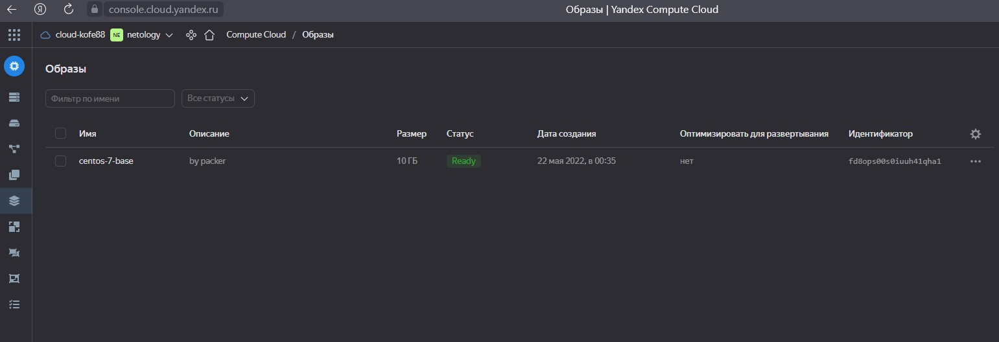
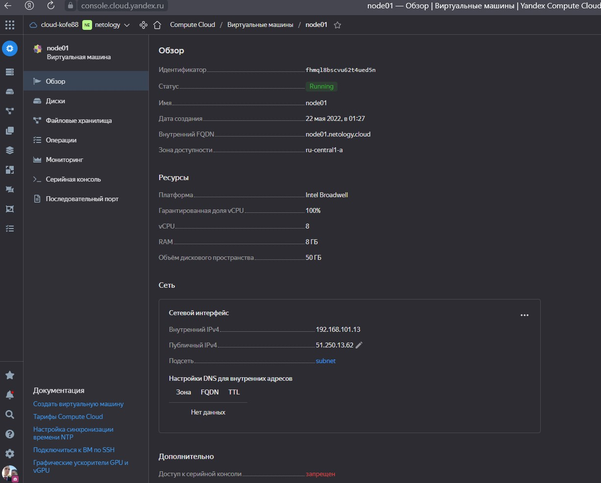
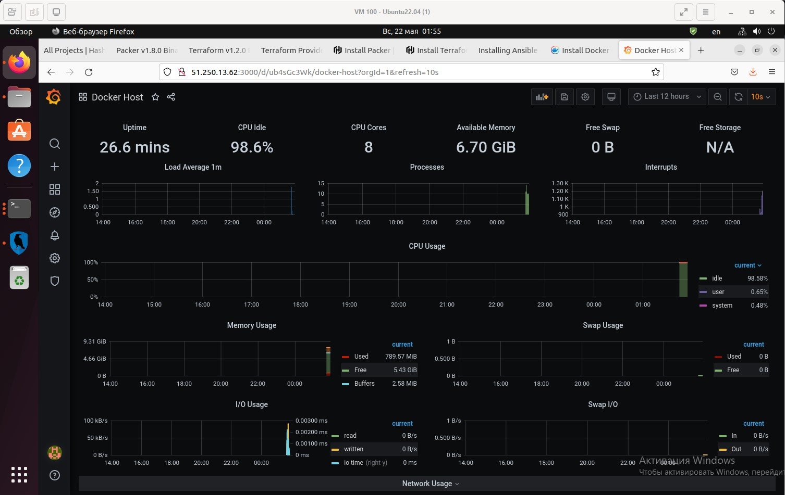
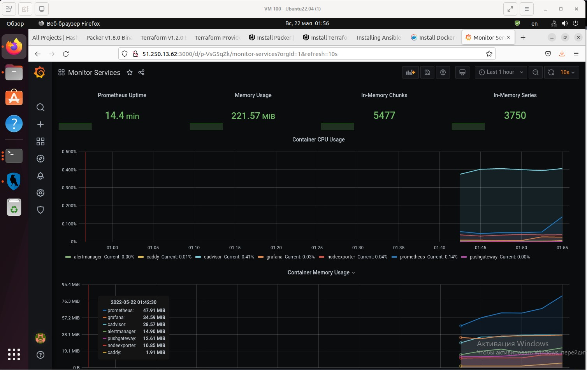
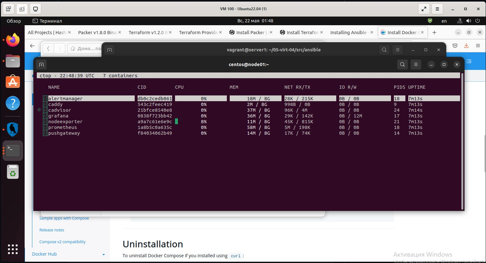

# Домашнее задание к занятию "5.4. Оркестрация группой Docker контейнеров на примере Docker Compose"

## Задача 1

Создать собственный образ операционной системы с помощью Packer.

Для получения зачета, вам необходимо предоставить:
- Скриншот страницы, как на слайде из презентации (слайд 37).

---

Скриншот со страницы с образом:



<details>
  <summary>Подробнее</summary>

Устанавливаем `Packer`:

```bash
vagrant@server1:~/05-virt-04/src/packer$ sudo curl -sSL https://storage.yandexcloud.net/yandexcloud-yc/install.sh | bash
Downloading yc 0.91.0
  % Total    % Received % Xferd  Average Speed   Time    Time     Time  Current
                                 Dload  Upload   Total   Spent    Left  Speed
100 86.5M  100 86.5M    0     0  9974k      0  0:00:08  0:00:08 --:--:--  9.9M
Yandex Cloud CLI 0.91.0 linux/amd64
To complete installation, start a new shell (exec -l $SHELL) or type 'source "/home/vagrant/.bashrc"' in the current one
vagrant@server1:~/05-virt-04/src/packer$ exec -l $SHELL
```

Устанавливаем интерфейс yc [https://cloud.yandex.ru/docs/cli/quickstart#install](https://cloud.yandex.ru/docs/cli/quickstart#install)

```bash
vagrant@server1:~/05-virt-04/src/packer$ sudo curl -sSL https://storage.yandexcloud.net/yandexcloud-yc/install.sh | bash

```

Получаем OAuth-токен в сервисе Яндекс.OAuth. 

Запускаем команду `yc init`, чтобы выполнить настройку профиля CLI.

По запросу команды введим свой OAuth токен.

```bash
vagrant@server1:~/05-virt-04/src/packer$ yc init
Welcome! This command will take you through the configuration process.
Please go to https://oauth.yandex.ru/authorize?response_type=token&client_id=1a6990aa636648e9b2ef855fa7bec2fb in order to obtain OAuth token.

Please enter OAuth token: <токен из предыдущего шага>
You have one cloud available: 'cloud-kofe88' (id = b1gg2ftubre1m9grd2id). It is going to be used by default.
Please choose folder to use:
 [1] netology (id = b1g7sa087ssu373i3ubo)
 [2] Create a new folder
Please enter your numeric choice: 1
Your current folder has been set to 'netology' (id = b1g7sa087ssu373i3ubo).
Do you want to configure a default Compute zone? [Y/n] Y
Which zone do you want to use as a profile default?
 [1] ru-central1-a
 [2] ru-central1-b
 [3] ru-central1-c
 [4] Don't set default zone
Please enter your numeric choice: 1
Your profile default Compute zone has been set to 'ru-central1-a'.
```

Для создания образа создадим сеть и подсеть в `YC`:

```bash
vagrant@server1:~/05-virt-04/src/packer$ yc vpc network create \
> --name net \
> --labels my-label=netology \
> --description "my first network via yc"
id: enp3debahp3nmahpr7qc
folder_id: b1g7sa087ssu373i3ubo
created_at: "2022-05-21T21:23:27Z"
name: net
description: my first network via yc
labels:
  my-label: netology
```

```bash
vagrant@server1:~/05-virt-04/src/packer$ yc vpc subnet create \
> --name my-subnet-a \
> --zone ru-central1-a \
> --range 10.1.2.0/24 \
> --network-name net \
> --description "my first subnet via yc"
id: e9bqdf7ps1j29rmafufa
folder_id: b1g7sa087ssu373i3ubo
created_at: "2022-05-21T21:26:03Z"
name: my-subnet-a
description: my first subnet via yc
network_id: enp3debahp3nmahpr7qc
zone_id: ru-central1-a
v4_cidr_blocks:
- 10.1.2.0/24
```

Внесем изменения в `centos-7-base.json`:

```bash
vagrant@server1:~/05-virt-04/src/packer$ nano centos-7-base.json 
```

Выполним валидацию конфига:

```bash
vagrant@server1:~/05-virt-04/src/packer$ packer validate centos-7-base.json 
The configuration is valid.
```

Соберем образ:

```bash
vagrant@server1:~/05-virt-04/src/packer$ packer build centos-7-base.json 
yandex: output will be in this color.

==> yandex: Creating temporary RSA SSH key for instance...
==> yandex: Using as source image: fd8rdcd74jho9ssh779e (name: "centos-7-v20220519", family: "centos-7")
==> yandex: Use provided subnet id e9bqdf7ps1j29rmafufa
==> yandex: Creating disk...
==> yandex: Creating instance...
==> yandex: Waiting for instance with id fhm00mgkrnc2k1dufngo to become active...
    yandex: Detected instance IP: 51.250.8.173
==> yandex: Using SSH communicator to connect: 51.250.8.173
==> yandex: Waiting for SSH to become available...
==> yandex: Connected to SSH!
==> yandex: Provisioning with shell script: /tmp/packer-shell1859607247
    yandex: Loaded plugins: fastestmirror
    yandex: Loading mirror speeds from cached hostfile
    yandex:  * base: mirror.docker.ru
    yandex:  * extras: mirrors.datahouse.ru
    yandex:  * updates: mirrors.datahouse.ru
    yandex: Resolving Dependencies
    yandex: --> Running transaction check
    yandex: ---> Package glibc.x86_64 0:2.17-325.el7_9 will be updated
    yandex: ---> Package glibc.x86_64 0:2.17-326.el7_9 will be an update
    yandex: ---> Package glibc-common.x86_64 0:2.17-325.el7_9 will be updated
    yandex: ---> Package glibc-common.x86_64 0:2.17-326.el7_9 will be an update
    yandex: ---> Package grub2.x86_64 1:2.02-0.87.el7.centos.7 will be updated
    yandex: ---> Package grub2.x86_64 1:2.02-0.87.0.1.el7.centos.9 will be an update
    yandex: ---> Package grub2-common.noarch 1:2.02-0.87.el7.centos.7 will be updated
    yandex: ---> Package grub2-common.noarch 1:2.02-0.87.0.1.el7.centos.9 will be an update
    yandex: ---> Package grub2-pc.x86_64 1:2.02-0.87.el7.centos.7 will be updated
    yandex: ---> Package grub2-pc.x86_64 1:2.02-0.87.0.1.el7.centos.9 will be an update
    yandex: ---> Package grub2-pc-modules.noarch 1:2.02-0.87.el7.centos.7 will be updated
    yandex: ---> Package grub2-pc-modules.noarch 1:2.02-0.87.0.1.el7.centos.9 will be an update
    yandex: ---> Package grub2-tools.x86_64 1:2.02-0.87.el7.centos.7 will be updated
    yandex: ---> Package grub2-tools.x86_64 1:2.02-0.87.0.1.el7.centos.9 will be an update
    yandex: ---> Package grub2-tools-extra.x86_64 1:2.02-0.87.el7.centos.7 will be updated
    yandex: ---> Package grub2-tools-extra.x86_64 1:2.02-0.87.0.1.el7.centos.9 will be an update
    yandex: ---> Package grub2-tools-minimal.x86_64 1:2.02-0.87.el7.centos.7 will be updated
    yandex: ---> Package grub2-tools-minimal.x86_64 1:2.02-0.87.0.1.el7.centos.9 will be an update
    yandex: ---> Package kernel.x86_64 0:3.10.0-1160.66.1.el7 will be installed
    yandex: ---> Package kernel-tools.x86_64 0:3.10.0-1160.62.1.el7 will be updated
    yandex: ---> Package kernel-tools.x86_64 0:3.10.0-1160.66.1.el7 will be an update
    yandex: ---> Package kernel-tools-libs.x86_64 0:3.10.0-1160.62.1.el7 will be updated
    yandex: ---> Package kernel-tools-libs.x86_64 0:3.10.0-1160.66.1.el7 will be an update
    yandex: ---> Package python-perf.x86_64 0:3.10.0-1160.62.1.el7 will be updated
    yandex: ---> Package python-perf.x86_64 0:3.10.0-1160.66.1.el7 will be an update
    yandex: --> Finished Dependency Resolution
    yandex:
    yandex: Dependencies Resolved
    yandex:
    yandex: ================================================================================
    yandex:  Package               Arch     Version                         Repository
    yandex:                                                                            Size
    yandex: ================================================================================
    yandex: Installing:
    yandex:  kernel                x86_64   3.10.0-1160.66.1.el7            updates    50 M
    yandex: Updating:
    yandex:  glibc                 x86_64   2.17-326.el7_9                  updates   3.6 M
    yandex:  glibc-common          x86_64   2.17-326.el7_9                  updates    12 M
    yandex:  grub2                 x86_64   1:2.02-0.87.0.1.el7.centos.9    updates    34 k
    yandex:  grub2-common          noarch   1:2.02-0.87.0.1.el7.centos.9    updates   732 k
    yandex:  grub2-pc              x86_64   1:2.02-0.87.0.1.el7.centos.9    updates    34 k
    yandex:  grub2-pc-modules      noarch   1:2.02-0.87.0.1.el7.centos.9    updates   858 k
    yandex:  grub2-tools           x86_64   1:2.02-0.87.0.1.el7.centos.9    updates   1.8 M
    yandex:  grub2-tools-extra     x86_64   1:2.02-0.87.0.1.el7.centos.9    updates   1.0 M
    yandex:  grub2-tools-minimal   x86_64   1:2.02-0.87.0.1.el7.centos.9    updates   177 k
    yandex:  kernel-tools          x86_64   3.10.0-1160.66.1.el7            updates   8.2 M
    yandex:  kernel-tools-libs     x86_64   3.10.0-1160.66.1.el7            updates   8.1 M
    yandex:  python-perf           x86_64   3.10.0-1160.66.1.el7            updates   8.2 M
    yandex:
    yandex: Transaction Summary
    yandex: ================================================================================
    yandex: Install   1 Package
    yandex: Upgrade  12 Packages
    yandex:
    yandex: Total download size: 94 M
    yandex: Downloading packages:
    yandex: Delta RPMs disabled because /usr/bin/applydeltarpm not installed.
    yandex: --------------------------------------------------------------------------------
    yandex: Total                                              9.3 MB/s |  94 MB  00:10
    yandex: Running transaction check
    yandex: Running transaction test
    yandex: Transaction test succeeded
    yandex: Running transaction
    yandex:   Updating   : glibc-common-2.17-326.el7_9.x86_64                          1/25
    yandex:   Updating   : glibc-2.17-326.el7_9.x86_64                                 2/25
    yandex:   Updating   : 1:grub2-common-2.02-0.87.0.1.el7.centos.9.noarch            3/25
    yandex:   Updating   : 1:grub2-tools-minimal-2.02-0.87.0.1.el7.centos.9.x86_64     4/25
    yandex:   Updating   : 1:grub2-tools-2.02-0.87.0.1.el7.centos.9.x86_64             5/25
    yandex:   Updating   : 1:grub2-tools-extra-2.02-0.87.0.1.el7.centos.9.x86_64       6/25
    yandex:   Updating   : 1:grub2-pc-modules-2.02-0.87.0.1.el7.centos.9.noarch        7/25
    yandex:   Updating   : 1:grub2-pc-2.02-0.87.0.1.el7.centos.9.x86_64                8/25
    yandex:   Updating   : kernel-tools-libs-3.10.0-1160.66.1.el7.x86_64               9/25
    yandex:   Updating   : kernel-tools-3.10.0-1160.66.1.el7.x86_64                   10/25
    yandex:   Updating   : 1:grub2-2.02-0.87.0.1.el7.centos.9.x86_64                  11/25
    yandex:   Updating   : python-perf-3.10.0-1160.66.1.el7.x86_64                    12/25
    yandex:   Installing : kernel-3.10.0-1160.66.1.el7.x86_64                         13/25
    yandex:   Cleanup    : kernel-tools-3.10.0-1160.62.1.el7.x86_64                   14/25
    yandex:   Cleanup    : 1:grub2-2.02-0.87.el7.centos.7.x86_64                      15/25
    yandex:   Cleanup    : 1:grub2-pc-2.02-0.87.el7.centos.7.x86_64                   16/25
    yandex:   Cleanup    : 1:grub2-tools-extra-2.02-0.87.el7.centos.7.x86_64          17/25
    yandex:   Cleanup    : 1:grub2-pc-modules-2.02-0.87.el7.centos.7.noarch           18/25
    yandex:   Cleanup    : 1:grub2-tools-2.02-0.87.el7.centos.7.x86_64                19/25
    yandex:   Cleanup    : 1:grub2-tools-minimal-2.02-0.87.el7.centos.7.x86_64        20/25
    yandex:   Cleanup    : kernel-tools-libs-3.10.0-1160.62.1.el7.x86_64              21/25
    yandex:   Cleanup    : python-perf-3.10.0-1160.62.1.el7.x86_64                    22/25
    yandex:   Cleanup    : 1:grub2-common-2.02-0.87.el7.centos.7.noarch               23/25
    yandex:   Cleanup    : glibc-common-2.17-325.el7_9.x86_64                         24/25
    yandex:   Cleanup    : glibc-2.17-325.el7_9.x86_64                                25/25
    yandex:   Verifying  : kernel-tools-3.10.0-1160.66.1.el7.x86_64                    1/25
    yandex:   Verifying  : glibc-2.17-326.el7_9.x86_64                                 2/25
    yandex:   Verifying  : 1:grub2-pc-2.02-0.87.0.1.el7.centos.9.x86_64                3/25
    yandex:   Verifying  : 1:grub2-tools-extra-2.02-0.87.0.1.el7.centos.9.x86_64       4/25
    yandex:   Verifying  : 1:grub2-tools-minimal-2.02-0.87.0.1.el7.centos.9.x86_64     5/25
    yandex:   Verifying  : 1:grub2-tools-2.02-0.87.0.1.el7.centos.9.x86_64             6/25
    yandex:   Verifying  : kernel-3.10.0-1160.66.1.el7.x86_64                          7/25
    yandex:   Verifying  : 1:grub2-pc-modules-2.02-0.87.0.1.el7.centos.9.noarch        8/25
    yandex:   Verifying  : kernel-tools-libs-3.10.0-1160.66.1.el7.x86_64               9/25
    yandex:   Verifying  : 1:grub2-2.02-0.87.0.1.el7.centos.9.x86_64                  10/25
    yandex:   Verifying  : glibc-common-2.17-326.el7_9.x86_64                         11/25
    yandex:   Verifying  : 1:grub2-common-2.02-0.87.0.1.el7.centos.9.noarch           12/25
    yandex:   Verifying  : python-perf-3.10.0-1160.66.1.el7.x86_64                    13/25
    yandex:   Verifying  : 1:grub2-pc-modules-2.02-0.87.el7.centos.7.noarch           14/25
    yandex:   Verifying  : kernel-tools-libs-3.10.0-1160.62.1.el7.x86_64              15/25
    yandex:   Verifying  : 1:grub2-tools-2.02-0.87.el7.centos.7.x86_64                16/25
    yandex:   Verifying  : 1:grub2-tools-minimal-2.02-0.87.el7.centos.7.x86_64        17/25
    yandex:   Verifying  : 1:grub2-tools-extra-2.02-0.87.el7.centos.7.x86_64          18/25
    yandex:   Verifying  : kernel-tools-3.10.0-1160.62.1.el7.x86_64                   19/25
    yandex:   Verifying  : 1:grub2-pc-2.02-0.87.el7.centos.7.x86_64                   20/25
    yandex:   Verifying  : python-perf-3.10.0-1160.62.1.el7.x86_64                    21/25
    yandex:   Verifying  : glibc-common-2.17-325.el7_9.x86_64                         22/25
    yandex:   Verifying  : glibc-2.17-325.el7_9.x86_64                                23/25
    yandex:   Verifying  : 1:grub2-2.02-0.87.el7.centos.7.x86_64                      24/25
    yandex:   Verifying  : 1:grub2-common-2.02-0.87.el7.centos.7.noarch               25/25
    yandex:
    yandex: Installed:
    yandex:   kernel.x86_64 0:3.10.0-1160.66.1.el7
    yandex:
    yandex: Updated:
    yandex:   glibc.x86_64 0:2.17-326.el7_9
    yandex:   glibc-common.x86_64 0:2.17-326.el7_9
    yandex:   grub2.x86_64 1:2.02-0.87.0.1.el7.centos.9
    yandex:   grub2-common.noarch 1:2.02-0.87.0.1.el7.centos.9
    yandex:   grub2-pc.x86_64 1:2.02-0.87.0.1.el7.centos.9
    yandex:   grub2-pc-modules.noarch 1:2.02-0.87.0.1.el7.centos.9
    yandex:   grub2-tools.x86_64 1:2.02-0.87.0.1.el7.centos.9
    yandex:   grub2-tools-extra.x86_64 1:2.02-0.87.0.1.el7.centos.9
    yandex:   grub2-tools-minimal.x86_64 1:2.02-0.87.0.1.el7.centos.9
    yandex:   kernel-tools.x86_64 0:3.10.0-1160.66.1.el7
    yandex:   kernel-tools-libs.x86_64 0:3.10.0-1160.66.1.el7
    yandex:   python-perf.x86_64 0:3.10.0-1160.66.1.el7
    yandex:
    yandex: Complete!
    yandex: Loaded plugins: fastestmirror
    yandex: Loading mirror speeds from cached hostfile
    yandex:  * base: mirror.docker.ru
    yandex:  * extras: mirror.yandex.ru
    yandex:  * updates: mirror.yandex.ru
    yandex: Package iptables-1.4.21-35.el7.x86_64 already installed and latest version
    yandex: Package curl-7.29.0-59.el7_9.1.x86_64 already installed and latest version
    yandex: Package net-tools-2.0-0.25.20131004git.el7.x86_64 already installed and latest version
    yandex: Package rsync-3.1.2-10.el7.x86_64 already installed and latest version
    yandex: Package openssh-server-7.4p1-22.el7_9.x86_64 already installed and latest version
    yandex: Resolving Dependencies
    yandex: --> Running transaction check
    yandex: ---> Package bind-utils.x86_64 32:9.11.4-26.P2.el7_9.9 will be installed
    yandex: --> Processing Dependency: bind-libs-lite(x86-64) = 32:9.11.4-26.P2.el7_9.9 for package: 32:bind-utils-9.11.4-26.P2.el7_9.9.x86_64
    yandex: --> Processing Dependency: bind-libs(x86-64) = 32:9.11.4-26.P2.el7_9.9 for package: 32:bind-utils-9.11.4-26.P2.el7_9.9.x86_64
    yandex: --> Processing Dependency: liblwres.so.160()(64bit) for package: 32:bind-utils-9.11.4-26.P2.el7_9.9.x86_64
    yandex: --> Processing Dependency: libisccfg.so.160()(64bit) for package: 32:bind-utils-9.11.4-26.P2.el7_9.9.x86_64
    yandex: --> Processing Dependency: libisc.so.169()(64bit) for package: 32:bind-utils-9.11.4-26.P2.el7_9.9.x86_64
    yandex: --> Processing Dependency: libirs.so.160()(64bit) for package: 32:bind-utils-9.11.4-26.P2.el7_9.9.x86_64
    yandex: --> Processing Dependency: libdns.so.1102()(64bit) for package: 32:bind-utils-9.11.4-26.P2.el7_9.9.x86_64
    yandex: --> Processing Dependency: libbind9.so.160()(64bit) for package: 32:bind-utils-9.11.4-26.P2.el7_9.9.x86_64
    yandex: --> Processing Dependency: libGeoIP.so.1()(64bit) for package: 32:bind-utils-9.11.4-26.P2.el7_9.9.x86_64
    yandex: ---> Package bridge-utils.x86_64 0:1.5-9.el7 will be installed
    yandex: ---> Package tcpdump.x86_64 14:4.9.2-4.el7_7.1 will be installed
    yandex: --> Processing Dependency: libpcap >= 14:1.5.3-10 for package: 14:tcpdump-4.9.2-4.el7_7.1.x86_64
    yandex: --> Processing Dependency: libpcap.so.1()(64bit) for package: 14:tcpdump-4.9.2-4.el7_7.1.x86_64
    yandex: ---> Package telnet.x86_64 1:0.17-66.el7 will be installed
    yandex: --> Running transaction check
    yandex: ---> Package GeoIP.x86_64 0:1.5.0-14.el7 will be installed
    yandex: --> Processing Dependency: geoipupdate for package: GeoIP-1.5.0-14.el7.x86_64
    yandex: ---> Package bind-libs.x86_64 32:9.11.4-26.P2.el7_9.9 will be installed
    yandex: --> Processing Dependency: bind-license = 32:9.11.4-26.P2.el7_9.9 for package: 32:bind-libs-9.11.4-26.P2.el7_9.9.x86_64
    yandex: ---> Package bind-libs-lite.x86_64 32:9.11.4-26.P2.el7_9.9 will be installed
    yandex: ---> Package libpcap.x86_64 14:1.5.3-13.el7_9 will be installed
    yandex: --> Running transaction check
    yandex: ---> Package bind-license.noarch 32:9.11.4-26.P2.el7_9.9 will be installed
    yandex: ---> Package geoipupdate.x86_64 0:2.5.0-1.el7 will be installed
    yandex: --> Finished Dependency Resolution
    yandex:
    yandex: Dependencies Resolved
    yandex:
    yandex: ================================================================================
    yandex:  Package            Arch       Version                        Repository   Size
    yandex: ================================================================================
    yandex: Installing:
    yandex:  bind-utils         x86_64     32:9.11.4-26.P2.el7_9.9        updates     261 k
    yandex:  bridge-utils       x86_64     1.5-9.el7                      base         32 k
    yandex:  tcpdump            x86_64     14:4.9.2-4.el7_7.1             base        422 k
    yandex:  telnet             x86_64     1:0.17-66.el7                  updates      64 k
    yandex: Installing for dependencies:
    yandex:  GeoIP              x86_64     1.5.0-14.el7                   base        1.5 M
    yandex:  bind-libs          x86_64     32:9.11.4-26.P2.el7_9.9        updates     157 k
    yandex:  bind-libs-lite     x86_64     32:9.11.4-26.P2.el7_9.9        updates     1.1 M
    yandex:  bind-license       noarch     32:9.11.4-26.P2.el7_9.9        updates      91 k
    yandex:  geoipupdate        x86_64     2.5.0-1.el7                    base         35 k
    yandex:  libpcap            x86_64     14:1.5.3-13.el7_9              updates     139 k
    yandex:
    yandex: Transaction Summary
    yandex: ================================================================================
    yandex: Install  4 Packages (+6 Dependent packages)
    yandex:
    yandex: Total download size: 3.8 M
    yandex: Installed size: 9.0 M
    yandex: Downloading packages:
    yandex: --------------------------------------------------------------------------------
    yandex: Total                                               14 MB/s | 3.8 MB  00:00
    yandex: Running transaction check
    yandex: Running transaction test
    yandex: Transaction test succeeded
    yandex: Running transaction
    yandex:   Installing : 32:bind-license-9.11.4-26.P2.el7_9.9.noarch                 1/10
    yandex:   Installing : geoipupdate-2.5.0-1.el7.x86_64                              2/10
    yandex:   Installing : GeoIP-1.5.0-14.el7.x86_64                                   3/10
    yandex:   Installing : 32:bind-libs-lite-9.11.4-26.P2.el7_9.9.x86_64               4/10
    yandex:   Installing : 32:bind-libs-9.11.4-26.P2.el7_9.9.x86_64                    5/10
    yandex:   Installing : 14:libpcap-1.5.3-13.el7_9.x86_64                            6/10
    yandex: pam_tally2: Error opening /var/log/tallylog for update: Permission denied
    yandex: pam_tally2: Authentication error
    yandex: useradd: failed to reset the tallylog entry of user "tcpdump"
    yandex:   Installing : 14:tcpdump-4.9.2-4.el7_7.1.x86_64                           7/10
    yandex:   Installing : 32:bind-utils-9.11.4-26.P2.el7_9.9.x86_64                   8/10
    yandex:   Installing : bridge-utils-1.5-9.el7.x86_64                               9/10
    yandex:   Installing : 1:telnet-0.17-66.el7.x86_64                                10/10
    yandex:   Verifying  : GeoIP-1.5.0-14.el7.x86_64                                   1/10
    yandex:   Verifying  : 14:libpcap-1.5.3-13.el7_9.x86_64                            2/10
    yandex:   Verifying  : 1:telnet-0.17-66.el7.x86_64                                 3/10
    yandex:   Verifying  : 32:bind-libs-9.11.4-26.P2.el7_9.9.x86_64                    4/10
    yandex:   Verifying  : geoipupdate-2.5.0-1.el7.x86_64                              5/10
    yandex:   Verifying  : 14:tcpdump-4.9.2-4.el7_7.1.x86_64                           6/10
    yandex:   Verifying  : 32:bind-license-9.11.4-26.P2.el7_9.9.noarch                 7/10
    yandex:   Verifying  : bridge-utils-1.5-9.el7.x86_64                               8/10
    yandex:   Verifying  : 32:bind-libs-lite-9.11.4-26.P2.el7_9.9.x86_64               9/10
    yandex:   Verifying  : 32:bind-utils-9.11.4-26.P2.el7_9.9.x86_64                  10/10
    yandex:
    yandex: Installed:
    yandex:   bind-utils.x86_64 32:9.11.4-26.P2.el7_9.9   bridge-utils.x86_64 0:1.5-9.el7
    yandex:   tcpdump.x86_64 14:4.9.2-4.el7_7.1           telnet.x86_64 1:0.17-66.el7
    yandex:
    yandex: Dependency Installed:
    yandex:   GeoIP.x86_64 0:1.5.0-14.el7
    yandex:   bind-libs.x86_64 32:9.11.4-26.P2.el7_9.9
    yandex:   bind-libs-lite.x86_64 32:9.11.4-26.P2.el7_9.9
    yandex:   bind-license.noarch 32:9.11.4-26.P2.el7_9.9
    yandex:   geoipupdate.x86_64 0:2.5.0-1.el7
    yandex:   libpcap.x86_64 14:1.5.3-13.el7_9
    yandex:
    yandex: Complete!
==> yandex: Stopping instance...
==> yandex: Deleting instance...
    yandex: Instance has been deleted!
==> yandex: Creating image: centos-7-base
==> yandex: Waiting for image to complete...
==> yandex: Success image create...
==> yandex: Destroying boot disk...
    yandex: Disk has been deleted!
Build 'yandex' finished after 4 minutes 49 seconds.

==> Wait completed after 4 minutes 49 seconds

==> Builds finished. The artifacts of successful builds are:
--> yandex: A disk image was created: centos-7-base (id: fd8ops00s0iuuh41qha1) with family name centos
```


Проверим что всё получилось:

```bash
vagrant@server1:~/05-virt-04/src/packer$ yc compute image list
+----------------------+---------------+--------+----------------------+--------+
|          ID          |     NAME      | FAMILY |     PRODUCT IDS      | STATUS |
+----------------------+---------------+--------+----------------------+--------+
| fd8ops00s0iuuh41qha1 | centos-7-base | centos | f2e99agij1uhrk2ioilk | READY  |
+----------------------+---------------+--------+----------------------+--------+
```

Не забудем удалить сеть и подсеть, чтобы не занимать ресурсы:

```bash
vagrant@server1:~/05-virt-04/src/packer$ yc vpc subnet delete --name my-subnet-a && yc vpc network delete --name net
done (5s)
```

</details>

---

## Задача 2

Создать вашу первую виртуальную машину в Яндекс.Облаке.

Для получения зачета, вам необходимо предоставить:
- Скриншот страницы свойств созданной ВМ, как на примере ниже:

<p align="center">
  
</p>

---

Скриншот со страницы с ВМ:



<details>
  <summary>Подробнее</summary>

Продолжаем.

Установим `terraform`

```bash
vagrant@server1:~/05-virt-04/src/terraform$ sudo apt-get update && sudo apt-get install -y gnupg software-properties-common curl
vagrant@server1:~/05-virt-04/src/terraform$ curl -fsSL https://apt.releases.hashicorp.com/gpg | sudo apt-key add -
vagrant@server1:~/05-virt-04/src/terraform$ sudo apt-add-repository "deb [arch=amd64] https://apt.releases.hashicorp.com $(lsb_release -cs) main"
vagrant@server1:~/05-virt-04/src/terraform$ sudo apt-get update && sudo apt-get install terraform
vagrant@server1:~$ terraform -version
Terraform v1.1.9
on linux_amd64

Your version of Terraform is out of date! The latest version
is 1.2.0. You can update by downloading from https://www.terraform.io/downloads.html
```

Почему-то установился не последний.

Создадим сервисный аккаунт: [https://cloud.yandex.ru/docs/iam/operations/sa/create](https://cloud.yandex.ru/docs/iam/operations/sa/create)

```bash
vagrant@server1:~/05-virt-04/src/terraform$ yc iam service-account create --name my-netology
id: ajesg66dg5r1ahte7mqd
folder_id: b1g7sa087ssu373i3ubo
created_at: "2022-05-21T21:56:13.939282490Z"
name: my-netology
```

Выдадим ему роль `editor` [https://cloud.yandex.ru/docs/iam/operations/sa/assign-role-for-sa](https://cloud.yandex.ru/docs/iam/operations/sa/assign-role-for-sa)

```bash
vagrant@server1:~/05-virt-04/src/terraform$ yc resource-manager folder add-access-binding b1g7sa087ssu373i3ubo \
>   --role editor \
>   --subject serviceAccount:ajesg66dg5r1ahte7mqd
done (1s)
```

Создадим авторизованные ключи и сохраним в каталоге `terraform` [https://cloud.yandex.ru/docs/iam/operations/authorized-key/create](https://cloud.yandex.ru/docs/iam/operations/authorized-key/create)

```bash
vagrant@server1:~/05-virt-04/src/terraform$ yc iam key create --service-account-name my-netology -o key.json
id: aje9va2m36p9kbajg9h1
service_account_id: ajesg66dg5r1ahte7mqd
created_at: "2022-05-21T22:06:16.469521180Z"
key_algorithm: RSA_2048
```

Внесем изменения в `variables.tf`

```bash
vagrant@server1:~/05-virt-04/src/terraform$ nano variables.tf 
```

Инициализируем `terraform` чтобы он установил требуемые зависимости (например провайдер `yandex-cloud/yandex`)

```bash
vagrant@server1:~/05-virt-04/src/terraform$ terraform init

Initializing the backend...

Initializing provider plugins...
- Finding latest version of yandex-cloud/yandex...
- Installing yandex-cloud/yandex v0.74.0...
- Installed yandex-cloud/yandex v0.74.0 (self-signed, key ID E40F590B50BB8E40)

Partner and community providers are signed by their developers.
If you'd like to know more about provider signing, you can read about it here:
https://www.terraform.io/docs/cli/plugins/signing.html

Terraform has created a lock file .terraform.lock.hcl to record the provider
selections it made above. Include this file in your version control repository
so that Terraform can guarantee to make the same selections by default when
you run "terraform init" in the future.

Terraform has been successfully initialized!

You may now begin working with Terraform. Try running "terraform plan" to see
any changes that are required for your infrastructure. All Terraform commands
should now work.

If you ever set or change modules or backend configuration for Terraform,
rerun this command to reinitialize your working directory. If you forget, other
commands will detect it and remind you to do so if necessary.
```


Проверим валидность конфигурации:

```bash
vagrant@server1:~/05-virt-04/src/terraform$ terraform validate
Success! The configuration is valid.
```

Проверим план:

```bash
vagrant@server1:~/05-virt-04/src/terraform$ terraform plan

Terraform used the selected providers to generate the following execution plan. Resource actions are indicated with
the following symbols:
  + create

Terraform will perform the following actions:

  # yandex_compute_instance.node01 will be created
  + resource "yandex_compute_instance" "node01" {
      + allow_stopping_for_update = true
      + created_at                = (known after apply)
      + folder_id                 = (known after apply)
      + fqdn                      = (known after apply)
      + hostname                  = "node01.netology.cloud"
      + id                        = (known after apply)
      + metadata                  = {
          + "ssh-keys" = <<-EOT
                centos:ssh-rsa AAAAB3NzaC1yc2EAAAADAQABAAABgQDUbQlemQgNIRkthLOCwa8mzdH4DY32sW8zxoxrazhsTswfazuVUU7hIL8RHyjTqQLxPVLw12lJqseii4APuOH060Lhd2vaZ4EFTHGO/xouVMwOv90fe4tAiMPiVzy9RMb6YWFdpE0GaN/0GvHu9M5WK9jIsJDFbvod3bfMYn/tvLiVOUPYYGm8bLXEbAdVMS/XA/jZGbSE30YJ3T6ptfybsDYqjRdcgtyYISPsK4COyh8YVnLUmJFtmtqXBBWb8xGXdPq77inCVrzJutd5aI+xtULZ5OoL3YJ+R0JJ76jAjCSY+nvo/L5+Ft6/TKtKi5+uWmVMfWG2kszNlI5sku1309YjXnRyaISnpgir/Q4SxgN4CTDm3SiKxk8cNVaLhTz8WEk0xcQL/jLFzvS1tKN0LqV2mIOlCA0IfqjTvp+/Vxqv0FN1jap1AWJzHKt0UAw82D+83mIqQo5csdOeKHC7DnZoa3LdZFRz/kQg+vuHfgIm2vwbZyGi7KQ0WUl2U3E= vagrant@server1
            EOT
        }
      + name                      = "node01"
      + network_acceleration_type = "standard"
      + platform_id               = "standard-v1"
      + service_account_id        = (known after apply)
      + status                    = (known after apply)
      + zone                      = "ru-central1-a"

      + boot_disk {
          + auto_delete = true
          + device_name = (known after apply)
          + disk_id     = (known after apply)
          + mode        = (known after apply)

          + initialize_params {
              + block_size  = (known after apply)
              + description = (known after apply)
              + image_id    = "fd8ops00s0iuuh41qha1"
              + name        = "root-node01"
              + size        = 50
              + snapshot_id = (known after apply)
              + type        = "network-nvme"
            }
        }

      + network_interface {
          + index              = (known after apply)
          + ip_address         = (known after apply)
          + ipv4               = true
          + ipv6               = (known after apply)
          + ipv6_address       = (known after apply)
          + mac_address        = (known after apply)
          + nat                = true
          + nat_ip_address     = (known after apply)
          + nat_ip_version     = (known after apply)
          + security_group_ids = (known after apply)
          + subnet_id          = (known after apply)
        }

      + placement_policy {
          + host_affinity_rules = (known after apply)
          + placement_group_id  = (known after apply)
        }

      + resources {
          + core_fraction = 100
          + cores         = 8
          + memory        = 8
        }

      + scheduling_policy {
          + preemptible = (known after apply)
        }
    }

  # yandex_vpc_network.default will be created
  + resource "yandex_vpc_network" "default" {
      + created_at                = (known after apply)
      + default_security_group_id = (known after apply)
      + folder_id                 = (known after apply)
      + id                        = (known after apply)
      + labels                    = (known after apply)
      + name                      = "net"
      + subnet_ids                = (known after apply)
    }

  # yandex_vpc_subnet.default will be created
  + resource "yandex_vpc_subnet" "default" {
      + created_at     = (known after apply)
      + folder_id      = (known after apply)
      + id             = (known after apply)
      + labels         = (known after apply)
      + name           = "subnet"
      + network_id     = (known after apply)
      + v4_cidr_blocks = [
          + "192.168.101.0/24",
        ]
      + v6_cidr_blocks = (known after apply)
      + zone           = "ru-central1-a"
    }

Plan: 3 to add, 0 to change, 0 to destroy.

Changes to Outputs:
  + external_ip_address_node01_yandex_cloud = (known after apply)
  + internal_ip_address_node01_yandex_cloud = (known after apply)

Note: You didn't use the -out option to save this plan, so Terraform can't guarantee to take exactly these actions if
you run "terraform apply" now.
```

И применим план:

```bash
vagrant@server1:~/05-virt-04/src/terraform$ terraform apply -auto-approve

Terraform used the selected providers to generate the following execution plan. Resource actions are indicated with
the following symbols:
  + create

Terraform will perform the following actions:

  # yandex_compute_instance.node01 will be created
  + resource "yandex_compute_instance" "node01" {
      + allow_stopping_for_update = true
      + created_at                = (known after apply)
      + folder_id                 = (known after apply)
      + fqdn                      = (known after apply)
      + hostname                  = "node01.netology.cloud"
      + id                        = (known after apply)
      + metadata                  = {
          + "ssh-keys" = <<-EOT
                centos:ssh-rsa AAAAB3NzaC1yc2EAAAADAQABAAABgQDUbQlemQgNIRkthLOCwa8mzdH4DY32sW8zxoxrazhsTswfazuVUU7hIL8RHyjTqQLxPVLw12lJqseii4APuOH060Lhd2vaZ4EFTHGO/xouVMwOv90fe4tAiMPiVzy9RMb6YWFdpE0GaN/0GvHu9M5WK9jIsJDFbvod3bfMYn/tvLiVOUPYYGm8bLXEbAdVMS/XA/jZGbSE30YJ3T6ptfybsDYqjRdcgtyYISPsK4COyh8YVnLUmJFtmtqXBBWb8xGXdPq77inCVrzJutd5aI+xtULZ5OoL3YJ+R0JJ76jAjCSY+nvo/L5+Ft6/TKtKi5+uWmVMfWG2kszNlI5sku1309YjXnRyaISnpgir/Q4SxgN4CTDm3SiKxk8cNVaLhTz8WEk0xcQL/jLFzvS1tKN0LqV2mIOlCA0IfqjTvp+/Vxqv0FN1jap1AWJzHKt0UAw82D+83mIqQo5csdOeKHC7DnZoa3LdZFRz/kQg+vuHfgIm2vwbZyGi7KQ0WUl2U3E= vagrant@server1
            EOT
        }
      + name                      = "node01"
      + network_acceleration_type = "standard"
      + platform_id               = "standard-v1"
      + service_account_id        = (known after apply)
      + status                    = (known after apply)
      + zone                      = "ru-central1-a"

      + boot_disk {
          + auto_delete = true
          + device_name = (known after apply)
          + disk_id     = (known after apply)
          + mode        = (known after apply)

          + initialize_params {
              + block_size  = (known after apply)
              + description = (known after apply)
              + image_id    = "fd8ops00s0iuuh41qha1"
              + name        = "root-node01"
              + size        = 50
              + snapshot_id = (known after apply)
              + type        = "network-nvme"
            }
        }

      + network_interface {
          + index              = (known after apply)
          + ip_address         = (known after apply)
          + ipv4               = true
          + ipv6               = (known after apply)
          + ipv6_address       = (known after apply)
          + mac_address        = (known after apply)
          + nat                = true
          + nat_ip_address     = (known after apply)
          + nat_ip_version     = (known after apply)
          + security_group_ids = (known after apply)
          + subnet_id          = (known after apply)
        }

      + placement_policy {
          + host_affinity_rules = (known after apply)
          + placement_group_id  = (known after apply)
        }

      + resources {
          + core_fraction = 100
          + cores         = 8
          + memory        = 8
        }

      + scheduling_policy {
          + preemptible = (known after apply)
        }
    }

  # yandex_vpc_network.default will be created
  + resource "yandex_vpc_network" "default" {
      + created_at                = (known after apply)
      + default_security_group_id = (known after apply)
      + folder_id                 = (known after apply)
      + id                        = (known after apply)
      + labels                    = (known after apply)
      + name                      = "net"
      + subnet_ids                = (known after apply)
    }

  # yandex_vpc_subnet.default will be created
  + resource "yandex_vpc_subnet" "default" {
      + created_at     = (known after apply)
      + folder_id      = (known after apply)
      + id             = (known after apply)
      + labels         = (known after apply)
      + name           = "subnet"
      + network_id     = (known after apply)
      + v4_cidr_blocks = [
          + "192.168.101.0/24",
        ]
      + v6_cidr_blocks = (known after apply)
      + zone           = "ru-central1-a"
    }

Plan: 3 to add, 0 to change, 0 to destroy.

Changes to Outputs:
  + external_ip_address_node01_yandex_cloud = (known after apply)
  + internal_ip_address_node01_yandex_cloud = (known after apply)
yandex_vpc_network.default: Creating...
yandex_vpc_network.default: Still creating... [10s elapsed]
yandex_vpc_network.default: Creation complete after 14s [id=enp4r2914nk5e45aeitl]
yandex_vpc_subnet.default: Creating...
yandex_vpc_subnet.default: Creation complete after 1s [id=e9b2m2i2d2c6150f0uhn]
yandex_compute_instance.node01: Creating...
yandex_compute_instance.node01: Still creating... [10s elapsed]
yandex_compute_instance.node01: Still creating... [20s elapsed]
yandex_compute_instance.node01: Still creating... [30s elapsed]
yandex_compute_instance.node01: Still creating... [40s elapsed]
yandex_compute_instance.node01: Creation complete after 44s [id=fhmql8bscvu62t4ued5n]

Apply complete! Resources: 3 added, 0 changed, 0 destroyed.

Outputs:

external_ip_address_node01_yandex_cloud = "51.250.13.62"
internal_ip_address_node01_yandex_cloud = "192.168.101.13"
```

ВМ создалась.

</details>

---

## Задача 3

Создать ваш первый готовый к боевой эксплуатации компонент мониторинга, состоящий из стека микросервисов.

Для получения зачета, вам необходимо предоставить:
- Скриншот работающего веб-интерфейса Grafana с текущими метриками, как на примере ниже
<p align="center">
  
</p>

---

Скриншоты со страницы мониторинга Grafana:




<details>
  <summary>Подробнее</summary>

Установим `Ansible`

```bash
vagrant@server1:~$ sudo apt update
vagrant@server1:~$ sudo apt install software-properties-common
vagrant@server1:~$ sudo add-apt-repository --yes --update ppa:ansible/ansible
vagrant@server1:~$ sudo apt install ansible
vagrant@server1:~$ ansible --version
ansible [core 2.12.5]
  config file = /etc/ansible/ansible.cfg
  configured module search path = ['/home/vagrant/.ansible/plugins/modules', '/usr/share/ansible/plugins/modules']
  ansible python module location = /usr/lib/python3/dist-packages/ansible
  ansible collection location = /home/vagrant/.ansible/collections:/usr/share/ansible/collections
  executable location = /usr/bin/ansible
  python version = 3.8.10 (default, Nov 26 2021, 20:14:08) [GCC 9.3.0]
  jinja version = 2.10.1
  libyaml = True
```

Внесем в конфиг `ansible` ip ВМ из предыдущего шага:

```bash
vagrant@server1:~/05-virt-04/src/terraform$ cd ../ansible/
vagrant@server1:~/05-virt-04/src/ansible$ nano inventory 
```

И запустим `ansible` playbook

```bash
vagrant@server1:~/05-virt-04/src/ansible$ ansible-playbook provision.yml 

PLAY [nodes] *********************************************************************************************************

TASK [Gathering Facts] ***********************************************************************************************
The authenticity of host '51.250.13.62 (51.250.13.62)' can't be established.
ECDSA key fingerprint is SHA256:MishQ1nKPb2fhoCzqCAqQqxxkUnUNt9djOsx79iET1w.
Are you sure you want to continue connecting (yes/no/[fingerprint])? yes
ok: [node01.netology.cloud]

TASK [Create directory for ssh-keys] *********************************************************************************
ok: [node01.netology.cloud]

TASK [Adding rsa-key in /root/.ssh/authorized_keys] ******************************************************************
changed: [node01.netology.cloud]

TASK [Checking DNS] **************************************************************************************************
changed: [node01.netology.cloud]

TASK [Installing tools] **********************************************************************************************
changed: [node01.netology.cloud] => (item=git)
ok: [node01.netology.cloud] => (item=curl)

TASK [Add docker repository] *****************************************************************************************
changed: [node01.netology.cloud]

TASK [Installing docker package] *************************************************************************************
changed: [node01.netology.cloud] => (item=docker-ce)
ok: [node01.netology.cloud] => (item=docker-ce-cli)
ok: [node01.netology.cloud] => (item=containerd.io)

TASK [Enable docker daemon] ******************************************************************************************
changed: [node01.netology.cloud]

TASK [Install docker-compose] ****************************************************************************************
changed: [node01.netology.cloud]

TASK [Synchronization] ***********************************************************************************************
changed: [node01.netology.cloud]

TASK [Pull all images in compose] ************************************************************************************
changed: [node01.netology.cloud]

TASK [Up all services in compose] ************************************************************************************
changed: [node01.netology.cloud]

PLAY RECAP ***********************************************************************************************************
node01.netology.cloud      : ok=12   changed=10   unreachable=0    failed=0    skipped=0    rescued=0    ignored=0   
```

После завершения работы `ansible` зайдем по `ssh` на ВМ в YC и проверим что всё работает:

```bash
vagrant@server1:~$ ssh centos@51.250.13.62

[centos@node01 ~]$ sudo docker images
REPOSITORY                          TAG       IMAGE ID       CREATED         SIZE
grafana/grafana                     7.4.2     db33d19bd973   15 months ago   198MB
prom/prometheus                     v2.17.1   358a0d2395fe   2 years ago     135MB
prom/pushgateway                    v1.2.0    35eb99337fe3   2 years ago     19.4MB
prom/alertmanager                   v0.20.0   0881eb8f169f   2 years ago     52.1MB
gcr.io/google-containers/cadvisor   v0.34.0   d24b7db72c99   2 years ago     185MB
prom/node-exporter                  v0.18.1   e5a616e4b9cf   2 years ago     22.9MB
stefanprodan/caddy                  latest    655880563633   4 years ago     24.7MB

[centos@node01 ~]$ sudo docker ps
CONTAINER ID   IMAGE                                       COMMAND                  CREATED         STATUS                   PORTS                                                                              NAMES
1a8b5c0a635c   prom/prometheus:v2.17.1                     "/bin/prometheus --c\u2026"   3 minutes ago   Up 3 minutes             9090/tcp                                                                           prometheus
21bfce8540e8   gcr.io/google-containers/cadvisor:v0.34.0   "/usr/bin/cadvisor -\u2026"   3 minutes ago   Up 3 minutes (healthy)   8080/tcp                                                                           cadvisor
0838f723bb42   grafana/grafana:7.4.2                       "/run.sh"                3 minutes ago   Up 3 minutes             3000/tcp                                                                           grafana
543c2feec419   stefanprodan/caddy                          "/sbin/tini -- caddy\u2026"   3 minutes ago   Up 3 minutes             0.0.0.0:3000->3000/tcp, 0.0.0.0:9090-9091->9090-9091/tcp, 0.0.0.0:9093->9093/tcp   caddy
a9a7c61e6e9c   prom/node-exporter:v0.18.1                  "/bin/node_exporter \u2026"   3 minutes ago   Up 3 minutes             9100/tcp                                                                           nodeexporter
f84034062b49   prom/pushgateway:v1.2.0                     "/bin/pushgateway"       3 minutes ago   Up 3 minutes             9091/tcp                                                                           pushgateway
db0c2cedb061   prom/alertmanager:v0.20.0                   "/bin/alertmanager -\u2026"   3 minutes ago   Up 3 minutes             9093/tcp                                                                           alertmanager
```

Поставим удобный `ctop`

```bash
[centos@node01 ~]$ sudo wget https://github.com/bcicen/ctop/releases/download/v0.7.7/ctop-0.7.7-linux-amd64 -O /usr/local/bin/ctop
[centos@node01 ~]$ sudo chmod +x /usr/local/bin/ctop
[centos@node01 ~]$ sudo /usr/local/bin/ctop
```



Перейдем в браузере по ссылке [http://51.250.13.62:3000](http://51.250.13.62:3000) и залогинемся в `Grafana`.

</details>

---

## Удаляем всё

---

<details>
  <summary>Подробнее</summary>

```bash
vagrant@server1:~/05-virt-04/src/terraform$ terraform destroy -auto-approve
yandex_vpc_network.default: Refreshing state... [id=enp4r2914nk5e45aeitl]
yandex_vpc_subnet.default: Refreshing state... [id=e9b2m2i2d2c6150f0uhn]
yandex_compute_instance.node01: Refreshing state... [id=fhmql8bscvu62t4ued5n]

Terraform used the selected providers to generate the following execution plan. Resource actions are indicated with
the following symbols:
  - destroy

Terraform will perform the following actions:

  # yandex_compute_instance.node01 will be destroyed
  - resource "yandex_compute_instance" "node01" {
      - allow_stopping_for_update = true -> null
      - created_at                = "2022-05-21T22:27:35Z" -> null
      - folder_id                 = "b1g7sa087ssu373i3ubo" -> null
      - fqdn                      = "node01.netology.cloud" -> null
      - hostname                  = "node01" -> null
      - id                        = "fhmql8bscvu62t4ued5n" -> null
      - labels                    = {} -> null
      - metadata                  = {
          - "ssh-keys" = <<-EOT
                centos:ssh-rsa AAAAB3NzaC1yc2EAAAADAQABAAABgQDUbQlemQgNIRkthLOCwa8mzdH4DY32sW8zxoxrazhsTswfazuVUU7hIL8RHyjTqQLxPVLw12lJqseii4APuOH060Lhd2vaZ4EFTHGO/xouVMwOv90fe4tAiMPiVzy9RMb6YWFdpE0GaN/0GvHu9M5WK9jIsJDFbvod3bfMYn/tvLiVOUPYYGm8bLXEbAdVMS/XA/jZGbSE30YJ3T6ptfybsDYqjRdcgtyYISPsK4COyh8YVnLUmJFtmtqXBBWb8xGXdPq77inCVrzJutd5aI+xtULZ5OoL3YJ+R0JJ76jAjCSY+nvo/L5+Ft6/TKtKi5+uWmVMfWG2kszNlI5sku1309YjXnRyaISnpgir/Q4SxgN4CTDm3SiKxk8cNVaLhTz8WEk0xcQL/jLFzvS1tKN0LqV2mIOlCA0IfqjTvp+/Vxqv0FN1jap1AWJzHKt0UAw82D+83mIqQo5csdOeKHC7DnZoa3LdZFRz/kQg+vuHfgIm2vwbZyGi7KQ0WUl2U3E= vagrant@server1
            EOT
        } -> null
      - name                      = "node01" -> null
      - network_acceleration_type = "standard" -> null
      - platform_id               = "standard-v1" -> null
      - status                    = "running" -> null
      - zone                      = "ru-central1-a" -> null

      - boot_disk {
          - auto_delete = true -> null
          - device_name = "fhmqt4na6a526tmpo6j4" -> null
          - disk_id     = "fhmqt4na6a526tmpo6j4" -> null
          - mode        = "READ_WRITE" -> null

          - initialize_params {
              - block_size = 4096 -> null
              - image_id   = "fd8ops00s0iuuh41qha1" -> null
              - name       = "root-node01" -> null
              - size       = 50 -> null
              - type       = "network-ssd" -> null
            }
        }

      - network_interface {
          - index              = 0 -> null
          - ip_address         = "192.168.101.13" -> null
          - ipv4               = true -> null
          - ipv6               = false -> null
          - mac_address        = "d0:0d:1a:aa:17:c6" -> null
          - nat                = true -> null
          - nat_ip_address     = "51.250.13.62" -> null
          - nat_ip_version     = "IPV4" -> null
          - security_group_ids = [] -> null
          - subnet_id          = "e9b2m2i2d2c6150f0uhn" -> null
        }

      - placement_policy {
          - host_affinity_rules = [] -> null
        }

      - resources {
          - core_fraction = 100 -> null
          - cores         = 8 -> null
          - gpus          = 0 -> null
          - memory        = 8 -> null
        }

      - scheduling_policy {
          - preemptible = false -> null
        }
    }

  # yandex_vpc_network.default will be destroyed
  - resource "yandex_vpc_network" "default" {
      - created_at = "2022-05-21T22:27:31Z" -> null
      - folder_id  = "b1g7sa087ssu373i3ubo" -> null
      - id         = "enp4r2914nk5e45aeitl" -> null
      - labels     = {} -> null
      - name       = "net" -> null
      - subnet_ids = [
          - "e9b2m2i2d2c6150f0uhn",
        ] -> null
    }

  # yandex_vpc_subnet.default will be destroyed
  - resource "yandex_vpc_subnet" "default" {
      - created_at     = "2022-05-21T22:27:33Z" -> null
      - folder_id      = "b1g7sa087ssu373i3ubo" -> null
      - id             = "e9b2m2i2d2c6150f0uhn" -> null
      - labels         = {} -> null
      - name           = "subnet" -> null
      - network_id     = "enp4r2914nk5e45aeitl" -> null
      - v4_cidr_blocks = [
          - "192.168.101.0/24",
        ] -> null
      - v6_cidr_blocks = [] -> null
      - zone           = "ru-central1-a" -> null
    }

Plan: 0 to add, 0 to change, 3 to destroy.

Changes to Outputs:
  - external_ip_address_node01_yandex_cloud = "51.250.13.62" -> null
  - internal_ip_address_node01_yandex_cloud = "192.168.101.13" -> null
yandex_compute_instance.node01: Destroying... [id=fhmql8bscvu62t4ued5n]
yandex_compute_instance.node01: Still destroying... [id=fhmql8bscvu62t4ued5n, 10s elapsed]
yandex_compute_instance.node01: Destruction complete after 14s
yandex_vpc_subnet.default: Destroying... [id=e9b2m2i2d2c6150f0uhn]
yandex_vpc_subnet.default: Destruction complete after 7s
yandex_vpc_network.default: Destroying... [id=enp4r2914nk5e45aeitl]
yandex_vpc_network.default: Destruction complete after 1s

Destroy complete! Resources: 3 destroyed.

vagrant@server1:~/05-virt-04/src/terraform$ yc compute image delete --id fd8ops00s0iuuh41qha1
done (10s)
```

</details>


---

---

## Задача 4 (*)

Создать вторую ВМ и подключить её к мониторингу развёрнутому на первом сервере.

Для получения зачета, вам необходимо предоставить:
- Скриншот из Grafana, на котором будут отображаться метрики добавленного вами сервера.
---

---


---

### Как cдавать задание

Выполненное домашнее задание пришлите ссылкой на .md-файл в вашем репозитории.

---
