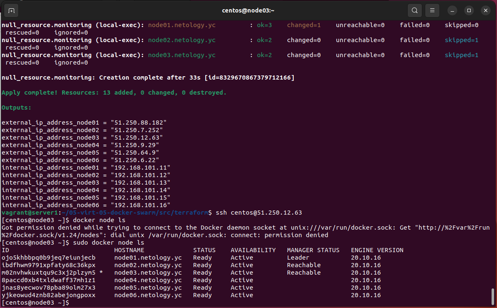
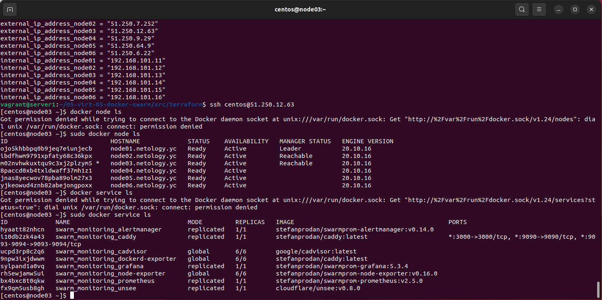

# Домашнее задание к занятию "5.5. Оркестрация кластером Docker контейнеров на примере Docker Swarm"

## Задача 1

Дайте письменые ответы на следующие вопросы:

- В чём отличие режимов работы сервисов в Docker Swarm кластере: replication и global?
- Какой алгоритм выбора лидера используется в Docker Swarm кластере?
- Что такое Overlay Network?

---

1. Replication - позволяет задать кол-во реплик микросервисов, которое будет равномерно распределено во воркерам в кластере. Позволяет увеличивать кол-во реплик на лету (горизонтальное масштабирование). Удобно использовать например с вебсервисами, БД.  Global - Микросервисы в одном экземпляре запускаются на всех доступных нодах. Удобен например при развертывании node_exporter, антивирусов и прочих микросервисах, которые должны работать в единственном экземпляре на каждой виртуальной машине / физическом сервере.
2. Выбор лидера проводится через процедуру голосования, используется алгоритм RAFT - алгоритм распределенного консенсуса.
3. Overlay-сеть использует UPD протокол, порт 4789. Используется для общения между docker-демонами (docker-демон слушает этот порт и общается через него с docker-демонами на других нодах в кластере) 


---

## Задача 2

Создать ваш первый Docker Swarm кластер в Яндекс.Облаке

Для получения зачета, вам необходимо предоставить скриншот из терминала (консоли), с выводом команды:
```
docker node ls
```

---

<details>
  <summary>Подробнее</summary>

Создадим сеть

```bash
vagrant@server1:~/05-virt-05-docker-swarm/src/packer$ yc vpc network create \
> --name net \
> --labels my-label=netology \
> --description "my first network via yc"
id: enpsh9qtepu8bcg0fv1o
folder_id: b1g7sa087ssu373i3ubo
created_at: "2022-05-22T21:54:05Z"
name: net
description: my first network via yc
labels:
  my-label: netology
```

Создадим подсеть

```bash
vagrant@server1:~/05-virt-05-docker-swarm/src/packer$ yc vpc subnet create \
> --name my-subnet-a \
> --zone ru-central1-a \
> --range 10.1.2.0/24 \
> --network-name net \
> --description "my first subnet via yc"
id: e9btrjm2oan89v3urq1n
folder_id: b1g7sa087ssu373i3ubo
created_at: "2022-05-22T21:55:16Z"
name: my-subnet-a
description: my first subnet via yc
network_id: enpsh9qtepu8bcg0fv1o
zone_id: ru-central1-a
v4_cidr_blocks:
- 10.1.2.0/24
```

Внесем изменения в `centos-7-base.json`

```bash
vagrant@server1:~/05-virt-05-docker-swarm/src/packer$ nano centos-7-base.json 
```

Создадим образ

```bash
vagrant@server1:~/05-virt-05-docker-swarm/src/packer$ packer validate centos-7-base.json
The configuration is valid.
vagrant@server1:~/05-virt-05-docker-swarm/src/packer$ packer build centos-7-base.json
yandex: output will be in this color.

==> yandex: Creating temporary RSA SSH key for instance...
==> yandex: Using as source image: fd8rdcd74jho9ssh779e (name: "centos-7-v20220519", family: "centos-7")
==> yandex: Use provided subnet id e9btrjm2oan89v3urq1n
==> yandex: Creating disk...
==> yandex: Creating instance...
==> yandex: Waiting for instance with id fhm3mbqgutpl9a02p3q3 to become active...
    yandex: Detected instance IP: 51.250.9.29
==> yandex: Using SSH communicator to connect: 51.250.9.29
==> yandex: Waiting for SSH to become available...
==> yandex: Connected to SSH!
==> yandex: Provisioning with shell script: /tmp/packer-shell871185157
    yandex: Loaded plugins: fastestmirror
    yandex: Loading mirror speeds from cached hostfile
    yandex:  * base: mirror.yandex.ru
    yandex:  * extras: mirror.yandex.ru
    yandex:  * updates: mirror.yandex.ru
    yandex: Resolving Dependencies
    yandex: --> Running transaction check
    yandex: ---> Package glibc.x86_64 0:2.17-325.el7_9 will be updated
    yandex: ---> Package glibc.x86_64 0:2.17-326.el7_9 will be an update
    yandex: ---> Package glibc-common.x86_64 0:2.17-325.el7_9 will be updated
    yandex: ---> Package glibc-common.x86_64 0:2.17-326.el7_9 will be an update
    yandex: ---> Package grub2.x86_64 1:2.02-0.87.el7.centos.7 will be updated
    yandex: ---> Package grub2.x86_64 1:2.02-0.87.0.1.el7.centos.9 will be an update
    yandex: ---> Package grub2-common.noarch 1:2.02-0.87.el7.centos.7 will be updated
    yandex: ---> Package grub2-common.noarch 1:2.02-0.87.0.1.el7.centos.9 will be an update
    yandex: ---> Package grub2-pc.x86_64 1:2.02-0.87.el7.centos.7 will be updated
    yandex: ---> Package grub2-pc.x86_64 1:2.02-0.87.0.1.el7.centos.9 will be an update
    yandex: ---> Package grub2-pc-modules.noarch 1:2.02-0.87.el7.centos.7 will be updated
    yandex: ---> Package grub2-pc-modules.noarch 1:2.02-0.87.0.1.el7.centos.9 will be an update
    yandex: ---> Package grub2-tools.x86_64 1:2.02-0.87.el7.centos.7 will be updated
    yandex: ---> Package grub2-tools.x86_64 1:2.02-0.87.0.1.el7.centos.9 will be an update
    yandex: ---> Package grub2-tools-extra.x86_64 1:2.02-0.87.el7.centos.7 will be updated
    yandex: ---> Package grub2-tools-extra.x86_64 1:2.02-0.87.0.1.el7.centos.9 will be an update
    yandex: ---> Package grub2-tools-minimal.x86_64 1:2.02-0.87.el7.centos.7 will be updated
    yandex: ---> Package grub2-tools-minimal.x86_64 1:2.02-0.87.0.1.el7.centos.9 will be an update
    yandex: ---> Package kernel.x86_64 0:3.10.0-1160.66.1.el7 will be installed
    yandex: ---> Package kernel-tools.x86_64 0:3.10.0-1160.62.1.el7 will be updated
    yandex: ---> Package kernel-tools.x86_64 0:3.10.0-1160.66.1.el7 will be an update
    yandex: ---> Package kernel-tools-libs.x86_64 0:3.10.0-1160.62.1.el7 will be updated
    yandex: ---> Package kernel-tools-libs.x86_64 0:3.10.0-1160.66.1.el7 will be an update
    yandex: ---> Package python-perf.x86_64 0:3.10.0-1160.62.1.el7 will be updated
    yandex: ---> Package python-perf.x86_64 0:3.10.0-1160.66.1.el7 will be an update
    yandex: --> Finished Dependency Resolution
    yandex:
    yandex: Dependencies Resolved
    yandex:
    yandex: ================================================================================
    yandex:  Package               Arch     Version                         Repository
    yandex:                                                                            Size
    yandex: ================================================================================
    yandex: Installing:
    yandex:  kernel                x86_64   3.10.0-1160.66.1.el7            updates    50 M
    yandex: Updating:
    yandex:  glibc                 x86_64   2.17-326.el7_9                  updates   3.6 M
    yandex:  glibc-common          x86_64   2.17-326.el7_9                  updates    12 M
    yandex:  grub2                 x86_64   1:2.02-0.87.0.1.el7.centos.9    updates    34 k
    yandex:  grub2-common          noarch   1:2.02-0.87.0.1.el7.centos.9    updates   732 k
    yandex:  grub2-pc              x86_64   1:2.02-0.87.0.1.el7.centos.9    updates    34 k
    yandex:  grub2-pc-modules      noarch   1:2.02-0.87.0.1.el7.centos.9    updates   858 k
    yandex:  grub2-tools           x86_64   1:2.02-0.87.0.1.el7.centos.9    updates   1.8 M
    yandex:  grub2-tools-extra     x86_64   1:2.02-0.87.0.1.el7.centos.9    updates   1.0 M
    yandex:  grub2-tools-minimal   x86_64   1:2.02-0.87.0.1.el7.centos.9    updates   177 k
    yandex:  kernel-tools          x86_64   3.10.0-1160.66.1.el7            updates   8.2 M
    yandex:  kernel-tools-libs     x86_64   3.10.0-1160.66.1.el7            updates   8.1 M
    yandex:  python-perf           x86_64   3.10.0-1160.66.1.el7            updates   8.2 M
    yandex:
    yandex: Transaction Summary
    yandex: ================================================================================
    yandex: Install   1 Package
    yandex: Upgrade  12 Packages
    yandex:
    yandex: Total download size: 94 M
    yandex: Downloading packages:
    yandex: Delta RPMs disabled because /usr/bin/applydeltarpm not installed.
    yandex: --------------------------------------------------------------------------------
    yandex: Total                                               81 MB/s |  94 MB  00:01
    yandex: Running transaction check
    yandex: Running transaction test
    yandex: Transaction test succeeded
    yandex: Running transaction
    yandex:   Updating   : glibc-common-2.17-326.el7_9.x86_64                          1/25
    yandex:   Updating   : glibc-2.17-326.el7_9.x86_64                                 2/25
    yandex:   Updating   : 1:grub2-common-2.02-0.87.0.1.el7.centos.9.noarch            3/25
    yandex:   Updating   : 1:grub2-tools-minimal-2.02-0.87.0.1.el7.centos.9.x86_64     4/25
    yandex:   Updating   : 1:grub2-tools-2.02-0.87.0.1.el7.centos.9.x86_64             5/25
    yandex:   Updating   : 1:grub2-tools-extra-2.02-0.87.0.1.el7.centos.9.x86_64       6/25
    yandex:   Updating   : 1:grub2-pc-modules-2.02-0.87.0.1.el7.centos.9.noarch        7/25
    yandex:   Updating   : 1:grub2-pc-2.02-0.87.0.1.el7.centos.9.x86_64                8/25
    yandex:   Updating   : kernel-tools-libs-3.10.0-1160.66.1.el7.x86_64               9/25
    yandex:   Updating   : kernel-tools-3.10.0-1160.66.1.el7.x86_64                   10/25
    yandex:   Updating   : 1:grub2-2.02-0.87.0.1.el7.centos.9.x86_64                  11/25
    yandex:   Updating   : python-perf-3.10.0-1160.66.1.el7.x86_64                    12/25
    yandex:   Installing : kernel-3.10.0-1160.66.1.el7.x86_64                         13/25
    yandex:   Cleanup    : kernel-tools-3.10.0-1160.62.1.el7.x86_64                   14/25
    yandex:   Cleanup    : 1:grub2-2.02-0.87.el7.centos.7.x86_64                      15/25
    yandex:   Cleanup    : 1:grub2-pc-2.02-0.87.el7.centos.7.x86_64                   16/25
    yandex:   Cleanup    : 1:grub2-tools-extra-2.02-0.87.el7.centos.7.x86_64          17/25
    yandex:   Cleanup    : 1:grub2-pc-modules-2.02-0.87.el7.centos.7.noarch           18/25
    yandex:   Cleanup    : 1:grub2-tools-2.02-0.87.el7.centos.7.x86_64                19/25
    yandex:   Cleanup    : 1:grub2-tools-minimal-2.02-0.87.el7.centos.7.x86_64        20/25
    yandex:   Cleanup    : kernel-tools-libs-3.10.0-1160.62.1.el7.x86_64              21/25
    yandex:   Cleanup    : python-perf-3.10.0-1160.62.1.el7.x86_64                    22/25
    yandex:   Cleanup    : 1:grub2-common-2.02-0.87.el7.centos.7.noarch               23/25
    yandex:   Cleanup    : glibc-common-2.17-325.el7_9.x86_64                         24/25
    yandex:   Cleanup    : glibc-2.17-325.el7_9.x86_64                                25/25
    yandex:   Verifying  : kernel-tools-3.10.0-1160.66.1.el7.x86_64                    1/25
    yandex:   Verifying  : glibc-2.17-326.el7_9.x86_64                                 2/25
    yandex:   Verifying  : 1:grub2-pc-2.02-0.87.0.1.el7.centos.9.x86_64                3/25
    yandex:   Verifying  : 1:grub2-tools-extra-2.02-0.87.0.1.el7.centos.9.x86_64       4/25
    yandex:   Verifying  : 1:grub2-tools-minimal-2.02-0.87.0.1.el7.centos.9.x86_64     5/25
    yandex:   Verifying  : 1:grub2-tools-2.02-0.87.0.1.el7.centos.9.x86_64             6/25
    yandex:   Verifying  : kernel-3.10.0-1160.66.1.el7.x86_64                          7/25
    yandex:   Verifying  : 1:grub2-pc-modules-2.02-0.87.0.1.el7.centos.9.noarch        8/25
    yandex:   Verifying  : kernel-tools-libs-3.10.0-1160.66.1.el7.x86_64               9/25
    yandex:   Verifying  : 1:grub2-2.02-0.87.0.1.el7.centos.9.x86_64                  10/25
    yandex:   Verifying  : glibc-common-2.17-326.el7_9.x86_64                         11/25
    yandex:   Verifying  : 1:grub2-common-2.02-0.87.0.1.el7.centos.9.noarch           12/25
    yandex:   Verifying  : python-perf-3.10.0-1160.66.1.el7.x86_64                    13/25
    yandex:   Verifying  : 1:grub2-pc-modules-2.02-0.87.el7.centos.7.noarch           14/25
    yandex:   Verifying  : kernel-tools-libs-3.10.0-1160.62.1.el7.x86_64              15/25
    yandex:   Verifying  : 1:grub2-tools-2.02-0.87.el7.centos.7.x86_64                16/25
    yandex:   Verifying  : 1:grub2-tools-minimal-2.02-0.87.el7.centos.7.x86_64        17/25
    yandex:   Verifying  : 1:grub2-tools-extra-2.02-0.87.el7.centos.7.x86_64          18/25
    yandex:   Verifying  : kernel-tools-3.10.0-1160.62.1.el7.x86_64                   19/25
    yandex:   Verifying  : 1:grub2-pc-2.02-0.87.el7.centos.7.x86_64                   20/25
    yandex:   Verifying  : python-perf-3.10.0-1160.62.1.el7.x86_64                    21/25
    yandex:   Verifying  : glibc-common-2.17-325.el7_9.x86_64                         22/25
    yandex:   Verifying  : glibc-2.17-325.el7_9.x86_64                                23/25
    yandex:   Verifying  : 1:grub2-2.02-0.87.el7.centos.7.x86_64                      24/25
    yandex:   Verifying  : 1:grub2-common-2.02-0.87.el7.centos.7.noarch               25/25
    yandex:
    yandex: Installed:
    yandex:   kernel.x86_64 0:3.10.0-1160.66.1.el7
    yandex:
    yandex: Updated:
    yandex:   glibc.x86_64 0:2.17-326.el7_9
    yandex:   glibc-common.x86_64 0:2.17-326.el7_9
    yandex:   grub2.x86_64 1:2.02-0.87.0.1.el7.centos.9
    yandex:   grub2-common.noarch 1:2.02-0.87.0.1.el7.centos.9
    yandex:   grub2-pc.x86_64 1:2.02-0.87.0.1.el7.centos.9
    yandex:   grub2-pc-modules.noarch 1:2.02-0.87.0.1.el7.centos.9
    yandex:   grub2-tools.x86_64 1:2.02-0.87.0.1.el7.centos.9
    yandex:   grub2-tools-extra.x86_64 1:2.02-0.87.0.1.el7.centos.9
    yandex:   grub2-tools-minimal.x86_64 1:2.02-0.87.0.1.el7.centos.9
    yandex:   kernel-tools.x86_64 0:3.10.0-1160.66.1.el7
    yandex:   kernel-tools-libs.x86_64 0:3.10.0-1160.66.1.el7
    yandex:   python-perf.x86_64 0:3.10.0-1160.66.1.el7
    yandex:
    yandex: Complete!
    yandex: Loaded plugins: fastestmirror
    yandex: Loading mirror speeds from cached hostfile
    yandex:  * base: mirrors.datahouse.ru
    yandex:  * extras: mirrors.datahouse.ru
    yandex:  * updates: mirrors.datahouse.ru
    yandex: Package iptables-1.4.21-35.el7.x86_64 already installed and latest version
    yandex: Package curl-7.29.0-59.el7_9.1.x86_64 already installed and latest version
    yandex: Package net-tools-2.0-0.25.20131004git.el7.x86_64 already installed and latest version
    yandex: Package rsync-3.1.2-10.el7.x86_64 already installed and latest version
    yandex: Package openssh-server-7.4p1-22.el7_9.x86_64 already installed and latest version
    yandex: Resolving Dependencies
    yandex: --> Running transaction check
    yandex: ---> Package bind-utils.x86_64 32:9.11.4-26.P2.el7_9.9 will be installed
    yandex: --> Processing Dependency: bind-libs-lite(x86-64) = 32:9.11.4-26.P2.el7_9.9 for package: 32:bind-utils-9.11.4-26.P2.el7_9.9.x86_64
    yandex: --> Processing Dependency: bind-libs(x86-64) = 32:9.11.4-26.P2.el7_9.9 for package: 32:bind-utils-9.11.4-26.P2.el7_9.9.x86_64
    yandex: --> Processing Dependency: liblwres.so.160()(64bit) for package: 32:bind-utils-9.11.4-26.P2.el7_9.9.x86_64
    yandex: --> Processing Dependency: libisccfg.so.160()(64bit) for package: 32:bind-utils-9.11.4-26.P2.el7_9.9.x86_64
    yandex: --> Processing Dependency: libisc.so.169()(64bit) for package: 32:bind-utils-9.11.4-26.P2.el7_9.9.x86_64
    yandex: --> Processing Dependency: libirs.so.160()(64bit) for package: 32:bind-utils-9.11.4-26.P2.el7_9.9.x86_64
    yandex: --> Processing Dependency: libdns.so.1102()(64bit) for package: 32:bind-utils-9.11.4-26.P2.el7_9.9.x86_64
    yandex: --> Processing Dependency: libbind9.so.160()(64bit) for package: 32:bind-utils-9.11.4-26.P2.el7_9.9.x86_64
    yandex: --> Processing Dependency: libGeoIP.so.1()(64bit) for package: 32:bind-utils-9.11.4-26.P2.el7_9.9.x86_64
    yandex: ---> Package bridge-utils.x86_64 0:1.5-9.el7 will be installed
    yandex: ---> Package tcpdump.x86_64 14:4.9.2-4.el7_7.1 will be installed
    yandex: --> Processing Dependency: libpcap >= 14:1.5.3-10 for package: 14:tcpdump-4.9.2-4.el7_7.1.x86_64
    yandex: --> Processing Dependency: libpcap.so.1()(64bit) for package: 14:tcpdump-4.9.2-4.el7_7.1.x86_64
    yandex: ---> Package telnet.x86_64 1:0.17-66.el7 will be installed
    yandex: --> Running transaction check
    yandex: ---> Package GeoIP.x86_64 0:1.5.0-14.el7 will be installed
    yandex: --> Processing Dependency: geoipupdate for package: GeoIP-1.5.0-14.el7.x86_64
    yandex: ---> Package bind-libs.x86_64 32:9.11.4-26.P2.el7_9.9 will be installed
    yandex: --> Processing Dependency: bind-license = 32:9.11.4-26.P2.el7_9.9 for package: 32:bind-libs-9.11.4-26.P2.el7_9.9.x86_64
    yandex: ---> Package bind-libs-lite.x86_64 32:9.11.4-26.P2.el7_9.9 will be installed
    yandex: ---> Package libpcap.x86_64 14:1.5.3-13.el7_9 will be installed
    yandex: --> Running transaction check
    yandex: ---> Package bind-license.noarch 32:9.11.4-26.P2.el7_9.9 will be installed
    yandex: ---> Package geoipupdate.x86_64 0:2.5.0-1.el7 will be installed
    yandex: --> Finished Dependency Resolution
    yandex:
    yandex: Dependencies Resolved
    yandex:
    yandex: ================================================================================
    yandex:  Package            Arch       Version                        Repository   Size
    yandex: ================================================================================
    yandex: Installing:
    yandex:  bind-utils         x86_64     32:9.11.4-26.P2.el7_9.9        updates     261 k
    yandex:  bridge-utils       x86_64     1.5-9.el7                      base         32 k
    yandex:  tcpdump            x86_64     14:4.9.2-4.el7_7.1             base        422 k
    yandex:  telnet             x86_64     1:0.17-66.el7                  updates      64 k
    yandex: Installing for dependencies:
    yandex:  GeoIP              x86_64     1.5.0-14.el7                   base        1.5 M
    yandex:  bind-libs          x86_64     32:9.11.4-26.P2.el7_9.9        updates     157 k
    yandex:  bind-libs-lite     x86_64     32:9.11.4-26.P2.el7_9.9        updates     1.1 M
    yandex:  bind-license       noarch     32:9.11.4-26.P2.el7_9.9        updates      91 k
    yandex:  geoipupdate        x86_64     2.5.0-1.el7                    base         35 k
    yandex:  libpcap            x86_64     14:1.5.3-13.el7_9              updates     139 k
    yandex:
    yandex: Transaction Summary
    yandex: ================================================================================
    yandex: Install  4 Packages (+6 Dependent packages)
    yandex:
    yandex: Total download size: 3.8 M
    yandex: Installed size: 9.0 M
    yandex: Downloading packages:
    yandex: --------------------------------------------------------------------------------
    yandex: Total                                               13 MB/s | 3.8 MB  00:00
    yandex: Running transaction check
    yandex: Running transaction test
    yandex: Transaction test succeeded
    yandex: Running transaction
    yandex:   Installing : 32:bind-license-9.11.4-26.P2.el7_9.9.noarch                 1/10
    yandex:   Installing : geoipupdate-2.5.0-1.el7.x86_64                              2/10
    yandex:   Installing : GeoIP-1.5.0-14.el7.x86_64                                   3/10
    yandex:   Installing : 32:bind-libs-lite-9.11.4-26.P2.el7_9.9.x86_64               4/10
    yandex:   Installing : 32:bind-libs-9.11.4-26.P2.el7_9.9.x86_64                    5/10
    yandex:   Installing : 14:libpcap-1.5.3-13.el7_9.x86_64                            6/10
    yandex: pam_tally2: Error opening /var/log/tallylog for update: Permission denied
    yandex: pam_tally2: Authentication error
    yandex: useradd: failed to reset the tallylog entry of user "tcpdump"
    yandex:   Installing : 14:tcpdump-4.9.2-4.el7_7.1.x86_64                           7/10
    yandex:   Installing : 32:bind-utils-9.11.4-26.P2.el7_9.9.x86_64                   8/10
    yandex:   Installing : bridge-utils-1.5-9.el7.x86_64                               9/10
    yandex:   Installing : 1:telnet-0.17-66.el7.x86_64                                10/10
    yandex:   Verifying  : GeoIP-1.5.0-14.el7.x86_64                                   1/10
    yandex:   Verifying  : 14:libpcap-1.5.3-13.el7_9.x86_64                            2/10
    yandex:   Verifying  : 1:telnet-0.17-66.el7.x86_64                                 3/10
    yandex:   Verifying  : 32:bind-libs-9.11.4-26.P2.el7_9.9.x86_64                    4/10
    yandex:   Verifying  : geoipupdate-2.5.0-1.el7.x86_64                              5/10
    yandex:   Verifying  : 14:tcpdump-4.9.2-4.el7_7.1.x86_64                           6/10
    yandex:   Verifying  : 32:bind-license-9.11.4-26.P2.el7_9.9.noarch                 7/10
    yandex:   Verifying  : bridge-utils-1.5-9.el7.x86_64                               8/10
    yandex:   Verifying  : 32:bind-libs-lite-9.11.4-26.P2.el7_9.9.x86_64               9/10
    yandex:   Verifying  : 32:bind-utils-9.11.4-26.P2.el7_9.9.x86_64                  10/10
    yandex:
    yandex: Installed:
    yandex:   bind-utils.x86_64 32:9.11.4-26.P2.el7_9.9   bridge-utils.x86_64 0:1.5-9.el7
    yandex:   tcpdump.x86_64 14:4.9.2-4.el7_7.1           telnet.x86_64 1:0.17-66.el7
    yandex:
    yandex: Dependency Installed:
    yandex:   GeoIP.x86_64 0:1.5.0-14.el7
    yandex:   bind-libs.x86_64 32:9.11.4-26.P2.el7_9.9
    yandex:   bind-libs-lite.x86_64 32:9.11.4-26.P2.el7_9.9
    yandex:   bind-license.noarch 32:9.11.4-26.P2.el7_9.9
    yandex:   geoipupdate.x86_64 0:2.5.0-1.el7
    yandex:   libpcap.x86_64 14:1.5.3-13.el7_9
    yandex:
    yandex: Complete!
==> yandex: Stopping instance...
==> yandex: Deleting instance...
    yandex: Instance has been deleted!
==> yandex: Creating image: centos-7-base
==> yandex: Waiting for image to complete...
==> yandex: Success image create...
==> yandex: Destroying boot disk...
    yandex: Disk has been deleted!
Build 'yandex' finished after 4 minutes 38 seconds.

==> Wait completed after 4 minutes 38 seconds

==> Builds finished. The artifacts of successful builds are:
--> yandex: A disk image was created: centos-7-base (id: fd89op7r966dpcvsnf1o) with family name centos
vagrant@server1:~/05-virt-05-docker-swarm/src/packer$ yc compute image list
+----------------------+---------------+--------+----------------------+--------+
|          ID          |     NAME      | FAMILY |     PRODUCT IDS      | STATUS |
+----------------------+---------------+--------+----------------------+--------+
| fd89op7r966dpcvsnf1o | centos-7-base | centos | f2e99agij1uhrk2ioilk | READY  |
+----------------------+---------------+--------+----------------------+--------+
```

Удалим временную сеть и подсеть

```bash
vagrant@server1:~/05-virt-05-docker-swarm/src/packer$ yc vpc subnet delete --name my-subnet-a && yc vpc network delete --name net
done (3s)
```

Внесем изменения в `variables.tf`

```bash
vagrant@server1:~/05-virt-05-docker-swarm/src/terraform$ nano variables.tf 
```

Скопируем `key.json` из предыдущего ДЗ

```bash
vagrant@server1:~/05-virt-05-docker-swarm/src/terraform$ cp ../../../05-virt-04/src/terraform/key.json key.json
```

Инициализируем `terraform`

```bash
vagrant@server1:~/05-virt-05-docker-swarm/src/terraform$ terraform init

Initializing the backend...

Initializing provider plugins...
- Finding latest version of yandex-cloud/yandex...
- Finding latest version of hashicorp/null...
- Finding latest version of hashicorp/local...
- Installing hashicorp/local v2.2.3...
- Installed hashicorp/local v2.2.3 (signed by HashiCorp)
- Installing yandex-cloud/yandex v0.74.0...
- Installed yandex-cloud/yandex v0.74.0 (self-signed, key ID E40F590B50BB8E40)
- Installing hashicorp/null v3.1.1...
- Installed hashicorp/null v3.1.1 (signed by HashiCorp)

Partner and community providers are signed by their developers.
If you'd like to know more about provider signing, you can read about it here:
https://www.terraform.io/docs/cli/plugins/signing.html

Terraform has created a lock file .terraform.lock.hcl to record the provider
selections it made above. Include this file in your version control repository
so that Terraform can guarantee to make the same selections by default when
you run "terraform init" in the future.

Terraform has been successfully initialized!

You may now begin working with Terraform. Try running "terraform plan" to see
any changes that are required for your infrastructure. All Terraform commands
should now work.

If you ever set or change modules or backend configuration for Terraform,
rerun this command to reinitialize your working directory. If you forget, other
commands will detect it and remind you to do so if necessary.
```

<details>
  <summary>Проверим и посмотрим план</summary>

Проверим и посмотрим план

```bash
vagrant@server1:~/05-virt-05-docker-swarm/src/terraform$ terraform validate
Success! The configuration is valid.

vagrant@server1:~/05-virt-05-docker-swarm/src/terraform$ terraform plan

Terraform used the selected providers to generate the following execution plan. Resource actions are
indicated with the following symbols:
  + create

Terraform will perform the following actions:

  # local_file.inventory will be created
  + resource "local_file" "inventory" {
      + content              = (known after apply)
      + directory_permission = "0777"
      + file_permission      = "0777"
      + filename             = "../ansible/inventory"
      + id                   = (known after apply)
    }

  # null_resource.cluster will be created
  + resource "null_resource" "cluster" {
      + id = (known after apply)
    }

  # null_resource.monitoring will be created
  + resource "null_resource" "monitoring" {
      + id = (known after apply)
    }

  # null_resource.sync will be created
  + resource "null_resource" "sync" {
      + id = (known after apply)
    }

  # null_resource.wait will be created
  + resource "null_resource" "wait" {
      + id = (known after apply)
    }

  # yandex_compute_instance.node01 will be created
  + resource "yandex_compute_instance" "node01" {
      + allow_stopping_for_update = true
      + created_at                = (known after apply)
      + folder_id                 = (known after apply)
      + fqdn                      = (known after apply)
      + hostname                  = "node01.netology.yc"
      + id                        = (known after apply)
      + metadata                  = {
          + "ssh-keys" = <<-EOT
                centos:ssh-rsa AAAAB3NzaC1yc2EAAAADAQABAAABgQDUbQlemQgNIRkthLOCwa8mzdH4DY32sW8zxoxrazhsTswfazuVUU7hIL8RHyjTqQLxPVLw12lJqseii4APuOH060Lhd2vaZ4EFTHGO/xouVMwOv90fe4tAiMPiVzy9RMb6YWFdpE0GaN/0GvHu9M5WK9jIsJDFbvod3bfMYn/tvLiVOUPYYGm8bLXEbAdVMS/XA/jZGbSE30YJ3T6ptfybsDYqjRdcgtyYISPsK4COyh8YVnLUmJFtmtqXBBWb8xGXdPq77inCVrzJutd5aI+xtULZ5OoL3YJ+R0JJ76jAjCSY+nvo/L5+Ft6/TKtKi5+uWmVMfWG2kszNlI5sku1309YjXnRyaISnpgir/Q4SxgN4CTDm3SiKxk8cNVaLhTz8WEk0xcQL/jLFzvS1tKN0LqV2mIOlCA0IfqjTvp+/Vxqv0FN1jap1AWJzHKt0UAw82D+83mIqQo5csdOeKHC7DnZoa3LdZFRz/kQg+vuHfgIm2vwbZyGi7KQ0WUl2U3E= vagrant@server1
            EOT
        }
      + name                      = "node01"
      + network_acceleration_type = "standard"
      + platform_id               = "standard-v1"
      + service_account_id        = (known after apply)
      + status                    = (known after apply)
      + zone                      = "ru-central1-a"

      + boot_disk {
          + auto_delete = true
          + device_name = (known after apply)
          + disk_id     = (known after apply)
          + mode        = (known after apply)

          + initialize_params {
              + block_size  = (known after apply)
              + description = (known after apply)
              + image_id    = "fd89op7r966dpcvsnf1o"
              + name        = "root-node01"
              + size        = 10
              + snapshot_id = (known after apply)
              + type        = "network-nvme"
            }
        }

      + network_interface {
          + index              = (known after apply)
          + ip_address         = "192.168.101.11"
          + ipv4               = true
          + ipv6               = (known after apply)
          + ipv6_address       = (known after apply)
          + mac_address        = (known after apply)
          + nat                = true
          + nat_ip_address     = (known after apply)
          + nat_ip_version     = (known after apply)
          + security_group_ids = (known after apply)
          + subnet_id          = (known after apply)
        }

      + placement_policy {
          + host_affinity_rules = (known after apply)
          + placement_group_id  = (known after apply)
        }

      + resources {
          + core_fraction = 100
          + cores         = 4
          + memory        = 8
        }

      + scheduling_policy {
          + preemptible = (known after apply)
        }
    }

  # yandex_compute_instance.node02 will be created
  + resource "yandex_compute_instance" "node02" {
      + allow_stopping_for_update = true
      + created_at                = (known after apply)
      + folder_id                 = (known after apply)
      + fqdn                      = (known after apply)
      + hostname                  = "node02.netology.yc"
      + id                        = (known after apply)
      + metadata                  = {
          + "ssh-keys" = <<-EOT
                centos:ssh-rsa AAAAB3NzaC1yc2EAAAADAQABAAABgQDUbQlemQgNIRkthLOCwa8mzdH4DY32sW8zxoxrazhsTswfazuVUU7hIL8RHyjTqQLxPVLw12lJqseii4APuOH060Lhd2vaZ4EFTHGO/xouVMwOv90fe4tAiMPiVzy9RMb6YWFdpE0GaN/0GvHu9M5WK9jIsJDFbvod3bfMYn/tvLiVOUPYYGm8bLXEbAdVMS/XA/jZGbSE30YJ3T6ptfybsDYqjRdcgtyYISPsK4COyh8YVnLUmJFtmtqXBBWb8xGXdPq77inCVrzJutd5aI+xtULZ5OoL3YJ+R0JJ76jAjCSY+nvo/L5+Ft6/TKtKi5+uWmVMfWG2kszNlI5sku1309YjXnRyaISnpgir/Q4SxgN4CTDm3SiKxk8cNVaLhTz8WEk0xcQL/jLFzvS1tKN0LqV2mIOlCA0IfqjTvp+/Vxqv0FN1jap1AWJzHKt0UAw82D+83mIqQo5csdOeKHC7DnZoa3LdZFRz/kQg+vuHfgIm2vwbZyGi7KQ0WUl2U3E= vagrant@server1
            EOT
        }
      + name                      = "node02"
      + network_acceleration_type = "standard"
      + platform_id               = "standard-v1"
      + service_account_id        = (known after apply)
      + status                    = (known after apply)
      + zone                      = "ru-central1-a"

      + boot_disk {
          + auto_delete = true
          + device_name = (known after apply)
          + disk_id     = (known after apply)
          + mode        = (known after apply)

          + initialize_params {
              + block_size  = (known after apply)
              + description = (known after apply)
              + image_id    = "fd89op7r966dpcvsnf1o"
              + name        = "root-node02"
              + size        = 10
              + snapshot_id = (known after apply)
              + type        = "network-nvme"
            }
        }

      + network_interface {
          + index              = (known after apply)
          + ip_address         = "192.168.101.12"
          + ipv4               = true
          + ipv6               = (known after apply)
          + ipv6_address       = (known after apply)
          + mac_address        = (known after apply)
          + nat                = true
          + nat_ip_address     = (known after apply)
          + nat_ip_version     = (known after apply)
          + security_group_ids = (known after apply)
          + subnet_id          = (known after apply)
        }

      + placement_policy {
          + host_affinity_rules = (known after apply)
          + placement_group_id  = (known after apply)
        }

      + resources {
          + core_fraction = 100
          + cores         = 4
          + memory        = 8
        }

      + scheduling_policy {
          + preemptible = (known after apply)
        }
    }

  # yandex_compute_instance.node03 will be created
  + resource "yandex_compute_instance" "node03" {
      + allow_stopping_for_update = true
      + created_at                = (known after apply)
      + folder_id                 = (known after apply)
      + fqdn                      = (known after apply)
      + hostname                  = "node03.netology.yc"
      + id                        = (known after apply)
      + metadata                  = {
          + "ssh-keys" = <<-EOT
                centos:ssh-rsa AAAAB3NzaC1yc2EAAAADAQABAAABgQDUbQlemQgNIRkthLOCwa8mzdH4DY32sW8zxoxrazhsTswfazuVUU7hIL8RHyjTqQLxPVLw12lJqseii4APuOH060Lhd2vaZ4EFTHGO/xouVMwOv90fe4tAiMPiVzy9RMb6YWFdpE0GaN/0GvHu9M5WK9jIsJDFbvod3bfMYn/tvLiVOUPYYGm8bLXEbAdVMS/XA/jZGbSE30YJ3T6ptfybsDYqjRdcgtyYISPsK4COyh8YVnLUmJFtmtqXBBWb8xGXdPq77inCVrzJutd5aI+xtULZ5OoL3YJ+R0JJ76jAjCSY+nvo/L5+Ft6/TKtKi5+uWmVMfWG2kszNlI5sku1309YjXnRyaISnpgir/Q4SxgN4CTDm3SiKxk8cNVaLhTz8WEk0xcQL/jLFzvS1tKN0LqV2mIOlCA0IfqjTvp+/Vxqv0FN1jap1AWJzHKt0UAw82D+83mIqQo5csdOeKHC7DnZoa3LdZFRz/kQg+vuHfgIm2vwbZyGi7KQ0WUl2U3E= vagrant@server1
            EOT
        }
      + name                      = "node03"
      + network_acceleration_type = "standard"
      + platform_id               = "standard-v1"
      + service_account_id        = (known after apply)
      + status                    = (known after apply)
      + zone                      = "ru-central1-a"

      + boot_disk {
          + auto_delete = true
          + device_name = (known after apply)
          + disk_id     = (known after apply)
          + mode        = (known after apply)

          + initialize_params {
              + block_size  = (known after apply)
              + description = (known after apply)
              + image_id    = "fd89op7r966dpcvsnf1o"
              + name        = "root-node03"
              + size        = 10
              + snapshot_id = (known after apply)
              + type        = "network-nvme"
            }
        }

      + network_interface {
          + index              = (known after apply)
          + ip_address         = "192.168.101.13"
          + ipv4               = true
          + ipv6               = (known after apply)
          + ipv6_address       = (known after apply)
          + mac_address        = (known after apply)
          + nat                = true
          + nat_ip_address     = (known after apply)
          + nat_ip_version     = (known after apply)
          + security_group_ids = (known after apply)
          + subnet_id          = (known after apply)
        }

      + placement_policy {
          + host_affinity_rules = (known after apply)
          + placement_group_id  = (known after apply)
        }

      + resources {
          + core_fraction = 100
          + cores         = 4
          + memory        = 8
        }

      + scheduling_policy {
          + preemptible = (known after apply)
        }
    }

  # yandex_compute_instance.node04 will be created
  + resource "yandex_compute_instance" "node04" {
      + allow_stopping_for_update = true
      + created_at                = (known after apply)
      + folder_id                 = (known after apply)
      + fqdn                      = (known after apply)
      + hostname                  = "node04.netology.yc"
      + id                        = (known after apply)
      + metadata                  = {
          + "ssh-keys" = <<-EOT
                centos:ssh-rsa AAAAB3NzaC1yc2EAAAADAQABAAABgQDUbQlemQgNIRkthLOCwa8mzdH4DY32sW8zxoxrazhsTswfazuVUU7hIL8RHyjTqQLxPVLw12lJqseii4APuOH060Lhd2vaZ4EFTHGO/xouVMwOv90fe4tAiMPiVzy9RMb6YWFdpE0GaN/0GvHu9M5WK9jIsJDFbvod3bfMYn/tvLiVOUPYYGm8bLXEbAdVMS/XA/jZGbSE30YJ3T6ptfybsDYqjRdcgtyYISPsK4COyh8YVnLUmJFtmtqXBBWb8xGXdPq77inCVrzJutd5aI+xtULZ5OoL3YJ+R0JJ76jAjCSY+nvo/L5+Ft6/TKtKi5+uWmVMfWG2kszNlI5sku1309YjXnRyaISnpgir/Q4SxgN4CTDm3SiKxk8cNVaLhTz8WEk0xcQL/jLFzvS1tKN0LqV2mIOlCA0IfqjTvp+/Vxqv0FN1jap1AWJzHKt0UAw82D+83mIqQo5csdOeKHC7DnZoa3LdZFRz/kQg+vuHfgIm2vwbZyGi7KQ0WUl2U3E= vagrant@server1
            EOT
        }
      + name                      = "node04"
      + network_acceleration_type = "standard"
      + platform_id               = "standard-v1"
      + service_account_id        = (known after apply)
      + status                    = (known after apply)
      + zone                      = "ru-central1-a"

      + boot_disk {
          + auto_delete = true
          + device_name = (known after apply)
          + disk_id     = (known after apply)
          + mode        = (known after apply)

          + initialize_params {
              + block_size  = (known after apply)
              + description = (known after apply)
              + image_id    = "fd89op7r966dpcvsnf1o"
              + name        = "root-node04"
              + size        = 40
              + snapshot_id = (known after apply)
              + type        = "network-nvme"
            }
        }

      + network_interface {
          + index              = (known after apply)
          + ip_address         = "192.168.101.14"
          + ipv4               = true
          + ipv6               = (known after apply)
          + ipv6_address       = (known after apply)
          + mac_address        = (known after apply)
          + nat                = true
          + nat_ip_address     = (known after apply)
          + nat_ip_version     = (known after apply)
          + security_group_ids = (known after apply)
          + subnet_id          = (known after apply)
        }

      + placement_policy {
          + host_affinity_rules = (known after apply)
          + placement_group_id  = (known after apply)
        }

      + resources {
          + core_fraction = 100
          + cores         = 4
          + memory        = 8
        }

      + scheduling_policy {
          + preemptible = (known after apply)
        }
    }

  # yandex_compute_instance.node05 will be created
  + resource "yandex_compute_instance" "node05" {
      + allow_stopping_for_update = true
      + created_at                = (known after apply)
      + folder_id                 = (known after apply)
      + fqdn                      = (known after apply)
      + hostname                  = "node05.netology.yc"
      + id                        = (known after apply)
      + metadata                  = {
          + "ssh-keys" = <<-EOT
                centos:ssh-rsa AAAAB3NzaC1yc2EAAAADAQABAAABgQDUbQlemQgNIRkthLOCwa8mzdH4DY32sW8zxoxrazhsTswfazuVUU7hIL8RHyjTqQLxPVLw12lJqseii4APuOH060Lhd2vaZ4EFTHGO/xouVMwOv90fe4tAiMPiVzy9RMb6YWFdpE0GaN/0GvHu9M5WK9jIsJDFbvod3bfMYn/tvLiVOUPYYGm8bLXEbAdVMS/XA/jZGbSE30YJ3T6ptfybsDYqjRdcgtyYISPsK4COyh8YVnLUmJFtmtqXBBWb8xGXdPq77inCVrzJutd5aI+xtULZ5OoL3YJ+R0JJ76jAjCSY+nvo/L5+Ft6/TKtKi5+uWmVMfWG2kszNlI5sku1309YjXnRyaISnpgir/Q4SxgN4CTDm3SiKxk8cNVaLhTz8WEk0xcQL/jLFzvS1tKN0LqV2mIOlCA0IfqjTvp+/Vxqv0FN1jap1AWJzHKt0UAw82D+83mIqQo5csdOeKHC7DnZoa3LdZFRz/kQg+vuHfgIm2vwbZyGi7KQ0WUl2U3E= vagrant@server1
            EOT
        }
      + name                      = "node05"
      + network_acceleration_type = "standard"
      + platform_id               = "standard-v1"
      + service_account_id        = (known after apply)
      + status                    = (known after apply)
      + zone                      = "ru-central1-a"

      + boot_disk {
          + auto_delete = true
          + device_name = (known after apply)
          + disk_id     = (known after apply)
          + mode        = (known after apply)

          + initialize_params {
              + block_size  = (known after apply)
              + description = (known after apply)
              + image_id    = "fd89op7r966dpcvsnf1o"
              + name        = "root-node05"
              + size        = 40
              + snapshot_id = (known after apply)
              + type        = "network-nvme"
            }
        }

      + network_interface {
          + index              = (known after apply)
          + ip_address         = "192.168.101.15"
          + ipv4               = true
          + ipv6               = (known after apply)
          + ipv6_address       = (known after apply)
          + mac_address        = (known after apply)
          + nat                = true
          + nat_ip_address     = (known after apply)
          + nat_ip_version     = (known after apply)
          + security_group_ids = (known after apply)
          + subnet_id          = (known after apply)
        }

      + placement_policy {
          + host_affinity_rules = (known after apply)
          + placement_group_id  = (known after apply)
        }

      + resources {
          + core_fraction = 100
          + cores         = 4
          + memory        = 8
        }

      + scheduling_policy {
          + preemptible = (known after apply)
        }
    }

  # yandex_compute_instance.node06 will be created
  + resource "yandex_compute_instance" "node06" {
      + allow_stopping_for_update = true
      + created_at                = (known after apply)
      + folder_id                 = (known after apply)
      + fqdn                      = (known after apply)
      + hostname                  = "node06.netology.yc"
      + id                        = (known after apply)
      + metadata                  = {
          + "ssh-keys" = <<-EOT
                centos:ssh-rsa AAAAB3NzaC1yc2EAAAADAQABAAABgQDUbQlemQgNIRkthLOCwa8mzdH4DY32sW8zxoxrazhsTswfazuVUU7hIL8RHyjTqQLxPVLw12lJqseii4APuOH060Lhd2vaZ4EFTHGO/xouVMwOv90fe4tAiMPiVzy9RMb6YWFdpE0GaN/0GvHu9M5WK9jIsJDFbvod3bfMYn/tvLiVOUPYYGm8bLXEbAdVMS/XA/jZGbSE30YJ3T6ptfybsDYqjRdcgtyYISPsK4COyh8YVnLUmJFtmtqXBBWb8xGXdPq77inCVrzJutd5aI+xtULZ5OoL3YJ+R0JJ76jAjCSY+nvo/L5+Ft6/TKtKi5+uWmVMfWG2kszNlI5sku1309YjXnRyaISnpgir/Q4SxgN4CTDm3SiKxk8cNVaLhTz8WEk0xcQL/jLFzvS1tKN0LqV2mIOlCA0IfqjTvp+/Vxqv0FN1jap1AWJzHKt0UAw82D+83mIqQo5csdOeKHC7DnZoa3LdZFRz/kQg+vuHfgIm2vwbZyGi7KQ0WUl2U3E= vagrant@server1
            EOT
        }
      + name                      = "node06"
      + network_acceleration_type = "standard"
      + platform_id               = "standard-v1"
      + service_account_id        = (known after apply)
      + status                    = (known after apply)
      + zone                      = "ru-central1-a"

      + boot_disk {
          + auto_delete = true
          + device_name = (known after apply)
          + disk_id     = (known after apply)
          + mode        = (known after apply)

          + initialize_params {
              + block_size  = (known after apply)
              + description = (known after apply)
              + image_id    = "fd89op7r966dpcvsnf1o"
              + name        = "root-node06"
              + size        = 40
              + snapshot_id = (known after apply)
              + type        = "network-nvme"
            }
        }

      + network_interface {
          + index              = (known after apply)
          + ip_address         = "192.168.101.16"
          + ipv4               = true
          + ipv6               = (known after apply)
          + ipv6_address       = (known after apply)
          + mac_address        = (known after apply)
          + nat                = true
          + nat_ip_address     = (known after apply)
          + nat_ip_version     = (known after apply)
          + security_group_ids = (known after apply)
          + subnet_id          = (known after apply)
        }

      + placement_policy {
          + host_affinity_rules = (known after apply)
          + placement_group_id  = (known after apply)
        }

      + resources {
          + core_fraction = 100
          + cores         = 4
          + memory        = 8
        }

      + scheduling_policy {
          + preemptible = (known after apply)
        }
    }

  # yandex_vpc_network.default will be created
  + resource "yandex_vpc_network" "default" {
      + created_at                = (known after apply)
      + default_security_group_id = (known after apply)
      + folder_id                 = (known after apply)
      + id                        = (known after apply)
      + labels                    = (known after apply)
      + name                      = "net"
      + subnet_ids                = (known after apply)
    }

  # yandex_vpc_subnet.default will be created
  + resource "yandex_vpc_subnet" "default" {
      + created_at     = (known after apply)
      + folder_id      = (known after apply)
      + id             = (known after apply)
      + labels         = (known after apply)
      + name           = "subnet"
      + network_id     = (known after apply)
      + v4_cidr_blocks = [
          + "192.168.101.0/24",
        ]
      + v6_cidr_blocks = (known after apply)
      + zone           = "ru-central1-a"
    }

Plan: 13 to add, 0 to change, 0 to destroy.

Changes to Outputs:
  + external_ip_address_node01 = (known after apply)
  + external_ip_address_node02 = (known after apply)
  + external_ip_address_node03 = (known after apply)
  + external_ip_address_node04 = (known after apply)
  + external_ip_address_node05 = (known after apply)
  + external_ip_address_node06 = (known after apply)
  + internal_ip_address_node01 = "192.168.101.11"
  + internal_ip_address_node02 = "192.168.101.12"
  + internal_ip_address_node03 = "192.168.101.13"
  + internal_ip_address_node04 = "192.168.101.14"
  + internal_ip_address_node05 = "192.168.101.15"
  + internal_ip_address_node06 = "192.168.101.16"


Note: You didn't use the -out option to save this plan, so Terraform can't guarantee to take exactly these
actions if you run "terraform apply" now.


vagrant@server1:~/05-virt-05-docker-swarm/src/terraform$ terraform apply -auto-approve

Terraform used the selected providers to generate the following execution plan. Resource actions are indicated with the following
symbols:
  + create

Terraform will perform the following actions:

  # local_file.inventory will be created
  + resource "local_file" "inventory" {
      + content              = (known after apply)
      + directory_permission = "0777"
      + file_permission      = "0777"
      + filename             = "../ansible/inventory"
      + id                   = (known after apply)
    }

  # null_resource.cluster will be created
  + resource "null_resource" "cluster" {
      + id = (known after apply)
    }

  # null_resource.monitoring will be created
  + resource "null_resource" "monitoring" {
      + id = (known after apply)
    }

  # null_resource.sync will be created
  + resource "null_resource" "sync" {
      + id = (known after apply)
    }

  # null_resource.wait will be created
  + resource "null_resource" "wait" {
      + id = (known after apply)
    }

  # yandex_compute_instance.node01 will be created
  + resource "yandex_compute_instance" "node01" {
      + allow_stopping_for_update = true
      + created_at                = (known after apply)
      + folder_id                 = (known after apply)
      + fqdn                      = (known after apply)
      + hostname                  = "node01.netology.yc"
      + id                        = (known after apply)
      + metadata                  = {
          + "ssh-keys" = <<-EOT
                centos:ssh-rsa AAAAB3NzaC1yc2EAAAADAQABAAABgQDUbQlemQgNIRkthLOCwa8mzdH4DY32sW8zxoxrazhsTswfazuVUU7hIL8RHyjTqQLxPVLw12lJqseii4APuOH060Lhd2vaZ4EFTHGO/xouVMwOv90fe4tAiMPiVzy9RMb6YWFdpE0GaN/0GvHu9M5WK9jIsJDFbvod3bfMYn/tvLiVOUPYYGm8bLXEbAdVMS/XA/jZGbSE30YJ3T6ptfybsDYqjRdcgtyYISPsK4COyh8YVnLUmJFtmtqXBBWb8xGXdPq77inCVrzJutd5aI+xtULZ5OoL3YJ+R0JJ76jAjCSY+nvo/L5+Ft6/TKtKi5+uWmVMfWG2kszNlI5sku1309YjXnRyaISnpgir/Q4SxgN4CTDm3SiKxk8cNVaLhTz8WEk0xcQL/jLFzvS1tKN0LqV2mIOlCA0IfqjTvp+/Vxqv0FN1jap1AWJzHKt0UAw82D+83mIqQo5csdOeKHC7DnZoa3LdZFRz/kQg+vuHfgIm2vwbZyGi7KQ0WUl2U3E= vagrant@server1
            EOT
        }
      + name                      = "node01"
      + network_acceleration_type = "standard"
      + platform_id               = "standard-v1"
      + service_account_id        = (known after apply)
      + status                    = (known after apply)
      + zone                      = "ru-central1-a"

      + boot_disk {
          + auto_delete = true
          + device_name = (known after apply)
          + disk_id     = (known after apply)
          + mode        = (known after apply)

          + initialize_params {
              + block_size  = (known after apply)
              + description = (known after apply)
              + image_id    = "fd89op7r966dpcvsnf1o"
              + name        = "root-node01"
              + size        = 10
              + snapshot_id = (known after apply)
              + type        = "network-nvme"
            }
        }

      + network_interface {
          + index              = (known after apply)
          + ip_address         = "192.168.101.11"
          + ipv4               = true
          + ipv6               = (known after apply)
          + ipv6_address       = (known after apply)
          + mac_address        = (known after apply)
          + nat                = true
          + nat_ip_address     = (known after apply)
          + nat_ip_version     = (known after apply)
          + security_group_ids = (known after apply)
          + subnet_id          = (known after apply)
        }

      + placement_policy {
          + host_affinity_rules = (known after apply)
          + placement_group_id  = (known after apply)
        }

      + resources {
          + core_fraction = 100
          + cores         = 4
          + memory        = 8
        }

      + scheduling_policy {
          + preemptible = (known after apply)
        }
    }

  # yandex_compute_instance.node02 will be created
  + resource "yandex_compute_instance" "node02" {
      + allow_stopping_for_update = true
      + created_at                = (known after apply)
      + folder_id                 = (known after apply)
      + fqdn                      = (known after apply)
      + hostname                  = "node02.netology.yc"
      + id                        = (known after apply)
      + metadata                  = {
          + "ssh-keys" = <<-EOT
                centos:ssh-rsa AAAAB3NzaC1yc2EAAAADAQABAAABgQDUbQlemQgNIRkthLOCwa8mzdH4DY32sW8zxoxrazhsTswfazuVUU7hIL8RHyjTqQLxPVLw12lJqseii4APuOH060Lhd2vaZ4EFTHGO/xouVMwOv90fe4tAiMPiVzy9RMb6YWFdpE0GaN/0GvHu9M5WK9jIsJDFbvod3bfMYn/tvLiVOUPYYGm8bLXEbAdVMS/XA/jZGbSE30YJ3T6ptfybsDYqjRdcgtyYISPsK4COyh8YVnLUmJFtmtqXBBWb8xGXdPq77inCVrzJutd5aI+xtULZ5OoL3YJ+R0JJ76jAjCSY+nvo/L5+Ft6/TKtKi5+uWmVMfWG2kszNlI5sku1309YjXnRyaISnpgir/Q4SxgN4CTDm3SiKxk8cNVaLhTz8WEk0xcQL/jLFzvS1tKN0LqV2mIOlCA0IfqjTvp+/Vxqv0FN1jap1AWJzHKt0UAw82D+83mIqQo5csdOeKHC7DnZoa3LdZFRz/kQg+vuHfgIm2vwbZyGi7KQ0WUl2U3E= vagrant@server1
            EOT
        }
      + name                      = "node02"
      + network_acceleration_type = "standard"
      + platform_id               = "standard-v1"
      + service_account_id        = (known after apply)
      + status                    = (known after apply)
      + zone                      = "ru-central1-a"

      + boot_disk {
          + auto_delete = true
          + device_name = (known after apply)
          + disk_id     = (known after apply)
          + mode        = (known after apply)

          + initialize_params {
              + block_size  = (known after apply)
              + description = (known after apply)
              + image_id    = "fd89op7r966dpcvsnf1o"
              + name        = "root-node02"
              + size        = 10
              + snapshot_id = (known after apply)
              + type        = "network-nvme"
            }
        }

      + network_interface {
          + index              = (known after apply)
          + ip_address         = "192.168.101.12"
          + ipv4               = true
          + ipv6               = (known after apply)
          + ipv6_address       = (known after apply)
          + mac_address        = (known after apply)
          + nat                = true
          + nat_ip_address     = (known after apply)
          + nat_ip_version     = (known after apply)
          + security_group_ids = (known after apply)
          + subnet_id          = (known after apply)
        }

      + placement_policy {
          + host_affinity_rules = (known after apply)
          + placement_group_id  = (known after apply)
        }

      + resources {
          + core_fraction = 100
          + cores         = 4
          + memory        = 8
        }

      + scheduling_policy {
          + preemptible = (known after apply)
        }
    }

  # yandex_compute_instance.node03 will be created
  + resource "yandex_compute_instance" "node03" {
      + allow_stopping_for_update = true
      + created_at                = (known after apply)
      + folder_id                 = (known after apply)
      + fqdn                      = (known after apply)
      + hostname                  = "node03.netology.yc"
      + id                        = (known after apply)
      + metadata                  = {
          + "ssh-keys" = <<-EOT
                centos:ssh-rsa AAAAB3NzaC1yc2EAAAADAQABAAABgQDUbQlemQgNIRkthLOCwa8mzdH4DY32sW8zxoxrazhsTswfazuVUU7hIL8RHyjTqQLxPVLw12lJqseii4APuOH060Lhd2vaZ4EFTHGO/xouVMwOv90fe4tAiMPiVzy9RMb6YWFdpE0GaN/0GvHu9M5WK9jIsJDFbvod3bfMYn/tvLiVOUPYYGm8bLXEbAdVMS/XA/jZGbSE30YJ3T6ptfybsDYqjRdcgtyYISPsK4COyh8YVnLUmJFtmtqXBBWb8xGXdPq77inCVrzJutd5aI+xtULZ5OoL3YJ+R0JJ76jAjCSY+nvo/L5+Ft6/TKtKi5+uWmVMfWG2kszNlI5sku1309YjXnRyaISnpgir/Q4SxgN4CTDm3SiKxk8cNVaLhTz8WEk0xcQL/jLFzvS1tKN0LqV2mIOlCA0IfqjTvp+/Vxqv0FN1jap1AWJzHKt0UAw82D+83mIqQo5csdOeKHC7DnZoa3LdZFRz/kQg+vuHfgIm2vwbZyGi7KQ0WUl2U3E= vagrant@server1
            EOT
        }
      + name                      = "node03"
      + network_acceleration_type = "standard"
      + platform_id               = "standard-v1"
      + service_account_id        = (known after apply)
      + status                    = (known after apply)
      + zone                      = "ru-central1-a"

      + boot_disk {
          + auto_delete = true
          + device_name = (known after apply)
          + disk_id     = (known after apply)
          + mode        = (known after apply)

          + initialize_params {
              + block_size  = (known after apply)
              + description = (known after apply)
              + image_id    = "fd89op7r966dpcvsnf1o"
              + name        = "root-node03"
              + size        = 10
              + snapshot_id = (known after apply)
              + type        = "network-nvme"
            }
        }

      + network_interface {
          + index              = (known after apply)
          + ip_address         = "192.168.101.13"
          + ipv4               = true
          + ipv6               = (known after apply)
          + ipv6_address       = (known after apply)
          + mac_address        = (known after apply)
          + nat                = true
          + nat_ip_address     = (known after apply)
          + nat_ip_version     = (known after apply)
          + security_group_ids = (known after apply)
          + subnet_id          = (known after apply)
        }

      + placement_policy {
          + host_affinity_rules = (known after apply)
          + placement_group_id  = (known after apply)
        }

      + resources {
          + core_fraction = 100
          + cores         = 4
          + memory        = 8
        }

      + scheduling_policy {
          + preemptible = (known after apply)
        }
    }

  # yandex_compute_instance.node04 will be created
  + resource "yandex_compute_instance" "node04" {
      + allow_stopping_for_update = true
      + created_at                = (known after apply)
      + folder_id                 = (known after apply)
      + fqdn                      = (known after apply)
      + hostname                  = "node04.netology.yc"
      + id                        = (known after apply)
      + metadata                  = {
          + "ssh-keys" = <<-EOT
                centos:ssh-rsa AAAAB3NzaC1yc2EAAAADAQABAAABgQDUbQlemQgNIRkthLOCwa8mzdH4DY32sW8zxoxrazhsTswfazuVUU7hIL8RHyjTqQLxPVLw12lJqseii4APuOH060Lhd2vaZ4EFTHGO/xouVMwOv90fe4tAiMPiVzy9RMb6YWFdpE0GaN/0GvHu9M5WK9jIsJDFbvod3bfMYn/tvLiVOUPYYGm8bLXEbAdVMS/XA/jZGbSE30YJ3T6ptfybsDYqjRdcgtyYISPsK4COyh8YVnLUmJFtmtqXBBWb8xGXdPq77inCVrzJutd5aI+xtULZ5OoL3YJ+R0JJ76jAjCSY+nvo/L5+Ft6/TKtKi5+uWmVMfWG2kszNlI5sku1309YjXnRyaISnpgir/Q4SxgN4CTDm3SiKxk8cNVaLhTz8WEk0xcQL/jLFzvS1tKN0LqV2mIOlCA0IfqjTvp+/Vxqv0FN1jap1AWJzHKt0UAw82D+83mIqQo5csdOeKHC7DnZoa3LdZFRz/kQg+vuHfgIm2vwbZyGi7KQ0WUl2U3E= vagrant@server1
            EOT
        }
      + name                      = "node04"
      + network_acceleration_type = "standard"
      + platform_id               = "standard-v1"
      + service_account_id        = (known after apply)
      + status                    = (known after apply)
      + zone                      = "ru-central1-a"

      + boot_disk {
          + auto_delete = true
          + device_name = (known after apply)
          + disk_id     = (known after apply)
          + mode        = (known after apply)

          + initialize_params {
              + block_size  = (known after apply)
              + description = (known after apply)
              + image_id    = "fd89op7r966dpcvsnf1o"
              + name        = "root-node04"
              + size        = 40
              + snapshot_id = (known after apply)
              + type        = "network-nvme"
            }
        }

      + network_interface {
          + index              = (known after apply)
          + ip_address         = "192.168.101.14"
          + ipv4               = true
          + ipv6               = (known after apply)
          + ipv6_address       = (known after apply)
          + mac_address        = (known after apply)
          + nat                = true
          + nat_ip_address     = (known after apply)
          + nat_ip_version     = (known after apply)
          + security_group_ids = (known after apply)
          + subnet_id          = (known after apply)
        }

      + placement_policy {
          + host_affinity_rules = (known after apply)
          + placement_group_id  = (known after apply)
        }

      + resources {
          + core_fraction = 100
          + cores         = 4
          + memory        = 8
        }

      + scheduling_policy {
          + preemptible = (known after apply)
        }
    }

  # yandex_compute_instance.node05 will be created
  + resource "yandex_compute_instance" "node05" {
      + allow_stopping_for_update = true
      + created_at                = (known after apply)
      + folder_id                 = (known after apply)
      + fqdn                      = (known after apply)
      + hostname                  = "node05.netology.yc"
      + id                        = (known after apply)
      + metadata                  = {
          + "ssh-keys" = <<-EOT
                centos:ssh-rsa AAAAB3NzaC1yc2EAAAADAQABAAABgQDUbQlemQgNIRkthLOCwa8mzdH4DY32sW8zxoxrazhsTswfazuVUU7hIL8RHyjTqQLxPVLw12lJqseii4APuOH060Lhd2vaZ4EFTHGO/xouVMwOv90fe4tAiMPiVzy9RMb6YWFdpE0GaN/0GvHu9M5WK9jIsJDFbvod3bfMYn/tvLiVOUPYYGm8bLXEbAdVMS/XA/jZGbSE30YJ3T6ptfybsDYqjRdcgtyYISPsK4COyh8YVnLUmJFtmtqXBBWb8xGXdPq77inCVrzJutd5aI+xtULZ5OoL3YJ+R0JJ76jAjCSY+nvo/L5+Ft6/TKtKi5+uWmVMfWG2kszNlI5sku1309YjXnRyaISnpgir/Q4SxgN4CTDm3SiKxk8cNVaLhTz8WEk0xcQL/jLFzvS1tKN0LqV2mIOlCA0IfqjTvp+/Vxqv0FN1jap1AWJzHKt0UAw82D+83mIqQo5csdOeKHC7DnZoa3LdZFRz/kQg+vuHfgIm2vwbZyGi7KQ0WUl2U3E= vagrant@server1
            EOT
        }
      + name                      = "node05"
      + network_acceleration_type = "standard"
      + platform_id               = "standard-v1"
      + service_account_id        = (known after apply)
      + status                    = (known after apply)
      + zone                      = "ru-central1-a"

      + boot_disk {
          + auto_delete = true
          + device_name = (known after apply)
          + disk_id     = (known after apply)
          + mode        = (known after apply)

          + initialize_params {
              + block_size  = (known after apply)
              + description = (known after apply)
              + image_id    = "fd89op7r966dpcvsnf1o"
              + name        = "root-node05"
              + size        = 40
              + snapshot_id = (known after apply)
              + type        = "network-nvme"
            }
        }

      + network_interface {
          + index              = (known after apply)
          + ip_address         = "192.168.101.15"
          + ipv4               = true
          + ipv6               = (known after apply)
          + ipv6_address       = (known after apply)
          + mac_address        = (known after apply)
          + nat                = true
          + nat_ip_address     = (known after apply)
          + nat_ip_version     = (known after apply)
          + security_group_ids = (known after apply)
          + subnet_id          = (known after apply)
        }

      + placement_policy {
          + host_affinity_rules = (known after apply)
          + placement_group_id  = (known after apply)
        }

      + resources {
          + core_fraction = 100
          + cores         = 4
          + memory        = 8
        }

      + scheduling_policy {
          + preemptible = (known after apply)
        }
    }

  # yandex_compute_instance.node06 will be created
  + resource "yandex_compute_instance" "node06" {
      + allow_stopping_for_update = true
      + created_at                = (known after apply)
      + folder_id                 = (known after apply)
      + fqdn                      = (known after apply)
      + hostname                  = "node06.netology.yc"
      + id                        = (known after apply)
      + metadata                  = {
          + "ssh-keys" = <<-EOT
                centos:ssh-rsa AAAAB3NzaC1yc2EAAAADAQABAAABgQDUbQlemQgNIRkthLOCwa8mzdH4DY32sW8zxoxrazhsTswfazuVUU7hIL8RHyjTqQLxPVLw12lJqseii4APuOH060Lhd2vaZ4EFTHGO/xouVMwOv90fe4tAiMPiVzy9RMb6YWFdpE0GaN/0GvHu9M5WK9jIsJDFbvod3bfMYn/tvLiVOUPYYGm8bLXEbAdVMS/XA/jZGbSE30YJ3T6ptfybsDYqjRdcgtyYISPsK4COyh8YVnLUmJFtmtqXBBWb8xGXdPq77inCVrzJutd5aI+xtULZ5OoL3YJ+R0JJ76jAjCSY+nvo/L5+Ft6/TKtKi5+uWmVMfWG2kszNlI5sku1309YjXnRyaISnpgir/Q4SxgN4CTDm3SiKxk8cNVaLhTz8WEk0xcQL/jLFzvS1tKN0LqV2mIOlCA0IfqjTvp+/Vxqv0FN1jap1AWJzHKt0UAw82D+83mIqQo5csdOeKHC7DnZoa3LdZFRz/kQg+vuHfgIm2vwbZyGi7KQ0WUl2U3E= vagrant@server1
            EOT
        }
      + name                      = "node06"
      + network_acceleration_type = "standard"
      + platform_id               = "standard-v1"
      + service_account_id        = (known after apply)
      + status                    = (known after apply)
      + zone                      = "ru-central1-a"

      + boot_disk {
          + auto_delete = true
          + device_name = (known after apply)
          + disk_id     = (known after apply)
          + mode        = (known after apply)

          + initialize_params {
              + block_size  = (known after apply)
              + description = (known after apply)
              + image_id    = "fd89op7r966dpcvsnf1o"
              + name        = "root-node06"
              + size        = 40
              + snapshot_id = (known after apply)
              + type        = "network-nvme"
            }
        }

      + network_interface {
          + index              = (known after apply)
          + ip_address         = "192.168.101.16"
          + ipv4               = true
          + ipv6               = (known after apply)
          + ipv6_address       = (known after apply)
          + mac_address        = (known after apply)
          + nat                = true
          + nat_ip_address     = (known after apply)
          + nat_ip_version     = (known after apply)
          + security_group_ids = (known after apply)
          + subnet_id          = (known after apply)
        }

      + placement_policy {
          + host_affinity_rules = (known after apply)
          + placement_group_id  = (known after apply)
        }

      + resources {
          + core_fraction = 100
          + cores         = 4
          + memory        = 8
        }

      + scheduling_policy {
          + preemptible = (known after apply)
        }
    }

  # yandex_vpc_network.default will be created
  + resource "yandex_vpc_network" "default" {
      + created_at                = (known after apply)
      + default_security_group_id = (known after apply)
      + folder_id                 = (known after apply)
      + id                        = (known after apply)
      + labels                    = (known after apply)
      + name                      = "net"
      + subnet_ids                = (known after apply)
    }

  # yandex_vpc_subnet.default will be created
  + resource "yandex_vpc_subnet" "default" {
      + created_at     = (known after apply)
      + folder_id      = (known after apply)
      + id             = (known after apply)
      + labels         = (known after apply)
      + name           = "subnet"
      + network_id     = (known after apply)
      + v4_cidr_blocks = [
          + "192.168.101.0/24",
        ]
      + v6_cidr_blocks = (known after apply)
      + zone           = "ru-central1-a"
    }

Plan: 13 to add, 0 to change, 0 to destroy.

Changes to Outputs:
  + external_ip_address_node01 = (known after apply)
  + external_ip_address_node02 = (known after apply)
  + external_ip_address_node03 = (known after apply)
  + external_ip_address_node04 = (known after apply)
  + external_ip_address_node05 = (known after apply)
  + external_ip_address_node06 = (known after apply)
  + internal_ip_address_node01 = "192.168.101.11"
  + internal_ip_address_node02 = "192.168.101.12"
  + internal_ip_address_node03 = "192.168.101.13"
  + internal_ip_address_node04 = "192.168.101.14"
  + internal_ip_address_node05 = "192.168.101.15"
  + internal_ip_address_node06 = "192.168.101.16"
  ```
</details>

<details>
  <summary>Применим план `terraform`</summary>

Применим план `terraform`

```bash
vagrant@server1:~/05-virt-05-docker-swarm/src/terraform$ terraform apply -auto-approve

Terraform used the selected providers to generate the following execution plan. Resource actions are indicated with the following
symbols:
  + create

Terraform will perform the following actions:

  # local_file.inventory will be created
  + resource "local_file" "inventory" {
      + content              = (known after apply)
      + directory_permission = "0777"
      + file_permission      = "0777"
      + filename             = "../ansible/inventory"
      + id                   = (known after apply)
    }

  # null_resource.cluster will be created
  + resource "null_resource" "cluster" {
      + id = (known after apply)
    }

  # null_resource.monitoring will be created
  + resource "null_resource" "monitoring" {
      + id = (known after apply)
    }

  # null_resource.sync will be created
  + resource "null_resource" "sync" {
      + id = (known after apply)
    }

  # null_resource.wait will be created
  + resource "null_resource" "wait" {
      + id = (known after apply)
    }

  # yandex_compute_instance.node01 will be created
  + resource "yandex_compute_instance" "node01" {
      + allow_stopping_for_update = true
      + created_at                = (known after apply)
      + folder_id                 = (known after apply)
      + fqdn                      = (known after apply)
      + hostname                  = "node01.netology.yc"
      + id                        = (known after apply)
      + metadata                  = {
          + "ssh-keys" = <<-EOT
                centos:ssh-rsa AAAAB3NzaC1yc2EAAAADAQABAAABgQDUbQlemQgNIRkthLOCwa8mzdH4DY32sW8zxoxrazhsTswfazuVUU7hIL8RHyjTqQLxPVLw12lJqseii4APuOH060Lhd2vaZ4EFTHGO/xouVMwOv90fe4tAiMPiVzy9RMb6YWFdpE0GaN/0GvHu9M5WK9jIsJDFbvod3bfMYn/tvLiVOUPYYGm8bLXEbAdVMS/XA/jZGbSE30YJ3T6ptfybsDYqjRdcgtyYISPsK4COyh8YVnLUmJFtmtqXBBWb8xGXdPq77inCVrzJutd5aI+xtULZ5OoL3YJ+R0JJ76jAjCSY+nvo/L5+Ft6/TKtKi5+uWmVMfWG2kszNlI5sku1309YjXnRyaISnpgir/Q4SxgN4CTDm3SiKxk8cNVaLhTz8WEk0xcQL/jLFzvS1tKN0LqV2mIOlCA0IfqjTvp+/Vxqv0FN1jap1AWJzHKt0UAw82D+83mIqQo5csdOeKHC7DnZoa3LdZFRz/kQg+vuHfgIm2vwbZyGi7KQ0WUl2U3E= vagrant@server1
            EOT
        }
      + name                      = "node01"
      + network_acceleration_type = "standard"
      + platform_id               = "standard-v1"
      + service_account_id        = (known after apply)
      + status                    = (known after apply)
      + zone                      = "ru-central1-a"

      + boot_disk {
          + auto_delete = true
          + device_name = (known after apply)
          + disk_id     = (known after apply)
          + mode        = (known after apply)

          + initialize_params {
              + block_size  = (known after apply)
              + description = (known after apply)
              + image_id    = "fd89op7r966dpcvsnf1o"
              + name        = "root-node01"
              + size        = 10
              + snapshot_id = (known after apply)
              + type        = "network-nvme"
            }
        }

      + network_interface {
          + index              = (known after apply)
          + ip_address         = "192.168.101.11"
          + ipv4               = true
          + ipv6               = (known after apply)
          + ipv6_address       = (known after apply)
          + mac_address        = (known after apply)
          + nat                = true
          + nat_ip_address     = (known after apply)
          + nat_ip_version     = (known after apply)
          + security_group_ids = (known after apply)
          + subnet_id          = (known after apply)
        }

      + placement_policy {
          + host_affinity_rules = (known after apply)
          + placement_group_id  = (known after apply)
        }

      + resources {
          + core_fraction = 100
          + cores         = 4
          + memory        = 8
        }

      + scheduling_policy {
          + preemptible = (known after apply)
        }
    }

  # yandex_compute_instance.node02 will be created
  + resource "yandex_compute_instance" "node02" {
      + allow_stopping_for_update = true
      + created_at                = (known after apply)
      + folder_id                 = (known after apply)
      + fqdn                      = (known after apply)
      + hostname                  = "node02.netology.yc"
      + id                        = (known after apply)
      + metadata                  = {
          + "ssh-keys" = <<-EOT
                centos:ssh-rsa AAAAB3NzaC1yc2EAAAADAQABAAABgQDUbQlemQgNIRkthLOCwa8mzdH4DY32sW8zxoxrazhsTswfazuVUU7hIL8RHyjTqQLxPVLw12lJqseii4APuOH060Lhd2vaZ4EFTHGO/xouVMwOv90fe4tAiMPiVzy9RMb6YWFdpE0GaN/0GvHu9M5WK9jIsJDFbvod3bfMYn/tvLiVOUPYYGm8bLXEbAdVMS/XA/jZGbSE30YJ3T6ptfybsDYqjRdcgtyYISPsK4COyh8YVnLUmJFtmtqXBBWb8xGXdPq77inCVrzJutd5aI+xtULZ5OoL3YJ+R0JJ76jAjCSY+nvo/L5+Ft6/TKtKi5+uWmVMfWG2kszNlI5sku1309YjXnRyaISnpgir/Q4SxgN4CTDm3SiKxk8cNVaLhTz8WEk0xcQL/jLFzvS1tKN0LqV2mIOlCA0IfqjTvp+/Vxqv0FN1jap1AWJzHKt0UAw82D+83mIqQo5csdOeKHC7DnZoa3LdZFRz/kQg+vuHfgIm2vwbZyGi7KQ0WUl2U3E= vagrant@server1
            EOT
        }
      + name                      = "node02"
      + network_acceleration_type = "standard"
      + platform_id               = "standard-v1"
      + service_account_id        = (known after apply)
      + status                    = (known after apply)
      + zone                      = "ru-central1-a"

      + boot_disk {
          + auto_delete = true
          + device_name = (known after apply)
          + disk_id     = (known after apply)
          + mode        = (known after apply)

          + initialize_params {
              + block_size  = (known after apply)
              + description = (known after apply)
              + image_id    = "fd89op7r966dpcvsnf1o"
              + name        = "root-node02"
              + size        = 10
              + snapshot_id = (known after apply)
              + type        = "network-nvme"
            }
        }

      + network_interface {
          + index              = (known after apply)
          + ip_address         = "192.168.101.12"
          + ipv4               = true
          + ipv6               = (known after apply)
          + ipv6_address       = (known after apply)
          + mac_address        = (known after apply)
          + nat                = true
          + nat_ip_address     = (known after apply)
          + nat_ip_version     = (known after apply)
          + security_group_ids = (known after apply)
          + subnet_id          = (known after apply)
        }

      + placement_policy {
          + host_affinity_rules = (known after apply)
          + placement_group_id  = (known after apply)
        }

      + resources {
          + core_fraction = 100
          + cores         = 4
          + memory        = 8
        }

      + scheduling_policy {
          + preemptible = (known after apply)
        }
    }

  # yandex_compute_instance.node03 will be created
  + resource "yandex_compute_instance" "node03" {
      + allow_stopping_for_update = true
      + created_at                = (known after apply)
      + folder_id                 = (known after apply)
      + fqdn                      = (known after apply)
      + hostname                  = "node03.netology.yc"
      + id                        = (known after apply)
      + metadata                  = {
          + "ssh-keys" = <<-EOT
                centos:ssh-rsa AAAAB3NzaC1yc2EAAAADAQABAAABgQDUbQlemQgNIRkthLOCwa8mzdH4DY32sW8zxoxrazhsTswfazuVUU7hIL8RHyjTqQLxPVLw12lJqseii4APuOH060Lhd2vaZ4EFTHGO/xouVMwOv90fe4tAiMPiVzy9RMb6YWFdpE0GaN/0GvHu9M5WK9jIsJDFbvod3bfMYn/tvLiVOUPYYGm8bLXEbAdVMS/XA/jZGbSE30YJ3T6ptfybsDYqjRdcgtyYISPsK4COyh8YVnLUmJFtmtqXBBWb8xGXdPq77inCVrzJutd5aI+xtULZ5OoL3YJ+R0JJ76jAjCSY+nvo/L5+Ft6/TKtKi5+uWmVMfWG2kszNlI5sku1309YjXnRyaISnpgir/Q4SxgN4CTDm3SiKxk8cNVaLhTz8WEk0xcQL/jLFzvS1tKN0LqV2mIOlCA0IfqjTvp+/Vxqv0FN1jap1AWJzHKt0UAw82D+83mIqQo5csdOeKHC7DnZoa3LdZFRz/kQg+vuHfgIm2vwbZyGi7KQ0WUl2U3E= vagrant@server1
            EOT
        }
      + name                      = "node03"
      + network_acceleration_type = "standard"
      + platform_id               = "standard-v1"
      + service_account_id        = (known after apply)
      + status                    = (known after apply)
      + zone                      = "ru-central1-a"

      + boot_disk {
          + auto_delete = true
          + device_name = (known after apply)
          + disk_id     = (known after apply)
          + mode        = (known after apply)

          + initialize_params {
              + block_size  = (known after apply)
              + description = (known after apply)
              + image_id    = "fd89op7r966dpcvsnf1o"
              + name        = "root-node03"
              + size        = 10
              + snapshot_id = (known after apply)
              + type        = "network-nvme"
            }
        }

      + network_interface {
          + index              = (known after apply)
          + ip_address         = "192.168.101.13"
          + ipv4               = true
          + ipv6               = (known after apply)
          + ipv6_address       = (known after apply)
          + mac_address        = (known after apply)
          + nat                = true
          + nat_ip_address     = (known after apply)
          + nat_ip_version     = (known after apply)
          + security_group_ids = (known after apply)
          + subnet_id          = (known after apply)
        }

      + placement_policy {
          + host_affinity_rules = (known after apply)
          + placement_group_id  = (known after apply)
        }

      + resources {
          + core_fraction = 100
          + cores         = 4
          + memory        = 8
        }

      + scheduling_policy {
          + preemptible = (known after apply)
        }
    }

  # yandex_compute_instance.node04 will be created
  + resource "yandex_compute_instance" "node04" {
      + allow_stopping_for_update = true
      + created_at                = (known after apply)
      + folder_id                 = (known after apply)
      + fqdn                      = (known after apply)
      + hostname                  = "node04.netology.yc"
      + id                        = (known after apply)
      + metadata                  = {
          + "ssh-keys" = <<-EOT
                centos:ssh-rsa AAAAB3NzaC1yc2EAAAADAQABAAABgQDUbQlemQgNIRkthLOCwa8mzdH4DY32sW8zxoxrazhsTswfazuVUU7hIL8RHyjTqQLxPVLw12lJqseii4APuOH060Lhd2vaZ4EFTHGO/xouVMwOv90fe4tAiMPiVzy9RMb6YWFdpE0GaN/0GvHu9M5WK9jIsJDFbvod3bfMYn/tvLiVOUPYYGm8bLXEbAdVMS/XA/jZGbSE30YJ3T6ptfybsDYqjRdcgtyYISPsK4COyh8YVnLUmJFtmtqXBBWb8xGXdPq77inCVrzJutd5aI+xtULZ5OoL3YJ+R0JJ76jAjCSY+nvo/L5+Ft6/TKtKi5+uWmVMfWG2kszNlI5sku1309YjXnRyaISnpgir/Q4SxgN4CTDm3SiKxk8cNVaLhTz8WEk0xcQL/jLFzvS1tKN0LqV2mIOlCA0IfqjTvp+/Vxqv0FN1jap1AWJzHKt0UAw82D+83mIqQo5csdOeKHC7DnZoa3LdZFRz/kQg+vuHfgIm2vwbZyGi7KQ0WUl2U3E= vagrant@server1
            EOT
        }
      + name                      = "node04"
      + network_acceleration_type = "standard"
      + platform_id               = "standard-v1"
      + service_account_id        = (known after apply)
      + status                    = (known after apply)
      + zone                      = "ru-central1-a"

      + boot_disk {
          + auto_delete = true
          + device_name = (known after apply)
          + disk_id     = (known after apply)
          + mode        = (known after apply)

          + initialize_params {
              + block_size  = (known after apply)
              + description = (known after apply)
              + image_id    = "fd89op7r966dpcvsnf1o"
              + name        = "root-node04"
              + size        = 40
              + snapshot_id = (known after apply)
              + type        = "network-nvme"
            }
        }

      + network_interface {
          + index              = (known after apply)
          + ip_address         = "192.168.101.14"
          + ipv4               = true
          + ipv6               = (known after apply)
          + ipv6_address       = (known after apply)
          + mac_address        = (known after apply)
          + nat                = true
          + nat_ip_address     = (known after apply)
          + nat_ip_version     = (known after apply)
          + security_group_ids = (known after apply)
          + subnet_id          = (known after apply)
        }

      + placement_policy {
          + host_affinity_rules = (known after apply)
          + placement_group_id  = (known after apply)
        }

      + resources {
          + core_fraction = 100
          + cores         = 4
          + memory        = 8
        }

      + scheduling_policy {
          + preemptible = (known after apply)
        }
    }

  # yandex_compute_instance.node05 will be created
  + resource "yandex_compute_instance" "node05" {
      + allow_stopping_for_update = true
      + created_at                = (known after apply)
      + folder_id                 = (known after apply)
      + fqdn                      = (known after apply)
      + hostname                  = "node05.netology.yc"
      + id                        = (known after apply)
      + metadata                  = {
          + "ssh-keys" = <<-EOT
                centos:ssh-rsa AAAAB3NzaC1yc2EAAAADAQABAAABgQDUbQlemQgNIRkthLOCwa8mzdH4DY32sW8zxoxrazhsTswfazuVUU7hIL8RHyjTqQLxPVLw12lJqseii4APuOH060Lhd2vaZ4EFTHGO/xouVMwOv90fe4tAiMPiVzy9RMb6YWFdpE0GaN/0GvHu9M5WK9jIsJDFbvod3bfMYn/tvLiVOUPYYGm8bLXEbAdVMS/XA/jZGbSE30YJ3T6ptfybsDYqjRdcgtyYISPsK4COyh8YVnLUmJFtmtqXBBWb8xGXdPq77inCVrzJutd5aI+xtULZ5OoL3YJ+R0JJ76jAjCSY+nvo/L5+Ft6/TKtKi5+uWmVMfWG2kszNlI5sku1309YjXnRyaISnpgir/Q4SxgN4CTDm3SiKxk8cNVaLhTz8WEk0xcQL/jLFzvS1tKN0LqV2mIOlCA0IfqjTvp+/Vxqv0FN1jap1AWJzHKt0UAw82D+83mIqQo5csdOeKHC7DnZoa3LdZFRz/kQg+vuHfgIm2vwbZyGi7KQ0WUl2U3E= vagrant@server1
            EOT
        }
      + name                      = "node05"
      + network_acceleration_type = "standard"
      + platform_id               = "standard-v1"
      + service_account_id        = (known after apply)
      + status                    = (known after apply)
      + zone                      = "ru-central1-a"

      + boot_disk {
          + auto_delete = true
          + device_name = (known after apply)
          + disk_id     = (known after apply)
          + mode        = (known after apply)

          + initialize_params {
              + block_size  = (known after apply)
              + description = (known after apply)
              + image_id    = "fd89op7r966dpcvsnf1o"
              + name        = "root-node05"
              + size        = 40
              + snapshot_id = (known after apply)
              + type        = "network-nvme"
            }
        }

      + network_interface {
          + index              = (known after apply)
          + ip_address         = "192.168.101.15"
          + ipv4               = true
          + ipv6               = (known after apply)
          + ipv6_address       = (known after apply)
          + mac_address        = (known after apply)
          + nat                = true
          + nat_ip_address     = (known after apply)
          + nat_ip_version     = (known after apply)
          + security_group_ids = (known after apply)
          + subnet_id          = (known after apply)
        }

      + placement_policy {
          + host_affinity_rules = (known after apply)
          + placement_group_id  = (known after apply)
        }

      + resources {
          + core_fraction = 100
          + cores         = 4
          + memory        = 8
        }

      + scheduling_policy {
          + preemptible = (known after apply)
        }
    }

  # yandex_compute_instance.node06 will be created
  + resource "yandex_compute_instance" "node06" {
      + allow_stopping_for_update = true
      + created_at                = (known after apply)
      + folder_id                 = (known after apply)
      + fqdn                      = (known after apply)
      + hostname                  = "node06.netology.yc"
      + id                        = (known after apply)
      + metadata                  = {
          + "ssh-keys" = <<-EOT
                centos:ssh-rsa AAAAB3NzaC1yc2EAAAADAQABAAABgQDUbQlemQgNIRkthLOCwa8mzdH4DY32sW8zxoxrazhsTswfazuVUU7hIL8RHyjTqQLxPVLw12lJqseii4APuOH060Lhd2vaZ4EFTHGO/xouVMwOv90fe4tAiMPiVzy9RMb6YWFdpE0GaN/0GvHu9M5WK9jIsJDFbvod3bfMYn/tvLiVOUPYYGm8bLXEbAdVMS/XA/jZGbSE30YJ3T6ptfybsDYqjRdcgtyYISPsK4COyh8YVnLUmJFtmtqXBBWb8xGXdPq77inCVrzJutd5aI+xtULZ5OoL3YJ+R0JJ76jAjCSY+nvo/L5+Ft6/TKtKi5+uWmVMfWG2kszNlI5sku1309YjXnRyaISnpgir/Q4SxgN4CTDm3SiKxk8cNVaLhTz8WEk0xcQL/jLFzvS1tKN0LqV2mIOlCA0IfqjTvp+/Vxqv0FN1jap1AWJzHKt0UAw82D+83mIqQo5csdOeKHC7DnZoa3LdZFRz/kQg+vuHfgIm2vwbZyGi7KQ0WUl2U3E= vagrant@server1
            EOT
        }
      + name                      = "node06"
      + network_acceleration_type = "standard"
      + platform_id               = "standard-v1"
      + service_account_id        = (known after apply)
      + status                    = (known after apply)
      + zone                      = "ru-central1-a"

      + boot_disk {
          + auto_delete = true
          + device_name = (known after apply)
          + disk_id     = (known after apply)
          + mode        = (known after apply)

          + initialize_params {
              + block_size  = (known after apply)
              + description = (known after apply)
              + image_id    = "fd89op7r966dpcvsnf1o"
              + name        = "root-node06"
              + size        = 40
              + snapshot_id = (known after apply)
              + type        = "network-nvme"
            }
        }

      + network_interface {
          + index              = (known after apply)
          + ip_address         = "192.168.101.16"
          + ipv4               = true
          + ipv6               = (known after apply)
          + ipv6_address       = (known after apply)
          + mac_address        = (known after apply)
          + nat                = true
          + nat_ip_address     = (known after apply)
          + nat_ip_version     = (known after apply)
          + security_group_ids = (known after apply)
          + subnet_id          = (known after apply)
        }

      + placement_policy {
          + host_affinity_rules = (known after apply)
          + placement_group_id  = (known after apply)
        }

      + resources {
          + core_fraction = 100
          + cores         = 4
          + memory        = 8
        }

      + scheduling_policy {
          + preemptible = (known after apply)
        }
    }

  # yandex_vpc_network.default will be created
  + resource "yandex_vpc_network" "default" {
      + created_at                = (known after apply)
      + default_security_group_id = (known after apply)
      + folder_id                 = (known after apply)
      + id                        = (known after apply)
      + labels                    = (known after apply)
      + name                      = "net"
      + subnet_ids                = (known after apply)
    }

  # yandex_vpc_subnet.default will be created
  + resource "yandex_vpc_subnet" "default" {
      + created_at     = (known after apply)
      + folder_id      = (known after apply)
      + id             = (known after apply)
      + labels         = (known after apply)
      + name           = "subnet"
      + network_id     = (known after apply)
      + v4_cidr_blocks = [
          + "192.168.101.0/24",
        ]
      + v6_cidr_blocks = (known after apply)
      + zone           = "ru-central1-a"
    }

Plan: 13 to add, 0 to change, 0 to destroy.

Changes to Outputs:
  + external_ip_address_node01 = (known after apply)
  + external_ip_address_node02 = (known after apply)
  + external_ip_address_node03 = (known after apply)
  + external_ip_address_node04 = (known after apply)
  + external_ip_address_node05 = (known after apply)
  + external_ip_address_node06 = (known after apply)
  + internal_ip_address_node01 = "192.168.101.11"
  + internal_ip_address_node02 = "192.168.101.12"
  + internal_ip_address_node03 = "192.168.101.13"
  + internal_ip_address_node04 = "192.168.101.14"
  + internal_ip_address_node05 = "192.168.101.15"
  + internal_ip_address_node06 = "192.168.101.16"
yandex_vpc_network.default: Creating...
yandex_vpc_network.default: Creation complete after 0s [id=enprmjhtpdsp2ia88fq5]
yandex_vpc_subnet.default: Creating...
yandex_vpc_subnet.default: Creation complete after 0s [id=e9b0kgvos3mp08dace0e]
yandex_compute_instance.node04: Creating...
yandex_compute_instance.node06: Creating...
yandex_compute_instance.node01: Creating...
yandex_compute_instance.node03: Creating...
yandex_compute_instance.node05: Creating...
yandex_compute_instance.node02: Creating...
yandex_compute_instance.node01: Still creating... [10s elapsed]
yandex_compute_instance.node05: Still creating... [10s elapsed]
yandex_compute_instance.node03: Still creating... [10s elapsed]
yandex_compute_instance.node02: Still creating... [10s elapsed]
yandex_compute_instance.node04: Still creating... [11s elapsed]
yandex_compute_instance.node06: Still creating... [11s elapsed]
yandex_compute_instance.node06: Still creating... [21s elapsed]
yandex_compute_instance.node03: Still creating... [20s elapsed]
yandex_compute_instance.node01: Still creating... [20s elapsed]
yandex_compute_instance.node05: Still creating... [20s elapsed]
yandex_compute_instance.node02: Still creating... [20s elapsed]
yandex_compute_instance.node04: Still creating... [21s elapsed]
yandex_compute_instance.node04: Still creating... [31s elapsed]
yandex_compute_instance.node03: Still creating... [30s elapsed]
yandex_compute_instance.node01: Still creating... [30s elapsed]
yandex_compute_instance.node05: Still creating... [30s elapsed]
yandex_compute_instance.node02: Still creating... [30s elapsed]
yandex_compute_instance.node06: Still creating... [31s elapsed]
yandex_compute_instance.node01: Creation complete after 31s [id=fhm4mmbsbffj4ub0eosv]
yandex_compute_instance.node05: Creation complete after 31s [id=fhmil38v8r3hvgttv8kg]
yandex_compute_instance.node02: Still creating... [40s elapsed]
yandex_compute_instance.node06: Still creating... [41s elapsed]
yandex_compute_instance.node04: Still creating... [41s elapsed]
yandex_compute_instance.node03: Still creating... [40s elapsed]
yandex_compute_instance.node04: Creation complete after 42s [id=fhmuiqo3f8a3dh2ccuc5]
yandex_compute_instance.node06: Creation complete after 42s [id=fhmiacg0n8h8jhf8r8ce]
yandex_compute_instance.node03: Creation complete after 42s [id=fhmh4vpa036sv9lpg5c5]
yandex_compute_instance.node02: Creation complete after 45s [id=fhmq1l4b3c3r5osotdof]
local_file.inventory: Creating...
local_file.inventory: Creation complete after 0s [id=83430300b539db61e3d9dbbce0bc0def5a910493]
null_resource.wait: Creating...
null_resource.wait: Provisioning with 'local-exec'...
null_resource.wait (local-exec): Executing: ["/bin/sh" "-c" "sleep 100"]
null_resource.wait: Still creating... [10s elapsed]
null_resource.wait: Still creating... [20s elapsed]
null_resource.wait: Still creating... [30s elapsed]
null_resource.wait: Still creating... [40s elapsed]
null_resource.wait: Still creating... [50s elapsed]
null_resource.wait: Still creating... [1m0s elapsed]
null_resource.wait: Still creating... [1m10s elapsed]
null_resource.wait: Still creating... [1m20s elapsed]
null_resource.wait: Still creating... [1m30s elapsed]
null_resource.wait: Creation complete after 1m40s [id=2445849686284909644]
null_resource.cluster: Creating...
null_resource.cluster: Provisioning with 'local-exec'...
null_resource.cluster (local-exec): Executing: ["/bin/sh" "-c" "ANSIBLE_FORCE_COLOR=1 ansible-playbook -i ../ansible/inventory ../ansible/swarm-deploy-cluster.yml"]

null_resource.cluster (local-exec): PLAY [Install of Requrements Tools] ********************************************

null_resource.cluster (local-exec): TASK [Gathering Facts] *********************************************************
null_resource.cluster (local-exec): ok: [node06.netology.yc]
null_resource.cluster (local-exec): ok: [node05.netology.yc]
null_resource.cluster (local-exec): ok: [node04.netology.yc]
null_resource.cluster (local-exec): ok: [node02.netology.yc]
null_resource.cluster (local-exec): ok: [node01.netology.yc]
null_resource.cluster (local-exec): ok: [node03.netology.yc]

null_resource.cluster (local-exec): TASK [install-tools : Installing tools] ****************************************
null_resource.cluster: Still creating... [10s elapsed]
null_resource.cluster: Still creating... [20s elapsed]
null_resource.cluster (local-exec): changed: [node06.netology.yc] => (item=ntp)
null_resource.cluster (local-exec): changed: [node05.netology.yc] => (item=ntp)
null_resource.cluster (local-exec): changed: [node04.netology.yc] => (item=ntp)
null_resource.cluster (local-exec): ok: [node06.netology.yc] => (item=python)
null_resource.cluster (local-exec): ok: [node05.netology.yc] => (item=python)
null_resource.cluster (local-exec): ok: [node04.netology.yc] => (item=python)
null_resource.cluster (local-exec): ok: [node06.netology.yc] => (item=tcpdump)
null_resource.cluster (local-exec): ok: [node05.netology.yc] => (item=tcpdump)
null_resource.cluster (local-exec): ok: [node04.netology.yc] => (item=tcpdump)
null_resource.cluster (local-exec): changed: [node01.netology.yc] => (item=ntp)
null_resource.cluster (local-exec): changed: [node02.netology.yc] => (item=ntp)
null_resource.cluster (local-exec): ok: [node01.netology.yc] => (item=python)
null_resource.cluster (local-exec): changed: [node05.netology.yc] => (item=wget)
null_resource.cluster (local-exec): ok: [node02.netology.yc] => (item=python)
null_resource.cluster (local-exec): ok: [node01.netology.yc] => (item=tcpdump)
null_resource.cluster (local-exec): changed: [node04.netology.yc] => (item=wget)
null_resource.cluster (local-exec): ok: [node05.netology.yc] => (item=openssl)
null_resource.cluster (local-exec): ok: [node02.netology.yc] => (item=tcpdump)
null_resource.cluster: Still creating... [30s elapsed]
null_resource.cluster (local-exec): ok: [node04.netology.yc] => (item=openssl)
null_resource.cluster (local-exec): ok: [node05.netology.yc] => (item=curl)
null_resource.cluster (local-exec): ok: [node04.netology.yc] => (item=curl)
null_resource.cluster (local-exec): changed: [node06.netology.yc] => (item=wget)
null_resource.cluster (local-exec): changed: [node01.netology.yc] => (item=wget)
null_resource.cluster (local-exec): changed: [node02.netology.yc] => (item=wget)
null_resource.cluster (local-exec): ok: [node06.netology.yc] => (item=openssl)
null_resource.cluster (local-exec): ok: [node01.netology.yc] => (item=openssl)
null_resource.cluster (local-exec): ok: [node02.netology.yc] => (item=openssl)
null_resource.cluster (local-exec): ok: [node06.netology.yc] => (item=curl)
null_resource.cluster (local-exec): ok: [node01.netology.yc] => (item=curl)
null_resource.cluster (local-exec): ok: [node02.netology.yc] => (item=curl)
null_resource.cluster: Still creating... [40s elapsed]
null_resource.cluster (local-exec): changed: [node05.netology.yc] => (item=git)
null_resource.cluster (local-exec): changed: [node04.netology.yc] => (item=git)
null_resource.cluster (local-exec): changed: [node06.netology.yc] => (item=git)
null_resource.cluster (local-exec): changed: [node02.netology.yc] => (item=git)
null_resource.cluster (local-exec): changed: [node01.netology.yc] => (item=git)
null_resource.cluster: Still creating... [50s elapsed]
null_resource.cluster (local-exec): changed: [node03.netology.yc] => (item=ntp)
null_resource.cluster: Still creating... [1m0s elapsed]
null_resource.cluster (local-exec): ok: [node03.netology.yc] => (item=python)
null_resource.cluster (local-exec): ok: [node03.netology.yc] => (item=tcpdump)
null_resource.cluster (local-exec): changed: [node03.netology.yc] => (item=wget)
null_resource.cluster (local-exec): ok: [node03.netology.yc] => (item=openssl)
null_resource.cluster (local-exec): ok: [node03.netology.yc] => (item=curl)
null_resource.cluster: Still creating... [1m10s elapsed]
null_resource.cluster (local-exec): changed: [node03.netology.yc] => (item=git)

null_resource.cluster (local-exec): TASK [configure-hosts-file : Configure Hosts File] *****************************
null_resource.cluster (local-exec): changed: [node02.netology.yc] => (item=node04.netology.yc)
null_resource.cluster (local-exec): changed: [node06.netology.yc] => (item=node04.netology.yc)
null_resource.cluster (local-exec): changed: [node01.netology.yc] => (item=node04.netology.yc)
null_resource.cluster (local-exec): changed: [node04.netology.yc] => (item=node04.netology.yc)
null_resource.cluster (local-exec): changed: [node05.netology.yc] => (item=node04.netology.yc)
null_resource.cluster: Still creating... [1m20s elapsed]
null_resource.cluster (local-exec): changed: [node02.netology.yc] => (item=node05.netology.yc)
null_resource.cluster (local-exec): changed: [node06.netology.yc] => (item=node05.netology.yc)
null_resource.cluster (local-exec): changed: [node01.netology.yc] => (item=node05.netology.yc)
null_resource.cluster (local-exec): changed: [node05.netology.yc] => (item=node05.netology.yc)
null_resource.cluster (local-exec): changed: [node04.netology.yc] => (item=node05.netology.yc)
null_resource.cluster (local-exec): changed: [node01.netology.yc] => (item=node06.netology.yc)
null_resource.cluster (local-exec): changed: [node05.netology.yc] => (item=node06.netology.yc)
null_resource.cluster (local-exec): changed: [node02.netology.yc] => (item=node06.netology.yc)
null_resource.cluster (local-exec): changed: [node06.netology.yc] => (item=node06.netology.yc)
null_resource.cluster (local-exec): changed: [node04.netology.yc] => (item=node06.netology.yc)
null_resource.cluster (local-exec): changed: [node05.netology.yc] => (item=node01.netology.yc)
null_resource.cluster (local-exec): changed: [node06.netology.yc] => (item=node01.netology.yc)
null_resource.cluster (local-exec): changed: [node04.netology.yc] => (item=node01.netology.yc)
null_resource.cluster (local-exec): changed: [node01.netology.yc] => (item=node01.netology.yc)
null_resource.cluster (local-exec): changed: [node02.netology.yc] => (item=node01.netology.yc)
null_resource.cluster (local-exec): changed: [node05.netology.yc] => (item=node02.netology.yc)
null_resource.cluster (local-exec): changed: [node06.netology.yc] => (item=node02.netology.yc)
null_resource.cluster (local-exec): changed: [node04.netology.yc] => (item=node02.netology.yc)
null_resource.cluster (local-exec): changed: [node02.netology.yc] => (item=node02.netology.yc)
null_resource.cluster (local-exec): changed: [node01.netology.yc] => (item=node02.netology.yc)
null_resource.cluster (local-exec): changed: [node05.netology.yc] => (item=node03.netology.yc)
null_resource.cluster (local-exec): changed: [node06.netology.yc] => (item=node03.netology.yc)
null_resource.cluster (local-exec): changed: [node02.netology.yc] => (item=node03.netology.yc)
null_resource.cluster (local-exec): changed: [node04.netology.yc] => (item=node03.netology.yc)
null_resource.cluster (local-exec): changed: [node01.netology.yc] => (item=node03.netology.yc)
null_resource.cluster (local-exec): changed: [node03.netology.yc] => (item=node04.netology.yc)
null_resource.cluster (local-exec): changed: [node03.netology.yc] => (item=node05.netology.yc)
null_resource.cluster (local-exec): changed: [node03.netology.yc] => (item=node06.netology.yc)
null_resource.cluster (local-exec): changed: [node03.netology.yc] => (item=node01.netology.yc)
null_resource.cluster (local-exec): changed: [node03.netology.yc] => (item=node02.netology.yc)
null_resource.cluster (local-exec): changed: [node03.netology.yc] => (item=node03.netology.yc)

null_resource.cluster (local-exec): PLAY [Install Docker Engine] ***************************************************

null_resource.cluster (local-exec): TASK [Gathering Facts] *********************************************************
null_resource.cluster: Still creating... [1m30s elapsed]
null_resource.cluster (local-exec): ok: [node04.netology.yc]
null_resource.cluster (local-exec): ok: [node05.netology.yc]
null_resource.cluster (local-exec): ok: [node06.netology.yc]
null_resource.cluster (local-exec): ok: [node01.netology.yc]
null_resource.cluster (local-exec): ok: [node02.netology.yc]
null_resource.cluster (local-exec): ok: [node03.netology.yc]

null_resource.cluster (local-exec): TASK [docker-installation : Add docker repository] *****************************
null_resource.cluster (local-exec): changed: [node05.netology.yc]
null_resource.cluster (local-exec): changed: [node02.netology.yc]
null_resource.cluster (local-exec): changed: [node04.netology.yc]
null_resource.cluster (local-exec): changed: [node06.netology.yc]
null_resource.cluster (local-exec): changed: [node01.netology.yc]
null_resource.cluster (local-exec): changed: [node03.netology.yc]

null_resource.cluster (local-exec): TASK [docker-installation : Installing docker package] *************************
null_resource.cluster: Still creating... [1m40s elapsed]
null_resource.cluster: Still creating... [1m50s elapsed]
null_resource.cluster: Still creating... [2m0s elapsed]
null_resource.cluster: Still creating... [2m10s elapsed]
null_resource.cluster (local-exec): changed: [node05.netology.yc] => (item=docker-ce)
null_resource.cluster (local-exec): ok: [node05.netology.yc] => (item=docker-ce-cli)
null_resource.cluster (local-exec): changed: [node06.netology.yc] => (item=docker-ce)
null_resource.cluster (local-exec): changed: [node01.netology.yc] => (item=docker-ce)
null_resource.cluster (local-exec): ok: [node05.netology.yc] => (item=containerd.io)
null_resource.cluster (local-exec): ok: [node06.netology.yc] => (item=docker-ce-cli)
null_resource.cluster (local-exec): ok: [node01.netology.yc] => (item=docker-ce-cli)
null_resource.cluster: Still creating... [2m20s elapsed]
null_resource.cluster (local-exec): changed: [node04.netology.yc] => (item=docker-ce)
null_resource.cluster (local-exec): ok: [node06.netology.yc] => (item=containerd.io)
null_resource.cluster (local-exec): ok: [node01.netology.yc] => (item=containerd.io)
null_resource.cluster (local-exec): ok: [node04.netology.yc] => (item=docker-ce-cli)
null_resource.cluster (local-exec): ok: [node04.netology.yc] => (item=containerd.io)
null_resource.cluster (local-exec): changed: [node02.netology.yc] => (item=docker-ce)
null_resource.cluster (local-exec): ok: [node02.netology.yc] => (item=docker-ce-cli)
null_resource.cluster (local-exec): ok: [node02.netology.yc] => (item=containerd.io)
null_resource.cluster: Still creating... [2m30s elapsed]
null_resource.cluster: Still creating... [2m40s elapsed]
null_resource.cluster: Still creating... [2m50s elapsed]
null_resource.cluster (local-exec): changed: [node03.netology.yc] => (item=docker-ce)
null_resource.cluster: Still creating... [3m0s elapsed]
null_resource.cluster (local-exec): ok: [node03.netology.yc] => (item=docker-ce-cli)
null_resource.cluster (local-exec): ok: [node03.netology.yc] => (item=containerd.io)

null_resource.cluster (local-exec): TASK [docker-installation : Enable docker daemon] ******************************
null_resource.cluster (local-exec): changed: [node05.netology.yc]
null_resource.cluster (local-exec): changed: [node06.netology.yc]
null_resource.cluster (local-exec): changed: [node04.netology.yc]
null_resource.cluster (local-exec): changed: [node02.netology.yc]
null_resource.cluster (local-exec): changed: [node01.netology.yc]
null_resource.cluster: Still creating... [3m10s elapsed]
null_resource.cluster: Still creating... [3m20s elapsed]
null_resource.cluster: Still creating... [3m30s elapsed]
null_resource.cluster (local-exec): changed: [node03.netology.yc]

null_resource.cluster (local-exec): PLAY [Initialize Docker Swarm Cluster] *****************************************

null_resource.cluster (local-exec): TASK [Gathering Facts] *********************************************************
null_resource.cluster (local-exec): ok: [node01.netology.yc]

null_resource.cluster (local-exec): TASK [docker-swarm-init : Initialize Docker Swarm] *****************************
null_resource.cluster (local-exec): changed: [node01.netology.yc]

null_resource.cluster (local-exec): TASK [docker-swarm-init : Get the Manager join-token] **************************
null_resource.cluster (local-exec): changed: [node01.netology.yc]

null_resource.cluster (local-exec): TASK [docker-swarm-init : Get the worker join-token] ***************************
null_resource.cluster: Still creating... [3m40s elapsed]
null_resource.cluster (local-exec): changed: [node01.netology.yc]

null_resource.cluster (local-exec): PLAY [Add Managers Swarm Cluster] **********************************************

null_resource.cluster (local-exec): TASK [Gathering Facts] *********************************************************
null_resource.cluster (local-exec): ok: [node03.netology.yc]
null_resource.cluster (local-exec): ok: [node02.netology.yc]

null_resource.cluster (local-exec): TASK [docker-swarm-add-manager : Add Managers to the Swarm] ********************
null_resource.cluster (local-exec): changed: [node02.netology.yc]
null_resource.cluster (local-exec): changed: [node03.netology.yc]

null_resource.cluster (local-exec): PLAY [Add Workers to the Swarm Cluster] ****************************************

null_resource.cluster (local-exec): TASK [Gathering Facts] *********************************************************
null_resource.cluster (local-exec): ok: [node05.netology.yc]
null_resource.cluster (local-exec): ok: [node06.netology.yc]
null_resource.cluster (local-exec): ok: [node04.netology.yc]

null_resource.cluster (local-exec): TASK [docker-swarm-add-worker : Add Workers to the Swarm] **********************
null_resource.cluster (local-exec): changed: [node05.netology.yc]
null_resource.cluster (local-exec): changed: [node04.netology.yc]
null_resource.cluster (local-exec): changed: [node06.netology.yc]

null_resource.cluster (local-exec): PLAY RECAP *********************************************************************
null_resource.cluster (local-exec): node01.netology.yc         : ok=11   changed=8    unreachable=0    failed=0    skipped=0    rescued=0    ignored=0
null_resource.cluster (local-exec): node02.netology.yc         : ok=9    changed=6    unreachable=0    failed=0    skipped=0    rescued=0    ignored=0
null_resource.cluster (local-exec): node03.netology.yc         : ok=9    changed=6    unreachable=0    failed=0    skipped=0    rescued=0    ignored=0
null_resource.cluster (local-exec): node04.netology.yc         : ok=9    changed=6    unreachable=0    failed=0    skipped=0    rescued=0    ignored=0
null_resource.cluster (local-exec): node05.netology.yc         : ok=9    changed=6    unreachable=0    failed=0    skipped=0    rescued=0    ignored=0
null_resource.cluster (local-exec): node06.netology.yc         : ok=9    changed=6    unreachable=0    failed=0    skipped=0    rescued=0    ignored=0

null_resource.cluster: Creation complete after 3m46s [id=3499848780278826103]
null_resource.sync: Creating...
null_resource.sync: Provisioning with 'local-exec'...
null_resource.sync (local-exec): Executing: ["/bin/sh" "-c" "ANSIBLE_FORCE_COLOR=1 ansible-playbook -i ../ansible/inventory ../ansible/swarm-deploy-sync.yml"]

null_resource.sync (local-exec): PLAY [nodes] *******************************************************************

null_resource.sync (local-exec): TASK [Gathering Facts] *********************************************************
null_resource.sync (local-exec): ok: [node01.netology.yc]
null_resource.sync (local-exec): ok: [node06.netology.yc]
null_resource.sync (local-exec): ok: [node04.netology.yc]
null_resource.sync (local-exec): ok: [node02.netology.yc]
null_resource.sync (local-exec): ok: [node05.netology.yc]
null_resource.sync (local-exec): ok: [node03.netology.yc]

null_resource.sync (local-exec): TASK [Synchronization] *********************************************************
null_resource.sync: Still creating... [10s elapsed]
null_resource.sync: Still creating... [20s elapsed]
null_resource.sync: Still creating... [30s elapsed]
null_resource.sync: Still creating... [40s elapsed]
null_resource.sync (local-exec): changed: [node06.netology.yc]
null_resource.sync (local-exec): changed: [node05.netology.yc]
null_resource.sync (local-exec): changed: [node02.netology.yc]
null_resource.sync (local-exec): changed: [node01.netology.yc]
null_resource.sync (local-exec): changed: [node04.netology.yc]
null_resource.sync: Still creating... [50s elapsed]
null_resource.sync: Still creating... [1m0s elapsed]
null_resource.sync: Still creating... [1m10s elapsed]
null_resource.sync (local-exec): changed: [node03.netology.yc]

null_resource.sync (local-exec): PLAY RECAP *********************************************************************
null_resource.sync (local-exec): node01.netology.yc         : ok=2    changed=1    unreachable=0    failed=0    skipped=0    rescued=0    ignored=0
null_resource.sync (local-exec): node02.netology.yc         : ok=2    changed=1    unreachable=0    failed=0    skipped=0    rescued=0    ignored=0
null_resource.sync (local-exec): node03.netology.yc         : ok=2    changed=1    unreachable=0    failed=0    skipped=0    rescued=0    ignored=0
null_resource.sync (local-exec): node04.netology.yc         : ok=2    changed=1    unreachable=0    failed=0    skipped=0    rescued=0    ignored=0
null_resource.sync (local-exec): node05.netology.yc         : ok=2    changed=1    unreachable=0    failed=0    skipped=0    rescued=0    ignored=0
null_resource.sync (local-exec): node06.netology.yc         : ok=2    changed=1    unreachable=0    failed=0    skipped=0    rescued=0    ignored=0

null_resource.sync: Creation complete after 1m15s [id=881629294108187541]
null_resource.monitoring: Creating...
null_resource.monitoring: Provisioning with 'local-exec'...
null_resource.monitoring (local-exec): Executing: ["/bin/sh" "-c" "ANSIBLE_FORCE_COLOR=1 ansible-playbook -i ../ansible/inventory ../ansible/swarm-deploy-stack.yml --limit=managers"]

null_resource.monitoring (local-exec): PLAY [nodes] *******************************************************************

null_resource.monitoring (local-exec): TASK [Gathering Facts] *********************************************************
null_resource.monitoring (local-exec): ok: [node03.netology.yc]
null_resource.monitoring (local-exec): ok: [node01.netology.yc]
null_resource.monitoring (local-exec): ok: [node02.netology.yc]

null_resource.monitoring (local-exec): TASK [Check Current Leader] ****************************************************
null_resource.monitoring (local-exec): ok: [node03.netology.yc]
null_resource.monitoring (local-exec): ok: [node01.netology.yc]
null_resource.monitoring (local-exec): ok: [node02.netology.yc]

null_resource.monitoring (local-exec): TASK [Run deploy, if node is leader] *******************************************
null_resource.monitoring (local-exec): skipping: [node02.netology.yc]
null_resource.monitoring (local-exec): skipping: [node03.netology.yc]
null_resource.monitoring: Still creating... [10s elapsed]
null_resource.monitoring: Still creating... [20s elapsed]
null_resource.monitoring: Still creating... [30s elapsed]
null_resource.monitoring (local-exec): changed: [node01.netology.yc]

null_resource.monitoring (local-exec): PLAY RECAP *********************************************************************
null_resource.monitoring (local-exec): node01.netology.yc         : ok=3    changed=1    unreachable=0    failed=0    skipped=0    rescued=0    ignored=0
null_resource.monitoring (local-exec): node02.netology.yc         : ok=2    changed=0    unreachable=0    failed=0    skipped=1    rescued=0    ignored=0
null_resource.monitoring (local-exec): node03.netology.yc         : ok=2    changed=0    unreachable=0    failed=0    skipped=1    rescued=0    ignored=0

null_resource.monitoring: Creation complete after 33s [id=8329670867379712166]

Apply complete! Resources: 13 added, 0 changed, 0 destroyed.

Outputs:

external_ip_address_node01 = "51.250.88.182"
external_ip_address_node02 = "51.250.7.252"
external_ip_address_node03 = "51.250.12.63"
external_ip_address_node04 = "51.250.9.29"
external_ip_address_node05 = "51.250.64.9"
external_ip_address_node06 = "51.250.6.22"
internal_ip_address_node01 = "192.168.101.11"
internal_ip_address_node02 = "192.168.101.12"
internal_ip_address_node03 = "192.168.101.13"
internal_ip_address_node04 = "192.168.101.14"
internal_ip_address_node05 = "192.168.101.15"
internal_ip_address_node06 = "192.168.101.16"
```

</details>

Зайдем на одну из нод

```bash
vagrant@server1:~/05-virt-05-docker-swarm/src/terraform$ ssh centos@51.250.12.63
```

Выполним `docker node ls`

```bash
[centos@node03 ~]$ docker node ls
Got permission denied while trying to connect to the Docker daemon socket at unix:///var/run/docker.sock: Get "http://%2Fvar%2Frun%2Fdocker.sock/v1.24/nodes": dial unix /var/run/docker.sock: connect: permission denied
[centos@node03 ~]$ sudo docker node ls
ID                            HOSTNAME             STATUS    AVAILABILITY   MANAGER STATUS   ENGINE VERSION
ojo5khbbpq0b9jeq7eiunjecb     node01.netology.yc   Ready     Active         Leader           20.10.16
ibdfhwm9791xpfaty68c36kpx     node02.netology.yc   Ready     Active         Reachable        20.10.16
m02nvhwkuxtqu9c3xj2plzym5 *   node03.netology.yc   Ready     Active         Reachable        20.10.16
8paccd0xb4txldwaff37mh1z1     node04.netology.yc   Ready     Active                          20.10.16
jnas8yecwov78pba89olm27x3     node05.netology.yc   Ready     Active                          20.10.16
yjkeowud4znb82abejongpoxx     node06.netology.yc   Ready     Active                          20.10.16
```
</details>




---

## Задача 3

Создать ваш первый, готовый к боевой эксплуатации кластер мониторинга, состоящий из стека микросервисов.

Для получения зачета, вам необходимо предоставить скриншот из терминала (консоли), с выводом команды:
```
docker service ls
```

---

<details>
  <summary>Подробнее</summary>

Выполним `docker service ls


```bash
[centos@node03 ~]$ docker service ls
Got permission denied while trying to connect to the Docker daemon socket at unix:///var/run/docker.sock: Get "http://%2Fvar%2Frun%2Fdocker.sock/v1.24/services?status=true": dial unix /var/run/docker.sock: connect: permission denied
[centos@node03 ~]$ sudo docker service ls
ID             NAME                                MODE         REPLICAS   IMAGE                                          PORTS
hyaatt82nhcn   swarm_monitoring_alertmanager       replicated   1/1        stefanprodan/swarmprom-alertmanager:v0.14.0    
i10db2zk4a43   swarm_monitoring_caddy              replicated   1/1        stefanprodan/caddy:latest                      *:3000->3000/tcp, *:9090->9090/tcp, *:9093-9094->9093-9094/tcp
ucpd3rp8c2q6   swarm_monitoring_cadvisor           global       6/6        google/cadvisor:latest                         
9npw3ixjdwwm   swarm_monitoring_dockerd-exporter   global       6/6        stefanprodan/caddy:latest                      
sylpand1a0vq   swarm_monitoring_grafana            replicated   1/1        stefanprodan/swarmprom-grafana:5.3.4           
rh5ewjamw5ui   swarm_monitoring_node-exporter      global       6/6        stefanprodan/swarmprom-node-exporter:v0.16.0   
bx4bxc8t0qkw   swarm_monitoring_prometheus         replicated   1/1        stefanprodan/swarmprom-prometheus:v2.5.0       
fx9qm5usb8gh   swarm_monitoring_unsee              replicated   1/1        cloudflare/unsee:v0.8.0                        
[centos@node03 ~]$ exit
logout
Connection to 51.250.12.63 closed.
```

</details>



---

## Удаляем всё

---

<details>
  <summary>Подробнее</summary>

Удаляем всё за собой

```bash
vagrant@server1:~/05-virt-05-docker-swarm/src/terraform$ terraform destroy -auto-approve
yandex_vpc_network.default: Refreshing state... [id=enprmjhtpdsp2ia88fq5]
yandex_vpc_subnet.default: Refreshing state... [id=e9b0kgvos3mp08dace0e]
yandex_compute_instance.node06: Refreshing state... [id=fhmiacg0n8h8jhf8r8ce]
yandex_compute_instance.node03: Refreshing state... [id=fhmh4vpa036sv9lpg5c5]
yandex_compute_instance.node01: Refreshing state... [id=fhm4mmbsbffj4ub0eosv]
yandex_compute_instance.node04: Refreshing state... [id=fhmuiqo3f8a3dh2ccuc5]
yandex_compute_instance.node02: Refreshing state... [id=fhmq1l4b3c3r5osotdof]
yandex_compute_instance.node05: Refreshing state... [id=fhmil38v8r3hvgttv8kg]
local_file.inventory: Refreshing state... [id=83430300b539db61e3d9dbbce0bc0def5a910493]
null_resource.wait: Refreshing state... [id=2445849686284909644]
null_resource.cluster: Refreshing state... [id=3499848780278826103]
null_resource.sync: Refreshing state... [id=881629294108187541]
null_resource.monitoring: Refreshing state... [id=8329670867379712166]

Terraform used the selected providers to generate the following execution plan. Resource actions are indicated with the following symbols:
  - destroy

Terraform will perform the following actions:

  # local_file.inventory will be destroyed
  - resource "local_file" "inventory" {
      - content              = <<-EOT
            # Ansible inventory containing variable values from Terraform.
            # Generated by Terraform.
            
            [nodes:children]
            managers
            workers
            
            [managers:children]
            active
            standby
            
            [active]
            node01.netology.yc ansible_host=51.250.88.182
            
            [standby]
            node02.netology.yc ansible_host=51.250.7.252
            node03.netology.yc ansible_host=51.250.12.63
            
            [workers]
            node04.netology.yc ansible_host=51.250.9.29
            node05.netology.yc ansible_host=51.250.64.9
            node06.netology.yc ansible_host=51.250.6.22
        EOT -> null
      - directory_permission = "0777" -> null
      - file_permission      = "0777" -> null
      - filename             = "../ansible/inventory" -> null
      - id                   = "83430300b539db61e3d9dbbce0bc0def5a910493" -> null
    }

  # null_resource.cluster will be destroyed
  - resource "null_resource" "cluster" {
      - id = "3499848780278826103" -> null
    }

  # null_resource.monitoring will be destroyed
  - resource "null_resource" "monitoring" {
      - id = "8329670867379712166" -> null
    }

  # null_resource.sync will be destroyed
  - resource "null_resource" "sync" {
      - id = "881629294108187541" -> null
    }

  # null_resource.wait will be destroyed
  - resource "null_resource" "wait" {
      - id = "2445849686284909644" -> null
    }

  # yandex_compute_instance.node01 will be destroyed
  - resource "yandex_compute_instance" "node01" {
      - allow_stopping_for_update = true -> null
      - created_at                = "2022-05-22T22:29:50Z" -> null
      - folder_id                 = "b1g7sa087ssu373i3ubo" -> null
      - fqdn                      = "node01.netology.yc" -> null
      - hostname                  = "node01" -> null
      - id                        = "fhm4mmbsbffj4ub0eosv" -> null
      - labels                    = {} -> null
      - metadata                  = {
          - "ssh-keys" = <<-EOT
                centos:ssh-rsa AAAAB3NzaC1yc2EAAAADAQABAAABgQDUbQlemQgNIRkthLOCwa8mzdH4DY32sW8zxoxrazhsTswfazuVUU7hIL8RHyjTqQLxPVLw12lJqseii4APuOH060Lhd2vaZ4EFTHGO/xouVMwOv90fe4tAiMPiVzy9RMb6YWFdpE0GaN/0GvHu9M5WK9jIsJDFbvod3bfMYn/tvLiVOUPYYGm8bLXEbAdVMS/XA/jZGbSE30YJ3T6ptfybsDYqjRdcgtyYISPsK4COyh8YVnLUmJFtmtqXBBWb8xGXdPq77inCVrzJutd5aI+xtULZ5OoL3YJ+R0JJ76jAjCSY+nvo/L5+Ft6/TKtKi5+uWmVMfWG2kszNlI5sku1309YjXnRyaISnpgir/Q4SxgN4CTDm3SiKxk8cNVaLhTz8WEk0xcQL/jLFzvS1tKN0LqV2mIOlCA0IfqjTvp+/Vxqv0FN1jap1AWJzHKt0UAw82D+83mIqQo5csdOeKHC7DnZoa3LdZFRz/kQg+vuHfgIm2vwbZyGi7KQ0WUl2U3E= vagrant@server1
            EOT
        } -> null
      - name                      = "node01" -> null
      - network_acceleration_type = "standard" -> null
      - platform_id               = "standard-v1" -> null
      - status                    = "running" -> null
      - zone                      = "ru-central1-a" -> null

      - boot_disk {
          - auto_delete = true -> null
          - device_name = "fhmrc7ao1965b5emaj97" -> null
          - disk_id     = "fhmrc7ao1965b5emaj97" -> null
          - mode        = "READ_WRITE" -> null

          - initialize_params {
              - block_size = 4096 -> null
              - image_id   = "fd89op7r966dpcvsnf1o" -> null
              - name       = "root-node01" -> null
              - size       = 10 -> null
              - type       = "network-ssd" -> null
            }
        }

      - network_interface {
          - index              = 0 -> null
          - ip_address         = "192.168.101.11" -> null
          - ipv4               = true -> null
          - ipv6               = false -> null
          - mac_address        = "d0:0d:4b:59:7c:5b" -> null
          - nat                = true -> null
          - nat_ip_address     = "51.250.88.182" -> null
          - nat_ip_version     = "IPV4" -> null
          - security_group_ids = [] -> null
          - subnet_id          = "e9b0kgvos3mp08dace0e" -> null
        }

      - placement_policy {
          - host_affinity_rules = [] -> null
        }

      - resources {
          - core_fraction = 100 -> null
          - cores         = 4 -> null
          - gpus          = 0 -> null
          - memory        = 8 -> null
        }

      - scheduling_policy {
          - preemptible = false -> null
        }
    }

  # yandex_compute_instance.node02 will be destroyed
  - resource "yandex_compute_instance" "node02" {
      - allow_stopping_for_update = true -> null
      - created_at                = "2022-05-22T22:29:50Z" -> null
      - folder_id                 = "b1g7sa087ssu373i3ubo" -> null
      - fqdn                      = "node02.netology.yc" -> null
      - hostname                  = "node02" -> null
      - id                        = "fhmq1l4b3c3r5osotdof" -> null
      - labels                    = {} -> null
      - metadata                  = {
          - "ssh-keys" = <<-EOT
                centos:ssh-rsa AAAAB3NzaC1yc2EAAAADAQABAAABgQDUbQlemQgNIRkthLOCwa8mzdH4DY32sW8zxoxrazhsTswfazuVUU7hIL8RHyjTqQLxPVLw12lJqseii4APuOH060Lhd2vaZ4EFTHGO/xouVMwOv90fe4tAiMPiVzy9RMb6YWFdpE0GaN/0GvHu9M5WK9jIsJDFbvod3bfMYn/tvLiVOUPYYGm8bLXEbAdVMS/XA/jZGbSE30YJ3T6ptfybsDYqjRdcgtyYISPsK4COyh8YVnLUmJFtmtqXBBWb8xGXdPq77inCVrzJutd5aI+xtULZ5OoL3YJ+R0JJ76jAjCSY+nvo/L5+Ft6/TKtKi5+uWmVMfWG2kszNlI5sku1309YjXnRyaISnpgir/Q4SxgN4CTDm3SiKxk8cNVaLhTz8WEk0xcQL/jLFzvS1tKN0LqV2mIOlCA0IfqjTvp+/Vxqv0FN1jap1AWJzHKt0UAw82D+83mIqQo5csdOeKHC7DnZoa3LdZFRz/kQg+vuHfgIm2vwbZyGi7KQ0WUl2U3E= vagrant@server1
            EOT
        } -> null
      - name                      = "node02" -> null
      - network_acceleration_type = "standard" -> null
      - platform_id               = "standard-v1" -> null
      - status                    = "running" -> null
      - zone                      = "ru-central1-a" -> null

      - boot_disk {
          - auto_delete = true -> null
          - device_name = "fhmpdl577rva6n46i17v" -> null
          - disk_id     = "fhmpdl577rva6n46i17v" -> null
          - mode        = "READ_WRITE" -> null

          - initialize_params {
              - block_size = 4096 -> null
              - image_id   = "fd89op7r966dpcvsnf1o" -> null
              - name       = "root-node02" -> null
              - size       = 10 -> null
              - type       = "network-ssd" -> null
            }
        }

      - network_interface {
          - index              = 0 -> null
          - ip_address         = "192.168.101.12" -> null
          - ipv4               = true -> null
          - ipv6               = false -> null
          - mac_address        = "d0:0d:1a:0d:48:b1" -> null
          - nat                = true -> null
          - nat_ip_address     = "51.250.7.252" -> null
          - nat_ip_version     = "IPV4" -> null
          - security_group_ids = [] -> null
          - subnet_id          = "e9b0kgvos3mp08dace0e" -> null
        }

      - placement_policy {
          - host_affinity_rules = [] -> null
        }

      - resources {
          - core_fraction = 100 -> null
          - cores         = 4 -> null
          - gpus          = 0 -> null
          - memory        = 8 -> null
        }

      - scheduling_policy {
          - preemptible = false -> null
        }
    }

  # yandex_compute_instance.node03 will be destroyed
  - resource "yandex_compute_instance" "node03" {
      - allow_stopping_for_update = true -> null
      - created_at                = "2022-05-22T22:29:50Z" -> null
      - folder_id                 = "b1g7sa087ssu373i3ubo" -> null
      - fqdn                      = "node03.netology.yc" -> null
      - hostname                  = "node03" -> null
      - id                        = "fhmh4vpa036sv9lpg5c5" -> null
      - labels                    = {} -> null
      - metadata                  = {
          - "ssh-keys" = <<-EOT
                centos:ssh-rsa AAAAB3NzaC1yc2EAAAADAQABAAABgQDUbQlemQgNIRkthLOCwa8mzdH4DY32sW8zxoxrazhsTswfazuVUU7hIL8RHyjTqQLxPVLw12lJqseii4APuOH060Lhd2vaZ4EFTHGO/xouVMwOv90fe4tAiMPiVzy9RMb6YWFdpE0GaN/0GvHu9M5WK9jIsJDFbvod3bfMYn/tvLiVOUPYYGm8bLXEbAdVMS/XA/jZGbSE30YJ3T6ptfybsDYqjRdcgtyYISPsK4COyh8YVnLUmJFtmtqXBBWb8xGXdPq77inCVrzJutd5aI+xtULZ5OoL3YJ+R0JJ76jAjCSY+nvo/L5+Ft6/TKtKi5+uWmVMfWG2kszNlI5sku1309YjXnRyaISnpgir/Q4SxgN4CTDm3SiKxk8cNVaLhTz8WEk0xcQL/jLFzvS1tKN0LqV2mIOlCA0IfqjTvp+/Vxqv0FN1jap1AWJzHKt0UAw82D+83mIqQo5csdOeKHC7DnZoa3LdZFRz/kQg+vuHfgIm2vwbZyGi7KQ0WUl2U3E= vagrant@server1
            EOT
        } -> null
      - name                      = "node03" -> null
      - network_acceleration_type = "standard" -> null
      - platform_id               = "standard-v1" -> null
      - status                    = "running" -> null
      - zone                      = "ru-central1-a" -> null

      - boot_disk {
          - auto_delete = true -> null
          - device_name = "fhmk0tahqtqkji3u5vd3" -> null
          - disk_id     = "fhmk0tahqtqkji3u5vd3" -> null
          - mode        = "READ_WRITE" -> null

          - initialize_params {
              - block_size = 4096 -> null
              - image_id   = "fd89op7r966dpcvsnf1o" -> null
              - name       = "root-node03" -> null
              - size       = 10 -> null
              - type       = "network-ssd" -> null
            }
        }

      - network_interface {
          - index              = 0 -> null
          - ip_address         = "192.168.101.13" -> null
          - ipv4               = true -> null
          - ipv6               = false -> null
          - mac_address        = "d0:0d:11:27:f2:a0" -> null
          - nat                = true -> null
          - nat_ip_address     = "51.250.12.63" -> null
          - nat_ip_version     = "IPV4" -> null
          - security_group_ids = [] -> null
          - subnet_id          = "e9b0kgvos3mp08dace0e" -> null
        }

      - placement_policy {
          - host_affinity_rules = [] -> null
        }

      - resources {
          - core_fraction = 100 -> null
          - cores         = 4 -> null
          - gpus          = 0 -> null
          - memory        = 8 -> null
        }

      - scheduling_policy {
          - preemptible = false -> null
        }
    }

  # yandex_compute_instance.node04 will be destroyed
  - resource "yandex_compute_instance" "node04" {
      - allow_stopping_for_update = true -> null
      - created_at                = "2022-05-22T22:29:50Z" -> null
      - folder_id                 = "b1g7sa087ssu373i3ubo" -> null
      - fqdn                      = "node04.netology.yc" -> null
      - hostname                  = "node04" -> null
      - id                        = "fhmuiqo3f8a3dh2ccuc5" -> null
      - labels                    = {} -> null
      - metadata                  = {
          - "ssh-keys" = <<-EOT
                centos:ssh-rsa AAAAB3NzaC1yc2EAAAADAQABAAABgQDUbQlemQgNIRkthLOCwa8mzdH4DY32sW8zxoxrazhsTswfazuVUU7hIL8RHyjTqQLxPVLw12lJqseii4APuOH060Lhd2vaZ4EFTHGO/xouVMwOv90fe4tAiMPiVzy9RMb6YWFdpE0GaN/0GvHu9M5WK9jIsJDFbvod3bfMYn/tvLiVOUPYYGm8bLXEbAdVMS/XA/jZGbSE30YJ3T6ptfybsDYqjRdcgtyYISPsK4COyh8YVnLUmJFtmtqXBBWb8xGXdPq77inCVrzJutd5aI+xtULZ5OoL3YJ+R0JJ76jAjCSY+nvo/L5+Ft6/TKtKi5+uWmVMfWG2kszNlI5sku1309YjXnRyaISnpgir/Q4SxgN4CTDm3SiKxk8cNVaLhTz8WEk0xcQL/jLFzvS1tKN0LqV2mIOlCA0IfqjTvp+/Vxqv0FN1jap1AWJzHKt0UAw82D+83mIqQo5csdOeKHC7DnZoa3LdZFRz/kQg+vuHfgIm2vwbZyGi7KQ0WUl2U3E= vagrant@server1
            EOT
        } -> null
      - name                      = "node04" -> null
      - network_acceleration_type = "standard" -> null
      - platform_id               = "standard-v1" -> null
      - status                    = "running" -> null
      - zone                      = "ru-central1-a" -> null

      - boot_disk {
          - auto_delete = true -> null
          - device_name = "fhmcsphpmjmufk9s1f89" -> null
          - disk_id     = "fhmcsphpmjmufk9s1f89" -> null
          - mode        = "READ_WRITE" -> null

          - initialize_params {
              - block_size = 4096 -> null
              - image_id   = "fd89op7r966dpcvsnf1o" -> null
              - name       = "root-node04" -> null
              - size       = 40 -> null
              - type       = "network-ssd" -> null
            }
        }

      - network_interface {
          - index              = 0 -> null
          - ip_address         = "192.168.101.14" -> null
          - ipv4               = true -> null
          - ipv6               = false -> null
          - mac_address        = "d0:0d:1e:96:b0:37" -> null
          - nat                = true -> null
          - nat_ip_address     = "51.250.9.29" -> null
          - nat_ip_version     = "IPV4" -> null
          - security_group_ids = [] -> null
          - subnet_id          = "e9b0kgvos3mp08dace0e" -> null
        }

      - placement_policy {
          - host_affinity_rules = [] -> null
        }

      - resources {
          - core_fraction = 100 -> null
          - cores         = 4 -> null
          - gpus          = 0 -> null
          - memory        = 8 -> null
        }

      - scheduling_policy {
          - preemptible = false -> null
        }
    }

  # yandex_compute_instance.node05 will be destroyed
  - resource "yandex_compute_instance" "node05" {
      - allow_stopping_for_update = true -> null
      - created_at                = "2022-05-22T22:29:50Z" -> null
      - folder_id                 = "b1g7sa087ssu373i3ubo" -> null
      - fqdn                      = "node05.netology.yc" -> null
      - hostname                  = "node05" -> null
      - id                        = "fhmil38v8r3hvgttv8kg" -> null
      - labels                    = {} -> null
      - metadata                  = {
          - "ssh-keys" = <<-EOT
                centos:ssh-rsa AAAAB3NzaC1yc2EAAAADAQABAAABgQDUbQlemQgNIRkthLOCwa8mzdH4DY32sW8zxoxrazhsTswfazuVUU7hIL8RHyjTqQLxPVLw12lJqseii4APuOH060Lhd2vaZ4EFTHGO/xouVMwOv90fe4tAiMPiVzy9RMb6YWFdpE0GaN/0GvHu9M5WK9jIsJDFbvod3bfMYn/tvLiVOUPYYGm8bLXEbAdVMS/XA/jZGbSE30YJ3T6ptfybsDYqjRdcgtyYISPsK4COyh8YVnLUmJFtmtqXBBWb8xGXdPq77inCVrzJutd5aI+xtULZ5OoL3YJ+R0JJ76jAjCSY+nvo/L5+Ft6/TKtKi5+uWmVMfWG2kszNlI5sku1309YjXnRyaISnpgir/Q4SxgN4CTDm3SiKxk8cNVaLhTz8WEk0xcQL/jLFzvS1tKN0LqV2mIOlCA0IfqjTvp+/Vxqv0FN1jap1AWJzHKt0UAw82D+83mIqQo5csdOeKHC7DnZoa3LdZFRz/kQg+vuHfgIm2vwbZyGi7KQ0WUl2U3E= vagrant@server1
            EOT
        } -> null
      - name                      = "node05" -> null
      - network_acceleration_type = "standard" -> null
      - platform_id               = "standard-v1" -> null
      - status                    = "running" -> null
      - zone                      = "ru-central1-a" -> null

      - boot_disk {
          - auto_delete = true -> null
          - device_name = "fhm7qvlm76ma9dtng942" -> null
          - disk_id     = "fhm7qvlm76ma9dtng942" -> null
          - mode        = "READ_WRITE" -> null

          - initialize_params {
              - block_size = 4096 -> null
              - image_id   = "fd89op7r966dpcvsnf1o" -> null
              - name       = "root-node05" -> null
              - size       = 40 -> null
              - type       = "network-ssd" -> null
            }
        }

      - network_interface {
          - index              = 0 -> null
          - ip_address         = "192.168.101.15" -> null
          - ipv4               = true -> null
          - ipv6               = false -> null
          - mac_address        = "d0:0d:12:a8:d1:f4" -> null
          - nat                = true -> null
          - nat_ip_address     = "51.250.64.9" -> null
          - nat_ip_version     = "IPV4" -> null
          - security_group_ids = [] -> null
          - subnet_id          = "e9b0kgvos3mp08dace0e" -> null
        }

      - placement_policy {
          - host_affinity_rules = [] -> null
        }

      - resources {
          - core_fraction = 100 -> null
          - cores         = 4 -> null
          - gpus          = 0 -> null
          - memory        = 8 -> null
        }

      - scheduling_policy {
          - preemptible = false -> null
        }
    }

  # yandex_compute_instance.node06 will be destroyed
  - resource "yandex_compute_instance" "node06" {
      - allow_stopping_for_update = true -> null
      - created_at                = "2022-05-22T22:29:50Z" -> null
      - folder_id                 = "b1g7sa087ssu373i3ubo" -> null
      - fqdn                      = "node06.netology.yc" -> null
      - hostname                  = "node06" -> null
      - id                        = "fhmiacg0n8h8jhf8r8ce" -> null
      - labels                    = {} -> null
      - metadata                  = {
          - "ssh-keys" = <<-EOT
                centos:ssh-rsa AAAAB3NzaC1yc2EAAAADAQABAAABgQDUbQlemQgNIRkthLOCwa8mzdH4DY32sW8zxoxrazhsTswfazuVUU7hIL8RHyjTqQLxPVLw12lJqseii4APuOH060Lhd2vaZ4EFTHGO/xouVMwOv90fe4tAiMPiVzy9RMb6YWFdpE0GaN/0GvHu9M5WK9jIsJDFbvod3bfMYn/tvLiVOUPYYGm8bLXEbAdVMS/XA/jZGbSE30YJ3T6ptfybsDYqjRdcgtyYISPsK4COyh8YVnLUmJFtmtqXBBWb8xGXdPq77inCVrzJutd5aI+xtULZ5OoL3YJ+R0JJ76jAjCSY+nvo/L5+Ft6/TKtKi5+uWmVMfWG2kszNlI5sku1309YjXnRyaISnpgir/Q4SxgN4CTDm3SiKxk8cNVaLhTz8WEk0xcQL/jLFzvS1tKN0LqV2mIOlCA0IfqjTvp+/Vxqv0FN1jap1AWJzHKt0UAw82D+83mIqQo5csdOeKHC7DnZoa3LdZFRz/kQg+vuHfgIm2vwbZyGi7KQ0WUl2U3E= vagrant@server1
            EOT
        } -> null
      - name                      = "node06" -> null
      - network_acceleration_type = "standard" -> null
      - platform_id               = "standard-v1" -> null
      - status                    = "running" -> null
      - zone                      = "ru-central1-a" -> null

      - boot_disk {
          - auto_delete = true -> null
          - device_name = "fhme5e8icbq61g6555ml" -> null
          - disk_id     = "fhme5e8icbq61g6555ml" -> null
          - mode        = "READ_WRITE" -> null

          - initialize_params {
              - block_size = 4096 -> null
              - image_id   = "fd89op7r966dpcvsnf1o" -> null
              - name       = "root-node06" -> null
              - size       = 40 -> null
              - type       = "network-ssd" -> null
            }
        }

      - network_interface {
          - index              = 0 -> null
          - ip_address         = "192.168.101.16" -> null
          - ipv4               = true -> null
          - ipv6               = false -> null
          - mac_address        = "d0:0d:12:53:20:0b" -> null
          - nat                = true -> null
          - nat_ip_address     = "51.250.6.22" -> null
          - nat_ip_version     = "IPV4" -> null
          - security_group_ids = [] -> null
          - subnet_id          = "e9b0kgvos3mp08dace0e" -> null
        }

      - placement_policy {
          - host_affinity_rules = [] -> null
        }

      - resources {
          - core_fraction = 100 -> null
          - cores         = 4 -> null
          - gpus          = 0 -> null
          - memory        = 8 -> null
        }

      - scheduling_policy {
          - preemptible = false -> null
        }
    }

  # yandex_vpc_network.default will be destroyed
  - resource "yandex_vpc_network" "default" {
      - created_at = "2022-05-22T22:29:47Z" -> null
      - folder_id  = "b1g7sa087ssu373i3ubo" -> null
      - id         = "enprmjhtpdsp2ia88fq5" -> null
      - labels     = {} -> null
      - name       = "net" -> null
      - subnet_ids = [
          - "e9b0kgvos3mp08dace0e",
        ] -> null
    }

  # yandex_vpc_subnet.default will be destroyed
  - resource "yandex_vpc_subnet" "default" {
      - created_at     = "2022-05-22T22:29:48Z" -> null
      - folder_id      = "b1g7sa087ssu373i3ubo" -> null
      - id             = "e9b0kgvos3mp08dace0e" -> null
      - labels         = {} -> null
      - name           = "subnet" -> null
      - network_id     = "enprmjhtpdsp2ia88fq5" -> null
      - v4_cidr_blocks = [
          - "192.168.101.0/24",
        ] -> null
      - v6_cidr_blocks = [] -> null
      - zone           = "ru-central1-a" -> null
    }

Plan: 0 to add, 0 to change, 13 to destroy.

Changes to Outputs:
  - external_ip_address_node01 = "51.250.88.182" -> null
  - external_ip_address_node02 = "51.250.7.252" -> null
  - external_ip_address_node03 = "51.250.12.63" -> null
  - external_ip_address_node04 = "51.250.9.29" -> null
  - external_ip_address_node05 = "51.250.64.9" -> null
  - external_ip_address_node06 = "51.250.6.22" -> null
  - internal_ip_address_node01 = "192.168.101.11" -> null
  - internal_ip_address_node02 = "192.168.101.12" -> null
  - internal_ip_address_node03 = "192.168.101.13" -> null
  - internal_ip_address_node04 = "192.168.101.14" -> null
  - internal_ip_address_node05 = "192.168.101.15" -> null
  - internal_ip_address_node06 = "192.168.101.16" -> null
null_resource.monitoring: Destroying... [id=8329670867379712166]
null_resource.monitoring: Destruction complete after 0s
null_resource.sync: Destroying... [id=881629294108187541]
null_resource.sync: Destruction complete after 0s
null_resource.cluster: Destroying... [id=3499848780278826103]
null_resource.cluster: Destruction complete after 0s
null_resource.wait: Destroying... [id=2445849686284909644]
null_resource.wait: Destruction complete after 0s
local_file.inventory: Destroying... [id=83430300b539db61e3d9dbbce0bc0def5a910493]
local_file.inventory: Destruction complete after 0s
yandex_compute_instance.node03: Destroying... [id=fhmh4vpa036sv9lpg5c5]
yandex_compute_instance.node06: Destroying... [id=fhmiacg0n8h8jhf8r8ce]
yandex_compute_instance.node04: Destroying... [id=fhmuiqo3f8a3dh2ccuc5]
yandex_compute_instance.node01: Destroying... [id=fhm4mmbsbffj4ub0eosv]
yandex_compute_instance.node05: Destroying... [id=fhmil38v8r3hvgttv8kg]
yandex_compute_instance.node02: Destroying... [id=fhmq1l4b3c3r5osotdof]
yandex_compute_instance.node06: Still destroying... [id=fhmiacg0n8h8jhf8r8ce, 10s elapsed]
yandex_compute_instance.node04: Still destroying... [id=fhmuiqo3f8a3dh2ccuc5, 10s elapsed]
yandex_compute_instance.node03: Still destroying... [id=fhmh4vpa036sv9lpg5c5, 10s elapsed]
yandex_compute_instance.node01: Still destroying... [id=fhm4mmbsbffj4ub0eosv, 10s elapsed]
yandex_compute_instance.node02: Still destroying... [id=fhmq1l4b3c3r5osotdof, 10s elapsed]
yandex_compute_instance.node05: Still destroying... [id=fhmil38v8r3hvgttv8kg, 10s elapsed]
yandex_compute_instance.node04: Destruction complete after 13s
yandex_compute_instance.node02: Destruction complete after 14s
yandex_compute_instance.node03: Destruction complete after 14s
yandex_compute_instance.node06: Destruction complete after 17s
yandex_compute_instance.node01: Destruction complete after 17s
yandex_compute_instance.node05: Destruction complete after 20s
yandex_vpc_subnet.default: Destroying... [id=e9b0kgvos3mp08dace0e]
yandex_vpc_subnet.default: Destruction complete after 7s
yandex_vpc_network.default: Destroying... [id=enprmjhtpdsp2ia88fq5]
yandex_vpc_network.default: Destruction complete after 0s

Destroy complete! Resources: 13 destroyed.

vagrant@server1:~/05-virt-05-docker-swarm/src/terraform$ yc compute image delete --id fd89op7r966dpcvsnf1o
done (10s)
```

</details>

---

## Задача 4 (*)

Выполнить на лидере Docker Swarm кластера команду (указанную ниже) и дать письменное описание её функционала, что она делает и зачем она нужна:
```
# см.документацию: https://docs.docker.com/engine/swarm/swarm_manager_locking/
docker swarm update --autolock=true
```


---

### Как cдавать задание

Выполненное домашнее задание пришлите ссылкой на .md-файл в вашем репозитории.

---
