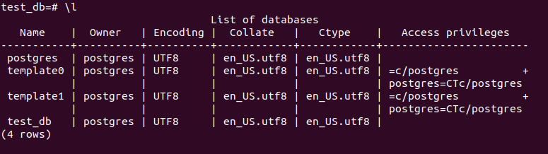
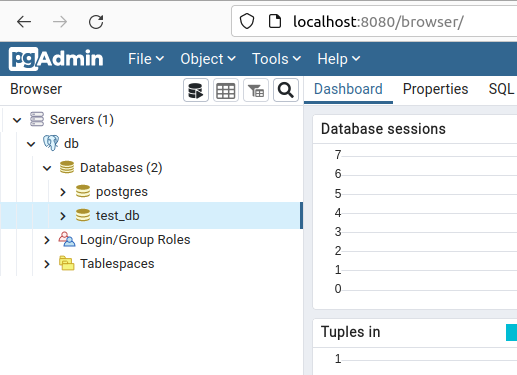

# Домашнее задание к занятию "6.2. SQL"

## Введение

Перед выполнением задания вы можете ознакомиться с 
[дополнительными материалами](https://github.com/netology-code/virt-homeworks/tree/master/additional/README.md).

## Задача 1

Используя docker поднимите инстанс PostgreSQL (версию 12) c 2 volume, 
в который будут складываться данные БД и бэкапы.

Приведите получившуюся команду или docker-compose манифест.

---

docker-compose файл с postgres 12.11 и pgadmin4 6.9

```yaml
version: "3.9"
services:
  db:
    image: postgres:12.11
    container_name: db
    mem_limit: 1536MB
    mem_reservation: 1G
    environment:
      POSTGRES_DB: postgres
      POSTGRES_USER: postgres
      POSTGRES_PASSWORD: postgres
      PGDATA: /var/lib/postgresql/data
    ports:
    - "5442:5432"
    volumes:
    - ./db-data:/var/lib/postgresql/data
    - ./db-backup:/var/lib/postgresql/backup
    restart: always

  pgadmin:
    image: dpage/pgadmin4:6.9
    container_name: pgadmin
    environment:
      PGADMIN_DEFAULT_EMAIL: postgres@postgres.ru
      PGADMIN_DEFAULT_PASSWORD: postgres
      PGADMIN_LISTEN_PORT: 80
    ports:
    - "8080:80"
    restart: always
    links:
    - db:pgsql-server
    volumes:
    - ./pgadmin-data:/var/lib/pgadmin

```

Подключение к bash контейнера с postgres

```bash
vagrant@server1:~/06-02$ docker-compose exec db bash
root@25cfa6aa46e8:/# su postgres
postgres@25cfa6aa46e8:/$ psql
psql (12.11 (Debian 12.11-1.pgdg110+1))
Type "help" for help.

postgres=# 
```


---

## Задача 2

В БД из задачи 1: 
- создайте пользователя test-admin-user и БД test_db
- в БД test_db создайте таблицу orders и clients (спeцификация таблиц ниже)
- предоставьте привилегии на все операции пользователю test-admin-user на таблицы БД test_db
- создайте пользователя test-simple-user  
- предоставьте пользователю test-simple-user права на SELECT/INSERT/UPDATE/DELETE данных таблиц БД test_db

Таблица orders:
- id (serial primary key)
- наименование (string)
- цена (integer)

Таблица clients:
- id (serial primary key)
- фамилия (string)
- страна проживания (string, index)
- заказ (foreign key orders)

Приведите:
- итоговый список БД после выполнения пунктов выше,
- описание таблиц (describe)
- SQL-запрос для выдачи списка пользователей с правами над таблицами test_db
- список пользователей с правами над таблицами test_db

---

В БД из задачи 1: 
- создайте пользователя test-admin-user и БД test_db

Создаем БД `test_db`
```sql
postgres=# CREATE DATABASE "test_db";
CREATE DATABASE
```

Создаем пользователя `test-admin-user`

```sql
postgres=# CREATE USER "test-admin-user" WITH PASSWORD 'postgres';
CREATE ROLE
```

- в БД test_db создайте таблицу orders и clients (спeцификация таблиц ниже)

Подключаемся к БД `test_db`
```sql
postgres=# \c test_db
You are now connected to database "test_db" as user "postgres".
```

Создаем таблицы. Тут не особо понятно зачем имена таблиц на русском языке, и на что ссылается внешний ключ, по логике сделал на id.

```sql
test_db=# CREATE TABLE orders (id SERIAL PRIMARY KEY, наименование VARCHAR(30), цена INT);
CREATE TABLE
test_db=# CREATE TABLE clients (id SERIAL PRIMARY KEY, фамилия VARCHAR(30), страна VARCHAR(30), заказ INT, FOREIGN KEY(заказ) REFERENCES orders(id));
CREATE TABLE
test_db=# CREATE INDEX indcount ON clients (страна);
CREATE INDEX
```

- предоставьте привилегии на все операции пользователю test-admin-user на таблицы БД test_db

Предоставляем привелегии:

```sql
test_db=# GRANT ALL PRIVILEGES ON ALL TABLES IN SCHEMA public TO "test-admin-user";
GRANT
```
- создайте пользователя test-simple-user  

Создаем пользователя:

```sql
test_db=# CREATE USER "test-simple-user" WITH PASSWORD 'postgres';
CREATE ROLE
```

- предоставьте пользователю test-simple-user права на SELECT/INSERT/UPDATE/DELETE данных таблиц БД test_db

Предоставляем права:

```sql
test_db=# GRANT SELECT, UPDATE, INSERT, DELETE ON ALL TABLES IN SCHEMA public TO "test-simple-user";
GRANT
```

Таблица orders:
- id (serial primary key)
- наименование (string)
- цена (integer)

Таблица clients:
- id (serial primary key)
- фамилия (string)
- страна проживания (string, index)
- заказ (foreign key orders)

Приведите:
- итоговый список БД после выполнения пунктов выше,




- описание таблиц (describe)


- SQL-запрос для выдачи списка пользователей с правами над таблицами test_db

Предложу такой:

```sql
test_db=# SELECT * FROM information_schema.table_privileges WHERE grantee IN ('test-admin-user','test-simple-user');
```


- список пользователей с правами над таблицами test_db

Не понятно что нужно, чем отличается от предыдущего пункта?

Предложу такое:


---

## Задача 3

Используя SQL синтаксис - наполните таблицы следующими тестовыми данными:

Таблица orders

|Наименование|цена|
|------------|----|
|Шоколад| 10 |
|Принтер| 3000 |
|Книга| 500 |
|Монитор| 7000|
|Гитара| 4000|

Таблица clients

|ФИО|Страна проживания|
|------------|----|
|Иванов Иван Иванович| USA |
|Петров Петр Петрович| Canada |
|Иоганн Себастьян Бах| Japan |
|Ронни Джеймс Дио| Russia|
|Ritchie Blackmore| Russia|

Используя SQL синтаксис:
- вычислите количество записей для каждой таблицы 
- приведите в ответе:
    - запросы 
    - результаты их выполнения.

---

Наполняем таблицу `orders`

```sql
test_db=# INSERT INTO orders (наименование, цена) values  ('Шоколад', 10), ('Принтер', 3000), ('Книга', 500), ('Монитор', 7000), ('Гитара', 4000);
INSERT 0 5
```

Наполняем таблицу `orders`

```sql
test_db=# INSERT INTO clients (фамилия, страна) values  ('Иванов Иван Иванович', 'USA'), ('Петров Петр Петрович', 'Canada'), ('Иоганн Себастьян Бах', 'Japan'), ('Ронни Джеймс Дио', 'Russia'), ('Ritchie Blackmore', 'Russia');
INSERT 0 5
```

Количество записей для каждой таблицы 

```sql
test_db=# SELECT COUNT(*) FROM orders;
 count 
-------
     5
(1 row)

test_db=# SELECT COUNT(*) FROM clients;
 count 
-------
     5
(1 row)

```

---

## Задача 4

Часть пользователей из таблицы clients решили оформить заказы из таблицы orders.

Используя foreign keys свяжите записи из таблиц, согласно таблице:

|ФИО|Заказ|
|------------|----|
|Иванов Иван Иванович| Книга |
|Петров Петр Петрович| Монитор |
|Иоганн Себастьян Бах| Гитара |

Приведите SQL-запросы для выполнения данных операций.

Приведите SQL-запрос для выдачи всех пользователей, которые совершили заказ, а также вывод данного запроса.
 
Подсказка - используйте директиву `UPDATE`.

---

Связываем таблицы:

```sql
test_db=# UPDATE clients SET заказ = 3 WHERE фамилия = 'Иванов Иван Иванович';
UPDATE 1
test_db=# UPDATE clients SET заказ = 4 WHERE фамилия = 'Петров Петр Петрович';
UPDATE 1
test_db=# UPDATE clients SET заказ = 5 WHERE фамилия = 'Иоганн Себастьян Бах';
UPDATE 1
```

Все пользователи совершившие заказ:

```sql
test_db=# SELECT * from clients WHERE заказ is not NULL;
 id |       фамилия        | страна | заказ 
----+----------------------+--------+-------
  1 | Иванов Иван Иванович | USA    |     3
  2 | Петров Петр Петрович | Canada |     4
  3 | Иоганн Себастьян Бах | Japan  |     5
(3 rows)

```

---

## Задача 5

Получите полную информацию по выполнению запроса выдачи всех пользователей из задачи 4 
(используя директиву EXPLAIN).

Приведите получившийся результат и объясните что значат полученные значения.

---

```sql
test_db=# EXPLAIN SELECT * from clients WHERE заказ is not NULL;
                         QUERY PLAN                         
------------------------------------------------------------
 Seq Scan on clients  (cost=0.00..14.20 rows=418 width=164)
   Filter: ("заказ" IS NOT NULL)
(2 rows)
```

EXPLAIN сообщает, что используется Seq Scan — последовательное чтение данных из таблицы, блок за блоком.

`cost` - некое абстрактное понятие, призванное оценить затратность операции. Первое значение 0.00 — затраты на получение первой строки. Второе — 14.20 — затраты на получение всех строк.

`rows` — приблизительное количество возвращаемых строк при выполнении операции Seq Scan. Это значение возвращает планировщик.

`width` — средний размер одной строки в байтах.

`Filter` - собственно фильтр.


---

## Задача 6

Создайте бэкап БД test_db и поместите его в volume, предназначенный для бэкапов (см. Задачу 1).

Остановите контейнер с PostgreSQL (но не удаляйте volumes).

Поднимите новый пустой контейнер с PostgreSQL.

Восстановите БД test_db в новом контейнере.

Приведите список операций, который вы применяли для бэкапа данных и восстановления. 

---

Бэкап. В первом контейнере.

```bash
test_db=# exit
postgres@25cfa6aa46e8:/$ exit
exit
root@25cfa6aa46e8:/# pg_dump -U postgres -С test_db  > /var/lib/postgresql/backup/test_db-backup_01.06.2022.sql
```

Т.к. использую docker-compose, добавлю в docker-compose файл еще один сервис, то только с 1 volume (./db-backup)

```yaml
version: "3.9"
services:
  db:
    image: postgres:12.11
    container_name: db
    mem_limit: 1536MB
    mem_reservation: 1G
    environment:
      POSTGRES_DB: postgres
      POSTGRES_USER: postgres
      POSTGRES_PASSWORD: postgres
      PGDATA: /var/lib/postgresql/data
    ports:
    - "5442:5432"
    volumes:
    - ./db-data:/var/lib/postgresql/data
    - ./db-backup:/var/lib/postgresql/backup
    restart: always

  db_backup:
    image: postgres:12.11
    container_name: db_backup
    mem_limit: 1536MB
    mem_reservation: 1G
    environment:
      POSTGRES_DB: postgres
      POSTGRES_USER: postgres
      POSTGRES_PASSWORD: postgres
      PGDATA: /var/lib/postgresql/data
    ports:
    - "5443:5432"
    volumes:
    - ./db-backup:/var/lib/postgresql/backup
    restart: always

  pgadmin:
    image: dpage/pgadmin4:6.9
    container_name: pgadmin
    environment:
      PGADMIN_DEFAULT_EMAIL: postgres@postgres.ru
      PGADMIN_DEFAULT_PASSWORD: postgres
      PGADMIN_LISTEN_PORT: 80
    ports:
    - "8080:80"
    restart: always
    links:
    - db:pgsql-server
    - db_backup:pgsql-server-backup
    volumes:
    - ./pgadmin-data:/var/lib/pgadmin
```

```bash
vagrant@server1:~/06-02$ docker-compose up -d
[+] Running 3/3
 \u283f Container db_backup  Started                                                               2.8s
 \u283f Container pgadmin    Started                                                               3.1s
 \u283f Container db         Started                                                               1.5s
vagrant@server1:~/06-02$ docker-compose ps -a
NAME                COMMAND                  SERVICE             STATUS              PORTS
db                  "docker-entrypoint.s\u2026"   db                  running             0.0.0.0:5442->5432/tcp, :::5442->5432/tcp
db_backup           "docker-entrypoint.s\u2026"   db_backup           running             0.0.0.0:5443->5432/tcp, :::5443->5432/tcp
pgadmin             "/entrypoint.sh"         pgadmin             running             0.0.0.0:8080->80/tcp, :::8080->80/tcp
```

Заходим во второй контейнер и восстанавливаем бэкап

```bash
root@25cfa6aa46e8:/# vagrant@server1:~/06-02$ docker-compose exec db_backup bash
root@543cb7dea522:/# psql -U postgres -f /var/lib/postgresql/backup/test_db-backup_01.06.2022.sql

```


---

---

### Как cдавать задание

Выполненное домашнее задание пришлите ссылкой на .md-файл в вашем репозитории.

---
