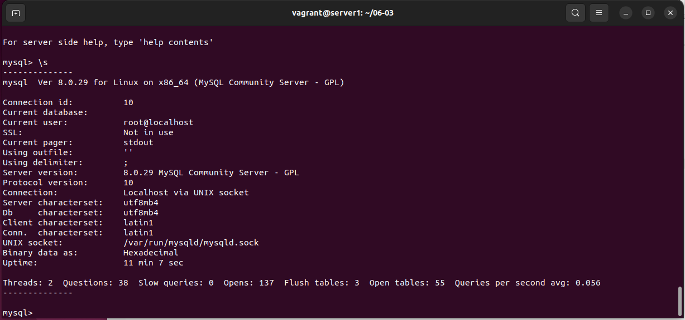

# Домашнее задание к занятию "6.3. MySQL"

## Введение

Перед выполнением задания вы можете ознакомиться с 
[дополнительными материалами](https://github.com/netology-code/virt-homeworks/tree/master/additional/README.md).

## Задача 1

Используя docker поднимите инстанс MySQL (версию 8). Данные БД сохраните в volume.

Изучите [бэкап БД](https://github.com/netology-code/virt-homeworks/tree/master/06-db-03-mysql/test_data) и 
восстановитесь из него.

Перейдите в управляющую консоль `mysql` внутри контейнера.

Используя команду `\h` получите список управляющих команд.

Найдите команду для выдачи статуса БД и **приведите в ответе** из ее вывода версию сервера БД.

Подключитесь к восстановленной БД и получите список таблиц из этой БД.

**Приведите в ответе** количество записей с `price` > 300.

В следующих заданиях мы будем продолжать работу с данным контейнером.

---

>Используя docker поднимите инстанс MySQL (версию 8). Данные БД сохраните в volume.

Использую docker-compose

Содержимое docker-compose [файла](scripts/docker-compose.yaml)

```yaml
version: "3.9"
services:
  db:
    image: mysql:8.0.29
    mem_limit: 1536MB
    mem_reservation: 1G
    command: --default-authentication-plugin=mysql_native_password
    environment:
      MYSQL_ROOT_PASSWORD: mysql
    ports:
    - "3306:3306"
    volumes:
    - ./mysql_datadir:/var/lib/mysql
    restart: always
    
  adminer:
    image: adminer
    ports:
    - "8080:8080"
    restart: always
```

Запускаем контейнеры

```bash
vagrant@server1:~/06-03$ docker-compose up -d
[+] Running 2/2
 ⠿ Container 06-03-db-1       Started                                      4.2s
 ⠿ Container 06-03-adminer-1  Started                                      1.6s
```

Список запущенных контейнеров

```bash
vagrant@server1:~/06-03$ docker-compose ps -a
NAME                COMMAND                  SERVICE             STATUS              PORTS
06-03-adminer-1     "entrypoint.sh docke…"   adminer             running             0.0.0.0:8080->8080/tcp, :::8080->8080/tcp
06-03-db-1          "docker-entrypoint.s…"   db                  running             0.0.0.0:3306->3306/tcp, :::3306->3306/tcp
```

>Изучите [бэкап БД](https://github.com/netology-code/virt-homeworks/tree/master/06-db-03-mysql/test_data) и 
восстановитесь из него.

Заходим в контейнер и подключаемся к MySQL

```bash
vagrant@server1:~/06-03$ docker-compose exec db bash
root@5c08422447a2:/# mysql -p
Enter password: 
Welcome to the MySQL monitor.  Commands end with ; or \g.
Your MySQL connection id is 8
Server version: 8.0.29 MySQL Community Server - GPL

Copyright (c) 2000, 2022, Oracle and/or its affiliates.

Oracle is a registered trademark of Oracle Corporation and/or its
affiliates. Other names may be trademarks of their respective
owners.

Type 'help;' or '\h' for help. Type '\c' to clear the current input statement.
```
Создаем БД и выходим

```sql
mysql> CREATE DATABASE test_db;
Query OK, 1 row affected (0.05 sec)

mysql> exit
Bye
```

Восстанавливаем БД

```bash
root@5c08422447a2:/# mysql -p test_db  < /var/lib/mysql/test_dump.sql
Enter password: 
```

>Перейдите в управляющую консоль `mysql` внутри контейнера.

Переходим

```bash
root@5c08422447a2:/# mysql -p
Enter password: 
Welcome to the MySQL monitor.  Commands end with ; or \g.
Your MySQL connection id is 10
Server version: 8.0.29 MySQL Community Server - GPL

Copyright (c) 2000, 2022, Oracle and/or its affiliates.

Oracle is a registered trademark of Oracle Corporation and/or its
affiliates. Other names may be trademarks of their respective
owners.

Type 'help;' or '\h' for help. Type '\c' to clear the current input statement.
```

>Используя команду `\h` получите список управляющих команд.

Получаем список

```sql
mysql> \h

For information about MySQL products and services, visit:
   http://www.mysql.com/
For developer information, including the MySQL Reference Manual, visit:
   http://dev.mysql.com/
To buy MySQL Enterprise support, training, or other products, visit:
   https://shop.mysql.com/

List of all MySQL commands:
Note that all text commands must be first on line and end with ';'
?         (\?) Synonym for `help'.
clear     (\c) Clear the current input statement.
connect   (\r) Reconnect to the server. Optional arguments are db and host.
delimiter (\d) Set statement delimiter.
edit      (\e) Edit command with $EDITOR.
ego       (\G) Send command to mysql server, display result vertically.
exit      (\q) Exit mysql. Same as quit.
go        (\g) Send command to mysql server.
help      (\h) Display this help.
nopager   (\n) Disable pager, print to stdout.
notee     (\t) Don't write into outfile.
pager     (\P) Set PAGER [to_pager]. Print the query results via PAGER.
print     (\p) Print current command.
prompt    (\R) Change your mysql prompt.
quit      (\q) Quit mysql.
rehash    (\#) Rebuild completion hash.
source    (\.) Execute an SQL script file. Takes a file name as an argument.
status    (\s) Get status information from the server.
system    (\!) Execute a system shell command.
tee       (\T) Set outfile [to_outfile]. Append everything into given outfile.
use       (\u) Use another database. Takes database name as argument.
charset   (\C) Switch to another charset. Might be needed for processing binlog with multi-byte charsets.
warnings  (\W) Show warnings after every statement.
nowarning (\w) Don't show warnings after every statement.
resetconnection(\x) Clean session context.
query_attributes Sets string parameters (name1 value1 name2 value2 ...) for the next query to pick up.
ssl_session_data_print Serializes the current SSL session data to stdout or file

For server side help, type 'help contents'
```

Найдите команду для выдачи статуса БД и **приведите в ответе** из ее вывода версию сервера БД.

Команда `\s`, первая строка - версия сервера БД

```sql
mysql> \s
--------------
mysql  Ver 8.0.29 for Linux on x86_64 (MySQL Community Server - GPL)

Connection id:		10
Current database:	
Current user:		root@localhost
SSL:			Not in use
Current pager:		stdout
Using outfile:		''
Using delimiter:	;
Server version:		8.0.29 MySQL Community Server - GPL
Protocol version:	10
Connection:		Localhost via UNIX socket
Server characterset:	utf8mb4
Db     characterset:	utf8mb4
Client characterset:	latin1
Conn.  characterset:	latin1
UNIX socket:		/var/run/mysqld/mysqld.sock
Binary data as:		Hexadecimal
Uptime:			11 min 7 sec

Threads: 2  Questions: 38  Slow queries: 0  Opens: 137  Flush tables: 3  Open tables: 55  Queries per second avg: 0.056
--------------
```



>Подключитесь к восстановленной БД и получите список таблиц из этой БД.

Подключаемся к БД

```sql
mysql> \u test_db
Reading table information for completion of table and column names
You can turn off this feature to get a quicker startup with -A

Database changed
```

Получаем список таблиц

```sql
mysql> SHOW TABLES;
+-------------------+
| Tables_in_test_db |
+-------------------+
| orders            |
+-------------------+
1 row in set (0.01 sec)
```


>**Приведите в ответе** количество записей с `price` > 300.

Количество записей

```sql
mysql> SELECT COUNT(*) FROM orders WHERE `price` > 300;
+----------+
| COUNT(*) |
+----------+
|        1 |
+----------+
1 row in set (0.01 sec)
```


Сами записи

```sql
mysql> SELECT * FROM orders WHERE `price` > 300;
+----+----------------+-------+
| id | title          | price |
+----+----------------+-------+
|  2 | My little pony |   500 |
+----+----------------+-------+
1 row in set (0.00 sec)
```


>В следующих заданиях мы будем продолжать работу с данным контейнером.


---

## Задача 2

Создайте пользователя test в БД c паролем test-pass, используя:
- плагин авторизации mysql_native_password
- срок истечения пароля - 180 дней 
- количество попыток авторизации - 3 
- максимальное количество запросов в час - 100
- аттрибуты пользователя:
    - Фамилия "Pretty"
    - Имя "James"

Предоставьте привелегии пользователю `test` на операции SELECT базы `test_db`.
    
Используя таблицу INFORMATION_SCHEMA.USER_ATTRIBUTES получите данные по пользователю `test` и 
**приведите в ответе к задаче**.

---

>Создайте пользователя test в БД c паролем test-pass, используя:
>- плагин авторизации mysql_native_password
>- срок истечения пароля - 180 дней 
>- количество попыток авторизации - 3 
>- максимальное количество запросов в час - 100
>- аттрибуты пользователя:
>    - Фамилия "Pretty"
>    - Имя "James"

Официальная [документация](https://dev.mysql.com/doc/refman/8.0/en/create-user.html)

Создаем пользователя

```sql
mysql> CREATE USER 'test'@'localhost' IDENTIFIED WITH mysql_native_password BY 'test-pass' WITH MAX_QUERIES_PER_HOUR 100 PASSWORD EXPIRE INTERVAL 180 DAY FAILED_LOGIN_ATTEMPTS 3 ATTRIBUTE '{"fname": "James", "lname": "Pretty"}';
Query OK, 0 rows affected (0.09 sec)
```
где

`DENTIFIED WITH mysql_native_password` - плагин авторизации mysql_native_password

`MAX_QUERIES_PER_HOUR 100` - максимальное количество запросов в час - 100

`PASSWORD EXPIRE INTERVAL 180` - срок истечения пароля - 180 дней 

`DAY FAILED_LOGIN_ATTEMPTS 3` - количество попыток авторизации - 3 

`ATTRIBUTE '{"fname": "James", "lname": "Pretty"}` - аттрибуты пользователя


>Предоставьте привелегии пользователю `test` на операции SELECT базы `test_db`.
 
Предоставляем привилегии    

```sql
mysql> GRANT SELECT ON test_db.*  TO 'test'@'localhost';
Query OK, 0 rows affected, 1 warning (0.06 sec)
```


>Используя таблицу INFORMATION_SCHEMA.USER_ATTRIBUTES получите данные по пользователю `test` и 

Данные по пользователю

```sql
mysql> SELECT * FROM INFORMATION_SCHEMA.USER_ATTRIBUTES WHERE USER = 'test' AND HOST = 'localhost';
+------+-----------+---------------------------------------+
| USER | HOST      | ATTRIBUTE                             |
+------+-----------+---------------------------------------+
| test | localhost | {"fname": "James", "lname": "Pretty"} |
+------+-----------+---------------------------------------+
1 row in set (0.00 sec)
```


---

## Задача 3

Установите профилирование `SET profiling = 1`.
Изучите вывод профилирования команд `SHOW PROFILES;`.

Исследуйте, какой `engine` используется в таблице БД `test_db` и **приведите в ответе**.

Измените `engine` и **приведите время выполнения и запрос на изменения из профайлера в ответе**:
- на `MyISAM`
- на `InnoDB`

---

>Установите профилирование `SET profiling = 1`.
>Изучите вывод профилирования команд `SHOW PROFILES;`.

С версии 5.0.37 MySQL включает возможность профайлинга запросов. 

Данная утилита записывает статистику выполнения запросов в служебную БД information_schema

Для того, чтобы MySQL начал записывать статистику по запросу следует установить значение `SET profiling = 1`

```sql
mysql> SET profiling = 1;
Query OK, 0 rows affected, 1 warning (0.01 sec)

mysql> SHOW PROFILES;
Empty set, 1 warning (0.00 sec)

mysql> SHOW PROFILES;
Empty set, 1 warning (0.01 sec)

```

После этого выполняем интересующие нас SQL запрос(ы).

```sql
mysql> SELECT COUNT(*) FROM orders WHERE `price` > 300;
+----------+
| COUNT(*) |
+----------+
|        1 |
+----------+
1 row in set (0.01 sec)
```

Далее выполняем запрос `SHOW PROFILES;`

```sql
mysql> SHOW PROFILES;
+----------+------------+-------------------------------------------------+
| Query_ID | Duration   | Query                                           |
+----------+------------+-------------------------------------------------+
|        1 | 0.00586150 | SELECT COUNT(*) FROM orders WHERE `price` > 300 |
+----------+------------+-------------------------------------------------+
1 row in set, 1 warning (0.00 sec)
```


Так же можно вывести более подробную статистику о запросе `show profile for query 1;`

```sql
mysql> show profile for query 1;
+--------------------------------+----------+
| Status                         | Duration |
+--------------------------------+----------+
| starting                       | 0.000373 |
| Executing hook on transaction  | 0.000027 |
| starting                       | 0.000058 |
| checking permissions           | 0.000051 |
| Opening tables                 | 0.001131 |
| init                           | 0.000042 |
| System lock                    | 0.000067 |
| optimizing                     | 0.000072 |
| statistics                     | 0.000137 |
| preparing                      | 0.000189 |
| executing                      | 0.002538 |
| end                            | 0.000016 |
| query end                      | 0.000009 |
| waiting for handler commit     | 0.001035 |
| closing tables                 | 0.000038 |
| freeing items                  | 0.000060 |
| cleaning up                    | 0.000022 |
+--------------------------------+----------+
17 rows in set, 1 warning (0.02 sec)
```


>Исследуйте, какой `engine` используется в таблице БД `test_db` и **приведите в ответе**.

Посмотри какой движок

```sql
mysql> SELECT ENGINE FROM information_schema.TABLES where TABLE_SCHEMA = 'test_db';
+--------+
| ENGINE |
+--------+
| InnoDB |
+--------+
1 row in set (0.01 sec)
```


>Измените `engine` и **приведите время выполнения и запрос на изменения из профайлера в ответе**:
>- на `MyISAM`
>- на `InnoDB`

Изменяем на `MyISAM`

```sql
mysql> ALTER TABLE orders ENGINE = MyISAM;
Query OK, 5 rows affected (0.17 sec)
Records: 5  Duplicates: 0  Warnings: 0
```


Профайлер

```sql
mysql> SHOW PROFILES;
+----------+------------+-----------------------------------------------------------------------------+
| Query_ID | Duration   | Query                                                                       |
+----------+------------+-----------------------------------------------------------------------------+
|        1 | 0.00586150 | SELECT COUNT(*) FROM orders WHERE `price` > 300                             |
|        2 | 0.01175950 | SELECT ENGINE FROM information_schema.TABLES where TABLE_SCHEMA = 'test_db' |
|        3 | 0.16350300 | ALTER TABLE orders ENGINE = MyISAM                                          |
+----------+------------+-----------------------------------------------------------------------------+
3 rows in set, 1 warning (0.00 sec)

mysql> show profile for query 3;
+--------------------------------+----------+
| Status                         | Duration |
+--------------------------------+----------+
| starting                       | 0.001579 |
| Executing hook on transaction  | 0.000029 |
| starting                       | 0.000179 |
| checking permissions           | 0.000030 |
| checking permissions           | 0.000025 |
| init                           | 0.000088 |
| Opening tables                 | 0.002541 |
| setup                          | 0.000343 |
| creating table                 | 0.002936 |
| waiting for handler commit     | 0.000021 |
| waiting for handler commit     | 0.013169 |
| After create                   | 0.002574 |
| System lock                    | 0.000024 |
| copy to tmp table              | 0.000357 |
| waiting for handler commit     | 0.000024 |
| waiting for handler commit     | 0.000029 |
| waiting for handler commit     | 0.000078 |
| rename result table            | 0.000114 |
| waiting for handler commit     | 0.041802 |
| waiting for handler commit     | 0.000027 |
| waiting for handler commit     | 0.012063 |
| waiting for handler commit     | 0.000015 |
| waiting for handler commit     | 0.041581 |
| waiting for handler commit     | 0.000021 |
| waiting for handler commit     | 0.009207 |
| end                            | 0.026370 |
| query end                      | 0.007543 |
| closing tables                 | 0.000016 |
| waiting for handler commit     | 0.000028 |
| freeing items                  | 0.000621 |
| cleaning up                    | 0.000073 |
+--------------------------------+----------+
31 rows in set, 1 warning (0.00 sec)
```


Изменяем назад на `InnoDB`

```sql
mysql> ALTER TABLE orders ENGINE = InnoDB;
Query OK, 5 rows affected (0.26 sec)
Records: 5  Duplicates: 0  Warnings: 0
```


Профайлер

```sql
mysql> SHOW PROFILES;
+----------+------------+-----------------------------------------------------------------------------+
| Query_ID | Duration   | Query                                                                       |
+----------+------------+-----------------------------------------------------------------------------+
|        1 | 0.00586150 | SELECT COUNT(*) FROM orders WHERE `price` > 300                             |
|        2 | 0.01175950 | SELECT ENGINE FROM information_schema.TABLES where TABLE_SCHEMA = 'test_db' |
|        3 | 0.16350300 | ALTER TABLE orders ENGINE = MyISAM                                          |
|        4 | 0.25781425 | ALTER TABLE orders ENGINE = InnoDB                                          |
+----------+------------+-----------------------------------------------------------------------------+
4 rows in set, 1 warning (0.01 sec)

mysql> show profile for query 4;
+--------------------------------+----------+
| Status                         | Duration |
+--------------------------------+----------+
| starting                       | 0.002473 |
| Executing hook on transaction  | 0.000045 |
| starting                       | 0.000185 |
| checking permissions           | 0.000944 |
| checking permissions           | 0.001734 |
| init                           | 0.000104 |
| Opening tables                 | 0.001159 |
| setup                          | 0.001962 |
| creating table                 | 0.000398 |
| After create                   | 0.101981 |
| System lock                    | 0.000050 |
| copy to tmp table              | 0.000373 |
| rename result table            | 0.005310 |
| waiting for handler commit     | 0.000021 |
| waiting for handler commit     | 0.017325 |
| waiting for handler commit     | 0.000025 |
| waiting for handler commit     | 0.065899 |
| waiting for handler commit     | 0.000030 |
| waiting for handler commit     | 0.025901 |
| waiting for handler commit     | 0.000025 |
| waiting for handler commit     | 0.016872 |
| end                            | 0.000961 |
| query end                      | 0.009415 |
| closing tables                 | 0.000014 |
| waiting for handler commit     | 0.002205 |
| freeing items                  | 0.002346 |
| cleaning up                    | 0.000059 |
+--------------------------------+----------+
27 rows in set, 1 warning (0.00 sec)
```


---

## Задача 4 

Изучите файл `my.cnf` в директории /etc/mysql.

Измените его согласно ТЗ (движок InnoDB):
- Скорость IO важнее сохранности данных
- Нужна компрессия таблиц для экономии места на диске
- Размер буффера с незакомиченными транзакциями 1 Мб
- Буффер кеширования 30% от ОЗУ
- Размер файла логов операций 100 Мб

Приведите в ответе измененный файл `my.cnf`.

---

>Изучите файл `my.cnf` в директории /etc/mysql.

Исходный файл

```bash
# Copyright (c) 2017, Oracle and/or its affiliates. All rights reserved.
#
# This program is free software; you can redistribute it and/or modify
# it under the terms of the GNU General Public License as published by
# the Free Software Foundation; version 2 of the License.
#
# This program is distributed in the hope that it will be useful,
# but WITHOUT ANY WARRANTY; without even the implied warranty of
# MERCHANTABILITY or FITNESS FOR A PARTICULAR PURPOSE.  See the
# GNU General Public License for more details.
#
# You should have received a copy of the GNU General Public License
# along with this program; if not, write to the Free Software
# Foundation, Inc., 51 Franklin St, Fifth Floor, Boston, MA  02110-1301 USA

#
# The MySQL  Server configuration file.
#
# For explanations see
# http://dev.mysql.com/doc/mysql/en/server-system-variables.html

[mysqld]
pid-file        = /var/run/mysqld/mysqld.pid
socket          = /var/run/mysqld/mysqld.sock
datadir         = /var/lib/mysql
secure-file-priv= NULL

# Custom config should go here
!includedir /etc/mysql/conf.d/
```

[Документация](https://dev.mysql.com/doc/refman/8.0/en/innodb-parameters.html)


>Измените его согласно ТЗ (движок InnoDB):

`default_storage_engine = InnoDB`

>- Скорость IO важнее сохранности данных

`innodb_flush_log_at_trx_commit = 2`

>- Нужна компрессия таблиц для экономии места на диске

`have_compress = YES`

>- Размер буффера с незакомиченными транзакциями 1 Мб

`innodb_log_buffer_size = 1048576`

>- Буффер кеширования 30% от ОЗУ

Памяти у машины 4Гб, т.е. 4026100 Кб, значит

`innodb_buffer_pool_size = 1236817920`

>- Размер файла логов операций 100 Мб

`innodb_log_file_size = 104857600`

>Приведите в ответе измененный файл `my.cnf`.

[Файл](scripts/my.cnf) `my.cnf`
```bash
# Copyright (c) 2017, Oracle and/or its affiliates. All rights reserved.
#
# This program is free software; you can redistribute it and/or modify
# it under the terms of the GNU General Public License as published by
# the Free Software Foundation; version 2 of the License.
#
# This program is distributed in the hope that it will be useful,
# but WITHOUT ANY WARRANTY; without even the implied warranty of
# MERCHANTABILITY or FITNESS FOR A PARTICULAR PURPOSE.  See the
# GNU General Public License for more details.
#
# You should have received a copy of the GNU General Public License
# along with this program; if not, write to the Free Software
# Foundation, Inc., 51 Franklin St, Fifth Floor, Boston, MA  02110-1301 USA

#
# The MySQL  Server configuration file.
#
# For explanations see
# http://dev.mysql.com/doc/mysql/en/server-system-variables.html

[mysqld]
pid-file        = /var/run/mysqld/mysqld.pid
socket          = /var/run/mysqld/mysqld.sock
datadir         = /var/lib/mysql
secure-file-priv= NULL

default_storage_engine = InnoDB
innodb_flush_log_at_trx_commit = 2
have_compress = YES
innodb_log_buffer_size = 1048576
innodb_buffer_pool_size = 1236817920
innodb_log_file_size = 104857600

# Custom config should go here
!includedir /etc/mysql/conf.d/
```

---

---

### Как оформить ДЗ?

Выполненное домашнее задание пришлите ссылкой на .md-файл в вашем репозитории.

---
