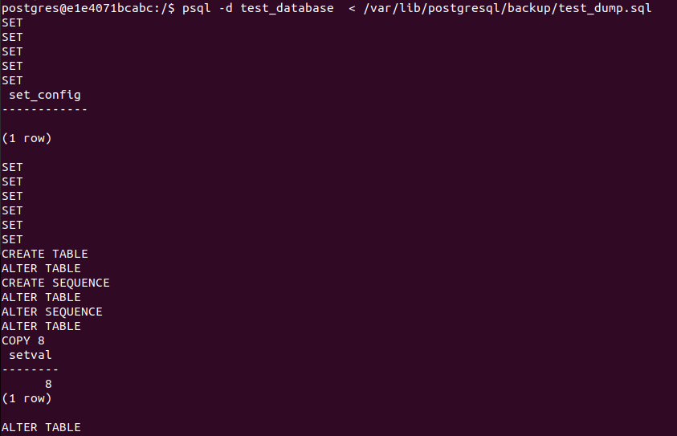
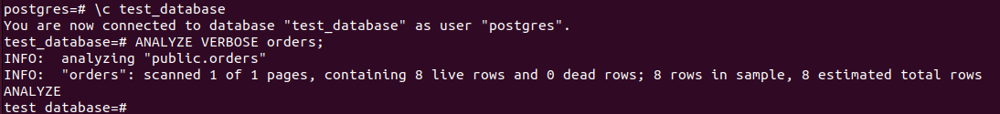
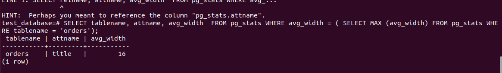
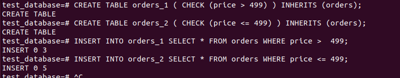
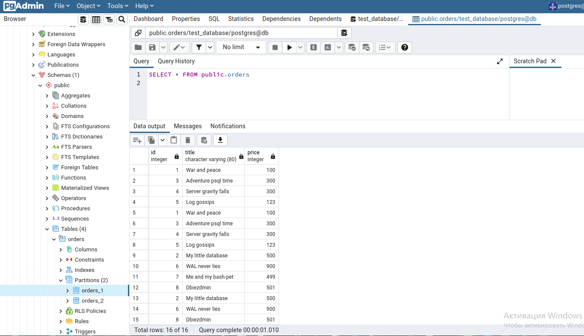
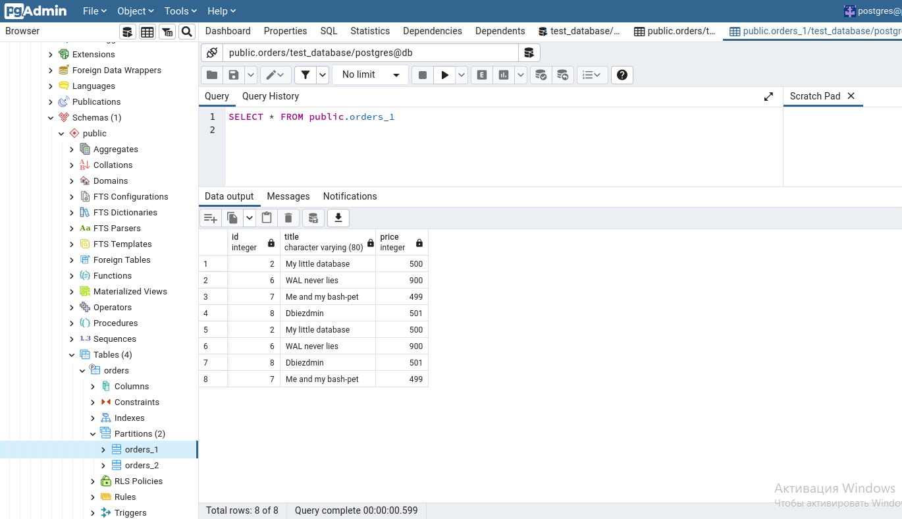
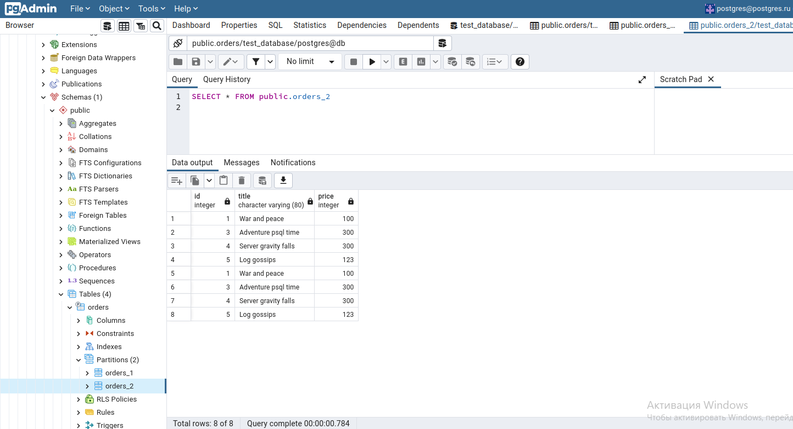
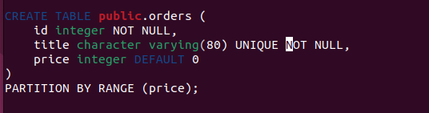
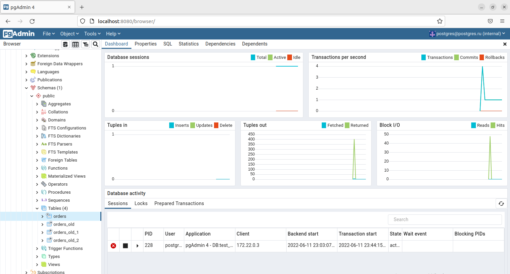

# Домашнее задание к занятию "6.4. PostgreSQL"

## Задача 1

Используя docker поднимите инстанс PostgreSQL (версию 13). Данные БД сохраните в volume.

Подключитесь к БД PostgreSQL используя `psql`.

Воспользуйтесь командой `\?` для вывода подсказки по имеющимся в `psql` управляющим командам.

**Найдите и приведите** управляющие команды для:
- вывода списка БД
- подключения к БД
- вывода списка таблиц
- вывода описания содержимого таблиц
- выхода из psql

---

Использую docker-compose

Содержимое docker-compose [файла](scripts/docker-compose.yaml)

```yaml
version: "3.9"
services:
  db:
    image: postgres:13.7
    container_name: db_pg
    mem_limit: 1536MB
    mem_reservation: 1G
    environment:
      POSTGRES_DB: postgres
      POSTGRES_USER: postgres
      POSTGRES_PASSWORD: postgres
      PGDATA: /var/lib/postgresql/data
    ports:
    - "5442:5432"
    volumes:
    - ./db-data:/var/lib/postgresql/data
    - ./db-backup:/var/lib/postgresql/backup
    restart: always

  pgadmin:
    image: dpage/pgadmin4:6.10
    container_name: pgadmin_pg
    environment:
      PGADMIN_DEFAULT_EMAIL: postgres@postgres.ru
      PGADMIN_DEFAULT_PASSWORD: postgres
      PGADMIN_LISTEN_PORT: 80
    ports:
    - "8080:80"
    restart: always
    links:
    - db:pgsql-server
    volumes:
    - ./pgadmin-data:/var/lib/pgadmin
```

Запускаем контейнеры

```bash
vagrant@server1:~/06-04$ docker-compose up -d
[+] Running 3/3
 ⠿ Network 06-04_default  Created                                                                                          0.3s
 ⠿ Container db_pg        Started                                                                                          1.9s
 ⠿ Container pgadmin_pg   Started                                                                                          2.8s
vagrant@server1:~/06-04$ docker-compose ps -a
NAME                COMMAND                  SERVICE             STATUS              PORTS
db_pg               "docker-entrypoint.s…"   db                  running             0.0.0.0:5442->5432/tcp, :::5442->5432/tcp
pgadmin_pg          "/entrypoint.sh"         pgadmin             running             0.0.0.0:8080->80/tcp, :::8080->80/tcp
```

Копируем бекап

```bash
vagrant@server1:~/06-04$ sudo cp /vagrant/06-04/test_dump.sql db-backup/test_dump.sql
```

Подключаемся к контейнеру и заходим в postgres

```bash
vagrant@server1:~/06-04$ docker-compose exec db bash
root@e1e4071bcabc:/# su postgres
postgres@e1e4071bcabc:/$ psql
psql (13.7 (Debian 13.7-1.pgdg110+1))
Type "help" for help.
```


<details>
  <summary>Список комманд</summary>

```bash
postgres=# \?
General
  \copyright             show PostgreSQL usage and distribution terms
  \crosstabview [COLUMNS] execute query and display results in crosstab
  \errverbose            show most recent error message at maximum verbosity
  \g [(OPTIONS)] [FILE]  execute query (and send results to file or |pipe);
                         \g with no arguments is equivalent to a semicolon
  \gdesc                 describe result of query, without executing it
  \gexec                 execute query, then execute each value in its result
  \gset [PREFIX]         execute query and store results in psql variables
  \gx [(OPTIONS)] [FILE] as \g, but forces expanded output mode
  \q                     quit psql
  \watch [SEC]           execute query every SEC seconds

Help
  \? [commands]          show help on backslash commands
  \? options             show help on psql command-line options
  \? variables           show help on special variables
  \h [NAME]              help on syntax of SQL commands, * for all commands

Query Buffer
  \e [FILE] [LINE]       edit the query buffer (or file) with external editor
  \ef [FUNCNAME [LINE]]  edit function definition with external editor
  \ev [VIEWNAME [LINE]]  edit view definition with external editor
  \p                     show the contents of the query buffer
  \r                     reset (clear) the query buffer
  \s [FILE]              display history or save it to file
  \w FILE                write query buffer to file

Input/Output
  \copy ...              perform SQL COPY with data stream to the client host
  \echo [-n] [STRING]    write string to standard output (-n for no newline)
  \i FILE                execute commands from file
  \ir FILE               as \i, but relative to location of current script
  \o [FILE]              send all query results to file or |pipe
  \qecho [-n] [STRING]   write string to \o output stream (-n for no newline)
  \warn [-n] [STRING]    write string to standard error (-n for no newline)

Conditional
  \if EXPR               begin conditional block
  \elif EXPR             alternative within current conditional block
  \else                  final alternative within current conditional block
  \endif                 end conditional block

Informational
  (options: S = show system objects, + = additional detail)
  \d[S+]                 list tables, views, and sequences
  \d[S+]  NAME           describe table, view, sequence, or index
  \da[S]  [PATTERN]      list aggregates
  \dA[+]  [PATTERN]      list access methods
  \dAc[+] [AMPTRN [TYPEPTRN]]  list operator classes
  \dAf[+] [AMPTRN [TYPEPTRN]]  list operator families
  \dAo[+] [AMPTRN [OPFPTRN]]   list operators of operator families
  \dAp[+] [AMPTRN [OPFPTRN]]   list support functions of operator families
  \db[+]  [PATTERN]      list tablespaces
  \dc[S+] [PATTERN]      list conversions
  \dC[+]  [PATTERN]      list casts
  \dd[S]  [PATTERN]      show object descriptions not displayed elsewhere
  \dD[S+] [PATTERN]      list domains
  \ddp    [PATTERN]      list default privileges
  \dE[S+] [PATTERN]      list foreign tables
  \det[+] [PATTERN]      list foreign tables
  \des[+] [PATTERN]      list foreign servers
  \deu[+] [PATTERN]      list user mappings
  \dew[+] [PATTERN]      list foreign-data wrappers
  \df[anptw][S+] [PATRN] list [only agg/normal/procedures/trigger/window] functions
  \dF[+]  [PATTERN]      list text search configurations
  \dFd[+] [PATTERN]      list text search dictionaries
  \dFp[+] [PATTERN]      list text search parsers
  \dFt[+] [PATTERN]      list text search templates
  \dg[S+] [PATTERN]      list roles
  \di[S+] [PATTERN]      list indexes
  \dl                    list large objects, same as \lo_list
  \dL[S+] [PATTERN]      list procedural languages
  \dm[S+] [PATTERN]      list materialized views
  \dn[S+] [PATTERN]      list schemas
  \do[S+] [PATTERN]      list operators
  \dO[S+] [PATTERN]      list collations
  \dp     [PATTERN]      list table, view, and sequence access privileges
  \dP[itn+] [PATTERN]    list [only index/table] partitioned relations [n=nested]
  \drds [PATRN1 [PATRN2]] list per-database role settings
  \dRp[+] [PATTERN]      list replication publications
  \dRs[+] [PATTERN]      list replication subscriptions
  \ds[S+] [PATTERN]      list sequences
  \dt[S+] [PATTERN]      list tables
  \dT[S+] [PATTERN]      list data types
  \du[S+] [PATTERN]      list roles
  \dv[S+] [PATTERN]      list views
  \dx[+]  [PATTERN]      list extensions
  \dy[+]  [PATTERN]      list event triggers
  \l[+]   [PATTERN]      list databases
  \sf[+]  FUNCNAME       show a function's definition
  \sv[+]  VIEWNAME       show a view's definition
  \z      [PATTERN]      same as \dp

Formatting
  \a                     toggle between unaligned and aligned output mode
  \C [STRING]            set table title, or unset if none
  \f [STRING]            show or set field separator for unaligned query output
  \H                     toggle HTML output mode (currently off)
  \pset [NAME [VALUE]]   set table output option
                         (border|columns|csv_fieldsep|expanded|fieldsep|
                         fieldsep_zero|footer|format|linestyle|null|
                         numericlocale|pager|pager_min_lines|recordsep|
                         recordsep_zero|tableattr|title|tuples_only|
                         unicode_border_linestyle|unicode_column_linestyle|
                         unicode_header_linestyle)
  \t [on|off]            show only rows (currently off)
  \T [STRING]            set HTML <table> tag attributes, or unset if none
  \x [on|off|auto]       toggle expanded output (currently off)

Connection
  \c[onnect] {[DBNAME|- USER|- HOST|- PORT|-] | conninfo}
                         connect to new database (currently "postgres")
  \conninfo              display information about current connection
  \encoding [ENCODING]   show or set client encoding
  \password [USERNAME]   securely change the password for a user

Operating System
  \cd [DIR]              change the current working directory
  \setenv NAME [VALUE]   set or unset environment variable
  \timing [on|off]       toggle timing of commands (currently off)
  \! [COMMAND]           execute command in shell or start interactive shell

Variables
  \prompt [TEXT] NAME    prompt user to set internal variable
  \set [NAME [VALUE]]    set internal variable, or list all if no parameters
  \unset NAME            unset (delete) internal variable

Large Objects
  \lo_export LOBOID FILE
  \lo_import FILE [COMMENT]
  \lo_list
  \lo_unlink LOBOID      large object operations
```
</details>

>- вывода списка БД

```sql
postgres=# \l
                                 List of databases
   Name    |  Owner   | Encoding |  Collate   |   Ctype    |   Access privileges   
-----------+----------+----------+------------+------------+-----------------------
 postgres  | postgres | UTF8     | en_US.utf8 | en_US.utf8 | 
 template0 | postgres | UTF8     | en_US.utf8 | en_US.utf8 | =c/postgres          +
           |          |          |            |            | postgres=CTc/postgres
 template1 | postgres | UTF8     | en_US.utf8 | en_US.utf8 | =c/postgres          +
           |          |          |            |            | postgres=CTc/postgres
(3 rows)
```

>- подключения к БД

```sql
postgres=# \c postgres
You are now connected to database "postgres" as user "postgres".
```

>- вывода списка таблиц

```sql
postgres=# \dt
```

>- вывода описания содержимого таблиц

```sql
postgres=# \d+
```

>- выхода из psql

```sql
postgres=# \q
```

---

## Задача 2

Используя `psql` создайте БД `test_database`.

Изучите [бэкап БД](https://github.com/netology-code/virt-homeworks/tree/master/06-db-04-postgresql/test_data).

Восстановите бэкап БД в `test_database`.

Перейдите в управляющую консоль `psql` внутри контейнера.

Подключитесь к восстановленной БД и проведите операцию ANALYZE для сбора статистики по таблице.

Используя таблицу [pg_stats](https://postgrespro.ru/docs/postgresql/12/view-pg-stats), найдите столбец таблицы `orders` 
с наибольшим средним значением размера элементов в байтах.

**Приведите в ответе** команду, которую вы использовали для вычисления и полученный результат.

---

>Используя `psql` создайте БД `test_database`.

```sql
postgres=# CREATE DATABASE "test_database";
CREATE DATABASE
```

>Изучите [бэкап БД](https://github.com/netology-code/virt-homeworks/tree/master/06-db-04-postgresql/test_data).

Изучил

>Восстановите бэкап БД в `test_database`.

```sql
postgres@e1e4071bcabc:/$ psql -d test_database  < /var/lib/postgresql/backup/test_dump.sql
SET
SET
SET
SET
SET
 set_config 
------------
 
(1 row)

SET
SET
SET
SET
SET
SET
CREATE TABLE
ALTER TABLE
CREATE SEQUENCE
ALTER TABLE
ALTER SEQUENCE
ALTER TABLE
COPY 8
 setval 
--------
      8
(1 row)

ALTER TABLE
```



>Перейдите в управляющую консоль `psql` внутри контейнера.

```bash
postgres@e1e4071bcabc:/$ psql
psql (13.7 (Debian 13.7-1.pgdg110+1))
Type "help" for help.
```

>Подключитесь к восстановленной БД и проведите операцию ANALYZE для сбора статистики по таблице.

```sql
postgres=# \c test_database
You are now connected to database "test_database" as user "postgres".
test_database=# ANALYZE VERBOSE orders;
INFO:  analyzing "public.orders"
INFO:  "orders": scanned 1 of 1 pages, containing 8 live rows and 0 dead rows; 8 rows in sample, 8 estimated total rows
ANALYZE
```



>Используя таблицу [pg_stats](https://postgrespro.ru/docs/postgresql/12/view-pg-stats), найдите столбец таблицы `orders` 
с наибольшим средним значением размера элементов в байтах.

>**Приведите в ответе** команду, которую вы использовали для вычисления и полученный результат.

```sql
test_database=# SELECT tablename, attname, avg_width FROM pg_stats WHERE avg_width = ( SELECT MAX (avg_width) FROM pg_stats WHERE tablename = 'orders');
 tablename | attname | avg_width 
-----------+---------+-----------
 orders    | title   |        16
(1 row)
```



---

## Задача 3

Архитектор и администратор БД выяснили, что ваша таблица orders разрослась до невиданных размеров и
поиск по ней занимает долгое время. Вам, как успешному выпускнику курсов DevOps в нетологии предложили
провести разбиение таблицы на 2 (шардировать на orders_1 - price>499 и orders_2 - price<=499).

Предложите SQL-транзакцию для проведения данной операции.

Можно ли было изначально исключить "ручное" разбиение при проектировании таблицы orders?

---

>Предложите SQL-транзакцию для проведения данной операции.

Создаем две таблицы с наследованием и проверкой, заполняем их

```sql
test_database=# CREATE TABLE orders_1 ( CHECK (price > 499) ) INHERITS (orders);
CREATE TABLE
test_database=# CREATE TABLE orders_2 ( CHECK (price <= 499) ) INHERITS (orders);
CREATE TABLE
test_database=# INSERT INTO orders_1 SELECT * FROM orders WHERE price >  499;
INSERT 0 3
test_database=# INSERT INTO orders_2 SELECT * FROM orders WHERE price <= 499;
INSERT 0 5
```



>Можно ли было изначально исключить "ручное" разбиение при проектировании таблицы orders?

Да, нужно было ее спроектировать как секционированную

```sql
CREATE TABLE orders (
    id integer NOT NULL,
    title character varying(80) NOT NULL,
    price integer DEFAULT 0
) PARTITION BY RANGE (price);

CREATE TABLE orders_1 PARTITION OF orders FOR VALUES FROM (499) TO (MAXVALUE);
CREATE TABLE orders_2 PARTITION OF orders FOR VALUES FROM (MINVALUE) TO (499);
```

Можно ее пересоздать и заполнить значениями из старой

```sql
test_database=# ALTER TABLE orders RENAME TO orders_old;
ALTER TABLE
test_database=# ALTER TABLE orders_1 RENAME TO orders_old_1;
ALTER TABLE
test_database=# ALTER TABLE orders_2 RENAME TO orders_old_2;
ALTER TABLE

test_database=# CREATE TABLE orders (id integer NOT NULL, title character varying(80) NOT NULL, price integer DEFAULT 0) PARTITION BY RANGE(price);
CREATE TABLE
test_database=# CREATE TABLE orders_1 PARTITION OF orders FOR VALUES FROM (499) TO (MAXVALUE);
CREATE TABLE
test_database=# CREATE TABLE orders_2 PARTITION OF orders FOR VALUES FROM (MINVALUE) TO (499);
CREATE TABLE
test_database=# INSERT INTO orders (id, title, price) SELECT * FROM orders_old;
INSERT 0 16
```

Таблица `orders`



Секция `orders_1



Секция `orders_2`



---

## Задача 4

Используя утилиту `pg_dump` создайте бекап БД `test_database`.

Как бы вы доработали бэкап-файл, чтобы добавить уникальность значения столбца `title` для таблиц `test_database`?

---

>Используя утилиту `pg_dump` создайте бекап БД `test_database`.

```bash
test_database=# \q
postgres@e1e4071bcabc:/$ exit
exit
root@e1e4071bcabc:/# pg_dump -U postgres test_database  > /var/lib/postgresql/backup/test_dump_new.sql
```

[Дамп](scripts/test_dump_new.sql)

>Как бы вы доработали бэкап-файл, чтобы добавить уникальность значения столбца `title` для таблиц `test_database`?

Добавил бы у таблиц свойство `UNIQUE`

```sql
CREATE TABLE public.orders (
    id integer NOT NULL,
    title character varying(80) UNIQUE NOT NULL,
    price integer DEFAULT 0
)
PARTITION BY RANGE (price);
```



Итог



---

---

### Как cдавать задание

Выполненное домашнее задание пришлите ссылкой на .md-файл в вашем репозитории.

---
