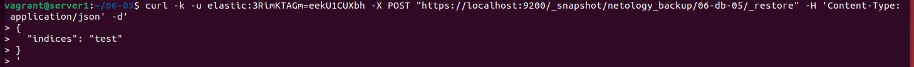

# Домашнее задание к занятию "6.5. Elasticsearch"

## Задача 1

В этом задании вы потренируетесь в:
- установке elasticsearch
- первоначальном конфигурировании elastcisearch
- запуске elasticsearch в docker

Используя докер образ [centos:7](https://hub.docker.com/_/centos) как базовый и 
[документацию по установке и запуску Elastcisearch](https://www.elastic.co/guide/en/elasticsearch/reference/current/targz.html):

- составьте Dockerfile-манифест для elasticsearch
- соберите docker-образ и сделайте `push` в ваш docker.io репозиторий
- запустите контейнер из получившегося образа и выполните запрос пути `/` c хост-машины

Требования к `elasticsearch.yml`:
- данные `path` должны сохраняться в `/var/lib`
- имя ноды должно быть `netology_test`

В ответе приведите:
- текст Dockerfile манифеста
- ссылку на образ в репозитории dockerhub
- ответ `elasticsearch` на запрос пути `/` в json виде

Подсказки:
- возможно вам понадобится установка пакета perl-Digest-SHA для корректной работы пакета shasum
- при сетевых проблемах внимательно изучите кластерные и сетевые настройки в elasticsearch.yml
- при некоторых проблемах вам поможет docker директива ulimit
- elasticsearch в логах обычно описывает проблему и пути ее решения

Далее мы будем работать с данным экземпляром elasticsearch.

---

Скачиваем docker-образ CentOS 7

```bash
vagrant@server1:~/06-05$ sudo docker pull centos:7
7: Pulling from library/centos
2d473b07cdd5: Pull complete 
Digest: sha256:c73f515d06b0fa07bb18d8202035e739a494ce760aa73129f60f4bf2bd22b407
Status: Downloaded newer image for centos:7
docker.io/library/centos:7
```

Для сборки образа с elasticsearch 8.2.3 используем данный [манифест](scripts/Dockerfile), руководствуясь инструкцией по установке:

```bash
FROM centos:7

LABEL ElasticSearch Netology kofe88
ENV ES_HOME elasticsearch

ENV JAVA_HOME /elasticsearch/jdk/

ENV PATH=/usr/lib:/usr/lib/jvm/jre-11/bin:/elasticsearch/bin:$PATH

RUN yum update -y && yum upgrade -y

RUN yum install -y java-11-openjdk wget curl perl-Digest-SHA

RUN cd /home \
    && wget https://artifacts.elastic.co/downloads/elasticsearch/elasticsearch-8.2.3-linux-x86_64.tar.gz \
    && wget https://artifacts.elastic.co/downloads/elasticsearch/elasticsearch-8.2.3-linux-x86_64.tar.gz.sha512

RUN cd /home && \
    shasum -a 512 -c elasticsearch-8.2.3-linux-x86_64.tar.gz.sha512 \
    && tar -xzf elasticsearch-8.2.3-linux-x86_64.tar.gz \
    && mv elasticsearch-8.2.3 /elasticsearch


ADD elasticsearch.yml /elasticsearch/config/elasticsearch.yml


RUN groupadd elasticsearch \
    && useradd -g elasticsearch elasticsearch
RUN chown -R elasticsearch:elasticsearch /elasticsearch
RUN mkdir /var/lib/logs \
    && mkdir /var/lib/logs/elasticsearch \
    && chown elasticsearch:elasticsearch /var/lib/logs/elasticsearch
RUN mkdir /var/lib/data \
    && mkdir /var/lib/data/elasticsearch \
    && chown elasticsearch:elasticsearch /var/lib/data/elasticsearch
RUN mkdir /elasticsearch/snapshots \
    && chown elasticsearch:elasticsearch /elasticsearch/snapshots
    

USER elasticsearch
CMD ["elasticsearch"]
```

В Dockerfile уже внесено создание директории snapshots, т.к. это уже финальный вариант, после 3-й задачи.

Изменим дефолтный `elasticsearch.yml` и используем [elasticsearch.yml](scripts/elasticsearch.yml) следующего содержания (с учетом 3-й задачи)

<details>
  <summary>Дефолтный elasticsearch.yml</summary>

```yaml
# ======================== Elasticsearch Configuration =========================
#
# NOTE: Elasticsearch comes with reasonable defaults for most settings.
#       Before you set out to tweak and tune the configuration, make sure you
#       understand what are you trying to accomplish and the consequences.
#
# The primary way of configuring a node is via this file. This template lists
# the most important settings you may want to configure for a production cluster.
#
# Please consult the documentation for further information on configuration options:
# https://www.elastic.co/guide/en/elasticsearch/reference/index.html
#
# ---------------------------------- Cluster -----------------------------------
#
# Use a descriptive name for your cluster:
#
#cluster.name: my-application
#
# ------------------------------------ Node ------------------------------------
#
# Use a descriptive name for the node:
#
#node.name: node-1
#
# Add custom attributes to the node:
#
#node.attr.rack: r1
#
# ----------------------------------- Paths ------------------------------------
#
# Path to directory where to store the data (separate multiple locations by comma):
#
#path.data: /path/to/data
#
# Path to log files:
#
#path.logs: /path/to/logs
#
# ----------------------------------- Memory -----------------------------------
#
# Lock the memory on startup:
#
#bootstrap.memory_lock: true
#
# Make sure that the heap size is set to about half the memory available
# on the system and that the owner of the process is allowed to use this
# limit.
#
# Elasticsearch performs poorly when the system is swapping the memory.
#
# ---------------------------------- Network -----------------------------------
#
# By default Elasticsearch is only accessible on localhost. Set a different
# address here to expose this node on the network:
#
#network.host: 192.168.0.1
#
# By default Elasticsearch listens for HTTP traffic on the first free port it
# finds starting at 9200. Set a specific HTTP port here:
#
#http.port: 9200
#
# For more information, consult the network module documentation.
#
# --------------------------------- Discovery ----------------------------------
#
# Pass an initial list of hosts to perform discovery when this node is started:
# The default list of hosts is ["127.0.0.1", "[::1]"]
#
#discovery.seed_hosts: ["host1", "host2"]
#
# Bootstrap the cluster using an initial set of master-eligible nodes:
#
#cluster.initial_master_nodes: ["node-1", "node-2"]
#
# For more information, consult the discovery and cluster formation module documentation.
#
# --------------------------------- Readiness ----------------------------------
#
# Enable an unauthenticated TCP readiness endpoint on localhost
#
#readiness.port: 9399
#
# ---------------------------------- Various -----------------------------------
#
# Allow wildcard deletion of indices:
#
#action.destructive_requires_name: false
```

</details>

```yaml
# ------------------------------------ Node ------------------------------------
node.name: netology_test
node.roles: [ master, data ]
#
# ---------------------------------- Network -----------------------------------
network.host: 0.0.0.0
http.port: 9200
# ----------------------------------- Paths ------------------------------------
path.data: /var/lib/data/elasticsearch
path.logs: /var/lib/logs/elasticsearch
path.repo: /elasticsearch/snapshots
```
Соберем образ

```bash
vagrant@server1:~/06-05$ docker build --rm -t kofe88/elasticsearch:8.2.3-06-db-05 .
Sending build context to Docker daemon  4.096kB
Step 1/16 : FROM centos:7
 ---> eeb6ee3f44bd
Step 2/16 : LABEL ElasticSearch Netology kofe88
 ---> Using cache
 ---> f8ce0e2f6bad
Step 3/16 : ENV ES_HOME elasticsearch
 ---> Using cache
 ---> eb59d12da4be
Step 4/16 : ENV JAVA_HOME /elasticsearch/jdk/
 ---> Using cache
 ---> 8717a5fdce2e
Step 5/16 : ENV PATH=/usr/lib:/usr/lib/jvm/jre-11/bin:/elasticsearch/bin:$PATH
 ---> Using cache
 ---> 561435e41e1c
Step 6/16 : RUN yum update -y && yum upgrade -y
 ---> Using cache
 ---> ab75a98e38cc
Step 7/16 : RUN yum install -y java-11-openjdk wget curl perl-Digest-SHA
 ---> Using cache
 ---> f0f3b2e040f2
Step 8/16 : RUN cd /home     && wget https://artifacts.elastic.co/downloads/elasticsearch/elasticsearch-8.2.3-linux-x86_64.tar.gz     && wget https://artifacts.elastic.co/downloads/elasticsearch/elasticsearch-8.2.3-linux-x86_64.tar.gz.sha512
 ---> Using cache
 ---> 75baed2eca33
Step 9/16 : RUN cd /home &&     shasum -a 512 -c elasticsearch-8.2.3-linux-x86_64.tar.gz.sha512     && tar -xzf elasticsearch-8.2.3-linux-x86_64.tar.gz     && mv elasticsearch-8.2.3 /elasticsearch
 ---> Using cache
 ---> 728aa79dd7d3
Step 10/16 : ADD elasticsearch.yml /elasticsearch/config/elasticsearch.yml
 ---> 62e46afbfab8
Step 11/16 : RUN groupadd elasticsearch     && useradd -g elasticsearch elasticsearch
 ---> Running in 5a2e0791ccc0
Removing intermediate container 5a2e0791ccc0
 ---> b6e2a3128f71
Step 12/16 : RUN chown -R elasticsearch:elasticsearch /elasticsearch
 ---> Running in a244867a394b
Removing intermediate container a244867a394b
 ---> 24686ba75afb
Step 13/16 : RUN mkdir /var/lib/logs     && mkdir /var/lib/logs/elasticsearch     && chown elasticsearch:elasticsearch /var/lib/logs/elasticsearch
 ---> Running in 83fb75aa3d06
Removing intermediate container 83fb75aa3d06
 ---> 1788a22b8ad8
Step 14/16 : RUN mkdir /var/lib/data     && mkdir /var/lib/data/elasticsearch     && chown elasticsearch:elasticsearch /var/lib/data/elasticsearch
 ---> Running in e18046e2fc70
Removing intermediate container e18046e2fc70
 ---> 213bdbcb2315
Step 15/16 : USER elasticsearch
 ---> Running in 73c31da707f6
Removing intermediate container 73c31da707f6
 ---> 1adba5e1e65a
Step 16/16 : CMD ["elasticsearch"]
 ---> Running in 21fb90c79e3d
Removing intermediate container 21fb90c79e3d
 ---> 0f6305d21c12
Successfully built 0f6305d21c12
Successfully tagged kofe88/elasticsearch:8.2.3-06-db-05
```

Столкнулся с ошибкой, после запуска контейнера elasticsearch не стартовал и контейнер останавливался, помогла данная [статья](https://www.elastic.co/guide/en/elasticsearch/reference/current/vm-max-map-count.html) 

```bash
vagrant@server1:~/06-05$ sudo sysctl -w vm.max_map_count=262144
vm.max_map_count = 262144
```

Далее зайдем в контейнер, сбросим пароль и выйдем из контейнера

```bash
vagrant@server1:~/06-05$ docker exec -it 06-db-05-kofe88 bash
[elasticsearch@c5a44ecfc363 /]$ elasticsearch-reset-password -u elastic
warning: ignoring JAVA_HOME=/elasticsearch/jdk/; using bundled JDK
This tool will reset the password of the [elastic] user to an autogenerated value.
The password will be printed in the console.
Please confirm that you would like to continue [y/N]y


Password for the [elastic] user successfully reset.
New value: DB-EsBl63aiZF4gT5DbE

[elasticsearch@c5a44ecfc363 /]$ exit
exit
```


Запустим контейнер, прокинем порт 9200

```bash
vagrant@server1:~/06-05$ docker run --rm --name 06-db-05-kofe88 -p 9200:9200 -d kofe88/elasticsearch:8.2.3-06-db-05
c5a44ecfc3637faf90ca378c42b62d352e8f0dc7b9acb81c2d01e74e8892b7c3
```

>ответ `elasticsearch` на запрос пути `/` в json виде

```bash
vagrant@server1:~/06-05$ curl -k -u elastic https://localhost:9200
Enter host password for user 'elastic':
{
  "name" : "netology_test",
  "cluster_name" : "elasticsearch",
  "cluster_uuid" : "8avNRQHkTeancryZFHbIjw",
  "version" : {
    "number" : "8.2.3",
    "build_flavor" : "default",
    "build_type" : "tar",
    "build_hash" : "9905bfb62a3f0b044948376b4f607f70a8a151b4",
    "build_date" : "2022-06-08T22:21:36.455508792Z",
    "build_snapshot" : false,
    "lucene_version" : "9.1.0",
    "minimum_wire_compatibility_version" : "7.17.0",
    "minimum_index_compatibility_version" : "7.0.0"
  },
  "tagline" : "You Know, for Search"
}
```


Запушим образ на Dockerhub

```bash
vagrant@server1:~/06-05$ docker push kofe88/elasticsearch:8.2.3-06-db-05
The push refers to repository [docker.io/kofe88/elasticsearch]
53a4952eec71: Pushed 
87bc10f5ab86: Pushed 
b01b347e349d: Pushed 
42d22593cc8e: Pushed 
04b76c15902c: Pushed 
d9d7f19a1b53: Pushed 
59f1987f53c1: Layer already exists 
fcfbcd1dc24f: Layer already exists 
4406cd5b2dfd: Layer already exists 
f3d3dd18a7a5: Layer already exists 
174f56854903: Layer already exists 
8.2.3-06-db-05: digest: sha256:647e3bb6f774d357da51b4674622cdef9cd91b01b4a8bc239ec55e207d0f5f9a size: 2630
```

[Ссылка](https://hub.docker.com/repository/docker/kofe88/elasticsearch/tags?page=1&ordering=last_updated) на образ. На самом деле это образ запушенный уже с учетом 3-го задания из данной работы, не вижу смысла в образе без `path.repo` .


---

## Задача 2

В этом задании вы научитесь:
- создавать и удалять индексы
- изучать состояние кластера
- обосновывать причину деградации доступности данных

Ознакомтесь с [документацией](https://www.elastic.co/guide/en/elasticsearch/reference/current/indices-create-index.html) 
и добавьте в `elasticsearch` 3 индекса, в соответствии со таблицей:

| Имя | Количество реплик | Количество шард |
|-----|-------------------|-----------------|
| ind-1| 0 | 1 |
| ind-2 | 1 | 2 |
| ind-3 | 2 | 4 |

Получите список индексов и их статусов, используя API и **приведите в ответе** на задание.

Получите состояние кластера `elasticsearch`, используя API.

Как вы думаете, почему часть индексов и кластер находится в состоянии yellow?

Удалите все индексы.

**Важно**

При проектировании кластера elasticsearch нужно корректно рассчитывать количество реплик и шард,
иначе возможна потеря данных индексов, вплоть до полной, при деградации системы.

---

>Ознакомтесь с [документацией](https://www.elastic.co/guide/en/elasticsearch/reference/current/indices-create-index.html) 
и добавьте в `elasticsearch` 3 индекса, в соответствии со таблицей:
>
>| Имя | Количество реплик | Количество шард |
>|-----|-------------------|-----------------|
>| ind-1| 0 | 1 |
>| ind-2 | 1 | 2 |
>| ind-3 | 2 | 4 |

Создадим первый индекс

```bash
vagrant@server1:~/06-05$ curl -k -u elastic:DB-EsBl63aiZF4gT5DbE -X PUT "https://localhost:9200/ind-1?pretty" -H 'Content-Type: application/json' -d'
> {
>   "settings": {
>     "index": {
>       "number_of_shards": 1,  
>       "number_of_replicas": 0 
>     }
>   }
> }
> '
{
  "acknowledged" : true,
  "shards_acknowledged" : true,
  "index" : "ind-1"
}
```


Создадим второй индекс 

```bash
vagrant@server1:~/06-05$ curl -k -u elastic:DB-EsBl63aiZF4gT5DbE -X PUT "https://localhost:9200/ind-2?pretty" -H 'Content-Type: application/json' -d'
> {
>   "settings": {
>     "index": {
>       "number_of_shards": 2,  
>       "number_of_replicas": 1 
>     }
>   }
> }
> '
{
  "acknowledged" : true,
  "shards_acknowledged" : true,
  "index" : "ind-2"
}
```


Создадим третий индекс

```bash
vagrant@server1:~/06-05$ curl -k -u elastic:DB-EsBl63aiZF4gT5DbE -X PUT "https://localhost:9200/ind-3?pretty" -H 'Content-Type: application/json' -d'
> {
>   "settings": {
>     "index": {
>       "number_of_shards": 4,  
>       "number_of_replicas": 2 
>     }
>   }
> }
> '
{
  "acknowledged" : true,
  "shards_acknowledged" : true,
  "index" : "ind-3"
}
```


>Получите список индексов и их статусов, используя API и **приведите в ответе** на задание.

Список индексов

```bash
vagrant@server1:~/06-05$ curl -k -u elastic:DB-EsBl63aiZF4gT5DbE -X GET https://localhost:9200/_aliases?pretty=true
{
  ".security-7" : {
    "aliases" : {
      ".security" : {
        "is_hidden" : true
      }
    }
  },
  "ind-1" : {
    "aliases" : { }
  },
  "ind-2" : {
    "aliases" : { }
  },
  "ind-3" : {
    "aliases" : { }
  }
}
```


Статусы индексов

```bash
vagrant@server1:~/06-05$ curl -k -u elastic:DB-EsBl63aiZF4gT5DbE -X GET https://localhost:9200/_cat/indices?pretty=true
green  open ind-1 z0cIcxTLRh2Pme1QBK_fiw 1 0 0 0 225b 225b
yellow open ind-2 U3fOYrUlQciAo6P3vy7fuQ 2 1 0 0 450b 450b
yellow open ind-3 Wk8e9gzITxCZCYpW4oLBBQ 4 2 0 0 900b 900b
```


>Получите состояние кластера `elasticsearch`, используя API.

Состояние кластера

```bash
vagrant@server1:~/06-05$ curl -k -u elastic:DB-EsBl63aiZF4gT5DbE 'https://127.0.0.1:9200/_cluster/health?pretty=true'
{
  "cluster_name" : "elasticsearch",
  "status" : "yellow",
  "timed_out" : false,
  "number_of_nodes" : 1,
  "number_of_data_nodes" : 1,
  "active_primary_shards" : 11,
  "active_shards" : 11,
  "relocating_shards" : 0,
  "initializing_shards" : 0,
  "unassigned_shards" : 10,
  "delayed_unassigned_shards" : 0,
  "number_of_pending_tasks" : 0,
  "number_of_in_flight_fetch" : 0,
  "task_max_waiting_in_queue_millis" : 0,
  "active_shards_percent_as_number" : 52.38095238095239
}
```


>Как вы думаете, почему часть индексов и кластер находится в состоянии yellow?

Ситуация такая же, которую показывали/объясняли в лекции. У нас только одна нода, по этому есть `unassigned_shards`, есть только первые реплики для индексов 2 и 3. А для индекса 1 есть единственная реплика и поэтому с ним всё "хорошо".

```bash
vagrant@server1:~/06-05$ curl -k -u elastic:DB-EsBl63aiZF4gT5DbE -XGET https://localhost:9200/_cat/shards?pretty | grep -i unassigned
  % Total    % Received % Xferd  Average Speed   Time    Time     Time  Current
                                 Dload  Upload   Total   Spent    Left  Speed
100  2159  100  2159    0     0  11071      0 --:--:-- --:--:-- --:--:-- 11071
ind-3                                                         0 r UNASSIGNED                   
ind-3                                                         0 r UNASSIGNED                   
ind-3                                                         1 r UNASSIGNED                   
ind-3                                                         1 r UNASSIGNED                   
ind-3                                                         2 r UNASSIGNED                   
ind-3                                                         2 r UNASSIGNED                   
ind-3                                                         3 r UNASSIGNED                   
ind-3                                                         3 r UNASSIGNED                   
ind-2                                                         0 r UNASSIGNED                   
ind-2                                                         1 r UNASSIGNED    
```


>Удалите все индексы.

Удаляем

```bash
vagrant@server1:~/06-05$ curl -k -u elastic:DB-EsBl63aiZF4gT5DbE -X DELETE "https://localhost:9200/ind-1?pretty"
{
  "acknowledged" : true
}
vagrant@server1:~/06-05$ curl -k -u elastic:DB-EsBl63aiZF4gT5DbE -X DELETE "https://localhost:9200/ind-2?pretty"
{
  "acknowledged" : true
}
vagrant@server1:~/06-05$ curl -k -u elastic:DB-EsBl63aiZF4gT5DbE -X DELETE "https://localhost:9200/ind-3?pretty"
{
  "acknowledged" : true
}
vagrant@server1:~/06-05$ curl -k -u elastic:DB-EsBl63aiZF4gT5DbE -X GET https://localhost:9200/_aliases?pretty=true
{
  ".security-7" : {
    "aliases" : {
      ".security" : {
        "is_hidden" : true
      }
    }
  }
}
```


---

## Задача 3

В данном задании вы научитесь:
- создавать бэкапы данных
- восстанавливать индексы из бэкапов

Создайте директорию `{путь до корневой директории с elasticsearch в образе}/snapshots`.

Используя API [зарегистрируйте](https://www.elastic.co/guide/en/elasticsearch/reference/current/snapshots-register-repository.html#snapshots-register-repository) 
данную директорию как `snapshot repository` c именем `netology_backup`.

**Приведите в ответе** запрос API и результат вызова API для создания репозитория.

Создайте индекс `test` с 0 реплик и 1 шардом и **приведите в ответе** список индексов.

[Создайте `snapshot`](https://www.elastic.co/guide/en/elasticsearch/reference/current/snapshots-take-snapshot.html) 
состояния кластера `elasticsearch`.

**Приведите в ответе** список файлов в директории со `snapshot`ами.

Удалите индекс `test` и создайте индекс `test-2`. **Приведите в ответе** список индексов.

[Восстановите](https://www.elastic.co/guide/en/elasticsearch/reference/current/snapshots-restore-snapshot.html) состояние
кластера `elasticsearch` из `snapshot`, созданного ранее. 

**Приведите в ответе** запрос к API восстановления и итоговый список индексов.

Подсказки:
- возможно вам понадобится доработать `elasticsearch.yml` в части директивы `path.repo` и перезапустить `elasticsearch`

---
>Создайте директорию `{путь до корневой директории с elasticsearch в образе}/snapshots`.

Создаем

```bash
vagrant@server1:~/06-05$ docker exec -it 06-db-05-kofe88 bash
[elasticsearch@c5a44ecfc363 /]$ mkdir /elasticsearch/snapshots
[elasticsearch@c5a44ecfc363 /]$ exit
exit
```

>Используя API [зарегистрируйте](https://www.elastic.co/guide/en/elasticsearch/reference/current/snapshots-register-repository.html#snapshots-register-repository) 
данную директорию как `snapshot repository` c именем `netology_backup`.

Пытаемся зарегистрировать и получаем ошибку:

```bash
vagrant@server1:~/06-05$ curl -k -u elastic:DB-EsBl63aiZF4gT5DbE -X PUT "https://localhost:9200/_snapshot/netology_backup?pretty" -H 'Content-Type: application/json' -d'
> {
>   "type": "fs",
>   "settings": {
>     "location": "/elasticsearch/snapshots"
>   }
> }
> '
{
  "error" : {
    "root_cause" : [
      {
        "type" : "repository_exception",
        "reason" : "[netology_backup] location [/elasticsearch/snapshots] doesn't match any of the locations specified by path.repo because this setting is empty"
      }
    ],
    "type" : "repository_exception",
    "reason" : "[netology_backup] failed to create repository",
    "caused_by" : {
      "type" : "repository_exception",
      "reason" : "[netology_backup] location [/elasticsearch/snapshots] doesn't match any of the locations specified by path.repo because this setting is empty"
    }
  },
  "status" : 500
}
```


Т.к. мы изначально в `Dockerfile` не создали директорию `/elasticsearch/snapshots` и не прописали в `elasticsearch.yml` path.repo к ней. (Мной в первом задании приведены файлы и образ уже с данными изменениями, оставлю ошибку тут для истории)

Пересобрал образ с данными изменениями, запушил его в докерхаб, запускаем, заново сбрасываем пароль

```bash
vagrant@server1:~/06-05$ docker run --rm --name 06-db-05-kofe88 -p 9200:9200 -d kofe88/elasticsearch:8.2.3-06-db-05
f5af637c8c50a86d75e4285ce2b662bb13ac186f599e598d127c9240fb30baef
vagrant@server1:~/06-05$ docker exec -it 06-db-05-kofe88 bash

[elasticsearch@f5af637c8c50 /]$ elasticsearch-reset-password -u elastic
warning: ignoring JAVA_HOME=/elasticsearch/jdk/; using bundled JDK
This tool will reset the password of the [elastic] user to an autogenerated value.
The password will be printed in the console.
Please confirm that you would like to continue [y/N]y


Password for the [elastic] user successfully reset.
New value: 3RimKTAGm=eekU1CUXbh
[elasticsearch@f5af637c8c50 /]$ exit
exit
```

Теперь всё должно получиться.

>**Приведите в ответе** запрос API и результат вызова API для создания репозитория.

Создаем репозиторий

```bash
vagrant@server1:~/06-05$ curl -k -u elastic:3RimKTAGm=eekU1CUXbh -X PUT "https://localhost:9200/_snapshot/netology_backup?pretty" -H 'Content-Type: application/json' -d'
> {
>   "type": "fs",
>   "settings": {
>     "location": "/elasticsearch/snapshots"
>   }
> }
> '
{
  "acknowledged" : true
}
```


>Создайте индекс `test` с 0 реплик и 1 шардом и **приведите в ответе** список индексов.

Создаем индекс `test` 

```bash
vagrant@server1:~/06-05$ curl -k -u elastic:3RimKTAGm=eekU1CUXbh -X PUT "https://localhost:9200/test?pretty" -H 'Content-Type: application/json' -d'
> {
>   "settings": {
>     "index": {
>       "number_of_shards": 1,  
>       "number_of_replicas": 0 
>     }
>   }
> }
> '
{
  "acknowledged" : true,
  "shards_acknowledged" : true,
  "index" : "test"
}
```


Его статус и список индексов

```bash
vagrant@server1:~/06-05$ curl -k -u elastic:3RimKTAGm=eekU1CUXbh -X  GET  "https://localhost:9200/_cat/indices?pretty"
green open test rLp0pSeATPCDbQCK_f-b6w 1 0 0 0 225b 225b
vagrant@server1:~/06-05$ curl -k -u elastic:3RimKTAGm=eekU1CUXbh -X GET https://localhost:9200/_aliases?pretty=true
{
  ".security-7" : {
    "aliases" : {
      ".security" : {
        "is_hidden" : true
      }
    }
  },
  "test" : {
    "aliases" : { }
  }
}
```


>[Создайте `snapshot`](https://www.elastic.co/guide/en/elasticsearch/reference/current/snapshots-take-snapshot.html) 
состояния кластера `elasticsearch`.

Создаем снапшот

```bash
vagrant@server1:~/06-05$ curl -k -u elastic:3RimKTAGm=eekU1CUXbh -X PUT "https://localhost:9200/_snapshot/netology_backup/06-db-05?pretty"
{
  "accepted" : true
}

```


>**Приведите в ответе** список файлов в директории со `snapshot`ами.

Список файлов в директории

```bash
vagrant@server1:~/06-05$ docker exec -it 06-db-05-kofe88 bash
[elasticsearch@f5af637c8c50 /]$ ls /elasticsearch/snapshots
index-0  index.latest  indices  meta-Y_7WfM8RTVO7bKrQ2jSBvQ.dat  snap-Y_7WfM8RTVO7bKrQ2jSBvQ.dat
```


>Удалите индекс `test` и создайте индекс `test-2`. **Приведите в ответе** список индексов.

Удаляем индекс `test`

```bash
vagrant@server1:~/06-05$ curl -k -u elastic:3RimKTAGm=eekU1CUXbh -X DELETE "https://localhost:9200/test"
{
"acknowledged":true
}
```

Создаем индекс `test-2`

```bash
vagrant@server1:~/06-05$ curl -k -u elastic:3RimKTAGm=eekU1CUXbh -X PUT "https://localhost:9200/test-2?pretty" -H 'Content-Type: application/json' -d'
> {
>   "settings": {
>     "index": {
>       "number_of_shards": 1,  
>       "number_of_replicas": 0 
>     }
>   }
> }
> '
{
  "acknowledged" : true,
  "shards_acknowledged" : true,
  "index" : "test-2"
}
```


Список индексов и их статусы

```bash
vagrant@server1:~/06-05$ curl -k -u elastic:3RimKTAGm=eekU1CUXbh -X  GET  "https://localhost:9200/_cat/indices?pretty"
green open test-2 Gzwd9FIZRaqGrEilwaEFuA 1 0 0 0 225b 225b
vagrant@server1:~/06-05$ curl -k -u elastic:3RimKTAGm=eekU1CUXbh -X GET https://localhost:9200/_aliases?pretty=true
{
  ".security-7" : {
    "aliases" : {
      ".security" : {
        "is_hidden" : true
      }
    }
  },
  "test-2" : {
    "aliases" : { }
  }
}
```


>[Восстановите](https://www.elastic.co/guide/en/elasticsearch/reference/current/snapshots-restore-snapshot.html) состояние
кластера `elasticsearch` из `snapshot`, созданного ранее. 

Восстанавливаем состояние 

```bash
vagrant@server1:~/06-05$ curl -k -u elastic:3RimKTAGm=eekU1CUXbh -X POST "https://localhost:9200/_snapshot/netology_backup/06-db-05/_restore" -H 'Content-Type: application/json' -d'
> {
>   "indices": "test"
> }
> '
```



>**Приведите в ответе** запрос к API восстановления и итоговый список индексов.

Список индексов и их состояния

```bash
vagrant@server1:~/06-05$ server1:~/06-05$ curl -k -u elastic:3RimKTAGm=eekU1CUXbh GET  "https://localhost:9200/_cat/indices?pretty"
green open test-2 Gzwd9FIZRaqGrEilwaEFuA 1 0 0 0 225b 225b
green open test   UyA9wnPiQem9usvGKbdFHw 1 0 0 0 225b 225b
vagrant@server1:~/06-05$ curl -k -u elastic:3RimKTAGm=eekU1CUXbh -X GET https://localhost:9200/_aliases?pretty=true
{
  "test" : {
    "aliases" : { }
  },
  ".security-7" : {
    "aliases" : {
      ".security" : {
        "is_hidden" : true
      }
    }
  },
  "test-2" : {
    "aliases" : { }
  }
}
```


---

---

### Как cдавать задание

Выполненное домашнее задание пришлите ссылкой на .md-файл в вашем репозитории.

---
