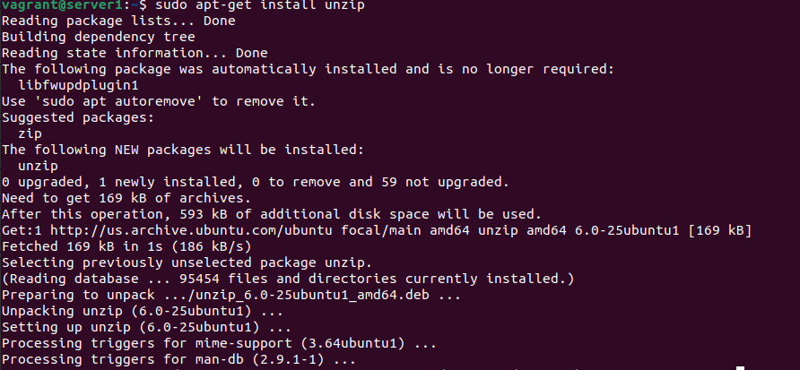

# Домашнее задание к занятию "7.1. Инфраструктура как код"

## Задача 1. Выбор инструментов. 
 
### Легенда
 
Через час совещание на котором менеджер расскажет о новом проекте. Начать работу над которым надо 
будет уже сегодня. 
На данный момент известно, что это будет сервис, который ваша компания будет предоставлять внешним заказчикам.
Первое время, скорее всего, будет один внешний клиент, со временем внешних клиентов станет больше.

Так же по разговорам в компании есть вероятность, что техническое задание еще не четкое, что приведет к большому
количеству небольших релизов, тестирований интеграций, откатов, доработок, то есть скучно не будет.  
   
Вам, как девопс инженеру, будет необходимо принять решение об инструментах для организации инфраструктуры.
На данный момент в вашей компании уже используются следующие инструменты: 
- остатки Сloud Formation, 
- некоторые образы сделаны при помощи Packer,
- год назад начали активно использовать Terraform, 
- разработчики привыкли использовать Docker, 
- уже есть большая база Kubernetes конфигураций, 
- для автоматизации процессов используется Teamcity, 
- также есть совсем немного Ansible скриптов, 
- и ряд bash скриптов для упрощения рутинных задач.  

Для этого в рамках совещания надо будет выяснить подробности о проекте, что бы в итоге определиться с инструментами:

1. Какой тип инфраструктуры будем использовать для этого проекта: изменяемый или не изменяемый?
1. Будет ли центральный сервер для управления инфраструктурой?
1. Будут ли агенты на серверах?
1. Будут ли использованы средства для управления конфигурацией или инициализации ресурсов? 
 
В связи с тем, что проект стартует уже сегодня, в рамках совещания надо будет определиться со всеми этими вопросами.

### В результате задачи необходимо

1. Ответить на четыре вопроса представленных в разделе "Легенда". 
1. Какие инструменты из уже используемых вы хотели бы использовать для нового проекта? 
1. Хотите ли рассмотреть возможность внедрения новых инструментов для этого проекта? 

Если для ответа на эти вопросы недостаточно информации, то напишите какие моменты уточните на совещании.

---

### 1. Ответить на четыре вопроса представленных в разделе "Легенда".

>1. Какой тип инфраструктуры будем использовать для этого проекта: изменяемый или не изменяемый?
 
Неизменяемый - мы уже используем `Terraform`, `Packer`. Значит работаем с шаблонами и инициализацией ресурсов, будем этому следовать.

>2. Будет ли центральный сервер для управления инфраструктурой?

По логике - нет. По факту, тот же ПК с `Terraform`, если им управляют более 1 человека, уже некий "сервер управления инфраструктурой"

>3. Будут ли агенты на серверах?

Нет, есть тот же `Ansible`, будем использовать нативный `ssh` и `push`, раз это у нас уже есть.

>4. Будут ли использованы средства для управления конфигурацией или инициализации ресурсов? 

Конечно - `Terraform` за инициализацию ресурсов, `Ansible` - управление конфигурацией.

### 2. Какие инструменты из уже используемых вы хотели бы использовать для нового проекта? 

`Ansible`, `Terraform`, `Packer`, `Docker` - я думаю для начала подошел бы такой набор.

### 3. Хотите ли рассмотреть возможность внедрения новых инструментов для этого проекта? 

Сначала делаем на том что есть, что уже используем. Если с развитием проекта поймем, что становится много рутинной работы или нехватает инструментов - развиваться дальше.


---

## Задача 2. Установка терраформ. 

Официальный сайт: https://www.terraform.io/

Установите терраформ при помощи менеджера пакетов используемого в вашей операционной системе.
В виде результата этой задачи приложите вывод команды `terraform --version`.

---

Шаг 1. Включаем VPN.

Шаг 2. Добавляем HashiCorp GPG Key

```bash
curl -fsSL https://apt.releases.hashicorp.com/gpg | sudo apt-key add -
```

Шаг 3. Добавляем репозиторий HashiCorp

```bash
sudo apt-add-repository "deb [arch=amd64] https://apt.releases.hashicorp.com $(lsb_release -cs) main"
```

Шаг 4. Обновляем информацию о пакетах и ставим Terraform.

```bash
sudo apt-get update && sudo apt-get install terraform
```

Т.к. Terraform уже у меня установлен на прошлых заданиях, но устарел, просто обновлю его:

Текущая версия

```bash
vagrant@server1:~$ terraform --version
Terraform v1.2.2
on linux_amd64

Your version of Terraform is out of date! The latest version
is 1.2.5. You can update by downloading from https://www.terraform.io/downloads.html
```


Обновляем

```bash
vagrant@server1:~$ sudo apt-get update && sudo apt-get install terraform
Hit:1 http://us.archive.ubuntu.com/ubuntu focal InRelease
Hit:2 http://ppa.launchpad.net/ansible/ansible/ubuntu focal InRelease                                                        
Hit:3 https://download.docker.com/linux/ubuntu focal InRelease                                                               
Hit:4 http://us.archive.ubuntu.com/ubuntu focal-updates InRelease                                      
Get:5 https://apt.releases.hashicorp.com focal InRelease [16.3 kB]
Hit:6 http://us.archive.ubuntu.com/ubuntu focal-backports InRelease
Hit:7 http://us.archive.ubuntu.com/ubuntu focal-security InRelease
Get:8 https://apt.releases.hashicorp.com focal/main amd64 Packages [59.6 kB]
Fetched 75.9 kB in 2s (37.9 kB/s)
Reading package lists... Done
Reading package lists... Done
Building dependency tree       
Reading state information... Done
The following package was automatically installed and is no longer required:
  libfwupdplugin1
Use 'sudo apt autoremove' to remove it.
The following packages will be upgraded:
  terraform
1 upgraded, 0 newly installed, 0 to remove and 59 not upgraded.
Need to get 19.9 MB of archives.
After this operation, 24.6 kB of additional disk space will be used.
Get:1 https://apt.releases.hashicorp.com focal/main amd64 terraform amd64 1.2.5 [19.9 MB]
Fetched 19.9 MB in 6s (3,159 kB/s)                                                                                                     
(Reading database ... 95454 files and directories currently installed.)
Preparing to unpack .../terraform_1.2.5_amd64.deb ...
Unpacking terraform (1.2.5) over (1.2.2) ...
Setting up terraform (1.2.5) ...
```


Обновили

```bash
vagrant@server1:~$ terraform --version
Terraform v1.2.5
on linux_amd64
vagrant@server1:~$ 
```


---

## Задача 3. Поддержка легаси кода. 

В какой-то момент вы обновили терраформ до новой версии, например с 0.12 до 0.13. 
А код одного из проектов настолько устарел, что не может работать с версией 0.13. 
В связи с этим необходимо сделать так, чтобы вы могли одновременно использовать последнюю версию терраформа установленную при помощи
штатного менеджера пакетов и устаревшую версию 0.12. 

В виде результата этой задачи приложите вывод `--version` двух версий терраформа доступных на вашем компьютере 
или виртуальной машине.

---

Находим нужный нам [релиз Terraform](https://releases.hashicorp.com/terraform/)


Допустим `1.1.9` и скачиваем его:

```bash
vagrant@server1:~$ wget https://releases.hashicorp.com/terraform/1.1.9/terraform_1.1.9_linux_amd64.zip
--2022-07-17 22:34:59--  https://releases.hashicorp.com/terraform/1.1.9/terraform_1.1.9_linux_amd64.zip
Resolving releases.hashicorp.com (releases.hashicorp.com)... 151.101.38.49
Connecting to releases.hashicorp.com (releases.hashicorp.com)|151.101.38.49|:443... connected.
HTTP request sent, awaiting response... 200 OK
Length: 19262029 (18M) [application/zip]
Saving to: \u2018terraform_1.1.9_linux_amd64.zip\u2019

terraform_1.1.9_linux_amd64.zip   100%[=============================================================>]  18.37M  8.16MB/s    in 2.2s    

2022-07-17 22:35:02 (8.16 MB/s) - \u2018terraform_1.1.9_linux_amd64.zip\u2019 saved [19262029/19262029]
```


Ставим `unzip` если его еще нет

```bash
vagrant@server1:~$ sudo apt-get install unzip
Reading package lists... Done
Building dependency tree       
Reading state information... Done
The following package was automatically installed and is no longer required:
  libfwupdplugin1
Use 'sudo apt autoremove' to remove it.
Suggested packages:
  zip
The following NEW packages will be installed:
  unzip
0 upgraded, 1 newly installed, 0 to remove and 59 not upgraded.
Need to get 169 kB of archives.
After this operation, 593 kB of additional disk space will be used.
Get:1 http://us.archive.ubuntu.com/ubuntu focal/main amd64 unzip amd64 6.0-25ubuntu1 [169 kB]
Fetched 169 kB in 1s (186 kB/s)
Selecting previously unselected package unzip.
(Reading database ... 95454 files and directories currently installed.)
Preparing to unpack .../unzip_6.0-25ubuntu1_amd64.deb ...
Unpacking unzip (6.0-25ubuntu1) ...
Setting up unzip (6.0-25ubuntu1) ...
Processing triggers for mime-support (3.64ubuntu1) ...
Processing triggers for man-db (2.9.1-1) ...
```



Распаковываем скачанный релиз `Terraform` например в `/usr/bin/`

```bash
vagrant@server1:~$ sudo unzip terraform_1.1.9_linux_amd64.zip -d  /usr/bin/terraform_1.1.9/
Archive:  terraform_1.1.9_linux_amd64.zip
  inflating: /usr/bin/terraform_1.1.9/terraform  
```


Проверяем версии Terraform

```bash
vagrant@server1:~$ /usr/bin/terraform_1.1.9/terraform --version
Terraform v1.1.9
on linux_amd64

Your version of Terraform is out of date! The latest version
is 1.2.5. You can update by downloading from https://www.terraform.io/downloads.html
```

```bash
vagrant@server1:~$ terraform --version
Terraform v1.2.5
on linux_amd64
```


---

---

### Как cдавать задание

Выполненное домашнее задание пришлите ссылкой на .md-файл в вашем репозитории.

---
