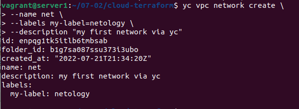
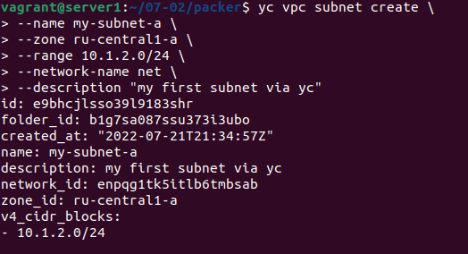
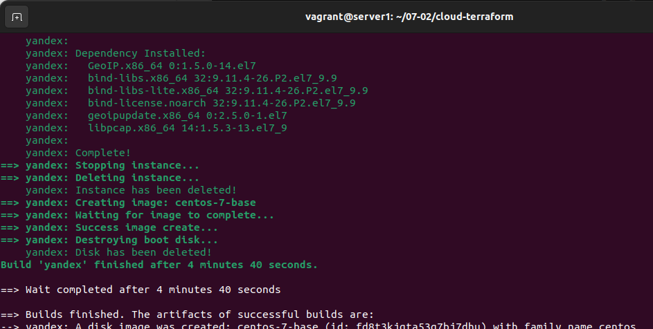
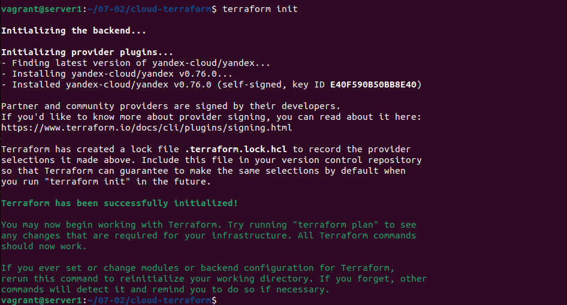
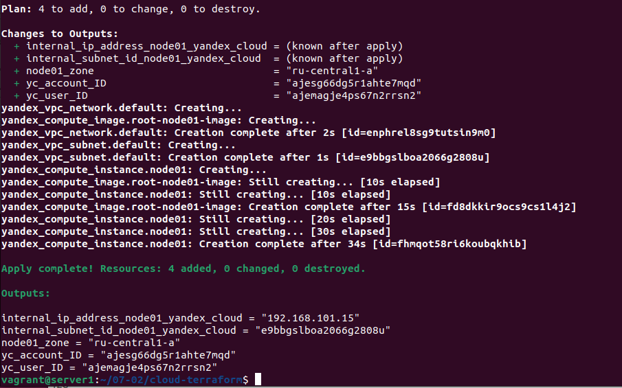

# Домашнее задание к занятию "7.2. Облачные провайдеры и синтаксис Terraform."

Зачастую разбираться в новых инструментах гораздо интересней понимая то, как они работают изнутри. 
Поэтому в рамках первого *необязательного* задания предлагается завести свою учетную запись в AWS (Amazon Web Services) или Yandex.Cloud.
Идеально будет познакомится с обоими облаками, потому что они отличаются. 

## Задача 1 (вариант с AWS). Регистрация в aws и знакомство с основами (необязательно, но крайне желательно).

Остальные задания можно будет выполнять и без этого аккаунта, но с ним можно будет увидеть полный цикл процессов. 

AWS предоставляет достаточно много бесплатных ресурсов в первый год после регистрации, подробно описано [здесь](https://aws.amazon.com/free/).
1. Создайте аккаут aws.
1. Установите c aws-cli https://aws.amazon.com/cli/.
1. Выполните первичную настройку aws-sli https://docs.aws.amazon.com/cli/latest/userguide/cli-configure-quickstart.html.
1. Создайте IAM политику для терраформа c правами
    * AmazonEC2FullAccess
    * AmazonS3FullAccess
    * AmazonDynamoDBFullAccess
    * AmazonRDSFullAccess
    * CloudWatchFullAccess
    * IAMFullAccess
1. Добавьте переменные окружения 
    ```
    export AWS_ACCESS_KEY_ID=(your access key id)
    export AWS_SECRET_ACCESS_KEY=(your secret access key)
    ```
1. Создайте, остановите и удалите ec2 инстанс (любой с пометкой `free tier`) через веб интерфейс. 

В виде результата задания приложите вывод команды `aws configure list`.

---

К сожалению для России сейчас это проблематично.

---

## Задача 1 (Вариант с Yandex.Cloud). Регистрация в ЯО и знакомство с основами (необязательно, но крайне желательно).

1. Подробная инструкция на русском языке содержится [здесь](https://cloud.yandex.ru/docs/solutions/infrastructure-management/terraform-quickstart).
2. Обратите внимание на период бесплатного использования после регистрации аккаунта. 
3. Используйте раздел "Подготовьте облако к работе" для регистрации аккаунта. Далее раздел "Настройте провайдер" для подготовки
базового терраформ конфига.
4. Воспользуйтесь [инструкцией](https://registry.terraform.io/providers/yandex-cloud/yandex/latest/docs) на сайте терраформа, что бы 
не указывать авторизационный токен в коде, а терраформ провайдер брал его из переменных окружений.

---

Данные шаги проделывал в задании [05-virt-04-docker-compose](https://github.com/kofe88/devops-netology/tree/main/virt-pdc-2/05-virt-04-docker-compose)

```bash
sudo curl -sSL https://storage.yandexcloud.net/yandexcloud-yc/install.sh | bash
yc init
export YC_TOKEN=$(yc config get token) #export YC_TOKEN=$(yc iam create-token)
```

---

## Задача 2. Создание aws ec2 или yandex_compute_instance через терраформ. 

1. В каталоге `terraform` вашего основного репозитория, который был создан в начале курсе, создайте файл `main.tf` и `versions.tf`.
2. Зарегистрируйте провайдер 
   1. для [aws](https://registry.terraform.io/providers/hashicorp/aws/latest/docs). В файл `main.tf` добавьте
   блок `provider`, а в `versions.tf` блок `terraform` с вложенным блоком `required_providers`. Укажите любой выбранный вами регион 
   внутри блока `provider`.
   2. либо для [yandex.cloud](https://registry.terraform.io/providers/yandex-cloud/yandex/latest/docs). Подробную инструкцию можно найти 
   [здесь](https://cloud.yandex.ru/docs/solutions/infrastructure-management/terraform-quickstart).
3. Внимание! В гит репозиторий нельзя пушить ваши личные ключи доступа к аккаунту. Поэтому в предыдущем задании мы указывали
их в виде переменных окружения. 
4. В файле `main.tf` воспользуйтесь блоком `data "aws_ami` для поиска ami образа последнего Ubuntu.  
5. В файле `main.tf` создайте рессурс 
   1. либо [ec2 instance](https://registry.terraform.io/providers/hashicorp/aws/latest/docs/resources/instance).
   Постарайтесь указать как можно больше параметров для его определения. Минимальный набор параметров указан в первом блоке 
   `Example Usage`, но желательно, указать большее количество параметров.
   2. либо [yandex_compute_image](https://registry.terraform.io/providers/yandex-cloud/yandex/latest/docs/resources/compute_image).
6. Также в случае использования aws:
   1. Добавьте data-блоки `aws_caller_identity` и `aws_region`.
   2. В файл `outputs.tf` поместить блоки `output` с данными об используемых в данный момент: 
       * AWS account ID,
       * AWS user ID,
       * AWS регион, который используется в данный момент, 
       * Приватный IP ec2 инстансы,
       * Идентификатор подсети в которой создан инстанс.  
7. Если вы выполнили первый пункт, то добейтесь того, что бы команда `terraform plan` выполнялась без ошибок. 


В качестве результата задания предоставьте:
1. Ответ на вопрос: при помощи какого инструмента (из разобранных на прошлом занятии) можно создать свой образ ami?

---

[HasiCorp Packer](https://www.packer.io/plugins/builders/yandex)

А именно для YC:

Создаем временную сеть и подсеть

```bash
yc vpc network create \
 --name net \
 --labels my-label=netology \
 --description "my first network via yc"
 
yc vpc subnet create \
 --name my-subnet-a \
 --zone ru-central1-a \
 --range 10.1.2.0/24 \
 --network-name net \
 --description "my first subnet via yc"
#Главное потом не забыть удалить это всё, чтобы не тратило деньги
yc vpc subnet delete --name my-subnet-a && yc vpc network delete --name net
```





Создаем образ при помощи `Packer` используя шаблон [centos-7-base.json](scripts/packer/centos-7-base.json)

```bash
vagrant@server1:~/07-02/packer$ packer validate centos-7-base.json
The configuration is valid.
vagrant@server1:~/07-02/packer$ packer build centos-7-base.json
yandex: output will be in this color.

==> yandex: Creating temporary RSA SSH key for instance...
==> yandex: Using as source image: fd88d14a6790do254kj7 (name: "centos-7-v20220620", family: "centos-7")
==> yandex: Use provided subnet id e9bhcjlsso39l9183shr
==> yandex: Creating disk...
==> yandex: Creating instance...
==> yandex: Waiting for instance with id fhmd1nppeavnt6jgur60 to become active...
    yandex: Detected instance IP: 51.250.86.28
==> yandex: Using SSH communicator to connect: 51.250.86.28
==> yandex: Waiting for SSH to become available...
==> yandex: Connected to SSH!
==> yandex: Provisioning with shell script: /tmp/packer-shell1165693356
    yandex: Loaded plugins: fastestmirror
    yandex: Determining fastest mirrors
    yandex:  * base: mirror.sale-dedic.com
    yandex:  * extras: mirrors.datahouse.ru
    yandex:  * updates: mirror.sale-dedic.com
    yandex: Resolving Dependencies
    yandex: --> Running transaction check
    yandex: ---> Package kernel.x86_64 0:3.10.0-1160.71.1.el7 will be installed
    yandex: ---> Package kernel-tools.x86_64 0:3.10.0-1160.66.1.el7 will be updated
    yandex: ---> Package kernel-tools.x86_64 0:3.10.0-1160.71.1.el7 will be an update
    yandex: ---> Package kernel-tools-libs.x86_64 0:3.10.0-1160.66.1.el7 will be updated
    yandex: ---> Package kernel-tools-libs.x86_64 0:3.10.0-1160.71.1.el7 will be an update
    yandex: ---> Package krb5-libs.x86_64 0:1.15.1-51.el7_9 will be updated
    yandex: ---> Package krb5-libs.x86_64 0:1.15.1-54.el7_9 will be an update
    yandex: ---> Package python.x86_64 0:2.7.5-90.el7 will be updated
    yandex: ---> Package python.x86_64 0:2.7.5-92.el7_9 will be an update
    yandex: ---> Package python-libs.x86_64 0:2.7.5-90.el7 will be updated
    yandex: ---> Package python-libs.x86_64 0:2.7.5-92.el7_9 will be an update
    yandex: ---> Package python-perf.x86_64 0:3.10.0-1160.66.1.el7 will be updated
    yandex: ---> Package python-perf.x86_64 0:3.10.0-1160.71.1.el7 will be an update
    yandex: --> Finished Dependency Resolution
    yandex:
    yandex: Dependencies Resolved
    yandex:
    yandex: ================================================================================
    yandex:  Package               Arch       Version                     Repository   Size
    yandex: ================================================================================
    yandex: Installing:
    yandex:  kernel                x86_64     3.10.0-1160.71.1.el7        updates      50 M
    yandex: Updating:
    yandex:  kernel-tools          x86_64     3.10.0-1160.71.1.el7        updates     8.2 M
    yandex:  kernel-tools-libs     x86_64     3.10.0-1160.71.1.el7        updates     8.1 M
    yandex:  krb5-libs             x86_64     1.15.1-54.el7_9             updates     810 k
    yandex:  python                x86_64     2.7.5-92.el7_9              updates      96 k
    yandex:  python-libs           x86_64     2.7.5-92.el7_9              updates     5.6 M
    yandex:  python-perf           x86_64     3.10.0-1160.71.1.el7        updates     8.2 M
    yandex:
    yandex: Transaction Summary
    yandex: ================================================================================
    yandex: Install  1 Package
    yandex: Upgrade  6 Packages
    yandex:
    yandex: Total download size: 81 M
    yandex: Downloading packages:
    yandex: Delta RPMs disabled because /usr/bin/applydeltarpm not installed.
    yandex: --------------------------------------------------------------------------------
    yandex: Total                                               46 MB/s |  81 MB  00:01
    yandex: Running transaction check
    yandex: Running transaction test
    yandex: Transaction test succeeded
    yandex: Running transaction
    yandex:   Updating   : python-libs-2.7.5-92.el7_9.x86_64                           1/13
    yandex:   Updating   : python-2.7.5-92.el7_9.x86_64                                2/13
    yandex:   Updating   : kernel-tools-libs-3.10.0-1160.71.1.el7.x86_64               3/13
    yandex:   Updating   : kernel-tools-3.10.0-1160.71.1.el7.x86_64                    4/13
    yandex:   Updating   : python-perf-3.10.0-1160.71.1.el7.x86_64                     5/13
    yandex:   Updating   : krb5-libs-1.15.1-54.el7_9.x86_64                            6/13
    yandex:   Installing : kernel-3.10.0-1160.71.1.el7.x86_64                          7/13
    yandex:   Cleanup    : python-perf-3.10.0-1160.66.1.el7.x86_64                     8/13
    yandex:   Cleanup    : python-2.7.5-90.el7.x86_64                                  9/13
    yandex:   Cleanup    : kernel-tools-3.10.0-1160.66.1.el7.x86_64                   10/13
    yandex:   Cleanup    : kernel-tools-libs-3.10.0-1160.66.1.el7.x86_64              11/13
    yandex:   Cleanup    : python-libs-2.7.5-90.el7.x86_64                            12/13
    yandex:   Cleanup    : krb5-libs-1.15.1-51.el7_9.x86_64                           13/13
    yandex:   Verifying  : kernel-tools-libs-3.10.0-1160.71.1.el7.x86_64               1/13
    yandex:   Verifying  : python-libs-2.7.5-92.el7_9.x86_64                           2/13
    yandex:   Verifying  : python-perf-3.10.0-1160.71.1.el7.x86_64                     3/13
    yandex:   Verifying  : python-2.7.5-92.el7_9.x86_64                                4/13
    yandex:   Verifying  : kernel-3.10.0-1160.71.1.el7.x86_64                          5/13
    yandex:   Verifying  : krb5-libs-1.15.1-54.el7_9.x86_64                            6/13
    yandex:   Verifying  : kernel-tools-3.10.0-1160.71.1.el7.x86_64                    7/13
    yandex:   Verifying  : kernel-tools-libs-3.10.0-1160.66.1.el7.x86_64               8/13
    yandex:   Verifying  : python-libs-2.7.5-90.el7.x86_64                             9/13
    yandex:   Verifying  : kernel-tools-3.10.0-1160.66.1.el7.x86_64                   10/13
    yandex:   Verifying  : python-2.7.5-90.el7.x86_64                                 11/13
    yandex:   Verifying  : python-perf-3.10.0-1160.66.1.el7.x86_64                    12/13
    yandex:   Verifying  : krb5-libs-1.15.1-51.el7_9.x86_64                           13/13
    yandex:
    yandex: Installed:
    yandex:   kernel.x86_64 0:3.10.0-1160.71.1.el7
    yandex:
    yandex: Updated:
    yandex:   kernel-tools.x86_64 0:3.10.0-1160.71.1.el7
    yandex:   kernel-tools-libs.x86_64 0:3.10.0-1160.71.1.el7
    yandex:   krb5-libs.x86_64 0:1.15.1-54.el7_9
    yandex:   python.x86_64 0:2.7.5-92.el7_9
    yandex:   python-libs.x86_64 0:2.7.5-92.el7_9
    yandex:   python-perf.x86_64 0:3.10.0-1160.71.1.el7
    yandex:
    yandex: Complete!
    yandex: Loaded plugins: fastestmirror
    yandex: Loading mirror speeds from cached hostfile
    yandex:  * base: mirror.sale-dedic.com
    yandex:  * extras: mirrors.datahouse.ru
    yandex:  * updates: mirror.sale-dedic.com
    yandex: Package iptables-1.4.21-35.el7.x86_64 already installed and latest version
    yandex: Package curl-7.29.0-59.el7_9.1.x86_64 already installed and latest version
    yandex: Package net-tools-2.0-0.25.20131004git.el7.x86_64 already installed and latest version
    yandex: Package rsync-3.1.2-10.el7.x86_64 already installed and latest version
    yandex: Package openssh-server-7.4p1-22.el7_9.x86_64 already installed and latest version
    yandex: Resolving Dependencies
    yandex: --> Running transaction check
    yandex: ---> Package bind-utils.x86_64 32:9.11.4-26.P2.el7_9.9 will be installed
    yandex: --> Processing Dependency: bind-libs-lite(x86-64) = 32:9.11.4-26.P2.el7_9.9 for package: 32:bind-utils-9.11.4-26.P2.el7_9.9.x86_64
    yandex: --> Processing Dependency: bind-libs(x86-64) = 32:9.11.4-26.P2.el7_9.9 for package: 32:bind-utils-9.11.4-26.P2.el7_9.9.x86_64
    yandex: --> Processing Dependency: liblwres.so.160()(64bit) for package: 32:bind-utils-9.11.4-26.P2.el7_9.9.x86_64
    yandex: --> Processing Dependency: libisccfg.so.160()(64bit) for package: 32:bind-utils-9.11.4-26.P2.el7_9.9.x86_64
    yandex: --> Processing Dependency: libisc.so.169()(64bit) for package: 32:bind-utils-9.11.4-26.P2.el7_9.9.x86_64
    yandex: --> Processing Dependency: libirs.so.160()(64bit) for package: 32:bind-utils-9.11.4-26.P2.el7_9.9.x86_64
    yandex: --> Processing Dependency: libdns.so.1102()(64bit) for package: 32:bind-utils-9.11.4-26.P2.el7_9.9.x86_64
    yandex: --> Processing Dependency: libbind9.so.160()(64bit) for package: 32:bind-utils-9.11.4-26.P2.el7_9.9.x86_64
    yandex: --> Processing Dependency: libGeoIP.so.1()(64bit) for package: 32:bind-utils-9.11.4-26.P2.el7_9.9.x86_64
    yandex: ---> Package bridge-utils.x86_64 0:1.5-9.el7 will be installed
    yandex: ---> Package tcpdump.x86_64 14:4.9.2-4.el7_7.1 will be installed
    yandex: --> Processing Dependency: libpcap >= 14:1.5.3-10 for package: 14:tcpdump-4.9.2-4.el7_7.1.x86_64
    yandex: --> Processing Dependency: libpcap.so.1()(64bit) for package: 14:tcpdump-4.9.2-4.el7_7.1.x86_64
    yandex: ---> Package telnet.x86_64 1:0.17-66.el7 will be installed
    yandex: ---> Package wget.x86_64 0:1.14-18.el7_6.1 will be installed
    yandex: --> Running transaction check
    yandex: ---> Package GeoIP.x86_64 0:1.5.0-14.el7 will be installed
    yandex: --> Processing Dependency: geoipupdate for package: GeoIP-1.5.0-14.el7.x86_64
    yandex: ---> Package bind-libs.x86_64 32:9.11.4-26.P2.el7_9.9 will be installed
    yandex: --> Processing Dependency: bind-license = 32:9.11.4-26.P2.el7_9.9 for package: 32:bind-libs-9.11.4-26.P2.el7_9.9.x86_64
    yandex: ---> Package bind-libs-lite.x86_64 32:9.11.4-26.P2.el7_9.9 will be installed
    yandex: ---> Package libpcap.x86_64 14:1.5.3-13.el7_9 will be installed
    yandex: --> Running transaction check
    yandex: ---> Package bind-license.noarch 32:9.11.4-26.P2.el7_9.9 will be installed
    yandex: ---> Package geoipupdate.x86_64 0:2.5.0-1.el7 will be installed
    yandex: --> Finished Dependency Resolution
    yandex:
    yandex: Dependencies Resolved
    yandex:
    yandex: ================================================================================
    yandex:  Package            Arch       Version                        Repository   Size
    yandex: ================================================================================
    yandex: Installing:
    yandex:  bind-utils         x86_64     32:9.11.4-26.P2.el7_9.9        updates     261 k
    yandex:  bridge-utils       x86_64     1.5-9.el7                      base         32 k
    yandex:  tcpdump            x86_64     14:4.9.2-4.el7_7.1             base        422 k
    yandex:  telnet             x86_64     1:0.17-66.el7                  updates      64 k
    yandex:  wget               x86_64     1.14-18.el7_6.1                base        547 k
    yandex: Installing for dependencies:
    yandex:  GeoIP              x86_64     1.5.0-14.el7                   base        1.5 M
    yandex:  bind-libs          x86_64     32:9.11.4-26.P2.el7_9.9        updates     157 k
    yandex:  bind-libs-lite     x86_64     32:9.11.4-26.P2.el7_9.9        updates     1.1 M
    yandex:  bind-license       noarch     32:9.11.4-26.P2.el7_9.9        updates      91 k
    yandex:  geoipupdate        x86_64     2.5.0-1.el7                    base         35 k
    yandex:  libpcap            x86_64     14:1.5.3-13.el7_9              updates     139 k
    yandex:
    yandex: Transaction Summary
    yandex: ================================================================================
    yandex: Install  5 Packages (+6 Dependent packages)
    yandex:
    yandex: Total download size: 4.3 M
    yandex: Installed size: 11 M
    yandex: Downloading packages:
    yandex: --------------------------------------------------------------------------------
    yandex: Total                                               12 MB/s | 4.3 MB  00:00
    yandex: Running transaction check
    yandex: Running transaction test
    yandex: Transaction test succeeded
    yandex: Running transaction
    yandex:   Installing : 32:bind-license-9.11.4-26.P2.el7_9.9.noarch                 1/11
    yandex:   Installing : geoipupdate-2.5.0-1.el7.x86_64                              2/11
    yandex:   Installing : GeoIP-1.5.0-14.el7.x86_64                                   3/11
    yandex:   Installing : 32:bind-libs-lite-9.11.4-26.P2.el7_9.9.x86_64               4/11
    yandex:   Installing : 32:bind-libs-9.11.4-26.P2.el7_9.9.x86_64                    5/11
    yandex:   Installing : 14:libpcap-1.5.3-13.el7_9.x86_64                            6/11
    yandex: pam_tally2: Error opening /var/log/tallylog for update: Permission denied
    yandex: pam_tally2: Authentication error
    yandex: useradd: failed to reset the tallylog entry of user "tcpdump"
    yandex:   Installing : 14:tcpdump-4.9.2-4.el7_7.1.x86_64                           7/11
    yandex:   Installing : 32:bind-utils-9.11.4-26.P2.el7_9.9.x86_64                   8/11
    yandex:   Installing : bridge-utils-1.5-9.el7.x86_64                               9/11
    yandex:   Installing : wget-1.14-18.el7_6.1.x86_64                                10/11
    yandex:   Installing : 1:telnet-0.17-66.el7.x86_64                                11/11
    yandex:   Verifying  : GeoIP-1.5.0-14.el7.x86_64                                   1/11
    yandex:   Verifying  : 14:libpcap-1.5.3-13.el7_9.x86_64                            2/11
    yandex:   Verifying  : 1:telnet-0.17-66.el7.x86_64                                 3/11
    yandex:   Verifying  : 32:bind-libs-9.11.4-26.P2.el7_9.9.x86_64                    4/11
    yandex:   Verifying  : geoipupdate-2.5.0-1.el7.x86_64                              5/11
    yandex:   Verifying  : 14:tcpdump-4.9.2-4.el7_7.1.x86_64                           6/11
    yandex:   Verifying  : wget-1.14-18.el7_6.1.x86_64                                 7/11
    yandex:   Verifying  : 32:bind-license-9.11.4-26.P2.el7_9.9.noarch                 8/11
    yandex:   Verifying  : bridge-utils-1.5-9.el7.x86_64                               9/11
    yandex:   Verifying  : 32:bind-libs-lite-9.11.4-26.P2.el7_9.9.x86_64              10/11
    yandex:   Verifying  : 32:bind-utils-9.11.4-26.P2.el7_9.9.x86_64                  11/11
    yandex:
    yandex: Installed:
    yandex:   bind-utils.x86_64 32:9.11.4-26.P2.el7_9.9   bridge-utils.x86_64 0:1.5-9.el7
    yandex:   tcpdump.x86_64 14:4.9.2-4.el7_7.1           telnet.x86_64 1:0.17-66.el7
    yandex:   wget.x86_64 0:1.14-18.el7_6.1
    yandex:
    yandex: Dependency Installed:
    yandex:   GeoIP.x86_64 0:1.5.0-14.el7
    yandex:   bind-libs.x86_64 32:9.11.4-26.P2.el7_9.9
    yandex:   bind-libs-lite.x86_64 32:9.11.4-26.P2.el7_9.9
    yandex:   bind-license.noarch 32:9.11.4-26.P2.el7_9.9
    yandex:   geoipupdate.x86_64 0:2.5.0-1.el7
    yandex:   libpcap.x86_64 14:1.5.3-13.el7_9
    yandex:
    yandex: Complete!
==> yandex: Stopping instance...
==> yandex: Deleting instance...
    yandex: Instance has been deleted!
==> yandex: Creating image: centos-7-base
==> yandex: Waiting for image to complete...
==> yandex: Success image create...
==> yandex: Destroying boot disk...
    yandex: Disk has been deleted!
Build 'yandex' finished after 4 minutes 40 seconds.

==> Wait completed after 4 minutes 40 seconds

==> Builds finished. The artifacts of successful builds are:
--> yandex: A disk image was created: centos-7-base (id: fd8t3kjgta53q7bj7dhu) with family name centos
```



ID образа записываем в [variables.tf](scripts/cloud-terraform/variables.tf)

```bash
vagrant@server1:~/07-02/cloud-terraform$ nano variables.tf 
```

Не забываем удалить временную сеть и подсеть

```bash
vagrant@server1:~/07-02/cloud-terraform$ yc vpc subnet delete --name my-subnet-a && yc vpc network delete --name net
done (2s)
```
---

2. Ссылку на репозиторий с исходной конфигурацией терраформа.  

---

[Кофигурация Terraform](scripts/cloud-terraform)

Инициализируем `Terraform`

```bash
vagrant@server1:~/07-02/cloud-terraform$ terraform init

Initializing the backend...

Initializing provider plugins...
- Finding latest version of yandex-cloud/yandex...
- Installing yandex-cloud/yandex v0.76.0...
- Installed yandex-cloud/yandex v0.76.0 (self-signed, key ID E40F590B50BB8E40)

Partner and community providers are signed by their developers.
If you'd like to know more about provider signing, you can read about it here:
https://www.terraform.io/docs/cli/plugins/signing.html

Terraform has created a lock file .terraform.lock.hcl to record the provider
selections it made above. Include this file in your version control repository
so that Terraform can guarantee to make the same selections by default when
you run "terraform init" in the future.

Terraform has been successfully initialized!

You may now begin working with Terraform. Try running "terraform plan" to see
any changes that are required for your infrastructure. All Terraform commands
should now work.

If you ever set or change modules or backend configuration for Terraform,
rerun this command to reinitialize your working directory. If you forget, other
commands will detect it and remind you to do so if necessary.
```



`terraform plan` проходит успешно

```bash
vagrant@server1:~/07-02/cloud-terraform$ terraform plan
data.yandex_iam_service_account.kofe88: Reading...
data.yandex_iam_user.kofe88: Reading...
data.yandex_iam_service_account.kofe88: Read complete after 1s [id=ajesg66dg5r1ahte7mqd]
data.yandex_iam_user.kofe88: Read complete after 1s [id=ajemagje4ps67n2rrsn2]

Terraform used the selected providers to generate the following execution plan. Resource actions are indicated with the following symbols:
  + create

Terraform will perform the following actions:

  # yandex_compute_image.root-node01-image will be created
  + resource "yandex_compute_image" "root-node01-image" {
      + created_at      = (known after apply)
      + folder_id       = (known after apply)
      + id              = (known after apply)
      + min_disk_size   = (known after apply)
      + name            = "root-node01-image"
      + os_type         = (known after apply)
      + pooled          = (known after apply)
      + product_ids     = (known after apply)
      + size            = (known after apply)
      + source_disk     = (known after apply)
      + source_family   = (known after apply)
      + source_image    = "fd8t3kjgta53q7bj7dhu"
      + source_snapshot = (known after apply)
      + source_url      = (known after apply)
      + status          = (known after apply)
    }

  # yandex_compute_instance.node01 will be created
  + resource "yandex_compute_instance" "node01" {
      + allow_stopping_for_update = true
      + created_at                = (known after apply)
      + folder_id                 = (known after apply)
      + fqdn                      = (known after apply)
      + hostname                  = "node01.netology.cloud"
      + id                        = (known after apply)
      + name                      = "node01"
      + network_acceleration_type = "standard"
      + platform_id               = "standard-v1"
      + service_account_id        = (known after apply)
      + status                    = (known after apply)
      + zone                      = "ru-central1-a"

      + boot_disk {
          + auto_delete = true
          + device_name = (known after apply)
          + disk_id     = (known after apply)
          + mode        = (known after apply)

          + initialize_params {
              + block_size  = (known after apply)
              + description = (known after apply)
              + image_id    = "fd8t3kjgta53q7bj7dhu"
              + name        = "root-node01"
              + size        = 50
              + snapshot_id = (known after apply)
              + type        = "network-nvme"
            }
        }

      + network_interface {
          + index              = (known after apply)
          + ip_address         = (known after apply)
          + ipv4               = true
          + ipv6               = (known after apply)
          + ipv6_address       = (known after apply)
          + mac_address        = (known after apply)
          + nat                = true
          + nat_ip_address     = (known after apply)
          + nat_ip_version     = (known after apply)
          + security_group_ids = (known after apply)
          + subnet_id          = (known after apply)
        }

      + placement_policy {
          + host_affinity_rules = (known after apply)
          + placement_group_id  = (known after apply)
        }

      + resources {
          + core_fraction = 100
          + cores         = 2
          + memory        = 4
        }

      + scheduling_policy {
          + preemptible = (known after apply)
        }
    }

  # yandex_vpc_network.default will be created
  + resource "yandex_vpc_network" "default" {
      + created_at                = (known after apply)
      + default_security_group_id = (known after apply)
      + folder_id                 = (known after apply)
      + id                        = (known after apply)
      + labels                    = (known after apply)
      + name                      = "net"
      + subnet_ids                = (known after apply)
    }

  # yandex_vpc_subnet.default will be created
  + resource "yandex_vpc_subnet" "default" {
      + created_at     = (known after apply)
      + folder_id      = (known after apply)
      + id             = (known after apply)
      + labels         = (known after apply)
      + name           = "subnet"
      + network_id     = (known after apply)
      + v4_cidr_blocks = [
          + "192.168.101.0/24",
        ]
      + v6_cidr_blocks = (known after apply)
      + zone           = "ru-central1-a"
    }

Plan: 4 to add, 0 to change, 0 to destroy.

Changes to Outputs:
  + internal_ip_address_node01_yandex_cloud = (known after apply)
  + internal_subnet_id_node01_yandex_cloud  = (known after apply)
  + node01_zone                             = "ru-central1-a"
  + yc_account_ID                           = "ajesg66dg5r1ahte7mqd"
  + yc_user_ID                              = "ajemagje4ps67n2rrsn2"


────────────────────────────────────────────────────────────────────────────────────────────────────────────────────────────────────────────────────────

Note: You didn't use the -out option to save this plan, so Terraform can't guarantee to take exactly these actions if you run "terraform apply" now.

```

Так же успешно проходит и `terraform apply -auto-approve`

```bash
vagrant@server1:~/07-02/cloud-terraform$ terraform apply -auto-approve
data.yandex_iam_service_account.kofe88: Reading...
data.yandex_iam_user.kofe88: Reading...
data.yandex_iam_service_account.kofe88: Read complete after 1s [id=ajesg66dg5r1ahte7mqd]
data.yandex_iam_user.kofe88: Read complete after 1s [id=ajemagje4ps67n2rrsn2]

Terraform used the selected providers to generate the following execution plan. Resource actions are indicated with the following symbols:
  + create

Terraform will perform the following actions:

  # yandex_compute_image.root-node01-image will be created
  + resource "yandex_compute_image" "root-node01-image" {
      + created_at      = (known after apply)
      + folder_id       = (known after apply)
      + id              = (known after apply)
      + min_disk_size   = (known after apply)
      + name            = "root-node01-image"
      + os_type         = (known after apply)
      + pooled          = (known after apply)
      + product_ids     = (known after apply)
      + size            = (known after apply)
      + source_disk     = (known after apply)
      + source_family   = (known after apply)
      + source_image    = "fd8t3kjgta53q7bj7dhu"
      + source_snapshot = (known after apply)
      + source_url      = (known after apply)
      + status          = (known after apply)
    }

  # yandex_compute_instance.node01 will be created
  + resource "yandex_compute_instance" "node01" {
      + allow_stopping_for_update = true
      + created_at                = (known after apply)
      + folder_id                 = (known after apply)
      + fqdn                      = (known after apply)
      + hostname                  = "node01.netology.cloud"
      + id                        = (known after apply)
      + name                      = "node01"
      + network_acceleration_type = "standard"
      + platform_id               = "standard-v1"
      + service_account_id        = (known after apply)
      + status                    = (known after apply)
      + zone                      = "ru-central1-a"

      + boot_disk {
          + auto_delete = true
          + device_name = (known after apply)
          + disk_id     = (known after apply)
          + mode        = (known after apply)

          + initialize_params {
              + block_size  = (known after apply)
              + description = (known after apply)
              + image_id    = "fd8t3kjgta53q7bj7dhu"
              + name        = "root-node01"
              + size        = 50
              + snapshot_id = (known after apply)
              + type        = "network-nvme"
            }
        }

      + network_interface {
          + index              = (known after apply)
          + ip_address         = (known after apply)
          + ipv4               = true
          + ipv6               = (known after apply)
          + ipv6_address       = (known after apply)
          + mac_address        = (known after apply)
          + nat                = true
          + nat_ip_address     = (known after apply)
          + nat_ip_version     = (known after apply)
          + security_group_ids = (known after apply)
          + subnet_id          = (known after apply)
        }

      + placement_policy {
          + host_affinity_rules = (known after apply)
          + placement_group_id  = (known after apply)
        }

      + resources {
          + core_fraction = 100
          + cores         = 2
          + memory        = 4
        }

      + scheduling_policy {
          + preemptible = (known after apply)
        }
    }

  # yandex_vpc_network.default will be created
  + resource "yandex_vpc_network" "default" {
      + created_at                = (known after apply)
      + default_security_group_id = (known after apply)
      + folder_id                 = (known after apply)
      + id                        = (known after apply)
      + labels                    = (known after apply)
      + name                      = "net"
      + subnet_ids                = (known after apply)
    }

  # yandex_vpc_subnet.default will be created
  + resource "yandex_vpc_subnet" "default" {
      + created_at     = (known after apply)
      + folder_id      = (known after apply)
      + id             = (known after apply)
      + labels         = (known after apply)
      + name           = "subnet"
      + network_id     = (known after apply)
      + v4_cidr_blocks = [
          + "192.168.101.0/24",
        ]
      + v6_cidr_blocks = (known after apply)
      + zone           = "ru-central1-a"
    }

Plan: 4 to add, 0 to change, 0 to destroy.

Changes to Outputs:
  + internal_ip_address_node01_yandex_cloud = (known after apply)
  + internal_subnet_id_node01_yandex_cloud  = (known after apply)
  + node01_zone                             = "ru-central1-a"
  + yc_account_ID                           = "ajesg66dg5r1ahte7mqd"
  + yc_user_ID                              = "ajemagje4ps67n2rrsn2"
yandex_vpc_network.default: Creating...
yandex_compute_image.root-node01-image: Creating...
yandex_vpc_network.default: Creation complete after 2s [id=enphrel8sg9tutsin9m0]
yandex_vpc_subnet.default: Creating...
yandex_vpc_subnet.default: Creation complete after 1s [id=e9bbgslboa2066g2808u]
yandex_compute_instance.node01: Creating...
yandex_compute_image.root-node01-image: Still creating... [10s elapsed]
yandex_compute_instance.node01: Still creating... [10s elapsed]
yandex_compute_image.root-node01-image: Creation complete after 15s [id=fd8dkkir9ocs9cs1l4j2]
yandex_compute_instance.node01: Still creating... [20s elapsed]
yandex_compute_instance.node01: Still creating... [30s elapsed]
yandex_compute_instance.node01: Creation complete after 34s [id=fhmqot58ri6koubqkhib]

Apply complete! Resources: 4 added, 0 changed, 0 destroyed.

Outputs:

internal_ip_address_node01_yandex_cloud = "192.168.101.15"
internal_subnet_id_node01_yandex_cloud = "e9bbgslboa2066g2808u"
node01_zone = "ru-central1-a"
yc_account_ID = "ajesg66dg5r1ahte7mqd"
yc_user_ID = "ajemagje4ps67n2rrsn2"
vagrant@server1:~/07-02/cloud-terraform$ 
```



Не забываем всё за собой удалить

```bash
vagrant@server1:~/07-02/cloud-terraform$ terraform destroy -auto-approve
data.yandex_iam_service_account.kofe88: Reading...
yandex_compute_image.root-node01-image: Refreshing state... [id=fd8dkkir9ocs9cs1l4j2]
data.yandex_iam_user.kofe88: Reading...
yandex_vpc_network.default: Refreshing state... [id=enphrel8sg9tutsin9m0]
data.yandex_iam_service_account.kofe88: Read complete after 1s [id=ajesg66dg5r1ahte7mqd]
data.yandex_iam_user.kofe88: Read complete after 1s [id=ajemagje4ps67n2rrsn2]
yandex_vpc_subnet.default: Refreshing state... [id=e9bbgslboa2066g2808u]
yandex_compute_instance.node01: Refreshing state... [id=fhmqot58ri6koubqkhib]

Terraform used the selected providers to generate the following execution plan. Resource actions are indicated with the following symbols:
  - destroy

Terraform will perform the following actions:

  # yandex_compute_image.root-node01-image will be destroyed
  - resource "yandex_compute_image" "root-node01-image" {
      - created_at    = "2022-07-21T23:36:13Z" -> null
      - folder_id     = "b1g7sa087ssu373i3ubo" -> null
      - id            = "fd8dkkir9ocs9cs1l4j2" -> null
      - labels        = {} -> null
      - min_disk_size = 10 -> null
      - name          = "root-node01-image" -> null
      - pooled        = false -> null
      - product_ids   = [
          - "f2euv1kekdgvc0jrpaet",
        ] -> null
      - size          = 2 -> null
      - source_image  = "fd8t3kjgta53q7bj7dhu" -> null
      - status        = "ready" -> null
    }

  # yandex_compute_instance.node01 will be destroyed
  - resource "yandex_compute_instance" "node01" {
      - allow_stopping_for_update = true -> null
      - created_at                = "2022-07-21T23:36:15Z" -> null
      - folder_id                 = "b1g7sa087ssu373i3ubo" -> null
      - fqdn                      = "node01.netology.cloud" -> null
      - hostname                  = "node01" -> null
      - id                        = "fhmqot58ri6koubqkhib" -> null
      - labels                    = {} -> null
      - metadata                  = {} -> null
      - name                      = "node01" -> null
      - network_acceleration_type = "standard" -> null
      - platform_id               = "standard-v1" -> null
      - status                    = "running" -> null
      - zone                      = "ru-central1-a" -> null

      - boot_disk {
          - auto_delete = true -> null
          - device_name = "fhmd4ct7tpqemj4bfmuh" -> null
          - disk_id     = "fhmd4ct7tpqemj4bfmuh" -> null
          - mode        = "READ_WRITE" -> null

          - initialize_params {
              - block_size = 4096 -> null
              - image_id   = "fd8t3kjgta53q7bj7dhu" -> null
              - name       = "root-node01" -> null
              - size       = 50 -> null
              - type       = "network-ssd" -> null
            }
        }

      - network_interface {
          - index              = 0 -> null
          - ip_address         = "192.168.101.15" -> null
          - ipv4               = true -> null
          - ipv6               = false -> null
          - mac_address        = "d0:0d:1a:c7:4a:8d" -> null
          - nat                = true -> null
          - nat_ip_address     = "51.250.84.146" -> null
          - nat_ip_version     = "IPV4" -> null
          - security_group_ids = [] -> null
          - subnet_id          = "e9bbgslboa2066g2808u" -> null
        }

      - placement_policy {
          - host_affinity_rules = [] -> null
        }

      - resources {
          - core_fraction = 100 -> null
          - cores         = 2 -> null
          - gpus          = 0 -> null
          - memory        = 4 -> null
        }

      - scheduling_policy {
          - preemptible = false -> null
        }
    }

  # yandex_vpc_network.default will be destroyed
  - resource "yandex_vpc_network" "default" {
      - created_at = "2022-07-21T23:36:13Z" -> null
      - folder_id  = "b1g7sa087ssu373i3ubo" -> null
      - id         = "enphrel8sg9tutsin9m0" -> null
      - labels     = {} -> null
      - name       = "net" -> null
      - subnet_ids = [
          - "e9bbgslboa2066g2808u",
        ] -> null
    }

  # yandex_vpc_subnet.default will be destroyed
  - resource "yandex_vpc_subnet" "default" {
      - created_at     = "2022-07-21T23:36:14Z" -> null
      - folder_id      = "b1g7sa087ssu373i3ubo" -> null
      - id             = "e9bbgslboa2066g2808u" -> null
      - labels         = {} -> null
      - name           = "subnet" -> null
      - network_id     = "enphrel8sg9tutsin9m0" -> null
      - v4_cidr_blocks = [
          - "192.168.101.0/24",
        ] -> null
      - v6_cidr_blocks = [] -> null
      - zone           = "ru-central1-a" -> null
    }

Plan: 0 to add, 0 to change, 4 to destroy.

Changes to Outputs:
  - internal_ip_address_node01_yandex_cloud = "192.168.101.15" -> null
  - internal_subnet_id_node01_yandex_cloud  = "e9bbgslboa2066g2808u" -> null
  - node01_zone                             = "ru-central1-a" -> null
  - yc_account_ID                           = "ajesg66dg5r1ahte7mqd" -> null
  - yc_user_ID                              = "ajemagje4ps67n2rrsn2" -> null
yandex_compute_image.root-node01-image: Destroying... [id=fd8dkkir9ocs9cs1l4j2]
yandex_compute_instance.node01: Destroying... [id=fhmqot58ri6koubqkhib]
yandex_compute_image.root-node01-image: Destruction complete after 9s
yandex_compute_instance.node01: Still destroying... [id=fhmqot58ri6koubqkhib, 10s elapsed]
yandex_compute_instance.node01: Destruction complete after 14s
yandex_vpc_subnet.default: Destroying... [id=e9bbgslboa2066g2808u]
yandex_vpc_subnet.default: Destruction complete after 7s
yandex_vpc_network.default: Destroying... [id=enphrel8sg9tutsin9m0]
yandex_vpc_network.default: Destruction complete after 1s

Destroy complete! Resources: 4 destroyed.
```

А так же удаляем образ созданный через `Packer`

```bash
vagrant@server1:~/07-02/cloud-terraform$ yc compute image delete --id fd8t3kjgta53q7bj7dhu
done (10s)
```

---

---

### Как cдавать задание

Выполненное домашнее задание пришлите ссылкой на .md-файл в вашем репозитории.

---
