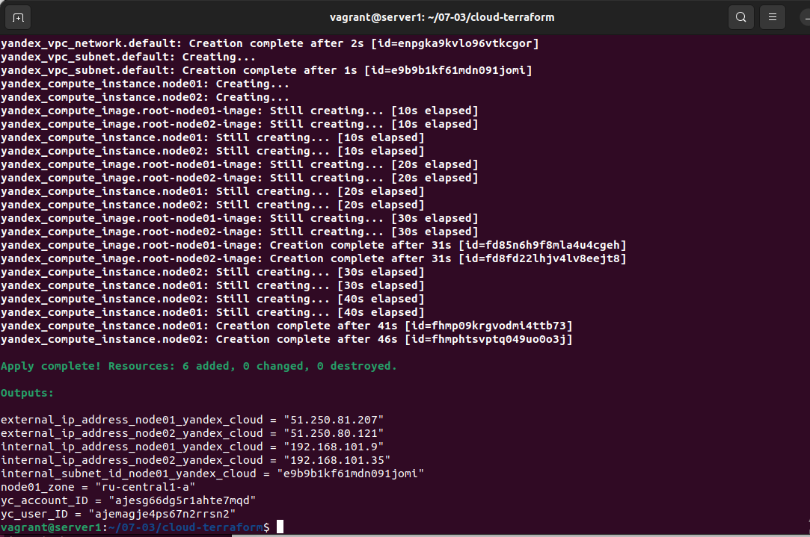
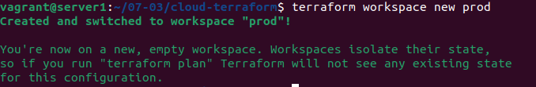

# Домашнее задание к занятию "7.3. Основы и принцип работы Терраформ"

## Задача 1. Создадим бэкэнд в S3 (необязательно, но крайне желательно).

Если в рамках предыдущего задания у вас уже есть аккаунт AWS, то давайте продолжим знакомство со взаимодействием
терраформа и aws. 

1. Создайте s3 бакет, iam роль и пользователя от которого будет работать терраформ. Можно создать отдельного пользователя,
а можно использовать созданного в рамках предыдущего задания, просто добавьте ему необходимы права, как описано 
[здесь](https://www.terraform.io/docs/backends/types/s3.html).
1. Зарегистрируйте бэкэнд в терраформ проекте как описано по ссылке выше. 

---

Действуем по официальному [руководству](https://cloud.yandex.ru/docs/tutorials/infrastructure-management/terraform-state-storage) YC.

Часть работы уже проделана в предыдущих ДЗ.

Сервисный аккаунт с назначенными правами.


Получаем [статические ключи](https://cloud.yandex.ru/docs/iam/operations/sa/create-access-key) для сервисного аккаунта.

```bash
vagrant@server1:~/07-03/cloud-terraform$ yc iam access-key create --service-account-name my-netology
access_key:
  id: aje438sj8r41cqe7un0p
  service_account_id: ajesg66dg5r1ahte7mqd
  created_at: "2022-07-25T22:00:41.540874138Z"
  key_id: YCAJ****
secret: YCMC****
```


Инициализируем проект


Создаем [bucket](https://cloud.yandex.ru/docs/storage/operations/buckets/create).


Правим [version.tf](scripts/cloud-terraform/version.tf) и добавляем конфиг для бакета.

```bash
terraform {
  required_providers {
    yandex = {
      source = "yandex-cloud/yandex"
    }
  }
  backend "s3" {
    endpoint   = "storage.yandexcloud.net"
    bucket     = "my-netology-bucket"
    region     = "ru-central1-a"
    key        = "./state.tfstate"
    workspace_key_prefix = ""
    access_key = "YCA*"
    secret_key = "YCM*"

    skip_region_validation      = true
    skip_credentials_validation = true
  }

}
```

Используя `Packer` подготавливаем образ с [Ubuntu2004](scripts/packer/ubuntu2004.json)

<details>
  <summary>Подробнее</summary>

```bash
vagrant@server1:~/07-03/packer$ packer build ubuntu2004.json
yandex: output will be in this color.

==> yandex: Creating temporary RSA SSH key for instance...
==> yandex: Using as source image: fd8ofg98ci78v262j491 (name: "ubuntu-20-04-lts-v20220725", family: "ubuntu-2004-lts")
==> yandex: Use provided subnet id e9btb3hv94sbkgrkshm0
==> yandex: Creating disk...
==> yandex: Creating instance...
==> yandex: Waiting for instance with id fhmiini5jh7o5lpdl9iu to become active...
    yandex: Detected instance IP: 51.250.11.3
==> yandex: Using SSH communicator to connect: 51.250.11.3
==> yandex: Waiting for SSH to become available...
==> yandex: Connected to SSH!
==> yandex: Provisioning with shell script: /tmp/packer-shell1001263617
==> yandex:
==> yandex: WARNING: apt does not have a stable CLI interface. Use with caution in scripts.
==> yandex:
    yandex: Hit:1 http://mirror.yandex.ru/ubuntu focal InRelease
    yandex: Get:2 http://mirror.yandex.ru/ubuntu focal-updates InRelease [114 kB]
    yandex: Get:3 http://security.ubuntu.com/ubuntu focal-security InRelease [114 kB]
    yandex: Get:4 http://mirror.yandex.ru/ubuntu focal-backports InRelease [108 kB]
    yandex: Get:5 http://mirror.yandex.ru/ubuntu focal-updates/main amd64 Packages [1,990 kB]
    yandex: Get:6 http://mirror.yandex.ru/ubuntu focal-updates/main i386 Packages [696 kB]
    yandex: Get:7 http://mirror.yandex.ru/ubuntu focal-updates/main Translation-en [358 kB]
    yandex: Fetched 3,380 kB in 2s (1,909 kB/s)
    yandex: Reading package lists...
    yandex: Building dependency tree...
    yandex: Reading state information...
    yandex: All packages are up to date.
==> yandex:
==> yandex: WARNING: apt does not have a stable CLI interface. Use with caution in scripts.
==> yandex:
    yandex: Reading package lists...
    yandex: Building dependency tree...
    yandex: Reading state information...
    yandex: iptables is already the newest version (1.8.4-3ubuntu2).
    yandex: telnet is already the newest version (0.17-41.2build1).
    yandex: curl is already the newest version (7.68.0-1ubuntu2.12).
    yandex: openssh-server is already the newest version (1:8.2p1-4ubuntu0.5).
    yandex: rsync is already the newest version (3.1.3-8ubuntu0.3).
    yandex: tcpdump is already the newest version (4.9.3-4ubuntu0.1).
    yandex: wget is already the newest version (1.20.3-1ubuntu2).
    yandex: The following additional packages will be installed:
    yandex:   python3-ply
    yandex: Suggested packages:
    yandex:   ifupdown python-ply-doc
    yandex: The following NEW packages will be installed:
    yandex:   bind9-utils bridge-utils net-tools python3-ply
    yandex: 0 upgraded, 4 newly installed, 0 to remove and 0 not upgraded.
    yandex: Need to get 445 kB of archives.
    yandex: After this operation, 1,996 kB of additional disk space will be used.
    yandex: Get:1 http://mirror.yandex.ru/ubuntu focal-updates/main amd64 python3-ply all 3.11-3ubuntu0.1 [46.3 kB]
    yandex: Get:2 http://mirror.yandex.ru/ubuntu focal-updates/main amd64 bind9-utils amd64 1:9.16.1-0ubuntu2.10 [172 kB]
    yandex: Get:3 http://mirror.yandex.ru/ubuntu focal/main amd64 bridge-utils amd64 1.6-2ubuntu1 [30.5 kB]
    yandex: Get:4 http://mirror.yandex.ru/ubuntu focal/main amd64 net-tools amd64 1.60+git20180626.aebd88e-1ubuntu1 [196 kB]
==> yandex: debconf: unable to initialize frontend: Dialog
==> yandex: debconf: (Dialog frontend will not work on a dumb terminal, an emacs shell buffer, or without a controlling terminal.)
==> yandex: debconf: falling back to frontend: Readline
==> yandex: debconf: unable to initialize frontend: Readline
==> yandex: debconf: (Can't locate Term/ReadLine.pm in @INC (you may need to install the Term::ReadLine module) (@INC contains: /etc/perl /usr/local/lib/x86_64-linux-gnu/perl/5.30.0 /usr/local/share/perl/5.30.0 /usr/lib/x86_64-linux-gnu/perl5/5.30 /usr/share/perl5 /usr/lib/x86_64-linux-gnu/perl/5.30 /usr/share/perl/5.30 /usr/local/lib/site_perl /usr/lib/x86_64-linux-gnu/perl-base) at /usr/share/perl5/Debconf/FrontEnd/Readline.pm line 7, <> line 4.)
==> yandex: debconf: falling back to frontend: Teletype
==> yandex: dpkg-preconfigure: unable to re-open stdin:
    yandex: Fetched 445 kB in 0s (15.0 MB/s)
    yandex: Selecting previously unselected package python3-ply.
    yandex: (Reading database ... 102311 files and directories currently installed.)
    yandex: Preparing to unpack .../python3-ply_3.11-3ubuntu0.1_all.deb ...
    yandex: Unpacking python3-ply (3.11-3ubuntu0.1) ...
    yandex: Selecting previously unselected package bind9-utils.
    yandex: Preparing to unpack .../bind9-utils_1%3a9.16.1-0ubuntu2.10_amd64.deb ...
    yandex: Unpacking bind9-utils (1:9.16.1-0ubuntu2.10) ...
    yandex: Selecting previously unselected package bridge-utils.
    yandex: Preparing to unpack .../bridge-utils_1.6-2ubuntu1_amd64.deb ...
    yandex: Unpacking bridge-utils (1.6-2ubuntu1) ...
    yandex: Selecting previously unselected package net-tools.
    yandex: Preparing to unpack .../net-tools_1.60+git20180626.aebd88e-1ubuntu1_amd64.deb ...
    yandex: Unpacking net-tools (1.60+git20180626.aebd88e-1ubuntu1) ...
    yandex: Setting up net-tools (1.60+git20180626.aebd88e-1ubuntu1) ...
    yandex: Setting up python3-ply (3.11-3ubuntu0.1) ...
    yandex: Setting up bind9-utils (1:9.16.1-0ubuntu2.10) ...
    yandex: Setting up bridge-utils (1.6-2ubuntu1) ...
    yandex: debconf: unable to initialize frontend: Dialog
    yandex: debconf: (Dialog frontend will not work on a dumb terminal, an emacs shell buffer, or without a controlling terminal.)
    yandex: debconf: falling back to frontend: Readline
    yandex: debconf: unable to initialize frontend: Readline
    yandex: debconf: (Can't locate Term/ReadLine.pm in @INC (you may need to install the Term::ReadLine module) (@INC contains: /etc/perl /usr/local/lib/x86_64-linux-gnu/perl/5.30.0 /usr/local/share/perl/5.30.0 /usr/lib/x86_64-linux-gnu/perl5/5.30 /usr/share/perl5 /usr/lib/x86_64-linux-gnu/perl/5.30 /usr/share/perl/5.30 /usr/local/lib/site_perl /usr/lib/x86_64-linux-gnu/perl-base) at /usr/share/perl5/Debconf/FrontEnd/Readline.pm line 7.)
    yandex: debconf: falling back to frontend: Teletype
    yandex: Processing triggers for man-db (2.9.1-1) ...
==> yandex: Stopping instance...
==> yandex: Deleting instance...
    yandex: Instance has been deleted!
==> yandex: Creating image: ubuntu-2004-base
==> yandex: Waiting for image to complete...
==> yandex: Success image create...
==> yandex: Destroying boot disk...
    yandex: Disk has been deleted!
Build 'yandex' finished after 2 minutes 29 seconds.

==> Wait completed after 2 minutes 29 seconds

==> Builds finished. The artifacts of successful builds are:
--> yandex: A disk image was created: ubuntu-2004-base (id: fd8kam7tt1fqoc8iv4bq) with family name ubuntu
vagrant@server1:~/07-03/packer$ yc vpc subnet delete --name my-subnet-a && yc vpc network delete --name net
```

</details>

---

## Задача 2. Инициализируем проект и создаем воркспейсы. 

>1. Выполните `terraform init`:
>    * если был создан бэкэнд в S3, то терраформ создат файл стейтов в S3 и запись в таблице 
>dynamodb.
>    * иначе будет создан локальный файл со стейтами.  

---

Инициализируем проект

```bash
vagrant@server1:~/07-03/cloud-terraform$ terraform init

Initializing the backend...

Successfully configured the backend "s3"! Terraform will automatically
use this backend unless the backend configuration changes.

Initializing provider plugins...
- Reusing previous version of yandex-cloud/yandex from the dependency lock file
- Using previously-installed yandex-cloud/yandex v0.76.0

Terraform has been successfully initialized!

You may now begin working with Terraform. Try running "terraform plan" to see
any changes that are required for your infrastructure. All Terraform commands
should now work.

If you ever set or change modules or backend configuration for Terraform,
rerun this command to reinitialize your working directory. If you forget, other
commands will detect it and remind you to do so if necessary.
```


Выполняем `terraform apply`



Проверяем что состояние сохранилось в `bucket`


>2. Создайте два воркспейса `stage` и `prod`.

Создаем воркспейсы




>3. В уже созданный `aws_instance` добавьте зависимость типа инстанса от вокспейса, что бы в разных ворскспейсах использовались разные `instance_type`.
>4. Добавим `count`. Для `stage` должен создаться один экземпляр `ec2`, а для `prod` два.
>5. Создайте рядом еще один `aws_instance`, но теперь определите их количество при помощи `for_each`, а не `count`.

В файл [main.tf](scripts/cloud-terraform/main.tf)

Прописываем для `count`

```bash
resource "yandex_compute_instance" "node01" {

  platform_id = local.platform_type[terraform.workspace]

  count = local.vm_count[terraform.workspace]

  name                      = "node01-${count.index+1}-${terraform.workspace}"
  zone                      = "ru-central1-a"
  hostname                  = "node01-${count.index+1}-${terraform.workspace}.netology.cloud"
  allow_stopping_for_update = true

  resources {
    cores  = 2
    memory = 2
  }

  boot_disk {
    initialize_params {
      image_id    = "${var.ubuntu-base}"
      name        = "root-node01-${count.index+1}-${terraform.workspace}"
      type        = "network-nvme"
      size        = "10"
    }
  }

  network_interface {
    subnet_id = "${yandex_vpc_subnet.default.id}"
    nat       = true
  }

  metadata = {
    ssh-keys = "ubuntu:${file("~/.ssh/id_rsa.pub")}"
  }

}
```

Прописываем для `for_each`

```bash
resource "yandex_compute_instance" "node02" {

  for_each = {for index, vm in local.prod: index => vm
  if vm.work == terraform.workspace}


  platform_id = each.value.type

  name                      = "node02-${each.value.index+1}-${terraform.workspace}"
  zone                      = "ru-central1-a"
  hostname                  = "node02-${each.value.index+1}-${terraform.workspace}.netology.cloud"
  allow_stopping_for_update = true

  resources {
    cores  = 2
    memory = 2
  }

  boot_disk {
    initialize_params {
      image_id    = "${var.ubuntu-base}"
      name        = "root-node02-${each.value.index+1}-${terraform.workspace}"
      type        = "network-nvme"
      size        = "15"
    }
  }

  network_interface {
    subnet_id = "${yandex_vpc_subnet.default.id}"
    nat       = true
  }

  metadata = {
    ssh-keys = "ubuntu:${file("~/.ssh/id_rsa.pub")}"
  }

}
```

Так же вносим правки в остальные конфиги для генерации уникальных имен ресурсов

[network.tf](scripts/cloud-terraform/network.tf)

```bash
resource "yandex_vpc_network" "default" {
  name = "net-${terraform.workspace}"
}

resource "yandex_vpc_subnet" "default" {
  name = "subnet-${terraform.workspace}"
  zone           = "ru-central1-a"
  network_id     = "${yandex_vpc_network.default.id}"
  v4_cidr_blocks = ["192.168.101.0/24"]
}
```

В конфиг [variables.tf](scripts/cloud-terraform/variables.tf)

Для использования с `count`

```bash
locals {
  platform_type = {
       stage = "standard-v1"
       prod = "standard-v2"
     }
  vm_count = {
    stage = 1
    prod = 2
  }
}
```

Для использования с `for_each`

```bash
locals {
  prod = [
    {
    type = "standard-v2"
    work = "prod"
    index = 1
    },
    {
    type = "standard-v2"
    work = "prod"
    index = 2
    },
    {
    type = "standard-v1"
    work = "stage"
    index = 3
    }

  ]
}
```

Так же подправляем конфиг [output.tf](scripts/cloud-terraform/output.tf) для корректного вывода информации

```bash
output "internal_ip_address_node01_yandex_cloud" {
  value = "${yandex_compute_instance.node01.*.network_interface.0.ip_address}"
}

output "internal_ip_address_node02_yandex_cloud" {
  value = "${values(yandex_compute_instance.node02).*.network_interface.0.ip_address}"
}


output "external_ip_address_node01_yandex_cloud" {
  value = "${yandex_compute_instance.node01.*.network_interface.0.nat_ip_address}"
}

output "external_ip_address_node02_yandex_cloud" {
  value = "${values(yandex_compute_instance.node02).*.network_interface.0.nat_ip_address}"
}

output "yc_account_ID" {
  value = "${data.yandex_iam_service_account.my-netology.service_account_id}"
}

output "yc_user_ID" {
  value = "${data.yandex_iam_user.kofe88.user_id}"
}

output "node01_zone" {
  value = "${yandex_compute_instance.node01.*.zone}"
}

output "internal_subnet_id_node01_yandex_cloud" {
  value = "${yandex_compute_instance.node01.*.network_interface.0.subnet_id}"
}

output "workspace" {
  value = "${terraform.workspace}"
}
```

Далее возникла не особо понятная ситуация, команда `terraform workspace select prod` или `terraform workspace select stage` не срабатывают, ругается что таких воркспейсов нет.

Хотя при `terraform workspace new prod` и `terraform workspace new stage` есть сообщение об успешном создании воркспейса и переключении на него, так же успешно выполняется `terraform plan` и `terraform apply` для воркспейсов, а состояние сохраняется в S3 бакете на YC.

Далее результаты выполнения

Создаем заново воркспейс `prod`

```bash
vagrant@server1:~/07-03/cloud-terraform$ terraform workspace new prod
Created and switched to workspace "prod"!

You're now on a new, empty workspace. Workspaces isolate their state,
so if you run "terraform plan" Terraform will not see any existing state
for this configuration.
```

Выполняем `terraform plan` для `prod`

<details>
  <summary>Подробнее</summary>

```bash
vagrant@server1:~/07-03/cloud-terraform$ terraform plan
data.yandex_iam_service_account.my-netology: Reading...
data.yandex_iam_user.kofe88: Reading...
data.yandex_iam_service_account.my-netology: Read complete after 1s [id=ajesg66dg5r1ahte7mqd]
data.yandex_iam_user.kofe88: Read complete after 1s [id=ajemagje4ps67n2rrsn2]

Terraform used the selected providers to generate the following execution plan. Resource actions are indicated with the following
symbols:
  + create

Terraform will perform the following actions:

  # yandex_compute_instance.node01[0] will be created
  + resource "yandex_compute_instance" "node01" {
      + allow_stopping_for_update = true
      + created_at                = (known after apply)
      + folder_id                 = (known after apply)
      + fqdn                      = (known after apply)
      + hostname                  = "node01-1-prod.netology.cloud"
      + id                        = (known after apply)
      + metadata                  = {
          + "ssh-keys" = <<-EOT
                ubuntu:ssh-rsa AAAAB3NzaC1yc2EAAAADAQABAAABgQDUbQlemQgNIRkthLOCwa8mzdH4DY32sW8zxoxrazhsTswfazuVUU7hIL8RHyjTqQLxPVLw12lJqseii4APuOH060Lhd2vaZ4EFTHGO/xouVMwOv90fe4tAiMPiVzy9RMb6YWFdpE0GaN/0GvHu9M5WK9jIsJDFbvod3bfMYn/tvLiVOUPYYGm8bLXEbAdVMS/XA/jZGbSE30YJ3T6ptfybsDYqjRdcgtyYISPsK4COyh8YVnLUmJFtmtqXBBWb8xGXdPq77inCVrzJutd5aI+xtULZ5OoL3YJ+R0JJ76jAjCSY+nvo/L5+Ft6/TKtKi5+uWmVMfWG2kszNlI5sku1309YjXnRyaISnpgir/Q4SxgN4CTDm3SiKxk8cNVaLhTz8WEk0xcQL/jLFzvS1tKN0LqV2mIOlCA0IfqjTvp+/Vxqv0FN1jap1AWJzHKt0UAw82D+83mIqQo5csdOeKHC7DnZoa3LdZFRz/kQg+vuHfgIm2vwbZyGi7KQ0WUl2U3E= vagrant@server1
            EOT
        }
      + name                      = "node01-1-prod"
      + network_acceleration_type = "standard"
      + platform_id               = "standard-v2"
      + service_account_id        = (known after apply)
      + status                    = (known after apply)
      + zone                      = "ru-central1-a"

      + boot_disk {
          + auto_delete = true
          + device_name = (known after apply)
          + disk_id     = (known after apply)
          + mode        = (known after apply)

          + initialize_params {
              + block_size  = (known after apply)
              + description = (known after apply)
              + image_id    = "fd8kam7tt1fqoc8iv4bq"
              + name        = "root-node01-1-prod"
              + size        = 10
              + snapshot_id = (known after apply)
              + type        = "network-nvme"
            }
        }

      + network_interface {
          + index              = (known after apply)
          + ip_address         = (known after apply)
          + ipv4               = true
          + ipv6               = (known after apply)
          + ipv6_address       = (known after apply)
          + mac_address        = (known after apply)
          + nat                = true
          + nat_ip_address     = (known after apply)
          + nat_ip_version     = (known after apply)
          + security_group_ids = (known after apply)
          + subnet_id          = (known after apply)
        }

      + placement_policy {
          + host_affinity_rules = (known after apply)
          + placement_group_id  = (known after apply)
        }

      + resources {
          + core_fraction = 100
          + cores         = 2
          + memory        = 2
        }

      + scheduling_policy {
          + preemptible = (known after apply)
        }
    }

  # yandex_compute_instance.node01[1] will be created
  + resource "yandex_compute_instance" "node01" {
      + allow_stopping_for_update = true
      + created_at                = (known after apply)
      + folder_id                 = (known after apply)
      + fqdn                      = (known after apply)
      + hostname                  = "node01-2-prod.netology.cloud"
      + id                        = (known after apply)
      + metadata                  = {
          + "ssh-keys" = <<-EOT
                ubuntu:ssh-rsa AAAAB3NzaC1yc2EAAAADAQABAAABgQDUbQlemQgNIRkthLOCwa8mzdH4DY32sW8zxoxrazhsTswfazuVUU7hIL8RHyjTqQLxPVLw12lJqseii4APuOH060Lhd2vaZ4EFTHGO/xouVMwOv90fe4tAiMPiVzy9RMb6YWFdpE0GaN/0GvHu9M5WK9jIsJDFbvod3bfMYn/tvLiVOUPYYGm8bLXEbAdVMS/XA/jZGbSE30YJ3T6ptfybsDYqjRdcgtyYISPsK4COyh8YVnLUmJFtmtqXBBWb8xGXdPq77inCVrzJutd5aI+xtULZ5OoL3YJ+R0JJ76jAjCSY+nvo/L5+Ft6/TKtKi5+uWmVMfWG2kszNlI5sku1309YjXnRyaISnpgir/Q4SxgN4CTDm3SiKxk8cNVaLhTz8WEk0xcQL/jLFzvS1tKN0LqV2mIOlCA0IfqjTvp+/Vxqv0FN1jap1AWJzHKt0UAw82D+83mIqQo5csdOeKHC7DnZoa3LdZFRz/kQg+vuHfgIm2vwbZyGi7KQ0WUl2U3E= vagrant@server1
            EOT
        }
      + name                      = "node01-2-prod"
      + network_acceleration_type = "standard"
      + platform_id               = "standard-v2"
      + service_account_id        = (known after apply)
      + status                    = (known after apply)
      + zone                      = "ru-central1-a"

      + boot_disk {
          + auto_delete = true
          + device_name = (known after apply)
          + disk_id     = (known after apply)
          + mode        = (known after apply)

          + initialize_params {
              + block_size  = (known after apply)
              + description = (known after apply)
              + image_id    = "fd8kam7tt1fqoc8iv4bq"
              + name        = "root-node01-2-prod"
              + size        = 10
              + snapshot_id = (known after apply)
              + type        = "network-nvme"
            }
        }

      + network_interface {
          + index              = (known after apply)
          + ip_address         = (known after apply)
          + ipv4               = true
          + ipv6               = (known after apply)
          + ipv6_address       = (known after apply)
          + mac_address        = (known after apply)
          + nat                = true
          + nat_ip_address     = (known after apply)
          + nat_ip_version     = (known after apply)
          + security_group_ids = (known after apply)
          + subnet_id          = (known after apply)
        }

      + placement_policy {
          + host_affinity_rules = (known after apply)
          + placement_group_id  = (known after apply)
        }

      + resources {
          + core_fraction = 100
          + cores         = 2
          + memory        = 2
        }

      + scheduling_policy {
          + preemptible = (known after apply)
        }
    }

  # yandex_compute_instance.node02["0"] will be created
  + resource "yandex_compute_instance" "node02" {
      + allow_stopping_for_update = true
      + created_at                = (known after apply)
      + folder_id                 = (known after apply)
      + fqdn                      = (known after apply)
      + hostname                  = "node02-2-prod.netology.cloud"
      + id                        = (known after apply)
      + metadata                  = {
          + "ssh-keys" = <<-EOT
                ubuntu:ssh-rsa AAAAB3NzaC1yc2EAAAADAQABAAABgQDUbQlemQgNIRkthLOCwa8mzdH4DY32sW8zxoxrazhsTswfazuVUU7hIL8RHyjTqQLxPVLw12lJqseii4APuOH060Lhd2vaZ4EFTHGO/xouVMwOv90fe4tAiMPiVzy9RMb6YWFdpE0GaN/0GvHu9M5WK9jIsJDFbvod3bfMYn/tvLiVOUPYYGm8bLXEbAdVMS/XA/jZGbSE30YJ3T6ptfybsDYqjRdcgtyYISPsK4COyh8YVnLUmJFtmtqXBBWb8xGXdPq77inCVrzJutd5aI+xtULZ5OoL3YJ+R0JJ76jAjCSY+nvo/L5+Ft6/TKtKi5+uWmVMfWG2kszNlI5sku1309YjXnRyaISnpgir/Q4SxgN4CTDm3SiKxk8cNVaLhTz8WEk0xcQL/jLFzvS1tKN0LqV2mIOlCA0IfqjTvp+/Vxqv0FN1jap1AWJzHKt0UAw82D+83mIqQo5csdOeKHC7DnZoa3LdZFRz/kQg+vuHfgIm2vwbZyGi7KQ0WUl2U3E= vagrant@server1
            EOT
        }
      + name                      = "node02-2-prod"
      + network_acceleration_type = "standard"
      + platform_id               = "standard-v2"
      + service_account_id        = (known after apply)
      + status                    = (known after apply)
      + zone                      = "ru-central1-a"

      + boot_disk {
          + auto_delete = true
          + device_name = (known after apply)
          + disk_id     = (known after apply)
          + mode        = (known after apply)

          + initialize_params {
              + block_size  = (known after apply)
              + description = (known after apply)
              + image_id    = "fd8kam7tt1fqoc8iv4bq"
              + name        = "root-node02-2-prod"
              + size        = 15
              + snapshot_id = (known after apply)
              + type        = "network-nvme"
            }
        }

      + network_interface {
          + index              = (known after apply)
          + ip_address         = (known after apply)
          + ipv4               = true
          + ipv6               = (known after apply)
          + ipv6_address       = (known after apply)
          + mac_address        = (known after apply)
          + nat                = true
          + nat_ip_address     = (known after apply)
          + nat_ip_version     = (known after apply)
          + security_group_ids = (known after apply)
          + subnet_id          = (known after apply)
        }

      + placement_policy {
          + host_affinity_rules = (known after apply)
          + placement_group_id  = (known after apply)
        }

      + resources {
          + core_fraction = 100
          + cores         = 2
          + memory        = 2
        }

      + scheduling_policy {
          + preemptible = (known after apply)
        }
    }

  # yandex_compute_instance.node02["1"] will be created
  + resource "yandex_compute_instance" "node02" {
      + allow_stopping_for_update = true
      + created_at                = (known after apply)
      + folder_id                 = (known after apply)
      + fqdn                      = (known after apply)
      + hostname                  = "node02-3-prod.netology.cloud"
      + id                        = (known after apply)
      + metadata                  = {
          + "ssh-keys" = <<-EOT
                ubuntu:ssh-rsa AAAAB3NzaC1yc2EAAAADAQABAAABgQDUbQlemQgNIRkthLOCwa8mzdH4DY32sW8zxoxrazhsTswfazuVUU7hIL8RHyjTqQLxPVLw12lJqseii4APuOH060Lhd2vaZ4EFTHGO/xouVMwOv90fe4tAiMPiVzy9RMb6YWFdpE0GaN/0GvHu9M5WK9jIsJDFbvod3bfMYn/tvLiVOUPYYGm8bLXEbAdVMS/XA/jZGbSE30YJ3T6ptfybsDYqjRdcgtyYISPsK4COyh8YVnLUmJFtmtqXBBWb8xGXdPq77inCVrzJutd5aI+xtULZ5OoL3YJ+R0JJ76jAjCSY+nvo/L5+Ft6/TKtKi5+uWmVMfWG2kszNlI5sku1309YjXnRyaISnpgir/Q4SxgN4CTDm3SiKxk8cNVaLhTz8WEk0xcQL/jLFzvS1tKN0LqV2mIOlCA0IfqjTvp+/Vxqv0FN1jap1AWJzHKt0UAw82D+83mIqQo5csdOeKHC7DnZoa3LdZFRz/kQg+vuHfgIm2vwbZyGi7KQ0WUl2U3E= vagrant@server1
            EOT
        }
      + name                      = "node02-3-prod"
      + network_acceleration_type = "standard"
      + platform_id               = "standard-v2"
      + service_account_id        = (known after apply)
      + status                    = (known after apply)
      + zone                      = "ru-central1-a"

      + boot_disk {
          + auto_delete = true
          + device_name = (known after apply)
          + disk_id     = (known after apply)
          + mode        = (known after apply)

          + initialize_params {
              + block_size  = (known after apply)
              + description = (known after apply)
              + image_id    = "fd8kam7tt1fqoc8iv4bq"
              + name        = "root-node02-3-prod"
              + size        = 15
              + snapshot_id = (known after apply)
              + type        = "network-nvme"
            }
        }

      + network_interface {
          + index              = (known after apply)
          + ip_address         = (known after apply)
          + ipv4               = true
          + ipv6               = (known after apply)
          + ipv6_address       = (known after apply)
          + mac_address        = (known after apply)
          + nat                = true
          + nat_ip_address     = (known after apply)
          + nat_ip_version     = (known after apply)
          + security_group_ids = (known after apply)
          + subnet_id          = (known after apply)
        }

      + placement_policy {
          + host_affinity_rules = (known after apply)
          + placement_group_id  = (known after apply)
        }

      + resources {
          + core_fraction = 100
          + cores         = 2
          + memory        = 2
        }

      + scheduling_policy {
          + preemptible = (known after apply)
        }
    }

  # yandex_vpc_network.default will be created
  + resource "yandex_vpc_network" "default" {
      + created_at                = (known after apply)
      + default_security_group_id = (known after apply)
      + folder_id                 = (known after apply)
      + id                        = (known after apply)
      + labels                    = (known after apply)
      + name                      = "net-prod"
      + subnet_ids                = (known after apply)
    }

  # yandex_vpc_subnet.default will be created
  + resource "yandex_vpc_subnet" "default" {
      + created_at     = (known after apply)
      + folder_id      = (known after apply)
      + id             = (known after apply)
      + labels         = (known after apply)
      + name           = "subnet-prod"
      + network_id     = (known after apply)
      + v4_cidr_blocks = [
          + "192.168.101.0/24",
        ]
      + v6_cidr_blocks = (known after apply)
      + zone           = "ru-central1-a"
    }

Plan: 6 to add, 0 to change, 0 to destroy.

Changes to Outputs:
  + external_ip_address_node01_yandex_cloud = [
      + (known after apply),
      + (known after apply),
    ]
  + external_ip_address_node02_yandex_cloud = [
      + (known after apply),
      + (known after apply),
    ]
  + internal_ip_address_node01_yandex_cloud = [
      + (known after apply),
      + (known after apply),
    ]
  + internal_ip_address_node02_yandex_cloud = [
      + (known after apply),
      + (known after apply),
    ]
  + internal_subnet_id_node01_yandex_cloud  = [
      + (known after apply),
      + (known after apply),
    ]
  + node01_zone                             = [
      + "ru-central1-a",
      + "ru-central1-a",
    ]
  + workspace                               = "prod"
  + yc_account_ID                           = "ajesg66dg5r1ahte7mqd"
  + yc_user_ID                              = "ajemagje4ps67n2rrsn2"

─────────────────────────────────────────────────────────────────────────────────────────────────────────────────────────────────

Note: You didn't use the -out option to save this plan, so Terraform can't guarantee to take exactly these actions if you run
"terraform apply" now.
```

</details>


Выполняем `teraform apply` для `prod`

<details>
  <summary>Подробнее</summary>

```bash
vagrant@server1:~/07-03/cloud-terraform$ terraform apply -auto-approve
data.yandex_iam_service_account.my-netology: Reading...
data.yandex_iam_user.kofe88: Reading...
data.yandex_iam_service_account.my-netology: Read complete after 1s [id=ajesg66dg5r1ahte7mqd]
data.yandex_iam_user.kofe88: Read complete after 1s [id=ajemagje4ps67n2rrsn2]

Terraform used the selected providers to generate the following execution plan. Resource actions are indicated with the following
symbols:
  + create

Terraform will perform the following actions:

  # yandex_compute_instance.node01[0] will be created
  + resource "yandex_compute_instance" "node01" {
      + allow_stopping_for_update = true
      + created_at                = (known after apply)
      + folder_id                 = (known after apply)
      + fqdn                      = (known after apply)
      + hostname                  = "node01-1-prod.netology.cloud"
      + id                        = (known after apply)
      + metadata                  = {
          + "ssh-keys" = <<-EOT
                ubuntu:ssh-rsa AAAAB3NzaC1yc2EAAAADAQABAAABgQDUbQlemQgNIRkthLOCwa8mzdH4DY32sW8zxoxrazhsTswfazuVUU7hIL8RHyjTqQLxPVLw12lJqseii4APuOH060Lhd2vaZ4EFTHGO/xouVMwOv90fe4tAiMPiVzy9RMb6YWFdpE0GaN/0GvHu9M5WK9jIsJDFbvod3bfMYn/tvLiVOUPYYGm8bLXEbAdVMS/XA/jZGbSE30YJ3T6ptfybsDYqjRdcgtyYISPsK4COyh8YVnLUmJFtmtqXBBWb8xGXdPq77inCVrzJutd5aI+xtULZ5OoL3YJ+R0JJ76jAjCSY+nvo/L5+Ft6/TKtKi5+uWmVMfWG2kszNlI5sku1309YjXnRyaISnpgir/Q4SxgN4CTDm3SiKxk8cNVaLhTz8WEk0xcQL/jLFzvS1tKN0LqV2mIOlCA0IfqjTvp+/Vxqv0FN1jap1AWJzHKt0UAw82D+83mIqQo5csdOeKHC7DnZoa3LdZFRz/kQg+vuHfgIm2vwbZyGi7KQ0WUl2U3E= vagrant@server1
            EOT
        }
      + name                      = "node01-1-prod"
      + network_acceleration_type = "standard"
      + platform_id               = "standard-v2"
      + service_account_id        = (known after apply)
      + status                    = (known after apply)
      + zone                      = "ru-central1-a"

      + boot_disk {
          + auto_delete = true
          + device_name = (known after apply)
          + disk_id     = (known after apply)
          + mode        = (known after apply)

          + initialize_params {
              + block_size  = (known after apply)
              + description = (known after apply)
              + image_id    = "fd8kam7tt1fqoc8iv4bq"
              + name        = "root-node01-1-prod"
              + size        = 10
              + snapshot_id = (known after apply)
              + type        = "network-nvme"
            }
        }

      + network_interface {
          + index              = (known after apply)
          + ip_address         = (known after apply)
          + ipv4               = true
          + ipv6               = (known after apply)
          + ipv6_address       = (known after apply)
          + mac_address        = (known after apply)
          + nat                = true
          + nat_ip_address     = (known after apply)
          + nat_ip_version     = (known after apply)
          + security_group_ids = (known after apply)
          + subnet_id          = (known after apply)
        }

      + placement_policy {
          + host_affinity_rules = (known after apply)
          + placement_group_id  = (known after apply)
        }

      + resources {
          + core_fraction = 100
          + cores         = 2
          + memory        = 2
        }

      + scheduling_policy {
          + preemptible = (known after apply)
        }
    }

  # yandex_compute_instance.node01[1] will be created
  + resource "yandex_compute_instance" "node01" {
      + allow_stopping_for_update = true
      + created_at                = (known after apply)
      + folder_id                 = (known after apply)
      + fqdn                      = (known after apply)
      + hostname                  = "node01-2-prod.netology.cloud"
      + id                        = (known after apply)
      + metadata                  = {
          + "ssh-keys" = <<-EOT
                ubuntu:ssh-rsa AAAAB3NzaC1yc2EAAAADAQABAAABgQDUbQlemQgNIRkthLOCwa8mzdH4DY32sW8zxoxrazhsTswfazuVUU7hIL8RHyjTqQLxPVLw12lJqseii4APuOH060Lhd2vaZ4EFTHGO/xouVMwOv90fe4tAiMPiVzy9RMb6YWFdpE0GaN/0GvHu9M5WK9jIsJDFbvod3bfMYn/tvLiVOUPYYGm8bLXEbAdVMS/XA/jZGbSE30YJ3T6ptfybsDYqjRdcgtyYISPsK4COyh8YVnLUmJFtmtqXBBWb8xGXdPq77inCVrzJutd5aI+xtULZ5OoL3YJ+R0JJ76jAjCSY+nvo/L5+Ft6/TKtKi5+uWmVMfWG2kszNlI5sku1309YjXnRyaISnpgir/Q4SxgN4CTDm3SiKxk8cNVaLhTz8WEk0xcQL/jLFzvS1tKN0LqV2mIOlCA0IfqjTvp+/Vxqv0FN1jap1AWJzHKt0UAw82D+83mIqQo5csdOeKHC7DnZoa3LdZFRz/kQg+vuHfgIm2vwbZyGi7KQ0WUl2U3E= vagrant@server1
            EOT
        }
      + name                      = "node01-2-prod"
      + network_acceleration_type = "standard"
      + platform_id               = "standard-v2"
      + service_account_id        = (known after apply)
      + status                    = (known after apply)
      + zone                      = "ru-central1-a"

      + boot_disk {
          + auto_delete = true
          + device_name = (known after apply)
          + disk_id     = (known after apply)
          + mode        = (known after apply)

          + initialize_params {
              + block_size  = (known after apply)
              + description = (known after apply)
              + image_id    = "fd8kam7tt1fqoc8iv4bq"
              + name        = "root-node01-2-prod"
              + size        = 10
              + snapshot_id = (known after apply)
              + type        = "network-nvme"
            }
        }

      + network_interface {
          + index              = (known after apply)
          + ip_address         = (known after apply)
          + ipv4               = true
          + ipv6               = (known after apply)
          + ipv6_address       = (known after apply)
          + mac_address        = (known after apply)
          + nat                = true
          + nat_ip_address     = (known after apply)
          + nat_ip_version     = (known after apply)
          + security_group_ids = (known after apply)
          + subnet_id          = (known after apply)
        }

      + placement_policy {
          + host_affinity_rules = (known after apply)
          + placement_group_id  = (known after apply)
        }

      + resources {
          + core_fraction = 100
          + cores         = 2
          + memory        = 2
        }

      + scheduling_policy {
          + preemptible = (known after apply)
        }
    }

  # yandex_compute_instance.node02["0"] will be created
  + resource "yandex_compute_instance" "node02" {
      + allow_stopping_for_update = true
      + created_at                = (known after apply)
      + folder_id                 = (known after apply)
      + fqdn                      = (known after apply)
      + hostname                  = "node02-2-prod.netology.cloud"
      + id                        = (known after apply)
      + metadata                  = {
          + "ssh-keys" = <<-EOT
                ubuntu:ssh-rsa AAAAB3NzaC1yc2EAAAADAQABAAABgQDUbQlemQgNIRkthLOCwa8mzdH4DY32sW8zxoxrazhsTswfazuVUU7hIL8RHyjTqQLxPVLw12lJqseii4APuOH060Lhd2vaZ4EFTHGO/xouVMwOv90fe4tAiMPiVzy9RMb6YWFdpE0GaN/0GvHu9M5WK9jIsJDFbvod3bfMYn/tvLiVOUPYYGm8bLXEbAdVMS/XA/jZGbSE30YJ3T6ptfybsDYqjRdcgtyYISPsK4COyh8YVnLUmJFtmtqXBBWb8xGXdPq77inCVrzJutd5aI+xtULZ5OoL3YJ+R0JJ76jAjCSY+nvo/L5+Ft6/TKtKi5+uWmVMfWG2kszNlI5sku1309YjXnRyaISnpgir/Q4SxgN4CTDm3SiKxk8cNVaLhTz8WEk0xcQL/jLFzvS1tKN0LqV2mIOlCA0IfqjTvp+/Vxqv0FN1jap1AWJzHKt0UAw82D+83mIqQo5csdOeKHC7DnZoa3LdZFRz/kQg+vuHfgIm2vwbZyGi7KQ0WUl2U3E= vagrant@server1
            EOT
        }
      + name                      = "node02-2-prod"
      + network_acceleration_type = "standard"
      + platform_id               = "standard-v2"
      + service_account_id        = (known after apply)
      + status                    = (known after apply)
      + zone                      = "ru-central1-a"

      + boot_disk {
          + auto_delete = true
          + device_name = (known after apply)
          + disk_id     = (known after apply)
          + mode        = (known after apply)

          + initialize_params {
              + block_size  = (known after apply)
              + description = (known after apply)
              + image_id    = "fd8kam7tt1fqoc8iv4bq"
              + name        = "root-node02-2-prod"
              + size        = 15
              + snapshot_id = (known after apply)
              + type        = "network-nvme"
            }
        }

      + network_interface {
          + index              = (known after apply)
          + ip_address         = (known after apply)
          + ipv4               = true
          + ipv6               = (known after apply)
          + ipv6_address       = (known after apply)
          + mac_address        = (known after apply)
          + nat                = true
          + nat_ip_address     = (known after apply)
          + nat_ip_version     = (known after apply)
          + security_group_ids = (known after apply)
          + subnet_id          = (known after apply)
        }

      + placement_policy {
          + host_affinity_rules = (known after apply)
          + placement_group_id  = (known after apply)
        }

      + resources {
          + core_fraction = 100
          + cores         = 2
          + memory        = 2
        }

      + scheduling_policy {
          + preemptible = (known after apply)
        }
    }

  # yandex_compute_instance.node02["1"] will be created
  + resource "yandex_compute_instance" "node02" {
      + allow_stopping_for_update = true
      + created_at                = (known after apply)
      + folder_id                 = (known after apply)
      + fqdn                      = (known after apply)
      + hostname                  = "node02-3-prod.netology.cloud"
      + id                        = (known after apply)
      + metadata                  = {
          + "ssh-keys" = <<-EOT
                ubuntu:ssh-rsa AAAAB3NzaC1yc2EAAAADAQABAAABgQDUbQlemQgNIRkthLOCwa8mzdH4DY32sW8zxoxrazhsTswfazuVUU7hIL8RHyjTqQLxPVLw12lJqseii4APuOH060Lhd2vaZ4EFTHGO/xouVMwOv90fe4tAiMPiVzy9RMb6YWFdpE0GaN/0GvHu9M5WK9jIsJDFbvod3bfMYn/tvLiVOUPYYGm8bLXEbAdVMS/XA/jZGbSE30YJ3T6ptfybsDYqjRdcgtyYISPsK4COyh8YVnLUmJFtmtqXBBWb8xGXdPq77inCVrzJutd5aI+xtULZ5OoL3YJ+R0JJ76jAjCSY+nvo/L5+Ft6/TKtKi5+uWmVMfWG2kszNlI5sku1309YjXnRyaISnpgir/Q4SxgN4CTDm3SiKxk8cNVaLhTz8WEk0xcQL/jLFzvS1tKN0LqV2mIOlCA0IfqjTvp+/Vxqv0FN1jap1AWJzHKt0UAw82D+83mIqQo5csdOeKHC7DnZoa3LdZFRz/kQg+vuHfgIm2vwbZyGi7KQ0WUl2U3E= vagrant@server1
            EOT
        }
      + name                      = "node02-3-prod"
      + network_acceleration_type = "standard"
      + platform_id               = "standard-v2"
      + service_account_id        = (known after apply)
      + status                    = (known after apply)
      + zone                      = "ru-central1-a"

      + boot_disk {
          + auto_delete = true
          + device_name = (known after apply)
          + disk_id     = (known after apply)
          + mode        = (known after apply)

          + initialize_params {
              + block_size  = (known after apply)
              + description = (known after apply)
              + image_id    = "fd8kam7tt1fqoc8iv4bq"
              + name        = "root-node02-3-prod"
              + size        = 15
              + snapshot_id = (known after apply)
              + type        = "network-nvme"
            }
        }

      + network_interface {
          + index              = (known after apply)
          + ip_address         = (known after apply)
          + ipv4               = true
          + ipv6               = (known after apply)
          + ipv6_address       = (known after apply)
          + mac_address        = (known after apply)
          + nat                = true
          + nat_ip_address     = (known after apply)
          + nat_ip_version     = (known after apply)
          + security_group_ids = (known after apply)
          + subnet_id          = (known after apply)
        }

      + placement_policy {
          + host_affinity_rules = (known after apply)
          + placement_group_id  = (known after apply)
        }

      + resources {
          + core_fraction = 100
          + cores         = 2
          + memory        = 2
        }

      + scheduling_policy {
          + preemptible = (known after apply)
        }
    }

  # yandex_vpc_network.default will be created
  + resource "yandex_vpc_network" "default" {
      + created_at                = (known after apply)
      + default_security_group_id = (known after apply)
      + folder_id                 = (known after apply)
      + id                        = (known after apply)
      + labels                    = (known after apply)
      + name                      = "net-prod"
      + subnet_ids                = (known after apply)
    }

  # yandex_vpc_subnet.default will be created
  + resource "yandex_vpc_subnet" "default" {
      + created_at     = (known after apply)
      + folder_id      = (known after apply)
      + id             = (known after apply)
      + labels         = (known after apply)
      + name           = "subnet-prod"
      + network_id     = (known after apply)
      + v4_cidr_blocks = [
          + "192.168.101.0/24",
        ]
      + v6_cidr_blocks = (known after apply)
      + zone           = "ru-central1-a"
    }

Plan: 6 to add, 0 to change, 0 to destroy.

Changes to Outputs:
  + external_ip_address_node01_yandex_cloud = [
      + (known after apply),
      + (known after apply),
    ]
  + external_ip_address_node02_yandex_cloud = [
      + (known after apply),
      + (known after apply),
    ]
  + internal_ip_address_node01_yandex_cloud = [
      + (known after apply),
      + (known after apply),
    ]
  + internal_ip_address_node02_yandex_cloud = [
      + (known after apply),
      + (known after apply),
    ]
  + internal_subnet_id_node01_yandex_cloud  = [
      + (known after apply),
      + (known after apply),
    ]
  + node01_zone                             = [
      + "ru-central1-a",
      + "ru-central1-a",
    ]
  + workspace                               = "prod"
  + yc_account_ID                           = "ajesg66dg5r1ahte7mqd"
  + yc_user_ID                              = "ajemagje4ps67n2rrsn2"
yandex_vpc_network.default: Creating...
yandex_vpc_network.default: Creation complete after 2s [id=enpnh7kr53a9cqpspqfv]
yandex_vpc_subnet.default: Creating...
yandex_vpc_subnet.default: Creation complete after 1s [id=e9bb0a02sh0n9an9rq2j]
yandex_compute_instance.node02["0"]: Creating...
yandex_compute_instance.node02["1"]: Creating...
yandex_compute_instance.node01[0]: Creating...
yandex_compute_instance.node01[1]: Creating...
yandex_compute_instance.node02["0"]: Still creating... [10s elapsed]
yandex_compute_instance.node02["1"]: Still creating... [10s elapsed]
yandex_compute_instance.node01[0]: Still creating... [10s elapsed]
yandex_compute_instance.node01[1]: Still creating... [10s elapsed]
yandex_compute_instance.node02["0"]: Still creating... [20s elapsed]
yandex_compute_instance.node01[1]: Still creating... [20s elapsed]
yandex_compute_instance.node02["1"]: Still creating... [20s elapsed]
yandex_compute_instance.node01[0]: Still creating... [20s elapsed]
yandex_compute_instance.node02["0"]: Still creating... [30s elapsed]
yandex_compute_instance.node01[0]: Still creating... [30s elapsed]
yandex_compute_instance.node02["1"]: Still creating... [30s elapsed]
yandex_compute_instance.node01[1]: Still creating... [30s elapsed]
yandex_compute_instance.node02["0"]: Still creating... [40s elapsed]
yandex_compute_instance.node01[1]: Still creating... [40s elapsed]
yandex_compute_instance.node01[0]: Still creating... [40s elapsed]
yandex_compute_instance.node02["1"]: Still creating... [40s elapsed]
yandex_compute_instance.node01[1]: Creation complete after 46s [id=fhm435j76qshu47bjjhb]
yandex_compute_instance.node02["1"]: Creation complete after 46s [id=fhmdc46vna9aj9gt00e5]
yandex_compute_instance.node02["0"]: Creation complete after 47s [id=fhmlt37vv3uuapf0ljq5]
yandex_compute_instance.node01[0]: Still creating... [50s elapsed]
yandex_compute_instance.node01[0]: Creation complete after 51s [id=fhmi73prif03bi1l01t0]

Apply complete! Resources: 6 added, 0 changed, 0 destroyed.

Outputs:

external_ip_address_node01_yandex_cloud = [
  "62.84.112.243",
  "51.250.80.225",
]
external_ip_address_node02_yandex_cloud = [
  "62.84.113.210",
  "62.84.114.132",
]
internal_ip_address_node01_yandex_cloud = [
  "192.168.101.25",
  "192.168.101.13",
]
internal_ip_address_node02_yandex_cloud = [
  "192.168.101.5",
  "192.168.101.33",
]
internal_subnet_id_node01_yandex_cloud = [
  "e9bb0a02sh0n9an9rq2j",
  "e9bb0a02sh0n9an9rq2j",
]
node01_zone = [
  "ru-central1-a",
  "ru-central1-a",
]
workspace = "prod"
yc_account_ID = "ajesg66dg5r1ahte7mqd"
yc_user_ID = "ajemagje4ps67n2rrsn2"
```

</details>


Видим что инфраструктура для воркспейса `prod` успешно создалась


Переключаемся на воркспейс `stage`, точнее заново его создаем

```bash
vagrant@server1:~/07-03/cloud-terraform$ terraform workspace new stage
Created and switched to workspace "stage"!

You're now on a new, empty workspace. Workspaces isolate their state,
so if you run "terraform plan" Terraform will not see any existing state
for this configuration.
```
Выполняем `terraform plan` для `stage`

<details>
  <summary>Подробнее</summary>

```bash
vagrant@server1:~/07-03/cloud-terraform$ terraform plan
data.yandex_iam_user.kofe88: Reading...
data.yandex_iam_service_account.my-netology: Reading...
data.yandex_iam_service_account.my-netology: Read complete after 1s [id=ajesg66dg5r1ahte7mqd]
data.yandex_iam_user.kofe88: Read complete after 1s [id=ajemagje4ps67n2rrsn2]

Terraform used the selected providers to generate the following execution plan. Resource actions are indicated with the following
symbols:
  + create

Terraform will perform the following actions:

  # yandex_compute_instance.node01[0] will be created
  + resource "yandex_compute_instance" "node01" {
      + allow_stopping_for_update = true
      + created_at                = (known after apply)
      + folder_id                 = (known after apply)
      + fqdn                      = (known after apply)
      + hostname                  = "node01-1-stage.netology.cloud"
      + id                        = (known after apply)
      + metadata                  = {
          + "ssh-keys" = <<-EOT
                ubuntu:ssh-rsa AAAAB3NzaC1yc2EAAAADAQABAAABgQDUbQlemQgNIRkthLOCwa8mzdH4DY32sW8zxoxrazhsTswfazuVUU7hIL8RHyjTqQLxPVLw12lJqseii4APuOH060Lhd2vaZ4EFTHGO/xouVMwOv90fe4tAiMPiVzy9RMb6YWFdpE0GaN/0GvHu9M5WK9jIsJDFbvod3bfMYn/tvLiVOUPYYGm8bLXEbAdVMS/XA/jZGbSE30YJ3T6ptfybsDYqjRdcgtyYISPsK4COyh8YVnLUmJFtmtqXBBWb8xGXdPq77inCVrzJutd5aI+xtULZ5OoL3YJ+R0JJ76jAjCSY+nvo/L5+Ft6/TKtKi5+uWmVMfWG2kszNlI5sku1309YjXnRyaISnpgir/Q4SxgN4CTDm3SiKxk8cNVaLhTz8WEk0xcQL/jLFzvS1tKN0LqV2mIOlCA0IfqjTvp+/Vxqv0FN1jap1AWJzHKt0UAw82D+83mIqQo5csdOeKHC7DnZoa3LdZFRz/kQg+vuHfgIm2vwbZyGi7KQ0WUl2U3E= vagrant@server1
            EOT
        }
      + name                      = "node01-1-stage"
      + network_acceleration_type = "standard"
      + platform_id               = "standard-v1"
      + service_account_id        = (known after apply)
      + status                    = (known after apply)
      + zone                      = "ru-central1-a"

      + boot_disk {
          + auto_delete = true
          + device_name = (known after apply)
          + disk_id     = (known after apply)
          + mode        = (known after apply)

          + initialize_params {
              + block_size  = (known after apply)
              + description = (known after apply)
              + image_id    = "fd8kam7tt1fqoc8iv4bq"
              + name        = "root-node01-1-stage"
              + size        = 10
              + snapshot_id = (known after apply)
              + type        = "network-nvme"
            }
        }

      + network_interface {
          + index              = (known after apply)
          + ip_address         = (known after apply)
          + ipv4               = true
          + ipv6               = (known after apply)
          + ipv6_address       = (known after apply)
          + mac_address        = (known after apply)
          + nat                = true
          + nat_ip_address     = (known after apply)
          + nat_ip_version     = (known after apply)
          + security_group_ids = (known after apply)
          + subnet_id          = (known after apply)
        }

      + placement_policy {
          + host_affinity_rules = (known after apply)
          + placement_group_id  = (known after apply)
        }

      + resources {
          + core_fraction = 100
          + cores         = 2
          + memory        = 2
        }

      + scheduling_policy {
          + preemptible = (known after apply)
        }
    }

  # yandex_compute_instance.node02["2"] will be created
  + resource "yandex_compute_instance" "node02" {
      + allow_stopping_for_update = true
      + created_at                = (known after apply)
      + folder_id                 = (known after apply)
      + fqdn                      = (known after apply)
      + hostname                  = "node02-4-stage.netology.cloud"
      + id                        = (known after apply)
      + metadata                  = {
          + "ssh-keys" = <<-EOT
                ubuntu:ssh-rsa AAAAB3NzaC1yc2EAAAADAQABAAABgQDUbQlemQgNIRkthLOCwa8mzdH4DY32sW8zxoxrazhsTswfazuVUU7hIL8RHyjTqQLxPVLw12lJqseii4APuOH060Lhd2vaZ4EFTHGO/xouVMwOv90fe4tAiMPiVzy9RMb6YWFdpE0GaN/0GvHu9M5WK9jIsJDFbvod3bfMYn/tvLiVOUPYYGm8bLXEbAdVMS/XA/jZGbSE30YJ3T6ptfybsDYqjRdcgtyYISPsK4COyh8YVnLUmJFtmtqXBBWb8xGXdPq77inCVrzJutd5aI+xtULZ5OoL3YJ+R0JJ76jAjCSY+nvo/L5+Ft6/TKtKi5+uWmVMfWG2kszNlI5sku1309YjXnRyaISnpgir/Q4SxgN4CTDm3SiKxk8cNVaLhTz8WEk0xcQL/jLFzvS1tKN0LqV2mIOlCA0IfqjTvp+/Vxqv0FN1jap1AWJzHKt0UAw82D+83mIqQo5csdOeKHC7DnZoa3LdZFRz/kQg+vuHfgIm2vwbZyGi7KQ0WUl2U3E= vagrant@server1
            EOT
        }
      + name                      = "node02-4-stage"
      + network_acceleration_type = "standard"
      + platform_id               = "standard-v1"
      + service_account_id        = (known after apply)
      + status                    = (known after apply)
      + zone                      = "ru-central1-a"

      + boot_disk {
          + auto_delete = true
          + device_name = (known after apply)
          + disk_id     = (known after apply)
          + mode        = (known after apply)

          + initialize_params {
              + block_size  = (known after apply)
              + description = (known after apply)
              + image_id    = "fd8kam7tt1fqoc8iv4bq"
              + name        = "root-node02-4-stage"
              + size        = 15
              + snapshot_id = (known after apply)
              + type        = "network-nvme"
            }
        }

      + network_interface {
          + index              = (known after apply)
          + ip_address         = (known after apply)
          + ipv4               = true
          + ipv6               = (known after apply)
          + ipv6_address       = (known after apply)
          + mac_address        = (known after apply)
          + nat                = true
          + nat_ip_address     = (known after apply)
          + nat_ip_version     = (known after apply)
          + security_group_ids = (known after apply)
          + subnet_id          = (known after apply)
        }

      + placement_policy {
          + host_affinity_rules = (known after apply)
          + placement_group_id  = (known after apply)
        }

      + resources {
          + core_fraction = 100
          + cores         = 2
          + memory        = 2
        }

      + scheduling_policy {
          + preemptible = (known after apply)
        }
    }

  # yandex_vpc_network.default will be created
  + resource "yandex_vpc_network" "default" {
      + created_at                = (known after apply)
      + default_security_group_id = (known after apply)
      + folder_id                 = (known after apply)
      + id                        = (known after apply)
      + labels                    = (known after apply)
      + name                      = "net-stage"
      + subnet_ids                = (known after apply)
    }

  # yandex_vpc_subnet.default will be created
  + resource "yandex_vpc_subnet" "default" {
      + created_at     = (known after apply)
      + folder_id      = (known after apply)
      + id             = (known after apply)
      + labels         = (known after apply)
      + name           = "subnet-stage"
      + network_id     = (known after apply)
      + v4_cidr_blocks = [
          + "192.168.101.0/24",
        ]
      + v6_cidr_blocks = (known after apply)
      + zone           = "ru-central1-a"
    }

Plan: 4 to add, 0 to change, 0 to destroy.

Changes to Outputs:
  + external_ip_address_node01_yandex_cloud = [
      + (known after apply),
    ]
  + external_ip_address_node02_yandex_cloud = [
      + (known after apply),
    ]
  + internal_ip_address_node01_yandex_cloud = [
      + (known after apply),
    ]
  + internal_ip_address_node02_yandex_cloud = [
      + (known after apply),
    ]
  + internal_subnet_id_node01_yandex_cloud  = [
      + (known after apply),
    ]
  + node01_zone                             = [
      + "ru-central1-a",
    ]
  + workspace                               = "stage"
  + yc_account_ID                           = "ajesg66dg5r1ahte7mqd"
  + yc_user_ID                              = "ajemagje4ps67n2rrsn2"

─────────────────────────────────────────────────────────────────────────────────────────────────────────────────────────────────

Note: You didn't use the -out option to save this plan, so Terraform can't guarantee to take exactly these actions if you run
"terraform apply" now.
```

</details>


Выполняем `terraform apply` для `stage`

<details>
  <summary>Подробнее</summary>

```bash
vagrant@server1:~/07-03/cloud-terraform$ terraform apply -auto-approve
data.yandex_iam_service_account.my-netology: Reading...
data.yandex_iam_user.kofe88: Reading...
data.yandex_iam_service_account.my-netology: Read complete after 1s [id=ajesg66dg5r1ahte7mqd]
data.yandex_iam_user.kofe88: Read complete after 1s [id=ajemagje4ps67n2rrsn2]

Terraform used the selected providers to generate the following execution plan. Resource actions are indicated with the following
symbols:
  + create

Terraform will perform the following actions:

  # yandex_compute_instance.node01[0] will be created
  + resource "yandex_compute_instance" "node01" {
      + allow_stopping_for_update = true
      + created_at                = (known after apply)
      + folder_id                 = (known after apply)
      + fqdn                      = (known after apply)
      + hostname                  = "node01-1-stage.netology.cloud"
      + id                        = (known after apply)
      + metadata                  = {
          + "ssh-keys" = <<-EOT
                ubuntu:ssh-rsa AAAAB3NzaC1yc2EAAAADAQABAAABgQDUbQlemQgNIRkthLOCwa8mzdH4DY32sW8zxoxrazhsTswfazuVUU7hIL8RHyjTqQLxPVLw12lJqseii4APuOH060Lhd2vaZ4EFTHGO/xouVMwOv90fe4tAiMPiVzy9RMb6YWFdpE0GaN/0GvHu9M5WK9jIsJDFbvod3bfMYn/tvLiVOUPYYGm8bLXEbAdVMS/XA/jZGbSE30YJ3T6ptfybsDYqjRdcgtyYISPsK4COyh8YVnLUmJFtmtqXBBWb8xGXdPq77inCVrzJutd5aI+xtULZ5OoL3YJ+R0JJ76jAjCSY+nvo/L5+Ft6/TKtKi5+uWmVMfWG2kszNlI5sku1309YjXnRyaISnpgir/Q4SxgN4CTDm3SiKxk8cNVaLhTz8WEk0xcQL/jLFzvS1tKN0LqV2mIOlCA0IfqjTvp+/Vxqv0FN1jap1AWJzHKt0UAw82D+83mIqQo5csdOeKHC7DnZoa3LdZFRz/kQg+vuHfgIm2vwbZyGi7KQ0WUl2U3E= vagrant@server1
            EOT
        }
      + name                      = "node01-1-stage"
      + network_acceleration_type = "standard"
      + platform_id               = "standard-v1"
      + service_account_id        = (known after apply)
      + status                    = (known after apply)
      + zone                      = "ru-central1-a"

      + boot_disk {
          + auto_delete = true
          + device_name = (known after apply)
          + disk_id     = (known after apply)
          + mode        = (known after apply)

          + initialize_params {
              + block_size  = (known after apply)
              + description = (known after apply)
              + image_id    = "fd8kam7tt1fqoc8iv4bq"
              + name        = "root-node01-1-stage"
              + size        = 10
              + snapshot_id = (known after apply)
              + type        = "network-nvme"
            }
        }

      + network_interface {
          + index              = (known after apply)
          + ip_address         = (known after apply)
          + ipv4               = true
          + ipv6               = (known after apply)
          + ipv6_address       = (known after apply)
          + mac_address        = (known after apply)
          + nat                = true
          + nat_ip_address     = (known after apply)
          + nat_ip_version     = (known after apply)
          + security_group_ids = (known after apply)
          + subnet_id          = (known after apply)
        }

      + placement_policy {
          + host_affinity_rules = (known after apply)
          + placement_group_id  = (known after apply)
        }

      + resources {
          + core_fraction = 100
          + cores         = 2
          + memory        = 2
        }

      + scheduling_policy {
          + preemptible = (known after apply)
        }
    }

  # yandex_compute_instance.node02["2"] will be created
  + resource "yandex_compute_instance" "node02" {
      + allow_stopping_for_update = true
      + created_at                = (known after apply)
      + folder_id                 = (known after apply)
      + fqdn                      = (known after apply)
      + hostname                  = "node02-4-stage.netology.cloud"
      + id                        = (known after apply)
      + metadata                  = {
          + "ssh-keys" = <<-EOT
                ubuntu:ssh-rsa AAAAB3NzaC1yc2EAAAADAQABAAABgQDUbQlemQgNIRkthLOCwa8mzdH4DY32sW8zxoxrazhsTswfazuVUU7hIL8RHyjTqQLxPVLw12lJqseii4APuOH060Lhd2vaZ4EFTHGO/xouVMwOv90fe4tAiMPiVzy9RMb6YWFdpE0GaN/0GvHu9M5WK9jIsJDFbvod3bfMYn/tvLiVOUPYYGm8bLXEbAdVMS/XA/jZGbSE30YJ3T6ptfybsDYqjRdcgtyYISPsK4COyh8YVnLUmJFtmtqXBBWb8xGXdPq77inCVrzJutd5aI+xtULZ5OoL3YJ+R0JJ76jAjCSY+nvo/L5+Ft6/TKtKi5+uWmVMfWG2kszNlI5sku1309YjXnRyaISnpgir/Q4SxgN4CTDm3SiKxk8cNVaLhTz8WEk0xcQL/jLFzvS1tKN0LqV2mIOlCA0IfqjTvp+/Vxqv0FN1jap1AWJzHKt0UAw82D+83mIqQo5csdOeKHC7DnZoa3LdZFRz/kQg+vuHfgIm2vwbZyGi7KQ0WUl2U3E= vagrant@server1
            EOT
        }
      + name                      = "node02-4-stage"
      + network_acceleration_type = "standard"
      + platform_id               = "standard-v1"
      + service_account_id        = (known after apply)
      + status                    = (known after apply)
      + zone                      = "ru-central1-a"

      + boot_disk {
          + auto_delete = true
          + device_name = (known after apply)
          + disk_id     = (known after apply)
          + mode        = (known after apply)

          + initialize_params {
              + block_size  = (known after apply)
              + description = (known after apply)
              + image_id    = "fd8kam7tt1fqoc8iv4bq"
              + name        = "root-node02-4-stage"
              + size        = 15
              + snapshot_id = (known after apply)
              + type        = "network-nvme"
            }
        }

      + network_interface {
          + index              = (known after apply)
          + ip_address         = (known after apply)
          + ipv4               = true
          + ipv6               = (known after apply)
          + ipv6_address       = (known after apply)
          + mac_address        = (known after apply)
          + nat                = true
          + nat_ip_address     = (known after apply)
          + nat_ip_version     = (known after apply)
          + security_group_ids = (known after apply)
          + subnet_id          = (known after apply)
        }

      + placement_policy {
          + host_affinity_rules = (known after apply)
          + placement_group_id  = (known after apply)
        }

      + resources {
          + core_fraction = 100
          + cores         = 2
          + memory        = 2
        }

      + scheduling_policy {
          + preemptible = (known after apply)
        }
    }

  # yandex_vpc_network.default will be created
  + resource "yandex_vpc_network" "default" {
      + created_at                = (known after apply)
      + default_security_group_id = (known after apply)
      + folder_id                 = (known after apply)
      + id                        = (known after apply)
      + labels                    = (known after apply)
      + name                      = "net-stage"
      + subnet_ids                = (known after apply)
    }

  # yandex_vpc_subnet.default will be created
  + resource "yandex_vpc_subnet" "default" {
      + created_at     = (known after apply)
      + folder_id      = (known after apply)
      + id             = (known after apply)
      + labels         = (known after apply)
      + name           = "subnet-stage"
      + network_id     = (known after apply)
      + v4_cidr_blocks = [
          + "192.168.101.0/24",
        ]
      + v6_cidr_blocks = (known after apply)
      + zone           = "ru-central1-a"
    }

Plan: 4 to add, 0 to change, 0 to destroy.

Changes to Outputs:
  + external_ip_address_node01_yandex_cloud = [
      + (known after apply),
    ]
  + external_ip_address_node02_yandex_cloud = [
      + (known after apply),
    ]
  + internal_ip_address_node01_yandex_cloud = [
      + (known after apply),
    ]
  + internal_ip_address_node02_yandex_cloud = [
      + (known after apply),
    ]
  + internal_subnet_id_node01_yandex_cloud  = [
      + (known after apply),
    ]
  + node01_zone                             = [
      + "ru-central1-a",
    ]
  + workspace                               = "stage"
  + yc_account_ID                           = "ajesg66dg5r1ahte7mqd"
  + yc_user_ID                              = "ajemagje4ps67n2rrsn2"
yandex_vpc_network.default: Creating...
yandex_vpc_network.default: Creation complete after 2s [id=enpuhrj3gl3ih3ns05kf]
yandex_vpc_subnet.default: Creating...
yandex_vpc_subnet.default: Creation complete after 1s [id=e9b3vq15m336953vqoii]
yandex_compute_instance.node02["2"]: Creating...
yandex_compute_instance.node01[0]: Creating...
yandex_compute_instance.node02["2"]: Still creating... [10s elapsed]
yandex_compute_instance.node01[0]: Still creating... [10s elapsed]
yandex_compute_instance.node01[0]: Still creating... [20s elapsed]
yandex_compute_instance.node02["2"]: Still creating... [20s elapsed]
yandex_compute_instance.node02["2"]: Still creating... [30s elapsed]
yandex_compute_instance.node01[0]: Still creating... [30s elapsed]
yandex_compute_instance.node01[0]: Still creating... [40s elapsed]
yandex_compute_instance.node02["2"]: Still creating... [40s elapsed]
yandex_compute_instance.node02["2"]: Creation complete after 45s [id=fhm33gjsujk18pmelj3a]
yandex_compute_instance.node01[0]: Still creating... [50s elapsed]
yandex_compute_instance.node01[0]: Creation complete after 53s [id=fhmd4ut5v292566d2trp]

Apply complete! Resources: 4 added, 0 changed, 0 destroyed.

Outputs:

external_ip_address_node01_yandex_cloud = [
  "62.84.112.31",
]
external_ip_address_node02_yandex_cloud = [
  "51.250.87.175",
]
internal_ip_address_node01_yandex_cloud = [
  "192.168.101.11",
]
internal_ip_address_node02_yandex_cloud = [
  "192.168.101.34",
]
internal_subnet_id_node01_yandex_cloud = [
  "e9b3vq15m336953vqoii",
]
node01_zone = [
  "ru-central1-a",
]
workspace = "stage"
yc_account_ID = "ajesg66dg5r1ahte7mqd"
yc_user_ID = "ajemagje4ps67n2rrsn2"
```

</details>


Видим что добавились машины от воркспейса `stage`


В `S3 bucket` успешно сохранились состояния воркспейсов `prod` и `stage`

Общий вид


Воркспейс `stage`


Воркспейс `prod`


Но при попытке выполнить `terraform workspace list` либо переключиться между воркспейсами, ошибка и доступен только `default`

```bash
vagrant@server1:~/07-03/cloud-terraform$ terraform workspace list
  default

vagrant@server1:~/07-03/cloud-terraform$ terraform workspace select prod

Workspace "prod" doesn't exist.

You can create this workspace with the "new" subcommand.
vagrant@server1:~/07-03/cloud-terraform$ terraform workspace select default
Switched to workspace "default".
vagrant@server1:~/07-03/cloud-terraform$ terraform workspace select stage

Workspace "stage" doesn't exist.

You can create this workspace with the "new" subcommand.
vagrant@server1:~/07-03/cloud-terraform$ terraform workspace select stage

Workspace "stage" doesn't exist.

You can create this workspace with the "new" subcommand.
```


Удаляем инфраструктуру воркспейса `stage`

Заново создаем воркспейс, чтобы на него переключиться (костыль)

```bash
vagrant@server1:~/07-03/cloud-terraform$ terraform workspace new stage
Created and switched to workspace "stage"!

You're now on a new, empty workspace. Workspaces isolate their state,
so if you run "terraform plan" Terraform will not see any existing state
for this configuration.
```

И выполняем `terraform destroy`

<details>
  <summary>Подробнее</summary>

```bash
vagrant@server1:~/07-03/cloud-terraform$ terraform destroy -auto-approve
data.yandex_iam_user.kofe88: Reading...
data.yandex_iam_service_account.my-netology: Reading...
yandex_vpc_network.default: Refreshing state... [id=enpuhrj3gl3ih3ns05kf]
data.yandex_iam_user.kofe88: Read complete after 2s [id=ajemagje4ps67n2rrsn2]
data.yandex_iam_service_account.my-netology: Read complete after 2s [id=ajesg66dg5r1ahte7mqd]
yandex_vpc_subnet.default: Refreshing state... [id=e9b3vq15m336953vqoii]
yandex_compute_instance.node02["2"]: Refreshing state... [id=fhm33gjsujk18pmelj3a]
yandex_compute_instance.node01[0]: Refreshing state... [id=fhmd4ut5v292566d2trp]

Terraform used the selected providers to generate the following execution plan. Resource actions are indicated with the following
symbols:
  - destroy

Terraform will perform the following actions:

  # yandex_compute_instance.node01[0] will be destroyed
  - resource "yandex_compute_instance" "node01" {
      - allow_stopping_for_update = true -> null
      - created_at                = "2022-07-26T04:07:10Z" -> null
      - folder_id                 = "b1g7sa087ssu373i3ubo" -> null
      - fqdn                      = "node01-1-stage.netology.cloud" -> null
      - hostname                  = "node01-1-stage" -> null
      - id                        = "fhmd4ut5v292566d2trp" -> null
      - labels                    = {} -> null
      - metadata                  = {
          - "ssh-keys" = <<-EOT
                ubuntu:ssh-rsa AAAAB3NzaC1yc2EAAAADAQABAAABgQDUbQlemQgNIRkthLOCwa8mzdH4DY32sW8zxoxrazhsTswfazuVUU7hIL8RHyjTqQLxPVLw12lJqseii4APuOH060Lhd2vaZ4EFTHGO/xouVMwOv90fe4tAiMPiVzy9RMb6YWFdpE0GaN/0GvHu9M5WK9jIsJDFbvod3bfMYn/tvLiVOUPYYGm8bLXEbAdVMS/XA/jZGbSE30YJ3T6ptfybsDYqjRdcgtyYISPsK4COyh8YVnLUmJFtmtqXBBWb8xGXdPq77inCVrzJutd5aI+xtULZ5OoL3YJ+R0JJ76jAjCSY+nvo/L5+Ft6/TKtKi5+uWmVMfWG2kszNlI5sku1309YjXnRyaISnpgir/Q4SxgN4CTDm3SiKxk8cNVaLhTz8WEk0xcQL/jLFzvS1tKN0LqV2mIOlCA0IfqjTvp+/Vxqv0FN1jap1AWJzHKt0UAw82D+83mIqQo5csdOeKHC7DnZoa3LdZFRz/kQg+vuHfgIm2vwbZyGi7KQ0WUl2U3E= vagrant@server1
            EOT
        } -> null
      - name                      = "node01-1-stage" -> null
      - network_acceleration_type = "standard" -> null
      - platform_id               = "standard-v1" -> null
      - status                    = "running" -> null
      - zone                      = "ru-central1-a" -> null

      - boot_disk {
          - auto_delete = true -> null
          - device_name = "fhmo46qbq2ho0ts5hvri" -> null
          - disk_id     = "fhmo46qbq2ho0ts5hvri" -> null
          - mode        = "READ_WRITE" -> null

          - initialize_params {
              - block_size = 4096 -> null
              - image_id   = "fd8kam7tt1fqoc8iv4bq" -> null
              - name       = "root-node01-1-stage" -> null
              - size       = 10 -> null
              - type       = "network-ssd" -> null
            }
        }

      - network_interface {
          - index              = 0 -> null
          - ip_address         = "192.168.101.11" -> null
          - ipv4               = true -> null
          - ipv6               = false -> null
          - mac_address        = "d0:0d:d2:7b:a5:f8" -> null
          - nat                = true -> null
          - nat_ip_address     = "62.84.112.31" -> null
          - nat_ip_version     = "IPV4" -> null
          - security_group_ids = [] -> null
          - subnet_id          = "e9b3vq15m336953vqoii" -> null
        }

      - placement_policy {
          - host_affinity_rules = [] -> null
        }

      - resources {
          - core_fraction = 100 -> null
          - cores         = 2 -> null
          - gpus          = 0 -> null
          - memory        = 2 -> null
        }

      - scheduling_policy {
          - preemptible = false -> null
        }
    }

  # yandex_compute_instance.node02["2"] will be destroyed
  - resource "yandex_compute_instance" "node02" {
      - allow_stopping_for_update = true -> null
      - created_at                = "2022-07-26T04:07:10Z" -> null
      - folder_id                 = "b1g7sa087ssu373i3ubo" -> null
      - fqdn                      = "node02-4-stage.netology.cloud" -> null
      - hostname                  = "node02-4-stage" -> null
      - id                        = "fhm33gjsujk18pmelj3a" -> null
      - labels                    = {} -> null
      - metadata                  = {
          - "ssh-keys" = <<-EOT
                ubuntu:ssh-rsa AAAAB3NzaC1yc2EAAAADAQABAAABgQDUbQlemQgNIRkthLOCwa8mzdH4DY32sW8zxoxrazhsTswfazuVUU7hIL8RHyjTqQLxPVLw12lJqseii4APuOH060Lhd2vaZ4EFTHGO/xouVMwOv90fe4tAiMPiVzy9RMb6YWFdpE0GaN/0GvHu9M5WK9jIsJDFbvod3bfMYn/tvLiVOUPYYGm8bLXEbAdVMS/XA/jZGbSE30YJ3T6ptfybsDYqjRdcgtyYISPsK4COyh8YVnLUmJFtmtqXBBWb8xGXdPq77inCVrzJutd5aI+xtULZ5OoL3YJ+R0JJ76jAjCSY+nvo/L5+Ft6/TKtKi5+uWmVMfWG2kszNlI5sku1309YjXnRyaISnpgir/Q4SxgN4CTDm3SiKxk8cNVaLhTz8WEk0xcQL/jLFzvS1tKN0LqV2mIOlCA0IfqjTvp+/Vxqv0FN1jap1AWJzHKt0UAw82D+83mIqQo5csdOeKHC7DnZoa3LdZFRz/kQg+vuHfgIm2vwbZyGi7KQ0WUl2U3E= vagrant@server1
            EOT
        } -> null
      - name                      = "node02-4-stage" -> null
      - network_acceleration_type = "standard" -> null
      - platform_id               = "standard-v1" -> null
      - status                    = "running" -> null
      - zone                      = "ru-central1-a" -> null

      - boot_disk {
          - auto_delete = true -> null
          - device_name = "fhmj5iho0l9723rbqg0v" -> null
          - disk_id     = "fhmj5iho0l9723rbqg0v" -> null
          - mode        = "READ_WRITE" -> null

          - initialize_params {
              - block_size = 4096 -> null
              - image_id   = "fd8kam7tt1fqoc8iv4bq" -> null
              - name       = "root-node02-4-stage" -> null
              - size       = 15 -> null
              - type       = "network-ssd" -> null
            }
        }

      - network_interface {
          - index              = 0 -> null
          - ip_address         = "192.168.101.34" -> null
          - ipv4               = true -> null
          - ipv6               = false -> null
          - mac_address        = "d0:0d:31:c2:7c:f4" -> null
          - nat                = true -> null
          - nat_ip_address     = "51.250.87.175" -> null
          - nat_ip_version     = "IPV4" -> null
          - security_group_ids = [] -> null
          - subnet_id          = "e9b3vq15m336953vqoii" -> null
        }

      - placement_policy {
          - host_affinity_rules = [] -> null
        }

      - resources {
          - core_fraction = 100 -> null
          - cores         = 2 -> null
          - gpus          = 0 -> null
          - memory        = 2 -> null
        }

      - scheduling_policy {
          - preemptible = false -> null
        }
    }

  # yandex_vpc_network.default will be destroyed
  - resource "yandex_vpc_network" "default" {
      - created_at = "2022-07-26T04:07:07Z" -> null
      - folder_id  = "b1g7sa087ssu373i3ubo" -> null
      - id         = "enpuhrj3gl3ih3ns05kf" -> null
      - labels     = {} -> null
      - name       = "net-stage" -> null
      - subnet_ids = [
          - "e9b3vq15m336953vqoii",
        ] -> null
    }

  # yandex_vpc_subnet.default will be destroyed
  - resource "yandex_vpc_subnet" "default" {
      - created_at     = "2022-07-26T04:07:09Z" -> null
      - folder_id      = "b1g7sa087ssu373i3ubo" -> null
      - id             = "e9b3vq15m336953vqoii" -> null
      - labels         = {} -> null
      - name           = "subnet-stage" -> null
      - network_id     = "enpuhrj3gl3ih3ns05kf" -> null
      - v4_cidr_blocks = [
          - "192.168.101.0/24",
        ] -> null
      - v6_cidr_blocks = [] -> null
      - zone           = "ru-central1-a" -> null
    }

Plan: 0 to add, 0 to change, 4 to destroy.

Changes to Outputs:
  - external_ip_address_node01_yandex_cloud = [
      - "62.84.112.31",
    ] -> null
  - external_ip_address_node02_yandex_cloud = [
      - "51.250.87.175",
    ] -> null
  - internal_ip_address_node01_yandex_cloud = [
      - "192.168.101.11",
    ] -> null
  - internal_ip_address_node02_yandex_cloud = [
      - "192.168.101.34",
    ] -> null
  - internal_subnet_id_node01_yandex_cloud  = [
      - "e9b3vq15m336953vqoii",
    ] -> null
  - node01_zone                             = [
      - "ru-central1-a",
    ] -> null
  - workspace                               = "stage" -> null
  - yc_account_ID                           = "ajesg66dg5r1ahte7mqd" -> null
  - yc_user_ID                              = "ajemagje4ps67n2rrsn2" -> null
yandex_compute_instance.node01[0]: Destroying... [id=fhmd4ut5v292566d2trp]
yandex_compute_instance.node02["2"]: Destroying... [id=fhm33gjsujk18pmelj3a]
yandex_compute_instance.node01[0]: Still destroying... [id=fhmd4ut5v292566d2trp, 10s elapsed]
yandex_compute_instance.node02["2"]: Still destroying... [id=fhm33gjsujk18pmelj3a, 10s elapsed]
yandex_compute_instance.node02["2"]: Destruction complete after 13s
yandex_compute_instance.node01[0]: Destruction complete after 14s
yandex_vpc_subnet.default: Destroying... [id=e9b3vq15m336953vqoii]
yandex_vpc_subnet.default: Destruction complete after 9s
yandex_vpc_network.default: Destroying... [id=enpuhrj3gl3ih3ns05kf]
yandex_vpc_network.default: Destruction complete after 1s

Destroy complete! Resources: 4 destroyed.
vagrant@server1:~/07-03/cloud-terraform$ 
```

</details>

Инфраструктура успешно удалилась, т.к. подтянулось ее состояние из `S3`


Через такие же костыли идем с воркспейсом `prod`

Заново создаем воркспейс `prod`

```bash
vagrant@server1:~/07-03/cloud-terraform$ terraform workspace new prod
Created and switched to workspace "prod"!

You're now on a new, empty workspace. Workspaces isolate their state,
so if you run "terraform plan" Terraform will not see any existing state
for this configuration.
```

И удаляем созданную инфраструктуру воркспейса `prod`

<details>
  <summary>Подробнее</summary>

```bash
vagrant@server1:~/07-03/cloud-terraform$ terraform destroy -auto-approve
data.yandex_iam_user.kofe88: Reading...
data.yandex_iam_service_account.my-netology: Reading...
yandex_vpc_network.default: Refreshing state... [id=enpnh7kr53a9cqpspqfv]
data.yandex_iam_user.kofe88: Read complete after 1s [id=ajemagje4ps67n2rrsn2]
data.yandex_iam_service_account.my-netology: Read complete after 1s [id=ajesg66dg5r1ahte7mqd]
yandex_vpc_subnet.default: Refreshing state... [id=e9bb0a02sh0n9an9rq2j]
yandex_compute_instance.node01[0]: Refreshing state... [id=fhmi73prif03bi1l01t0]
yandex_compute_instance.node02["0"]: Refreshing state... [id=fhmlt37vv3uuapf0ljq5]
yandex_compute_instance.node02["1"]: Refreshing state... [id=fhmdc46vna9aj9gt00e5]
yandex_compute_instance.node01[1]: Refreshing state... [id=fhm435j76qshu47bjjhb]

Terraform used the selected providers to generate the following execution plan. Resource actions are indicated with the following
symbols:
  - destroy

Terraform will perform the following actions:

  # yandex_compute_instance.node01[0] will be destroyed
  - resource "yandex_compute_instance" "node01" {
      - allow_stopping_for_update = true -> null
      - created_at                = "2022-07-26T04:04:30Z" -> null
      - folder_id                 = "b1g7sa087ssu373i3ubo" -> null
      - fqdn                      = "node01-1-prod.netology.cloud" -> null
      - hostname                  = "node01-1-prod" -> null
      - id                        = "fhmi73prif03bi1l01t0" -> null
      - labels                    = {} -> null
      - metadata                  = {
          - "ssh-keys" = <<-EOT
                ubuntu:ssh-rsa AAAAB3NzaC1yc2EAAAADAQABAAABgQDUbQlemQgNIRkthLOCwa8mzdH4DY32sW8zxoxrazhsTswfazuVUU7hIL8RHyjTqQLxPVLw12lJqseii4APuOH060Lhd2vaZ4EFTHGO/xouVMwOv90fe4tAiMPiVzy9RMb6YWFdpE0GaN/0GvHu9M5WK9jIsJDFbvod3bfMYn/tvLiVOUPYYGm8bLXEbAdVMS/XA/jZGbSE30YJ3T6ptfybsDYqjRdcgtyYISPsK4COyh8YVnLUmJFtmtqXBBWb8xGXdPq77inCVrzJutd5aI+xtULZ5OoL3YJ+R0JJ76jAjCSY+nvo/L5+Ft6/TKtKi5+uWmVMfWG2kszNlI5sku1309YjXnRyaISnpgir/Q4SxgN4CTDm3SiKxk8cNVaLhTz8WEk0xcQL/jLFzvS1tKN0LqV2mIOlCA0IfqjTvp+/Vxqv0FN1jap1AWJzHKt0UAw82D+83mIqQo5csdOeKHC7DnZoa3LdZFRz/kQg+vuHfgIm2vwbZyGi7KQ0WUl2U3E= vagrant@server1
            EOT
        } -> null
      - name                      = "node01-1-prod" -> null
      - network_acceleration_type = "standard" -> null
      - platform_id               = "standard-v2" -> null
      - status                    = "running" -> null
      - zone                      = "ru-central1-a" -> null

      - boot_disk {
          - auto_delete = true -> null
          - device_name = "fhmmom20spao96hde974" -> null
          - disk_id     = "fhmmom20spao96hde974" -> null
          - mode        = "READ_WRITE" -> null

          - initialize_params {
              - block_size = 4096 -> null
              - image_id   = "fd8kam7tt1fqoc8iv4bq" -> null
              - name       = "root-node01-1-prod" -> null
              - size       = 10 -> null
              - type       = "network-ssd" -> null
            }
        }

      - network_interface {
          - index              = 0 -> null
          - ip_address         = "192.168.101.25" -> null
          - ipv4               = true -> null
          - ipv6               = false -> null
          - mac_address        = "d0:0d:12:38:f3:b9" -> null
          - nat                = true -> null
          - nat_ip_address     = "62.84.112.243" -> null
          - nat_ip_version     = "IPV4" -> null
          - security_group_ids = [] -> null
          - subnet_id          = "e9bb0a02sh0n9an9rq2j" -> null
        }

      - placement_policy {
          - host_affinity_rules = [] -> null
        }

      - resources {
          - core_fraction = 100 -> null
          - cores         = 2 -> null
          - gpus          = 0 -> null
          - memory        = 2 -> null
        }

      - scheduling_policy {
          - preemptible = false -> null
        }
    }

  # yandex_compute_instance.node01[1] will be destroyed
  - resource "yandex_compute_instance" "node01" {
      - allow_stopping_for_update = true -> null
      - created_at                = "2022-07-26T04:04:30Z" -> null
      - folder_id                 = "b1g7sa087ssu373i3ubo" -> null
      - fqdn                      = "node01-2-prod.netology.cloud" -> null
      - hostname                  = "node01-2-prod" -> null
      - id                        = "fhm435j76qshu47bjjhb" -> null
      - labels                    = {} -> null
      - metadata                  = {
          - "ssh-keys" = <<-EOT
                ubuntu:ssh-rsa AAAAB3NzaC1yc2EAAAADAQABAAABgQDUbQlemQgNIRkthLOCwa8mzdH4DY32sW8zxoxrazhsTswfazuVUU7hIL8RHyjTqQLxPVLw12lJqseii4APuOH060Lhd2vaZ4EFTHGO/xouVMwOv90fe4tAiMPiVzy9RMb6YWFdpE0GaN/0GvHu9M5WK9jIsJDFbvod3bfMYn/tvLiVOUPYYGm8bLXEbAdVMS/XA/jZGbSE30YJ3T6ptfybsDYqjRdcgtyYISPsK4COyh8YVnLUmJFtmtqXBBWb8xGXdPq77inCVrzJutd5aI+xtULZ5OoL3YJ+R0JJ76jAjCSY+nvo/L5+Ft6/TKtKi5+uWmVMfWG2kszNlI5sku1309YjXnRyaISnpgir/Q4SxgN4CTDm3SiKxk8cNVaLhTz8WEk0xcQL/jLFzvS1tKN0LqV2mIOlCA0IfqjTvp+/Vxqv0FN1jap1AWJzHKt0UAw82D+83mIqQo5csdOeKHC7DnZoa3LdZFRz/kQg+vuHfgIm2vwbZyGi7KQ0WUl2U3E= vagrant@server1
            EOT
        } -> null
      - name                      = "node01-2-prod" -> null
      - network_acceleration_type = "standard" -> null
      - platform_id               = "standard-v2" -> null
      - status                    = "running" -> null
      - zone                      = "ru-central1-a" -> null

      - boot_disk {
          - auto_delete = true -> null
          - device_name = "fhmvtl29cdc3obbnf14m" -> null
          - disk_id     = "fhmvtl29cdc3obbnf14m" -> null
          - mode        = "READ_WRITE" -> null

          - initialize_params {
              - block_size = 4096 -> null
              - image_id   = "fd8kam7tt1fqoc8iv4bq" -> null
              - name       = "root-node01-2-prod" -> null
              - size       = 10 -> null
              - type       = "network-ssd" -> null
            }
        }

      - network_interface {
          - index              = 0 -> null
          - ip_address         = "192.168.101.13" -> null
          - ipv4               = true -> null
          - ipv6               = false -> null
          - mac_address        = "d0:0d:41:96:67:36" -> null
          - nat                = true -> null
          - nat_ip_address     = "51.250.80.225" -> null
          - nat_ip_version     = "IPV4" -> null
          - security_group_ids = [] -> null
          - subnet_id          = "e9bb0a02sh0n9an9rq2j" -> null
        }

      - placement_policy {
          - host_affinity_rules = [] -> null
        }

      - resources {
          - core_fraction = 100 -> null
          - cores         = 2 -> null
          - gpus          = 0 -> null
          - memory        = 2 -> null
        }

      - scheduling_policy {
          - preemptible = false -> null
        }
    }

  # yandex_compute_instance.node02["0"] will be destroyed
  - resource "yandex_compute_instance" "node02" {
      - allow_stopping_for_update = true -> null
      - created_at                = "2022-07-26T04:04:30Z" -> null
      - folder_id                 = "b1g7sa087ssu373i3ubo" -> null
      - fqdn                      = "node02-2-prod.netology.cloud" -> null
      - hostname                  = "node02-2-prod" -> null
      - id                        = "fhmlt37vv3uuapf0ljq5" -> null
      - labels                    = {} -> null
      - metadata                  = {
          - "ssh-keys" = <<-EOT
                ubuntu:ssh-rsa AAAAB3NzaC1yc2EAAAADAQABAAABgQDUbQlemQgNIRkthLOCwa8mzdH4DY32sW8zxoxrazhsTswfazuVUU7hIL8RHyjTqQLxPVLw12lJqseii4APuOH060Lhd2vaZ4EFTHGO/xouVMwOv90fe4tAiMPiVzy9RMb6YWFdpE0GaN/0GvHu9M5WK9jIsJDFbvod3bfMYn/tvLiVOUPYYGm8bLXEbAdVMS/XA/jZGbSE30YJ3T6ptfybsDYqjRdcgtyYISPsK4COyh8YVnLUmJFtmtqXBBWb8xGXdPq77inCVrzJutd5aI+xtULZ5OoL3YJ+R0JJ76jAjCSY+nvo/L5+Ft6/TKtKi5+uWmVMfWG2kszNlI5sku1309YjXnRyaISnpgir/Q4SxgN4CTDm3SiKxk8cNVaLhTz8WEk0xcQL/jLFzvS1tKN0LqV2mIOlCA0IfqjTvp+/Vxqv0FN1jap1AWJzHKt0UAw82D+83mIqQo5csdOeKHC7DnZoa3LdZFRz/kQg+vuHfgIm2vwbZyGi7KQ0WUl2U3E= vagrant@server1
            EOT
        } -> null
      - name                      = "node02-2-prod" -> null
      - network_acceleration_type = "standard" -> null
      - platform_id               = "standard-v2" -> null
      - status                    = "running" -> null
      - zone                      = "ru-central1-a" -> null

      - boot_disk {
          - auto_delete = true -> null
          - device_name = "fhm0mlubkqofgrluopdm" -> null
          - disk_id     = "fhm0mlubkqofgrluopdm" -> null
          - mode        = "READ_WRITE" -> null

          - initialize_params {
              - block_size = 4096 -> null
              - image_id   = "fd8kam7tt1fqoc8iv4bq" -> null
              - name       = "root-node02-2-prod" -> null
              - size       = 15 -> null
              - type       = "network-ssd" -> null
            }
        }

      - network_interface {
          - index              = 0 -> null
          - ip_address         = "192.168.101.5" -> null
          - ipv4               = true -> null
          - ipv6               = false -> null
          - mac_address        = "d0:0d:15:e8:cf:ff" -> null
          - nat                = true -> null
          - nat_ip_address     = "62.84.113.210" -> null
          - nat_ip_version     = "IPV4" -> null
          - security_group_ids = [] -> null
          - subnet_id          = "e9bb0a02sh0n9an9rq2j" -> null
        }

      - placement_policy {
          - host_affinity_rules = [] -> null
        }

      - resources {
          - core_fraction = 100 -> null
          - cores         = 2 -> null
          - gpus          = 0 -> null
          - memory        = 2 -> null
        }

      - scheduling_policy {
          - preemptible = false -> null
        }
    }

  # yandex_compute_instance.node02["1"] will be destroyed
  - resource "yandex_compute_instance" "node02" {
      - allow_stopping_for_update = true -> null
      - created_at                = "2022-07-26T04:04:30Z" -> null
      - folder_id                 = "b1g7sa087ssu373i3ubo" -> null
      - fqdn                      = "node02-3-prod.netology.cloud" -> null
      - hostname                  = "node02-3-prod" -> null
      - id                        = "fhmdc46vna9aj9gt00e5" -> null
      - labels                    = {} -> null
      - metadata                  = {
          - "ssh-keys" = <<-EOT
                ubuntu:ssh-rsa AAAAB3NzaC1yc2EAAAADAQABAAABgQDUbQlemQgNIRkthLOCwa8mzdH4DY32sW8zxoxrazhsTswfazuVUU7hIL8RHyjTqQLxPVLw12lJqseii4APuOH060Lhd2vaZ4EFTHGO/xouVMwOv90fe4tAiMPiVzy9RMb6YWFdpE0GaN/0GvHu9M5WK9jIsJDFbvod3bfMYn/tvLiVOUPYYGm8bLXEbAdVMS/XA/jZGbSE30YJ3T6ptfybsDYqjRdcgtyYISPsK4COyh8YVnLUmJFtmtqXBBWb8xGXdPq77inCVrzJutd5aI+xtULZ5OoL3YJ+R0JJ76jAjCSY+nvo/L5+Ft6/TKtKi5+uWmVMfWG2kszNlI5sku1309YjXnRyaISnpgir/Q4SxgN4CTDm3SiKxk8cNVaLhTz8WEk0xcQL/jLFzvS1tKN0LqV2mIOlCA0IfqjTvp+/Vxqv0FN1jap1AWJzHKt0UAw82D+83mIqQo5csdOeKHC7DnZoa3LdZFRz/kQg+vuHfgIm2vwbZyGi7KQ0WUl2U3E= vagrant@server1
            EOT
        } -> null
      - name                      = "node02-3-prod" -> null
      - network_acceleration_type = "standard" -> null
      - platform_id               = "standard-v2" -> null
      - status                    = "running" -> null
      - zone                      = "ru-central1-a" -> null

      - boot_disk {
          - auto_delete = true -> null
          - device_name = "fhmek0b7dp7ef21fv9iq" -> null
          - disk_id     = "fhmek0b7dp7ef21fv9iq" -> null
          - mode        = "READ_WRITE" -> null

          - initialize_params {
              - block_size = 4096 -> null
              - image_id   = "fd8kam7tt1fqoc8iv4bq" -> null
              - name       = "root-node02-3-prod" -> null
              - size       = 15 -> null
              - type       = "network-ssd" -> null
            }
        }

      - network_interface {
          - index              = 0 -> null
          - ip_address         = "192.168.101.33" -> null
          - ipv4               = true -> null
          - ipv6               = false -> null
          - mac_address        = "d0:0d:d6:10:df:ba" -> null
          - nat                = true -> null
          - nat_ip_address     = "62.84.114.132" -> null
          - nat_ip_version     = "IPV4" -> null
          - security_group_ids = [] -> null
          - subnet_id          = "e9bb0a02sh0n9an9rq2j" -> null
        }

      - placement_policy {
          - host_affinity_rules = [] -> null
        }

      - resources {
          - core_fraction = 100 -> null
          - cores         = 2 -> null
          - gpus          = 0 -> null
          - memory        = 2 -> null
        }

      - scheduling_policy {
          - preemptible = false -> null
        }
    }

  # yandex_vpc_network.default will be destroyed
  - resource "yandex_vpc_network" "default" {
      - created_at = "2022-07-26T04:04:28Z" -> null
      - folder_id  = "b1g7sa087ssu373i3ubo" -> null
      - id         = "enpnh7kr53a9cqpspqfv" -> null
      - labels     = {} -> null
      - name       = "net-prod" -> null
      - subnet_ids = [
          - "e9bb0a02sh0n9an9rq2j",
        ] -> null
    }

  # yandex_vpc_subnet.default will be destroyed
  - resource "yandex_vpc_subnet" "default" {
      - created_at     = "2022-07-26T04:04:29Z" -> null
      - folder_id      = "b1g7sa087ssu373i3ubo" -> null
      - id             = "e9bb0a02sh0n9an9rq2j" -> null
      - labels         = {} -> null
      - name           = "subnet-prod" -> null
      - network_id     = "enpnh7kr53a9cqpspqfv" -> null
      - v4_cidr_blocks = [
          - "192.168.101.0/24",
        ] -> null
      - v6_cidr_blocks = [] -> null
      - zone           = "ru-central1-a" -> null
    }

Plan: 0 to add, 0 to change, 6 to destroy.

Changes to Outputs:
  - external_ip_address_node01_yandex_cloud = [
      - "62.84.112.243",
      - "51.250.80.225",
    ] -> null
  - external_ip_address_node02_yandex_cloud = [
      - "62.84.113.210",
      - "62.84.114.132",
    ] -> null
  - internal_ip_address_node01_yandex_cloud = [
      - "192.168.101.25",
      - "192.168.101.13",
    ] -> null
  - internal_ip_address_node02_yandex_cloud = [
      - "192.168.101.5",
      - "192.168.101.33",
    ] -> null
  - internal_subnet_id_node01_yandex_cloud  = [
      - "e9bb0a02sh0n9an9rq2j",
      - "e9bb0a02sh0n9an9rq2j",
    ] -> null
  - node01_zone                             = [
      - "ru-central1-a",
      - "ru-central1-a",
    ] -> null
  - workspace                               = "prod" -> null
  - yc_account_ID                           = "ajesg66dg5r1ahte7mqd" -> null
  - yc_user_ID                              = "ajemagje4ps67n2rrsn2" -> null
yandex_compute_instance.node02["0"]: Destroying... [id=fhmlt37vv3uuapf0ljq5]
yandex_compute_instance.node01[1]: Destroying... [id=fhm435j76qshu47bjjhb]
yandex_compute_instance.node01[0]: Destroying... [id=fhmi73prif03bi1l01t0]
yandex_compute_instance.node02["1"]: Destroying... [id=fhmdc46vna9aj9gt00e5]
yandex_compute_instance.node02["0"]: Still destroying... [id=fhmlt37vv3uuapf0ljq5, 10s elapsed]
yandex_compute_instance.node01[1]: Still destroying... [id=fhm435j76qshu47bjjhb, 10s elapsed]
yandex_compute_instance.node01[0]: Still destroying... [id=fhmi73prif03bi1l01t0, 10s elapsed]
yandex_compute_instance.node02["1"]: Still destroying... [id=fhmdc46vna9aj9gt00e5, 10s elapsed]
yandex_compute_instance.node01[0]: Destruction complete after 12s
yandex_compute_instance.node02["0"]: Destruction complete after 13s
yandex_compute_instance.node01[1]: Destruction complete after 13s
yandex_compute_instance.node02["1"]: Destruction complete after 17s
yandex_vpc_subnet.default: Destroying... [id=e9bb0a02sh0n9an9rq2j]
yandex_vpc_subnet.default: Destruction complete after 2s
yandex_vpc_network.default: Destroying... [id=enpnh7kr53a9cqpspqfv]
yandex_vpc_network.default: Destruction complete after 1s

Destroy complete! Resources: 6 destroyed.
vagrant@server1:~/07-03/cloud-terraform$ 
```

</details>

Инфраструктура так же успешно удалена.

Воркспейсы по прежнему не видны

```bash
vagrant@server1:~/07-03/packer$ terraform workspace list
* default
```


Не забываем удалить образ и созданный `S3` (вручную)

```bash
vagrant@server1:~/07-03/packer$ yc compute image delete --id fd8kam7tt1fqoc8iv4bq
done (13s)
```

---

>6. Что бы при изменении типа инстанса не возникло ситуации, когда не будет ни одного инстанса добавьте параметр жизненного цикла `create_before_destroy = true` в один из рессурсов `aws_instance`.

---

Аналога данного параметра не нашел для YC

---

>7. При желании поэкспериментируйте с другими параметрами и рессурсами.

>В виде результата работы пришлите:
>* Вывод команды `terraform workspace list`.

>* Вывод команды `terraform plan` для воркспейса `prod`.  

---

Выше привел вывод этих команд

---

### Как cдавать задание

Выполненное домашнее задание пришлите ссылкой на .md-файл в вашем репозитории.

---
