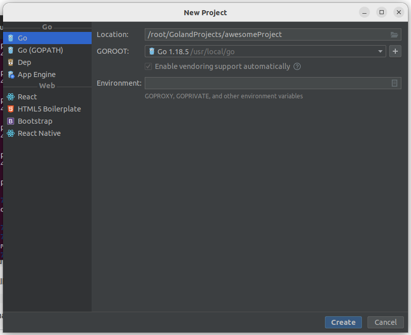
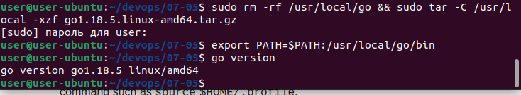
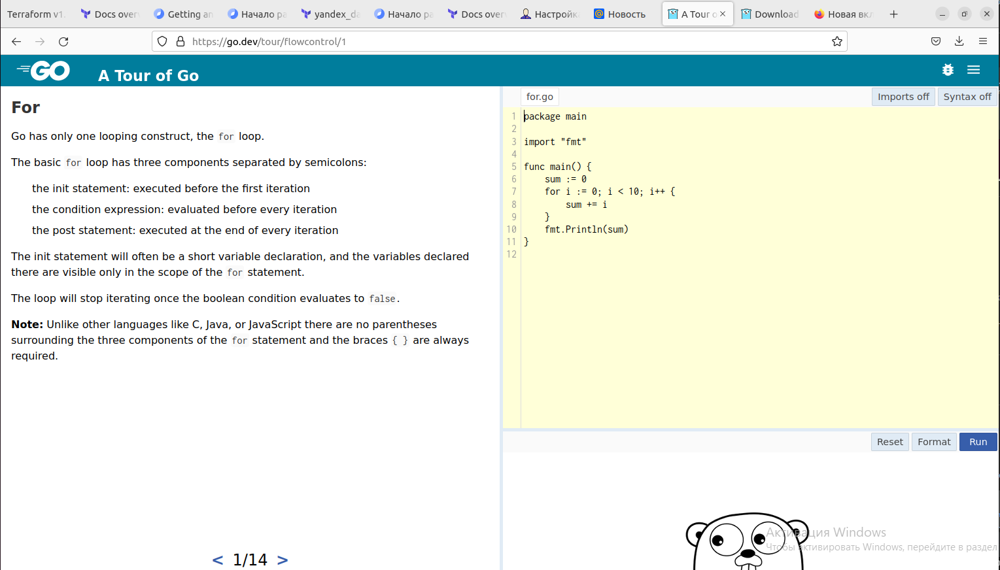
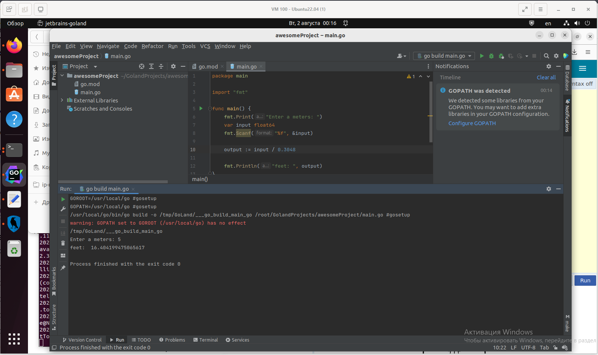
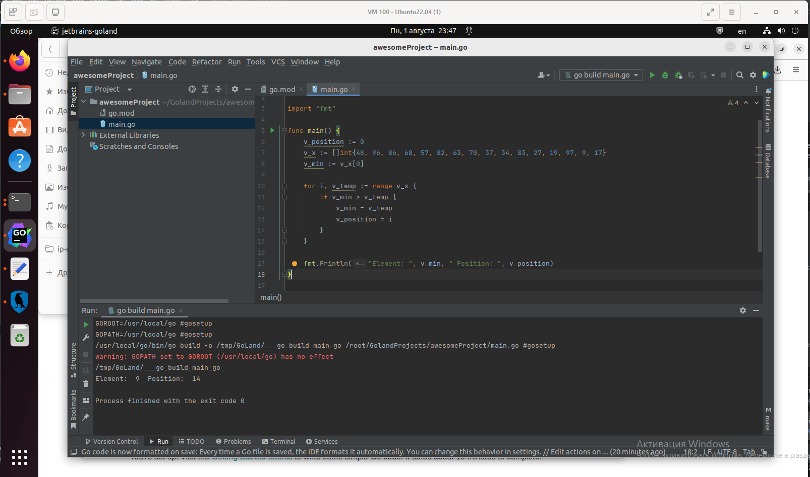
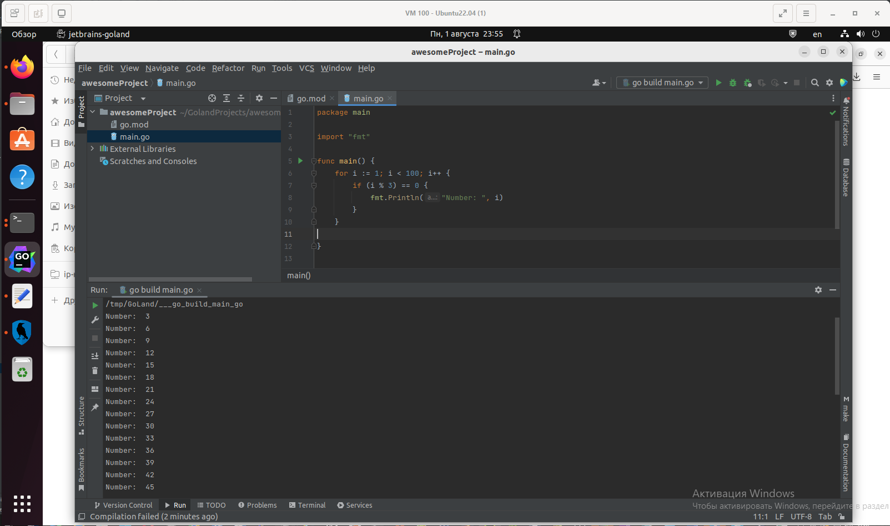

# Домашнее задание к занятию "7.5. Основы golang"

С `golang` в рамках курса, мы будем работать не много, поэтому можно использовать любой IDE. 
Но рекомендуем ознакомиться с [GoLand](https://www.jetbrains.com/ru-ru/go/).  

---

Поставил [GoLand](https://www.jetbrains.com/help/go/installation-guide.html#c8f2840c)

```bash
user@user-ubuntu:~/devops/07-05$ wget https://download.jetbrains.com/go/goland-2022.2.tar.gz
user@user-ubuntu:~/devops/07-05$ sudo tar xzf goland-*.tar.gz -C /opt/
user@user-ubuntu:~/devops/07-05$ sudo /opt/GoLand-2022.2/bin/goland.sh
```



---

## Задача 1. Установите golang.
1. Воспользуйтесь инструкций с официального сайта: [https://golang.org/](https://golang.org/).
2. Так же для тестирования кода можно использовать песочницу: [https://play.golang.org/](https://play.golang.org/).

---

Установил [golang](https://go.dev/doc/install)

```bash
user@user-ubuntu:~/devops/07-05$ wget https://go.dev/dl/go1.18.5.linux-amd64.tar.gz
user@user-ubuntu:~/devops/07-05$ sudo rm -rf /usr/local/go && sudo tar -C /usr/local -xzf go1.18.5.linux-amd64.tar.gz
user@user-ubuntu:~/devops/07-05$ go version
go version go1.18.5 linux/amd64
```



---

## Задача 2. Знакомство с gotour.
У Golang есть обучающая интерактивная консоль [https://tour.golang.org/](https://tour.golang.org/). 
Рекомендуется изучить максимальное количество примеров. В консоли уже написан необходимый код, 
осталось только с ним ознакомиться и поэкспериментировать как написано в инструкции в левой части экрана.  

---

Ознакомился, поэкспериментировал [https://go.dev/tour/welcome/1](https://go.dev/tour/welcome/1)




---

## Задача 3. Написание кода. 
Цель этого задания закрепить знания о базовом синтаксисе языка. Можно использовать редактор кода 
на своем компьютере, либо использовать песочницу: [https://play.golang.org/](https://play.golang.org/).

1. Напишите программу для перевода метров в футы (1 фут = 0.3048 метр). Можно запросить исходные данные 
у пользователя, а можно статически задать в коде.
    Для взаимодействия с пользователем можно использовать функцию `Scanf`:
    ```
    package main
    
    import "fmt"
    
    func main() {
        fmt.Print("Enter a number: ")
        var input float64
        fmt.Scanf("%f", &input)
    
        output := input * 2
    
        fmt.Println(output)    
    }
    ```
---

Подправил пример из задачи:

```go
package main

import "fmt"

func main() {
	fmt.Print("Enter a meters: ")
	var input float64
	fmt.Scanf("%f", &input)

	output := input / 0.3048

	fmt.Println("feet: ", output)
}
```



---

2. Напишите программу, которая найдет наименьший элемент в любом заданном списке, например:
    ```
    x := []int{48,96,86,68,57,82,63,70,37,34,83,27,19,97,9,17,}
    ```
   
---

Использовал список из задачи:

```go
package main

import "fmt"

func main() {
	v_position := 0
	v_x := []int{48, 96, 86, 68, 57, 82, 63, 70, 37, 34, 83, 27, 19, 97, 9, 17,}
	v_min := v_x[0]

	for i, v_temp := range v_x {
		if v_min > v_temp {
			v_min = v_temp
			v_position = i
		}
	}

	fmt.Println("Element: ", v_min, " Position: ", v_position)
}
```



---

3. Напишите программу, которая выводит числа от 1 до 100, которые делятся на 3. То есть `(3, 6, 9, …)`.

В виде решения ссылку на код или сам код. 

---

Цикл `for` и условный оператор `if`:


```go
package main

import "fmt"

func main() {
	for i := 1; i < 100; i++ {
		if (i % 3) == 0 {
			fmt.Println("Number: ", i)
		}
	}

}
```



---

## Задача 4. Протестировать код (не обязательно).

Создайте тесты для функций из предыдущего задания. 

---

### Как cдавать задание

Выполненное домашнее задание пришлите ссылкой на .md-файл в вашем репозитории.

---

