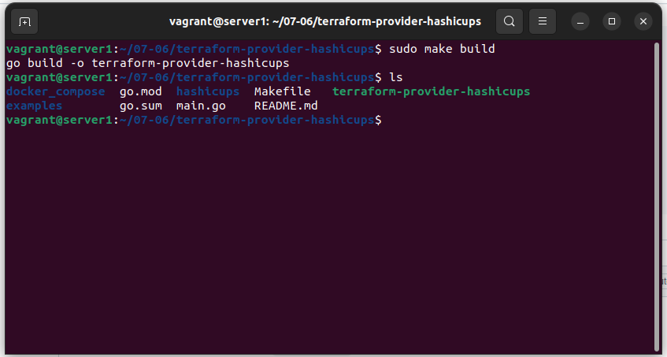
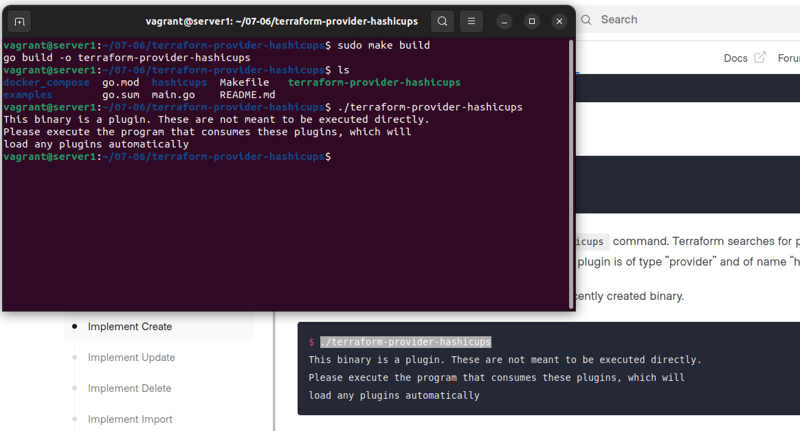
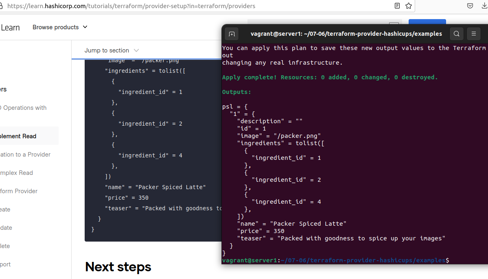

# Домашнее задание к занятию "7.6. Написание собственных провайдеров для Terraform."

Бывает, что 
* общедоступная документация по терраформ ресурсам не всегда достоверна,
* в документации не хватает каких-нибудь правил валидации или неточно описаны параметры,
* понадобиться использовать провайдер без официальной документации,
* может возникнуть необходимость написать свой провайдер для системы используемой в ваших проектах.   

## Задача 1. 
Давайте потренируемся читать исходный код AWS провайдера, который можно склонировать от сюда: 
[https://github.com/hashicorp/terraform-provider-aws.git](https://github.com/hashicorp/terraform-provider-aws.git).
Просто найдите нужные ресурсы в исходном коде и ответы на вопросы станут понятны.  


1. Найдите, где перечислены все доступные `resource` и `data_source`, приложите ссылку на эти строки в коде на 
гитхабе.   

---

`data_source`:

Начиная со строки [413](https://github.com/hashicorp/terraform-provider-aws/blob/aa070f63939156847813ec9c32798cf25e783349/internal/provider/provider.go#L413) 
До строки [909](https://github.com/hashicorp/terraform-provider-aws/blob/aa070f63939156847813ec9c32798cf25e783349/internal/provider/provider.go#L909) 

`resource`

Начиная со строки [911](https://github.com/hashicorp/terraform-provider-aws/blob/aa070f63939156847813ec9c32798cf25e783349/internal/provider/provider.go#L911) 
До строки [2108](https://github.com/hashicorp/terraform-provider-aws/blob/aa070f63939156847813ec9c32798cf25e783349/internal/provider/provider.go#L2108) 


---

2. Для создания очереди сообщений SQS используется ресурс `aws_sqs_queue` у которого есть параметр `name`. 
    * С каким другим параметром конфликтует `name`? Приложите строчку кода, в которой это указано.
    * Какая максимальная длина имени? 
    * Какому регулярному выражению должно подчиняться имя? 
    
---

Строчка [87](https://github.com/hashicorp/terraform-provider-aws/blob/aa070f63939156847813ec9c32798cf25e783349/internal/service/sqs/queue.go#L87)

Максимальная длина

Если судить по строчкам [425](https://github.com/hashicorp/terraform-provider-aws/blob/aa070f63939156847813ec9c32798cf25e783349/internal/service/sqs/queue.go#L425) и [427](https://github.com/hashicorp/terraform-provider-aws/blob/aa070f63939156847813ec9c32798cf25e783349/internal/service/sqs/queue.go#L427), то

75 если оканчивается на `.fifo`

80 если просто имя

Регулярное выражение, строчки [425](https://github.com/hashicorp/terraform-provider-aws/blob/aa070f63939156847813ec9c32798cf25e783349/internal/service/sqs/queue.go#L425) и [427](https://github.com/hashicorp/terraform-provider-aws/blob/aa070f63939156847813ec9c32798cf25e783349/internal/service/sqs/queue.go#L427) :

```go
var re *regexp.Regexp

		if fifoQueue {
			re = regexp.MustCompile(`^[a-zA-Z0-9_-]{1,75}\.fifo$`)
		} else {
			re = regexp.MustCompile(`^[a-zA-Z0-9_-]{1,80}$`)
		}

		if !re.MatchString(name) {
			return fmt.Errorf("invalid queue name: %s", name)
		}
```

---

## Задача 2. (Не обязательно) 
В рамках вебинара и презентации мы разобрали как создать свой собственный провайдер на примере кофемашины. 
Также вот официальная документация о создании провайдера: 
[https://learn.hashicorp.com/collections/terraform/providers](https://learn.hashicorp.com/collections/terraform/providers).

1. Проделайте все шаги создания провайдера.
2. В виде результата приложение ссылку на исходный код.
3. Попробуйте скомпилировать провайдер, если получится то приложите снимок экрана с командой и результатом компиляции.   

___

Проделал шаги из этого пункта [provider-setup](https://learn.hashicorp.com/tutorials/terraform/provider-setup?in=terraform/providers)

Провайдер успешно скомпилировался

```bash
agrant@server1:~/07-06$ git clone --branch boilerplate https://github.com/hashicorp/terraform-provider-hashicups
Cloning into 'terraform-provider-hashicups'...
remote: Enumerating objects: 3502, done.
remote: Total 3502 (delta 0), reused 0 (delta 0), pack-reused 3502
Receiving objects: 100% (3502/3502), 71.46 MiB | 5.14 MiB/s, done.
Resolving deltas: 100% (886/886), done.
vagrant@server1:~/07-06$ cd terraform-provider-hashicups
vagrant@server1:~/07-06/terraform-provider-hashicups$ cd docker_compose && docker-compose up
[+] Running 2/2
 ⠿ Container docker_compose-db-1   Recreated                                                                              0.4s
 ⠿ Container docker_compose-api-1  Recreated                                                                              0.4s
Attaching to docker_compose-api-1, docker_compose-db-1
docker_compose-db-1   | 
docker_compose-db-1   | PostgreSQL Database directory appears to contain a database; Skipping initialization
docker_compose-db-1   | 
docker_compose-db-1   | 2022-08-01 22:11:59.368 UTC [1] LOG:  listening on IPv4 address "0.0.0.0", port 5432
docker_compose-db-1   | 2022-08-01 22:11:59.368 UTC [1] LOG:  listening on IPv6 address "::", port 5432
docker_compose-db-1   | 2022-08-01 22:11:59.387 UTC [1] LOG:  listening on Unix socket "/var/run/postgresql/.s.PGSQL.5432"
docker_compose-db-1   | 2022-08-01 22:11:59.453 UTC [25] LOG:  database system was shut down at 2022-08-01 22:08:44 UTC
docker_compose-db-1   | 2022-08-01 22:11:59.475 UTC [1] LOG:  database system is ready to accept connections
docker_compose-api-1  | 2022-08-01T22:12:00.594Z [INFO]  Starting service: bind=0.0.0.0:9090 metrics=localhost:9102


vagrant@server1:~/07-06$ tree -L 3
.
├── terraform-provider-hashicups
│   ├── docker_compose
│   │   ├── conf.json
│   │   └── docker-compose.yml
│   ├── examples
│   │   ├── coffee
│   │   └── main.tf
│   ├── hashicups
│   │   └── provider.go
│   ├── main.go
│   ├── Makefile
│   └── README.md
└── terraform-provider-hashicups_0.3.1_linux_amd64.zip

vagrant@server1:~/07-06/terraform-provider-hashicups$ go mod init terraform-provider-hashicups
go: creating new go.mod: module terraform-provider-hashicups
go: to add module requirements and sums:
	go mod tidy


vagrant@server1:~/07-06$ wget https://go.dev/dl/go1.18.5.linux-amd64.tar.gz
--2022-08-01 22:15:46--  https://go.dev/dl/go1.18.5.linux-amd64.tar.gz
Resolving go.dev (go.dev)... 216.239.32.21, 216.239.34.21, 216.239.36.21, ...
Connecting to go.dev (go.dev)|216.239.32.21|:443... connected.
HTTP request sent, awaiting response... 302 Found
Location: https://dl.google.com/go/go1.18.5.linux-amd64.tar.gz [following]
--2022-08-01 22:15:47--  https://dl.google.com/go/go1.18.5.linux-amd64.tar.gz
Resolving dl.google.com (dl.google.com)... 142.250.184.206, 2a00:1450:4001:830::200e
Connecting to dl.google.com (dl.google.com)|142.250.184.206|:443... connected.
HTTP request sent, awaiting response... 200 OK
Length: 141855946 (135M) [application/x-gzip]
Saving to: ‘go1.18.5.linux-amd64.tar.gz’

go1.18.5.linux-amd64.t 100%[===========================>] 135.28M  9.69MB/s    in 15s     

2022-08-01 22:16:02 (9.00 MB/s) - ‘go1.18.5.linux-amd64.tar.gz’ saved [141855946/141855946]

vagrant@server1:~/07-06$ sudo rm -rf /usr/local/go && sudo tar -C /usr/local -xzf go1.18.5.linux-amd64.tar.gz
vagrant@server1:~/07-06$ export PATH=$PATH:/usr/local/go/bin

vagrant@server1:~/07-06/terraform-provider-hashicups$ apt install git
vagrant@server1:~/07-06/terraform-provider-hashicups$ sudo apt install make

```






___

---

### Как cдавать задание

Выполненное домашнее задание пришлите ссылкой на .md-файл в вашем репозитории.

---
